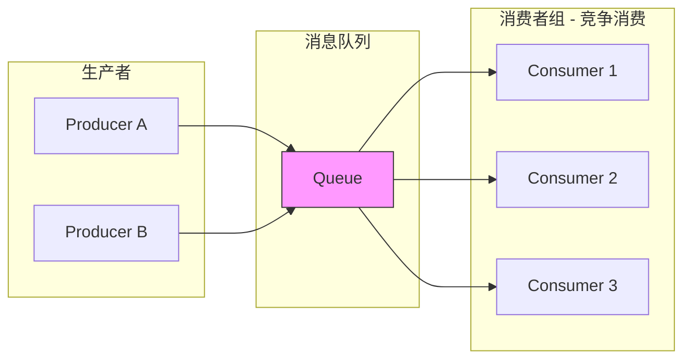
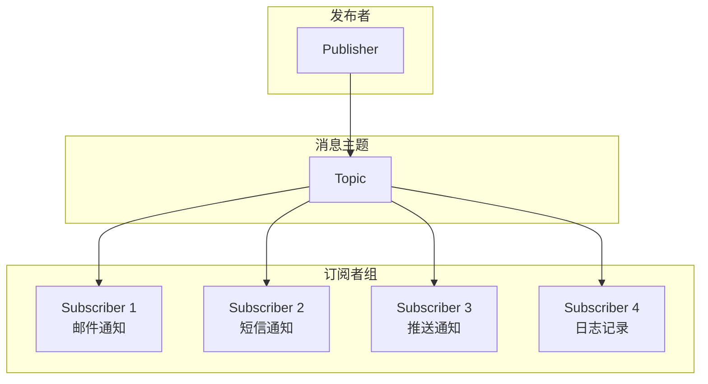
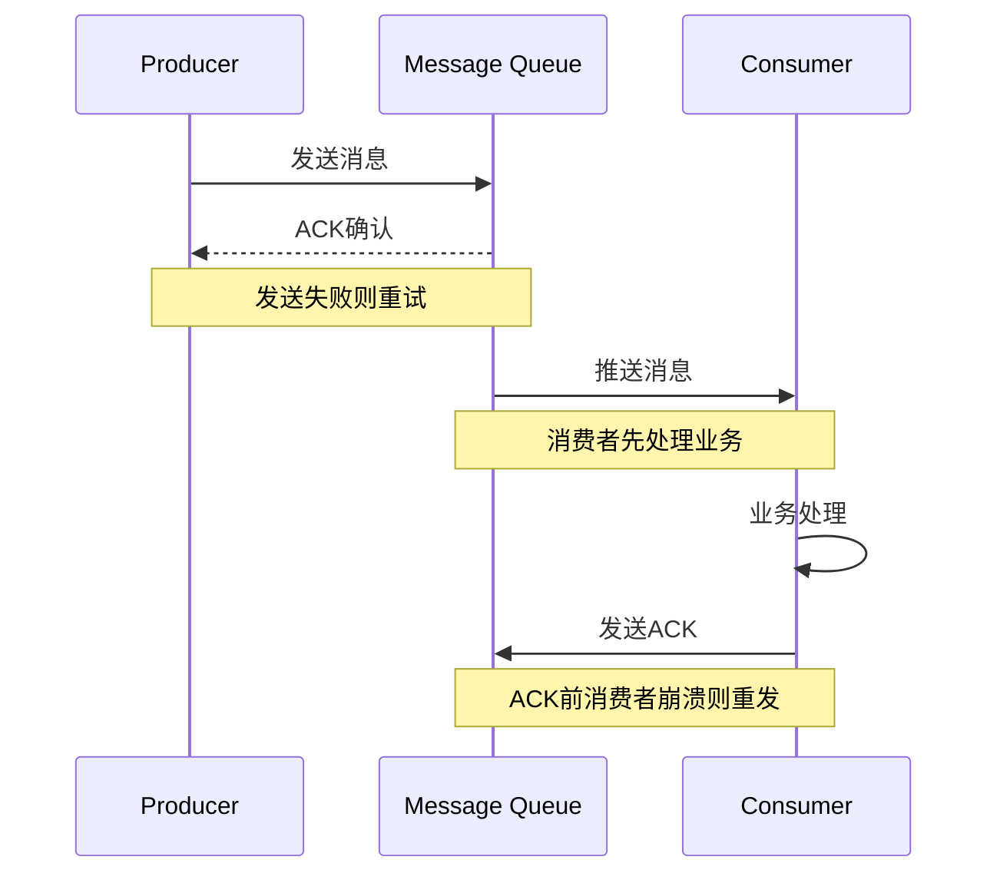
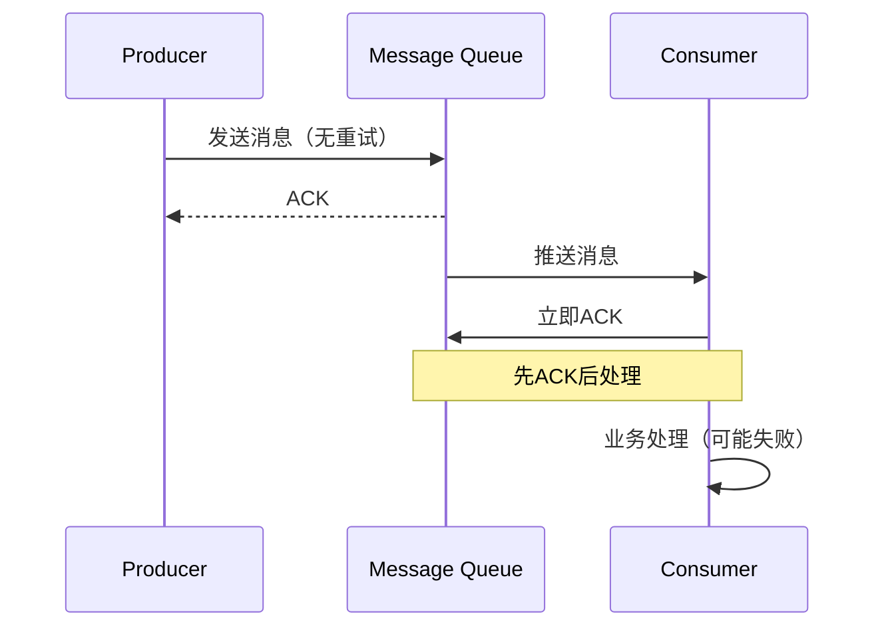
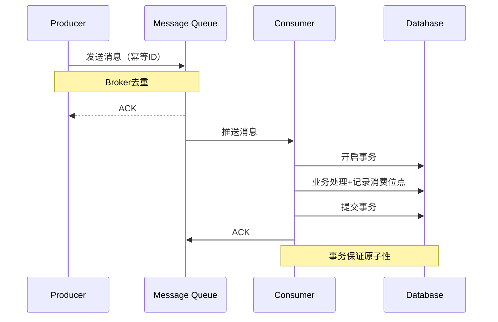

# 消息模式与设计

**文档版本**：v1.0
**创建时间**：2026年
**最后更新**：2026年
**状态**：✅ 已完成

---

## 📋 执行摘要

消息模式是分布式系统异步通信的核心基础，涵盖点对点与发布订阅两种基本模式、多种可靠性保证级别、顺序保证机制以及死信队列、消息回溯等高级特性。正确理解和应用这些模式是构建可靠分布式系统的关键。

---

## 一、核心概念

### 1.1 定义与原理

消息模式定义了消息系统中生产者、消息队列和消费者之间的交互方式。选择合适的消息模式对系统可靠性、可扩展性和性能至关重要。

**核心设计原则**：
- **解耦**：生产者和消费者独立演进
- **异步**：非阻塞通信提升系统吞吐
- **可靠**：消息不丢失、不重复（或可控）
- **有序**：业务需要的顺序保证

### 1.2 关键特性

| 特性 | 描述 |
|------|------|
| **点对点** | 一条消息仅被一个消费者处理 |
| **发布订阅** | 一条消息可被多个消费者接收 |
| **可靠性** | 至少一次、至多一次、恰好一次 |
| **顺序性** | 分区有序或全局有序 |
| **持久化** | 消息持久化存储保证不丢失 |
| **重试** | 消费失败后的重试机制 |
| **死信** | 无法处理消息的隔离机制 |
| **回溯** | 消费历史消息的能力 |

### 1.3 适用场景

| 场景 | 适用性 | 说明 |
|------|--------|------|
| 任务队列 | ⭐⭐⭐⭐⭐ | 点对点竞争消费 |
| 事件通知 | ⭐⭐⭐⭐⭐ | 发布订阅广播 |
| 数据同步 | ⭐⭐⭐⭐ | 至少一次+幂等 |
| 订单处理 | ⭐⭐⭐⭐ | 顺序保证关键 |
| 日志收集 | ⭐⭐⭐⭐ | 高吞吐容忍丢失 |
| 金融交易 | ⭐⭐⭐⭐⭐ | 恰好一次+顺序 |

---

## 二、消息传递模式

### 2.1 点对点模式（Point-to-Point）

#### 模式定义



**核心特点**：
- 每条消息只有一个消费者
- 消费者之间竞争消费
- 消息消费后即删除（或标记）
- 适合任务分发场景

#### 工作队列模式

```
┌─────────────────────────────────────────────────────┐
│                  工作队列模式                        │
├─────────────────────────────────────────────────────┤
│                                                     │
│  任务提交              任务队列           工作进程   │
│  ┌────────┐           ┌──────┐          ┌─────────┐│
│  │ Task 1 │──────────>│      │─────────>│Worker 1 ││
│  │ Task 2 │──────────>│Queue │────┬────>│Worker 2 ││
│  │ Task 3 │──────────>│      │─┬──┼────>│Worker 3 ││
│  │ Task 4 │──────────>│      │ │  └────>│Worker 4 ││
│  └────────┘           └──────┘ └────────>│Worker 5 ││
│                                          └─────────┘│
│                                                     │
│  特点: 任务负载均衡、支持任务重试、动态扩容工作进程   │
│                                                     │
└─────────────────────────────────────────────────────┘
```

#### 代码示例

```java
// RabbitMQ点对点示例
Channel channel = connection.createChannel();
channel.queueDeclare("work_queue", true, false, false, null);

// 生产者
channel.basicPublish("", "work_queue", 
    MessageProperties.PERSISTENT_TEXT_PLAIN, 
    task.getBytes());

// 消费者
channel.basicQos(1); // 每次只接收1条
channel.basicConsume("work_queue", false, (consumerTag, delivery) -> {
    String message = new String(delivery.getBody());
    try {
        doWork(message);
        channel.basicAck(delivery.getEnvelope().getDeliveryTag(), false);
    } catch (Exception e) {
        channel.basicNack(delivery.getEnvelope().getDeliveryTag(), false, true);
    }
}, consumerTag -> {});
```

### 2.2 发布订阅模式（Pub/Sub）

#### 模式定义



**核心特点**：
- 一条消息可被多个订阅者接收
- 订阅者相互独立
- 支持不同的订阅组（消费组）
- 适合事件广播场景

#### 订阅类型对比

| 订阅类型 | 说明 | 适用场景 |
|----------|------|----------|
| **临时订阅** | 消费者断开后订阅取消 | 实时通知 |
| **持久订阅** | 消费者断开后保留消息 | 离线消息 |
| **共享订阅** | 多个消费者共享订阅 | 负载均衡 |
| **独占订阅** | 仅一个消费者可订阅 | 严格顺序 |

#### 发布订阅实现

```java
// Kafka发布订阅示例
Producer<String, String> producer = new KafkaProducer<>(props);
producer.send(new ProducerRecord<>("user-events", userId, eventJson));

// 消费者组1 - 邮件服务
Properties props1 = new Properties();
props1.put(ConsumerConfig.GROUP_ID_CONFIG, "email-service");
KafkaConsumer<String, String> consumer1 = new KafkaConsumer<>(props1);
consumer1.subscribe(Arrays.asList("user-events"));

// 消费者组2 - 短信服务
Properties props2 = new Properties();
props2.put(ConsumerConfig.GROUP_ID_CONFIG, "sms-service");
KafkaConsumer<String, String> consumer2 = new KafkaConsumer<>(props2);
consumer2.subscribe(Arrays.asList("user-events"));

// 同一条消息会被两个消费者组各自消费一次
```

### 2.3 混合模式

#### 队列+主题组合

```
┌─────────────────────────────────────────────────────┐
│                  混合模式架构                        │
├─────────────────────────────────────────────────────┤
│                                                     │
│  订单服务                                            │
│     │                                               │
│     ├──────────────> [order-queue] ───────> 库存服务 │
│     │                  (点对点)                      │
│     │                                               │
│     ├──────────────> [order-topic] ───────> 邮件服务 │
│     │                  (发布订阅)        ──> 短信服务 │
│     │                                    ──> 日志服务 │
│     │                                               │
│     └──────────────> [notify-topic] ──────> WebSocket│
│                        (发布订阅)                    │
│                                                     │
└─────────────────────────────────────────────────────┘
```

---

## 三、消息可靠性

### 3.1 可靠性级别

#### 至少一次（At Least Once）



**实现要点**：
- 生产者重试机制
- 消费者业务处理后ACK
- 业务幂等设计

**适用场景**：大多数业务场景，配合幂等设计使用

#### 至多一次（At Most Once）



**实现要点**：
- 生产者不重试
- 消费者先ACK后处理
- 可能丢失消息

**适用场景**：日志收集、监控数据等容忍丢失的场景

#### 恰好一次（Exactly Once）



**实现方式**：
| 方式 | 说明 | 复杂度 |
|------|------|--------|
| **幂等+至少一次** | 业务层保证幂等 | 中等 |
| **两阶段提交** | 分布式事务 | 高 |
| **事务消息** | 消息队列事务特性 | 中等 |

### 3.2 幂等设计

#### 幂等实现策略

```java
// 方案1: 数据库唯一索引
public void processOrder(String orderId, OrderInfo info) {
    try {
        // 使用orderId作为唯一键
        orderDao.insert(new Order(orderId, info));
    } catch (DuplicateKeyException e) {
        // 重复消息，忽略
        log.warn("Duplicate message: {}", orderId);
    }
}

// 方案2: 分布式锁
public void processPayment(String paymentId, PaymentInfo info) {
    String lockKey = "payment:" + paymentId;
    if (redisLock.tryLock(lockKey, 10, TimeUnit.SECONDS)) {
        try {
            // 检查是否已处理
            if (paymentDao.exists(paymentId)) {
                return; // 已处理，幂等返回
            }
            // 执行业务
            doPayment(info);
            paymentDao.save(new Payment(paymentId, info));
        } finally {
            redisLock.unlock(lockKey);
        }
    }
}

// 方案3: 消费去重表
public void processMessage(String msgId, Message message) {
    // 先去重表查询
    if (idempotenceDao.exists(msgId)) {
        return; // 已消费
    }
    // 执行业务
    doBusiness(message);
    // 记录已消费（唯一索引保证幂等）
    idempotenceDao.insert(new ConsumedMessage(msgId, new Date()));
}
```

---

## 四、消息顺序保证

### 4.1 顺序类型

#### 全局顺序 vs 分区顺序

```
┌─────────────────────────────────────────────────────┐
│                   顺序性对比                         │
├─────────────────────────────────────────────────────┤
│                                                     │
│  全局顺序 (Global Ordering)                          │
│  ┌───────────────────────────────────────────────┐ │
│  │  M1 -> M2 -> M3 -> M4 -> M5 -> M6             │ │
│  │   ↓    ↓    ↓    ↓    ↓    ↓                  │ │
│  │  C1                              (单消费者)    │ │
│  └───────────────────────────────────────────────┘ │
│  特点: 严格有序，性能受限（单队列单消费者）          │
│                                                     │
│  分区顺序 (Partition Ordering)                       │
│  ┌───────────────────────────────────────────────┐ │
│  │  Partition 0:  M1 -> M3 -> M5                 │ │
│  │                 ↓    ↓    ↓                   │ │
│  │                C1                              │ │
│  │                                                 ││
│  │  Partition 1:  M2 -> M4 -> M6                 │ │
│  │                 ↓    ↓    ↓                   │ │
│  │                C2                              │ │
│  └───────────────────────────────────────────────┘ │
│  特点: 同一分区有序，分区间无序，可并行消费          │
│                                                     │
└─────────────────────────────────────────────────────┘
```

### 4.2 分区顺序实现

#### 按Key分区

```java
// Kafka分区顺序实现
Producer<String, String> producer = new KafkaProducer<>(props);

// 使用orderId作为Key，保证同一订单的消息进入同一分区
String orderId = "ORDER_12345";
String event = "{\"event\":\"PAYMENT_SUCCESS\",\"orderId\":\""+orderId+"\"}";

producer.send(new ProducerRecord<>("orders", orderId, event));

// 消费者配置 - 单线程消费保证顺序
props.put(ConsumerConfig.MAX_POLL_RECORDS_CONFIG, "1");
props.put(ConsumerConfig.MAX_POLL_INTERVAL_MS_CONFIG, "300000");

// 或使用Kafka Streams保证顺序处理
StreamsBuilder builder = new StreamsBuilder();
builder.stream("orders", Consumed.with(Serdes.String(), Serdes.String()))
    .groupByKey()
    .aggregate(
        OrderState::new,
        (key, event, state) -> state.apply(event),
        Materialized.with(Serdes.String(), new OrderStateSerde())
    );
```

#### RocketMQ顺序消息

```java
// RocketMQ顺序消息
DefaultMQProducer producer = new DefaultMQProducer("order_group");
producer.start();

// 使用MessageQueueSelector确保同一业务ID的消息进入同一队列
SendResult sendResult = producer.send(msg, new MessageQueueSelector() {
    @Override
    public MessageQueue select(List<MessageQueue> mqs, Message msg, Object arg) {
        Long orderId = (Long) arg;
        // 取模选择队列
        long index = orderId % mqs.size();
        return mqs.get((int) index);
    }
}, orderId);

// 消费者使用顺序消费模式
DefaultMQPushConsumer consumer = new DefaultMQPushConsumer("order_consumer");
consumer.registerMessageListener(new MessageListenerOrderly() {
    @Override
    public ConsumeOrderlyStatus consumeMessage(List<MessageExt> msgs, ConsumeOrderlyContext context) {
        for (MessageExt msg : msgs) {
            processOrderMessage(msg);
        }
        return ConsumeOrderlyStatus.SUCCESS;
    }
});
```

### 4.3 顺序消费与性能权衡

| 策略 | 顺序性 | 吞吐量 | 适用场景 |
|------|--------|--------|----------|
| **全局顺序** | 严格 | 低 | 金融交易、库存扣减 |
| **分区顺序** | 分区严格 | 中 | 订单处理、用户行为 |
| **无序** | 无 | 高 | 日志收集、监控数据 |

---

## 五、死信队列与消息回溯

### 5.1 死信队列（DLQ）

#### 概念与设计

```
┌─────────────────────────────────────────────────────┐
│                   死信队列机制                       │
├─────────────────────────────────────────────────────┤
│                                                     │
│  正常队列                    重试机制               │
│  ┌─────────┐               ┌──────────┐            │
│  │ Message │──消费失败────>│ 重试队列  │            │
│  └─────────┘               │ (延迟)   │            │
│       │                    └────┬─────┘            │
│       │                         │重试N次           │
│       │                    仍失败│                 │
│       │                    ┌────┴─────┐            │
│       │                    ▼          │            │
│       │               ┌─────────┐     │            │
│       └──────────────>│ 死信队列 │<────┘            │
│                       │  (DLQ)  │                  │
│                       └────┬────┘                  │
│                            │                       │
│                            ▼                       │
│                      ┌──────────┐                  │
│                      │ 人工处理  │                  │
│                      │ 或自动化  │                  │
│                      └──────────┘                  │
│                                                     │
└─────────────────────────────────────────────────────┘
```

#### 死信队列配置

```java
// RocketMQ死信队列
DefaultMQPushConsumer consumer = new DefaultMQPushConsumer("consumer_group");
consumer.setMaxReconsumeTimes(16); // 最大重试次数
// 超过16次进入%RETRY%consumer_group或%DLQ%consumer_group

// Kafka死信队列实现
@Bean
public DeadLetterPublishingRecoverer deadLetterPublishingRecoverer(
        KafkaTemplate<String, Object> template) {
    return new DeadLetterPublishingRecoverer(template, (record, ex) -> {
        // 自定义死信Topic命名规则
        return new TopicPartition(record.topic() + ".dlq", record.partition());
    });
}

@Bean
public DefaultErrorHandler errorHandler(DeadLetterPublishingRecoverer recoverer) {
    DefaultErrorHandler handler = new DefaultErrorHandler(recoverer, 
        new FixedBackOff(1000L, 3L)); // 3次重试，间隔1秒
    return handler;
}

// RabbitMQ死信队列
@Bean
public Queue mainQueue() {
    return QueueBuilder.durable("main.queue")
        .withArgument("x-dead-letter-exchange", "dlx.exchange")
        .withArgument("x-dead-letter-routing-key", "dlx.routing.key")
        .withArgument("x-message-ttl", 30000) // 30秒过期
        .withArgument("x-max-retries", 3)
        .build();
}
```

### 5.2 消息回溯

#### 回溯机制

```
┌─────────────────────────────────────────────────────┐
│                   消息回溯机制                       │
├─────────────────────────────────────────────────────┤
│                                                     │
│  消息时间线                                          │
│  ────────────────────────────────────────────────>  │
│                                                     │
│  [M1]──[M2]──[M3]──[M4]──[M5]──[M6]──[M7]──[M8]   │
│   ↑                                          ↑     │
│  Start                                    Latest   │
│                                                     │
│  消费位点                                          │
│  ├─ 最新位点: 指向最新消息                         │
│  ├─ 历史位点: 可回溯到任意时间点                   │
│  └─ 提交位点: 已确认消费的位置                     │
│                                                     │
│  回溯场景:                                          │
│  1. 业务逻辑错误，需要重新处理                     │
│  2. 数据丢失恢复                                   │
│  3. 新系统接入需要历史数据                         │
│  4. 审计与合规要求                                 │
│                                                     │
└─────────────────────────────────────────────────────┘
```

#### 回溯实现

```java
// Kafka按时间回溯
KafkaConsumer<String, String> consumer = new KafkaConsumer<>(props);
consumer.subscribe(Arrays.asList("events"));

// 回溯到30分钟前
Map<TopicPartition, Long> timestamps = new HashMap<>();
for (TopicPartition partition : consumer.assignment()) {
    timestamps.put(partition, System.currentTimeMillis() - 30 * 60 * 1000);
}
Map<TopicPartition, OffsetAndTimestamp> offsets = 
    consumer.offsetsForTimes(timestamps);
    
for (TopicPartition partition : offsets.keySet()) {
    OffsetAndTimestamp offset = offsets.get(partition);
    if (offset != null) {
        consumer.seek(partition, offset.offset());
    }
}

// RocketMQ按时间回溯
DefaultMQPushConsumer consumer = new DefaultMQPushConsumer("group");
// 设置消费位点为30分钟前
consumer.setConsumeTimestamp(UtilAll.timeMillisToHumanString(
    System.currentTimeMillis() - 30 * 60 * 1000));

// Pulsar按MessageId回溯
Consumer<String> consumer = client.newConsumer(Schema.STRING)
    .topic("my-topic")
    .subscriptionName("my-sub")
    .subscriptionInitialPosition(SubscriptionInitialPosition.Earliest)
    .seek(MessageId.earliest) // 回溯到最早
    .subscribe();
```

---

## 六、系统对比

### 6.1 消息模式支持对比

| 特性 | Kafka | RocketMQ | Pulsar | RabbitMQ |
|------|-------|----------|--------|----------|
| 点对点 | ✅ 支持 | ✅ 支持 | ✅ 支持 | ✅ 原生支持 |
| 发布订阅 | ✅ 原生 | ✅ 支持 | ✅ 原生 | ✅ 支持 |
| 至少一次 | ✅ 支持 | ✅ 支持 | ✅ 支持 | ✅ 支持 |
| 恰好一次 | ⚠️ 有限 | ✅ 事务消息 | ✅ 支持 | ⚠️ 有限 |
| 全局顺序 | ✅ 单分区 | ✅ 支持 | ✅ 支持 | ✅ 支持 |
| 分区顺序 | ✅ 支持 | ✅ 支持 | ✅ 支持 | ✅ 支持 |
| 死信队列 | ✅ 支持 | ✅ 原生 | ✅ 支持 | ✅ 原生 |
| 消息回溯 | ✅ 支持 | ✅ 支持 | ✅ 分层存储 | ⚠️ 有限 |

### 6.2 选型决策树

```
消息系统选型
├── 需要严格事务支持（恰好一次）？
│   ├── 是 → RocketMQ/Pulsar
│   └── 否 → 继续判断
├── 需要复杂路由规则？
│   ├── 是 → RabbitMQ
│   └── 否 → 继续判断
├── 需要海量存储+回溯？
│   ├── 是 → Pulsar（分层存储）
│   └── 否 → 继续判断
├── 需要极高吞吐？
│   ├── 是 → Kafka
│   └── 否 → 继续判断
├── 需要企业级控制台？
│   ├── 是 → RocketMQ
│   └── 否 → 根据团队熟悉度选择
└── 需要云原生/K8s部署？
    ├── 是 → Pulsar/Kafka
    └── 否 → 综合考虑
```

---

## 七、实践指南

### 7.1 消息设计最佳实践

1. **消息体设计**
   ```json
   {
     "msgId": "uuid-12345",
     "bizId": "ORDER_12345",
     "bizType": "ORDER_PAYMENT",
     "version": "1.0",
     "timestamp": 1699123456789,
     "payload": {
       "orderId": "ORDER_12345",
       "amount": 199.99,
       "status": "PAID"
     }
   }
   ```

2. **Topic命名规范**
   ```
   {业务域}_{事件类型}_{版本}
   例如: order_payment_v1, user_register_v1
   ```

3. **消费者配置建议**
   ```properties
   # Kafka消费者
   max.poll.records=500          # 单次拉取消息数
   max.poll.interval.ms=300000   # 处理超时时间
   enable.auto.commit=false      # 手动提交offset
   auto.offset.reset=earliest    # 无offset时从头消费
   ```

### 7.2 常见问题

**Q1: 消息丢失如何处理？**
A: 
- 生产者：开启同步发送+失败重试
- Broker：开启同步刷盘+主从复制
- 消费者：业务处理完成后再ACK
- 监控：设置消息堆积告警

**Q2: 消息重复消费怎么办？**
A:
- 业务层实现幂等（推荐）
- 使用去重表记录已消费消息
- 分布式锁保证同一消息串行处理

**Q3: 消息顺序和性能如何平衡？**
A:
- 仅对需要顺序的消息使用分区顺序
- 无顺序要求的业务使用多分区并行
- 考虑使用Saga模式替代长事务

**Q4: 如何设计消息重试策略？**
A:
- 指数退避：1s, 2s, 4s, 8s, 16s...
- 最大重试次数：3-16次
- 重试间隔上限：5-10分钟
- 最终进入死信队列人工处理

---

## 八、与其他主题的关联

### 8.1 上游依赖

- [Kafka架构](./Kafka架构.md)
- [RocketMQ深度分析](./RocketMQ深度分析.md)
- [Pulsar架构](./Pulsar架构.md)

### 8.2 下游应用

- [分布式事务](../distributed-transaction/分布式事务.md)
- [实时数仓架构](../../06-computing/stream/实时数仓架构.md)

### 8.3 相关概念

| 概念 | 关系 | 说明 |
|------|------|------|
| 幂等性 | 扩展 | 保证消息可靠性的关键 |
|  Saga模式 | 应用 | 基于消息的长事务方案 |
|  Event Sourcing | 应用 | 基于消息回溯的事件溯源 |
|  CQRS | 应用 | 命令查询分离，依赖消息同步 |

---

## 九、参考资源

### 9.1 技术规范

1. [CloudEvents规范](https://cloudevents.io/) - 云原生事件标准
2. [AsyncAPI](https://www.asyncapi.com/) - 异步API规范

### 9.2 学习资料

1. [企业集成模式](https://www.enterpriseintegrationpatterns.com/) - 经典书籍
2. [ Designing Data-Intensive Applications](https://dataintensive.net/) - DDIA第11章

### 9.3 相关文档

- [Kafka架构](./Kafka架构.md)
- [RocketMQ深度分析](./RocketMQ深度分析.md)
- [Pulsar架构](./Pulsar架构.md)
- [实时数仓架构](../../06-computing/stream/实时数仓架构.md)

---

**维护者**：项目团队
**最后更新**：2026年
