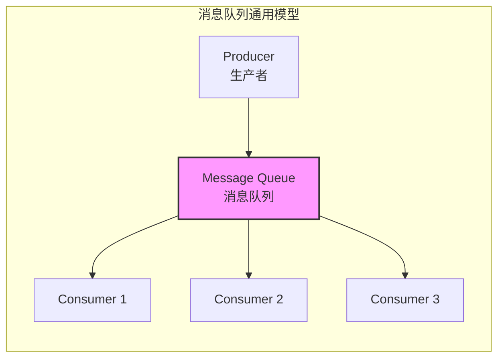
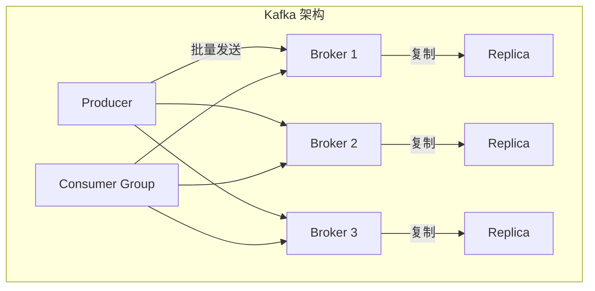
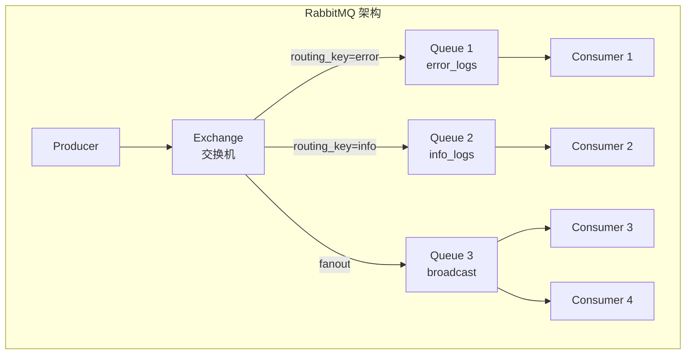
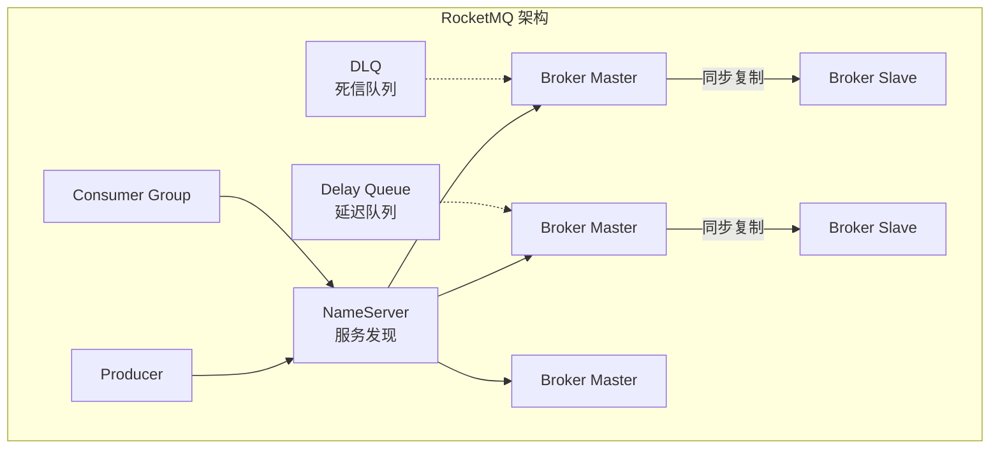
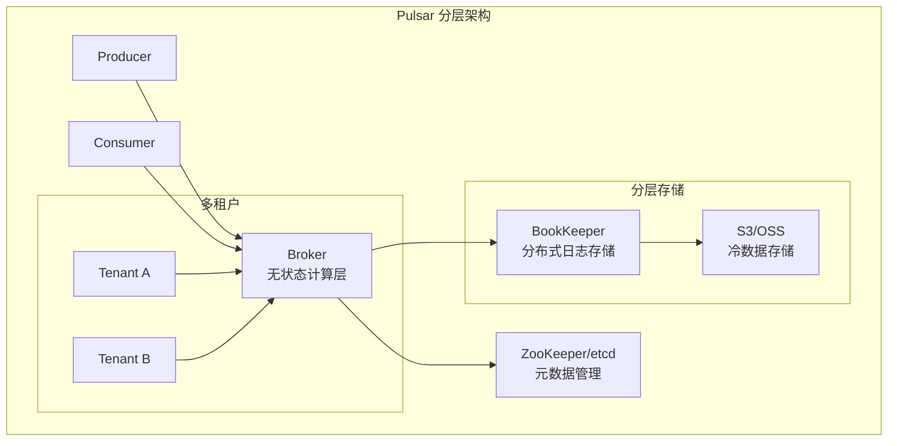

# 消息队列选型指南

**文档版本**：v1.0
**创建时间**：2026年4月
**最后更新**：2026年4月
**状态**：✅ 已完成

---

## 📋 执行摘要

消息队列是现代分布式系统的核心组件，选择合适的消息队列直接影响系统的可靠性、性能和可维护性。本指南全面对比Kafka、RabbitMQ、RocketMQ和Pulsar四大主流消息队列，从架构、性能、功能、生态等多维度分析，提供清晰的选型决策框架。

---

## 一、核心概念

### 1.1 消息队列基础模型



**消息队列核心能力**：

| 能力 | 说明 | 典型场景 |
|------|------|----------|
| **异步通信** | 解耦生产者和消费者 | 订单处理、邮件发送 |
| **流量削峰** | 缓冲突发流量 | 秒杀、大促活动 |
| **数据分发** | 一对多消息广播 | 日志收集、配置更新 |
| **可靠传输** | 确保消息不丢失 | 金融交易、状态同步 |

### 1.2 关键特性对比维度

- 架构模型（日志存储 vs 队列路由）
- 性能指标（吞吐量、延迟、堆积能力）
- 功能特性（顺序、事务、延迟消息）
- 运维能力（扩展性、高可用）
- 生态系统（社区、云服务）

### 1.3 适用场景概览

| 场景 | Kafka | RabbitMQ | RocketMQ | Pulsar |
|------|-------|----------|----------|--------|
| 日志收集 | 5星 | 2星 | 3星 | 4星 |
| 流式处理 | 5星 | 2星 | 3星 | 4星 |
| 微服务通信 | 3星 | 5星 | 4星 | 4星 |
| 金融交易 | 3星 | 3星 | 5星 | 4星 |
| 实时推送 | 2星 | 4星 | 3星 | 5星 |
| 多云部署 | 3星 | 3星 | 2星 | 5星 |

---

## 二、四大消息队列详解

### 2.1 Apache Kafka



**核心设计理念**：

- **日志存储模型**：消息持久化到磁盘，支持回溯消费
- **零拷贝优化**：sendfile系统调用提升吞吐量
- **分区并行**：通过分区实现水平扩展

**技术优势**：

| 维度 | 详情 |
|------|------|
| **吞吐量** | 百万级TPS，单机可达每秒数十万消息 |
| **扩展性** | 线性扩展，支持数千Broker、百万分区（KRaft） |
| **生态** | 与Spark、Flink、Storm深度集成 |
| **云原生** | Confluent Cloud托管服务成熟 |

**技术限制**：

- 消息延迟较高（毫秒级）
- 不支持延迟消息（需外部实现）
- 无死信队列机制
- 消费失败处理复杂

---

### 2.2 RabbitMQ



**核心设计理念**：

- **AMQP协议**：标准化消息路由协议
- **灵活路由**：Exchange支持Direct、Topic、Fanout、Headers
- **内存优先**：优先内存存储，持久化可选

**技术优势**：

| 维度 | 详情 |
|------|------|
| **路由能力** | 业界最灵活的消息路由机制 |
| **延迟** | 微秒级延迟，低延迟首选 |
| **功能丰富** | 死信队列、延迟消息、优先级队列、消息TTL |
| **协议支持** | AMQP、MQTT、STOMP多协议 |

**技术限制**：

- 吞吐量相对较低（5-10万TPS）
- 镜像队列扩展性有限
- 消息堆积性能下降明显
- Erlang语言学习曲线陡峭

---

### 2.3 Apache RocketMQ



**核心设计理念**：

- **金融级可靠**：阿里双11验证，支持事务消息
- **功能全面**：原生支持延迟、顺序、事务消息
- **存储优化**：CommitLog顺序写，ConsumeQueue索引

**技术优势**：

| 维度 | 详情 |
|------|------|
| **事务消息** | 完善的分布式事务支持（半消息+回查） |
| **延迟消息** | 18个延迟级别，精确到秒级 |
| **顺序消息** | 全局顺序和分区顺序支持 |
| **消息过滤** | Broker端Tag过滤，减少网络传输 |

**技术限制**：

- 社区主要由阿里维护，生态相对封闭
- 国外社区活跃度较低
- 与K8s集成不如Pulsar成熟

---

### 2.4 Apache Pulsar



**核心设计理念**：

- **存算分离**：Broker无状态，存储层独立扩展
- **分层存储**：热数据BookKeeper，冷数据对象存储
- **多租户**：原生的多租户支持，资源隔离

**技术优势**：

| 维度 | 详情 |
|------|------|
| **云原生** | 存算分离架构，K8s原生支持 |
| **无限堆积** | 分层存储支持海量历史数据 |
| **多租户** | 企业级多租户，资源配额管理 |
| **Geo复制** | 跨地域复制，全局数据同步 |

**技术限制**：

- 部署复杂度较高（需BookKeeper、ZooKeeper）
- 社区相对较新，生态不如Kafka成熟
- 运维门槛较高

---

## 三、系统对比

### 3.1 架构对比矩阵

| 维度 | Kafka | RabbitMQ | RocketMQ | Pulsar |
|------|-------|----------|----------|--------|
| **开发语言** | Scala/Java | Erlang | Java | Java |
| **架构模型** | 日志存储 | 队列路由 | 日志存储 | 存算分离 |
| **通信模式** | Pull | Push | Pull | Push/Pull |
| **元数据管理** | ZooKeeper/KRaft | Mnesia | NameServer | ZooKeeper/etcd |
| **存储引擎** | 本地磁盘 | 内存+磁盘 | CommitLog | BookKeeper+对象存储 |
| **一致性协议** | ISR | 镜像队列 | 主从同步 | Quorum Write |

### 3.2 功能特性矩阵

| 功能特性 | Kafka | RabbitMQ | RocketMQ | Pulsar |
|----------|-------|----------|----------|--------|
| **消息持久化** | 是 | 是 | 是 | 是 |
| **消息回溯** | 是 | 有限 | 是 | 是 |
| **消息TTL** | 否 | 是 | 是 | 是 |
| **延迟消息** | 否 | 是 | 是 | 是 |
| **定时消息** | 否 | 是 | 否 | 是 |
| **事务消息** | 是 | 是 | 是 | 是 |
| **顺序消息** | 是 | 是 | 是 | 是 |
| **死信队列** | 否 | 是 | 是 | 是 |
| **消息轨迹** | 有限 | 是 | 是 | 是 |
| **消息过滤** | 客户端 | Broker端 | Broker端 | Broker端 |
| **优先级队列** | 否 | 是 | 否 | 否 |
| **延迟级别** | 无 | 自定义 | 18级 | 自定义 |

### 3.3 性能基准对比

**吞吐量对比**：

```
Kafka:     ████████████████████████████████████████  1,000,000+ TPS
Pulsar:    ██████████████████████████               500,000+ TPS
RocketMQ:  ███████████████                          100,000+ TPS
RabbitMQ:  ██                                         50,000+ TPS
```

**延迟对比**：

```
RabbitMQ:  █                                          < 1 ms
RocketMQ:  ████                                       1-5 ms
Pulsar:    ███████                                    5-10 ms
Kafka:     ██████████                                 5-20 ms
```

**详细性能数据**：

| 指标 | Kafka | RabbitMQ | RocketMQ | Pulsar |
|------|-------|----------|----------|--------|
| **单机吞吐量** | 100万+ TPS | 5-10万 TPS | 10万+ TPS | 50万+ TPS |
| **端到端延迟** | 5-20ms | 100us-1ms | 1-5ms | 5-10ms |
| **消息堆积** | TB级 | GB级（内存限制） | TB级 | PB级（分层存储） |
| **水平扩展** | 线性扩展 | 扩展复杂 | 线性扩展 | 线性扩展 |
| **单Topic分区** | 200+ | 无分区概念 | 无限制 | 无限制 |

### 3.4 高可用与可靠性对比

| 维度 | Kafka | RabbitMQ | RocketMQ | Pulsar |
|------|-------|----------|----------|--------|
| **复制机制** | ISR | 镜像队列 | 主从同步 | Quorum Write |
| **数据一致性** | 最终一致 | 强一致 | 主从一致 | 强一致 |
| **故障切换** | 自动选举 | 自动切换 | 自动切换 | 自动切换 |
| **跨AZ部署** | 支持 | 支持 | 支持 | 支持 |
| **跨Region复制** | MirrorMaker | Federation | 支持 | Geo-Replication |

---

## 四、适用场景对比

### 4.1 场景详细分析

#### 场景1：日志收集与聚合

**需求特征**：

- 高吞吐量（海量日志）
- 消息可丢失（部分日志）
- 顺序消费（按时间）
- 回溯能力（排查问题）

**推荐排序**：

1. **Kafka**（首选）：专为日志设计，吞吐量最高
2. **Pulsar**：分层存储适合长期归档
3. **RocketMQ**：功能全面，阿里生态可选
4. **RabbitMQ**：不适合（吞吐量低）

#### 场景2：微服务异步通信

**需求特征**：

- 复杂路由（服务解耦）
- 延迟敏感（用户体验）
- 功能丰富（死信、延迟）
- 易于开发（低门槛）

**推荐排序**：

1. **RabbitMQ**（首选）：AMQP灵活路由，功能最全
2. **RocketMQ**：事务消息支持分布式事务
3. **Pulsar**：云原生，适合K8s环境
4. **Kafka**：路由能力弱，延迟较高

#### 场景3：金融交易系统

**需求特征**：

- 绝对可靠（不能丢消息）
- 事务支持（分布式事务）
- 顺序保证（交易顺序）
- 审计追溯（合规要求）

**推荐排序**：

1. **RocketMQ**（首选）：阿里双11验证，事务消息完善
2. **Pulsar**：强一致，多租户隔离
3. **RabbitMQ**：镜像队列强一致
4. **Kafka**：ISR机制可能丢消息

#### 场景4：实时流处理

**需求特征**：

- 高吞吐（实时数据流）
- 低延迟（实时计算）
- 流处理生态（Flink/Spark）
- 状态管理（窗口计算）

**推荐排序**：

1. **Kafka**（首选）：与Flink/Spark深度集成
2. **Pulsar**：内置Pulsar Functions
3. **RocketMQ**：Spark集成较弱
4. **RabbitMQ**：不适合流处理

### 4.2 选型决策树

```
开始选型
│
├─ 主要场景是日志/流处理？
│  ├─ 是
│  │  ├─ 需要分层存储/无限堆积？
│  │  │  ├─ 是 → Pulsar
│  │  │  └─ 否 → Kafka
│  │  └─ 结束
│  └─ 否 → 继续
│
├─ 需要复杂消息路由？
│  ├─ 是
│  │  ├─ 部署在K8s云原生环境？
│  │  │  ├─ 是 → Pulsar
│  │  │  └─ 否 → RabbitMQ
│  │  └─ 结束
│  └─ 否 → 继续
│
├─ 需要金融级可靠/事务消息？
│  ├─ 是
│  │  ├─ 阿里云生态？
│  │  │  ├─ 是 → RocketMQ
│  │  │  └─ 否 → RocketMQ（或Pulsar）
│  │  └─ 结束
│  └─ 否 → 继续
│
├─ 需要延迟消息/死信队列？
│  ├─ 是 → RabbitMQ
│  └─ 否 → 继续
│
├─ 需要多租户/云服务？
│  ├─ 是 → Pulsar
│  └─ 否 → 继续
│
└─ 综合评估
   ├─ 吞吐量优先 → Kafka
   ├─ 延迟优先 → RabbitMQ
   ├─ 功能全面 → RocketMQ
   └─ 云原生 → Pulsar
```

---

## 五、实践指南

### 5.1 部署架构建议

**Kafka 部署架构**：

```yaml
# 生产环境：3 Broker + KRaft
clusters:
  - name: kafka-prod
    mode: kraft
    brokers: 3
    replication_factor: 3
    min_isr: 2

    resources:
      cpu: 8
      memory: 32Gi
      storage: 1Ti
      storage_class: ssd
```

**RabbitMQ 部署架构**：

```yaml
# 生产环境：3节点镜像队列集群
clusters:
  - name: rabbitmq-prod
    nodes: 3
    queue_mode: quorum

    resources:
      cpu: 4
      memory: 16Gi
      disk: 100Gi
```

**RocketMQ 部署架构**：

```yaml
# 生产环境：2组Broker + 2 NameServer
clusters:
  - name: rocketmq-prod
    nameservers: 2
    broker_groups: 2
    masters_per_group: 1
    slaves_per_group: 2

    resources:
      cpu: 8
      memory: 16Gi
      storage: 500Gi
```

**Pulsar 部署架构**：

```yaml
# 生产环境：3 Broker + 3 BookKeeper + 3 ZooKeeper
clusters:
  - name: pulsar-prod
    brokers: 3
    bookies: 3
    zookeepers: 3
    storage_tiering: true

    resources:
      broker:
        cpu: 8
        memory: 16Gi
      bookkeeper:
        cpu: 16
        memory: 32Gi
        storage: 2Ti
```

### 5.2 最佳实践

**通用最佳实践**：

1. **监控先行**
   - 吞吐量 (Messages/sec)
   - 延迟 (Produce/Consume Latency)
   - 堆积量 (Lag)
   - 错误率 (Error Rate)
   - 节点健康 (Node Health)

2. **容量规划**

   ```
   磁盘容量 = 日均消息量 x 消息大小 x 保留天数 x 副本数 x 1.2(余量)
   内存容量 = 活跃消息数 x 平均消息大小 x 2
   分区数 = max(预期吞吐量/单分区吞吐, 消费者数)
   ```

3. **高可用设计**
   - 跨可用区部署
   - 自动故障切换
   - 定期备份元数据
   - 灾难恢复演练

### 5.3 常见问题

**Q1: 小规模项目选哪个？**

A:

- **< 1000 TPS**：RabbitMQ（部署简单，功能丰富）
- **1000-10000 TPS**：RocketMQ 或 Kafka
- **> 10000 TPS**：Kafka
- **云原生/K8s**：Pulsar 或 Kafka（Strimzi）

**Q2: 从RabbitMQ迁移到Kafka要注意什么？**

A:

1. 路由转换：将Exchange路由逻辑转为Topic设计
2. 延迟消息：Kafka不支持，需用外部调度
3. 死信队列：Kafka不支持，需在应用层实现
4. 消费确认：从ACK模式转为Offset提交

**Q3: 云服务选择建议？**

A:

- **阿里云**：RocketMQ（原生支持最佳）
- **AWS**：Amazon MSK（Kafka托管）
- **Azure**：Event Hubs（Kafka兼容）
- **GCP**：Pub/Sub（Pulsar类似设计）
- **多云**：Pulsar 或 Confluent Cloud

---

## 六、与其他主题的关联

### 6.1 上游依赖

- [Kafka架构深度分析](./Kafka架构深度分析.md)
- [RabbitMQ架构](./RabbitMQ架构.md)
- [CAP理论与一致性模型](../../01-fundamentals/distributed-systems/cap-theorem.md)

### 6.2 下游应用

- [事件驱动架构](../../02-architecture/event-driven-architecture.md)
- [微服务通信模式](../microservices/communication-patterns.md)
- [流处理引擎](../stream-processing/stream-processing-overview.md)

### 6.3 相关概念

| 概念 | 关系 | 说明 |
|------|------|------|
| 事件溯源 | 应用场景 | Kafka是事件溯源的首选存储 |
| CQRS | 架构模式 | 消息队列实现命令与查询分离 |
| Saga模式 | 事务模式 | 使用消息队列实现分布式事务 |

---

## 七、参考资源

### 7.1 官方文档

1. [Apache Kafka Documentation](https://kafka.apache.org/documentation/)
2. [RabbitMQ Documentation](https://www.rabbitmq.com/documentation.html)
3. [Apache RocketMQ Documentation](https://rocketmq.apache.org/docs/)
4. [Apache Pulsar Documentation](https://pulsar.apache.org/docs/)

### 7.2 对比分析文章

1. [Kafka vs RabbitMQ](https://www.confluent.io/blog/kafka-vs-rabbitmq/) - Confluent官方对比
2. [Pulsar vs Kafka](https://streamnative.io/blog/) - StreamNative
3. [RocketMQ设计原理](https://www.infoq.cn/) - InfoQ

### 7.3 开源项目

1. [Strimzi](https://strimzi.io/) - K8s上的Kafka
2. [Keda](https://keda.sh/) - 基于消息队列的K8s自动扩缩容
3. [Debezium](https://debezium.io/) - CDC工具，支持多消息队列

### 7.4 学习资料

1. 《Designing Data-Intensive Applications》 - Martin Kleppmann
2. 《Kafka权威指南》 - Neha Narkhede等
3. 《RabbitMQ实战指南》 - 朱忠华

---

**维护者**：分布式计算工作流项目团队
**最后更新**：2026年4月
