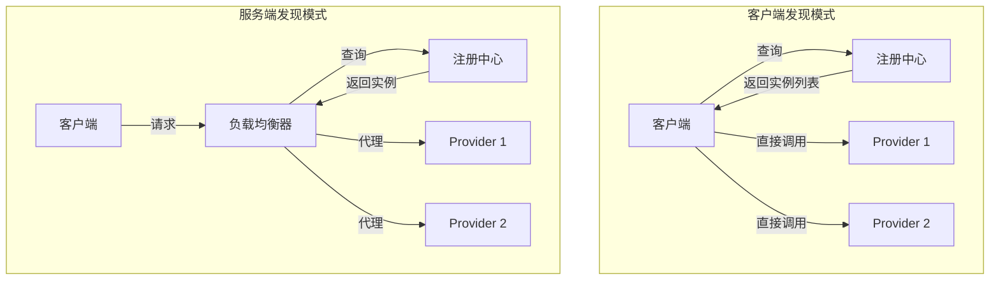
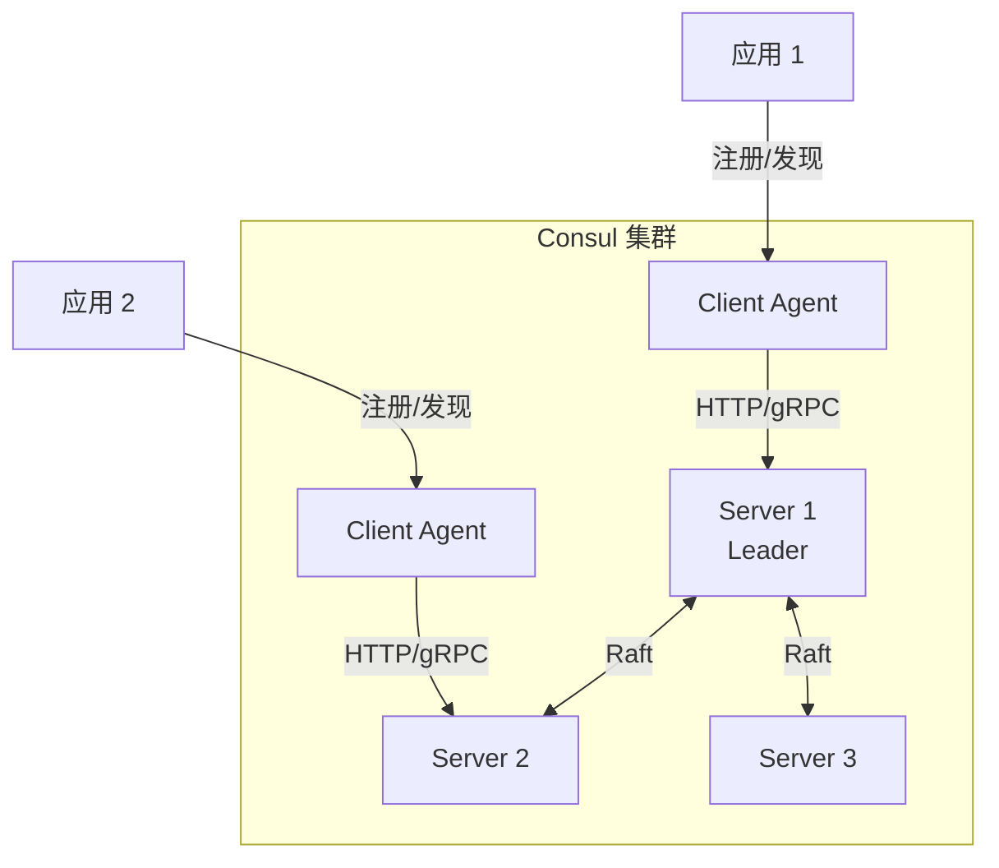
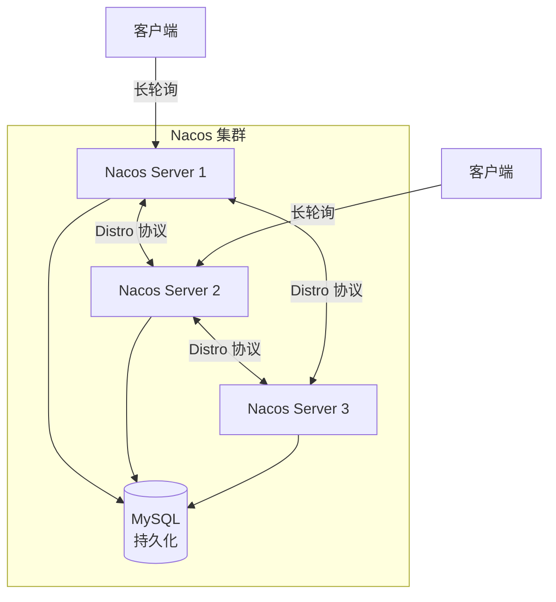
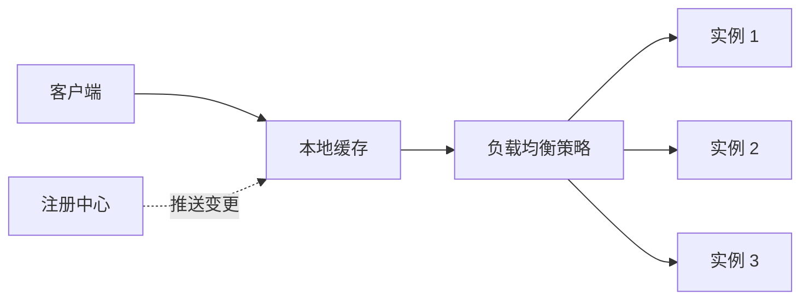
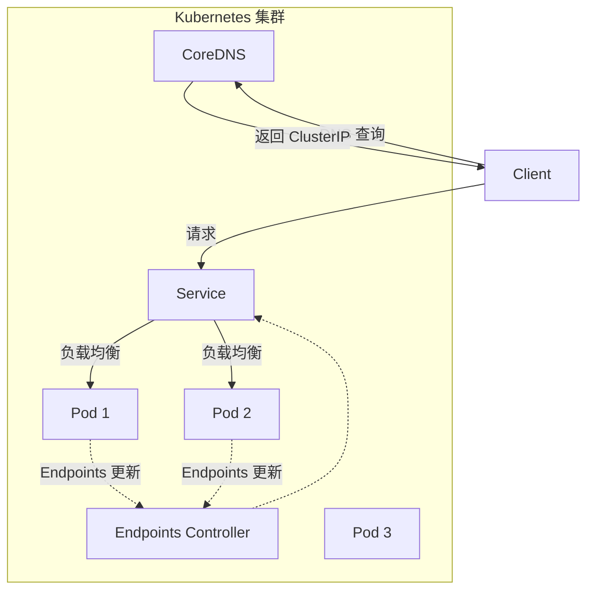
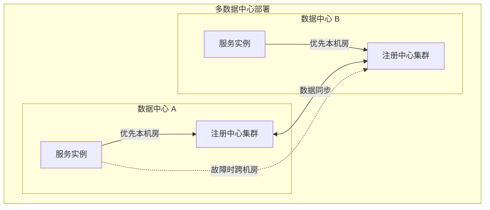

# 服务发现与注册

## 概述

服务发现与注册是分布式系统的核心基础设施，解决微服务架构中服务实例动态变化时的寻址问题。它允许服务自动注册自己的位置，并使客户端能够动态发现可用的服务实例。

## 核心概念

### 服务注册（Service Registration）

服务实例启动时向注册中心注册自身信息，包括：

- 服务名称与标识
- 网络地址（IP + 端口）
- 元数据（版本、区域、健康状态等）
- 健康检查端点

### 服务发现（Service Discovery）

客户端获取可用服务实例列表的过程：

- **客户端发现**：客户端直接查询注册中心，自行选择实例
- **服务端发现**：通过负载均衡器代理，对客户端透明

### 健康检查（Health Check）

确保注册中心维护的实例列表有效：

- **主动探测**：注册中心定期 ping 服务实例
- **被动上报**：服务实例定期发送心跳
- **应用层检查**：执行特定健康检查端点

## 架构模式



## 注册中心选型对比

| 特性 | ZooKeeper | Consul | etcd | Nacos | Eureka |
|------|-----------|--------|------|-------|--------|
| 一致性 | CP (ZAB) | CP (Raft) | CP (Raft) | CP/AP 可切换 | AP |
| 健康检查 | 保持连接 | 多方式 | 保持连接 | 多方式 | 心跳 |
| 多数据中心 | 支持 | 原生支持 | 需配合 | 支持 | 需配合 |
| K/V 存储 | 是 | 是 | 是 | 是 | 否 |
| 服务网格 | 需集成 | 原生 | 需集成 | 支持 | 需集成 |
| 配置中心 | 需配合 | 支持 | 需配合 | 原生 | 否 |
| 易用性 | 中等 | 好 | 中等 | 好 | 好 |

## 主流注册中心详解

### 1. ZooKeeper

```mermaid
flowchart TB
    subgraph ZK["ZooKeeper 集群"]
        Leader["Leader<br/>写请求处理"]
        F1["Follower 1"]
        F2["Follower 2"]
        F3["Follower 3"]
    end

    Leader <-->|ZAB 同步| F1
    Leader <-->|ZAB 同步| F2
    Leader <-->|ZAB 同步| F3

    C1["客户端"] -->|读| F1
    C2["客户端"] -->|写| Leader

    subgraph Data["数据模型"]
        Root[/services]
        S1[/serviceA]
        S2[/serviceB]
        I1[instance1]
        I2[instance2]
        I3[instance3]
    end

    Root --> S1 --> I1
    Root --> S1 --> I2
    Root --> S2 --> I3
```

ZooKeeper 采用树形命名空间，服务注册在临时节点上：

```java
// Curator 客户端示例
CuratorFramework client = CuratorFrameworkFactory.newClient(
    "zk1:2181,zk2:2181,zk3:2181",
    new ExponentialBackoffRetry(1000, 3)
);
client.start();

// 注册服务
String servicePath = "/services/my-service/" + UUID.randomUUID();
client.create()
    .creatingParentsIfNeeded()
    .withMode(CreateMode.EPHEMERAL)  // 临时节点，会话结束自动删除
    .forPath(servicePath, "192.168.1.100:8080".getBytes());

// 服务发现
PathChildrenCache cache = new PathChildrenCache(client, "/services/my-service", true);
cache.start();
cache.getListenable().addListener((client, event) -> {
    List<String> instances = cache.getCurrentData().stream()
        .map(child -> new String(child.getData()))
        .collect(Collectors.toList());
    System.out.println("Available instances: " + instances);
});
```

### 2. Consul



Consul 提供服务定义和健康检查配置：

```hcl
// consul-config.hcl
service {
  name = "order-service"
  id = "order-service-001"
  port = 8080

  tags = ["v1", "primary", "dc1"]

  meta = {
    version = "1.0.0"
    region = "us-east"
  }

  check {
    id = "order-service-check"
    name = "HTTP Health Check"
    http = "http://localhost:8080/health"
    interval = "10s"
    timeout = "5s"
  }

  connect {
    sidecar_service {}
  }
}
```

Go 语言客户端示例：

```go
package main

import (
    "fmt"
    "github.com/hashicorp/consul/api"
)

func registerService() error {
    config := api.DefaultConfig()
    config.Address = "localhost:8500"

    client, err := api.NewClient(config)
    if err != nil {
        return err
    }

    // 服务注册
    registration := &api.AgentServiceRegistration{
        ID:      "order-service-001",
        Name:    "order-service",
        Port:    8080,
        Tags:    []string{"v1", "primary"},
        Address: "192.168.1.100",
        Check: &api.AgentServiceCheck{
            HTTP:     "http://192.168.1.100:8080/health",
            Interval: "10s",
            Timeout:  "5s",
        },
    }

    return client.Agent().ServiceRegister(registration)
}

func discoverService() ([]*api.ServiceEntry, error) {
    config := api.DefaultConfig()
    client, _ := api.NewClient(config)

    // 健康服务发现
    entries, _, err := client.Health().Service("order-service", "v1", true, nil)
    return entries, err
}

func main() {
    // 注册服务
    if err := registerService(); err != nil {
        panic(err)
    }

    // 发现服务
    entries, err := discoverService()
    if err != nil {
        panic(err)
    }

    for _, entry := range entries {
        fmt.Printf("Service: %s at %s:%d\n",
            entry.Service.Service,
            entry.Service.Address,
            entry.Service.Port)
    }
}
```

### 3. Nacos



Nacos 同时支持 CP 和 AP 模式，Java SDK 示例：

```java
// 服务注册
Properties properties = new Properties();
properties.put("serverAddr", "localhost:8848");
properties.put("namespace", "prod");

NamingService naming = NamingFactory.createNamingService(properties);

// 注册实例
Instance instance = new Instance();
instance.setIp("192.168.1.100");
instance.setPort(8080);
instance.setWeight(1.0);
instance.setHealthy(true);
instance.setMetadata(Map.of(
    "version", "1.0",
    "region", "beijing"
));

naming.registerInstance("order-service", instance);

// 服务发现
List<Instance> instances = naming.selectInstances(
    "order-service",
    Collections.singletonList("prod"),  // 集群筛选
    true  // 只返回健康实例
);

// 订阅服务变化
naming.subscribe("order-service", event -> {
    if (event instanceof NamingEvent) {
        List<Instance> updated = ((NamingEvent) event).getInstances();
        System.out.println("Service instances updated: " + updated);
    }
});
```

## 服务发现客户端模式

### 1. 客户端负载均衡



### 2. Spring Cloud LoadBalancer 示例

```java
@Configuration
public class LoadBalancerConfig {

    @Bean
    public ServiceInstanceListSupplier discoveryClientServiceInstanceListSupplier(
            ConfigurableApplicationContext context) {
        return ServiceInstanceListSupplier.builder()
            .withDiscoveryClient()           // 从注册中心发现
            .withHealthChecks()              // 健康检查
            .withRetryAwareness()            // 重试感知
            .withCaching()                   // 本地缓存
            .build(context);
    }

    @Bean
    public ReactorLoadBalancer<ServiceInstance> randomLoadBalancer(
            Environment environment,
            LoadBalancerClientFactory loadBalancerClientFactory) {
        String name = environment.getProperty(LoadBalancerClientFactory.PROPERTY_NAME);
        return new RandomLoadBalancer(
            loadBalancerClientFactory.getLazyProvider(name, ServiceInstanceListSupplier.class),
            name
        );
    }
}

// 使用 RestTemplate
@Service
public class OrderServiceClient {

    @LoadBalanced
    private final RestTemplate restTemplate;

    public Order getOrder(String orderId) {
        // 使用服务名而非具体地址
        return restTemplate.getForObject(
            "http://order-service/orders/{id}",
            Order.class,
            orderId
        );
    }
}
```

## Kubernetes 服务发现



Kubernetes 提供多种服务发现机制：

```yaml
# Service 定义
apiVersion: v1
kind: Service
metadata:
  name: order-service
  namespace: production
spec:
  selector:
    app: order-service
  ports:
    - port: 80
      targetPort: 8080
  type: ClusterIP

---
# Headless Service（直接返回 Pod IP）
apiVersion: v1
kind: Service
metadata:
  name: order-service-headless
spec:
  selector:
    app: order-service
  ports:
    - port: 8080
  clusterIP: None  # Headless

---
# EndpointSlice（更高效的后端表示）
apiVersion: discovery.k8s.io/v1
kind: EndpointSlice
metadata:
  name: order-service-abc
  labels:
    kubernetes.io/service-name: order-service
addressType: IPv4
ports:
  - name: http
    protocol: TCP
    port: 8080
endpoints:
  - addresses:
      - 10.0.1.10
    conditions:
      ready: true
    hostname: order-service-1
```

## 最佳实践

### 1. 健康检查设计

```java
@RestController
public class HealthController {

    @GetMapping("/health")
    public ResponseEntity<HealthStatus> health() {
        // 检查依赖服务
        boolean dbHealthy = checkDatabase();
        boolean cacheHealthy = checkCache();

        if (dbHealthy && cacheHealthy) {
            return ResponseEntity.ok(new HealthStatus("UP"));
        }
        return ResponseEntity.status(503)
            .body(new HealthStatus("DOWN", Map.of(
                "database", dbHealthy,
                "cache", cacheHealthy
            )));
    }

    @GetMapping("/health/ready")
    public ResponseEntity<String> ready() {
        // 就绪检查 - 是否准备好接收流量
        return isInitialized()
            ? ResponseEntity.ok("READY")
            : ResponseEntity.status(503).body("NOT_READY");
    }

    @GetMapping("/health/live")
    public ResponseEntity<String> live() {
        // 存活检查 - 进程是否正常运行
        return ResponseEntity.ok("ALIVE");
    }
}
```

### 2. 服务注册配置建议

```yaml
spring:
  cloud:
    consul:
      host: localhost
      port: 8500
      discovery:
        # 使用 IP 而非 hostname
        prefer-ip-address: true
        # 健康检查间隔
        health-check-interval: 10s
        # 健康检查路径
        health-check-path: /actuator/health
        # 实例 ID 唯一标识
        instance-id: ${spring.application.name}:${random.value}
        # 标签用于分组和路由
        tags: version=1.0,env=prod
        # 元数据
        metadata:
          management.context-path: /actuator
          protocol: http
        # 心跳
        heartbeat:
          enabled: true
```

### 3. 高可用设计



## 常见问题与解决方案

| 问题 | 原因 | 解决方案 |
|------|------|----------|
| 服务注册不上 | 网络不通/配置错误 | 检查网络连通性、配置参数 |
| 服务发现延迟 | 缓存机制 | 调整缓存刷新间隔 |
| 僵尸实例 | 未优雅下线 | 实现 shutdown hook |
| 网络分区 | 脑裂 | 选择 CP 或 AP 模式 |
| 注册中心成为瓶颈 | 大量服务 | 水平扩展、分层架构 |
