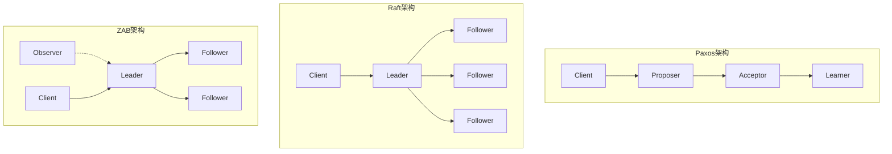
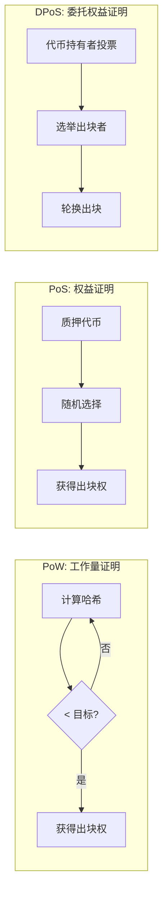

# Consensus协议对比 专题文档

**文档版本**：v1.0
**创建时间**：2026年4月
**最后更新**：2026年4月
**状态**：🔄 编写中

---

## 📋 执行摘要

Consensus（共识）协议是分布式系统的核心组件，用于在多个节点间就某个值或状态达成一致。本文档对比分析主流的CFT（崩溃容错）共识协议（Paxos、Raft、ZAB）和BFT（拜占庭容错）共识协议（PBFT、Tendermint、HotStuff），以及区块链共识机制（PoW、PoS、DPoS）。

---

## 一、核心概念

### 1.1 定义与原理

**共识问题**：在分布式系统中，多个进程需要就某个值达成一致，即使在部分进程出现故障的情况下。

**FLP不可能结果**：在异步网络中，即使只有一个进程可能故障，也不存在确定性的共识算法。因此实际算法都通过引入超时、故障检测等机制来规避FLP结果。

**共识属性**：

- **安全性（Safety）**：所有正确节点达成一致，且达成的值是有效的
- **活性（Liveness）**：最终所有正确节点都会达成共识
- **容错性（Fault Tolerance）**：在部分节点故障时仍能正常工作

### 1.2 关键特性

| 特性 | CFT协议 | BFT协议 | 区块链共识 |
|------|---------|---------|------------|
| **容错类型** | 崩溃容错 | 拜占庭容错 | 拜占庭容错 |
| **最大容错** | ⌊(n-1)/2⌋ | ⌊(n-1)/3⌋ | 根据协议不同 |
| **性能** | 高（毫秒级） | 中（百毫秒级） | 低（秒级） |
| **应用场景** | 数据库、协调服务 | 联盟链、高安全系统 | 公链 |

### 1.3 适用场景

| 场景 | CFT共识 | BFT共识 | 区块链共识 |
|------|---------|---------|------------|
| 分布式数据库 | ⭐⭐⭐⭐⭐ | ⭐⭐⭐ | ⭐ |
| 分布式协调服务 | ⭐⭐⭐⭐⭐ | ⭐⭐ | ⭐ |
| 联盟链 | ⭐⭐⭐ | ⭐⭐⭐⭐⭐ | ⭐⭐⭐ |
| 公链/加密货币 | ⭐ | ⭐⭐ | ⭐⭐⭐⭐⭐ |
| 高安全关键系统 | ⭐⭐⭐ | ⭐⭐⭐⭐⭐ | ⭐⭐⭐ |

---

## 二、CFT共识协议对比

### 2.1 Paxos vs Raft vs ZAB 架构



### 2.2 算法原理对比

#### Paxos

**角色**：Proposer（提议者）、Acceptor（接受者）、Learner（学习者）

**两阶段提交**：

1. **Prepare阶段**：Proposer向Acceptor发送prepare请求，获取承诺
2. **Accept阶段**：Proposer向Acceptor发送accept请求，提交值

**特点**：理论完备，工程实现复杂

#### Raft

**角色**：Leader（领导者）、Follower（跟随者）、Candidate（候选人）

**三阶段**：

1. **Leader选举**：超时触发选举，获得多数票成为Leader
2. **日志复制**：Leader接收请求，复制日志到Follower
3. **安全保证**：通过日志匹配和提交规则保证安全性

**特点**：易于理解和实现，工程友好

#### ZAB（Zookeeper Atomic Broadcast）

**角色**：Leader、Follower、Observer（观察者，只读）

**两阶段**：

1. **崩溃恢复**：选举Leader，同步数据
2. **消息广播**：Leader顺序处理请求，广播到Follower

**特点**：专为ZooKeeper设计，保证顺序一致性

### 2.3 CFT协议详细对比矩阵

| 维度 | Paxos | Raft | ZAB |
|------|-------|------|-----|
| **设计者** | Leslie Lamport (1998) | Diego Ongaro (2014) | Yahoo/ZooKeeper (2008) |
| **核心思想** | 多轮投票 | 强Leader + 日志复制 | 主备复制 + 广播 |
| **Leader选举** | 隐式 | 显式（心跳超时） | 显式（Fast Leader Election） |
| **日志复制** | 多Proposer可能冲突 | 顺序复制，无冲突 | 顺序复制，事务ID |
| **读性能** | 需多数派读取 | Leader读 | Leader读 |
| **写性能** | 2-3 RTT | 2 RTT | 2 RTT |
| **实现复杂度** | 高 | 低 | 中 |
| **可理解性** | 低 | 高 | 中 |
| **典型应用** | Chubby、Spanner | etcd、Consul、TiKV | ZooKeeper、Kafka |
| **成员变更** | 复杂（Joint Consensus） | 简单（单节点变更） | 通过ZooKeeper实现 |
| **日志压缩** | 需要额外机制 | 内置Snapshot | 内置Snapshot |

---

## 三、BFT共识协议对比

### 3.1 PBFT vs Tendermint vs HotStuff


### 3.2 BFT协议详细对比矩阵

| 维度 | PBFT | Tendermint | HotStuff |
|------|------|------------|----------|
| **设计者** | Castro & Liskov (1999) | Kwon & Buchman (2014) | Yin et al. (2019) |
| **容错阈值** | f < n/3 | f < n/3 | f < n/3 |
| **消息复杂度** | O(n²) | O(n²) | O(n) |
| **视图变更复杂度** | O(n³) | O(n) | O(n) |
| **同步假设** | 部分同步 | 部分同步 | 部分同步 |
| **区块提交** | 即时确认 | 即时确认 | 链式确认 |
| **活性保证** | 需要超时 | 内置超时机制 | 内置超时机制 |
| **出块方式** | 轮流/主节点 | 基于质押的权益加权 | 基于质押的权益加权 |
| **惩罚机制** | 无 | 有（Slashing） | 有（Slashing） |
| **实际应用** | Hyperledger Fabric | Cosmos、Binance Chain | Libra/Diem、Celo、Flow |
| **代码复杂度** | 中 | 中 | 高 |
| **性能（TPS）** | 数万 | 数千 | 数万-数十万 |
| **最终性** | 即时最终性 | 即时最终性 | 即时最终性 |

### 3.3 BFT协议工作流程

#### PBFT（Practical Byzantine Fault Tolerance）

**三阶段协议**：

1. **Pre-Prepare**：主节点发送提案，副本验证
2. **Prepare**：副本广播准备消息，收到2f+1个准备后进入准备状态
3. **Commit**：副本广播提交消息，收到2f+1个提交后执行

**视图变更**：当主节点故障时触发，复杂度O(n³)

#### Tendermint

**共识流程**：

1. **Proposal**：提议者提出区块
2. **Prevote**：验证者对区块进行预投票
3. **Precommit**：验证者进行预提交
4. **Commit**：区块最终确定

**创新点**：

- 将共识与应用逻辑分离（ABCI接口）
- 内置质押和惩罚机制
- 拜占庭容错与PoS结合

#### HotStuff

**链式BFT**：

- 将视图变更嵌入到正常流程中
- 每个视图只发送O(n)条消息
- 采用阈值签名优化消息复杂度

**三阶段**：Prepare → Pre-Commit → Commit → Decide

---

## 四、区块链共识机制对比

### 4.1 PoW vs PoS vs DPoS



### 4.2 区块链共识详细对比矩阵

| 维度 | PoW | PoS | DPoS |
|------|-----|-----|------|
| **全称** | Proof of Work | Proof of Stake | Delegated Proof of Stake |
| **提出者** | Satoshi Nakamoto (2008) | Sunny King (2012) | Daniel Larimer (2013) |
| **共识基础** | 算力竞争 | 权益质押 | 投票选举 |
| **出块方式** | 算力竞争获胜 | 随机选择（按质押比例） | 轮流出块 |
| **能源消耗** | 极高 | 低 | 低 |
| **出块时间** | 10分钟（BTC） | 数秒-数分钟 | 数秒 |
| **TPS** | 7（BTC）/ 15（ETH） | 数百-数千 | 数千-数万 |
| **去中心化程度** | 高 | 中（可能马太效应） | 低（节点固定） |
| **安全性基础** | 51%算力攻击 | 51%质押攻击 | 贿赂/串通攻击 |
| **经济惩罚** | 无（沉没成本） | Slashing（削减质押） | 投票罢免 |
| **典型代表** | Bitcoin、Ethereum（原） | Ethereum 2.0、Cardano | EOS、TRON、Steem |
| **抗审查性** | 强 | 中 | 弱 |
| **参与门槛** | 高（矿机成本） | 中（质押要求） | 低（投票即可） |

### 4.3 其他区块链共识机制

| 机制 | 原理 | 代表项目 | 特点 |
|------|------|----------|------|
| **PoA** | 权威证明，可信节点出块 | VeChain、POA Network | 高效，适合联盟链 |
| **PoH** | 历史证明，可验证延迟函数 | Solana | 高吞吐量 |
| **PoC** | 容量证明，硬盘空间竞争 | Chia、Filecoin | 环保，抗ASIC |
| **PoB** | 燃烧证明，销毁代币获得权益 | Slimcoin | 通缩机制 |
| **DAG** | 有向无环图，并行确认 | IOTA、Nano | 无区块，高并发 |

---

## 五、完整对比矩阵

### 5.1 综合对比

| 维度 | Paxos | Raft | ZAB | PBFT | Tendermint | HotStuff | PoW | PoS | DPoS |
|------|-------|------|-----|------|------------|----------|-----|-----|------|
| **容错类型** | CFT | CFT | CFT | BFT | BFT | BFT | BFT | BFT | BFT |
| **最大容错** | ⌊(n-1)/2⌋ | ⌊(n-1)/2⌋ | ⌊(n-1)/2⌋ | ⌊(n-1)/3⌋ | ⌊(n-1)/3⌋ | ⌊(n-1)/3⌋ | 51% | 51% | 51% |
| **消息复杂度** | O(n) | O(n) | O(n) | O(n²) | O(n²) | O(n) | - | - | - |
| **出块延迟** | 毫秒 | 毫秒 | 毫秒 | 百毫秒 | 秒级 | 秒级 | 分钟 | 秒级 | 秒级 |
| **吞吐量** | 高 | 高 | 高 | 中高 | 中 | 高 | 低 | 中高 | 高 |
| **最终性** | 即时 | 即时 | 即时 | 即时 | 即时 | 即时 | 概率性 | 即时 | 即时 |
| **能源效率** | 高 | 高 | 高 | 高 | 高 | 高 | 极低 | 高 | 高 |
| **准入机制** | 许可 | 许可 | 许可 | 许可 | 无需许可 | 无需许可 | 无需许可 | 无需许可 | 无需许可 |
| **经济激励** | 无 | 无 | 无 | 无 | 有 | 有 | 有 | 有 | 有 |
| **实现难度** | 高 | 低 | 中 | 中 | 中 | 高 | 低 | 中 | 低 |
| **适用场景** | 数据库 | 协调服务 | 协调服务 | 联盟链 | 公链/联盟链 | 高性能链 | 价值存储 | 智能合约平台 | 高吞吐应用 |

### 5.2 选型决策树

```
系统需求
├── 需要拜占庭容错？
│   ├── 是 → 区块链/DLT场景？
│   │   ├── 是 → 公有链？
│   │   │   ├── 是 → 需要高吞吐？
│   │   │   │   ├── 是 → DPoS / HotStuff
│   │   │   │   └── 否 → PoS / Tendermint
│   │   │   └── 否 → 联盟链
│   │   │       ├── 需要最高性能？
│   │   │       │   ├── 是 → HotStuff
│   │   │       │   └── 否 → PBFT / Tendermint
│   │   └── 否 → 传统企业应用
│   │       ├── 需要最高性能？
│   │       │   ├── 是 → HotStuff
│   │       │   └── 否 → PBFT
│   └── 否 → 崩溃容错足够
│       ├── 需要强顺序保证？
│       │   ├── 是 → ZAB
│       │   └── 否 →
│       │       ├── 追求简单实现？
│       │       │   ├── 是 → Raft
│       │       │   └── 否 → Paxos
│       └── 读多写少？
│           ├── 是 → Multi-Paxos
│           └── 否 → Raft
```

---

## 六、实践指南

### 6.1 典型配置

#### Raft集群配置（etcd风格）

```yaml
# etcd集群配置示例
cluster:
  name: etcd-cluster
  nodes:
    - name: node-1
      peer_urls: http://10.0.0.1:2380
      client_urls: http://10.0.0.1:2379
    - name: node-2
      peer_urls: http://10.0.0.2:2380
      client_urls: http://10.0.0.2:2379
    - name: node-3
      peer_urls: http://10.0.0.3:2380
      client_urls: http://10.0.0.3:2379

election_timeout: 1000  # 毫秒
heartbeat_interval: 100  # 毫秒
snapshot_count: 10000
```

#### Tendermint配置

```toml
# config.toml
consensus:
  timeout_propose: "3s"
  timeout_prevote: "1s"
  timeout_precommit: "1s"
  timeout_commit: "1s"
  skip_timeout_commit: false
  create_empty_blocks: true
  create_empty_blocks_interval: "0s"
  peer_gossip_sleep_duration: "100ms"
  peer_query_maj23_sleep_duration: "2s"
```

### 6.2 最佳实践

1. **节点数量选择**
   - CFT协议：2f+1节点（如3、5、7）
   - BFT协议：3f+1节点（如4、7、10）

2. **网络分区处理**
   - 配置合理的超时参数
   - 实现网络分区检测机制
   - 准备手动介入方案

3. **日志管理**
   - 定期快照压缩
   - 日志保留策略
   - 磁盘空间监控

4. **安全性加固**
   - TLS加密通信
   - 节点身份认证
   - 访问控制列表

### 6.3 常见问题

**Q1: Raft和Paxos的关系是什么？**
A: Raft是Paxos的工程化实现，提供与Paxos等价的安全性保证，但更易理解和实现。

**Q2: 为什么BFT协议最多只能容忍1/3故障？**
A: 这是由拜占庭将军问题的理论限制决定的，需要2f+1个诚实节点才能区分故障节点状态。

**Q3: PoW的51%攻击风险？**
A: 攻击者控制51%算力后可篡改历史交易，但成本极高，且只能影响最新几个区块。

**Q4: 如何选择CFT和BFT？**
A: 控制可信环境用CFT（企业内部），开放/不可信环境用BFT（公链、跨组织）。

---

## 七、与其他主题的关联

### 7.1 上游依赖

- [分布式事务协议](./分布式事务协议.md)
- [分布式网络基础](../network/分布式网络基础.md)
- [时间同步协议](../network/时间同步协议.md)

### 7.2 下游应用

- [Kafka架构深度分析](../message-queue/Kafka架构深度分析.md)
- [Pulsar架构](../message-queue/Pulsar架构.md)
- [RocketMQ深度分析](../message-queue/RocketMQ深度分析.md)

### 7.3 相关概念

| 概念 | 关系 | 说明 |
|------|------|------|
| 分布式一致性 | 基础 | 共识是达成一致性的手段 |
| CAP定理 | 理论限制 | 共识协议在CP系统中实现 |
| 两阶段提交 | 对比 | 2PC需要所有节点存活，共识可容忍部分故障 |

---

## 八、参考资源

### 8.1 学术论文

1. [Paxos Made Simple](https://lamport.azurewebsites.net/pubs/paxos-simple.pdf) - Leslie Lamport, 2001
2. [In Search of an Understandable Consensus Algorithm](https://raft.github.io/raft.pdf) - Diego Ongaro, 2014
3. [Practical Byzantine Fault Tolerance](http://pmg.csail.mit.edu/papers/osdi99.pdf) - Castro & Liskov, 1999
4. [The Latest Gossip on BFT Consensus](https://arxiv.org/abs/1807.04938) - Buchman et al., 2018
5. [HotStuff: BFT Consensus in the Lens of Blockchain](https://arxiv.org/abs/1803.05069) - Yin et al., 2019
6. [Bitcoin: A Peer-to-Peer Electronic Cash System](https://bitcoin.org/bitcoin.pdf) - Satoshi Nakamoto, 2008

### 8.2 开源项目

1. [etcd](https://github.com/etcd-io/etcd) - 分布式键值存储，使用Raft
2. [ZooKeeper](https://github.com/apache/zookeeper) - 分布式协调服务，使用ZAB
3. [Consul](https://github.com/hashicorp/consul) - 服务发现和配置，使用Raft
4. [Tendermint](https://github.com/tendermint/tendermint) - BFT共识引擎
5. [Diem/HotStuff](https://github.com/diem/diem) - Meta的区块链项目（已停止）

### 8.3 学习资料

1. [The Raft Consensus Algorithm](https://raft.github.io/) - Raft官方网站
2. [PBFT Visualization](http://pmg.csail.mit.edu/papers/osdi99.pdf) - MIT可视化工具
3. [Ethereum 2.0 Specs](https://github.com/ethereum/consensus-specs) - 以太坊共识规范

### 8.4 相关文档

- [分布式事务协议](./分布式事务协议.md)
- [分布式RPC深度分析](../rpc/分布式RPC深度分析.md)

---

**维护者**：项目团队
**最后更新**：2026年4月
