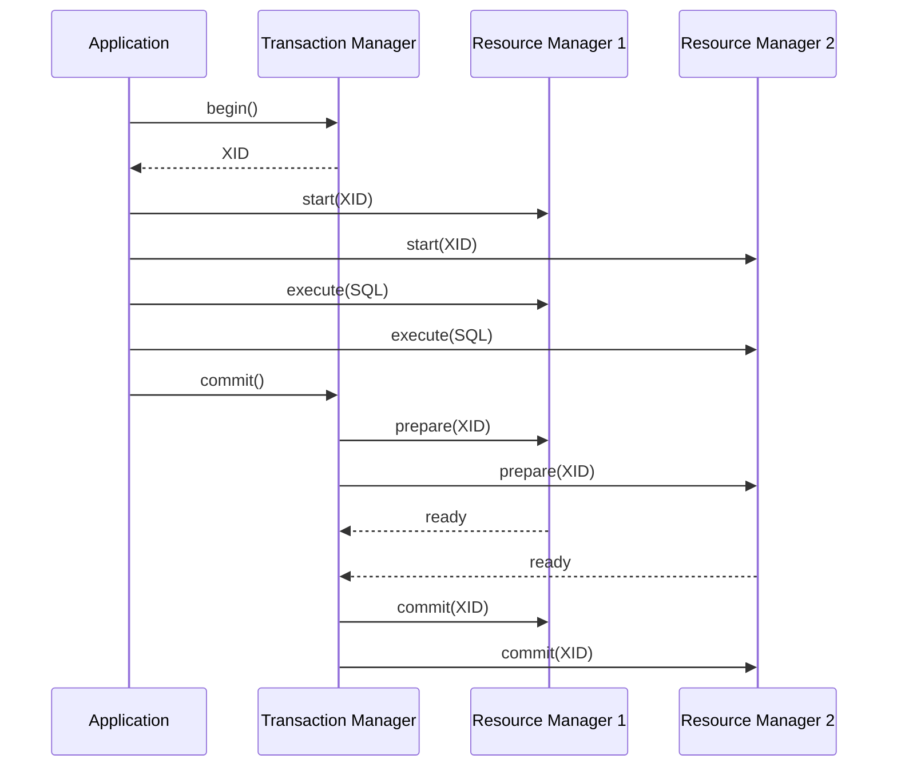
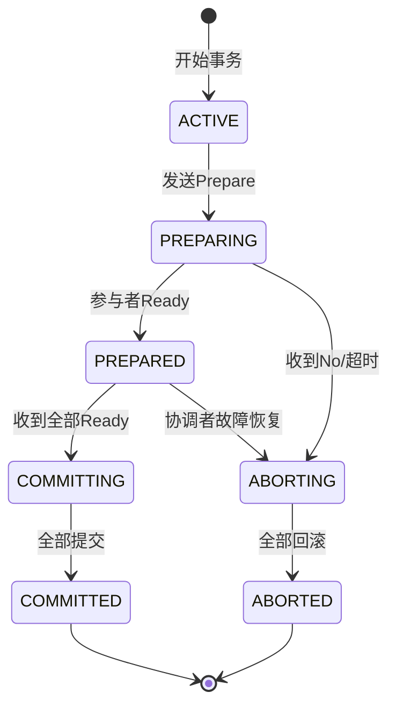
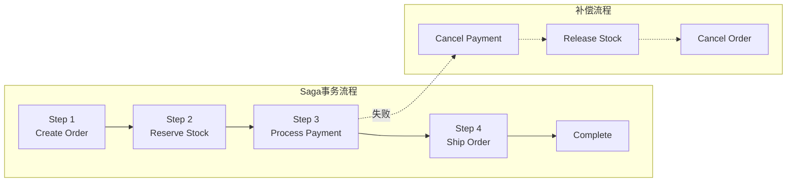
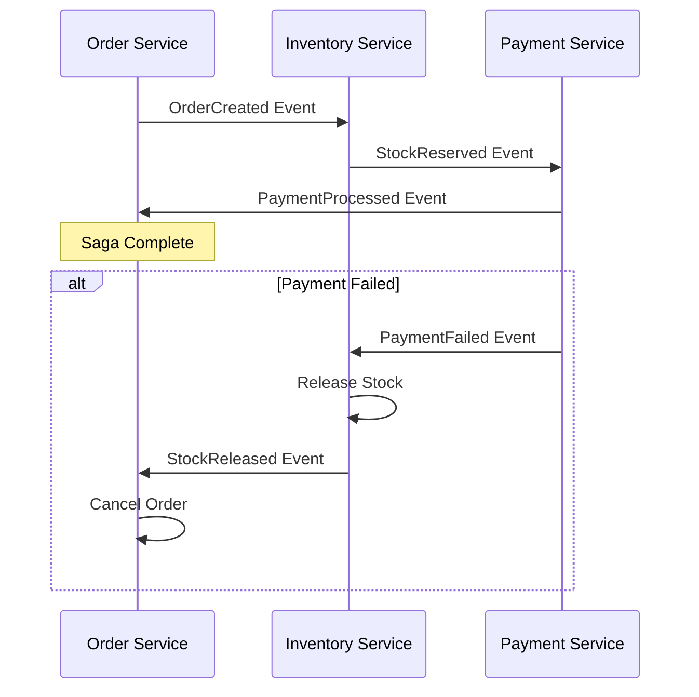
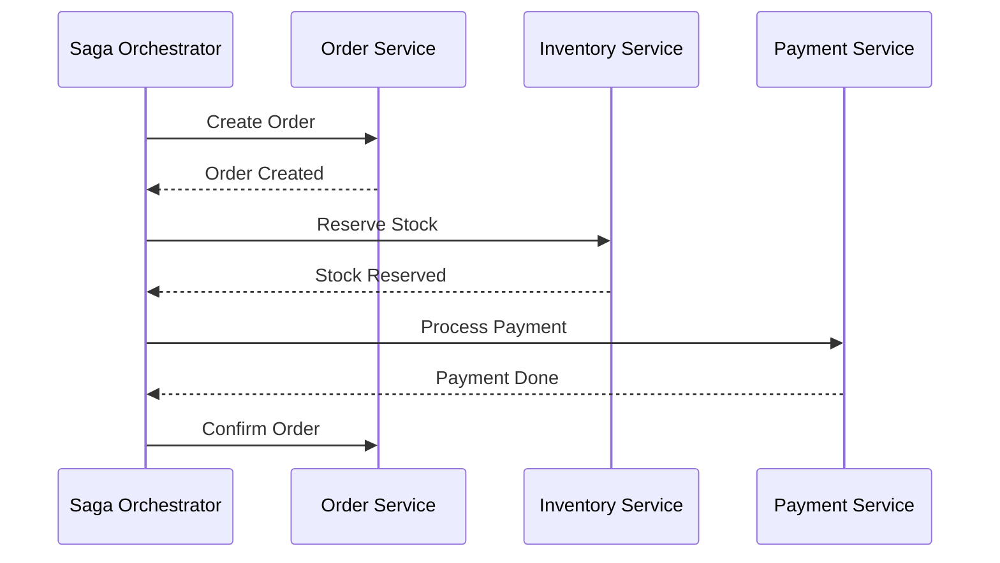
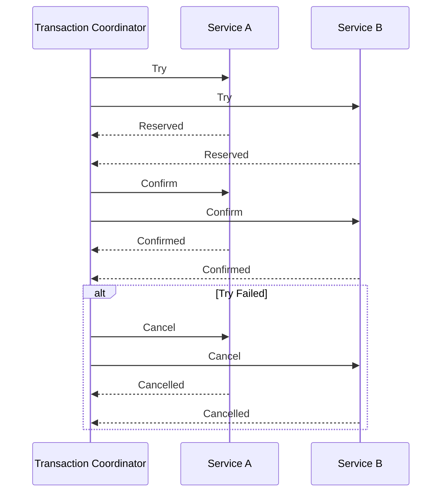
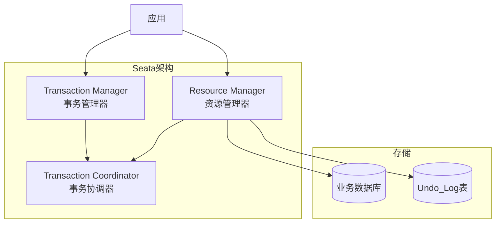

# 分布式事务协议 专题文档

**文档版本**：v1.0
**创建时间**：2026年4月
**最后更新**：2026年4月
**状态**：🔄 编写中

---

## 📋 执行摘要

分布式事务协议用于协调多个分布式节点上的操作，保证ACID特性（原子性、一致性、隔离性、持久性）。本文档详细分析XA协议、2PC/3PC、Saga、TCC和AT事务（Seata）等主流分布式事务方案，帮助理解其原理、适用场景和选型建议。

---

## 一、核心概念

### 1.1 定义与原理

**分布式事务**：跨越多个数据库或服务的事务，需要协调多个参与者以保证整体ACID特性。

**分布式事务挑战**：

- **网络分区**：节点间通信不可靠
- **节点故障**：部分节点可能宕机
- **数据一致性**：多副本数据同步
- **性能问题**：协调开销大

**CAP权衡**：分布式事务通常在CP（一致性+分区容错）或AP（可用性+分区容错）之间选择。

### 1.2 关键特性

| 特性 | 说明 |
|------|------|
| **原子性（Atomicity）** | 事务要么全部成功，要么全部失败 |
| **一致性（Consistency）** | 事务执行前后数据保持一致性约束 |
| **隔离性（Isolation）** | 并发事务互不影响 |
| **持久性（Durability）** | 已提交事务的数据持久保存 |

### 1.3 适用场景

| 场景 | 2PC/3PC | Saga | TCC | AT |
|------|---------|------|-----|-----|
| 强一致性要求 | ⭐⭐⭐⭐⭐ | ⭐⭐ | ⭐⭐⭐ | ⭐⭐⭐⭐ |
| 长事务处理 | ⭐⭐ | ⭐⭐⭐⭐⭐ | ⭐⭐⭐⭐ | ⭐⭐⭐ |
| 高并发场景 | ⭐⭐ | ⭐⭐⭐⭐⭐ | ⭐⭐⭐⭐ | ⭐⭐⭐ |
| 遗留系统集成 | ⭐⭐⭐⭐⭐ | ⭐⭐⭐ | ⭐⭐ | ⭐⭐⭐ |
| 微服务架构 | ⭐⭐ | ⭐⭐⭐⭐⭐ | ⭐⭐⭐⭐⭐ | ⭐⭐⭐⭐⭐ |

---

## 二、XA协议

### 2.1 架构设计



### 2.2 XA协议详解

**XA（eXtended Architecture）**是X/Open组织提出的分布式事务处理标准接口。

**核心角色**：

- **AP（Application Program）**：应用程序，定义事务边界
- **TM（Transaction Manager）**：事务管理器，协调全局事务
- **RM（Resource Manager）**：资源管理器，管理具体资源（数据库、消息队列等）

**XA接口**：

```c
// TM接口
xa_open()    // 初始化RM
xa_close()   // 关闭RM
xa_start()   // 开启事务分支
xa_end()     // 结束事务分支
xa_prepare() // 准备提交（预提交）
xa_commit()  // 提交
xa_rollback()// 回滚
xa_recover() // 恢复事务
```

**两阶段提交（2PC）**：

1. **Phase 1（准备阶段）**：TM向所有RM发送prepare请求，RM执行本地事务但不提交，返回准备状态
2. **Phase 2（提交阶段）**：所有RM都ready后，TM发送commit请求；任一RM失败则rollback

### 2.3 XA优缺点

| 优点 | 缺点 |
|------|------|
| 标准接口，广泛支持 | 同步阻塞，性能较低 |
| 强一致性保证 | 单点故障（TM）风险 |
| 与JTA/JTS集成好 | 资源锁定时间长 |
| 适合传统单体应用 | 不适合长事务和高并发 |

---

## 三、2PC/3PC详解

### 3.1 两阶段提交（2PC）

#### 算法流程

```
阶段一：投票阶段（Voting Phase）
1. TM向所有参与者发送CanCommit请求
2. 参与者执行本地事务，锁定资源
3. 参与者返回Yes或No

阶段二：执行阶段（Commit Phase）
情况A：所有参与者返回Yes
4a. TM发送DoCommit请求
5a. 参与者提交本地事务，释放锁
6a. 参与者返回ACK

情况B：任一参与者返回No或超时
4b. TM发送DoRollback请求
5b. 参与者回滚本地事务，释放锁
6b. 参与者返回ACK
```

#### 状态转换图



#### 2PC的问题

| 问题 | 描述 | 影响 |
|------|------|------|
| **同步阻塞** | 参与者等待协调者指令时保持资源锁定 | 性能下降，死锁风险 |
| **单点故障** | 协调者宕机，参与者无法完成事务 | 事务悬挂 |
| **数据不一致** | 协调者在发送commit后宕机，部分参与者未收到 | 数据不一致 |
| **脑裂** | 网络分区导致部分参与者提交，部分回滚 | 严重数据不一致 |

### 3.2 三阶段提交（3PC）

3PC通过引入预提交阶段和超时机制解决2PC的部分问题。

#### 算法流程

```
阶段一：CanCommit
1. TM发送CanCommit询问
2. 参与者检查自身状态，返回Yes/No
3. 此阶段不执行事务，仅检查可行性

阶段二：PreCommit
4. 全部Yes后，TM发送PreCommit
5. 参与者预执行事务，记录Undo/Redo日志
6. 参与者返回ACK

阶段三：DoCommit
7. 收到全部ACK后，TM发送DoCommit
8. 参与者提交事务
9. 参与者返回ACK
```

#### 3PC vs 2PC

| 维度 | 2PC | 3PC |
|------|-----|-----|
| **阶段数** | 2 | 3 |
| **阻塞性** | 阻塞 | 非阻塞（有限超时） |
| **单点故障** | 严重 | 缓解 |
| **网络容错** | 差 | 较好 |
| **复杂度** | 低 | 高 |
| **性能** | 较好 | 较差（多一轮通信） |
| **一致性保证** | 弱 | 较强 |

#### 3PC的问题

- **网络分区仍可能导致不一致**：如果协调者在PreCommit后、DoCommit前宕机，参与者可能根据超时做出不同决策
- **实现复杂**：超时逻辑和状态恢复复杂
- **性能开销大**：多一轮网络通信

---

## 四、Saga协议

### 4.1 架构设计



### 4.2 Saga模式详解

**Saga**将长事务拆分为多个本地事务，每个本地事务有对应的补偿操作。

**两种实现方式**：

#### 编排式（Choreography）



- 无中央协调器
- 服务间通过事件驱动
- 适合简单流程，服务较少

#### 编排式（Orchestration）



- 有中央协调器（Saga Orchestrator）
- 协调器管理事务流程
- 适合复杂流程，服务较多

### 4.3 Saga优缺点

| 优点 | 缺点 |
|------|------|
| 无全局锁，性能好 | 无隔离性，可能出现脏读 |
| 适合长事务 | 补偿逻辑复杂 |
| 高可用 | 最终一致性，非强一致 |
| 松耦合（编排式） | 业务侵入性高 |

### 4.4 Saga实现框架

| 框架 | 语言 | 特点 |
|------|------|------|
| **Seata Saga** | Java | 状态机引擎，可视化设计 |
| **Axon Framework** | Java | DDD + Saga支持 |
| **NServiceBus** | .NET | 企业级Saga支持 |
| **Camunda** | Java | BPMN工作流引擎 |
| **Temporal** | 多语言 | 持久化工作流 |

---

## 五、TCC协议

### 5.1 架构设计



### 5.2 TCC详解

**TCC（Try-Confirm-Cancel）**是一种业务层面的分布式事务方案。

**三阶段**：

#### Try阶段

- 预留业务资源
- 执行业务检查
- 返回预留结果

```java
public interface TccAction {
    // Try: 预留资源
    @TwoPhaseBusinessAction(name = "inventoryAction")
    boolean tryDeduct(@BusinessActionContextParameter InventoryParams params);

    // Confirm: 确认执行业务
    boolean confirm(BusinessActionContext context);

    // Cancel: 取消预留
    boolean cancel(BusinessActionContext context);
}
```

#### Confirm阶段

- 确认执行业务
- 使用Try阶段预留的资源
- 幂等处理

#### Cancel阶段

- 释放Try阶段预留的资源
- 回滚业务操作
- 幂等处理

### 5.3 TCC vs Saga

| 维度 | TCC | Saga |
|------|-----|------|
| **隔离性** | 较好（资源预留） | 差（无隔离） |
| **业务侵入** | 高（需实现3个接口） | 中（需补偿逻辑） |
| **性能** | 好 | 好 |
| **复杂度** | 高 | 中 |
| **回滚能力** | 立即回滚 | 延迟补偿 |
| **适用场景** | 金融交易、库存扣减 | 业务流程、订单处理 |

### 5.4 TCC最佳实践

1. **幂等设计**：Confirm/Cancel必须幂等
2. **空回滚处理**：Try未执行时Cancel到达的处理
3. **悬挂处理**：Try在Cancel之后到达的处理
4. **超时控制**：各阶段超时策略

---

## 六、AT事务（Seata）

### 6.1 架构设计



### 6.2 AT模式详解

**AT（Automatic Transaction）模式**是Seata主推的分布式事务模式，对用户零侵入。

**核心组件**：

- **TC（Transaction Coordinator）**：维护全局事务状态，协调全局提交/回滚
- **TM（Transaction Manager）**：定义全局事务范围，开启/提交/回滚全局事务
- **RM（Resource Manager）**：管理分支事务，驱动分支提交/回滚

**执行流程**：

```
一阶段：
1. TM向TC申请开启全局事务，获得XID
2. RM执行业务SQL，解析SQL生成前后镜像
3. RM向TC注册分支事务
4. RM提交本地事务，记录Undo_Log
5. 驱动本地事务提交

二阶段-成功：
6. TM发起全局提交
7. TC异步删除各RM的Undo_Log

二阶段-失败：
6. TM发起全局回滚
7. TC通知各RM执行回滚
8. RM使用Undo_Log执行反向SQL回滚
9. 提交本地事务，删除Undo_Log
```

### 6.3 Undo_Log格式

```json
{
  "branchId": 123456,
  "xid": "xxx",
  "context": "xxx",
  "undoItems": [
    {
      "afterImage": {
        "tableName": "account",
        "rows": [{"id": 1, "balance": 900}]
      },
      "beforeImage": {
        "tableName": "account",
        "rows": [{"id": 1, "balance": 1000}]
      },
      "sqlType": "UPDATE"
    }
  ]
}
```

### 6.4 Seata模式对比

| 模式 | AT | TCC | Saga | XA |
|------|-----|-----|------|-----|
| **侵入性** | 无 | 高 | 中 | 低 |
| **性能** | 好 | 很好 | 很好 | 较差 |
| **隔离性** | 读未提交 | 自定义 | 无 | 读未提交/串行化 |
| **数据源支持** | 主流数据库 | 任意 | 任意 | 支持XA的数据源 |
| **回滚方式** | 自动（反向SQL） | 手动 | 补偿 | 自动 |
| **适用场景** | 通用 | 高性能 | 业务流程 | 传统应用 |

---

## 七、系统对比与选型

### 7.1 完整对比矩阵

| 维度 | XA/2PC | 3PC | Saga | TCC | AT(Seata) |
|------|--------|-----|------|-----|-----------|
| **一致性级别** | 强一致 | 强一致 | 最终一致 | 最终一致 | 最终一致 |
| **隔离性** | 有 | 有 | 无 | 有（预留） | 读未提交 |
| **性能** | 低 | 低 | 高 | 高 | 较高 |
| **复杂度** | 低 | 高 | 中 | 高 | 低 |
| **业务侵入** | 低 | 低 | 高 | 很高 | 无 |
| **回滚能力** | 立即 | 立即 | 延迟补偿 | 立即 | 延迟（二阶段） |
| **网络容错** | 差 | 较好 | 好 | 好 | 好 |
| **实现难度** | 低 | 高 | 中 | 高 | 低 |
| **适用事务长度** | 短 | 短 | 长 | 短 | 短-中 |
| **脏读风险** | 无 | 无 | 有 | 无 | 有 |

### 7.2 选型决策树

```
业务需求
├── 必须强一致性？
│   ├── 是 → 传统架构？
│   │   ├── 是 → XA/2PC
│   │   └── 否 → 考虑能否接受最终一致
│   └── 否 → 最终一致性可接受
│       ├── 需要零侵入？
│       │   ├── 是 → Seata AT
│       │   └── 否 →
│       │       ├── 高性能要求？
│       │       │   ├── 是 → TCC
│       │       │   └── 否 → Saga
│       └── 业务流程复杂？
│           ├── 是 → Saga（编排式）
│           └── 否 → TCC或AT
```

### 7.3 场景推荐

| 场景 | 推荐方案 | 理由 |
|------|----------|------|
| 银行转账 | TCC/Seata AT | 需要隔离性，性能要求高 |
| 电商订单 | Saga | 流程长，涉及多个服务 |
| 库存扣减 | TCC | 需要预留机制防止超卖 |
| 数据同步 | Saga | 最终一致即可 |
| 遗留系统 | XA/2PC | 已有XA支持 |
| 微服务新系统 | Seata AT | 零侵入，性能好 |

---

## 八、实践指南

### 8.1 Seata部署配置

```yaml
# application.yml
seata:
  enabled: true
  application-id: ${spring.application.name}
  tx-service-group: my_tx_group
  registry:
    type: nacos
    nacos:
      server-addr: localhost:8848
      namespace: seata
  client:
    rm:
      async-commit-buffer-limit: 10000
      report-retry-count: 5
      table-meta-check-enable: false
    tm:
      commit-retry-count: 5
      rollback-retry-count: 5
    undo:
      data-validation: true
      log-serialization: jackson
      log-table: undo_log
```

### 8.2 TCC实现示例

```java
@LocalTCC
public interface InventoryTccAction {

    @TwoPhaseBusinessAction(name = "inventoryDeduct")
    boolean tryDeduct(@BusinessActionContextParameter(paramName = "productId") String productId,
                      @BusinessActionContextParameter(paramName = "count") int count);

    boolean confirm(BusinessActionContext context);

    boolean cancel(BusinessActionContext context);
}

@Service
public class InventoryTccActionImpl implements InventoryTccAction {

    @Autowired
    private InventoryMapper inventoryMapper;

    @Override
    public boolean tryDeduct(String productId, int count) {
        // 检查库存并冻结
        return inventoryMapper.freezeStock(productId, count) > 0;
    }

    @Override
    public boolean confirm(BusinessActionContext context) {
        String productId = context.getActionContext("productId").toString();
        int count = Integer.parseInt(context.getActionContext("count").toString());
        // 扣减库存，解冻
        return inventoryMapper.confirmDeduct(productId, count) > 0;
    }

    @Override
    public boolean cancel(BusinessActionContext context) {
        String productId = context.getActionContext("productId").toString();
        int count = Integer.parseInt(context.getActionContext("count").toString());
        // 回滚，解冻
        return inventoryMapper.cancelDeduct(productId, count) > 0;
    }
}
```

### 8.3 最佳实践

1. **幂等设计**
   - 所有补偿操作必须幂等
   - 使用唯一事务ID去重

2. **监控告警**
   - 监控悬挂事务
   - 告警长时间未决事务

3. **限流降级**
   - 分布式事务也有容量上限
   - 必要时降级为本地事务

4. **测试策略**
   - 故障注入测试
   - 网络分区测试
   - 长时间运行测试

### 8.4 常见问题

**Q1: AT模式的脏读问题如何解决？**
A: 可通过SELECT FOR UPDATE代理或@GlobalLock注解，或使用@GlobalTransactional在写操作上加全局锁。

**Q2: Saga和TCC如何选择？**
A: Saga适合业务流程长、需要编排的场景；TCC适合短事务、高性能、需要隔离性的场景。

**Q3: 悬挂事务如何处理？**
A: 定时任务扫描+告警，人工介入或自动回滚（需谨慎）。

**Q4: Seata TC的高可用？**
A: 部署多TC节点，使用DB或Redis存储事务状态，通过注册中心实现HA。

---

## 九、与其他主题的关联

### 9.1 上游依赖

- [Consensus协议对比](./Consensus协议对比.md)
- [分布式网络基础](../network/分布式网络基础.md)

### 9.2 下游应用

- [Kafka架构深度分析](../message-queue/Kafka架构深度分析.md)
- [RocketMQ深度分析](../message-queue/RocketMQ深度分析.md)

### 9.3 相关概念

| 概念 | 关系 | 说明 |
|------|------|------|
| 分布式锁 | 配合 | 事务隔离的辅助手段 |
| 消息队列 | 配合 | Saga常用事件驱动 |
| 幂等性 | 基础 | 分布式事务的基本假设 |

---

## 十、参考资源

### 10.1 学术论文

1. [Principles of Transaction Processing](https://dl.acm.org/doi/book/10.5555/1074766) - Philip Bernstein, 2009
2. [Saga Pattern](https://doi.org/10.1145/38713.38742) - Hector Garcia-Molina, 1987
3. [Consensus on Transaction Commit](https://lamport.azurewebsites.net/video/consensus-on-transaction-commit.pdf) - Lamport, 2004

### 10.2 开源项目

1. [Seata](https://github.com/apache/incubator-seata) - 阿里巴巴开源分布式事务解决方案
2. [ByteTCC](https://github.com/liuyangming/ByteTCC) - TCC框架
3. [Narayana](https://github.com/jbosstm/narayana) - JBoss事务管理器
4. [Atomikos](https://www.atomikos.com/) - 轻量级事务管理器

### 10.3 学习资料

1. [Seata官方文档](https://seata.apache.org/zh-cn/docs/overview/what-is-seata)
2. [分布式事务原理与实践](https://time.geekbang.org/column/intro/100312001) - 极客时间
3. [Microservices Patterns](https://microservices.io/book) - Chris Richardson

### 10.4 相关文档

- [Consensus协议对比](./Consensus协议对比.md)
- [消息队列选型指南](../message-queue/消息队列选型指南.md)

---

**维护者**：项目团队
**最后更新**：2026年4月
