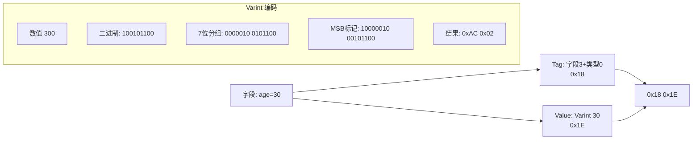
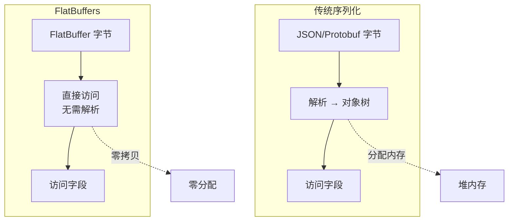
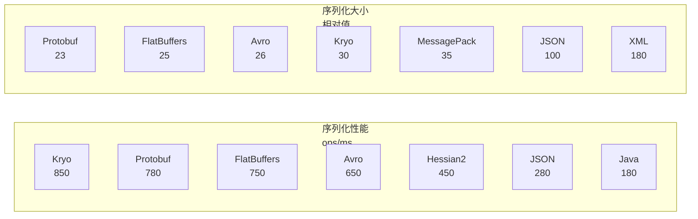
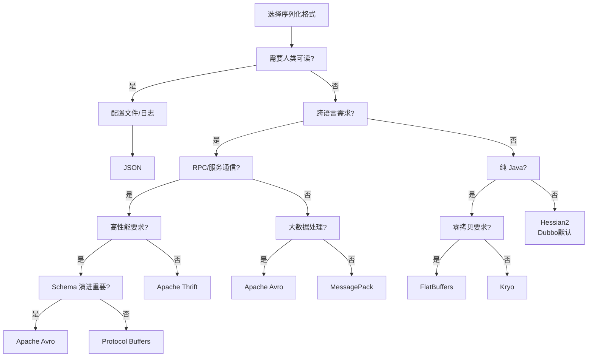

# 序列化格式深度对比

## 概述

序列化是将数据结构或对象转换为可存储或可传输格式的过程。在分布式系统中，序列化性能直接影响系统吞吐量和延迟。本文深入对比主流序列化格式，帮助选择适合场景的解决方案。

## 序列化格式分类

```mermaid
flowchart TB
    subgraph Formats["序列化格式分类"]
        Text["文本格式"]
        Binary["二进制格式"
        Schema["Schema 驱动"
    end

    Text --> JSON["JSON"]
    Text --> XML["XML"]
    Text --> YAML["YAML"]

    Binary --> Native["原生二进制"]
    Binary --> Compressed["压缩二进制"]

    Native --> Java["Java Serialization"]
    Native --> Kryo["Kryo"]
    Native --> Hessian["Hessian"]

    Compressed --> Protobuf["Protocol Buffers"]
    Compressed --> Thrift["Thrift"]
    Compressed --> Avro["Avro"]
    Compressed --> MessagePack["MessagePack"]

    Schema --> Protobuf
    Schema --> Thrift
    Schema --> Avro
    Schema --> FlatBuffers["FlatBuffers"]
```

## 性能对比指标

| 格式 | 序列化速度 | 反序列化速度 | 数据大小 | Schema 要求 | 可读性 |
|------|-----------|-------------|---------|------------|--------|
| JSON | ⭐⭐ | ⭐⭐ | ⭐⭐ | 无 | ⭐⭐⭐⭐⭐ |
| XML | ⭐ | ⭐ | ⭐ | 可选 | ⭐⭐⭐ |
| Java | ⭐⭐ | ⭐⭐ | ⭐⭐ | 内置 | ⭐ |
| Kryo | ⭐⭐⭐⭐⭐ | ⭐⭐⭐⭐⭐ | ⭐⭐⭐⭐ | 可选 | ⭐ |
| Hessian2 | ⭐⭐⭐⭐ | ⭐⭐⭐⭐ | ⭐⭐⭐ | 可选 | ⭐ |
| Protobuf | ⭐⭐⭐⭐⭐ | ⭐⭐⭐⭐⭐ | ⭐⭐⭐⭐⭐ | 必需 | ⭐ |
| Thrift | ⭐⭐⭐⭐ | ⭐⭐⭐⭐ | ⭐⭐⭐⭐ | 必需 | ⭐ |
| Avro | ⭐⭐⭐⭐ | ⭐⭐⭐⭐ | ⭐⭐⭐⭐⭐ | 必需 | ⭐ |
| FlatBuffers | ⭐⭐⭐⭐ | ⭐⭐⭐⭐⭐ | ⭐⭐⭐⭐ | 必需 | ⭐ |
| MessagePack | ⭐⭐⭐⭐ | ⭐⭐⭐⭐ | ⭐⭐⭐⭐ | 无 | ⭐⭐ |

## 详细格式分析

### 1. JSON（JavaScript Object Notation）

```mermaid
flowchart LR
    Object["对象"] -->|序列化| JSONStr['{"name":"Alice","age":30}']
    JSONStr -->|反序列化| Object2["对象"]

    subgraph Pros["优点"]
        P1["人类可读"]
        P2["语言无关"]
        P3["易于调试"]
    end

    subgraph Cons["缺点"]
        C1["冗余键名"]
        C2["数字精度丢失"]
        C3["无类型信息"]
    end
```

**适用场景**：Web API、配置文件、日志记录

```java
// Jackson 高性能 JSON 处理
ObjectMapper mapper = new ObjectMapper()
    .setSerializationInclusion(JsonInclude.Include.NON_NULL)
    .enable(SerializationFeature.INDENT_OUTPUT)
    .configure(DeserializationFeature.FAIL_ON_UNKNOWN_PROPERTIES, false);

// 序列化
User user = new User("Alice", 30, "alice@example.com");
String json = mapper.writeValueAsString(user);
// {"name":"Alice","age":30,"email":"alice@example.com"}

// 反序列化
User parsed = mapper.readValue(json, User.class);

// 处理大对象流
JsonFactory factory = new JsonFactory();
try (JsonGenerator gen = factory.createGenerator(new File("users.json"))) {
    gen.writeStartArray();
    for (User u : users) {
        gen.writeObject(u);
    }
    gen.writeEndArray();
}
```

### 2. Protocol Buffers

Google 开发的二进制序列化格式，强调性能和紧凑性：

```protobuf
// user.proto
syntax = "proto3";
package example;

option java_package = "com.example.proto";
option java_multiple_files = true;

message User {
    string id = 1;
    string name = 2;
    int32 age = 3;
    string email = 4;
    repeated string tags = 5;
    Address address = 6;

    enum Status {
        ACTIVE = 0;
        INACTIVE = 1;
        SUSPENDED = 2;
    }
    Status status = 7;

    // 时间戳
    int64 created_at = 8;
}

message Address {
    string street = 1;
    string city = 2;
    string country = 3;
    string zip_code = 4;
}

// 批量消息
message UserBatch {
    repeated User users = 1;
    int32 total_count = 2;
}
```

**Java 使用示例**：

```java
// 构建对象
User user = User.newBuilder()
    .setId("usr_001")
    .setName("Alice")
    .setAge(30)
    .setEmail("alice@example.com")
    .addTags("premium")
    .addTags("verified")
    .setAddress(Address.newBuilder()
        .setStreet("123 Main St")
        .setCity("Beijing")
        .build())
    .setStatus(User.Status.ACTIVE)
    .setCreatedAt(System.currentTimeMillis())
    .build();

// 序列化为字节数组
byte[] bytes = user.toByteArray();  // 约 50-100 字节

// 反序列化
User parsed = User.parseFrom(bytes);

// 流式处理大对象
OutputStream output = new FileOutputStream("users.pb");
for (User u : userList) {
    u.writeDelimitedTo(output);  // 带长度前缀的写入
}
output.close();

// 读取
InputStream input = new FileInputStream("users.pb");
while (true) {
    User u = User.parseDelimitedFrom(input);
    if (u == null) break;
    process(u);
}
```

**编码原理**：



### 3. Apache Avro

Hadoop 生态中的行式存储格式，以 Schema 为核心：

```json
// user.avsc
{
  "type": "record",
  "name": "User",
  "namespace": "com.example",
  "fields": [
    {"name": "id", "type": "string"},
    {"name": "name", "type": "string"},
    {"name": "age", "type": ["null", "int"], "default": null},
    {"name": "email", "type": "string"},
    {"name": "salary", "type": ["null", "double"], "default": null},
    {"name": "tags", "type": {"type": "array", "items": "string"}, "default": []},
    {"name": "created_at", "type": "long"}
  ]
}
```

**Java 使用示例**：

```java
// 加载 Schema
Schema schema = new Schema.Parser().parse(new File("user.avsc"));

// 创建记录
GenericRecord user = new GenericData.Record(schema);
user.put("id", "usr_001");
user.put("name", "Alice");
user.put("age", 30);
user.put("email", "alice@example.com");
user.put("salary", 50000.0);
user.put("tags", Arrays.asList("premium", "verified"));
user.put("created_at", System.currentTimeMillis());

// 序列化
ByteArrayOutputStream out = new ByteArrayOutputStream();
DatumWriter<GenericRecord> writer = new GenericDatumWriter<>(schema);
Encoder encoder = EncoderFactory.get().binaryEncoder(out, null);
writer.write(user, encoder);
encoder.flush();
byte[] serialized = out.toByteArray();

// 反序列化
DatumReader<GenericRecord> reader = new GenericDatumReader<>(schema);
Decoder decoder = DecoderFactory.get().binaryDecoder(serialized, null);
GenericRecord result = reader.read(null, decoder);

// Schema 演进示例
// V2 添加字段（向后兼容）
{
  "type": "record",
  "name": "User",
  "fields": [
    // ... 原有字段
    {"name": "phone", "type": ["null", "string"], "default": null}
  ]
}
```

**Avro 特点**：

- Schema 随数据一起存储或传输
- 支持丰富的 Schema 演进规则
- 无标签编码，数据更紧凑
- 适合大数据批处理场景

### 4. Kryo

高性能 Java 序列化框架，专注于速度和紧凑性：

```java
// Kryo 配置
Kryo kryo = new Kryo();
kryo.setRegistrationRequired(false);  // 允许未注册类
kryo.setReferences(true);              // 支持循环引用
kryo.setInstantiatorStrategy(new DefaultInstantiatorStrategy(
    new StdInstantiatorStrategy()
));

// 注册自定义序列化器
kryo.register(User.class, new UserSerializer());
kryo.register(DateTime.class, new DateTimeSerializer());

// 序列化
ByteArrayOutputStream baos = new ByteArrayOutputStream();
Output output = new Output(baos);
kryo.writeObject(output, user);
// 或写类信息
kryo.writeClassAndObject(output, user);
output.close();
byte[] bytes = baos.toByteArray();

// 反序列化
Input input = new Input(new ByteArrayInputStream(bytes));
User parsed = kryo.readObject(input, User.class);
// 或自动识别类型
Object obj = kryo.readClassAndObject(input);

// 线程安全池
class KryoPool {
    private final Pool<Kryo> pool = new Pool<Kryo>(true, false, 8) {
        @Override
        protected Kryo create() {
            Kryo kryo = new Kryo();
            kryo.register(User.class);
            return kryo;
        }
    };

    public byte[] serialize(Object obj) {
        Kryo kryo = pool.obtain();
        try {
            ByteArrayOutputStream baos = new ByteArrayOutputStream();
            Output output = new Output(baos);
            kryo.writeClassAndObject(output, obj);
            output.close();
            return baos.toByteArray();
        } finally {
            pool.free(kryo);
        }
    }
}
```

**Kryo 优化技巧**：

```java
// 1. 预注册类（推荐生产环境）
kryo.register(User.class, 100);  // 分配小 ID
kryo.register(Order.class, 101);

// 2. 自定义 FieldSerializer
public class UserSerializer extends FieldSerializer<User> {
    public UserSerializer(Kryo kryo, Class<User> type) {
        super(kryo, type);
        // 忽略特定字段
        setIgnoreSyntheticFields(false);
    }
}

// 3. 压缩输出
Output output = new Output(new DeflaterOutputStream(baos));

// 4. 使用 Unsafe 模式（更快但平台依赖）
UnsafeInput input = new UnsafeInput(bytes);
UnsafeOutput output = new UnsafeOutput(baos);
```

### 5. FlatBuffers

Google 的零拷贝序列化库，特别适合游戏和实时系统：



```java
// FlatBuffer 构建
FlatBufferBuilder builder = new FlatBufferBuilder(1024);

// 创建字符串
int nameOffset = builder.createString("Alice");

// 创建数组
int[] tagsOffsets = new int[]{
    builder.createString("premium"),
    builder.createString("verified")
};
int tagsVector = User.createTagsVector(builder, tagsOffsets);

// 构建对象
User.startUser(builder);
User.addId(builder, builder.createString("usr_001"));
User.addName(builder, nameOffset);
User.addAge(builder, 30);
User.addEmail(builder, builder.createString("alice@example.com"));
User.addTags(builder, tagsVector);
User.addStatus(builder, Status.ACTIVE);
User.addCreatedAt(builder, System.currentTimeMillis());
int userOffset = User.endUser(builder);

builder.finish(userOffset);
ByteBuffer buffer = builder.dataBuffer();

// 直接访问（零拷贝）
User user = User.getRootAsUser(buffer);
String name = user.name();  // 直接读取内存，无解析开销
int age = user.age();

// 遍历数组
for (int i = 0; i < user.tagsLength(); i++) {
    String tag = user.tags(i);
}
```

## 性能基准测试



**测试数据**（典型 POJO，1000 次循环）：

| 框架 | 序列化 (ms) | 反序列化 (ms) | 大小 (bytes) |
|------|------------|--------------|-------------|
| Java Native | 150 | 220 | 720 |
| Kryo | 35 | 45 | 180 |
| FST | 40 | 50 | 195 |
| Protobuf | 42 | 55 | 142 |
| Avro | 48 | 62 | 150 |
| Hessian2 | 85 | 95 | 245 |
| JSON (Jackson) | 120 | 140 | 380 |
| XML (XStream) | 450 | 520 | 680 |

## 选型指南



## 各场景推荐

| 场景 | 推荐格式 | 理由 |
|------|---------|------|
| REST API | JSON | 通用、可读、易调试 |
| gRPC 服务 | Protobuf | 性能、压缩、生态 |
| Dubbo 服务 | Hessian2/Kryo | Java 生态兼容 |
| 大数据存储 | Avro/Parquet | Schema 演进、列式存储 |
| 实时游戏 | FlatBuffers | 零拷贝、低延迟 |
| 消息队列 | Protobuf/Avro | 紧凑、版本兼容 |
| 缓存序列化 | Kryo/FST | 极快、紧凑 |
| 配置中心 | YAML/JSON | 人类可读 |

## 最佳实践

### 1. 版本兼容性

```protobuf
// Protobuf 字段变更规则
// 1. 不要修改字段编号
// 2. 新增字段使用 optional 或 repeated
// 3. 删除字段保留编号（reserved）

message User {
    reserved 5, 6;           // 保留已删除字段编号
    reserved "old_field";    // 保留字段名

    string id = 1;
    string name = 2;
    int32 age = 3;
    // 新增字段 - 向后兼容
    optional string phone = 7;
}
```

### 2. 安全防护

```java
// 防止反序列化攻击
ObjectInputStream ois = new ObjectInputStream(input) {
    @Override
    protected Class<?> resolveClass(ObjectStreamClass desc)
            throws IOException, ClassNotFoundException {
        // 白名单机制
        if (!isClassAllowed(desc.getName())) {
            throw new InvalidClassException("Class not allowed", desc.getName());
        }
        return super.resolveClass(desc);
    }
};

// Kryo 安全配置
kryo.setRegistrationRequired(true);  // 生产环境必须
```

### 3. 混合使用策略

```java
// 不同场景使用不同序列化
public class SerializationStrategy {

    public byte[] serializeForCache(Object obj) {
        // 缓存：Kryo 最快
        return kryoPool.serialize(obj);
    }

    public byte[] serializeForRpc(Object obj) {
        // RPC：Protobuf 跨语言
        return protobufSerializer.serialize(obj);
    }

    public byte[] serializeForStorage(Object obj) {
        // 存储：Avro 支持演进
        return avroSerializer.serialize(obj);
    }

    public String serializeForLog(Object obj) {
        // 日志：JSON 可读
        return jsonMapper.writeValueAsString(obj);
    }
}
```
