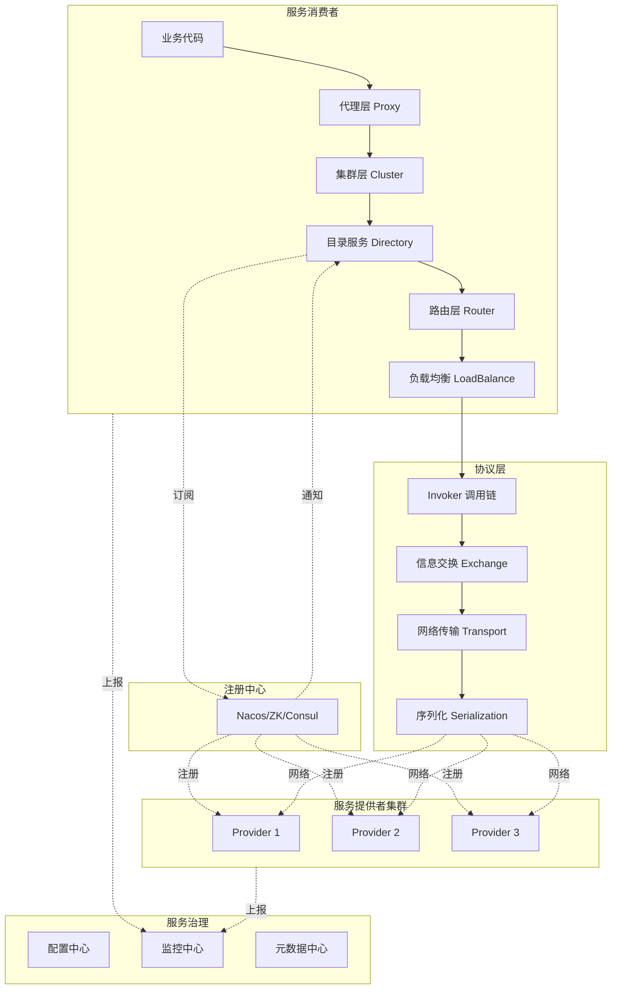
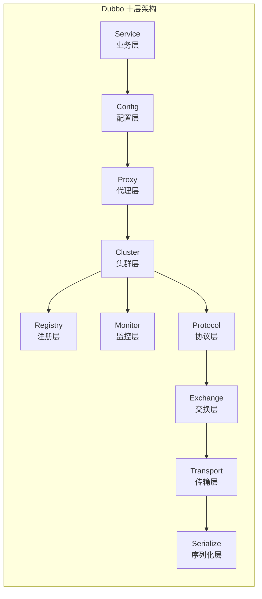
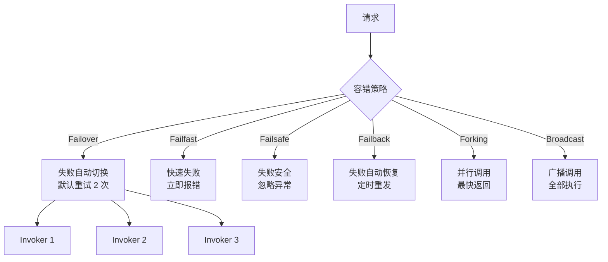
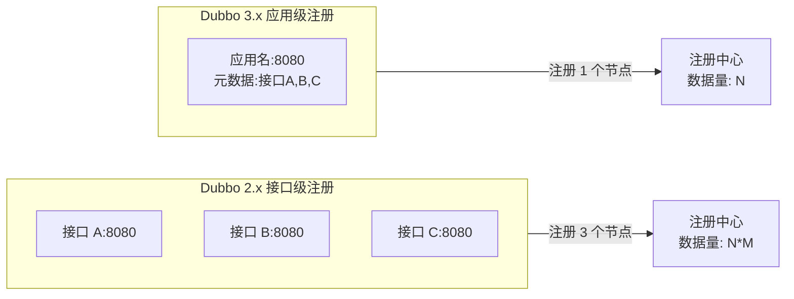

# Dubbo 详解

## 概述

Apache Dubbo 是由阿里巴巴开源的高性能 Java RPC 框架，后捐赠给 Apache 基金会。它以服务治理为核心，提供完整的微服务解决方案，是国内 Java 生态中最流行的 RPC 框架之一。

## 核心特性

### 1. 面向接口的 RPC

Dubbo 采用面向接口的编程模型，通过 Spring 无缝集成：

- 服务提供者实现接口并注册
- 服务消费者通过接口代理调用
- 零侵入的业务代码设计

### 2. 强大的服务治理能力

- **服务注册与发现**：支持 Nacos、ZooKeeper、Consul、etcd
- **负载均衡**：随机、轮询、最少活跃、一致性哈希等
- **流量控制**：限流、熔断、降级
- **动态配置**：运行时调整参数
- **服务分组与版本**：灰度发布、多环境隔离

### 3. 多协议支持

- **Dubbo**：默认高性能私有协议
- **HTTP/REST**：兼容 RESTful 服务
- **gRPC**：Google 开源协议
- **Thrift**：Facebook 开源协议
- **Triple**：Dubbo3 新一代协议（兼容 gRPC）

## 架构设计



## Dubbo 分层架构



## 快速开始（Dubbo 3）

### Maven 依赖

```xml
<dependencies>
    <!-- Dubbo 核心 -->
    <dependency>
        <groupId>org.apache.dubbo</groupId>
        <artifactId>dubbo</artifactId>
        <version>3.2.0</version>
    </dependency>

    <!-- 注册中心 Nacos -->
    <dependency>
        <groupId>org.apache.dubbo</groupId>
        <artifactId>dubbo-registry-nacos</artifactId>
        <version>3.2.0</version>
    </dependency>

    <!-- Triple 协议 -->
    <dependency>
        <groupId>org.apache.dubbo</groupId>
        <artifactId>dubbo-rpc-triple</artifactId>
        <version>3.2.0</version>
    </dependency>

    <!-- Spring Boot Starter -->
    <dependency>
        <groupId>org.apache.dubbo</groupId>
        <artifactId>dubbo-spring-boot-starter</artifactId>
        <version>3.2.0</version>
    </dependency>
</dependencies>
```

### 服务接口定义

```java
package com.example.order.api;

import java.util.List;
import java.util.concurrent.CompletableFuture;

public interface OrderService {

    /**
     * 创建订单
     */
    Order createOrder(CreateOrderRequest request);

    /**
     * 获取订单详情
     */
    Order getOrder(String orderId);

    /**
     * 异步获取订单
     */
    default CompletableFuture<Order> getOrderAsync(String orderId) {
        return CompletableFuture.completedFuture(getOrder(orderId));
    }

    /**
     * 批量查询订单
     */
    List<Order> batchGetOrders(List<String> orderIds);
}

// DTO 定义
public class Order implements java.io.Serializable {
    private String orderId;
    private String customerId;
    private List<OrderItem> items;
    private BigDecimal totalAmount;
    private OrderStatus status;
    private Long createTime;

    // getters and setters
}

public class CreateOrderRequest implements java.io.Serializable {
    private String customerId;
    private List<OrderItem> items;
    private String currency;
    private String remark;
}
```

### 服务提供者实现

```java
package com.example.order.provider;

import org.apache.dubbo.config.annotation.DubboService;
import org.apache.dubbo.rpc.RpcContext;
import org.slf4j.Logger;
import org.slf4j.LoggerFactory;

import com.example.order.api.*;

/**
 * OrderService 实现
 *
 * timeout: 方法级超时 3 秒
 * retries: 失败重试 2 次
 * loadbalance: 使用最少活跃调用数策略
 */
@DubboService(
    version = "1.0.0",
    group = "prod",
    timeout = 3000,
    retries = 2,
    loadbalance = "leastactive",
    interfaceClass = OrderService.class
)
public class OrderServiceImpl implements OrderService {

    private static final Logger logger = LoggerFactory.getLogger(OrderServiceImpl.class);

    @Override
    public Order createOrder(CreateOrderRequest request) {
        // 获取 RPC 上下文信息
        RpcContext context = RpcContext.getContext();
        String clientIp = context.getRemoteHost();
        String application = context.getAttachment("application");

        logger.info("Creating order from client: {}, app: {}", clientIp, application);

        // 参数校验
        if (request == null || request.getItems() == null || request.getItems().isEmpty()) {
            throw new IllegalArgumentException("Order items cannot be empty");
        }

        // 计算订单金额
        BigDecimal total = request.getItems().stream()
            .map(item -> item.getPrice().multiply(BigDecimal.valueOf(item.getQuantity())))
            .reduce(BigDecimal.ZERO, BigDecimal::add);

        Order order = new Order();
        order.setOrderId(UUID.randomUUID().toString().replace("-", ""));
        order.setCustomerId(request.getCustomerId());
        order.setItems(request.getItems());
        order.setTotalAmount(total);
        order.setStatus(OrderStatus.PENDING);
        order.setCreateTime(System.currentTimeMillis());

        // 持久化订单...

        return order;
    }

    @Override
    public Order getOrder(String orderId) {
        // 模拟从数据库查询
        Order order = new Order();
        order.setOrderId(orderId);
        order.setCustomerId("cust_001");
        order.setStatus(OrderStatus.PAID);
        return order;
    }

    @Override
    public List<Order> batchGetOrders(List<String> orderIds) {
        return orderIds.stream()
            .map(this::getOrder)
            .collect(Collectors.toList());
    }
}
```

### Spring Boot 配置

```yaml
# application-provider.yml
dubbo:
  application:
    name: order-service-provider
    version: 1.0.0
    # QOS 监控
    qos-enable: true
    qos-port: 33333

  protocol:
    name: dubbo
    port: 20880
    # 序列化方式
    serialization: hessian2
    # 线程池类型
    dispatcher: all
    threadpool: fixed
    threads: 200

  registry:
    address: nacos://localhost:8848
    group: dubbo
    # 注册服务
    register: true
    # 订阅服务
    subscribe: false

  provider:
    # 全局配置
    timeout: 5000
    retries: 3
    # 延迟暴露
    delay: -1
    # 并发控制
    executes: 1000

  scan:
    # 扫描包路径
    base-packages: com.example.order.provider

# 配置中心
  config-center:
    address: nacos://localhost:8848

  metadata-report:
    address: nacos://localhost:8848
```

### 服务消费者实现

```java
package com.example.order.consumer;

import org.apache.dubbo.config.annotation.DubboReference;
import org.apache.dubbo.rpc.RpcContext;
import org.springframework.stereotype.Service;

import com.example.order.api.*;

@Service
public class OrderConsumerService {

    /**
     * 引用远程服务
     *
     * check: false 启动时不检查服务可用性
     * mock: 失败时返回 mock 数据
     * async: 异步调用
     */
    @DubboReference(
        version = "1.0.0",
        group = "prod",
        check = false,
        mock = "true",
        timeout = 5000,
        loadbalance = "random",
        cluster = "failover"
    )
    private OrderService orderService;

    public Order createNewOrder(String customerId, List<OrderItem> items) {
        CreateOrderRequest request = new CreateOrderRequest();
        request.setCustomerId(customerId);
        request.setItems(items);
        request.setCurrency("CNY");

        // 设置隐式参数传递
        RpcContext.getContext().setAttachment("source", "web-portal");
        RpcContext.getContext().setAttachment("traceId", generateTraceId());

        return orderService.createOrder(request);
    }

    /**
     * 异步调用示例
     */
    public CompletableFuture<Order> createOrderAsync(String customerId, List<OrderItem> items) {
        // 设置异步调用
        RpcContext.getContext().setAttachment("async", "true");

        return orderService.getOrderAsync("order_123");
    }
}
```

## 集群容错策略



| 策略 | 说明 | 适用场景 |
|------|------|----------|
| Failover | 失败自动切换 | 读操作、幂等写操作 |
| Failfast | 快速失败 | 非幂等写操作 |
| Failsafe | 失败安全 | 日志记录、监控 |
| Failback | 失败自动恢复 | 消息通知 |
| Forking | 并行调用 | 实时性要求高的查询 |
| Broadcast | 广播调用 | 缓存刷新 |

## 负载均衡算法

```java
// 配置示例
@DubboReference(loadbalance = "roundrobin")
private OrderService orderService;
```

| 算法 | 说明 | 配置值 |
|------|------|--------|
| 随机 | 按权重随机 | random |
| 轮询 | 按权重轮询 | roundrobin |
| 最少活跃 | 活跃数最少优先 | leastactive |
| 一致性哈希 | 相同参数落到同一节点 | consistenthash |
| 最短响应 | 响应时间最短优先 | shortestresponse |

## Dubbo 3 新特性

### 1. 应用级服务发现



### 2. Triple 协议

```yaml
dubbo:
  protocol:
    name: tri  # Triple 协议
    port: 50051
    # 兼容 gRPC
    # 支持流式调用
```

### 3. 服务网格集成

```yaml
# Sidecar 代理模式
dubbo:
  consumer:
    mesh-enable: true
    proxy: sidecar
```

## 性能优化配置

```yaml
dubbo:
  protocol:
    # 序列化优化
    serialization: fastjson2  # 或 hessian2, protobuf

    # 线程模型
    dispatcher: message  # message, connection, execution, direct

    # 线程池
    threadpool: limit  # fixed, cached, limit, eager
    threads: 200

    # 缓冲区
    buffer: 8192

    # 连接数
    accepts: 1000
    connections: 100

  consumer:
    # 延迟暴露
    lazy: true

    # 粘滞连接
    sticky: false

    # 并发控制
    actives: 100
```

## 监控与管理

```java
// 配置指标采集
@Bean
public MetricsConfig metricsConfig() {
    MetricsConfig config = new MetricsConfig();
    config.setProtocol("prometheus");
    config.setEnableJvm(true);
    return config;
}
```

Dubbo Admin 提供：

- 服务查询与测试
- 动态配置下发
- 服务治理规则
- 流量控制管理

## 与 Spring Cloud 对比

| 特性 | Dubbo | Spring Cloud |
|------|-------|--------------|
| 通信协议 | 多协议支持 | HTTP/REST |
| 性能 | 高 | 中等 |
| 服务治理 | 丰富原生支持 | 依赖组件 |
| 生态集成 | 阿里生态 | Spring 生态 |
| 多语言 | Java 为主 | 良好 |
| 云原生 | Dubbo 3 改进 | 原生支持 |
