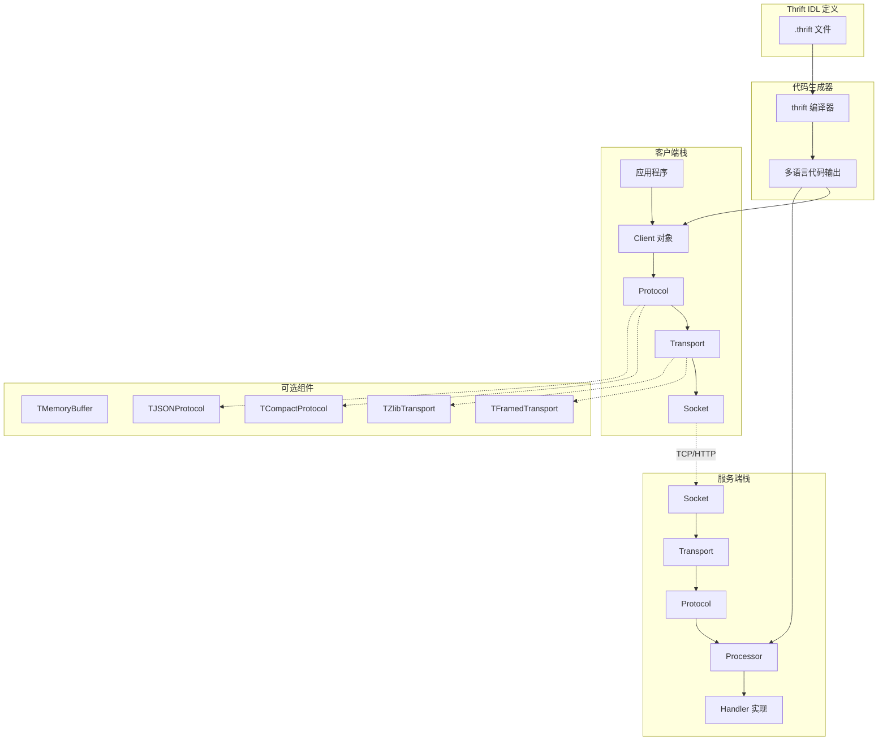
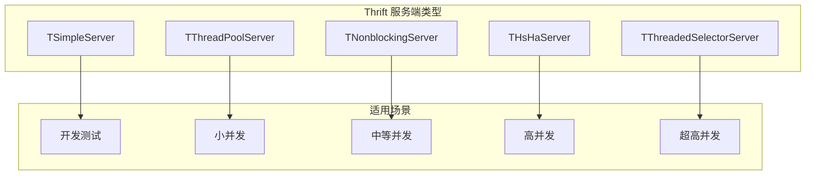

# Apache Thrift 详解

## 概述

Apache Thrift 是由 Facebook 开发并贡献给 Apache 基金会的跨语言 RPC 框架。它通过单一的接口定义语言（IDL）生成服务端和客户端代码，支持 20 多种编程语言，是构建多语言异构系统的理想选择。

## 核心特性

### 1. 完整的 RPC 栈

Thrift 不仅提供 RPC 通信能力，还包含完整的协议栈：

- **传输层（Transport）**：抽象网络 I/O，支持 TCP、文件、内存等
- **协议层（Protocol）**：定义数据编码格式（Binary、JSON、Compact）
- **处理层（Processor）**：封装 RPC 调用处理逻辑
- **服务端（Server）**：管理连接和请求分发

### 2. 多语言支持

原生支持 C++, Java, Python, PHP, Ruby, Erlang, Perl, Haskell, C#, Swift, JavaScript 等语言。

### 3. 灵活的传输与协议组合

可以根据场景选择最佳组合：

- **TBinaryProtocol**：快速、紧凑的二进制格式
- **TCompactProtocol**：更高效的变长编码
- **TJSONProtocol**：人类可读的 JSON 格式
- **TFramedTransport**：非阻塞服务端必需

## 架构设计



## IDL 定义示例

```thrift
namespace java com.example.order
namespace py order
namespace go order
namespace cpp order

// 定义数据类型
enum OrderStatus {
    PENDING = 0,
    PROCESSING = 1,
    SHIPPED = 2,
    DELIVERED = 3,
    CANCELLED = 4
}

struct OrderItem {
    1: required string productId,
    2: required i32 quantity,
    3: required double price,
    4: optional string sku
}

struct Order {
    1: required string orderId,
    2: required string customerId,
    3: required list<OrderItem> items,
    4: required double totalAmount,
    5: required OrderStatus status,
    6: required i64 createdAt,
    7: optional string remarks,
    8: optional map<string, string> metadata
}

// 异常定义
exception OrderNotFoundException {
    1: required string message,
    2: required string orderId
}

exception InvalidOrderException {
    1: required string message,
    2: required list<string> errors
}

// 服务定义
service OrderService {
    Order createOrder(1: string customerId, 2: list<OrderItem> items)
        throws (1: InvalidOrderException invalidError),

    Order getOrder(1: string orderId)
        throws (1: OrderNotFoundException notFound),

    list<Order> listOrdersByCustomer(1: string customerId, 2: i32 limit, 3: i32 offset),

    void cancelOrder(1: string orderId)
        throws (1: OrderNotFoundException notFound, 2: InvalidOrderException invalidError),

    // 批量处理 - 返回结果的流式处理
    list<Order> batchCreateOrders(1: list<Order> orders)
}

// 支持多继承的服务
service PremiumOrderService extends OrderService {
    Order expressOrder(1: string orderId),
    double calculateDiscount(1: string customerId, 2: double amount)
}
```

## Java 服务端实现

```java
package com.example.order;

import org.apache.thrift.TException;
import org.apache.thrift.server.TServer;
import org.apache.thrift.server.TThreadedSelectorServer;
import org.apache.thrift.transport.*;
import org.apache.thrift.protocol.*;
import java.util.*;
import java.util.concurrent.ConcurrentHashMap;

public class OrderServiceImpl implements OrderService.Iface {

    private final Map<String, Order> orderStore = new ConcurrentHashMap<>();

    @Override
    public Order createOrder(String customerId, List<OrderItem> items)
            throws InvalidOrderException, TException {

        // 参数校验
        if (customerId == null || customerId.isEmpty()) {
            throw new InvalidOrderException("Customer ID cannot be empty",
                Arrays.asList("customerId"));
        }

        if (items == null || items.isEmpty()) {
            throw new InvalidOrderException("Order items cannot be empty",
                Arrays.asList("items"));
        }

        // 计算总金额
        double totalAmount = items.stream()
            .mapToDouble(item -> item.price * item.quantity)
            .sum();

        // 创建订单
        Order order = new Order();
        order.setOrderId(UUID.randomUUID().toString());
        order.setCustomerId(customerId);
        order.setItems(items);
        order.setTotalAmount(totalAmount);
        order.setStatus(OrderStatus.PENDING);
        order.setCreatedAt(System.currentTimeMillis() / 1000);

        orderStore.put(order.getOrderId(), order);

        return order;
    }

    @Override
    public Order getOrder(String orderId) throws OrderNotFoundException, TException {
        Order order = orderStore.get(orderId);
        if (order == null) {
            throw new OrderNotFoundException("Order not found", orderId);
        }
        return order;
    }

    @Override
    public List<Order> listOrdersByCustomer(String customerId, int limit, int offset)
            throws TException {
        return orderStore.values().stream()
            .filter(o -> o.getCustomerId().equals(customerId))
            .skip(offset)
            .limit(limit)
            .toList();
    }

    @Override
    public void cancelOrder(String orderId)
            throws OrderNotFoundException, InvalidOrderException, TException {
        Order order = orderStore.get(orderId);
        if (order == null) {
            throw new OrderNotFoundException("Order not found", orderId);
        }

        if (order.getStatus() == OrderStatus.SHIPPED ||
            order.getStatus() == OrderStatus.DELIVERED) {
            throw new InvalidOrderException("Cannot cancel shipped/delivered order",
                Arrays.asList("status"));
        }

        order.setStatus(OrderStatus.CANCELLED);
    }

    @Override
    public List<Order> batchCreateOrders(List<Order> orders) throws TException {
        List<Order> results = new ArrayList<>();
        for (Order order : orders) {
            Order created = createOrder(order.getCustomerId(), order.getItems());
            results.add(created);
        }
        return results;
    }
}

// 服务端启动类
public class OrderServer {

    public static void main(String[] args) {
        try {
            // 创建 Handler
            OrderServiceImpl handler = new OrderServiceImpl();
            OrderService.Processor<OrderServiceImpl> processor =
                new OrderService.Processor<>(handler);

            // 配置传输层 - 非阻塞服务器
            TNonblockingServerSocket serverTransport =
                new TNonblockingServerSocket(9090);

            // 配置线程池
            TThreadedSelectorServer.Args serverArgs =
                new TThreadedSelectorServer.Args(serverTransport)
                    .processor(processor)
                    .protocolFactory(new TCompactProtocol.Factory())
                    .workerThreads(100)
                    .selectorThreads(4);

            TServer server = new TThreadedSelectorServer(serverArgs);

            System.out.println("Starting Thrift server on port 9090...");
            server.serve();

        } catch (Exception e) {
            e.printStackTrace();
        }
    }
}
```

## Java 客户端实现

```java
package com.example.order;

import org.apache.thrift.TException;
import org.apache.thrift.transport.*;
import org.apache.thrift.protocol.*;
import java.util.*;

public class OrderClient {

    private TTransport transport;
    private OrderService.Client client;

    public void connect(String host, int port) throws TTransportException {
        // 使用带帧传输的非阻塞传输
        transport = new TFramedTransport(
            new TSocket(host, port, 5000)  // 5秒超时
        );

        // 使用紧凑协议
        TProtocol protocol = new TCompactProtocol(transport);

        client = new OrderService.Client(protocol);
        transport.open();
    }

    public Order createOrder(String customerId, List<OrderItem> items)
            throws InvalidOrderException, TException {
        return client.createOrder(customerId, items);
    }

    public Order getOrder(String orderId) throws OrderNotFoundException, TException {
        return client.getOrder(orderId);
    }

    public void close() {
        if (transport != null && transport.isOpen()) {
            transport.close();
        }
    }

    // 使用示例
    public static void main(String[] args) {
        OrderClient client = new OrderClient();
        try {
            client.connect("localhost", 9090);

            // 创建订单
            List<OrderItem> items = Arrays.asList(
                new OrderItem("prod_001", 2, 29.99, null),
                new OrderItem("prod_002", 1, 59.99, null)
            );

            Order order = client.createOrder("cust_001", items);
            System.out.println("Created order: " + order.getOrderId());

            // 查询订单
            Order retrieved = client.getOrder(order.getOrderId());
            System.out.println("Retrieved order status: " + retrieved.getStatus());

        } catch (InvalidOrderException e) {
            System.err.println("Invalid order: " + e.getMessage());
        } catch (OrderNotFoundException e) {
            System.err.println("Order not found: " + e.getOrderId());
        } catch (TException e) {
            System.err.println("Thrift error: " + e.getMessage());
        } finally {
            client.close();
        }
    }
}
```

## 服务端类型对比



| 服务端类型 | 特点 | 适用场景 |
|-----------|------|----------|
| TSimpleServer | 单线程阻塞 | 开发测试 |
| TThreadPoolServer | 线程池处理 | 小并发 |
| TNonblockingServer | 单线程 NIO | 中等并发 |
| THsHaServer | 半同步半异步 | 高并发 |
| TThreadedSelectorServer | 多线程 NIO | 超高并发 |

## Python 客户端示例

```python
from thrift import Thrift
from thrift.transport import TSocket, TTransport
from thrift.protocol import TCompactProtocol
from order import OrderService, ttypes

def main():
    try:
        # 创建传输层
        transport = TSocket.TSocket('localhost', 9090)
        transport = TTransport.TFramedTransport(transport)

        # 创建协议层
        protocol = TCompactProtocol.TCompactProtocol(transport)

        # 创建客户端
        client = OrderService.Client(protocol)

        # 连接
        transport.open()

        # 调用服务
        items = [
            ttypes.OrderItem(productId='prod_001', quantity=2, price=29.99),
            ttypes.OrderItem(productId='prod_002', quantity=1, price=59.99)
        ]

        order = client.createOrder('cust_001', items)
        print(f"Created order: {order.orderId}, Total: {order.totalAmount}")

        transport.close()

    except Thrift.TException as tx:
        print(f"Thrift exception: {tx.message}")

if __name__ == '__main__':
    main()
```

## 编译命令

```bash
# Java
trift --gen java order.thrift

# Python
thrift --gen py order.thrift

# Go
thrift --gen go order.thrift

# 同时生成多语言
thrift --gen java --gen py --gen go --gen cpp order.thrift

# 带命名空间前缀
thrift --gen java:beans,generated_annotations=suppress order.thrift
```

## 性能对比

| 协议/传输组合 | 序列化速度 | 包大小 | 适用场景 |
|-------------|-----------|--------|----------|
| TBinaryProtocol + TSocket | 快 | 中等 | 默认选择 |
| TCompactProtocol + TFramedTransport | 快 | 小 | 生产推荐 |
| TJSONProtocol + TSocket | 慢 | 大 | 调试 |
| TTupleProtocol + TMemoryBuffer | 极快 | 极小 | 内部服务 |

## 与 gRPC 对比

| 特性 | Thrift | gRPC |
|------|--------|------|
| 传输协议 | 灵活选择 | HTTP/2 |
| 序列化 | 多种可选 | Protobuf |
| 代码生成 | 成熟完善 | 良好 |
| 流式支持 | 有限 | 原生支持 |
| 社区生态 | 成熟 | 活跃 |
| 服务治理 | 需集成 | 生态丰富 |
