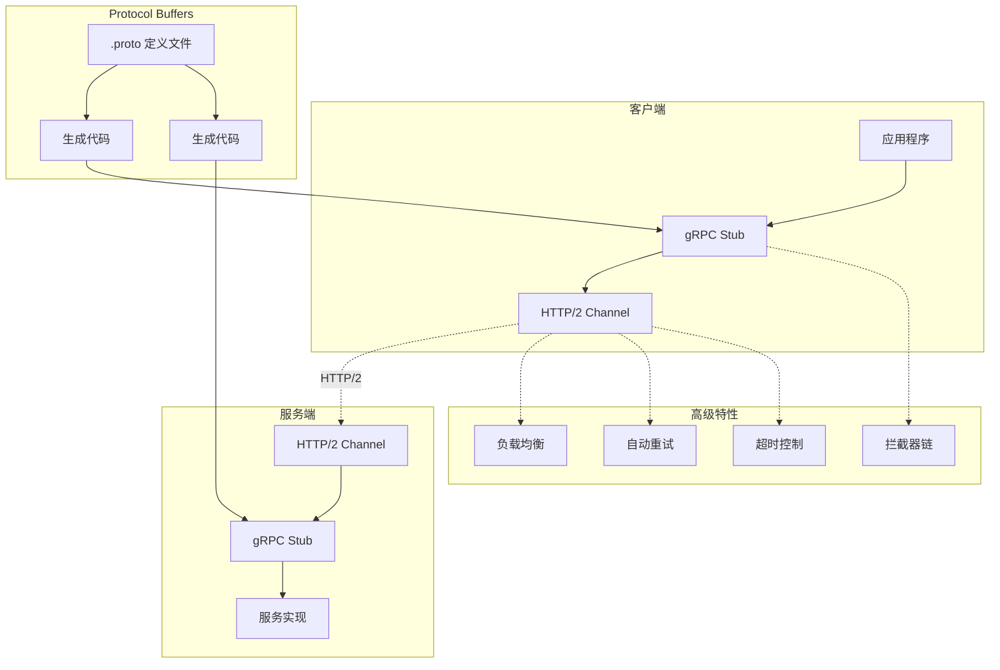
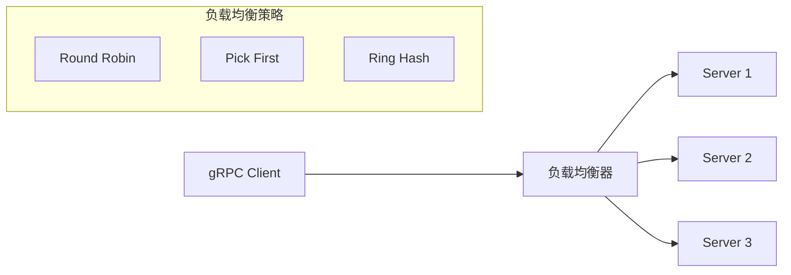
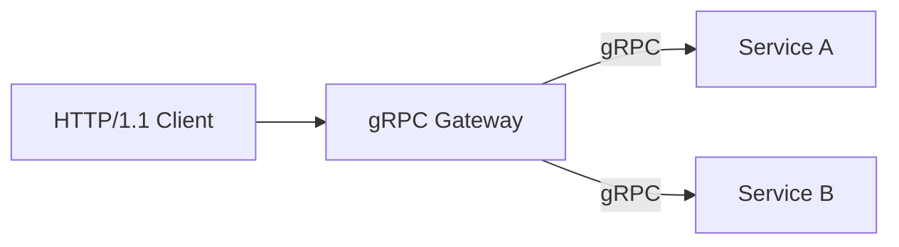

# gRPC 详解

## 概述

gRPC 是由 Google 开发的高性能、开源和通用的 RPC 框架，基于 HTTP/2 协议和 Protocol Buffers 序列化格式。它支持多种编程语言，广泛应用于微服务架构、分布式系统和云原生应用中。

## 核心特性

### 1. 基于 HTTP/2

gRPC 使用 HTTP/2 作为传输协议，带来多项优势：

- **多路复用**：单一 TCP 连接上并发处理多个请求/响应
- **头部压缩**：HPACK 算法减少头部开销
- **服务器推送**：服务端主动向客户端推送数据
- **流式通信**：支持双向流式数据传输

### 2. Protocol Buffers 序列化

- 高效的二进制序列化格式
- 强类型接口定义
- 自动生成多语言代码
- 向后兼容的协议演进

### 3. 四种服务类型

- **Unary RPC**：简单的一请求一响应
- **Server Streaming**：服务端流式返回多个响应
- **Client Streaming**：客户端流式发送多个请求
- **Bidirectional Streaming**：双向流式通信

## 架构设计



## 快速开始

### 定义 .proto 文件

```protobuf
syntax = "proto3";
package order;

option go_package = "github.com/example/order";

// 订单服务定义
service OrderService {
    // 创建订单
    rpc CreateOrder(CreateOrderRequest) returns (Order);

    // 获取订单流
    rpc StreamOrders(StreamOrdersRequest) returns (stream Order);

    // 批量创建订单
    rpc BatchCreateOrders(stream CreateOrderRequest) returns (OrderSummary);

    // 双向流式处理
    rpc ProcessOrders(stream OrderEvent) returns (stream OrderStatus);
}

message CreateOrderRequest {
    string customer_id = 1;
    repeated OrderItem items = 2;
    string currency = 3;
}

message OrderItem {
    string product_id = 1;
    int32 quantity = 2;
    double price = 3;
}

message Order {
    string order_id = 1;
    string customer_id = 2;
    repeated OrderItem items = 3;
    double total_amount = 4;
    OrderStatus status = 5;
    int64 created_at = 6;
}

enum OrderStatus {
    PENDING = 0;
    PROCESSING = 1;
    SHIPPED = 2;
    DELIVERED = 3;
    CANCELLED = 4;
}

message OrderSummary {
    int32 total_orders = 1;
    double total_amount = 2;
}

message OrderEvent {
    string order_id = 1;
    string event_type = 2;
    bytes payload = 3;
}

message StreamOrdersRequest {
    string customer_id = 1;
}
```

### Go 语言服务端实现

```go
package main

import (
    "context"
    "fmt"
    "log"
    "net"
    "time"

    "google.golang.org/grpc"
    "google.golang.org/grpc/codes"
    "google.golang.org/grpc/status"
)

type OrderServer struct {
    UnimplementedOrderServiceServer
    orders map[string]*Order
}

func (s *OrderServer) CreateOrder(ctx context.Context, req *CreateOrderRequest) (*Order, error) {
    // 超时检查
    if ctx.Err() == context.Canceled {
        return nil, status.Error(codes.Canceled, "request canceled")
    }

    order := &Order{
        OrderId:      generateOrderID(),
        CustomerId:   req.CustomerId,
        Items:        req.Items,
        TotalAmount:  calculateTotal(req.Items),
        Status:       OrderStatus_PENDING,
        CreatedAt:    time.Now().Unix(),
    }

    s.orders[order.OrderId] = order
    return order, nil
}

func (s *OrderServer) StreamOrders(req *StreamOrdersRequest, stream OrderService_StreamOrdersServer) error {
    // 流式返回订单
    for _, order := range s.orders {
        if order.CustomerId == req.CustomerId {
            if err := stream.Send(order); err != nil {
                return err
            }
            time.Sleep(100 * time.Millisecond) // 模拟处理延迟
        }
    }
    return nil
}

func (s *OrderServer) BatchCreateOrders(stream OrderService_BatchCreateOrdersServer) error {
    var summary OrderSummary

    for {
        req, err := stream.Recv()
        if err == io.EOF {
            return stream.SendAndClose(&summary)
        }
        if err != nil {
            return err
        }

        order, _ := s.CreateOrder(stream.Context(), req)
        summary.TotalOrders++
        summary.TotalAmount += order.TotalAmount
    }
}

// 拦截器实现
func loggingInterceptor(ctx context.Context, req interface{}, info *grpc.UnaryServerInfo, handler grpc.UnaryHandler) (interface{}, error) {
    start := time.Now()
    resp, err := handler(ctx, req)
    log.Printf("Method: %s, Duration: %v, Error: %v", info.FullMethod, time.Since(start), err)
    return resp, err
}

func main() {
    lis, err := net.Listen("tcp", ":50051")
    if err != nil {
        log.Fatalf("failed to listen: %v", err)
    }

    s := grpc.NewServer(
        grpc.UnaryInterceptor(loggingInterceptor),
        grpc.MaxConcurrentStreams(100),
        grpc.ConnectionTimeout(30 * time.Second),
    )

    RegisterOrderServiceServer(s, &OrderServer{
        orders: make(map[string]*Order),
    })

    log.Printf("gRPC server listening on :50051")
    if err := s.Serve(lis); err != nil {
        log.Fatalf("failed to serve: %v", err)
    }
}
```

### Go 语言客户端实现

```go
package main

import (
    "context"
    "log"
    "time"

    "google.golang.org/grpc"
    "google.golang.org/grpc/credentials/insecure"
    "google.golang.org/grpc/keepalive"
)

func main() {
    // 连接配置
    kacp := keepalive.ClientParameters{
        Time:                10 * time.Second,
        Timeout:             3 * time.Second,
        PermitWithoutStream: true,
    }

    conn, err := grpc.Dial(
        "localhost:50051",
        grpc.WithTransportCredentials(insecure.NewCredentials()),
        grpc.WithKeepaliveParams(kacp),
        grpc.WithDefaultServiceConfig(`{
            "loadBalancingPolicy": "round_robin",
            "healthCheckConfig": {"serviceName": ""}
        }`),
    )
    if err != nil {
        log.Fatalf("did not connect: %v", err)
    }
    defer conn.Close()

    client := NewOrderServiceClient(conn)
    ctx, cancel := context.WithTimeout(context.Background(), 5*time.Second)
    defer cancel()

    // Unary 调用
    order, err := client.CreateOrder(ctx, &CreateOrderRequest{
        CustomerId: "cust_001",
        Items: []*OrderItem{
            {ProductId: "prod_001", Quantity: 2, Price: 29.99},
            {ProductId: "prod_002", Quantity: 1, Price: 59.99},
        },
        Currency: "USD",
    })
    if err != nil {
        log.Fatalf("could not create order: %v", err)
    }
    log.Printf("Created order: %v", order)

    // 服务端流式调用
    stream, err := client.StreamOrders(ctx, &StreamOrdersRequest{CustomerId: "cust_001"})
    if err != nil {
        log.Fatalf("could not stream orders: %v", err)
    }

    for {
        order, err := stream.Recv()
        if err == io.EOF {
            break
        }
        if err != nil {
            log.Fatalf("stream error: %v", err)
        }
        log.Printf("Received order: %s", order.OrderId)
    }
}
```

## 高级特性

### 1. 负载均衡



### 2. 服务网格集成

gRPC 与 Istio、Linkerd 等服务网格无缝集成，实现：

- 自动 mTLS 加密
- 流量管理（金丝雀发布、A/B测试）
- 可观测性（指标、追踪、日志）
- 熔断和重试策略

### 3. gRPC Gateway



通过 gRPC Gateway 将 RESTful JSON API 转换为 gRPC 调用。

## 性能优化建议

| 优化项 | 配置建议 | 效果 |
|--------|----------|------|
| 连接池 | 启用通道池化 | 减少连接建立开销 |
| Keepalive | 设置 10-30 秒探测 | 及时检测死连接 |
| 消息压缩 | 启用 Gzip 压缩 | 减少带宽占用 |
| 流控窗口 | 调整 HTTP/2 窗口大小 | 提升吞吐 |
| 批处理 | 使用流式 API | 降低延迟 |

## 与其他 RPC 框架对比

| 特性 | gRPC | Thrift | Dubbo |
|------|------|--------|-------|
| 传输协议 | HTTP/2 | TCP/HTTP | TCP |
| 序列化 | Protocol Buffers | Thrift IDL | Hessian2/Protobuf |
| 流式支持 | 原生支持 | 有限支持 | 需扩展 |
| 生态工具 | 丰富 | 一般 | 丰富（Java） |
| 多语言 | 10+ | 10+ | Java为主 |

## 最佳实践

1. **合理设置超时**：避免级联故障
2. **使用拦截器**：统一处理日志、认证、监控
3. **定义清晰的 proto**：遵循命名规范和版本管理
4. **启用健康检查**：配合 Kubernetes 等容器编排平台
5. **监控关键指标**：QPS、延迟、错误率、流量


---

## 相关主题

- [Dubbo详解](./Dubbo详解.md)
- [Thrift详解](./Thrift详解.md)
- [Protobuf协议](../02-serialization/Protobuf协议.md)

## 参考资源

- [gRPC文档](https://grpc.io/docs/)
- [gRPC vs REST](https://cloud.google.com/blog/products/api-management/understanding-grpc-openapi-and-rest-and-when-to-use-them)
