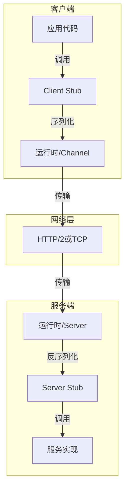

# 分布式RPC深度分析

**文档版本**：v1.0
**创建时间**：2026年4月
**状态**：✅ 初稿完成

---

## 📋 执行摘要

远程过程调用（RPC）是分布式系统中实现进程间通信的核心机制，允许程序像调用本地函数一样调用远程服务器上的函数。
现代RPC框架（如gRPC、Thrift）提供了高效、类型安全、跨语言的通信能力，是微服务架构的基础。

**核心特性**：

- 抽象网络通信细节
- 支持多种序列化格式
- 提供服务发现和负载均衡
- 支持流式通信和双向流

---

## 一、核心概念

### 1.1 定义与原理

RPC是一种**客户端-服务器通信模型**：

1. 客户端以本地函数调用的方式发起请求
2. 客户端Stub将调用封装为网络消息
3. 通过网络传输到服务器
4. 服务器Stub解包消息，调用实际服务
5. 返回结果沿相反路径传回客户端

### 1.2 RPC调用流程

```
客户端进程                    服务器进程
    |                              |
    |  1. 调用Hello("World")       |
    |------------>|                |
    |             |                |
    |  2. 序列化参数               |
    |  3. 打包为消息               |
    |             |                |
    |=============================>| 网络传输
    |             |                |
    |             |  4. 解包消息   |
    |             |  5. 反序列化   |
    |             |  6. 调用实现   |
    |             |  7. 序列化结果 |
    |<=============================| 返回结果
    |             |                |
    |  8. 解包结果                 |
    |  9. 反序列化                 |
    |<------------|                |
    |  返回"Hello World"           |
```

### 1.3 适用场景

| 场景 | 适用性 | 说明 |
|------|--------|------|
| 微服务通信 | ⭐⭐⭐⭐⭐ | 服务间调用的标准方式 |
| 分布式计算 | ⭐⭐⭐⭐⭐ | MapReduce、Spark等框架 |
| 移动/前端后端 | ⭐⭐⭐⭐ | gRPC-Web、高效数据传输 |
| 低延迟金融交易 | ⭐⭐⭐ | 需要极致优化 |
| 浏览器直接调用 | ⭐⭐ | REST/GraphQL更通用 |

---

## 二、技术细节

### 2.1 RPC架构组件



### 2.2 序列化机制

#### 常见序列化格式对比

| 格式 | 性能 | 可读性 | 跨语言 | 模式演化 | 适用场景 |
|------|------|--------|--------|---------|---------|
| **Protobuf** | ⭐⭐⭐⭐⭐ | 二进制 | ⭐⭐⭐⭐⭐ | ⭐⭐⭐⭐ | gRPC默认，高性能 |
| **Thrift** | ⭐⭐⭐⭐⭐ | 二进制 | ⭐⭐⭐⭐⭐ | ⭐⭐⭐⭐ | Thrift框架 |
| **Avro** | ⭐⭐⭐⭐ | 二进制 | ⭐⭐⭐⭐ | ⭐⭐⭐⭐⭐ | Hadoop生态 |
| **JSON** | ⭐⭐⭐ | 文本 | ⭐⭐⭐⭐⭐ | ⭐⭐⭐ | 调试、Web |
| **MessagePack** | ⭐⭐⭐⭐ | 二进制 | ⭐⭐⭐⭐ | ⭐⭐⭐ | 高性能JSON替代 |
| **FlatBuffers** | ⭐⭐⭐⭐⭐ | 二进制 | ⭐⭐⭐⭐ | ⭐⭐⭐ | 零拷贝解析 |

#### Protocol Buffers详解

```protobuf
// 定义服务
service Greeter {
  rpc SayHello (HelloRequest) returns (HelloReply);
  rpc SayHelloStream (stream HelloRequest) returns (stream HelloReply);
}

// 定义消息
message HelloRequest {
  string name = 1;
  int32 age = 2;
  repeated string hobbies = 3;
}

message HelloReply {
  string message = 1;
}
```

**编码原理**：

- 字段编号+类型标识（Tag）
- Varint变长编码（小整数省空间）
- 长度前缀（对于变长字段）

### 2.3 传输协议

#### HTTP/2特性（gRPC使用）

| 特性 | 说明 | RPC优势 |
|------|------|---------|
| **多路复用** | 单一连接多请求并行 | 减少连接开销 |
| **头部压缩** | HPACK算法压缩头部 | 减少传输数据 |
| **Server Push** | 服务端主动推送 | 优化某些场景 |
| **流控** | 基于帧的流量控制 | 背压支持 |

#### 连接管理

```python
# gRPC通道类型
# 1. 不安全通道
channel = grpc.insecure_channel('localhost:50051')

# 2. 安全通道（TLS）
credentials = grpc.ssl_channel_credentials()
channel = grpc.secure_channel('localhost:50051', credentials)

# 3. 连接池和负载均衡
channel = grpc.insecure_channel(
    'dns:///service.example.com',
    options=[
        ('grpc.lb_policy_name', 'round_robin'),
        ('grpc.max_concurrent_streams', 100),
    ]
)
```

### 2.4 通信模式

#### 四种服务类型

```protobuf
service StreamingService {
  // 1. 简单RPC（Unary）
  rpc Simple(Request) returns (Response);

  // 2. 服务端流式
  rpc ServerStreaming(Request) returns (stream Response);

  // 3. 客户端流式
  rpc ClientStreaming(stream Request) returns (Response);

  // 4. 双向流式
  rpc BidirectionalStreaming(stream Request) returns (stream Response);
}
```

**流式通信示例**：

```python
# 双向流式（聊天应用）
def Chat(self, request_iterator, context):
    """处理双向流"""
    for message in request_iterator:
        # 处理收到的消息
        process(message)
        # 发送响应
        yield ChatResponse(reply=f"Echo: {message.content}")
```

### 2.5 服务发现与负载均衡

#### 服务发现架构

```
客户端                     服务注册中心                服务端
  |                            |                        |
  |--- 1. 订阅服务A ---------->|                        |
  |                            |<--- 2. 注册服务A -------|
  |                            |                        |
  |<-- 3. 返回实例列表 ---------|                        |
  |                            |<--- 4. 心跳保活 --------|
  |                            |                        |
  |============================直接调用===================>|
```

#### 负载均衡策略

| 策略 | 描述 | 适用场景 |
|------|------|---------|
| **轮询** | 依次选择每个实例 | 实例性能相同 |
| **随机** | 随机选择 | 简单均衡 |
| **最少连接** | 选择当前连接数最少的 | 长连接场景 |
| **加权轮询** | 根据权重选择 | 实例性能不同 |
| **一致性哈希** | 根据请求参数哈希 | 需要会话保持 |

---

## 三、主流RPC框架对比

### 3.1 框架特性对比

| 特性 | gRPC | Apache Thrift | Dubbo | BRPC |
|------|------|---------------|-------|------|
| **开发方** | Google | Apache | Alibaba | Baidu |
| **传输协议** | HTTP/2 | TCP/HTTP | TCP | 多种 |
| **序列化** | Protobuf | Thrift/JSON/等 | Hessian/Protobuf | Protobuf/JSON |
| **语言支持** | 10+ | 20+ | Java为主 | C++/Java/Python |
| **流式支持** | 完整 | 支持 | 有限 | 支持 |
| **服务发现** | 需集成 | 需集成 | 内置 | 内置 |
| **负载均衡** | 客户端 | 客户端 | 多种 | 多种 |
| **性能** | ⭐⭐⭐⭐⭐ | ⭐⭐⭐⭐⭐ | ⭐⭐⭐⭐ | ⭐⭐⭐⭐⭐ |
| **易用性** | ⭐⭐⭐⭐⭐ | ⭐⭐⭐⭐ | ⭐⭐⭐⭐ | ⭐⭐⭐ |

### 3.2 性能基准

| 指标 | gRPC | Thrift | REST/JSON |
|------|------|--------|-----------|
| 延迟（P99） | <1ms | <1ms | 5-10ms |
| QPS（单核） | 100K+ | 100K+ | 10K+ |
| 序列化速度 | 极快 | 极快 | 中等 |
| 消息大小 | 小（二进制） | 小（二进制） | 大（文本） |

### 3.3 选型决策树

```
需要跨语言支持？
├── 是
│   ├── 需要流式通信？
│   │   ├── 是 → gRPC（首选）
│   │   └── 否 → gRPC或Thrift
│   └── 性能要求极致？
│       ├── 是 → Thrift（更轻量）
│       └── 否 → gRPC
└── 否（Java生态）
    ├── 需要丰富生态（治理、监控）？
    │   ├── 是 → Dubbo
    │   └── 否 → gRPC或Dubbo
    └── C++高性能场景？
        └── BRPC
```

---

## 四、实践指南

### 4.1 gRPC最佳实践

**1. 定义清晰的Proto接口**

```protobuf
// 良好的命名规范
service UserService {
  rpc GetUser(GetUserRequest) returns (User);
  rpc ListUsers(ListUsersRequest) returns (ListUsersResponse);
  rpc CreateUser(CreateUserRequest) returns (User);
  rpc UpdateUser(UpdateUserRequest) returns (User);
  rpc DeleteUser(DeleteUserRequest) returns (google.protobuf.Empty);
}

// 使用google.protobuf.Empty表示空响应
// 使用FieldMask支持部分更新
message UpdateUserRequest {
  User user = 1;
  google.protobuf.FieldMask update_mask = 2;
}
```

**2. 错误处理**

```python
from grpc import StatusCode

# 服务端抛出详细错误
context.set_code(StatusCode.NOT_FOUND)
context.set_details(f"User {user_id} not found")

# 客户端处理错误
try:
    response = stub.GetUser(request)
except grpc.RpcError as e:
    if e.code() == grpc.StatusCode.NOT_FOUND:
        handle_not_found()
    elif e.code() == grpc.StatusCode.UNAVAILABLE:
        handle_retry()
```

**3. 拦截器（Middleware）**

```python
# 服务端拦截器（认证、日志、监控）
class AuthInterceptor(grpc.ServerInterceptor):
    def intercept_service(self, continuation, handler_call_details):
        # 认证逻辑
        return continuation(handler_call_details)

# 客户端拦截器（重试、熔断）
class RetryInterceptor(grpc.UnaryUnaryClientInterceptor):
    def intercept_unary_unary(self, continuation, client_call_details, request):
        # 重试逻辑
        return continuation(client_call_details, request)
```

**4. 连接管理**

```python
# 使用连接池
channel = grpc.insecure_channel(
    target,
    options=[
        ('grpc.max_send_message_length', 50 * 1024 * 1024),
        ('grpc.max_receive_message_length', 50 * 1024 * 1024),
        ('grpc.keepalive_time_ms', 10000),
        ('grpc.keepalive_timeout_ms', 5000),
    ]
)

# 复用Stub（线程安全）
stub = MyServiceStub(channel)
```

### 4.2 服务治理

**1. 超时与重试**

```yaml
# gRPC重试策略
methodConfig:
  - name: [{service: "MyService"}]
    retryPolicy:
      maxAttempts: 4
      initialBackoff: 0.1s
      maxBackoff: 1s
      backoffMultiplier: 2
      retryableStatusCodes: [UNAVAILABLE]
    timeout: 10s
```

**2. 熔断器**

```python
# 使用熔断器防止级联故障
from circuitbreaker import circuit

@circuit(failure_threshold=5, recovery_timeout=30)
def call_rpc(request):
    return stub.Method(request)
```

**3. 限流**

```python
# 服务端限流
from ratelimit import limits

@limits(calls=100, period=60)
def rate_limited_method(request):
    return process(request)
```

### 4.3 监控与调试

**1. 分布式追踪**

```python
# 集成OpenTelemetry
from opentelemetry.instrumentation.grpc import GrpcInstrumentorClient

GrpcInstrumentorClient().instrument()

# 追踪RPC调用链
with tracer.start_as_current_span("rpc_call"):
    response = stub.Method(request)
```

**2. 指标收集**

```python
# 收集RPC指标
from prometheus_client import Counter, Histogram

rpc_duration = Histogram('rpc_duration_seconds', 'RPC latency')
rpc_errors = Counter('rpc_errors_total', 'RPC errors', ['status_code'])
```

**3. 健康检查**

```protobuf
// gRPC健康检查协议
service Health {
  rpc Check(HealthCheckRequest) returns (HealthCheckResponse);
  rpc Watch(HealthCheckRequest) returns (stream HealthCheckResponse);
}
```

---

## 五、形式化分析

### 5.1 RPC正确性

**可靠性保证**：

- **最多一次（At-most-once）**：消息可能丢失，但不会重复
- **至少一次（At-least-once）**：消息保证送达，但可能重复
- **恰好一次（Exactly-once）**：消息保证送达且不重复

**实现策略**：

```
At-most-once:  Fire-and-forget
At-least-once: 重试 + 幂等设计
Exactly-once:  至少一次 + 去重（唯一ID）
```

### 5.2 性能模型

**RPC延迟分解**：

```
总延迟 = 客户端序列化 + 网络传输 + 服务端处理 + 网络传输 + 客户端反序列化

优化方向：
1. 序列化：使用高效的二进制格式
2. 网络：连接复用、压缩、就近部署
3. 处理：异步处理、并发执行
```

---

## 六、与其他主题的关联

### 6.1 上游依赖

- [序列化格式对比](../message-queue/序列化格式对比.md)
- [HTTP/2协议](../message-queue/HTTP2协议.md)
- [服务发现](../service-discovery/服务发现机制.md)

### 6.2 下游应用

- [微服务架构](../../07-architecture/microservices/微服务架构.md)
- [服务网格](../../07-architecture/microservices/服务网格Istio.md)
- [分布式事务](../../08-transactions/分布式事务.md)

---

## 七、参考资源

### 7.1 官方文档

1. [gRPC官方文档](https://grpc.io/docs/)
2. [Protocol Buffers](https://developers.google.com/protocol-buffers)
3. [Apache Thrift](https://thrift.apache.org/)
4. [Dubbo文档](https://dubbo.apache.org/)

### 7.2 学术论文

1. [gRPC: A high performance, open-source universal RPC framework](https://grpc.io/about/)
2. [Thrift: Scalable Cross-Language Services Implementation](https://thrift.apache.org/static/files/thrift-20070401.pdf)

---

**维护者**：项目团队
**最后更新**：2026年4月
