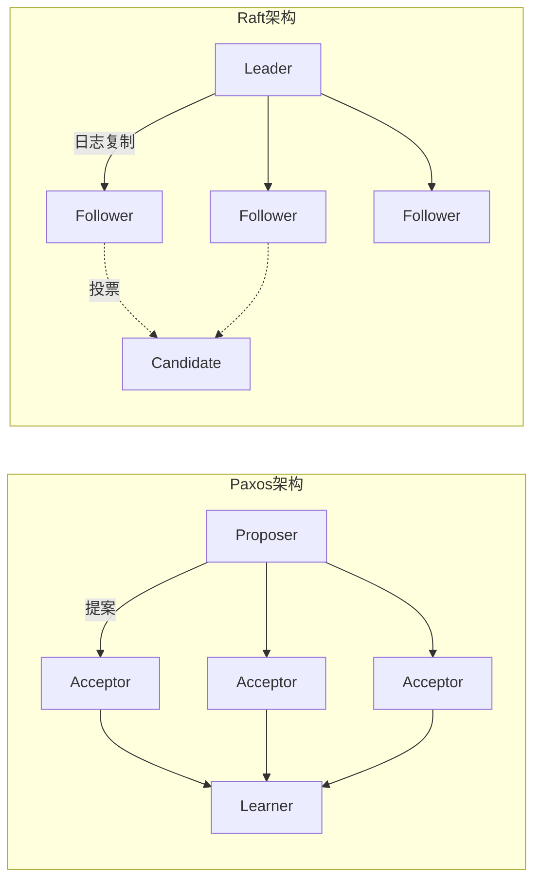
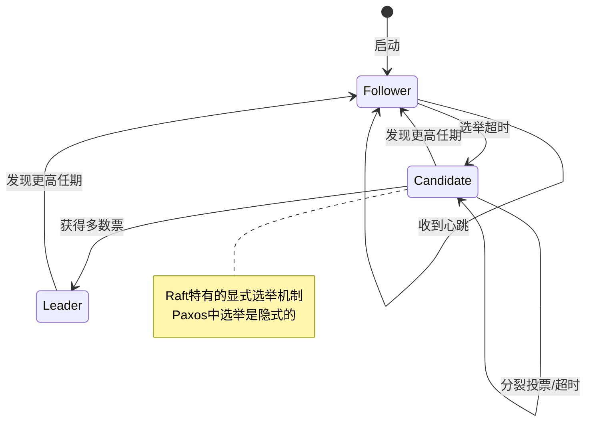
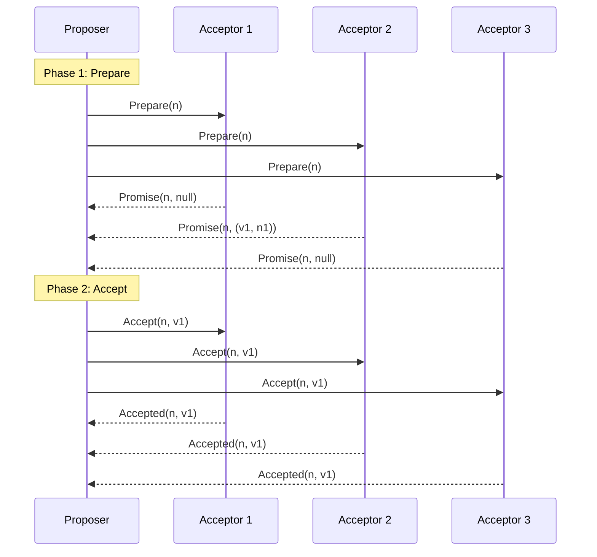
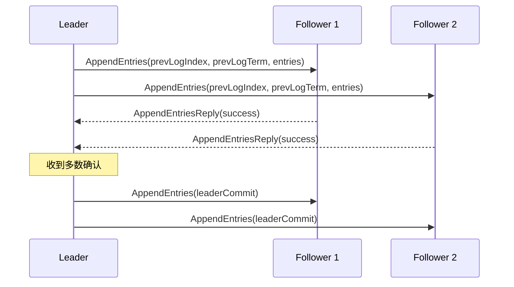
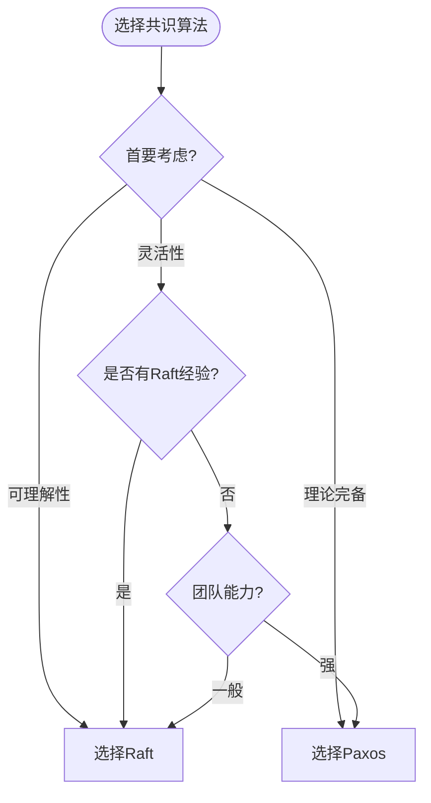

# Raft与Paxos对比 专题文档

**文档版本**：v1.0  
**创建时间**：2026年  
**最后更新**：2026年  
**状态**：✅ 已完成

---

## 📋 执行摘要

Raft和Paxos是分布式系统领域最著名的两个共识算法。Paxos由Leslie Lamport于1989年提出，是分布式共识的理论基石；Raft由Stanford大学于2013年提出，以易于理解和实现为设计目标。两者在功能上等价，都能保证分布式系统的一致性，但在设计理念、实现难度和应用场景上有显著差异。

---

## 一、核心对比概览

### 1.1 对比总览表

| 维度 | Paxos | Raft |
|------|-------|------|
| **提出时间** | 1989年 | 2013年 |
| **设计目标** | 理论完备 | 易于理解 |
| **可理解性** | 困难 | 简单 |
| **实现难度** | 高 | 中 |
| **消息复杂度** | O(n²) | O(n) |
| **Leader选举** | 隐式 | 显式 |
| **成员变更** | 复杂 | 相对简单 |
| **形式化证明** | 完整 | 完整 |

### 1.2 架构对比



---

## 二、算法机制对比

### 2.1 角色定义对比

| Paxos角色 | 对应Raft角色 | 职责对比 |
|-----------|-------------|---------|
| Proposer | Leader | Paxos允许多Proposer，Raft只有单Leader |
| Acceptor | Follower | 都参与投票，但Raft更被动 |
| Learner | （无直接对应） | Paxos有独立学习者角色 |
| （无） | Candidate | Raft特有的选举中间状态 |



### 2.2 消息流程对比

#### Paxos的两阶段提交



#### Raft的日志复制



### 2.3 代码复杂度对比

```go
// Paxos实现（简化）
type PaxosNode struct {
    minProposal    int
    acceptedProposal int
    acceptedValue  interface{}
    proposals      map[int]Proposal
}

func (n *PaxosNode) HandlePrepare(msg PrepareMsg) PromiseMsg {
    if msg.ProposalNumber > n.minProposal {
        n.minProposal = msg.ProposalNumber
        return PromiseMsg{
            ProposalNumber: msg.ProposalNumber,
            AcceptedValue: n.acceptedValue,
            AcceptedProposal: n.acceptedProposal,
        }
    }
    return PromiseMsg{Rejected: true}
}

func (n *PaxosNode) HandleAccept(msg AcceptMsg) AcceptedMsg {
    if msg.ProposalNumber >= n.minProposal {
        n.acceptedProposal = msg.ProposalNumber
        n.acceptedValue = msg.Value
        return AcceptedMsg{Accepted: true}
    }
    return AcceptedMsg{Accepted: false}
}
```

```go
// Raft实现（简化）
type RaftNode struct {
    currentTerm  int
    votedFor     string
    log          []LogEntry
    commitIndex  int
    lastApplied  int
    state        NodeState
    nextIndex    map[string]int
    matchIndex   map[string]int
}

func (n *RaftNode) AppendEntries(args AppendEntriesArgs, reply *AppendEntriesReply) {
    if args.Term < n.currentTerm {
        reply.Term = n.currentTerm
        reply.Success = false
        return
    }
    
    n.currentTerm = args.Term
    n.state = Follower
    n.resetElectionTimer()
    
    // 日志一致性检查
    if args.PrevLogIndex > len(n.log) ||
       n.log[args.PrevLogIndex].Term != args.PrevLogTerm {
        reply.Success = false
        return
    }
    
    // 追加新条目
    n.log = append(n.log[:args.PrevLogIndex+1], args.Entries...)
    
    // 更新commitIndex
    if args.LeaderCommit > n.commitIndex {
        n.commitIndex = min(args.LeaderCommit, len(n.log)-1)
    }
    
    reply.Success = true
}
```

---

## 三、特性详细对比

### 3.1 可理解性

| 方面 | Paxos | Raft |
|------|-------|------|
| **学习曲线** | 陡峭 | 平缓 |
| **概念数量** | 多（Proposer/Acceptor/Learner） | 少（Leader/Follower/Candidate） |
| **算法步骤** | 隐式，难以直观理解 | 显式状态机，易于跟踪 |
| **形式化描述** | 复杂 | 清晰 |

**Raft的可理解性优势**：
- 明确的领导者概念
- 清晰的状态转换
- 日志复制过程直观
- 论文包含用户研究验证

### 3.2 实现难度

```
Paxos实现挑战：
┌─────────────────────────────────────────────────────────┐
│ 1. 多Proposer竞争导致的活锁问题                          │
│ 2. 提案编号管理（全局唯一递增）                          │
│ 3. 隐式Leader选举的实现                                  │
│ 4. 复杂的成员变更协议（联合共识）                         │
│ 5. 边界情况处理（网络分区、消息延迟等）                    │
└─────────────────────────────────────────────────────────┘

Raft实现优势：
┌─────────────────────────────────────────────────────────┐
│ 1. 单Leader模型简化冲突处理                              │
│ 2. 显式任期管理                                          │
│ 3. 显式的Leader选举过程                                  │
│ 4. 相对简单的成员变更（一次一个）                         │
│ 5. 清晰的状态机便于测试和调试                            │
└─────────────────────────────────────────────────────────┘
```

### 3.3 性能对比

| 指标 | Paxos | Raft | 说明 |
|------|-------|------|------|
| **基础延迟** | 2 RTT | 1-2 RTT | 都可通过Leader优化 |
| **消息数量** | 2n-4n | n+1 | Multi-Paxos优化后类似 |
| **Leader切换** | 隐式，可能延迟 | 显式，100-500ms | Raft更快 |
| **日志复制** | O(n) | O(n) | 相同 |
| **读操作** | 可通过Learner | Follower可服务 | 都可优化 |

---

## 四、应用场景对比

### 4.1 适用场景矩阵

| 场景 | Paxos | Raft | 推荐 |
|------|-------|------|------|
| **教学/学习** | ⭐ | ⭐⭐⭐⭐⭐ | Raft |
| **工程实现** | ⭐⭐ | ⭐⭐⭐⭐⭐ | Raft |
| **理论研究** | ⭐⭐⭐⭐⭐ | ⭐⭐⭐ | Paxos |
| **生产系统** | ⭐⭐⭐ | ⭐⭐⭐⭐⭐ | Raft |
| **多数据中心** | ⭐⭐⭐⭐ | ⭐⭐⭐⭐ | 均可 |
| **强顺序保证** | ⭐⭐⭐ | ⭐⭐⭐⭐⭐ | Raft |

### 4.2 实际系统对比

| 系统 | 算法选择 | 原因 |
|------|---------|------|
| **Chubby** | Paxos | 早期实现，理论完备 |
| **Spanner** | Paxos | Google的Paxos实现经验 |
| **etcd** | Raft | 易于理解和维护 |
| **Consul** | Raft | HashiCorp的一致选择 |
| **TiKV** | Raft | PingCAP的Raft实现 |
| **Kafka KRaft** | Raft | 替换ZooKeeper |

---

## 五、优缺点总结

### 5.1 Paxos优缺点

**优点**：
- 理论完备，经过严格证明
- 灵活性高，可适应多种场景
- 故障模型假设弱
- 学术界认可度高

**缺点**：
- 难以理解和实现
- 活锁问题需要额外处理
- 缺乏优秀的开源实现
- 工程实践难度大

### 5.2 Raft优缺点

**优点**：
- 易于理解和学习
- 工程实现友好
- 大量生产验证
- 丰富的开源生态
- 清晰的成员变更

**缺点**：
- 单Leader可能成为瓶颈
- 写性能受限于Leader
- 网络分区时少数派不可用
- 相比Paxos灵活性稍低

---

## 六、选型建议

### 6.1 决策流程图



### 6.2 具体建议

**选择Raft当**：
- 团队首次实现分布式共识
- 需要快速上线和维护
- 需要丰富的工具和生态支持
- 单Leader模型满足需求
- 运维团队需要理解系统

**选择Paxos当**：
- 需要极高的灵活性
- 团队有深厚理论基础
- 特定场景Raft无法满足
- 学术研究目的
- 已有成熟的Paxos基础设施

---

## 七、与其他主题的关联

### 7.1 相关文档

- [Paxos算法详解](./classic/Paxos算法详解.md)
- [Raft算法详解](./classic/Raft算法详解.md)
- [共识算法选型指南](./共识算法选型指南.md)

### 7.2 延伸阅读

| 资源 | 说明 |
|------|------|
| Paxos Made Simple | Lamport的简化版Paxos论文 |
| Raft Dissertation | Diego Ongaro的博士论文 |
| Raft可视化 | https://raft.github.io |

---

## 八、参考资源

### 8.1 学术论文

1. [Paxos Made Simple](https://lamport.azurewebsites.net/pubs/paxos-simple.pdf) - Leslie Lamport, 2001
2. [In Search of an Understandable Consensus Algorithm](https://raft.github.io/raft.pdf) - Ongaro & Ousterhout, 2014
3. [Paxos Made Live](https://research.google/pubs/paxos-made-live-an-engineering-perspective/) - Chandra et al., 2007

### 8.2 开源实现

1. [etcd/raft](https://github.com/etcd-io/etcd/tree/main/raft) - 最广泛使用的Raft实现
2. [hashicorp/raft](https://github.com/hashicorp/raft) - HashiCorp的Raft库
3. [phxpaxos](https://github.com/Tencent/phxpaxos) - 腾讯的Paxos实现

---

**维护者**：项目团队  
**最后更新**：2026年
