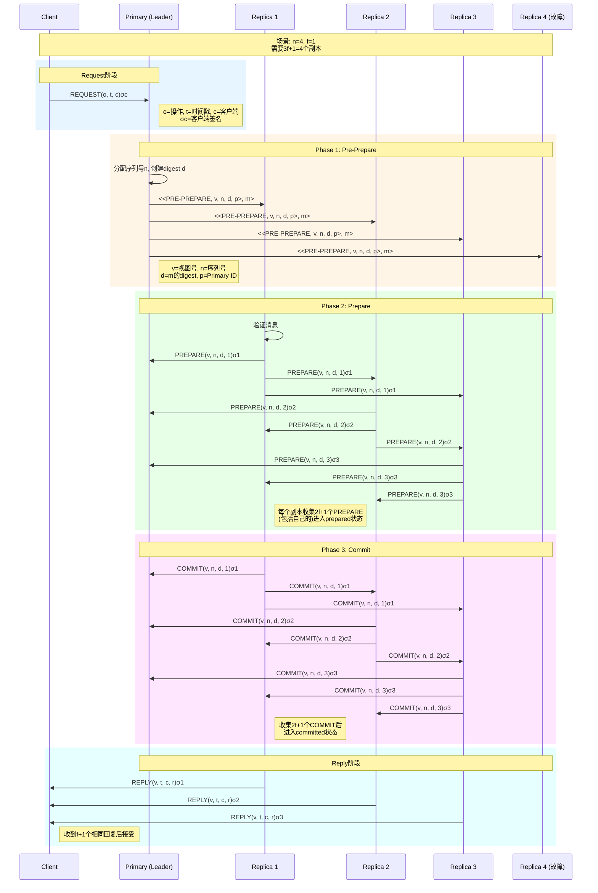
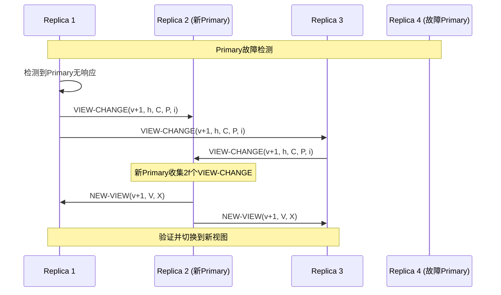
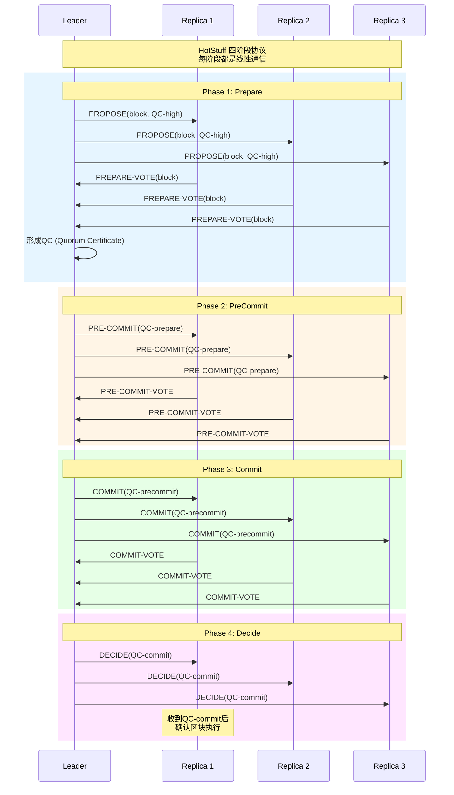

# BFT状态机复制

> Stanford CS244B: Distributed Systems 课程对齐

## 1. BFT状态机复制概述

### 1.1 从共识到状态机复制

状态机复制（State Machine Replication, SMR）是构建容错分布式系统的核心技术。BFT-SMR将复制状态机的概念扩展到**拜占庭故障场景**。

```
┌─────────────────────────────────────────────────────────────────┐
│                   BFT-SMR架构                                    │
├─────────────────────────────────────────────────────────────────┤
│                                                                  │
│  ┌──────────┐                                                    │
│  │  Client  │──┐                                                 │
│  └──────────┘  │                                                 │
│                ▼                                                 │
│  ┌──────────────────────────────────────────────┐               │
│  │              复制状态机集群                    │               │
│  │  ┌────────┐  ┌────────┐  ┌────────┐  ┌────┐  │               │
│  │  │Replica0│  │Replica1│  │Replica2│  │ R3 │  │  n=3f+1      │
│  │  │(可能故障)│  │(可能故障)│  │(可能故障)│  │(故障)│  │  f≤(n-1)/3   │
│  │  └────┬───┘  └────┬───┘  └────┬───┘  └────┘  │               │
│  │       └───────────┴───────────┘              │               │
│  │              共识协议 (PBFT/HotStuff)         │               │
│  └──────────────────────────────────────────────┘               │
│                           │                                      │
│                           ▼                                      │
│  ┌──────────────────────────────────────────────┐               │
│  │           相同状态/相同输出                   │               │
│  │  State0 == State1 == State2 == State3       │               │
│  └──────────────────────────────────────────────┘               │
│                                                                  │
└─────────────────────────────────────────────────────────────────┘
```

### 1.2 安全性和活性要求

- **安全性（Safety）**：所有正确副本以相同顺序执行相同命令
- **活性（Liveness）**：客户端请求最终会被执行

## 2. PBFT：实用拜占庭容错

### 2.1 PBFT三阶段协议



### 2.2 PBFT核心数据结构

```go
// PBFT Replica实现
type PBFT struct {
    id       int
    n        int  // 总副本数
    f        int  // 最大故障数

    // 视图管理
    view     int
    isPrimary bool

    // 日志
    log      map[int]*LogEntry  // 序列号 -> 条目

    // 状态
    prepared  map[int]bool
    committed map[int]bool

    // 消息收集
    prePrepareMsgs map[string][]*PrePrepareMsg
    prepareMsgs    map[string][]*PrepareMsg
    commitMsgs     map[string][]*CommitMsg
}

type LogEntry struct {
    SequenceNum int
    Digest      string
    Request     *Request
    State       EntryState
}

type EntryState int
const (
    PrePrepared EntryState = iota
    Prepared
    Committed
    Executed
)

// PrePrepareMsg Pre-Prepare消息
type PrePrepareMsg struct {
    View        int
    SequenceNum int
    Digest      string
    Request     *Request
    Signature   []byte
}

// PrepareMsg Prepare消息
type PrepareMsg struct {
    View        int
    SequenceNum int
    Digest      string
    ReplicaID   int
    Signature   []byte
}

// CommitMsg Commit消息
type CommitMsg struct {
    View        int
    SequenceNum int
    Digest      string
    ReplicaID   int
    Signature   []byte
}
```

### 2.3 PBFT算法实现

```go
// HandleRequest 处理客户端请求
func (pbft *PBFT) HandleRequest(req *Request) {
    if !pbft.isPrimary {
        // 转发给Primary
        pbft.forwardToPrimary(req)
        return
    }

    // Primary分配序列号
    seqNum := pbft.nextSequenceNum()
    digest := hash(req)

    // 创建Pre-Prepare消息
    prePrep := &PrePrepareMsg{
        View:        pbft.view,
        SequenceNum: seqNum,
        Digest:      digest,
        Request:     req,
        Signature:   pbft.sign(prePrep),
    }

    // 广播Pre-Prepare
    pbft.broadcastPrePrepare(prePrep)
}

// HandlePrePrepare 处理Pre-Prepare消息
func (pbft *PBFT) HandlePrePrepare(msg *PrePrepareMsg) {
    // 验证
    if !pbft.verifyPrePrepare(msg) {
        return
    }

    // 创建Prepare消息
    prepare := &PrepareMsg{
        View:        msg.View,
        SequenceNum: msg.SequenceNum,
        Digest:      msg.Digest,
        ReplicaID:   pbft.id,
        Signature:   pbft.sign(prepare),
    }

    // 广播Prepare
    pbft.broadcastPrepare(prepare)
}

// HandlePrepare 处理Prepare消息
func (pbft *PBFT) HandlePrepare(msg *PrepareMsg) {
    pbft.prepareMsgs[msg.Digest] = append(
        pbft.prepareMsgs[msg.Digest],
        msg,
    )

    // 检查是否达成Prepared
    if len(pbft.prepareMsgs[msg.Digest]) >= 2*pbft.f+1 {
        pbft.prepared[msg.SequenceNum] = true

        // 创建Commit消息
        commit := &CommitMsg{
            View:        msg.View,
            SequenceNum: msg.SequenceNum,
            Digest:      msg.Digest,
            ReplicaID:   pbft.id,
            Signature:   pbft.sign(commit),
        }

        pbft.broadcastCommit(commit)
    }
}

// HandleCommit 处理Commit消息
func (pbft *PBFT) HandleCommit(msg *CommitMsg) {
    pbft.commitMsgs[msg.Digest] = append(
        pbft.commitMsgs[msg.Digest],
        msg,
    )

    // 检查是否达成Committed
    if len(pbft.commitMsgs[msg.Digest]) >= 2*pbft.f+1 {
        pbft.committed[msg.SequenceNum] = true

        // 执行请求
        pbft.execute(msg.SequenceNum)
    }
}

// execute 执行已提交的请求
func (pbft *PBFT) execute(seqNum int) {
    entry := pbft.log[seqNum]

    // 按序列号顺序执行
    for pbft.nextExecSeqNum <= seqNum {
        e := pbft.log[pbft.nextExecSeqNum]
        if e.State != Committed {
            break
        }

        // 执行状态机转换
        result := pbft.stateMachine.Apply(e.Request.Operation)
        e.State = Executed

        // 发送回复给客户端
        pbft.replyToClient(e.Request, result)

        pbft.nextExecSeqNum++
    }
}
```

## 3. View Change机制

### 3.1 视图变更流程



### 3.2 视图变更实现

```go
// ViewChange 处理视图变更
func (pbft *PBFT) ViewChange(newView int) {
    // 停止接收当前视图的消息
    pbft.stopViewTimer()

    // 收集已执行和已Prepared但未执行的消息
    checkpoint := pbft.getLastCheckpoint()
    preparedMsgs := pbft.getPreparedMsgs()

    vcMsg := &ViewChangeMsg{
        NewView:    newView,
        LastStable: checkpoint,
        Prepared:   preparedMsgs,
        ReplicaID:  pbft.id,
    }

    // 发送给新Primary
    newPrimary := newView % pbft.n
    pbft.sendTo(newPrimary, vcMsg)
}

// HandleViewChange 新Primary处理视图变更
func (pbft *PBFT) HandleViewChange(msg *ViewChangeMsg) {
    if !pbft.isPrimaryFor(msg.NewView) {
        return
    }

    // 收集2f+1个VIEW-CHANGE
    pbft.viewChangeMsgs = append(pbft.viewChangeMsgs, msg)

    if len(pbft.viewChangeMsgs) >= 2*pbft.f+1 {
        // 选择最高检查点
        minS := pbft.selectMinSequence(pbft.viewChangeMsgs)

        // 创建NEW-VIEW消息
        nvMsg := &NewViewMsg{
            View:       msg.NewView,
            ViewChanges: pbft.viewChangeMsgs,
            PrePrepares: pbft.selectPrePrepares(minS),
        }

        pbft.broadcastNewView(nvMsg)
    }
}
```

## 4. HotStuff：现代BFT共识

### 4.1 HotStuff核心创新

```
┌─────────────────────────────────────────────────────────────────┐
│                   HotStuff vs PBFT                               │
├─────────────────────────────────────────────────────────────────┤
│                                                                  │
│  PBFT:                          HotStuff:                        │
│  ┌────────┐                     ┌────────┐                      │
│  │Prepare │                     │Prepare │                      │
│  ├────────┤                     ├────────┤                      │
│  │Prepare │                     │PreCommit│                     │
│  ├────────┤                     ├────────┤                      │
│  │Commit  │                     │Commit  │                      │
│  ├────────┤                     ├────────┤                      │
│  │Reply   │                     │Decide  │                      │
│  └────────┘                     └────────┘                      │
│                                                                  │
│  特点:                           特点:                           │
│  - 每视图多命令                  - 链式结构                      │
│  - 复杂的View Change             - 简洁的View Change             │
│  - 线性通信复杂度                - 线性通信复杂度                │
│  - 需要gc                        - 自动gc (chaining)             │
│                                                                  │
└─────────────────────────────────────────────────────────────────┘
```

### 4.2 HotStuff四阶段协议



### 4.3 HotStuff实现

```go
// HotStuff 实现
type HotStuff struct {
    id       int
    n        int
    f        int

    // 区块链
    blocks   map[Hash]*Block
    height   int

    // 当前视图
    view     int
    leader   int

    // 投票状态
    votes    map[string][]*Vote  // phase -> votes

    // QC缓存
    qcs      map[int]*QuorumCert // height -> QC
}

type Block struct {
    Height    int
    Parent    Hash
    Payload   []Transaction
    QC        *QuorumCert  // 父区块的QC
}

type QuorumCert struct {
    Phase    Phase
    Height   int
    BlockHash Hash
    Signatures map[int][]byte
}

type Phase int
const (
    PREPARE Phase = iota
    PRECOMMIT
    COMMIT
    DECIDE
)

// OnPropose 生成新提案
func (hs *HotStuff) OnPropose(parent *Block) *Block {
    newBlock := &Block{
        Height:  parent.Height + 1,
        Parent:  Hash(parent),
        Payload: hs.getPendingTxs(),
        QC:      hs.qcs[parent.Height],
    }

    // 广播提案
    hs.broadcast(newBlock)
    return newBlock
}

// OnReceiveProposal 处理提案
func (hs *HotStuff) OnReceiveProposal(block *Block) {
    // 验证区块
    if !hs.verifyBlock(block) {
        return
    }

    // 投票
    vote := &Vote{
        Phase:     PREPARE,
        Height:    block.Height,
        BlockHash: Hash(block),
        ReplicaID: hs.id,
        Signature: hs.sign(vote),
    }

    hs.sendTo(hs.leader, vote)
}

// OnReceiveVote Leader处理投票
func (hs *HotStuff) OnReceiveVote(vote *Vote) {
    key := fmt.Sprintf("%d-%d", vote.Phase, vote.Height)
    hs.votes[key] = append(hs.votes[key], vote)

    // 检查是否形成QC
    if len(hs.votes[key]) >= 2*hs.f+1 {
        qc := &QuorumCert{
            Phase:      vote.Phase,
            Height:     vote.Height,
            BlockHash:  vote.BlockHash,
            Signatures: make(map[int][]byte),
        }

        for _, v := range hs.votes[key] {
            qc.Signatures[v.ReplicaID] = v.Signature
        }

        // 进入下一阶段
        hs.advancePhase(qc)
    }
}

// advancePhase 推进到下一阶段
func (hs *HotStuff) advancePhase(qc *QuorumCert) {
    switch qc.Phase {
    case PREPARE:
        hs.qcs[qc.Height] = qc
        hs.broadcastPreCommit(qc)
    case PRECOMMIT:
        hs.broadcastCommit(qc)
    case COMMIT:
        hs.broadcastDecide(qc)
    case DECIDE:
        hs.execute(qc.Height)
    }
}
```

## 5. 性能对比

| 特性 | PBFT | HotStuff | Tendermint |
|------|------|----------|------------|
| 延迟 | 3 RTT | 7 RTT (乐观) | 3 RTT |
| 吞吐量 | ~10K tx/s | ~100K tx/s | ~1K tx/s |
| 视图变更 | O(n³) | O(n) | O(n) |
| 链式结构 | 否 | 是 | 是 |
| 响应性 | 同步 | 部分同步 | 同步 |

## 6. 安全性证明

### 6.1 PBFT安全性

**定理**：PBFT保证安全性和活性。

**安全性证明要点**：

1. **唯一性**：通过视图号和序列号的组合唯一标识每个请求
2. **排序**：三阶段协议确保所有正确副本以相同顺序执行
3. **防篡改**：数字签名防止消息伪造

**关键引理**：

- 如果正确副本 $r$ 达成prepared状态，则不存在正确副本达成prepared状态但digest不同
- 证明依赖于Quorum交集：两个大小为 $2f+1$ 的集合必有一个正确副本交集

## 7. 实际应用

- **Hyperledger Fabric**: 使用PBFT变体
- **Diem (Libra)**: 使用HotStuff
- **Tendermint**: 区块链BFT共识
- **Casper FFG**: Ethereum的PoS+BFT

## 8. 总结

BFT-SMR是构建高可靠分布式系统的核心技术。从PBFT到HotStuff，BFT共识协议在性能和可理解性上不断演进。理解这些算法对于设计区块链和关键任务系统至关重要。

---

**参考**：

- Castro, Liskov, "Practical Byzantine Fault Tolerance" (OSDI 1999)
- Yin et al., "HotStuff: BFT Consensus in the Lens of Blockchain" (2019)
- Buchman et al., "Tendermint: Byzantine Fault Tolerance in the Age of Blockchains" (2016)
- Stanford CS244B Lecture Notes
