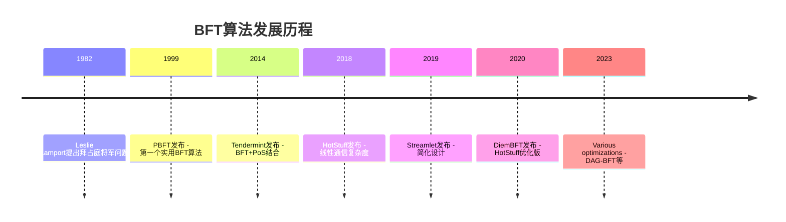
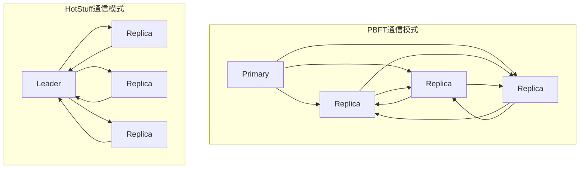
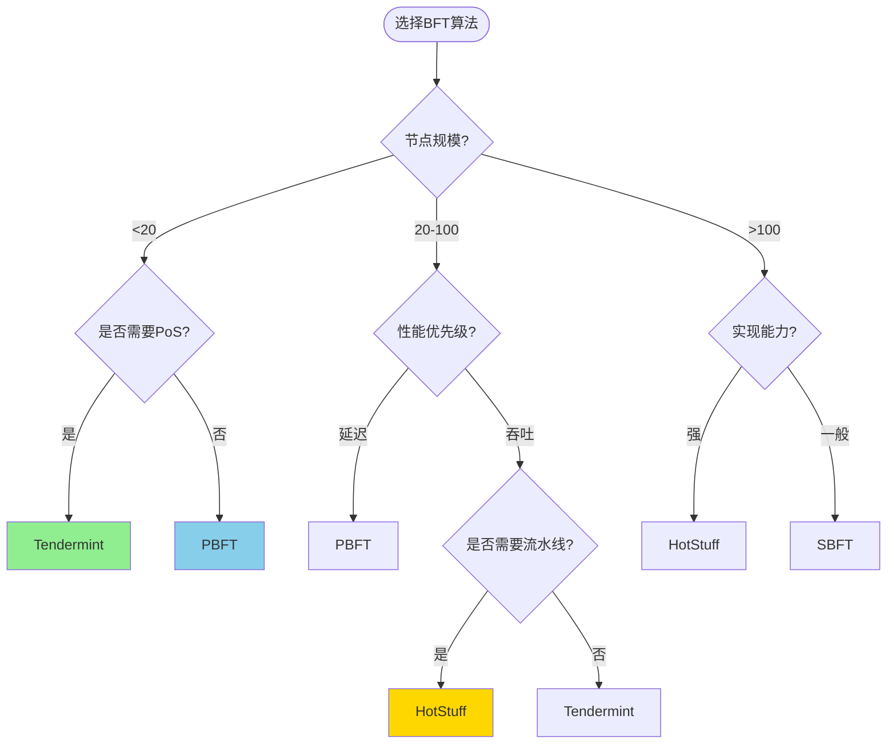

# BFT算法对比 专题文档

**文档版本**：v1.0  
**创建时间**：2026年  
**最后更新**：2026年  
**状态**：✅ 已完成

---

## 📋 执行摘要

拜占庭容错（Byzantine Fault Tolerance, BFT）算法是分布式系统安全领域的重要研究方向，能够在节点可能出现任意故障（包括恶意行为）的情况下保证系统一致性。本文对比分析主流BFT算法：PBFT、HotStuff、Tendermint、Streamlet等，从通信复杂度、节点规模、视图变更效率、实现难度等维度进行系统性比较，为架构师提供选型参考。

---

## 一、BFT算法概览

### 1.1 算法发展时间线



### 1.2 算法对比总览

| 算法 | 年份 | 通信复杂度 | 最大节点数 | 延迟 | 特点 |
|------|------|-----------|-----------|------|------|
| **PBFT** | 1999 | O(n²) | ~20 | 3-5 RTT | 经典实用BFT |
| **Tendermint** | 2014 | O(n²) | ~100 | 4-6 RTT | BFT+PoS结合 |
| **HotStuff** | 2018 | O(n) | ~150 | 3-4 RTT | 线性复杂度 |
| **Streamlet** | 2019 | O(n²) | ~50 | 3 RTT | 极简设计 |
| **SBFT** | 2019 | O(n) | ~100 | 2-3 RTT | 可扩展BFT |
| **Narwhal/Tusk** | 2021 | O(n) | ~1000 | <3s | DAG-based |

---

## 二、核心机制对比

### 2.1 通信模式对比



| 算法 | 正常流程消息数 | 视图变更消息数 | 总复杂度 |
|------|--------------|--------------|---------|
| PBFT | 2n² | O(n³) | O(n³) |
| Tendermint | n²+2n | O(n²) | O(n²) |
| HotStuff | 4n | O(n) | O(n) |
| Streamlet | 2n | O(n) | O(n²) |
| SBFT | 3n | O(n) | O(n) |

### 2.2 共识流程对比

#### PBFT三阶段流程

```mermaid
sequenceDiagram
    participant C as Client
    participant P as Primary
    participant R1 as Replica 1
    participant R2 as Replica 2
    participant R3 as Replica 3

    C->>P: Request
    
    Note over P: Pre-prepare
    P->>R1: Pre-prepare
    P->>R2: Pre-prepare
    P->>R3: Pre-prepare
    
    Note over R1,R2,R3: Prepare阶段<br/>全网广播
    R1->>R1: Prepare
    R1->>R2: Prepare
    R1->>R3: Prepare
    R2->>R1: Prepare
    R2->>R2: Prepare
    R2->>R3: Prepare
    R3->>R1: Prepare
    R3->>R2: Prepare
    R3->>R3: Prepare
    
    Note over R1,R2,R3: Commit阶段<br/>全网广播
    R1->>R1: Commit
    R1->>R2: Commit
    R1->>R3: Commit
    R2->>R1: Commit
    R2->>R2: Commit
    R2->>R3: Commit
    R3->>R1: Commit
    R3->>R2: Commit
    R3->>R3: Commit
    
    Note over P,R1,R2,R3: 2f+1 Commit后执行
```

#### HotStuff线性流程

```mermaid
sequenceDiagram
    participant L as Leader
    participant R1 as Replica 1
    participant R2 as Replica 2
    participant R3 as Replica 3

    Note over L: 收集NewView消息
    R1->>L: NewView + highQC
    R2->>L: NewView + highQC
    R3->>L: NewView + highQC
    
    Note over L: Prepare阶段
    L->>R1: Proposal + QC
    L->>R2: Proposal + QC
    L->>R3: Proposal + QC
    
    Note over R1,R2,R3: Pre-commit投票<br/>发送给Leader
    R1->>L: PrepareVote
    R2->>L: PrepareVote
    R3->>L: PrepareVote
    
    Note over L: 聚合为QC1
    
    Note over L: Pre-commit阶段
    L->>R1: QC1
    L->>R2: QC1
    L->>R3: QC1
    
    Note over R1,R2,R3: Commit投票
    R1->>L: PrecommitVote
    R2->>L: PrecommitVote
    R3->>L: PrecommitVote
    
    Note over L: 聚合为QC2
    
    Note over L: Commit阶段
    L->>R1: QC2
    L->>R2: QC2
    L->>R3: QC2
    
    Note over R1,R2,R3: Decide投票<br/>三链提交后执行
```

### 2.3 视图变更对比

```go
// PBFT视图变更 - 复杂的三阶段
func PBFT_ViewChange(newView uint64) {
    // Phase 1: 发送View-Change
    for _, replica := range replicas {
        replica.Send(ViewChangeMsg{
            View: newView,
            PSet: preparedProofs,
            QSet: prePreparedProofs,
        })
    }
    
    // Phase 2: 新Primary收集并发送New-View
    if amNewPrimary {
        // 需要收集2f+1个View-Change
        viewChanges := collectViewChanges(2*f + 1)
        
        // 构造O集合（待执行消息）
        O := constructOSet(viewChanges)
        
        broadcast(NewViewMsg{
            View: newView,
            VSet: viewChanges,
            O:    O,
        })
    }
    
    // Phase 3: 验证New-View并进入新视图
    verifyNewView(newViewMsg)
    executeOSet(O)
}

// HotStuff视图变更 - 简单的线性流程
func HotStuff_ViewChange(newView uint64) {
    // 只需发送highQC给新Leader
    SendToNewLeader(NewViewMsg{
        View:   newView,
        HighQC: localHighQC,
    })
    
    // 新Leader收集后直接开始提案
    if amNewLeader {
        highQCs := collectNewViews(2*f + 1)
        highQC := selectHighestQC(highQCs)
        proposeNewBlock(highQC)
    }
}
```

---

## 三、详细对比矩阵

### 3.1 性能对比

| 指标 | PBFT | Tendermint | HotStuff | Streamlet |
|------|------|------------|----------|-----------|
| **正常流程延迟** | 3 RTT | 4 RTT | 4 RTT | 3 RTT |
| **视图变更延迟** | 3-5 RTT | 4-6 RTT | 1 RTT | 1 RTT |
| **消息复杂度** | O(n²) | O(n²) | O(n) | O(n²) |
| **通信轮次** | 3 | 4 | 4 | 3 |
| **最大吞吐量** | 中 | 中 | 高 | 中 |
| **节点扩展性** | 差 | 中 | 好 | 中 |

### 3.2 特性对比

| 特性 | PBFT | Tendermint | HotStuff | Streamlet |
|------|------|------------|----------|-----------|
| **阈值签名** | 可选 | 可选 | 必须 | 可选 |
| **链式结构** | 否 | 是 | 是 | 是 |
| **PoS集成** | 否 | 是 | 可选 | 否 |
| **即时最终性** | 是 | 是 | 是 | 是 |
| **流水线支持** | 否 | 否 | 是 | 否 |
| **实现复杂度** | 高 | 中 | 高 | 低 |

### 3.3 容错能力

| 算法 | 最大容错 | 容错类型 | 网络假设 |
|------|---------|---------|---------|
| PBFT | (n-1)/3 | 拜占庭 | 部分同步 |
| Tendermint | (n-1)/3 | 拜占庭 | 部分同步 |
| HotStuff | (n-1)/3 | 拜占庭 | 部分同步 |
| Streamlet | (n-1)/3 | 拜占庭 | 同步 |
| SBFT | (n-1)/3 | 拜占庭 | 部分同步 |

---

## 四、实际应用对比

### 4.1 应用系统对比

| 系统/项目 | 算法 | 节点规模 | 应用场景 |
|----------|------|---------|---------|
| **Hyperledger Fabric** | PBFT/Raft | 5-20 | 企业联盟链 |
| **Cosmos** | Tendermint | 100-150 | 应用链生态 |
| **Diem (Libra)** | HotStuff | 100+ | 全球支付 |
| **Celo** | HotStuff变体 | 100 | 移动优先链 |
| **Flow** | HotStuff | 100+ | NFT/游戏 |

### 4.2 适用场景推荐

```
场景1: 小规模联盟链（<20节点）
推荐: PBFT 或 Raft
理由: 成熟稳定，无需复杂优化

场景2: 中等规模许可链（20-100节点）
推荐: Tendermint 或 PBFT优化版
理由: BFT+PoS结合，适合区块链场景

场景3: 大规模高吞吐链（>100节点）
推荐: HotStuff 或 SBFT
理由: 线性通信复杂度，支持大规模节点

场景4: 极简实现需求
推荐: Streamlet
理由: 代码量少，易于理解和验证

场景5: 超高吞吐场景
推荐: Narwhal/Tusk (DAG-BFT)
理由: 解耦数据传播与共识，支持1000+节点
```

---

## 五、优缺点分析

### 5.1 PBFT

**优点**：
- 经过充分验证的经典算法
- 确定性强，无概率性
- 成熟的企业级实现

**缺点**：
- 通信复杂度高 O(n²)
- 视图变更复杂 O(n³)
- 节点规模受限（<20）

### 5.2 Tendermint

**优点**：
- BFT与PoS良好结合
- 活跃的生态系统（Cosmos）
- ABCI接口解耦应用层

**缺点**：
- 通信复杂度 O(n²)
- 节点数受限
- 对网络质量敏感

### 5.3 HotStuff

**优点**：
- 线性通信复杂度 O(n)
- 高效的视图变更
- 支持流水线处理
- 可扩展至150+节点

**缺点**：
- 依赖阈值签名（计算开销）
- 实现复杂度高
- 相对较新，生产验证较少

### 5.4 Streamlet

**优点**：
- 极简设计（几百行代码）
- 易于形式化验证
- 清晰的正确性证明

**缺点**：
- 通信复杂度 O(n²)
- 需要同步网络假设
- 性能优化空间有限

---

## 六、选型决策树



---

## 七、未来发展趋势

### 7.1 研究方向

1. **DAG-BFT**：将DAG结构与BFT结合，进一步提升吞吐量
2. **异步BFT**：完全异步网络假设下的BFT算法
3. **自适应BFT**：根据网络条件动态调整参数
4. **跨链BFT**：支持跨链场景的共识协议

### 7.2 新兴算法

| 算法 | 特点 | 状态 |
|------|------|------|
| **Narwhal/Tusk** | DAG-based，高吞吐 | 生产中 |
| **BullShark** | DAG-BFT优化版 | 研究中 |
| **Ditto** | 异步BFT | 研究中 |
| **Bolt** | 低延迟BFT | 研究中 |

---

## 八、与其他主题的关联

### 8.1 相关文档

- [PBFT实用拜占庭容错](./PBFT实用拜占庭容错.md)
- [HotStuff算法](./HotStuff算法.md)
- [Tendermint共识](./Tendermint共识.md)

### 8.2 延伸阅读

- [Consensus in the Age of Blockchains](https://arxiv.org/abs/1711.03936)
- [The latest gossip on BFT consensus](https://arxiv.org/abs/1807.04938)

---

## 九、参考资源

### 9.1 学术论文

1. [Practical Byzantine Fault Tolerance](http://pmg.csail.mit.edu/papers/osdi99.pdf) - Castro & Liskov, 1999
2. [HotStuff: BFT Consensus in the Lens of Blockchain](https://arxiv.org/abs/1803.05069) - Yin et al., 2018
3. [Streamlet: Textbook Streamlined Blockchains](https://eprint.iacr.org/2020/088.pdf) - Chan & Shi, 2020
4. [The latest gossip on BFT consensus](https://arxiv.org/abs/1807.04938) - Buchman et al., 2018

### 9.2 开源实现

1. [Tendermint Core](https://github.com/tendermint/tendermint)
2. [HotStuff参考实现](https://github.com/hot-stuff/libhotstuff)
3. [BFT-SMaRt](https://github.com/bft-smart/library)

---

**维护者**：项目团队  
**最后更新**：2026年
