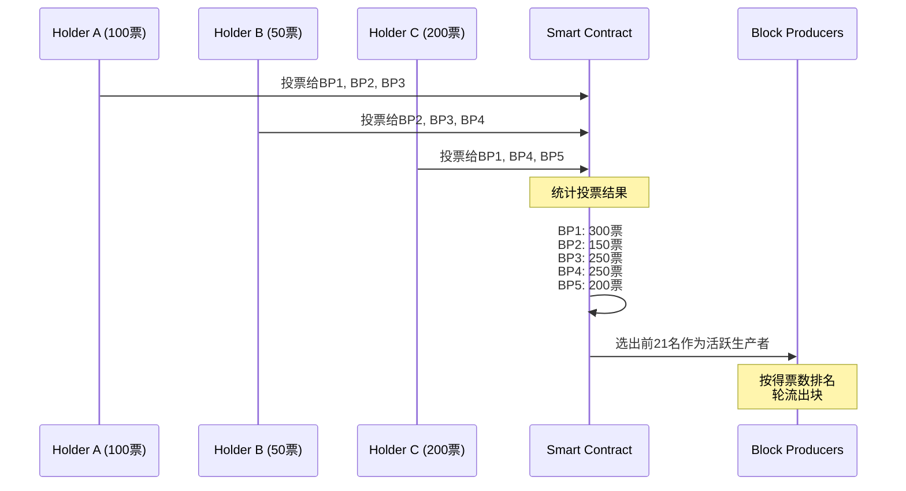
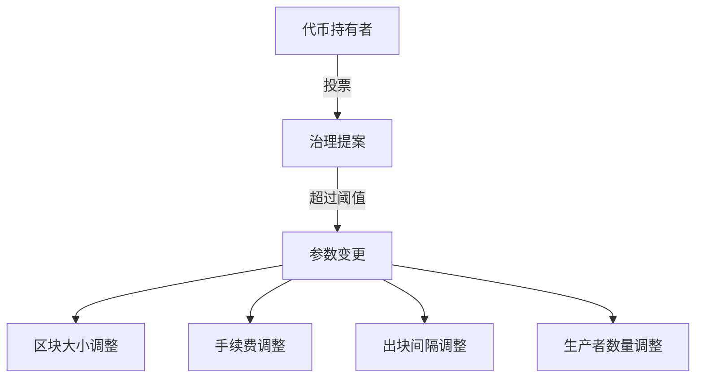

# DPoS委托权益证明 专题文档

**文档版本**：v1.0
**创建时间**：2026年
**最后更新**：2026年
**最后更新**：2026年
**状态**：✅ 已完成

---

## 📋 执行摘要

委托权益证明（Delegated Proof of Stake, DPoS）是由Daniel Larimer（BM）于2014年提出的共识机制，首次应用于BitShares，后在EOS、Steem、TRON等项目中得到广泛应用。DPoS通过代币持有者投票选举出有限数量的代表（见证人/区块生产者）来生产区块，在保持去中心化的同时实现了高吞吐量和低延迟，是公链性能优化的一种重要方案。

---

## 一、核心概念

### 1.1 定义与原理

**委托权益证明**是一种民主化的权益证明机制，代币持有者通过投票委托选举出有限数量的节点来负责区块生产和网络治理。

#### 核心机制

```
DPoS基本原理：
┌─────────────────────────────────────────────────────────┐
│ 1. 代币持有者根据持币数量获得投票权                        │
│ 2. 持有者投票选举区块生产者（Witness/BP）                  │
│ 3. 得票最高的N个节点成为活跃生产者                         │
│ 4. 生产者按轮次顺序生产区块                               │
│ 5. 生产者轮流出块，错过出块会被替换                       │
│ 6. 持有者可以随时更改投票                                 │
└─────────────────────────────────────────────────────────┘
```

#### 角色定义

| 角色 | 职责 | 特点 |
|------|------|------|
| **代币持有者** | 投票选举生产者 | 1币1票，可委托投票 |
| **区块生产者** | 生产区块、验证交易 | 数量有限，竞争激烈 |
| **候补生产者** | 待命状态，随时准备替换 | 按票数排名替补 |
| **治理节点** | 参与协议参数调整 | 部分DPoS支持 |

### 1.2 关键特性

- **高性能**：有限生产者，快速轮询出块
- **民主治理**：持币者投票决定网络发展方向
- **低能耗**：无需大量计算资源
- **灵活参数**：可通过投票调整系统参数

### 1.3 适用场景

| 场景 | 适用性 | 说明 |
|------|--------|------|
| 高性能公链 | ⭐⭐⭐⭐⭐ | EOS、TRON等 |
| 社交/内容平台 | ⭐⭐⭐⭐⭐ | Steem、Hive |
| 去中心化交易所 | ⭐⭐⭐⭐ | BitShares |
| 游戏链 | ⭐⭐⭐⭐ | 高TPS需求 |
| 高度去中心化场景 | ⭐⭐ | 存在中心化风险 |

---

## 二、算法流程

### 2.1 投票与选举



### 2.2 出块轮询机制

```go
// DPoS出块配置
const (
    NumProducers     = 21    // 活跃生产者数量
    BlockInterval    = 3 * time.Second  // 出块间隔
    RoundDuration    = BlockInterval * NumProducers  // 一轮时长
)

// 区块生产者
type BlockProducer struct {
    Account     string
    PubKey      []byte
    Votes       uint64    // 得票数
    Produced    uint64    // 已生产区块数
    Missed      uint64    // 错过出块数
    LastBlockTime int64
}

// 出块调度器
type Scheduler struct {
    Producers     []BlockProducer
    CurrentRound  uint64
    CurrentIndex  int
    LastBlockTime int64
}

// 获取当前出块者
func (s *Scheduler) GetCurrentProducer(now int64) *BlockProducer {
    // 计算当前位置
    elapsed := now - s.LastBlockTime
    slots := elapsed / int64(BlockInterval.Seconds())
    index := (s.CurrentIndex + int(slots)) % NumProducers

    return &s.Producers[index]
}

// 出块
func (bp *BlockProducer) ProduceBlock(prevBlock *Block, txs []Transaction) *Block {
    block := &Block{
        Header: BlockHeader{
            Timestamp:     time.Now().Unix(),
            Producer:      bp.Account,
            PrevBlockHash: prevBlock.Hash(),
            ProducerSig:   bp.sign(prevBlock.Hash()),
        },
        Transactions: txs,
    }

    // 计算Merkle根等
    block.Header.MerkleRoot = calculateMerkleRoot(txs)
    block.Header.Hash = block.Header.calculateHash()

    return block
}
```

### 2.3 投票机制

```go
// 投票信息
type Vote struct {
    Voter     string    // 投票者账户
    ProxiedTo string    // 代理给谁（可选）
    Producers []string  // 支持的候选人列表
    Stake     uint64    // 投票权重
}

// 投票合约
type VotingContract struct {
    Votes          map[string]*Vote       // 投票记录
    ProducerVotes  map[string]uint64      // 候选人得票数
    TopProducers   []string               // 当前前N名
}

// 投票
func (vc *VotingContract) Vote(voter string, producers []string) error {
    // 检查投票数量限制
    if len(producers) > MaxVotesPerAccount {
        return errors.New("too many producers voted")
    }

    // 获取投票者质押金额
    stake := vc.getStake(voter)

    // 取消旧投票
    if oldVote, exists := vc.Votes[voter]; exists {
        for _, p := range oldVote.Producers {
            vc.ProducerVotes[p] -= oldVote.Stake / uint64(len(oldVote.Producers))
        }
    }

    // 记录新投票
    vc.Votes[voter] = &Vote{
        Voter:     voter,
        Producers: producers,
        Stake:     stake,
    }

    // 更新候选人得票
    voteWeight := stake / uint64(len(producers))
    for _, p := range producers {
        vc.ProducerVotes[p] += voteWeight
    }

    // 更新前N名生产者
    vc.updateTopProducers()

    return nil
}

// 更新排名
func (vc *VotingContract) updateTopProducers() {
    // 排序所有候选人
    var candidates []struct {
        Account string
        Votes   uint64
    }

    for account, votes := range vc.ProducerVotes {
        candidates = append(candidates, struct {
            Account string
            Votes   uint64
        }{account, votes})
    }

    sort.Slice(candidates, func(i, j int) bool {
        return candidates[i].Votes > candidates[j].Votes
    })

    // 取前N名
    vc.TopProducers = make([]string, 0, NumProducers)
    for i := 0; i < min(NumProducers, len(candidates)); i++ {
        vc.TopProducers = append(vc.TopProducers, candidates[i].Account)
    }
}
```

---

## 三、治理机制

### 3.1 参数调整



```go
// 治理提案
type Proposal struct {
    ID          uint64
    Proposer    string
    Type        ProposalType
    Parameters  map[string]interface{}
    StartTime   int64
    EndTime     int64
    YesVotes    uint64
    NoVotes     uint64
    Status      ProposalStatus
}

type ProposalType int

const (
    ParamChange ProposalType = iota
    UpgradeProtocol
    AddFeature
)

// 提交提案
func (g *Governance) SubmitProposal(proposer string, ptype ProposalType, params map[string]interface{}) (*Proposal, error) {
    // 检查最小质押要求
    if g.getStake(proposer) < MinProposalStake {
        return nil, errors.New("insufficient stake")
    }

    proposal := &Proposal{
        ID:         g.nextProposalID(),
        Proposer:   proposer,
        Type:       ptype,
        Parameters: params,
        StartTime:  time.Now().Unix(),
        EndTime:    time.Now().Add(ProposalDuration).Unix(),
        Status:     Active,
    }

    g.Proposals[proposal.ID] = proposal
    return proposal, nil
}

// 投票
func (g *Governance) Vote(proposalID uint64, voter string, approve bool) error {
    proposal := g.Proposals[proposalID]
    if proposal == nil || proposal.Status != Active {
        return errors.New("invalid proposal")
    }

    voteWeight := g.getStake(voter)

    if approve {
        proposal.YesVotes += voteWeight
    } else {
        proposal.NoVotes += voteWeight
    }

    // 检查是否达到通过阈值
    totalVotes := proposal.YesVotes + proposal.NoVotes
    if float64(proposal.YesVotes) / float64(totalVotes) >= ProposalPassThreshold {
        g.executeProposal(proposal)
    }

    return nil
}

// 执行提案
func (g *Governance) executeProposal(p *Proposal) {
    switch p.Type {
    case ParamChange:
        for key, value := range p.Parameters {
            g.updateParameter(key, value)
        }
    case UpgradeProtocol:
        // 安排协议升级
        g.scheduleUpgrade(p.Parameters["version"].(string))
    }

    p.Status = Executed
}
```

### 3.2 恶意生产者处理

```go
// 检查生产者表现
func (s *Scheduler) CheckProducerPerformance() {
    for i, producer := range s.Producers {
        // 统计最近一轮的出块情况
        recentMissed := s.getRecentMissedBlocks(producer.Account)

        // 如果错过超过阈值，降级处理
        if recentMissed > MaxAllowedMissedBlocks {
            s.penalizeProducer(i)
        }
    }
}

// 惩罚生产者
func (s *Scheduler) penalizeProducer(index int) {
    producer := &s.Producers[index]

    // 增加错过计数
    producer.Missed++

    // 如果连续多次错过，可能被踢出
    if producer.Missed >= ExpelThreshold {
        // 从活跃列表移除
        s.removeProducer(index)

        // 候补生产者替补
        s.promoteStandbyProducer()
    }
}
```

---

## 四、优缺点分析

### 4.1 优点

| 优点 | 详细说明 |
|------|----------|
| **超高性能** | 3秒出块，数千TPS |
| **低延迟** | 交易秒级确认 |
| **无能源消耗** | 不需要挖矿 |
| **民主治理** | 持币者参与网络决策 |
| **免费交易** | 部分DPoS链支持免费转账 |

### 4.2 缺点

| 缺点 | 详细说明 |
|------|----------|
| **中心化风险** | 少数大户可能控制多数票数 |
| **投票冷漠** | 许多持有者不参与投票 |
| **贿选问题** | 生产者可能贿选拉票 |
| **安全性较低** | 节点少，容易串谋 |
| **寡头政治** | 生产者地位可能固化 |

### 4.3 性能对比

| 指标 | EOS | TRON | Steem | BSC |
|------|-----|------|-------|-----|
| 生产者数 | 21 | 27 | 20 | 21 |
| 出块时间 | 0.5s | 3s | 3s | 3s |
| TPS | 4000+ | 2000+ | 1000+ | 160 |
| 确认时间 | 1-2秒 | 3秒 | 3秒 | 3秒 |
| 能耗 | 极低 | 极低 | 极低 | 低 |

---

## 五、实际应用

### 5.1 EOS

- 21个活跃BP + 候补BP
- 0.5秒出块时间
- WASM虚拟机支持
- 免费交易模型

### 5.2 TRON

- 27个超级代表
- 3秒出块时间
- TVM虚拟机
- 与以太坊兼容

### 5.3 Steem/Hive

- 内容激励平台
- 20个见证人
- 3秒出块时间
- 社区治理导向

---

## 六、与其他主题的关联

### 6.1 上游依赖

- [PoS权益证明](./PoS权益证明.md)
- [代币经济学](../../08-transactions/)

### 6.2 下游应用

- [去中心化治理](../../11-security/)
- [DAO组织](../../07-architecture/)

### 6.3 相关概念

| 概念 | 关系 | 说明 |
|------|------|------|
| PoS | 基础 | DPoS是PoS的民主化变体 |
| 代理投票 | 机制 | DPoS的核心投票方式 |
| 链上治理 | 扩展 | DPoS通常结合治理功能 |

---

## 七、参考资源

### 7.1 论文与文档

1. [DPoS白皮书](https://steemit.com/dpos/@dantheman/dpos-white-paper) - Daniel Larimer
2. [EOS技术白皮书](https://github.com/EOSIO/Documentation)

### 7.2 开源项目

1. [EOSIO](https://github.com/EOSIO/eos)
2. [TRON Protocol](https://github.com/tronprotocol/java-tron)

---

**维护者**：项目团队
**最后更新**：2026年
