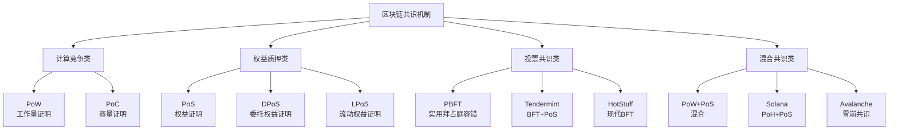
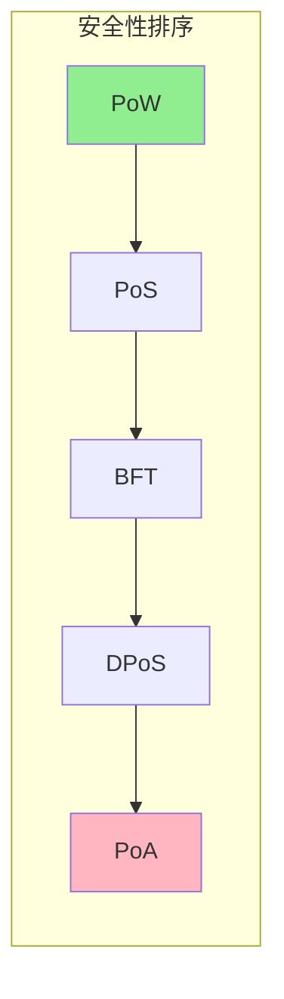
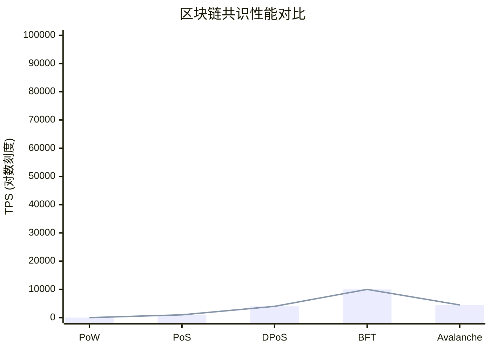
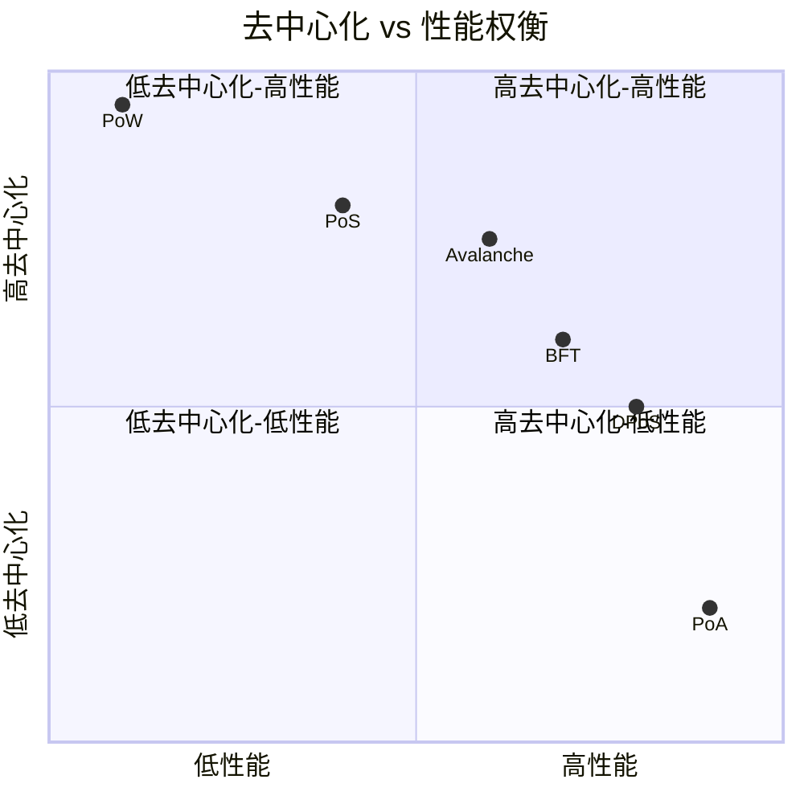
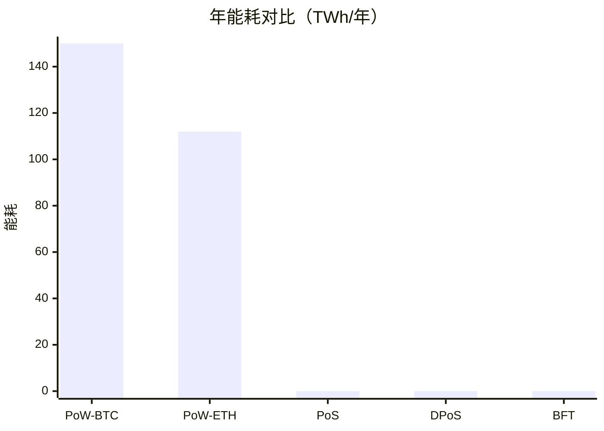
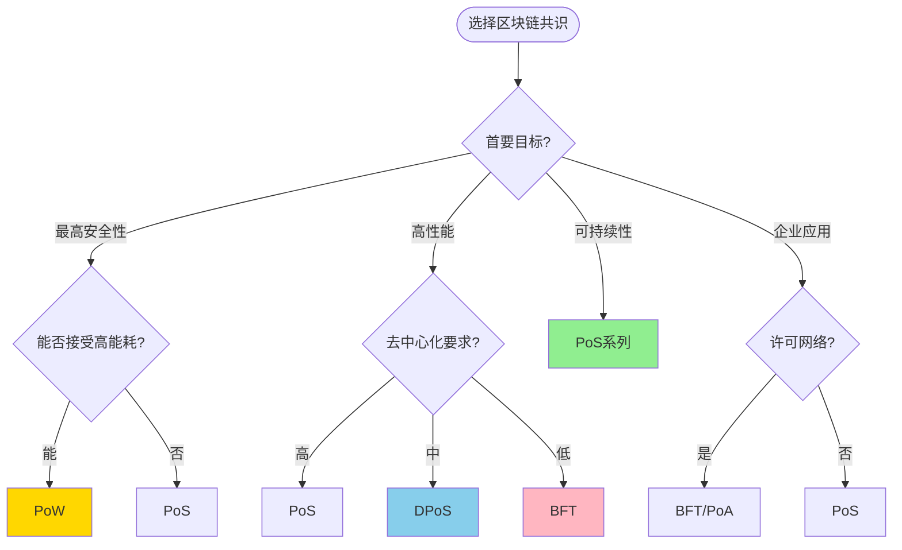

# 区块链共识对比 专题文档

**文档版本**：v1.0  
**创建时间**：2026年  
**最后更新**：2026年  
**状态**：✅ 已完成

---

## 📋 执行摘要

区块链共识机制是分布式账本技术的核心，决定了网络的安全性、去中心化程度和性能表现。本文系统性对比主流的区块链共识机制：工作量证明（PoW）、权益证明（PoS）、委托权益证明（DPoS）、权威证明（PoA）以及基于BFT的共识，从安全性、性能、去中心化、可持续性等多个维度进行深入分析，帮助读者理解不同共识机制的适用场景和权衡取舍。

---

## 一、共识机制分类

### 1.1 分类体系



### 1.2 共识机制概览

| 共识机制 | 代表项目 | 核心思想 | 主要特点 |
|---------|---------|---------|---------|
| **PoW** | 比特币、莱特币 | 算力竞争 | 去中心化高、能耗高 |
| **PoS** | 以太坊2.0、Cardano | 权益质押 | 节能、经济安全 |
| **DPoS** | EOS、TRON | 委托投票 | 高性能、相对中心化 |
| **BFT类** | Cosmos、Diem | 多轮投票 | 即时最终性、确定性 |
| **PoA** | POA Network、VeChain | 权威背书 | 高效、许可网络 |
| **雪崩** | Avalanche | 亚稳态共识 | 快速确认、高吞吐 |

---

## 二、核心维度对比

### 2.1 安全性对比

| 维度 | PoW | PoS | DPoS | BFT | PoA |
|------|-----|-----|------|-----|-----|
| **攻击成本** | 极高（51%算力） | 高（控制大量代币） | 中（控制投票权） | 高（控制2/3节点） | 低（依赖信任） |
| **长程攻击** | 免疫 | 需要弱主观性 | 可能 | 免疫 | 免疫 |
| **双花风险** | 极低 | 低 | 低 | 无 | 依赖治理 |
| **最终性** | 概率性 | 即时/概率性 | 即时 | 即时 | 即时 |



### 2.2 性能对比



| 指标 | PoW | PoS | DPoS | BFT | Avalanche |
|------|-----|-----|------|-----|-----------|
| **典型TPS** | 3-7 | 1000+ | 2000-4000 | 3000-10000 | 4500+ |
| **出块时间** | 10分钟 | 12秒 | 0.5-3秒 | 1-5秒 | <1秒 |
| **确认时间** | 60分钟 | 6-12分钟 | 1-3秒 | 1-3秒 | <3秒 |
| **扩容性** | 差 | 好 | 好 | 中 | 好 |

### 2.3 去中心化对比

| 维度 | PoW | PoS | DPoS | BFT | PoA |
|------|-----|-----|------|-----|-----|
| **准入门槛** | 无 | 低（质押） | 中（投票竞选） | 高（许可） | 高（授权） |
| **节点数量** | 数千-数万 | 数千-数十万 | 21-100 | 10-150 | 10-50 |
| **权力集中** | 矿池集中 | 大户集中 | 生产者集中 | 验证者集中 | 权威机构 |
| **审查抵抗** | ⭐⭐⭐⭐⭐ | ⭐⭐⭐⭐ | ⭐⭐⭐ | ⭐⭐⭐ | ⭐⭐ |



---

## 三、详细机制对比

### 3.1 记账权产生方式

| 共识 | 记账权产生 | 竞争方式 | 优势节点特征 |
|------|-----------|---------|-------------|
| **PoW** | 解决难题 | 算力竞争 | 算力大者胜 |
| **PoS** | 随机选择 | 质押权重 | 质押多者概率高 |
| **DPoS** | 投票选举 | 民主投票 | 得票多者当选 |
| **BFT** | 轮询/随机 | 共识协议 | 按照协议轮换 |
| **PoA** | 固定授权 | 无竞争 | 预设权威节点 |

### 3.2 激励机制对比

```go
// PoW激励：区块奖励 + 交易费
func PoWReward(block *Block, miner string) {
    blockReward := GetBlockSubsidy(block.Height)  // 随高度递减
    txFees := CalculateTxFees(block.Transactions)
    
    totalReward := blockReward + txFees
    SendTo(miner, totalReward)
}

// PoS激励：质押奖励 + 交易费
func PoSReward(block *Block, validators []Validator) {
    baseReward := CalculateBaseReward()
    
    for _, v := range validators {
        // 按质押比例分配
        share := float64(v.Stake) / float64(TotalStake)
        reward := uint64(float64(baseReward) * share)
        
        // 在线奖励加成
        if v.Online {
            reward = reward * 105 / 100  // 5%加成
        }
        
        SendTo(v.Address, reward)
    }
}

// DPoS激励：出块奖励 + 投票分红
func DPoSReward(block *Block, producer string) {
    blockReward := GetBlockReward()
    
    // 生产者获得主要奖励
    producerReward := blockReward * 80 / 100
    SendTo(producer, producerReward)
    
    // 投票者分红
    voters := GetVoters(producer)
    voterReward := blockReward * 20 / 100
    
    for _, voter := range voters {
        share := float64(voter.Votes) / float64(TotalVotesFor(producer))
        SendTo(voter.Address, uint64(float64(voterReward)*share))
    }
}
```

### 3.3 惩罚机制对比

| 共识 | 惩罚条件 | 惩罚方式 | 严重程度 |
|------|---------|---------|---------|
| **PoW** | 无（自然淘汰） | - | - |
| **PoS** | 双重签名、离线 | 罚没质押金 | 高 |
| **DPoS** | 错过出块 | 降级、失去奖励 | 中 |
| **BFT** | 恶意行为 | 驱逐、罚没 | 高 |
| **PoA** | 作恶 | 撤销授权 | 极高 |

---

## 四、能耗与可持续性

### 4.1 能耗对比



| 共识 | 年能耗（TWh） | 等效国家 | 碳足迹 |
|------|--------------|---------|--------|
| **PoW (比特币)** | ~150 | 阿根廷 | 高 |
| **PoW (以太坊前)** | ~112 | 荷兰 | 高 |
| **PoS (以太坊2.0)** | ~0.0026 | 小型城镇 | 极低 |
| **DPoS** | ~0.001 | 村庄 | 极低 |
| **BFT** | ~0.001 | 村庄 | 极低 |

### 4.2 可持续性评估

```
可持续性排名（从高到低）：

1. PoS/DPoS/BFT
   ✅ 极低能耗
   ✅ 无硬件竞赛
   ✅ 长期可扩展

2. PoW + 可再生能源
   ⚠️ 高能耗
   ✅ 可用清洁能源
   ⚠️ 硬件浪费

3. 传统PoW
   ❌ 高能耗
   ❌ 硬件浪费
   ⚠️ 碳排放
```

---

## 五、应用场景推荐

### 5.1 场景匹配矩阵

| 应用场景 | 推荐共识 | 原因 | 代表项目 |
|---------|---------|------|---------|
| **价值存储** | PoW | 最高安全性、去中心化 | 比特币 |
| **智能合约平台** | PoS | 平衡性能与去中心化 | 以太坊2.0 |
| **高频交易** | DPoS | 高TPS、低延迟 | EOS |
| **企业联盟链** | BFT | 即时最终性、确定性 | Hyperledger Fabric |
| **跨链协议** | BFT+PoS | 快速确认、经济安全 | Cosmos |
| **私有链** | PoA | 高效、可控 | POA Network |
| **DeFi应用** | PoS | 低成本、快速确认 | 各类L1/L2 |

### 5.2 决策流程图



---

## 六、主流公链对比

### 6.1 技术参数对比

| 项目 | 共识 | 出块时间 | TPS | 节点数 | 最终性 |
|------|------|---------|-----|-------|-------|
| **Bitcoin** | PoW | 10分钟 | 7 | 15000+ | 概率性（6块） |
| **Ethereum 2.0** | PoS | 12秒 | 1000+ | 800K+ | 即时（2 epoch） |
| **EOS** | DPoS | 0.5秒 | 4000 | 21 | 即时 |
| **Cosmos** | Tendermint | 1-7秒 | 1000+ | 150 | 即时 |
| **Solana** | PoH+PoS | 400ms | 65000 | 2000+ | 概率性 |
| **Avalanche** | Snowman | <1秒 | 4500 | 1500+ | 概率性 |
| **Cardano** | Ouroboros PoS | 20秒 | 250 | 3000+ | 概率性 |
| **Polkadot** | GRANDPA+BABE | 6秒 | 1000 | 300 | 即时 |

### 6.2 优缺点总结

| 项目 | 优势 | 劣势 |
|------|------|------|
| **Bitcoin** | 最安全、最去中心化 | 慢、能耗高、扩展性差 |
| **Ethereum 2.0** | 生态丰富、智能合约先驱 | 升级复杂、Gas费波动 |
| **Solana** | 极高TPS、低延迟 | 中心化争议、宕机历史 |
| **Cosmos** | 互操作性强、应用链 | 生态分散、ATOM价值捕获 |
| **Avalanche** | 快速最终性、子网 | 相对中心化、验证者门槛高 |
| **Cardano** | 学术研究基础、环保 | 发展慢、DeFi生态弱 |

---

## 七、发展趋势

### 7.1 共识演进方向

```
2020-2025 共识发展趋势：

1. 从PoW向PoS迁移
   - 以太坊合并完成
   - 新链多采用PoS

2. 模块化共识
   - 分离执行层与共识层
   - 专用DA层（如Celestia）

3. 分层共识
   - L1 + L2协同
   - 快速确认层 + 最终性层

4. 异构共识
   - 不同分片使用不同共识
   - 根据场景动态选择
```

### 7.2 新兴共识

| 共识 | 特点 | 项目 |
|------|------|------|
| **Celestia** | 专用DA层、数据可用性采样 | Celestia |
| **Narwhal/Tusk** | DAG-based、高吞吐 | Sui |
| **AptosBFT** | HotStuff优化版 | Aptos |
| **AlephBFT** | DAG + BFT | Aleph Zero |

---

## 八、与其他主题的关联

### 8.1 相关文档

- [PoW工作量证明](./PoW工作量证明.md)
- [PoS权益证明](./PoS权益证明.md)
- [DPoS委托权益证明](./DPoS委托权益证明.md)
- [BFT算法对比](../BFT算法对比.md)

### 8.2 延伸阅读

- [区块链基础](./区块链基础.md)
- [区块链共识机制](../区块链共识机制.md)

---

## 九、参考资源

### 9.1 学术论文

1. [Bitcoin: A Peer-to-Peer Electronic Cash System](https://bitcoin.org/bitcoin.pdf) - Satoshi Nakamoto, 2008
2. [Ethereum 2.0 Specs](https://github.com/ethereum/consensus-specs)
3. [Avalanche Consensus](https://arxiv.org/abs/1906.08936) - Rocket et al.
4. [Ouroboros: A Provably Secure Proof-of-Stake Blockchain Protocol](https://eprint.iacr.org/2016/889.pdf)

### 9.2 行业报告

1. [Electricity Consumption of Cryptocurrencies](https://ccaf.io/cbnsi/cbeci)
2. [Consensus Mechanism Comparison](https://ethereum.org/en/developers/docs/consensus-mechanisms/)

---

**维护者**：项目团队  
**最后更新**：2026年
