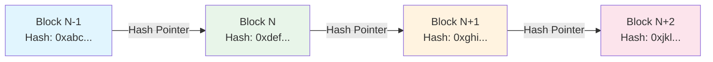

# 区块链基础 专题文档

**文档版本**：v1.0
**创建时间**：2026年
**最后更新**：2026年
**状态**：✅ 已完成

---

## 📋 执行摘要

区块链是一种去中心化的分布式账本技术，通过密码学、共识机制和链式数据结构实现数据的不可篡改、透明和可追溯。

---

## 一、核心概念

### 1.1 定义与原理

**定义**：区块链（Blockchain）是一种按时间顺序将数据区块以链式方式组合的数据结构，以密码学方式保证不可篡改和不可伪造的分布式账本。

**核心原理**：

- **分布式存储**：数据在全网节点冗余存储，无单点故障
- **密码学保障**：哈希函数和数字签名保证数据完整性和身份验证
- **共识机制**：网络节点通过共识算法达成一致状态
- **不可篡改**：链式结构+哈希指针，修改任一区块会改变后续所有区块哈希

### 1.2 关键特性

| 特性 | 描述 |
|------|------|
| **去中心化** | 无中心节点，网络节点地位平等，数据由全网共同维护 |
| **不可篡改** | 链式结构+密码学哈希，历史记录极难篡改 |
| **透明性** | 交易数据对所有节点可见，可验证可审计 |
| **可追溯** | 完整的历史记录链，每笔交易来源清晰 |
| **匿名性** | 地址与真实身份解耦，保护用户隐私 |
| **智能合约** | 自动执行的程序代码，实现业务逻辑自动化 |

### 1.3 区块链类型对比

| 类型 | 访问权限 | 共识机制 | 性能 | 典型应用 |
|------|---------|---------|------|---------|
| 公有链 | 任何人可参与 | PoW/PoS | 较低 | Bitcoin、Ethereum |
| 联盟链 | 许可节点参与 | PBFT/Raft | 较高 | Hyperledger Fabric、R3 Corda |
| 私有链 | 单一组织控制 | Raft/PBFT | 最高 | 企业内部系统 |

---

## 二、数据结构

### 2.1 区块结构

```
┌─────────────────────────────────────────┐
│              Block Header               │
├─────────────────────────────────────────┤
│  Previous Block Hash    │  32 bytes    │
│  Merkle Root            │  32 bytes    │
│  Timestamp              │  4 bytes     │
│  Difficulty Target      │  4 bytes     │
│  Nonce                  │  4 bytes     │
├─────────────────────────────────────────┤
│              Block Body                 │
├─────────────────────────────────────────┤
│  Transaction Counter    │  1-9 bytes   │
│  Transactions           │  可变长度    │
└─────────────────────────────────────────┘
```

**区块头字段说明**：

- **Previous Block Hash**：前一区块的哈希值，形成链式连接
- **Merkle Root**：区块内所有交易Merkle树的根哈希
- **Timestamp**：区块创建时间戳（Unix时间）
- **Difficulty Target**：挖矿难度目标值
- **Nonce**：随机数，矿工通过调整该值寻找有效哈希

### 2.2 链式结构



**链式特性**：

- 每个区块包含前一区块的哈希值
- 修改历史区块会导致后续所有区块哈希改变
- 重新计算需要消耗巨大算力（PoW机制下）
- 最长链原则保证全网一致性

### 2.3 Merkle树

```
                    Root Hash
                         │
              ┌──────────┴──────────┐
              │                     │
        Hash(0-1)             Hash(2-3)
         /    \                 /    \
       /        \             /        \
   Hash(0)   Hash(1)    Hash(2)   Hash(3)
      │         │         │         │
    Tx0       Tx1       Tx2       Tx3
```

**Merkle树特性**：

- **高效验证**：只需O(log n)个哈希即可验证交易存在性
- **轻节点友好**：SPV（简单支付验证）节点只需存储区块头
- **快速定位**：可快速定位和验证特定交易
- **数据完整性**：根哈希改变意味着任何叶子节点被篡改

**SPV验证过程**：

1. 轻节点下载区块头（而非完整区块）
2. 获取交易的Merkle路径
3. 重新计算根哈希并与区块头对比
4. 一致则证明交易存在于该区块

---

## 三、密码学基础

### 3.1 哈希函数

**区块链中使用的哈希函数**：

- **SHA-256**：Bitcoin使用的双SHA-256哈希
- **Keccak-256**：Ethereum使用的哈希算法
- **RIPEMD-160**：Bitcoin地址生成中使用的哈希

**哈希函数特性**：

| 特性 | 说明 |
|------|------|
| **单向性** | 由哈希值反推原始数据在计算上不可行 |
| **抗碰撞** | 难以找到两个不同输入产生相同哈希 |
| **确定性** | 相同输入总是产生相同输出 |
| **雪崩效应** | 输入微小变化导致输出完全不同 |
| **固定长度** | 无论输入多长，输出长度固定 |

**Bitcoin区块哈希计算**：

```
Block Hash = SHA-256(SHA-256(Block Header))
```

### 3.2 数字签名

**非对称加密体系**：

```
┌─────────────────────────────────────────────────────┐
│                   密钥生成                           │
│                                                      │
│   随机数 ──→ 私钥 (Private Key)                      │
│                      ↓                               │
│   椭圆曲线乘法 ──→ 公钥 (Public Key)                  │
│                      ↓                               │
│   哈希+编码 ──→ 地址 (Address)                       │
└─────────────────────────────────────────────────────┘
```

**签名与验证过程**：

```
签名过程：                    验证过程：
┌─────────────┐              ┌─────────────┐
│  交易数据    │              │  交易数据    │
│    +        │              │    +        │
│   私钥      │──→ 签名 ──→  │   公钥      │──→ 验证结果
│    +        │              │    +        │
│   随机数    │              │   签名      │
└─────────────┘              └─────────────┘
```

**常用签名算法**：

- **ECDSA**：Elliptic Curve Digital Signature Algorithm（Bitcoin）
- **EdDSA**：Edwards-curve Digital Signature Algorithm（更快更安全）
- **Schnorr**：即将在Bitcoin中启用，支持签名聚合

---

## 四、智能合约

### 4.1 智能合约概述

**定义**：智能合约是运行在区块链上的自动执行的程序代码，当预设条件被满足时自动执行相应操作。

**特性**：

- **自动执行**：无需人工干预，条件满足自动触发
- **不可篡改**：部署后代码不可修改
- **透明可见**：代码逻辑对所有节点可见
- **确定性**：相同输入在任何节点执行结果一致

### 4.2 智能合约平台对比

| 平台 | 虚拟机 | 编程语言 | Gas模型 | 特点 |
|------|--------|---------|--------|------|
| Ethereum | EVM | Solidity/Vyper | 按操作计费 | 生态最完善 |
| Solana | Sealevel | Rust/C | 按计算量计费 | 高性能 |
| Polkadot | Wasm | Rust/C++ | 按重量计费 | 跨链互操作 |
| Hyperledger Fabric | Docker | Go/Java/JS | 无 | 企业级 |

### 4.3 智能合约生命周期

```
┌──────────┐    ┌──────────┐    ┌──────────┐    ┌──────────┐
│  编写代码 │───→│ 编译部署 │───→│ 调用执行 │───→│ 状态更新 │
└──────────┘    └──────────┘    └──────────┘    └──────────┘
      │              │              │              │
   Solidity     字节码上链      交易触发       状态写入
   Rust/Wasm    支付Gas        矿工执行       区块链
```

---

## 五、公有链 vs 联盟链 vs 私有链

### 5.1 详细对比

| 维度 | 公有链 | 联盟链 | 私有链 |
|------|--------|--------|--------|
| **参与权限** | 任何人可参与 | 许可节点参与 | 单一组织控制 |
| **读取权限** | 完全公开 | 部分公开/受限 | 内部可见 |
| **写入权限** | 任何节点 | 授权节点 | 指定节点 |
| **共识节点** | 动态变化 | 固定/半固定 | 完全控制 |
| **共识效率** | 较低（分钟级） | 较高（秒级） | 最高（毫秒级） |
| **去中心化** | 完全去中心化 | 部分去中心化 | 中心化 |
| **隐私保护** | 弱（地址匿名） | 中（通道隔离） | 强（完全控制） |
| **监管合规** | 困难 | 可行 | 容易 |
| **应用场景** | 加密货币、DeFi | 供应链金融、跨境支付 | 企业内部审计 |

### 5.2 选型决策树

```
需求分析
│
├── 需要完全去中心化？
│   ├── 是 → 公有链
│   │           ├── 需要智能合约？
│   │           │   ├── 是 → Ethereum/Solana
│   │           │   └── 否 → Bitcoin
│   └── 否 → 继续判断
│
├── 多方参与且需信任机制？
│   ├── 是 → 联盟链
│   │           ├── 需要隐私通道？
│   │           │   ├── 是 → Hyperledger Fabric
│   │           │   └── 否 → R3 Corda
│   └── 否 → 继续判断
│
└── 单一组织内部使用？
    └── 是 → 私有链
                ├── 需要图数据库？
                │   ├── 是 → Neo4j + 区块链
                │   └── 否 → 传统数据库改造
```

### 5.3 典型系统架构

**公有链架构（Ethereum）**：

```
┌──────────────────────────────────────────────────┐
│                   应用层                          │
│   DApp / DeFi / NFT / DAO                        │
├──────────────────────────────────────────────────┤
│                   合约层                          │
│   Solidity / Vyper 智能合约                      │
├──────────────────────────────────────────────────┤
│                   激励层                          │
│   代币发行 / Gas机制 / 挖矿奖励                   │
├──────────────────────────────────────────────────┤
│                   共识层                          │
│   PoS / Casper FFG 共识算法                      │
├──────────────────────────────────────────────────┤
│                   网络层                          │
│   P2P网络 / 传播协议 / 验证机制                   │
├──────────────────────────────────────────────────┤
│                   数据层                          │
│   区块数据 / 链式结构 / Merkle树 / 非对称加密     │
└──────────────────────────────────────────────────┘
```

**联盟链架构（Hyperledger Fabric）**：

```
┌──────────────────────────────────────────────────┐
│                   应用层                          │
│   SDK (Go/Java/Node.js/REST API)                 │
├──────────────────────────────────────────────────┤
│                   智能合约层                      │
│   Chaincode (Go/Java/JavaScript)                 │
├──────────────────────────────────────────────────┤
│                   区块链服务层                    │
│   共识服务 / 成员服务 / 区块链服务                │
├──────────────────────────────────────────────────┤
│                   通信层                          │
│   gRPC / gossip协议                              │
├──────────────────────────────────────────────────┤
│                   存储层                          │
│   账本存储 (LevelDB/CouchDB)                     │
└──────────────────────────────────────────────────┘
```

---

## 六、与其他主题的关联

### 6.1 上游依赖

- [密码学基础](../../02-foundations/cryptography.md)
- [分布式系统基础](../../02-foundations/distributed-systems.md)
- [点对点网络](../../03-network/p2p-networks.md)

### 6.2 下游应用

- [区块链共识机制](./区块链共识机制.md)
- [分布式账本应用](../distributed-ledger-applications.md)
- [去中心化金融(DeFi)](../defi.md)

### 6.3 相关概念

| 概念 | 关系 | 说明 |
|------|------|------|
| DAG | 扩展 | 有向无环图，另一种分布式账本结构（IOTA） |
| Sidechain | 扩展 | 与主链并行运行的独立区块链 |
| Layer2 | 扩展 | 构建在主链之上的扩展方案（闪电网络、Rollup） |
| Sharding | 优化 | 分片技术提升区块链扩展性 |

---

## 七、参考资源

### 7.1 学术论文

1. [Bitcoin: A Peer-to-Peer Electronic Cash System](https://bitcoin.org/bitcoin.pdf) - Satoshi Nakamoto, 2008
2. [Ethereum: A Next-Generation Smart Contract and Decentralized Application Platform](https://ethereum.org/whitepaper) - Vitalik Buterin, 2013
3. [Hyperledger Fabric: A Distributed Operating System for Permissioned Blockchains](https://arxiv.org/abs/1801.10228) - Elli Androulaki et al., 2018

### 7.2 开源项目

1. [Bitcoin Core](https://github.com/bitcoin/bitcoin) - Bitcoin官方实现
2. [Go-Ethereum](https://github.com/ethereum/go-ethereum) - Ethereum Go语言实现
3. [Hyperledger Fabric](https://github.com/hyperledger/fabric) - 企业级联盟链平台

### 7.3 学习资料

1. [Mastering Bitcoin](https://github.com/bitcoinbook/bitcoinbook) - Andreas M. Antonopoulos
2. [Mastering Ethereum](https://github.com/ethereumbook/ethereumbook) - Andreas M. Antonopoulos
3. [区块链技术指南](https://yeasy.gitbook.io/blockchain_guide/) - 开源中文书籍

### 7.4 相关文档

- [区块链共识机制](./区块链共识机制.md)
- [BitTorrent协议](./BitTorrent协议.md)
- [IPFS星际文件系统](./IPFS星际文件系统.md)

---

**维护者**：项目团队
**最后更新**：2026年
