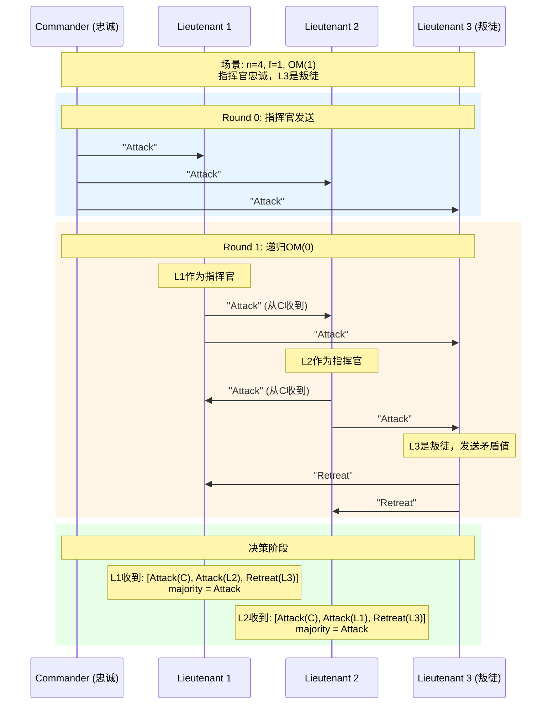
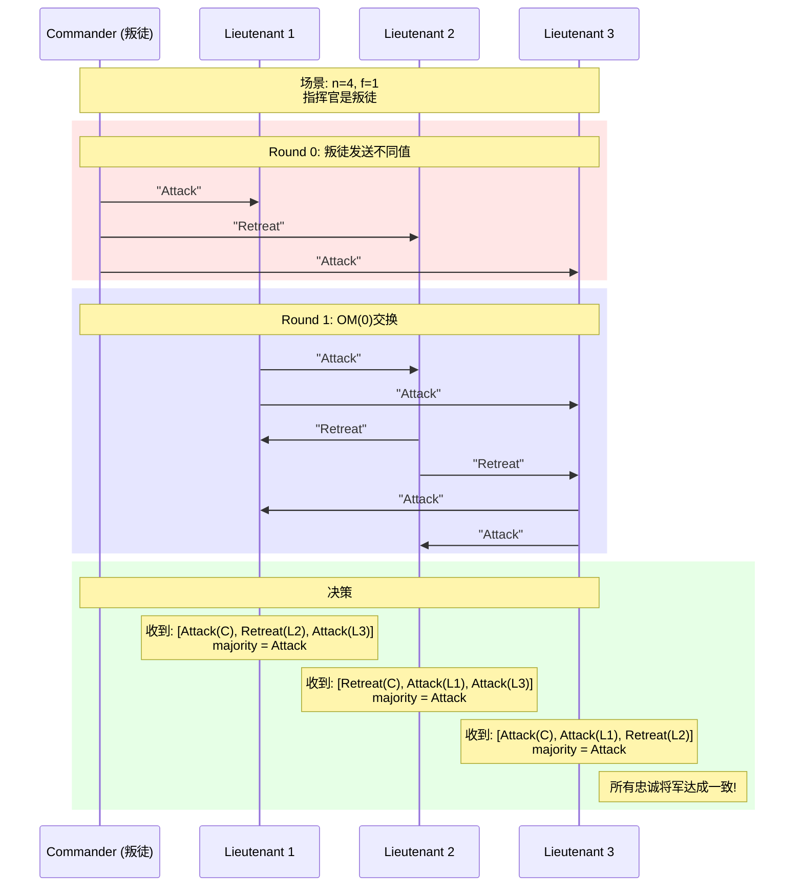
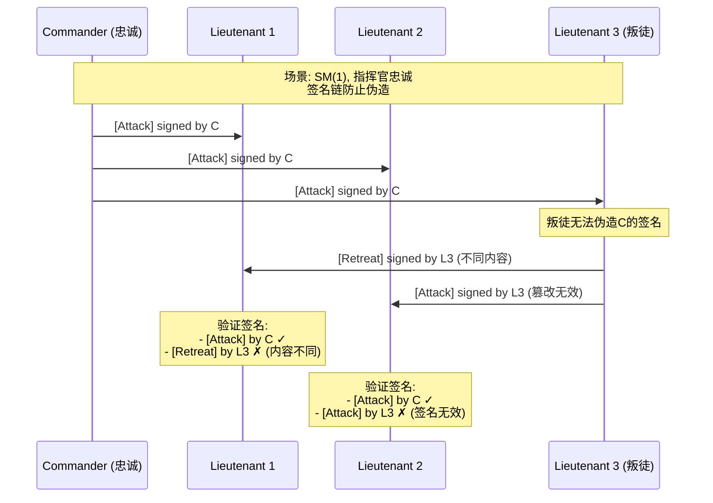

# 拜占庭将军问题

> Stanford CS244B: Distributed Systems 课程对齐

## 1. 问题定义

### 1.1 历史背景

拜占庭将军问题（Byzantine Generals Problem）由Lamport、Shostak和Pease于1982年提出。问题描述如下：

> 拜占庭军队由多个师团组成，每个师团由一位将军指挥。将军们通过信使通信，需要在进攻或撤退之间达成共识。但其中有**叛徒**（拜占庭节点）可能发送错误或矛盾的信息。如何确保忠诚将军达成一致的决策？

### 1.2 形式化定义

```
┌─────────────────────────────────────────────────────────────────┐
│                   拜占庭将军问题形式化                           │
├─────────────────────────────────────────────────────────────────┤
│                                                                  │
│  系统模型:                                                        │
│  ┌─────────┐                                                     │
│  │  General│  n个将军，其中f个是叛徒（拜占庭故障）                │
│  │   G1    │                                                     │
│  ├────┬────┤  通信方式: 两两之间通过可靠信道通信                   │
│  │    │    │                                                     │
│  │   G2   G3  目标: 所有忠诚将军达成相同的决策                     │
│  │  /│\                                                     │
│  │ G4-G5-G6  叛徒可以:                                          │
│  │           - 不发送消息                                        │
│  │           - 发送错误消息                                      │
│  │           - 对不同将军发送不同消息                            │
│  └─────────┘                                                     │
│                                                                  │
└─────────────────────────────────────────────────────────────────┘
```

## 2. 口头消息算法 (OM)

### 2.1 算法描述

**OM(m)** 算法 - 递归解决拜占庭问题：

```
算法 OM(m), m ≥ 0:
─────────────────────────────────────────────────
1. 指挥官发送值v给所有副官

2. 对每个副官i:
   - 接收指挥官的值v_i
   - 如果m > 0:
     * 作为指挥官执行OM(m-1)，发送v_i给其他n-2个副官
     * 接收其他n-2个副官的OM(m-1)结果
     * 使用majority函数确定最终值
   - 否则 (m = 0):
     * 使用v_i作为最终值
3. 返回 majority(v_1, v_2, ..., v_{n-1})
─────────────────────────────────────────────────
```

### 2.2 时序图：OM(1)示例



### 2.3 叛徒指挥官场景



## 3. 签名消息算法 (SM)

### 3.1 不可伪造签名

```go
// 签名消息系统假设
type SignedMessage struct {
    Value     string      // 消息内容
    Signature []byte      // 数字签名
    Signers   []int       // 签名链
}

// 签名验证
func (sm *SignedMessage) Verify(publicKey PublicKey) bool {
    // 验证最后一个签名者的签名
    lastSigner := sm.Signers[len(sm.Signers)-1]
    return crypto.Verify(sm.Value, sm.Signature, publicKey[lastSigner])
}

// 添加签名
func (sm *SignedMessage) Sign(signerID int, privateKey PrivateKey) *SignedMessage {
    newSig := crypto.Sign(sm.Value, privateKey)
    return &SignedMessage{
        Value:     sm.Value,
        Signature: newSig,
        Signers:   append(sm.Signers, signerID),
    }
}
```

### 3.2 SM(m)算法

```go
// SignedMessageAlgorithm 签名消息算法
type SignedMessageAlgorithm struct {
    n int  // 总将军数
    f int  // 最大叛徒数
    id int // 当前将军ID
}

// SM 执行签名消息算法
func (sma *SignedMessageAlgorithm) SM(m int, signedMsg *SignedMessage) string {
    // 将消息加入集合V
    V := make(map[string]bool)

    if m == 0 {
        return signedMsg.Value
    }

    // 转发给其他将军
    for i := 0; i < sma.n; i++ {
        if i != sma.id && !contains(signedMsg.Signers, i) {
            // 添加自己的签名并发送
            newMsg := signedMsg.Sign(sma.id, privateKeys[sma.id])
            sendTo(i, newMsg)
        }
    }

    // 收集消息
    for i := 0; i < sma.n-1; i++ {
        msg := receive()
        if msg != nil && msg.Verify(publicKeys) && len(msg.Signers) == m+1 {
            V[msg.Value] = true

            // 继续转发
            if m > 1 {
                sma.SM(m-1, msg)
            }
        }
    }

    // 选择结果
    return choose(V)
}

func choose(V map[string]bool) string {
    // 如果只有一个值，返回它
    if len(V) == 1 {
        for v := range V {
            return v
        }
    }
    // 否则返回默认值（如"Retreat"）
    return "Retreat"
}
```

### 3.3 时序图：签名消息



## 4. 容错上限证明

### 4.1 口头消息：n ≥ 3f + 1

**定理**：使用口头消息解决拜占庭将军问题需要至少 $n \geq 3f + 1$ 个将军。

**证明（反证法）**：

假设 $n = 3$，$f = 1$ 时可以解决：

```
情况1: 指挥官是叛徒
        C(叛徒)
       /    \
     "A"     "R"
     /         \
   L1          L2

L1收到"A"，L2收到"R"
没有更多信息，无法达成一致!
```

形式化证明：

1. 每个忠诚副官需要从 $n-f-1$ 个其他副官处获取信息
2. 其中可能有 $f$ 个叛徒
3. 需要 $n-f-1 > f$，即 $n > 2f + 1$
4. 考虑递归深度，需要 $n \geq 3f + 1$

### 4.2 签名消息：n ≥ f + 2

**定理**：使用签名消息需要至少 $n \geq f + 2$ 个将军。

**证明**：

签名的特性使得消息来源可追溯，叛徒无法伪造忠诚将军的消息。

当 $n = f + 1$ 时：

- 如果指挥官是忠诚的，所有副官收到相同签名消息
- 如果指挥官是叛徒，至少有一个忠诚副官可以传播正确信息
- 签名链保证了消息的真实性

但需要至少2个忠诚将军来验证和传播消息，因此 $n \geq f + 2$。

## 5. Go完整实现

### 5.1 口头消息完整实现

```go
package byzantine

// General 将军接口
type General interface {
    ID() int
    IsTraitor() bool
    Receive(msg Message) error
    Decide() string
}

// OMGeneral 口头消息算法实现
type OMGeneral struct {
    id       int
    traitor  bool
    n        int  // 总将军数
    f        int  // 最大叛徒数

    // 收到的消息
    messages map[string][]string // sender -> value

    // 递归结果
    subResults map[int]map[string]string // round -> sender -> value
}

// Send 发送消息
func (g *OMGeneral) Send(value string, recipients []int) []Message {
    msgs := make([]Message, 0)

    for _, r := range recipients {
        v := value
        if g.traitor {
            // 叛徒发送矛盾值
            v = g.generateContradictoryValue(r)
        }

        msgs = append(msgs, Message{
            From:  g.id,
            To:    r,
            Value: v,
        })
    }

    return msgs
}

// OM 执行口头消息算法
func (g *OMGeneral) OM(m int, commander int, value string, participants []int) string {
    if m == 0 {
        // 基础情况：直接接收
        return value
    }

    // 收集所有值
    values := make([]string, 0)
    values = append(values, value)  // 指挥官的值

    // 从其他副官接收OM(m-1)结果
    for _, p := range participants {
        if p != g.id && p != commander {
            // 模拟接收来自p的OM(m-1)
            subValue := g.receiveOM(m-1, p, participants)
            values = append(values, subValue)
        }
    }

    // 使用多数决
    return majority(values)
}

func majority(values []string) string {
    count := make(map[string]int)
    for _, v := range values {
        count[v]++
    }

    maxCount := 0
    var result string
    for v, c := range count {
        if c > maxCount {
            maxCount = c
            result = v
        }
    }

    return result
}
```

### 5.2 模拟测试

```go
// Simulation 模拟测试
type Simulation struct {
    generals []General
    n, f     int
}

// Run 运行模拟
func (s *Simulation) Run() map[int]string {
    results := make(map[int]string)

    // 选择指挥官（假设为将军0）
    commander := s.generals[0]

    // 执行OM(f)
    for _, g := range s.generals[1:] {
        if !g.IsTraitor() {
            result := g.(*OMGeneral).OM(
                s.f,
                commander.ID(),
                "Attack",
                getIDs(s.generals),
            )
            results[g.ID()] = result
        }
    }

    return results
}

// Verify 验证一致性
func (s *Simulation) Verify(results map[int]string) bool {
    if len(results) == 0 {
        return true
    }

    var first string
    for _, v := range results {
        first = v
        break
    }

    for _, v := range results {
        if v != first {
            return false
        }
    }

    return true
}

// 测试用例
func TestByzantineGenerals(t *testing.T) {
    // 测试 n=4, f=1 (应该成功)
    sim1 := NewSimulation(4, 1)
    results1 := sim1.Run()
    if !sim1.Verify(results1) {
        t.Error("n=4, f=1 should succeed")
    }

    // 测试 n=3, f=1 (应该失败)
    sim2 := NewSimulation(3, 1)
    results2 := sim2.Run()
    if sim2.Verify(results2) {
        t.Log("Warning: n=3, f=1 should fail in some cases")
    }
}
```

## 6. 现代应用

### 6.1 区块链共识

拜占庭容错是现代区块链的基础：

- **Bitcoin**: PoW + 最长链规则
- **PBFT**: 实用拜占庭容错
- **HotStuff**: 现代BFT共识

### 6.2 分布式系统

```
┌──────────────────────────────────────────────────────────────┐
│                拜占庭容错应用场景                             │
├──────────────────────────────────────────────────────────────┤
│                                                               │
│  ┌──────────────┐  ┌──────────────┐  ┌──────────────┐       │
│  │  区块链      │  │  太空系统    │  │  核能控制    │       │
│  │  - Bitcoin   │  │  - 卫星网络  │  │  - 安全关键  │       │
│  │  - Ethereum  │  │  - 深空探测  │  │  - 故障容错  │       │
│  └──────────────┘  └──────────────┘  └──────────────┘       │
│                                                               │
│  ┌──────────────┐  ┌──────────────┐  ┌──────────────┐       │
│  │  多方计算    │  │  军事系统    │  │  金融系统    │       │
│  │  - MPC       │  │  - 指挥控制  │  │  - 跨行结算  │       │
│  │  - 隐私保护  │  │  - 安全通信  │  │  - 数字货币  │       │
│  └──────────────┘  └──────────────┘  └──────────────┘       │
│                                                               │
└──────────────────────────────────────────────────────────────┘
```

## 7. 总结

拜占庭将军问题是分布式系统理论的基石。关键结论：

| 消息类型 | 最小将军数 | 通信复杂度 |
|----------|-----------|-----------|
| 口头消息 | $n \geq 3f + 1$ | $O(n^m)$ |
| 签名消息 | $n \geq f + 2$ | $O(n^2)$ |

理解拜占庭故障模型对于设计高可靠的分布式系统至关重要。

---

**参考**：

- Lamport, Shostak, Pease, "The Byzantine Generals Problem" (1982)
- Castro, Liskov, "Practical Byzantine Fault Tolerance" (1999)
- Stanford CS244B Lecture Notes
