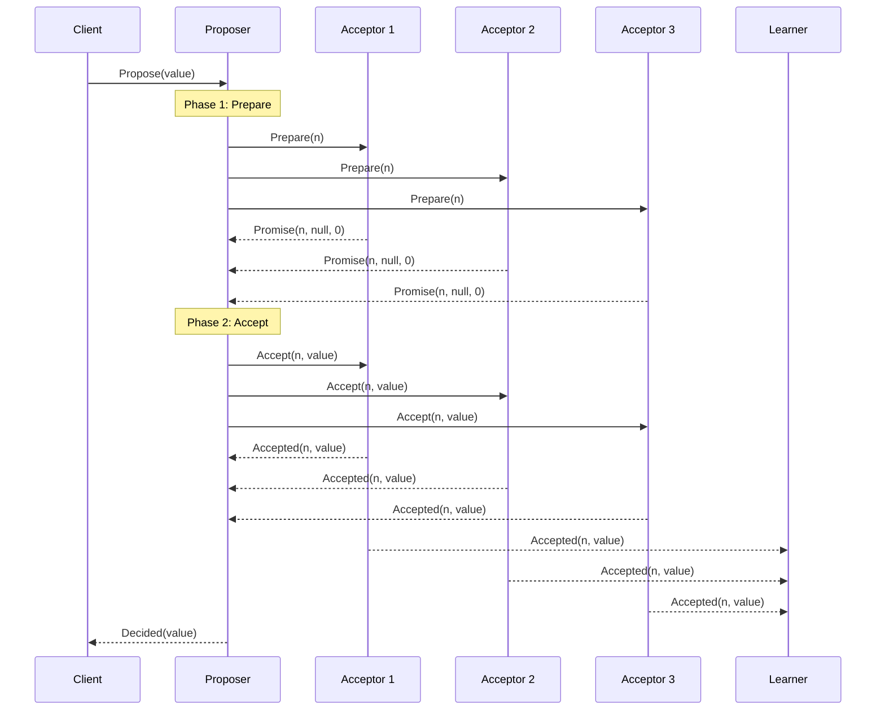

# Paxos算法详解 专题文档

**文档版本**：v1.0  
**创建时间**：2026年  
**最后更新**：2026年  
**状态**：✅ 已完成

---

## 📋 执行摘要

Paxos算法是分布式系统领域最重要的共识算法之一，由Leslie Lamport于1989年提出。它解决了在异步网络环境下，即使存在节点故障，也能保证系统达成一致性的问题。Multi-Paxos是Basic Paxos的优化版本，通过选举Leader来减少消息轮次，成为生产环境中广泛应用的共识实现方案。

---

## 一、核心概念

### 1.1 定义与原理

**Paxos算法**是一种解决分布式系统中一致性问题的经典算法，它允许一组进程在可能存在故障和消息丢失的异步网络环境中就某个值达成一致。

#### 基本问题定义

在分布式系统中，共识问题需要满足以下三个基本属性：

1. **一致性（Safety）**：所有正确节点最终决定的值必须是某个节点提议的值，且所有正确节点决定的值相同
2. **终止性（Liveness）**：最终所有正确节点都会决定一个值
3. **有效性（Validity）**：只有当大多数节点接受某个值时，该值才能被决定

#### 参与者角色

Paxos算法定义了三种角色：

| 角色 | 职责 | 说明 |
|------|------|------|
| **Proposer（提议者）** | 提出提案 | 接收客户端请求，向Acceptor发起提案 |
| **Acceptor（接受者）** | 接受或拒绝提案 | 存储提案状态，参与投票决策 |
| **Learner（学习者）** | 学习已决定的值 | 不参与决策过程，只获取最终结果 |

**注意**：一个物理节点可以同时扮演多个角色。

### 1.2 关键特性

- **容错性**：能够容忍少数节点（不超过半数）的故障
- **安全性**：保证不会选择两个不同的值
- **活性**：在没有故障和消息丢失的情况下，最终会达成一致
- **非拜占庭容错**：假设节点不会出现恶意行为，只会崩溃或停止

### 1.3 适用场景

| 场景 | 适用性 | 说明 |
|------|--------|------|
| 分布式数据库主从选举 | ⭐⭐⭐⭐⭐ | 如Google Spanner、CockroachDB |
| 配置管理服务 | ⭐⭐⭐⭐⭐ | 如Apache ZooKeeper的前身实现 |
| 分布式锁服务 | ⭐⭐⭐⭐⭐ | 如Chubby锁服务 |
| 分布式事务协调 | ⭐⭐⭐⭐ | 用于协调者选举和决策 |
| 高并发写入场景 | ⭐⭐⭐ | 单Leader架构可能成为瓶颈 |

---

## 二、Basic Paxos算法详解

### 2.1 两阶段提交协议

Basic Paxos采用两阶段提交机制：Prepare阶段和Accept阶段。

#### Phase 1: Prepare（准备阶段）

**Proposer的操作**：
1. 选择一个唯一的提案编号 n（全局递增）
2. 向大多数Acceptor发送 Prepare(n) 请求

**Acceptor的操作**：
1. 如果 n 大于该Acceptor已响应的所有Prepare请求的编号
2. 承诺不再接受编号小于 n 的提案
3. 回复 Promise(n, v, n_v)，其中 v 是已接受的最高编号提案的值，n_v 是其编号

#### Phase 2: Accept（接受阶段）

**Proposer的操作**：
1. 如果收到大多数Acceptor的Promise响应
2. 选择 v 的值：如果存在已接受的提案，选择编号最高的那个值；否则使用自己的提议值
3. 向这些Acceptor发送 Accept(n, v) 请求

**Acceptor的操作**：
1. 如果 n 仍然大于等于该Acceptor承诺的最小编号
2. 接受该提案，记录 (n, v)
3. 向Proposer和Learner发送 Accepted(n, v)

### 2.2 算法伪代码

```
// Proposer端算法
function Propose(value):
    n = generateUniqueProposalNumber()
    
    // Phase 1: Prepare
    send Prepare(n) to majority of Acceptors
    wait for Promise responses from majority
    
    if received any (v, n_v) in responses:
        value = v with highest n_v
    
    // Phase 2: Accept
    send Accept(n, value) to majority of Acceptors
    wait for Accepted responses from majority
    
    return DECIDED

// Acceptor端算法
state:
    minProposal = 0      // 最小承诺编号
    acceptedProposal = 0 // 已接受的提案编号
    acceptedValue = null // 已接受的值

on receive Prepare(n):
    if n > minProposal:
        minProposal = n
        respond Promise(n, acceptedValue, acceptedProposal)

on receive Accept(n, v):
    if n >= minProposal:
        acceptedProposal = n
        acceptedValue = v
        respond Accepted(n, v)
        notify Learners
```

### 2.3 算法流程图



---

## 三、Multi-Paxos实现

### 3.1 为什么需要Multi-Paxos

Basic Paxos存在以下问题：
- 每个提案都需要两阶段通信，延迟高
- 多个Proposer竞争可能导致活锁
- 缺乏连续提案的优化机制

### 3.2 Leader选举机制

Multi-Paxos引入Leader概念：
1. 选举一个节点作为Leader（通常通过Paxos选举）
2. 只有Leader可以发起提案
3. 跳过Prepare阶段（使用同一个提案编号）

#### Leader选举算法

```
function ElectLeader():
    currentLeader = null
    leaderLease = null
    
    while true:
        if currentLeader == null or leaseExpired(leaderLease):
            // 尝试成为Leader
            if runPaxosRound(LEADER_ELECTION, myId):
                currentLeader = myId
                leaderLease = acquireLease(LEASE_DURATION)
                startHeartbeat()
        
        sleep(ELECTION_INTERVAL)

function onHeartbeatTimeout():
    currentLeader = null
```

### 3.3 日志复制流程

```mermaid
sequenceDiagram
    participant Client
    participant Leader
    participant F1 as Follower 1
    participant F2 as Follower 2
    participant F3 as Follower 3

    Client->>Leader: AppendEntry(index, data)
    
    Note over Leader: 写入本地日志
    Leader->>F1: AppendEntries(index, data, prevIndex, prevTerm)
    Leader->>F2: AppendEntries(index, data, prevIndex, prevTerm)
    Leader->>F3: AppendEntries(index, data, prevIndex, prevTerm)
    
    Note over F1,F2,F3: 写入本地日志并确认
    F1-->>Leader: AppendEntriesReply(success=true)
    F2-->>Leader: AppendEntriesReply(success=true)
    F3-->>Leader: AppendEntriesReply(success=true)
    
    Note over Leader: 大多数确认后提交
    Leader-->>Client: Success
    
    Leader->>F1: CommitIndex(index)
    Leader->>F2: CommitIndex(index)
    Leader->>F3: CommitIndex(index)
```

### 3.4 成员变更

#### 联合共识（Joint Consensus）

为了安全地变更成员配置，使用两阶段方法：

```
Phase 1: 进入联合共识阶段
- 领导者复制 Cold,new 配置到所有节点
- 需要旧配置和新配置的多数派同时确认

Phase 2: 完全切换到新配置
- 领导者复制 Cnew 配置到所有节点
- 只需要新配置的多数派确认
```

---

## 四、优缺点分析

### 4.1 优点

| 优点 | 详细说明 |
|------|----------|
| **理论完备** | 经过了严格的形式化证明，安全性有保障 |
| **容错性强** | 可容忍少于半数的节点故障 |
| **灵活性高** | 不限制具体实现方式，适应多种场景 |
| **扩展性好** | Multi-Paxos可以高效处理连续提案 |
| **无单点故障** | Leader故障后可以快速选举新Leader |

### 4.2 缺点

| 缺点 | 详细说明 |
|------|----------|
| **理解困难** | 算法逻辑复杂，实现难度大 |
| **活锁问题** | 多个Proposer竞争可能导致无限循环 |
| **消息开销大** | 两阶段通信导致延迟较高 |
| **实现复杂** | 工程实现容易出错，边界情况多 |
| **Leader瓶颈** | 单Leader架构在高并发下可能成为瓶颈 |

### 4.3 与Raft算法对比

| 维度 | Paxos | Raft |
|------|-------|------|
| 可理解性 | 较低 | 较高 |
| 实现难度 | 较高 | 较低 |
| 消息复杂度 | O(n²) | O(n) |
| 日志复制效率 | 高（优化后） | 高 |
| 成员变更 | 复杂（联合共识） | 相对简单 |
| 工业应用 | Spanner、Chubby | etcd、Consul、TiKV |

---

## 五、实际应用系统

### 5.1 Google Chubby

Google的分布式锁服务，基于Paxos实现：
- 使用Paxos选举Master
- Master处理所有读写请求
- 副本作为容错备份

### 5.2 Google Spanner

全球分布式数据库：
- 使用Paxos组管理数据分片
- 每个Paxos组包含多个副本
- 支持跨数据中心的强一致性

### 5.3 CockroachDB

分布式SQL数据库：
- 使用Multi-Raft（基于Paxos思想）
- 每个Range是一个Raft组
- 默认3-5个副本

### 5.4 Apache Cassandra（轻量级）

- 使用类Paxos机制实现轻量级事务（LWT）
- CAS（Compare-And-Set）操作基于Paxos

---

## 六、形式化安全证明简述

### 6.1 安全性证明

**定理**：Paxos算法保证最多只有一个值被选择。

**证明概要**：

假设存在两个不同的值 v₁ 和 v₂ 被选择，则：

1. **引理1**：如果提案 (n₁, v₁) 被大多数Acceptor接受，则任何编号 n > n₁ 的提案必须满足 v = v₁。

2. **证明**：
   - 设 S 是接受 (n₁, v₁) 的大多数Acceptor集合
   - 设 T 是接受提案 n 的大多数Acceptor集合
   - S ∩ T ≠ ∅（因为两者都是大多数）
   - 交集Acceptor既接受了 (n₁, v₁)，又承诺了提案 n
   - 根据Prepare阶段规则，Proposer在提案 n 时必须选择已接受的最高编号值
   - 因此 v = v₁

3. **结论**：不可能选择两个不同的值，矛盾。

### 6.2 活性证明

**定理**：在没有故障和消息丢失的情况下，Paxos最终会达成一致。

**证明概要**：
- 假设只有一个Proposer
- 该Proposer的Prepare请求会被大多数Acceptor响应
- 该Proposer的Accept请求会被大多数Acceptor接受
- 因此该值会被选择

### 6.3 复杂度分析

| 复杂度类型 | Basic Paxos | Multi-Paxos |
|-----------|-------------|-------------|
| **消息复杂度** | O(n²) | O(n) |
| **时间复杂度** | 2 RTT | 1 RTT（优化后） |
| **空间复杂度** | O(1) per proposal | O(n) |

---

## 七、实践指南

### 7.1 实现要点

1. **提案编号生成**
   ```
   proposal_number = (round << 32) | server_id
   ```

2. **持久化存储**
   - 必须持久化 minProposal、acceptedProposal、acceptedValue
   - 使用WAL（Write-Ahead Log）保证崩溃恢复

3. **网络超时处理**
   - 设置合理的超时时间
   - 实现指数退避重试

### 7.2 常见问题

**Q1: 如何避免活锁？**
A: 使用Leader选举机制，或实现随机退避策略。

**Q2: 提案编号如何全局唯一？**
A: 组合使用（轮次，节点ID），或使用全局时钟加节点ID。

**Q3: 如何处理网络分区？**
A: 保证只有包含大多数节点的分区可以继续处理请求。

---

## 八、与其他主题的关联

### 8.1 上游依赖

- [FLP不可能性定理](../../02-THEORY/distributed-systems/FLP不可能定理专题文档.md) - 理解Paxos的假设前提
- [CAP定理](../../02-THEORY/distributed-systems/CAP定理专题文档.md) - 理解一致性、可用性、分区容忍性的权衡

### 8.2 下游应用

- [ZooKeeper深度分析](../../工具与框架/ZooKeeper深度分析.md) - 使用ZAB协议（类似Paxos）
- [etcd详解](../../工具与框架/etcd详解.md) - 使用Raft协议（Paxos的简化版本）

### 8.3 相关概念

| 概念 | 关系 | 说明 |
|------|------|------|
| Raft | 替代方案 | 更易于理解和实现的共识算法 |
| ZAB | 类似算法 | ZooKeeper使用的原子广播协议 |
| PBFT | 扩展 | 支持拜占庭容错的共识算法 |

---

## 九、参考资源

### 9.1 学术论文

1. [The Part-Time Parliament](https://lamport.azurewebsites.net/pubs/lamport-paxos.pdf) - Leslie Lamport, 1998
2. [Paxos Made Simple](https://lamport.azurewebsites.net/pubs/paxos-simple.pdf) - Leslie Lamport, 2001
3. [Paxos Made Live](https://research.google/pubs/paxos-made-live-an-engineering-perspective/) - Chandra et al., Google, 2007

### 9.2 开源项目

1. [Chubby Go实现](https://github.com/cockroachdb/cockroach/tree/master/pkg/kv/kvserver) - CockroachDB的Raft/Paxos实现
2. [Apache ZooKeeper](https://zookeeper.apache.org/) - 分布式协调服务

### 9.3 学习资料

1. [Raft与Paxos对比](https://raft.github.io/) - Raft算法官方网站
2. [分布式系统课程](https://pdos.csail.mit.edu/6.824/) - MIT 6.824

---

**维护者**：项目团队  
**最后更新**：2026年
