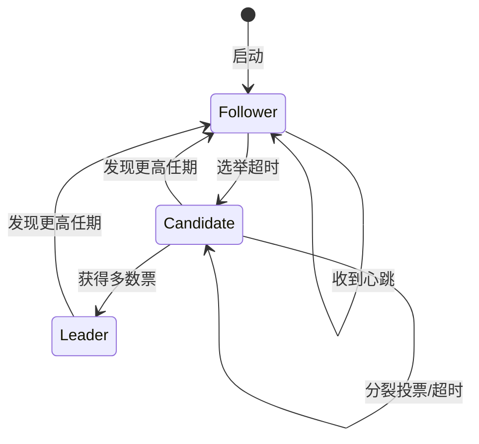

# Raft算法详解 专题文档

**文档版本**：v1.0
**创建时间**：2026年
**最后更新**：2026年
**状态**：✅ 已完成

---

## 📋 执行摘要

Raft（Reliable, Replicated, Redundant, And Fault-Tolerant）是一种为易于理解而设计的分布式共识算法。由Stanford大学的Diego Ongaro和John Ousterhout于2013年提出，Raft将共识问题分解为三个相对独立的子问题：领导者选举（Leader Election）、日志复制（Log Replication）和安全性（Safety）。相比Paxos，Raft更注重可理解性和工程可实现性，已成为当今最流行的共识算法之一。

---

## 一、核心概念

### 1.1 定义与原理

**Raft算法**是一种管理复制日志的共识算法，它通过选举一个领导者（Leader）来管理复制日志，简化了共识过程的管理和实现。

#### 核心设计原则

Raft的设计遵循以下原则：

1. **分离关注点**：将共识问题分解为领导者选举、日志复制和安全性三个子问题
2. **强领导者**：日志条目只从领导者流向其他服务器，简化了日志管理
3. **可理解性优先**：在性能和可理解性之间优先选择后者
4. **状态机复制**：通过复制日志来实现状态机复制

#### 角色定义

Raft集群中的每个节点处于以下三种状态之一：

| 状态 | 职责 | 转换条件 |
|------|------|----------|
| **Leader（领导者）** | 处理所有客户端请求，复制日志到Follower | 选举成功后转换 |
| **Follower（跟随者）** | 被动接收Leader和Candidate的消息 | 初始状态，超时后可能变为Candidate |
| **Candidate（候选人）** | 发起选举，请求投票 | Follower超时未收到心跳时转换 |

### 1.2 关键特性

- **强领导者模型**：简化日志复制流程，避免复杂的冲突解决
- **随机超时**：避免选举冲突，确保快速收敛
- **日志连续性**：保证日志条目顺序一致
- **成员变更支持**：支持集群配置的动态变更

### 1.3 适用场景

| 场景 | 适用性 | 说明 |
|------|--------|------|
| 分布式键值存储 | ⭐⭐⭐⭐⭐ | 如etcd、Consul |
| 服务发现与配置中心 | ⭐⭐⭐⭐⭐ | 强一致性配置管理 |
| 分布式锁服务 | ⭐⭐⭐⭐⭐ | 基于Raft的锁实现 |
| 分布式数据库 | ⭐⭐⭐⭐ | 如TiDB、CockroachDB |
| 消息队列元数据管理 | ⭐⭐⭐⭐ | 如Kafka的KRaft模式 |

---

## 二、领导者选举（Leader Election）

### 2.1 选举机制

#### 任期（Term）概念

Raft将时间划分为任意长度的**任期（Term）**：

- 每个Term以一次选举开始
- 如果Candidate赢得选举，则在该Term内担任Leader
- 如果没有选出Leader，Term号递增，开始新选举

```
Term编号随时间递增：
Term 1    Term 2    Term 3    Term 4
[Leader]  [选举]    [Leader]  [选举]
```

#### 选举触发条件

Follower在以下情况下触发选举：

1. 在**election timeout**时间内未收到Leader的心跳
2. 收到Leader的有效AppendEntries RPC
3. 收到Candidate的RequestVote RPC

#### 选举规则

```
// 投票规则
1. 每个服务器在一个Term内最多投一票（先到先得）
2. 候选人必须获得大多数选票才能成为Leader
3. 候选人的日志必须至少和投票者一样新

// 日志比较规则
日志较新的定义：
- 比较最后条目的Term，Term大的更新
- Term相同，则索引大的更新
```

### 2.2 选举算法伪代码

```python
# Follower行为
class Follower:
    def __init__(self):
        self.current_term = 0
        self.voted_for = None
        self.last_heartbeat = now()

    def on_timeout(self):
        # 选举超时，转换为Candidate
        if now() - self.last_heartbeat > ELECTION_TIMEOUT:
            become_candidate()

    def on_append_entries(self, term, leader_id):
        if term >= self.current_term:
            self.current_term = term
            self.voted_for = None
            self.last_heartbeat = now()
            reset_election_timer()

# Candidate行为
class Candidate:
    def __init__(self):
        self.current_term += 1
        self.voted_for = self.id
        self.votes_received = {self.id}

    def start_election(self):
        # 向所有服务器发送RequestVote RPC
        for server in cluster:
            send_request_vote(server, self.current_term,
                            self.last_log_index, self.last_log_term)

        # 重置选举超时
        reset_election_timer()

    def on_vote_response(self, voter_id, vote_granted):
        if vote_granted:
            self.votes_received.add(voter_id)
            if len(self.votes_received) > len(cluster) / 2:
                become_leader()
```

### 2.3 选举流程图



---

## 三、日志复制（Log Replication）

### 3.1 日志结构

每个Raft节点的日志由一系列日志条目组成：

```
日志条目结构：
┌─────────────────────────────────────────────────┐
│ Index │ Term  │ Command      │ Applied │
├─────────────────────────────────────────────────┤
│   1   │   1   │ set x=1      │  Yes    │
│   2   │   1   │ set y=2      │  Yes    │
│   3   │   2   │ set x=3      │  Yes    │
│   4   │   3   │ set z=4      │   No    │  ← commitIndex
│   5   │   3   │ set y=5      │   No    │
│   6   │   3   │ set x=6      │   No    │
└─────────────────────────────────────────────────┘
         ↑                           ↑
      lastApplied              commitIndex
```

### 3.2 日志复制流程

```mermaid
sequenceDiagram
    participant Client
    participant Leader
    participant F1 as Follower 1
    participant F2 as Follower 2
    participant F3 as Follower 3

    Client->>Leader: 请求: set x=10

    Note over Leader: 1. 追加到本地日志
    Leader->>Leader: log[index=7, term=3] = set x=10

    Note over Leader: 2. 并行发送给所有Follower
    Leader->>F1: AppendEntries(term=3, prevIndex=6, prevTerm=3, entries=[set x=10])
    Leader->>F2: AppendEntries(term=3, prevIndex=6, prevTerm=3, entries=[set x=10])
    Leader->>F3: AppendEntries(term=3, prevIndex=6, prevTerm=3, entries=[set x=10])

    Note over F1,F2,F3: 3. Follower验证并追加
    F1-->>Leader: success=true
    F2-->>Leader: success=true
    F3-->>Leader: success=false (日志不一致)

    Note over Leader: 4. Leader处理不一致
    Leader->>F3: AppendEntries(term=3, prevIndex=5, prevTerm=3, entries=[...])
    F3-->>Leader: success=true

    Note over Leader: 5. 大多数成功后提交
    Leader->>Leader: commitIndex = 7

    Leader-->>Client: 响应成功

    Note over Leader,F1,F2,F3: 6. 应用到状态机
    Leader->>F1: commitIndex=7 (心跳中携带)
    Leader->>F2: commitIndex=7
    Leader->>F3: commitIndex=7
```

### 3.3 日志一致性维护

#### 冲突解决机制

当Leader和Follower日志不一致时：

```
Leader日志: [1,1] [2,1] [3,2] [4,3] [5,3]
Follower日志: [1,1] [2,1] [3,2] [4,2] [5,2]
                          ↑
                       冲突点

解决过程：
1. Leader发送AppendEntries，prevIndex=5, prevTerm=3
2. Follower发现term不匹配，拒绝
3. Leader递减nextIndex[Follower]
4. 重复直到找到匹配点
5. Leader发送缺失的条目
```

#### 快速回退优化

为了减少回退次数，Follower可以返回更多信息：

```python
def append_entries_reply():
    if prev_log_term != log[prev_log_index].term:
        # 返回冲突Term的第一个索引
        conflict_term = log[prev_log_index].term
        first_index_of_term = find_first_index(conflict_term)
        return AppendEntriesReply(
            success=False,
            conflict_term=conflict_term,
            conflict_index=first_index_of_term
        )
```

### 3.4 日志压缩（Snapshot）

当日志过长时，需要创建快照：

```
快照结构：
┌─────────────────────────────────────────┐
│  last_included_index: 1000              │
│  last_included_term: 5                  │
│  state_machine_state: {x: 10, y: 20}    │
│  configuration: [S1, S2, S3, S4, S5]    │
└─────────────────────────────────────────┘

InstallSnapshot RPC:
- 由Leader发送给落后的Follower
- Follower丢弃快照之前的所有日志
- Follower根据快照恢复状态机
```

---

## 四、成员变更（Membership Change）

### 4.1 联合共识（Joint Consensus）

Raft支持配置变更的安全方法：

```
阶段1: 进入联合共识
旧配置: [S1, S2, S3]
新配置: [S2, S3, S4, S5]

联合配置 Cold,new:
- Leader选举需要旧配置多数 + 新配置多数
- 日志复制需要旧配置多数 + 新配置多数
- 新配置节点以非投票成员身份追日志

阶段2: 完全切换到新配置
- 当 Cold,new 提交后
- 切换到纯新配置 Cnew
- 旧配置中不在新配置中的节点可以下线
```

### 4.2 单节点变更（Simplified Approach）

更简单的单节点变更方法：

```
每次只添加或删除一个节点：
1. Leader将新配置作为日志条目复制
2. 新配置提交后生效
3. 可以安全地进行下一次变更

优势：
- 不需要联合共识阶段
- 实现更简单
- 不易出错
```

---

## 五、优缺点分析

### 5.1 优点

| 优点 | 详细说明 |
|------|----------|
| **可理解性强** | 论文包含完整的可理解性研究，证明比Paxos更易学习 |
| **工程友好** | 清晰的模块划分，便于实现和调试 |
| **强一致性** | 保证线性一致性，无脏读 |
| **故障恢复快** | Leader选举通常在几百毫秒内完成 |
| **活跃社区** | 大量开源实现和文档资源 |

### 5.2 缺点

| 缺点 | 详细说明 |
|------|----------|
| **写性能瓶颈** | 单Leader架构，所有写操作必须经过Leader |
| **读性能限制** | 强一致性读也需要经过Leader |
| **网络分区敏感** | 少数派分区完全不可用 |
| **日志膨胀** | 需要定期快照来压缩日志 |
| **选举抖动** | 网络不稳定时可能导致频繁选举 |

### 5.3 性能特征

| 指标 | 典型值 | 说明 |
|------|--------|------|
| Leader选举时间 | 100-500ms | 取决于网络延迟和随机超时 |
| 写延迟 | 1-2 RTT | Leader到大多数Follower的往返 |
| 读延迟 | 0-1 RTT | 本地读或Leader转发 |
| 吞吐量 | 10K-100K ops/s | 取决于网络带宽和磁盘I/O |

---

## 六、实际应用系统

### 6.1 etcd

CoreOS开发的分布式键值存储：

- Kubernetes的默认后端存储
- 使用Raft实现强一致性
- 支持Watch机制，实现配置推送

### 6.2 Consul

HashiCorp的服务发现和配置工具：

- 使用Raft维护集群状态
- 支持多数据中心部署
- 集成健康检查和服务网格

### 6.3 TiKV

PingCAP的分布式事务键值存储：

- TiDB的存储层
- 使用Multi-Raft架构
- 每个Region是一个Raft组

### 6.4 Apache Kafka（KRaft模式）

Kafka 3.0+的元数据管理模式：

- 替代ZooKeeper的自管理元数据
- 使用Raft管理Controller元数据
- 简化部署和运维

---

## 七、形式化安全证明简述

### 7.1 安全属性

Raft保证以下安全属性：

**选举安全（Election Safety）**：在一个Term内，最多只有一个Leader被选举出来。

**Leader追加性（Leader Append-Only）**：Leader从不覆盖或删除自己的日志条目，只追加新条目。

**日志匹配（Log Matching）**：如果两个日志条目有相同的索引和Term，则它们存储相同的命令，且之前的所有条目都相同。

**Leader完备性（Leader Completeness）**：如果一个日志条目在某个Term被提交，则该条目会出现在所有更高Term的Leader的日志中。

**状态机安全（State Machine Safety）**：如果服务器已将某个日志条目应用到状态机，则没有其他服务器会在相同索引处应用不同的命令。

### 7.2 选举安全证明

**定理**：在一个Term内，最多只有一个Leader被选举出来。

**证明**：

1. 候选人在选举前会递增自己的Term
2. 服务器在一个Term内只投一票
3. 候选人需要获得大多数选票才能成为Leader
4. 两个不同的候选人不可能同时获得大多数选票（鸽巢原理）
5. 因此，一个Term内最多只有一个Leader

### 7.3 Leader完备性证明

**定理**：如果一个日志条目在某个Term被提交，则该条目会出现在所有更高Term的Leader的日志中。

**证明概要**：

1. 假设条目e在Term T被提交
2. 这意味着e被复制到了大多数服务器
3. 任何Term T' > T的Leader必须获得大多数服务器的投票
4. 根据投票规则，只有日志至少和投票者一样新的候选人才能获得投票
5. 大多数服务器包含e，因此新Leader也必须包含e

---

## 八、实践指南

### 8.1 部署配置建议

```yaml
# Raft集群配置示例
cluster:
  nodes:
    - id: node1
      address: 192.168.1.1:2380
    - id: node2
      address: 192.168.1.2:2380
    - id: node3
      address: 192.168.1.3:2380

raft:
  heartbeat_interval: 100ms      # 心跳间隔
  election_timeout_min: 150ms    # 最小选举超时
  election_timeout_max: 300ms    # 最大选举超时（随机）
  snapshot_threshold: 10000      # 快照触发阈值
  max_entries_per_append: 500    # 每次最大日志条目数
```

### 8.2 最佳实践

1. **节点数量**：推荐3或5个节点，奇数节点避免脑裂
2. **网络分区**：确保大多数节点在同一网络分区
3. **磁盘I/O**：使用SSD提高日志写入性能
4. **监控指标**：关注Leader状态、commit延迟、选举频率

### 8.3 常见问题

**Q1: 如何处理脑裂情况？**
A: Raft通过Term机制和多数派原则天然避免脑裂，少数派分区不会提交新条目。

**Q2: Leader频繁切换怎么办？**
A: 检查网络稳定性，适当增加选举超时时间，优化磁盘I/O。

**Q3: 日志增长过快如何处理？**
A: 配置合理的快照策略，定期触发日志压缩。

---

## 九、与其他主题的关联

### 9.1 上游依赖

- [Paxos算法详解](./Paxos算法详解.md) - Raft的设计灵感来源
- [CAP定理](../../02-THEORY/distributed-systems/CAP定理专题文档.md) - 理解一致性与可用性的权衡

### 9.2 下游应用

- [etcd详解](../../工具与框架/etcd详解.md) - 基于Raft的键值存储
- [ZooKeeper深度分析](../../工具与框架/ZooKeeper深度分析.md) - 对比ZAB协议

### 9.3 相关概念

| 概念 | 关系 | 说明 |
|------|------|------|
| Multi-Paxos | 对比 | 功能等价但Raft更易理解 |
| ZAB | 对比 | ZooKeeper使用的类似协议 |
| PBFT | 扩展 | 支持拜占庭容错的共识算法 |

---

## 十、参考资源

### 10.1 学术论文

1. [In Search of an Understandable Consensus Algorithm](https://raft.github.io/raft.pdf) - Ongaro & Ousterhout, 2014
2. [Consensus: Bridging Theory and Practice](https://web.stanford.edu/~ouster/cgi-bin/papers/OngaroPhD.pdf) - Diego Ongaro, PhD Thesis, 2014

### 10.2 开源项目

1. [etcd](https://etcd.io/) - 分布式键值存储
2. [Consul](https://www.consul.io/) - 服务发现工具
3. [TiKV](https://tikv.org/) - 分布式事务键值存储

### 10.3 学习资料

1. [Raft可视化演示](https://raft.github.io/) - 交互式Raft算法演示
2. [Raft共识算法](https://thesecretlivesofdata.com/raft/) - 动画解释

---

**维护者**：项目团队
**最后更新**：2026年
