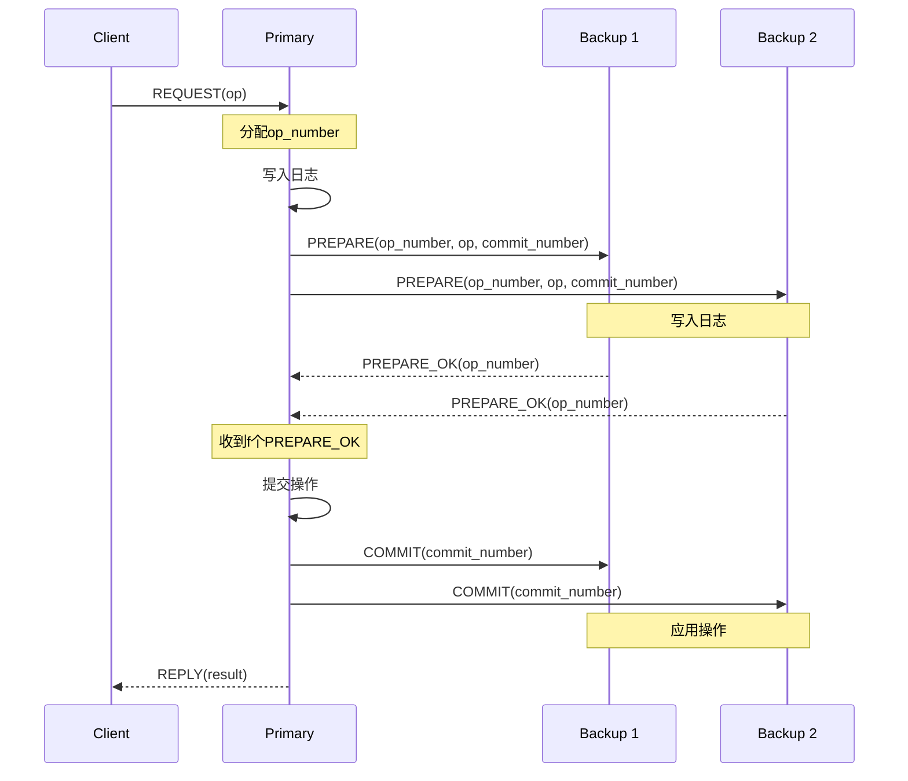
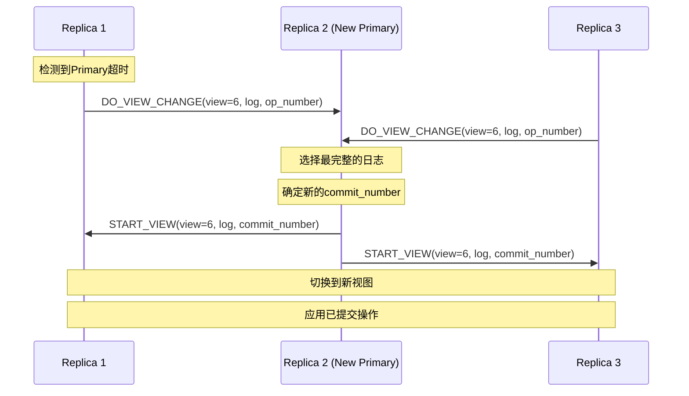

# Viewstamped Replication 专题文档

**文档版本**：v1.0
**创建时间**：2026年
**最后更新**：2026年
**状态**：✅ 已完成

---

## 📋 执行摘要

Viewstamped Replication（VR）是由Barbara Liskov和James Cowling于1988年提出的分布式复制协议，2012年发表了更新版本VR Revisited。VR与Paxos和Raft一样，解决分布式系统中的状态机复制问题，但在设计上采用了不同的方法。VR将协议分为正常操作和视图变更（View Change）两个主要部分，提供了清晰的状态机复制框架，对后来的共识算法设计产生了深远影响。

---

## 一、核心概念

### 1.1 定义与原理

**Viewstamped Replication**是一种主备复制协议，通过视图（View）的概念来管理副本组的配置和领导者（Primary）的变更。

#### 基本思想

VR的核心思想包括：

1. **视图（View）**：副本组的配置和当前Primary的标识
2. **视图编号（View Number）**：单调递增的整数，标识当前视图
3. **主备架构**：一个Primary和多个Backup组成副本组
4. **状态机复制**：所有副本以相同顺序执行相同操作

#### 副本角色

| 角色 | 职责 | 数量 |
|------|------|------|
| **Primary** | 接收客户端请求，排序并复制到Backups | 1个 |
| **Backup** | 接收Primary的复制请求，执行操作 | 2f个（容忍f故障） |
| **Witness** | 只参与视图变更，不存储数据（可选优化） | 可变 |

### 1.2 关键特性

- **视图管理**：通过View Number管理配置变更和故障恢复
- **操作日志**：所有操作按顺序记录在日志中
- **检查点**：定期创建快照以压缩日志
- **客户端表**：追踪客户端请求的完成情况

### 1.3 适用场景

| 场景 | 适用性 | 说明 |
|------|--------|------|
| 分布式存储系统 | ⭐⭐⭐⭐⭐ | VR的主要设计目标 |
| 高可用数据库 | ⭐⭐⭐⭐⭐ | 如MongoDB的复制协议参考 |
| 配置管理服务 | ⭐⭐⭐⭐ | 强一致性配置存储 |
| 分布式事务 | ⭐⭐⭐⭐ | 事务协调和日志复制 |
| 读密集型应用 | ⭐⭐⭐ | 需要优化读路径 |

---

## 二、协议架构

### 2.1 系统架构

```
┌─────────────────────────────────────────────────────────────┐
│                    VR Replica Group                          │
├─────────────────────────────────────────────────────────────┤
│                                                              │
│  ┌─────────┐    ┌─────────┐    ┌─────────┐    ┌─────────┐  │
│  │ Primary │    │ Backup1 │    │ Backup2 │    │ Backup3 │  │
│  │  (View  │    │ (View   │    │ (View   │    │ (View   │  │
│  │   = 5)  │    │   = 5)  │    │   = 5)  │    │   = 5)  │  │
│  └────┬────┘    └────┬────┘    └────┬────┘    └────┬────┘  │
│       │              │              │              │       │
│       └──────────────┴──────────────┴──────────────┘       │
│                      复制网络                                │
│                                                              │
└─────────────────────────────────────────────────────────────┘
```

### 2.2 核心数据结构

```python
class VRReplica:
    def __init__(self):
        # 视图状态
        self.view_number = 0           # 当前视图编号
        self.status = Status.NORMAL    # 状态: NORMAL, VIEW_CHANGE, RECOVERING
        self.replica_id = 0            # 副本ID

        # 日志状态
        self.log = []                  # 操作日志
        self.op_number = 0             # 最后分配的操作编号
        self.commit_number = 0         # 已提交的操作编号

        # 客户端状态
        self.client_table = {}         # 客户端请求表

        # 配置
        self.configuration = []        # 副本组配置

class LogEntry:
    def __init__(self, op_number, view_number, request):
        self.op_number = op_number     # 操作编号（单调递增）
        self.view_number = view_number # 分配时的视图编号
        self.request = request         # 客户端请求
        self.state = State.PREPARED    # 状态: PREPARED, COMMITTED
```

### 2.3 客户端表（Client Table）

客户端表用于保证请求的 exactly-once 语义：

```python
class ClientTableEntry:
    def __init__(self):
        self.client_id = None          # 客户端标识
        self.request_number = 0        # 请求编号（单调递增）
        self.response = None           # 已完成的响应
        self.completed = False         # 是否已完成

def handle_client_request(request):
    entry = client_table.get(request.client_id)

    if entry is None:
        # 新客户端
        client_table[request.client_id] = ClientTableEntry()
        return process_request(request)

    if request.request_number < entry.request_number:
        # 重复的旧请求，可能已经处理过
        if request.request_number == entry.request_number - 1:
            return entry.response  # 返回缓存的响应
        else:
            return Error("Invalid request number")

    if request.request_number == entry.request_number:
        # 重复请求
        if entry.completed:
            return entry.response
        # 仍在处理中，忽略或重试
        return Wait()

    # 新请求
    return process_request(request)
```

---

## 三、正常操作流程

### 3.1 写操作流程

VR使用主备复制协议处理写请求：

```
Phase 1: Request
客户端发送请求到Primary

Phase 2: Prepare
Primary分配操作编号，发送PREPARE消息给Backups

Phase 3: PrepareOK
Backups写入日志，回复PREPARE_OK给Primary

Phase 4: Commit
Primary收到f个PREPARE_OK后，提交操作并发送COMMIT给Backups

Phase 5: Reply
Primary回复客户端，Backups在收到COMMIT后应用操作
```

### 3.2 算法伪代码

```python
# Primary端处理
class Primary:
    def handle_request(self, request):
        """处理客户端请求"""
        # 1. 分配操作编号
        self.op_number += 1

        # 2. 创建日志条目
        entry = LogEntry(
            op_number=self.op_number,
            view_number=self.view_number,
            request=request
        )
        self.log.append(entry)

        # 3. 发送PREPARE给所有Backups
        prepare_msg = PREPARE(
            view_number=self.view_number,
            op_number=self.op_number,
            request=request,
            commit_number=self.commit_number
        )

        self.prepare_ok_count = 1  # 包含自己
        send_to_all_backups(prepare_msg)

        # 4. 等待f个PREPARE_OK（异步处理）

    def handle_prepare_ok(self, msg):
        """处理PREPARE_OK响应"""
        if msg.view_number != self.view_number:
            return

        self.prepare_ok_count += 1

        # 收到f个确认（加上自己共f+1）
        if self.prepare_ok_count == len(self.configuration) // 2 + 1:
            # 5. 提交操作
            self.commit_up_to(msg.op_number)

            # 6. 发送COMMIT给Backups
            commit_msg = COMMIT(
                view_number=self.view_number,
                commit_number=self.commit_number
            )
            send_to_all_backups(commit_msg)

            # 7. 回复客户端
            response = self.execute_operation(msg.request)
            send_to_client(msg.request.client_id, response)

# Backup端处理
class Backup:
    def handle_prepare(self, msg):
        """处理PREPARE消息"""
        if msg.view_number != self.view_number:
            return

        # 1. 检查日志连续性
        if msg.op_number > len(self.log) + 1:
            # 需要获取缺失的日志条目
            self.request_log_recovery(msg.op_number)
            return

        # 2. 写入日志
        entry = LogEntry(
            op_number=msg.op_number,
            view_number=msg.view_number,
            request=msg.request
        )

        if msg.op_number <= len(self.log):
            self.log[msg.op_number - 1] = entry
        else:
            self.log.append(entry)

        # 3. 更新commit number
        self.commit_number = min(msg.commit_number, msg.op_number)

        # 4. 发送PREPARE_OK
        prepare_ok = PREPARE_OK(
            view_number=self.view_number,
            op_number=msg.op_number,
            replica_id=self.replica_id
        )
        send_to_primary(prepare_ok)

    def handle_commit(self, msg):
        """处理COMMIT消息"""
        if msg.view_number != self.view_number:
            return

        # 提交到指定的操作编号
        while self.commit_number < msg.commit_number:
            self.commit_number += 1
            entry = self.log[self.commit_number - 1]
            self.execute_operation(entry.request)
```

### 3.3 流程图



---

## 四、视图变更（View Change）

### 4.1 触发条件

视图变更在以下情况下触发：

1. **Primary故障**：Backup检测到Primary超时
2. **网络分区**：副本之间通信中断
3. **配置变更**：添加或移除副本
4. **手动触发**：运维需要切换Primary

### 4.2 视图变更流程

```
Phase 1: View Change Start
检测到Primary故障的副本启动视图变更

Phase 2: DO_VIEW_CHANGE
副本向新Primary发送视图变更消息，包含当前日志状态

Phase 3: Log Recovery
新Primary收集日志，确定新的操作序列

Phase 4: START_VIEW
新Primary宣布新视图开始，所有副本切换到新视图

Phase 5: Recovery Complete
副本应用未提交的操作，恢复正常服务
```

### 4.3 视图变更算法

```python
class ViewChange:
    def start_view_change(self, new_view_number):
        """启动视图变更"""
        self.status = Status.VIEW_CHANGE
        self.view_number = new_view_number

        # 发送DO_VIEW_CHANGE给新Primary
        do_view_change = DO_VIEW_CHANGE(
            view_number=new_view_number,
            log=self.log,
            last_normal_view=self.last_normal_view,
            op_number=self.op_number,
            commit_number=self.commit_number,
            replica_id=self.replica_id
        )

        new_primary = self.get_primary(new_view_number)
        send_to_replica(new_primary, do_view_change)

    def handle_do_view_change(self, msgs):
        """新Primary处理视图变更消息"""
        # 选择日志最完整的副本
        selected_log = None
        selected_view = 0

        for msg in msgs:
            if len(msg.log) > len(selected_log or []):
                selected_log = msg.log
                selected_view = msg.last_normal_view
            elif len(msg.log) == len(selected_log or []):
                if msg.last_normal_view > selected_view:
                    selected_log = msg.log
                    selected_view = msg.last_normal_view

        # 安装选中的日志
        self.log = selected_log
        self.op_number = len(self.log)

        # 确定commit number（多数派已知的最大提交点）
        commit_numbers = [msg.commit_number for msg in msgs]
        self.commit_number = sorted(commit_numbers)[len(msgs) // 2]

        # 宣布新视图
        self.start_view()

    def start_view(self):
        """新Primary宣布视图开始"""
        self.status = Status.NORMAL

        start_view = START_VIEW(
            view_number=self.view_number,
            log=self.log,
            op_number=self.op_number,
            commit_number=self.commit_number
        )

        send_to_all_replicas(start_view)

        # 应用未提交的操作
        self.apply_committed_operations()

class Replica:
    def handle_start_view(self, msg):
        """处理START_VIEW消息"""
        if msg.view_number < self.view_number:
            return

        self.view_number = msg.view_number
        self.log = msg.log
        self.op_number = msg.op_number
        self.commit_number = msg.commit_number
        self.status = Status.NORMAL

        # 应用已提交的操作
        self.apply_committed_operations()
```

### 4.4 视图变更流程图



---

## 五、日志恢复与检查点

### 5.1 日志恢复

当副本落后或检测到不一致时，需要进行日志恢复：

```python
class LogRecovery:
    def request_log_recovery(self, missing_op_number):
        """请求缺失的日志条目"""
        recovery_request = RECOVERY_REQUEST(
            replica_id=self.replica_id,
            missing_op_number=missing_op_number
        )

        # 发送给Primary或其他副本
        send_to_primary(recovery_request)

    def handle_recovery_request(self, request):
        """处理日志恢复请求"""
        if request.missing_op_number <= len(self.log):
            # 发送缺失的日志条目
            missing_entries = self.log[request.missing_op_number - 1:]

            recovery_response = RECOVERY_RESPONSE(
                entries=missing_entries,
                commit_number=self.commit_number
            )
            send_to_replica(request.replica_id, recovery_response)
```

### 5.2 检查点机制

定期创建检查点以压缩日志：

```python
class Checkpoint:
    def __init__(self):
        self.checkpoint_number = 0      # 检查点操作编号
        self.state = None               # 状态机快照
        self.client_table = {}          # 客户端表快照

    def create_checkpoint(self):
        """创建检查点"""
        checkpoint = Checkpoint()
        checkpoint.checkpoint_number = self.commit_number
        checkpoint.state = self.state_machine.snapshot()
        checkpoint.client_table = copy.deepcopy(self.client_table)

        # 保存检查点
        self.save_checkpoint(checkpoint)

        # 截断日志
        self.log = self.log[self.commit_number:]

        return checkpoint

    def restore_from_checkpoint(self, checkpoint):
        """从检查点恢复"""
        self.commit_number = checkpoint.checkpoint_number
        self.state_machine.restore(checkpoint.state)
        self.client_table = checkpoint.client_table
```

---

## 六、优缺点分析

### 6.1 优点

| 优点 | 详细说明 |
|------|----------|
| **状态机复制清晰** | 明确定义了复制状态机的接口和语义 |
| **Exactly-Once语义** | 客户端表保证请求不会重复执行 |
| **视图管理完善** | 视图变更过程完整，易于理解和实现 |
| **客户端响应快** | 客户端只需等待Primary响应即可返回 |
| **理论影响深远** | 为后续共识算法提供了重要参考 |

### 6.2 缺点

| 缺点 | 详细说明 |
|------|----------|
| **写延迟较高** | 需要等待f+1个副本确认才能提交 |
| **视图变更复杂** | 需要收集和处理大量状态信息 |
| **内存开销大** | 需要维护客户端表和完整的操作日志 |
| **恢复时间长** | 落后副本需要传输大量日志 |
| **读扩展性差** | 读操作也需要经过Primary |

### 6.3 与Raft/Paxos对比

| 维度 | VR | Raft | Multi-Paxos |
|------|-----|------|-------------|
| 日志复制 | 2 RTT | 1 RTT（优化后） | 1-2 RTT |
| 视图变更 | 完整日志交换 | 简化机制 | 联合共识 |
| 客户端语义 | Exactly-Once | At-Most-Once | At-Most-Once |
| 实现复杂度 | 中等 | 较低 | 较高 |
| 工业应用 | 较少 | 广泛 | 较多 |

---

## 七、实际应用系统

### 7.1 MongoDB复制协议

MongoDB的复制协议参考了VR设计：

- 使用Primary-Secondary架构
- 基于oplog的日志复制
- 支持自动故障转移

### 7.2 Tendermint（早期版本）

区块链共识引擎的早期设计：

- 参考VR的视图变更机制
- 结合BFT容错特性

### 7.3 学术研究系统

VR主要用于学术研究：

- MIT的分布式系统课程
- 共识算法的基准实现
- 性能比较研究

---

## 八、形式化安全证明简述

### 8.1 安全属性

VR保证以下安全属性：

**线性一致性（Linearizability）**：所有操作看起来像是在其调用和返回之间的某个时刻原子执行的。

**持久性（Durability）**：已提交的操作不会丢失，即使发生故障。

**Exactly-Once执行**：每个客户端请求最多执行一次，结果被正确返回。

### 8.2 证明概要

**线性一致性证明**：

1. **操作排序**：Primary按接收顺序分配op_number
2. **多数派复制**：操作被复制到f+1个副本后才提交
3. **视图变更安全**：新Primary继承最完整的日志
4. **操作连续性**：新视图不会丢失已提交的操作

因此，所有副本以相同顺序执行相同操作，保证线性一致性。

### 8.3 复杂度分析

| 复杂度类型 | 值 | 说明 |
|-----------|-----|------|
| **正常操作消息复杂度** | O(n) | 2n条消息 |
| **视图变更消息复杂度** | O(n²) | 需要交换日志 |
| **正常操作延迟** | 2 RTT | PREPARE + COMMIT |
| **视图变更延迟** | 3-4 RTT | 收集和同步日志 |

---

## 九、实践指南

### 9.1 实现要点

1. **客户端ID管理**：确保客户端ID全局唯一
2. **请求编号**：单调递增，不重复使用
3. **日志持久化**：使用WAL保证崩溃恢复
4. **网络超时**：合理设置超时参数
5. **检查点策略**：平衡恢复时间和存储开销

### 9.2 配置建议

```yaml
# VR配置示例
vr:
  replication_factor: 3          # 副本数量
  f: 1                           # 可容忍故障数

  # 超时配置
  primary_timeout: 5000ms        # Primary超时检测
  view_change_timeout: 10000ms   # 视图变更超时
  recovery_timeout: 5000ms       # 日志恢复超时

  # 检查点配置
  checkpoint_interval: 1000      # 每1000个操作创建检查点
  max_log_size: 10000            # 最大日志条目数
```

### 9.3 常见问题

**Q1: 如何处理客户端请求重复？**
A: 使用客户端表缓存最近完成的请求和响应，重复请求直接返回缓存结果。

**Q2: 视图变更期间如何处理新请求？**
A: 视图变更期间暂停接受新请求，或返回临时不可用错误，客户端需要重试。

**Q3: 落后副本如何快速追赶？**
A: 使用检查点+增量日志的方式，先传输检查点再传输后续日志。

---

## 十、与其他主题的关联

### 10.1 上游依赖

- [Paxos算法详解](./Paxos算法详解.md) - VR的理论基础
- [Raft算法详解](./Raft算法详解.md) - 功能等价的对比算法

### 10.2 下游应用

- [MongoDB架构](../../05-storage/nosql/MongoDB架构.md) - 参考VR设计的复制协议

### 10.3 相关概念

| 概念 | 关系 | 说明 |
|------|------|------|
| Primary-Backup | 实现 | VR采用的主备复制模式 |
| State Machine Replication | 理论基础 | VR的具体实现 |
| 2PC | 对比 | 分布式事务的两阶段提交 |

---

## 十一、参考资源

### 11.1 学术论文

1. [Viewstamped Replication: A New Primary Copy Method to Support Highly-Available Distributed Systems](https://dl.acm.org/doi/10.1145/62546.62549) - Oki & Liskov, 1988
2. [Viewstamped Replication Revisited](https://pmg.csail.mit.edu/papers/vr-revisited.pdf) - Liskov & Cowling, 2012

### 11.2 学习资料

1. [MIT 6.824课程](https://pdos.csail.mit.edu/6.824/) - 分布式系统课程
2. [VR算法解释](http://blog.kshirish.com/2015/04/viewstamped-replication.html) - 技术博客

---

**维护者**：项目团队
**最后更新**：2026年
