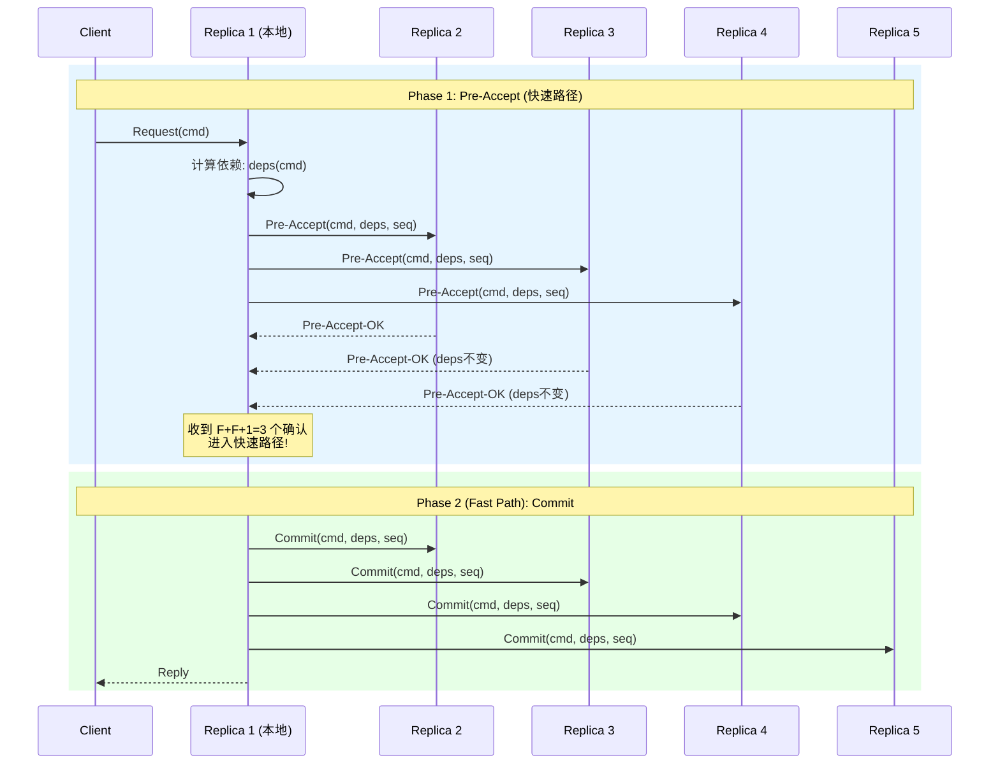
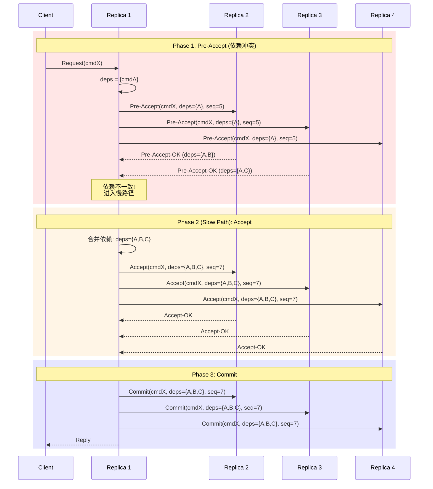
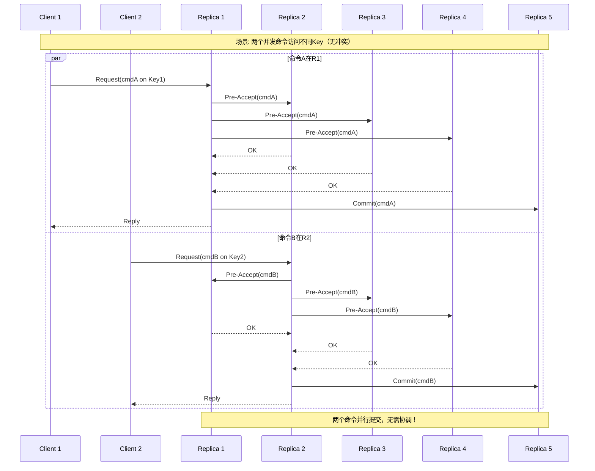

# EPaxos (Speculative Paxos) 详解

> Stanford CS244B: Distributed Systems 课程对齐

## 1. 引言

EPaxos（Egalitarian Paxos）由耶鲁大学于2013年提出，是一种**无Leader的Paxos变体**。它通过推测执行（Speculative Execution）和依赖追踪，实现了真正的多主复制，显著提高了跨数据中心场景的吞吐量。

### 1.1 设计动机

传统Multi-Paxos/Raft的局限性：

- **Leader瓶颈**：所有写入必须经过Leader
- **跨数据中心延迟**：远离Leader的节点遭受高延迟
- **Leader切换开销**：故障时需要选举新Leader

EPaxos的核心理念：**任何副本都可以直接提交命令，通过依赖追踪解决冲突**。

## 2. EPaxos核心机制

### 2.1 架构对比

```
┌─────────────────────────────────────────────────────────────────┐
│                    架构对比                                      │
├─────────────────────────────────────────────────────────────────┤
│                                                                 │
│  Multi-Paxos/Raft:                                              │
│  ┌──────────┐                                                   │
│  │  Leader  │◄─────────────────── 所有客户端请求                 │
│  └────┬─────┘                                                   │
│       │ 复制日志                                                 │
│  ┌────┴─────┬─────────┬─────────┐                              │
│  │ Follower │Follower │Follower │                              │
│  └──────────┴─────────┴─────────┘                              │
│                                                                 │
│  EPaxos (无Leader):                                             │
│  ┌──────────┬──────────┬──────────┐                            │
│  │ Replica 1│ Replica 2│ Replica 3│                            │
│  │  ▲ ▲    │  ▲ ▲    │  ▲ ▲    │                            │
│  └──┼─┼────┴──┼─┼────┴──┼─┼────┘                            │
│     │ │      │ │      │ │                                      │
│  ┌──┴─┴──┐ ┌─┴─┴──┐ ┌─┴─┴──┐                                  │
│  │Client A│ │Client B│ │Client C│                              │
│  └────────┘ └────────┘ └────────┘                              │
│                                                                 │
└─────────────────────────────────────────────────────────────────┘
```

### 2.2 三阶段协议



### 2.3 慢路径（依赖冲突时）



## 3. 依赖追踪机制

### 3.1 依赖图构建

```
┌────────────────────────────────────────────────────────────────┐
│                    依赖图示例                                   │
├────────────────────────────────────────────────────────────────┤
│                                                                │
│     ┌──────┐      ┌──────┐      ┌──────┐                      │
│     │ CmdA │─────►│ CmdB │─────►│ CmdC │                      │
│     └──────┘      └──────┘      └──────┘                      │
│        │             ▲                                      │
│        │             │                                      │
│        └──────┐      │                                      │
│               ▼      │                                      │
│             ┌──────┐ │                                      │
│             │ CmdD │─┘                                      │
│             └──────┘                                        │
│                                                                │
│  CmdC 依赖: {B}                                                │
│  CmdB 依赖: {A}                                                │
│  CmdD 依赖: {A}                                                │
│                                                                │
│  执行顺序: A → (B, D 并行) → C                                 │
│                                                                │
└────────────────────────────────────────────────────────────────┘
```

### 3.2 依赖检测算法

```go
// DependencyTracker 依赖追踪器
type DependencyTracker struct {
    // 每个Key的修改历史
    keyVersions map[string][]InstanceID

    // 所有实例的依赖关系
    dependencies map[InstanceID]map[InstanceID]bool

    // 已提交的实例
    committed map[InstanceID]bool
}

// ComputeDependencies 计算命令的依赖
func (dt *DependencyTracker) ComputeDependencies(cmd Command) map[InstanceID]bool {
    deps := make(map[InstanceID]bool)

    for _, key := range cmd.ReadSet {
        // 依赖所有未提交的、修改该Key的写操作
        for _, instID := range dt.keyVersions[key] {
            if !dt.committed[instID] {
                deps[instID] = true
            }
        }
    }

    for _, key := range cmd.WriteSet {
        // 依赖所有访问该Key的未提交操作
        for _, instID := range dt.keyVersions[key] {
            if !dt.committed[instID] {
                deps[instID] = true
            }
        }
    }

    return deps
}

// UpdateDependencies 更新依赖追踪状态
func (dt *DependencyTracker) UpdateDependencies(instID InstanceID, cmd Command) {
    // 记录写操作
    for _, key := range cmd.WriteSet {
        dt.keyVersions[key] = append(dt.keyVersions[key], instID)
    }
}
```

## 4. Go伪代码实现

### 4.1 核心数据结构

```go
// EPaxos Replica实现
type Replica struct {
    id       int
    peers    []string

    // 实例存储 (按 replica_id -> instance_id 索引)
    instances map[int]map[int]*Instance

    // 依赖追踪
    depTracker *DependencyTracker

    // 执行引擎
    executor *Executor

    // 配置
    F int  // 容错数
    Q int  // Quorum大小 = F+1
    FQ int // Fast Quorum大小 = F + F/2 + 1
}

type Instance struct {
    ID       InstanceID
    Command  Command
    State    InstanceState

    // EPaxos特有
    Dependencies map[InstanceID]bool
    Sequence     int  // 用于打破循环依赖

    // 投票计数
    preAcceptReplies map[int]*PreAcceptReply
    acceptReplies    map[int]bool
}

type InstanceID struct {
    ReplicaID int
    SeqNum    int
}

type Command struct {
    Key      string
    Op       Operation
    ReadSet  []string
    WriteSet []string
    Data     []byte
}
```

### 4.2 三阶段协议实现

```go
// Propose 客户端调用提议命令
func (r *Replica) Propose(cmd Command) (*Instance, error) {
    // 分配新的实例ID
    inst := &Instance{
        ID:       InstanceID{ReplicaID: r.id, SeqNum: r.nextSeqNum()},
        Command:  cmd,
        State:    PreAccepting,
        Sequence: r.generateSequence(),
    }

    // 计算初始依赖
    inst.Dependencies = r.depTracker.ComputeDependencies(cmd)

    // Phase 1: Pre-Accept
    return r.phase1PreAccept(inst)
}

// phase1PreAccept 第一阶段：Pre-Accept
func (r *Replica) phase1PreAccept(inst *Instance) (*Instance, error) {
    req := &PreAcceptRequest{
        InstanceID:   inst.ID,
        Command:      inst.Command,
        Dependencies: inst.Dependencies,
        Sequence:     inst.Sequence,
    }

    // 发送给Fast Quorum
    replies := make([]*PreAcceptReply, 0)
    for i := 0; i < r.FQ; i++ {
        reply, err := r.sendPreAccept(r.peers[i], req)
        if err != nil {
            continue
        }
        replies = append(replies, reply)
    }

    // 检查是否达成Fast Quorum
    if len(replies) < r.FQ {
        return nil, errors.New("fast quorum not reached")
    }

    // 检查依赖是否一致
    allDepsEqual := true
    mergedDeps := make(map[InstanceID]bool)

    for _, reply := range replies {
        if !depsEqual(inst.Dependencies, reply.Dependencies) {
            allDepsEqual = false
        }
        // 合并所有依赖
        for dep := range reply.Dependencies {
            mergedDeps[dep] = true
        }
    }

    if allDepsEqual {
        // 快速路径！
        inst.State = Committed
        r.broadcastCommit(inst)
        return inst, nil
    }

    // 慢路径：依赖不一致
    inst.Dependencies = mergedDeps
    inst.Sequence = r.updateSequence(replies)
    return r.phase2Accept(inst)
}

// phase2Accept 第二阶段：Accept（慢路径）
func (r *Replica) phase2Accept(inst *Instance) (*Instance, error) {
    inst.State = Accepting

    req := &AcceptRequest{
        InstanceID:   inst.ID,
        Command:      inst.Command,
        Dependencies: inst.Dependencies,
        Sequence:     inst.Sequence,
    }

    // 发送给Classic Quorum (F+1)
    accepts := 0
    for _, peer := range r.peers {
        reply, err := r.sendAccept(peer, req)
        if err == nil && reply.Accepted {
            accepts++
        }
    }

    if accepts < r.Q {
        return nil, errors.New("classic quorum not reached")
    }

    // Phase 3: Commit
    inst.State = Committed
    r.broadcastCommit(inst)
    return inst, nil
}
```

### 4.3 执行引擎

```go
// Executor 执行引擎
type Executor struct {
    replica *Replica

    // 等待执行的实例
    pending map[InstanceID]*Instance

    // 已执行的实例
    executed map[InstanceID]bool

    // 状态机
    stateMachine StateMachine
}

// Execute 执行已提交的命令
func (e *Executor) Execute() {
    for {
        // 查找可执行的实例
        ready := e.findReadyInstances()

        for _, inst := range ready {
            // 检查所有依赖是否已执行
            if e.dependenciesSatisfied(inst) {
                // 执行命令
                result := e.stateMachine.Apply(inst.Command)

                e.executed[inst.ID] = true
                delete(e.pending, inst.ID)

                // 回复客户端
                if inst.ID.ReplicaID == e.replica.id {
                    e.replyToClient(inst, result)
                }
            }
        }
    }
}

// findReadyInstances 查找可以执行的实例
func (e *Executor) findReadyInstances() []*Instance {
    ready := make([]*Instance, 0)

    for _, inst := range e.pending {
        if inst.State == Committed {
            ready = append(ready, inst)
        }
    }

    // 按Sequence排序（打破循环依赖）
    sort.Slice(ready, func(i, j int) bool {
        return ready[i].Sequence < ready[j].Sequence
    })

    return ready
}

// dependenciesSatisfied 检查依赖是否满足
func (e *Executor) dependenciesSatisfied(inst *Instance) bool {
    for dep := range inst.Dependencies {
        if !e.executed[dep] {
            return false
        }
    }
    return true
}
```

## 5. 时序图：完整流程



## 6. 安全性分析

### 6.1 一致性保证

**定理**：EPaxos保证线性一致性（Linearizability）。

**证明要点**：

1. **提交顺序确定**：任何两个冲突命令（访问相同Key）至少有一个共同的Acceptor会同时看到它们
2. **依赖图无环**：Sequence编号保证依赖图是无环的
3. **执行顺序一致**：所有副本按照相同的拓扑顺序执行命令

### 6.2 活性保证

**定理**：如果少于 $F$ 个副本故障，且网络最终同步，所有命令最终会被执行。

**条件**：

- 每个副本持续尝试提交其命令
- 依赖检测最终收敛
- 执行引擎持续处理

## 7. 性能分析

### 7.1 延迟对比（跨3数据中心）

| 协议 | 本地提交 | 远程提交 | Leader故障 |
|------|----------|----------|------------|
| Multi-Paxos | 100ms | 100ms | >1s |
| Raft | 100ms | 100ms | >1s |
| EPaxos | 20ms | 60ms | 无影响 |

### 7.2 吞吐量对比

```
吞吐量 (ops/sec)
    ▲
    │                    ╭──── EPaxos
100k├──────────────────╱
    │                 ╱
 50k├────────╮       ╱
    │        │──────╱────────── Multi-Paxos
    │        │
    └────────┴──────────────────► 副本数
            3    5    7    9
```

## 8. 实际系统

- **TAPIR**: 事务处理接口，基于EPaxos思想
- **CockroachDB**: 使用类似的多租约架构
- **TiDB**: 跨地域部署优化

## 9. 总结

EPaxos通过无Leader设计和依赖追踪，实现了真正的多主复制。虽然在实现复杂度上高于Raft/Multi-Paxos，但在跨数据中心部署和高并发场景下具有显著优势。其推测执行思想对现代分布式数据库设计产生了深远影响。

---

**参考**：

- Moraru et al., "There is More Consensus in Egalitarian Parliaments" (SOSP 2013)
- EPaxos开源实现: <https://github.com/efficient/epaxos>
- Stanford CS244B Lecture Notes
