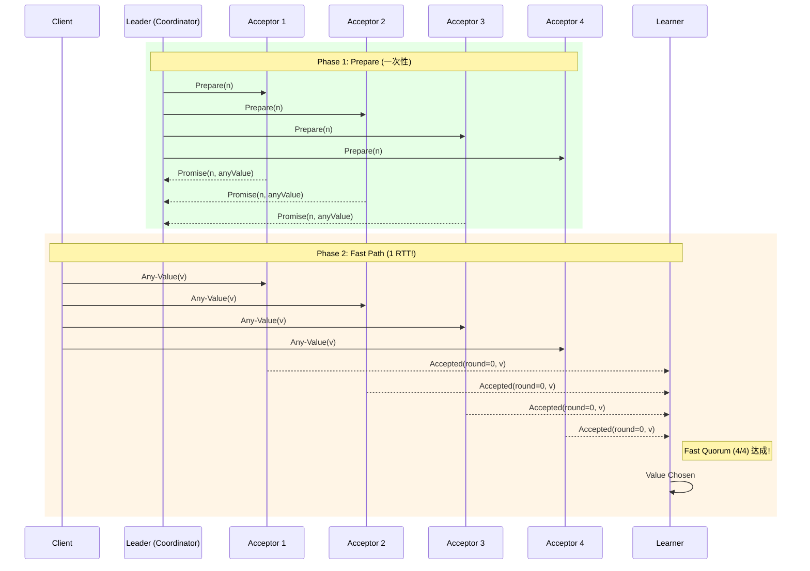
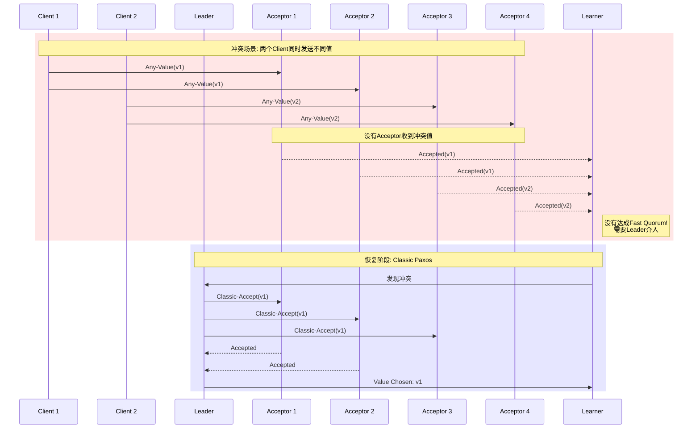

# Fast Paxos算法

> Stanford CS244B: Distributed Systems 课程对齐

## 1. 引言

Fast Paxos由Leslie Lamport于2006年提出，是对Classic Paxos的重要优化。其核心目标是**降低共识算法的延迟**，在特定条件下将2 RTT降低到1 RTT。

### 1.1 核心洞察

Classic Paxos的延迟瓶颈：

- Client → Leader → Acceptors → Leader → Client = 2 RTT

Fast Paxos的优化思路：

- **允许Client直接向Acceptors发送提案**，跳过Leader转发
- 引入**Fast Quorum**概念，处理并发冲突

## 2. Fast Quorum机制

### 2.1 Classic Quorum vs Fast Quorum

```
┌────────────────────────────────────────────────────────────────┐
│                    Quorum对比分析                               │
├────────────────────────────────────────────────────────────────┤
│                                                                │
│  Classic Quorum (多数派):                                      │
│  ┌──────────────────────────────────────────────────────┐     │
│  │  n=5 时, |Q| ≥ 3                                      │     │
│  │  Q1 ∩ Q2 ≠ ∅                                          │     │
│  │  任意两个Quorum必有交集                                │     │
│  └──────────────────────────────────────────────────────┘     │
│                                                                │
│  Fast Quorum (快速Quorum):                                     │
│  ┌──────────────────────────────────────────────────────┐     │
│  │  n=5 时, |Q| ≥ ⌈3n/4⌉ = 4                             │     │
│  │  Q1 ∩ Q2 ∩ Q3 ≠ ∅                                      │     │
│  │  任意三个Quorum必有交集                                │     │
│  └──────────────────────────────────────────────────────┘     │
│                                                                │
└────────────────────────────────────────────────────────────────┘
```

### 2.2 数学定义

设系统有 $n$ 个Acceptor，容错能力为 $f$：

**Classic Quorum**：
$$|Q_c| = \left\lfloor \frac{n}{2} \right\rfloor + 1$$

**Fast Quorum**：
$$|Q_f| = \left\lceil \frac{n + \left\lfloor \frac{n}{2} \right\rfloor + 1}{2} \right\rceil = \left\lceil \frac{3n}{4} \right\rceil$$

**Quorum交集性质**：

- Classic: $|Q_i \cap Q_j| \geq 1$ (任意两个)
- Fast: $|Q_i \cap Q_j \cap Q_k| \geq 1$ (任意三个)

## 3. Fast Paxos协议详解

### 3.1 时序图：无冲突情况（1 RTT）



### 3.2 时序图：冲突情况（回退到Classic Paxos）



## 4. Go伪代码实现

### 4.1 核心数据结构

```go
// FastPaxos 实现
type FastPaxos struct {
    id        int
    nAcceptors int

    // Classic Quorum大小
    classicQuorum int

    // Fast Quorum大小
    fastQuorum    int

    // Acceptor状态
    round        int      // 当前轮次 (0=fast, >0=classic)
    promisedBallot Ballot
    acceptedValue  *AcceptedValue

    // 值收集
    values       map[string]int  // value -> count
    fastQuorumReached bool
}

type AcceptedValue struct {
    Round int
    Ballot Ballot
    Value  Command
}

// Quorum配置
func NewFastPaxos(n int) *FastPaxos {
    return &FastPaxos{
        nAcceptors:    n,
        classicQuorum: n/2 + 1,
        fastQuorum:    (3*n + 3) / 4, // ⌈3n/4⌉
        values:        make(map[string]int),
    }
}
```

### 4.2 Acceptor实现

```go
// HandleAnyValue 处理Client直接发送的值（Fast Path）
func (fp *FastPaxos) HandleAnyValue(cmd Command, clientID int) AnyValueReply {
    fp.mu.Lock()
    defer fp.mu.Unlock()

    // 只接受round=0的值
    if fp.round > 0 {
        return AnyValueReply{
            Success: false,
            Round:   fp.round,
            Hint:    fp.acceptedValue,
        }
    }

    // 记录接受的值
    fp.acceptedValue = &AcceptedValue{
        Round:  0,
        Value:  cmd,
    }
    fp.round = 0

    // 检查是否达成Fast Quorum
    fp.values[cmd.Hash()]++
    if fp.values[cmd.Hash()] >= fp.fastQuorum {
        fp.fastQuorumReached = true
    }

    return AnyValueReply{
        Success: true,
        Round:   0,
    }
}

// HandleClassicAccept 处理Leader的Classic Accept
func (fp *FastPaxos) HandleClassicAccept(req ClassicAcceptRequest) AcceptReply {
    fp.mu.Lock()
    defer fp.mu.Unlock()

    // 检查ballot
    if req.Ballot.LessThan(fp.promisedBallot) {
        return AcceptReply{
            Accepted: false,
            Ballot:   fp.promisedBallot,
        }
    }

    // 进入Classic round
    fp.round = req.Round
    fp.acceptedValue = &AcceptedValue{
        Round:  req.Round,
        Ballot: req.Ballot,
        Value:  req.Value,
    }

    return AcceptReply{
        Accepted: true,
        Ballot:   req.Ballot,
    }
}
```

### 4.3 Leader/Coordinator实现

```go
// Coordinator 冲突恢复协调者
type Coordinator struct {
    fp           *FastPaxos
    ballot       Ballot
    acceptors    []string
}

// ResolveConflict 检测到冲突后进行恢复
func (c *Coordinator) ResolveConflict(slot int) error {
    // Phase 1: 收集已接受的值
    values := c.collectValues(slot)

    // 分析冲突
    chosenValue := c.chooseValue(values)

    // Phase 2: Classic Paxos提议选定的值
    return c.runClassicAccept(slot, chosenValue)
}

// collectValues 收集所有Acceptor的状态
func (c *Coordinator) collectValues(slot int) map[string][]int {
    values := make(map[string][]int) // value -> [round, count]

    for _, acceptor := range c.acceptors {
        state, err := c.queryAcceptor(acceptor, slot)
        if err != nil {
            continue
        }

        key := state.Value.Hash()
        if _, ok := values[key]; !ok {
            values[key] = []int{state.Round, 0}
        }
        values[key][1]++
    }

    return values
}

// chooseValue 根据规则选择值
func (c *Coordinator) chooseValue(values map[string][]int) Command {
    // 规则1: 如果存在round > 0的值，选择最高round的值
    var maxRound int
    var chosen Command

    for val, info := range values {
        if info[0] > maxRound {
            maxRound = info[0]
            chosen = CommandFromHash(val)
        }
    }

    if maxRound > 0 {
        return chosen
    }

    // 规则2: 所有都是round=0，选择能达成Classic Quorum的值
    // 或根据特定策略选择（如Client ID最小的）
    for val, info := range values {
        if info[1] >= c.fp.classicQuorum {
            return CommandFromHash(val)
        }
    }

    // 规则3: 选择任意值（需保证确定性）
    return c.selectDeterministically(values)
}
```

### 4.4 Client实现

```go
// FastClient Fast Paxos客户端
type FastClient struct {
    coordinator string
    acceptors   []string
    fastQuorum  int
}

// Propose 提议一个值
func (fc *FastClient) Propose(cmd Command) error {
    // Step 1: 尝试Fast Path
    successes := fc.broadcastAnyValue(cmd)

    if successes >= fc.fastQuorum {
        // Fast Path成功！
        return nil
    }

    // Step 2: Fast Path失败，等待Leader协调
    // 或自己尝试作为Leader恢复
    return fc.waitForResolution(cmd)
}

func (fc *FastClient) broadcastAnyValue(cmd Command) int {
    successes := 0
    var wg sync.WaitGroup

    for _, acceptor := range fc.acceptors {
        wg.Add(1)
        go func(addr string) {
            defer wg.Done()

            reply, err := fc.sendAnyValue(addr, cmd)
            if err == nil && reply.Success {
                atomic.AddInt32(&successes, 1)
            }
        }(acceptor)
    }

    wg.Wait()
    return successes
}
```

## 5. 冲突分析与解决

### 5.1 冲突概率分析

假设每个Client独立选择值的概率为均匀分布：

**冲突概率**：当有 $k$ 个并发Client时，至少两个选择不同值的概率为：

$$P(\text{conflict}) = 1 - \sum_{i=1}^{m} \binom{m}{i} \left(\frac{1}{m}\right)^i \left(1-\frac{1}{m}\right)^{k-i}$$

其中 $m$ 是可能的值的数量。

### 5.2 冲突解决策略

| 策略 | 描述 | 适用场景 |
|------|------|----------|
| Leader仲裁 | Leader决定最终值 | 通用场景 |
| 值合并 | 合并多个冲突值 | 集合类操作 |
| 重试机制 | Client重试相同值 | 幂等操作 |

## 6. 安全性证明

### 6.1 Fast Quorum交集性质

**定理**：对于任意三个Fast Quorum $Q_1, Q_2, Q_3$，有 $|Q_1 \cap Q_2 \cap Q_3| \geq 1$。

**证明**：

设 $n$ 为Acceptor总数，$|Q_f| = \lceil 3n/4 \rceil$。

对于任意两个Quorum：
$$|Q_i \cap Q_j| = |Q_i| + |Q_j| - |Q_i \cup Q_j| \geq 2\lceil 3n/4 \rceil - n \geq \lceil n/2 \rceil$$

对于三个Quorum：
$$|Q_1 \cap Q_2 \cap Q_3| = |Q_1| + |Q_2 \cap Q_3| - |Q_1 \cup (Q_2 \cap Q_3)|$$
$$\geq \lceil 3n/4 \rceil + \lceil n/2 \rceil - n \geq 1$$

∎

### 6.2 安全性保证

**定理**：Fast Paxos保证安全性（一致性）。

**证明概要**：

1. 如果通过Fast Path选择值 $v$，至少 $|Q_f|$ 个Acceptor接受 $v$
2. 后续任何Classic round必须包含至少一个已接受 $v$ 的Acceptor
3. Coordinator根据Paxos规则选择 $v$
4. 因此所有Learner最终学习相同的值

## 7. 性能对比

| 场景 | Classic Paxos | Fast Paxos |
|------|--------------|------------|
| 无冲突 | 2 RTT | **1 RTT** |
| 冲突 | 2 RTT | 3+ RTT |
| 消息数 | 4n | 2n (无冲突) |
| 容错 | ⌊(n-1)/2⌋ | ⌊(n-1)/4⌋ |

## 8. 实际应用

- **Cassandra Lightweight Transactions**: 基于Paxos的CAS操作
- **Google Spanner**: 使用类似Fast Paxos的优化
- **分布式数据库中的乐观并发控制**

## 9. 总结

Fast Paxos是Paxos算法家族中针对低延迟场景的重要优化。通过引入Fast Quorum和允许Client直接提交，在冲突罕见场景下实现了1 RTT的延迟。虽然冲突时需要回退到Classic Paxos，但总体在分布式数据库等场景中具有重要价值。

---

**参考**：

- Lamport, "Fast Paxos" (2006)
- Boichat et al., "Deconstructing Paxos" (2003)
- Stanford CS244B Lecture Notes
