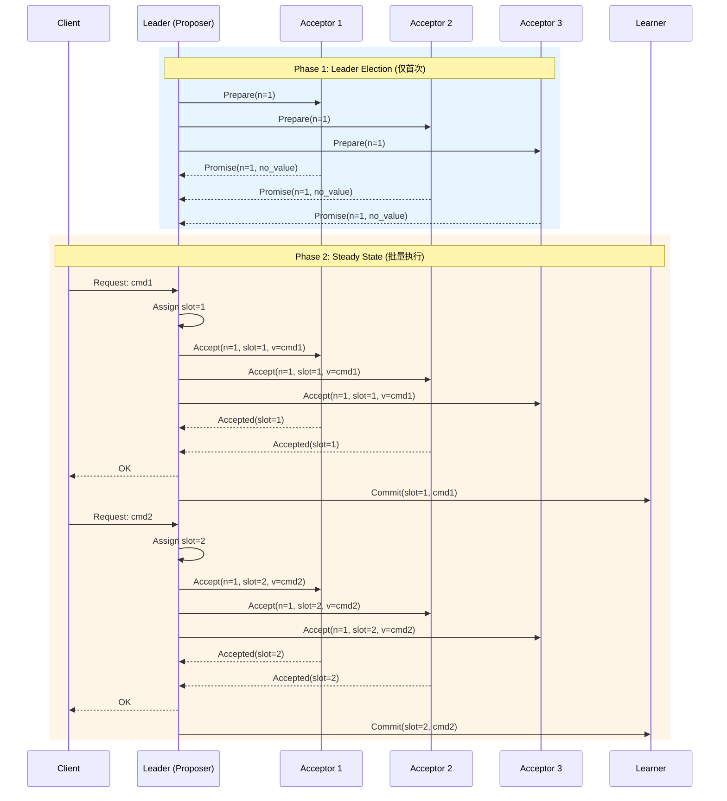

# Multi-Paxos详解

> Stanford CS244B: Distributed Systems 课程对齐

## 1. 引言

Basic Paxos解决了单个值的共识问题，但在实际系统中，我们需要对一系列值（日志）达成共识。Multi-Paxos通过优化Basic Paxos的重复执行，实现了高效的复制状态机。

### 1.1 问题背景

Basic Paxos的局限性：

- 每个值都需要完整的两阶段提交
- 频繁的Leader选举开销
- 大量重复的网络通信

Multi-Paxos核心洞察：**一旦确定了Leader，可以跳过Prepare阶段直接执行Accept阶段**。

## 2. Multi-Pos核心机制

### 2.1 算法架构

```
┌─────────────────────────────────────────────────────────────┐
│                      Multi-Paxos 架构                        │
├─────────────────────────────────────────────────────────────┤
│  Client Request → Leader → Accept Phase → Learners          │
│       ↓             ↓           ↓           ↓               │
│   提案提交      顺序分配log slot   多数派确认    状态应用       │
└─────────────────────────────────────────────────────────────┘
```

### 2.2 时序图：完整流程



## 3. Go伪代码实现

### 3.1 核心数据结构

```go
// Instance 代表一个log slot上的Paxos实例
type Instance struct {
    Slot        int
    BallotNum   Ballot
    Value       Command
    State       InstanceState // Pending/Accepted/Chosen
}

type InstanceState int
const (
    Pending InstanceState = iota
    Accepted
    Chosen
)

// MultiPaxos 状态机
type MultiPaxos struct {
    // 身份
    id       int
    isLeader bool

    // 日志管理
    log      []*Instance      // slot -> instance
    nextSlot int              // 下一个可用slot

    // Leader状态
    ballot   Ballot
    prepared bool             // 是否已完成Prepare阶段

    // Acceptor状态
    promisedBallot Ballot     // 已承诺的最大ballot
    acceptedValue  map[int]*Instance // slot -> accepted

    // 配置
    peers    []string
    majority int
}

type Ballot struct {
    Num    int
    NodeID int
}

func (b Ballot) GreaterThan(other Ballot) bool {
    if b.Num != other.Num {
        return b.Num > other.Num
    }
    return b.NodeID > other.NodeID
}
```

### 3.2 Leader实现

```go
// Propose 客户端调用，提议一个命令
func (mp *MultiPaxos) Propose(cmd Command) (int, error) {
    if !mp.isLeader {
        return 0, errors.New("not leader")
    }

    // 确保已完成Prepare阶段
    if !mp.prepared {
        if err := mp.runPreparePhase(); err != nil {
            return 0, err
        }
    }

    slot := mp.nextSlot
    mp.nextSlot++

    // 直接执行Accept阶段（跳过Prepare）
    if err := mp.runAcceptPhase(slot, cmd); err != nil {
        return 0, err
    }

    return slot, nil
}

// runPreparePhase 首次执行或Leader切换时调用
func (mp *MultiPaxos) runPreparePhase() error {
    mp.ballot.Num++
    mp.ballot.NodeID = mp.id

    promises := 0
    var maxAccepted []*Instance

    for _, peer := range mp.peers {
        reply, err := mp.sendPrepare(peer, mp.ballot)
        if err != nil {
            continue
        }

        if reply.Ballot.GreaterThan(mp.ballot) {
            // 存在更高ballot，放弃Leader地位
            mp.stepDown(reply.Ballot)
            return errors.New("stepped down")
        }

        if reply.Ack {
            promises++
            if len(reply.Accepted) > 0 {
                maxAccepted = mergeMaxInstances(maxAccepted, reply.Accepted)
            }
        }
    }

    if promises >= mp.majority {
        mp.prepared = true
        // 恢复已接受的值
        mp.recoverInstances(maxAccepted)
        return nil
    }

    return errors.New("prepare failed")
}

// runAcceptPhase 稳定的Accept阶段
func (mp *MultiPaxos) runAcceptPhase(slot int, cmd Command) error {
    instance := &Instance{
        Slot:      slot,
        BallotNum: mp.ballot,
        Value:     cmd,
        State:     Pending,
    }

    accepts := 0
    for _, peer := range mp.peers {
        reply, err := mp.sendAccept(peer, instance)
        if err != nil {
            continue
        }

        if reply.Ballot.GreaterThan(mp.ballot) {
            mp.stepDown(reply.Ballot)
            return errors.New("stepped down")
        }

        if reply.Accepted {
            accepts++
        }
    }

    if accepts >= mp.majority {
        instance.State = Chosen
        mp.log[slot] = instance
        mp.broadcastCommit(slot, cmd)
        return nil
    }

    return errors.New("accept failed")
}
```

### 3.3 Acceptor实现

```go
// HandlePrepare 处理Prepare请求
func (mp *MultiPaxos) HandlePrepare(req PrepareRequest) PrepareReply {
    if req.Ballot.GreaterThan(mp.promisedBallot) {
        mp.promisedBallot = req.Ballot

        // 收集已接受的值
        accepted := make([]*Instance, 0)
        for _, inst := range mp.acceptedValue {
            accepted = append(accepted, inst)
        }

        return PrepareReply{
            Ack:       true,
            Ballot:    mp.promisedBallot,
            Accepted:  accepted,
        }
    }

    return PrepareReply{
        Ack:    false,
        Ballot: mp.promisedBallot,
    }
}

// HandleAccept 处理Accept请求
func (mp *MultiPaxos) HandleAccept(req AcceptRequest) AcceptReply {
    if req.Ballot.GreaterThan(mp.promisedBallot) ||
       req.Ballot == mp.promisedBallot {
        mp.promisedBallot = req.Ballot

        inst := &Instance{
            Slot:      req.Slot,
            BallotNum: req.Ballot,
            Value:     req.Value,
            State:     Accepted,
        }
        mp.acceptedValue[req.Slot] = inst

        return AcceptReply{
            Accepted: true,
            Ballot:   mp.promisedBallot,
        }
    }

    return AcceptReply{
        Accepted: false,
        Ballot:   mp.promisedBallot,
    }
}
```

## 4. 关键优化

### 4.1 Leader Lease优化

```go
// LeaderLease Leader租约机制
type LeaderLease struct {
    leaderID    int
    expireTime  time.Time
    leaseDuration time.Duration
}

func (ll *LeaderLease) IsValid() bool {
    return time.Now().Before(ll.expireTime)
}

func (ll *LeaderLease) Renew(leaderID int) {
    ll.leaderID = leaderID
    ll.expireTime = time.Now().Add(ll.leaseDuration)
}

// 其他节点在lease有效期内不会发起新的Leader选举
func (mp *MultiPaxos) canStartElection() bool {
    return !mp.leaderLease.IsValid()
}
```

### 4.2 批量提交优化

```go
// BatchPropose 批量提议
func (mp *MultiPaxos) BatchPropose(cmds []Command) error {
    if !mp.prepared {
        mp.runPreparePhase()
    }

    // 批量分配slots
    startSlot := mp.nextSlot
    mp.nextSlot += len(cmds)

    // 批量发送Accept请求
    batch := &BatchAcceptRequest{
        Ballot: mp.ballot,
        Entries: make([]AcceptEntry, len(cmds)),
    }

    for i, cmd := range cmds {
        batch.Entries[i] = AcceptEntry{
            Slot:  startSlot + i,
            Value: cmd,
        }
    }

    return mp.broadcastBatchAccept(batch)
}
```

### 4.3 流水线优化

```go
// PipelineManager 管理并行Accept请求
type PipelineManager struct {
    maxInflight int
    inflight    map[int]chan error // slot -> result channel
}

// 允许并行的Accept请求，提高效率
func (pm *PipelineManager) canSend(slot int) bool {
    return len(pm.inflight) < pm.maxInflight
}
```

## 5. 与Basic Paxos对比

| 特性 | Basic Paxos | Multi-Paxos |
|------|-------------|-------------|
| 目标 | 单个值共识 | 日志复制/状态机复制 |
| Prepare阶段 | 每值执行 | 仅Leader选举时执行 |
| 消息复杂度 | 4n 每值 | 2n 每值（稳定状态）|
| 延迟 | 2 RTT 每值 | 1 RTT 每值（稳定状态）|
| Leader切换 | N/A | 需要View Change |
| 吞吐量 | 低 | 高（流水线优化后）|

## 6. 安全性证明

### 6.1 安全性定理

**定理（一致性）**：不存在两个不同的命令被选为同一slot的值。

**证明**：

假设存在两个不同的命令 `v1` 和 `v2` 被选为slot `s` 的值。

根据Acceptor的规则，一个Acceptor只能接受一个ballot对应的一个值。

设接受`v1`的Acceptor集合为`Q1`，接受`v2`的集合为`Q2`。

由于都是多数派：

- |Q1| ≥ ⌈n/2⌉ + 1
- |Q2| ≥ ⌈n/2⌉ + 1

则 |Q1 ∩ Q2| ≥ 2(⌈n/2⌉ + 1) - n ≥ 1

即至少有一个Acceptor同时接受了`v1`和`v2`。

但这与Acceptor的规则矛盾（一个Acceptor在一个slot只能接受一个值）。

因此，假设不成立。∎

### 6.2 活性保证

**定理（活性）**：如果存在稳定的Leader，最终每个提案都会被选择。

**证明要点**：

1. 稳定Leader的ballot号最大且不变
2. Acceptor最终会接受该Leader的Accept请求
3. 多数派接受后，值被选定

## 7. 实际系统应用

- **Chubby**: Google的分布式锁服务
- **Spanner**: Google的分布式数据库
- **etcd/Consul**: 基于Raft（类似Multi-Paxos思想）

## 8. 总结

Multi-Paxos通过Leader稳定优化，将Basic Paxos的每个值4消息降低到稳定状态的2消息，实现了高吞吐的日志复制。其核心思想是通过一次Prepare阶段建立Leader权威，后续直接执行Accept阶段，是分布式共识算法的工程里程碑。

---

**参考**：

- Lamport, "Paxos Made Simple" (2001)
- Lamport, "The Part-Time Parliament" (1998)
- Stanford CS244B Lecture Notes
