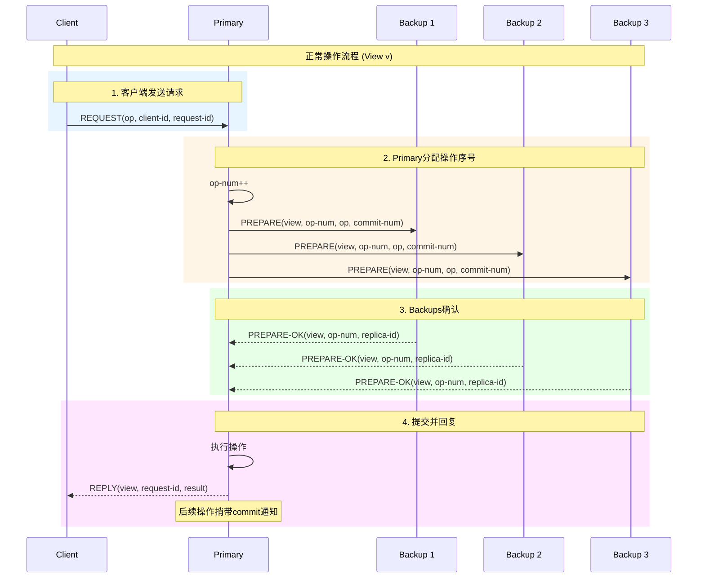
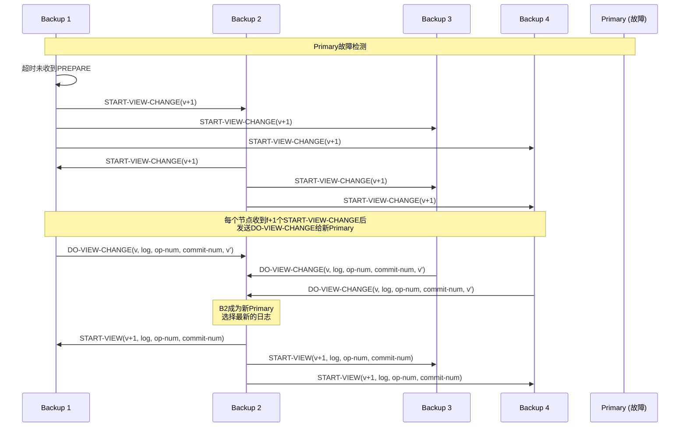

# Viewstamped Replication 详解

> Stanford CS244B: Distributed Systems 课程对齐

## 1. 引言

Viewstamped Replication (VR) 是由Oki和Liskov于1988年提出的共识算法，是最早实用的复制状态机协议之一。VR与Paxos、Raft并列为三大经典共识算法，其设计思想深刻影响了现代分布式系统。

### 1.1 历史地位

VR的三个首创性贡献：

- 首次系统性地提出**复制状态机**范式
- 引入了**视图变更（View Change）**机制处理主节点故障
- 为后来的共识算法奠定了架构基础

## 2. VR核心架构

### 2.1 系统模型

```
┌─────────────────────────────────────────────────────────────────┐
│                   VR系统架构                                     │
├─────────────────────────────────────────────────────────────────┤
│                                                                  │
│  View = 1:                                                      │
│  ┌─────────┐    ┌─────────┐    ┌─────────┐    ┌─────────┐     │
│  │Primary  │───►│Backup 1 │    │Backup 2 │    │Backup 3 │     │
│  │  (P1)   │    │  (P2)   │    │  (P3)   │    │  (P4)   │     │
│  └────┬────┘    └─────────┘    └─────────┘    └─────────┘     │
│       │                                                          │
│       ▼                                                          │
│  ┌─────────┐                                                     │
│  │ Client  │                                                     │
│  └─────────┘                                                     │
│                                                                  │
│  View = 2 (Primary故障后):                                       │
│  ┌─────────┐    ┌─────────┐    ┌─────────┐    ┌─────────┐     │
│  │Backup 1 │◄───│Backup 2 │    │Backup 3 │    │Backup 4 │     │
│  │ (新Primary)│   │  (新P2)  │    │  (新P3)  │    │  (新P4)  │     │
│  └─────────┘    └─────────┘    └─────────┘    └─────────┘     │
│                                                                  │
└─────────────────────────────────────────────────────────────────┘
```

### 2.2 正常操作协议



## 3. Go伪代码实现

### 3.1 核心数据结构

```go
// VR Replica实现
type VR struct {
    id       int
    replicas []string

    // 视图状态
    view     int      // 当前视图号
    status   Status   // Normal/ViewChange/Recovering

    // 操作日志
    log      []OpEntry
    opNum    int      // 下一个操作序号

    // 提交状态
    commitNum int     // 最后提交的操作序号

    // 客户端状态
    clientTable map[int]ClientEntry

    // 配置
    n int  // 总副本数
    f int  // 最大故障数
}

type Status int
const (
    Normal Status = iota
    ViewChange
    Recovering
)

type OpEntry struct {
    OpNum   int
    View    int
    Op      Operation
    Committed bool
}

type ClientEntry struct {
    RequestID int
    Response  interface{}
}

type Operation struct {
    ClientID  int
    RequestID int
    Command   []byte
}
```

### 3.2 正常操作实现

```go
// HandleRequest 处理客户端请求
func (vr *VR) HandleRequest(req *Request) {
    if !vr.isPrimary() {
        // 转发给Primary
        vr.forwardToPrimary(req)
        return
    }

    // 检查客户端表（去重）
    if entry, ok := vr.clientTable[req.ClientID]; ok {
        if entry.RequestID == req.RequestID {
            // 重复请求，直接返回缓存结果
            vr.replyToClient(req.ClientID, entry.Response)
            return
        }
    }

    // 分配操作序号
    vr.opNum++
    entry := OpEntry{
        OpNum:   vr.opNum,
        View:    vr.view,
        Op:      req.Operation,
    }
    vr.log = append(vr.log, entry)

    // 发送PREPARE给所有备份
    prepare := &PrepareMsg{
        View:      vr.view,
        OpNum:     vr.opNum,
        Op:        req.Operation,
        CommitNum: vr.commitNum,
    }

    // 等待f个PREPARE-OK
    replies := vr.broadcastPrepare(prepare)
    if len(replies) >= vr.f {
        // 可以执行
        vr.executeUpTo(vr.opNum)

        // 回复客户端
        result := vr.clientTable[req.ClientID].Response
        vr.replyToClient(req.ClientID, result)
    }
}

// HandlePrepare 备份节点处理PREPARE
func (vr *VR) HandlePrepare(msg *PrepareMsg) *PrepareOKMsg {
    if vr.status != Normal || msg.View != vr.view {
        return nil
    }

    // 检查操作序号的连续性
    if msg.OpNum > len(vr.log)+1 {
        // 需要恢复缺失的操作
        vr.enterRecovery()
        return nil
    }

    // 添加到日志
    if msg.OpNum == len(vr.log)+1 {
        vr.log = append(vr.log, OpEntry{
            OpNum: msg.OpNum,
            View:  msg.View,
            Op:    msg.Op,
        })
    }

    // 更新提交进度
    vr.updateCommitNum(msg.CommitNum)

    return &PrepareOKMsg{
        View:      vr.view,
        OpNum:     msg.OpNum,
        ReplicaID: vr.id,
    }
}

// executeUpTo 执行到指定序号
func (vr *VR) executeUpTo(opNum int) {
    for vr.commitNum < opNum {
        entry := vr.log[vr.commitNum]

        // 执行操作
        result := vr.stateMachine.Apply(entry.Op.Command)
        entry.Committed = true

        // 更新客户端表
        vr.clientTable[entry.Op.ClientID] = ClientEntry{
            RequestID: entry.Op.RequestID,
            Response:  result,
        }

        vr.commitNum++
    }
}
```

## 4. 视图变更机制

### 4.1 视图变更触发



### 4.2 视图变更实现

```go
// ViewChange 启动视图变更
func (vr *VR) ViewChange() {
    if vr.status == ViewChange {
        return
    }

    vr.status = ViewChange
    vr.view++

    // 广播START-VIEW-CHANGE
    msg := &StartViewChangeMsg{
        View:      vr.view,
        ReplicaID: vr.id,
    }
    vr.broadcast(msg)

    // 重置计数
    vr.viewChangeCount = 1
}

// HandleStartViewChange 处理视图变更启动
func (vr *VR) HandleStartViewChange(msg *StartViewChangeMsg) {
    if msg.View < vr.view {
        return
    }

    if msg.View > vr.view {
        // 加入新的视图变更
        vr.view = msg.View
        vr.status = ViewChange
        vr.viewChangeCount = 1
        vr.broadcast(&StartViewChangeMsg{View: vr.view, ReplicaID: vr.id})
    } else {
        vr.viewChangeCount++
    }

    // 收到f+1个后，发送DO-VIEW-CHANGE给新Primary
    if vr.viewChangeCount == vr.f+1 {
        newPrimary := vr.view % vr.n
        vr.sendDoViewChange(newPrimary)
    }
}

// sendDoViewChange 发送DO-VIEW-CHANGE
func (vr *VR) sendDoViewChange(newPrimary int) {
    msg := &DoViewChangeMsg{
        View:       vr.view,
        Log:        vr.log,
        OpNum:      vr.opNum,
        CommitNum:  vr.commitNum,
        OldView:    vr.view - 1,
        ReplicaID:  vr.id,
    }
    vr.sendTo(newPrimary, msg)
}

// HandleDoViewChange 新Primary处理视图变更
func (vr *VR) HandleDoViewChange(msg *DoViewChangeMsg) {
    if !vr.isPrimaryFor(msg.View) {
        return
    }

    vr.doViewChangeMsgs = append(vr.doViewChangeMsgs, msg)

    // 收集f+1个
    if len(vr.doViewChangeMsgs) == vr.f+1 {
        // 选择具有最大(OldView, OpNum)的日志
        best := vr.selectBestLog(vr.doViewChangeMsgs)

        vr.log = best.Log
        vr.opNum = best.OpNum
        vr.commitNum = best.CommitNum
        vr.status = Normal

        // 广播START-VIEW
        startView := &StartViewMsg{
            View:      vr.view,
            Log:       vr.log,
            OpNum:     vr.opNum,
            CommitNum: vr.commitNum,
        }
        vr.broadcast(startView)

        // 执行未提交的操作
        vr.executeUpTo(vr.commitNum)
    }
}
```

## 5. VR vs Raft对比

### 5.1 架构对比

```
┌─────────────────────────────────────────────────────────────────┐
│                    VR vs Raft 对比                               │
├─────────────────────────────────────────────────────────────────┤
│                                                                  │
│  VR (1988):                      Raft (2014):                   │
│  ┌──────────────────┐           ┌──────────────────┐           │
│  │ Viewstamped      │           │ Raft             │           │
│  │ Replication      │           │                  │           │
│  ├──────────────────┤           ├──────────────────┤           │
│  │ - View Number    │           │ - Term Number    │           │
│  │ - View Change    │           │ - Leader Election│           │
│  │ - Normal/VC状态  │           │ - Leader/Follower│           │
│  │ - Prepare阶段    │           │ - AppendEntries  │           │
│  │ - 两阶段提交     │           │ - 日志复制       │           │
│  └──────────────────┘           └──────────────────┘           │
│                                                                  │
└─────────────────────────────────────────────────────────────────┘
```

### 5.2 详细对比表

| 特性 | VR | Raft |
|------|-----|------|
| 提出时间 | 1988 | 2014 |
| Leader选举 | 基于视图号 | 基于Term和随机超时 |
| 日志复制 | PREPARE/PREPARE-OK | AppendEntries |
| 提交条件 | f+1个确认 | 多数派匹配 |
| 成员变更 | 停机变更 | 联合共识 |
| 可读性 | 较复杂 | 简单易懂 |
| 工业应用 | 较少 | 广泛(etcd, TiKV等) |

## 6. 正确性证明

### 6.1 安全性定理

**定理1（一致性）**：如果操作op在视图v中被提交，那么它在所有更高视图中也会被提交。

**证明概要**：

1. 操作op在视图v中被提交，意味着它已在f+1个副本的日志中
2. 视图变更时，新Primary必须从f+1个副本中收集日志
3. 根据鸽巢原理，新Primary必然收到包含op的日志
4. 因此op会被传播到所有副本

**定理2（顺序性）**：所有副本以相同顺序执行操作。

**证明概要**：

1. Primary按顺序分配op-num
2. 备份按op-num顺序追加到日志
3. 提交也按op-num顺序进行
4. 执行时按日志顺序执行

### 6.2 活性保证

**定理3（活性）**：如果Primary正常，客户端请求最终会被执行。

**条件**：

- 网络最终可靠
- Primary不故障
- 副本数大于2f

## 7. 现代变体：VR Revisited

2012年，Liskov等人发表了"Viewstamped Replication Revisited"，对原算法进行了改进：

### 7.1 主要改进

1. **简化视图变更**：使用更简洁的状态同步机制
2. **客户端表优化**：更高效的去重机制
3. **恢复协议**：更快速的状态恢复

### 7.2 代码示例

```go
// VR Revisited的优化实现
type VRRevisited struct {
    VR  // 嵌入原始VR

    // 新增优化
    checkpointInterval int
    checkpoints        map[int]*Checkpoint

    // 增量恢复
    deltaLog           []OpEntry
}

// CreateCheckpoint 创建检查点
func (vr *VRRevisited) CreateCheckpoint() {
    cp := &Checkpoint{
        OpNum:     vr.commitNum,
        State:     vr.stateMachine.Snapshot(),
        Timestamp: time.Now(),
    }
    vr.checkpoints[vr.commitNum] = cp

    // 清理旧日志
    vr.log = vr.log[vr.commitNum:]
}
```

## 8. 实际应用

- **MongoDB Replica Set**: 部分借鉴VR思想
- **ZooKeeper ZAB**: 与VR类似的视图变更机制
- **Corfu**: 使用VR风格的日志复制

## 9. 总结

Viewstamped Replication是分布式共识算法发展史上的里程碑。虽然Raft在工程实现上更为流行，但VR的设计思想——特别是视图变更机制——深刻影响了后续算法。理解VR对于深入理解分布式系统一致性协议具有重要价值。

---

**参考**：

- Oki, Liskov, "Viewstamped Replication: A New Primary Copy Method to Support Highly-Available Distributed Systems" (1988)
- Liskov, Cowling, "Viewstamped Replication Revisited" (2012)
- Stanford CS244B Lecture Notes
