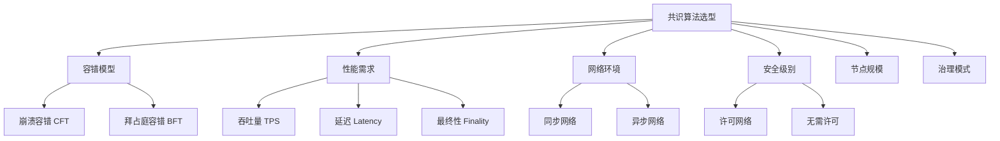
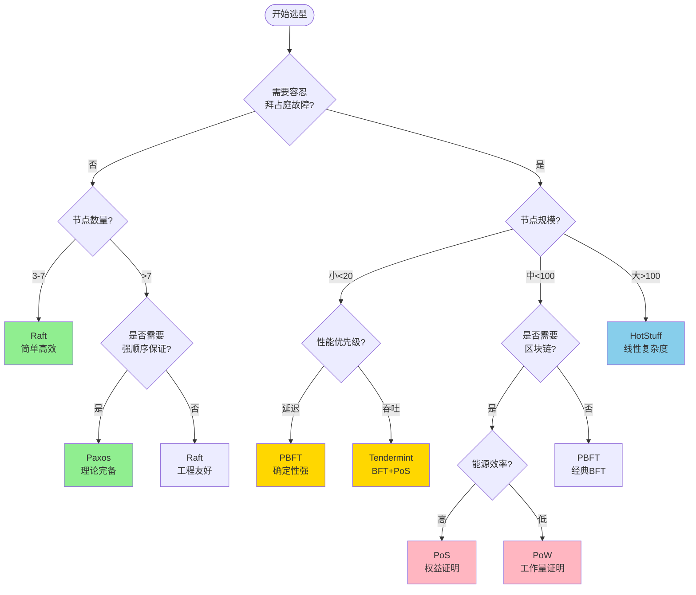

# 共识算法选型指南 专题文档

**文档版本**：v1.0
**创建时间**：2026年
**最后更新**：2026年
**状态**：✅ 已完成

---

## 📋 执行摘要

共识算法是分布式系统的核心组件，选择合适的共识算法对系统性能、安全性和可用性至关重要。本指南提供系统化的选型方法论，通过决策树、对比矩阵和实际案例分析，帮助架构师根据具体场景选择最适合的共识算法。

---

## 一、选型维度分析

### 1.1 关键选型维度



### 1.2 维度详细说明

| 维度 | 选项 | 说明 |
|------|------|------|
| **容错模型** | CFT | 假设节点只会崩溃，不会作恶 |
| | BFT | 可容忍节点作恶（拜占庭故障） |
| **网络模型** | 同步 | 消息延迟有上界 |
| | 异步 | 消息延迟无保证 |
| **节点规模** | 小规模 | 3-10个节点 |
| | 中规模 | 10-100个节点 |
| | 大规模 | 100+个节点 |
| **治理模式** | 许可 | 节点需要授权才能加入 |
| | 无需许可 | 任何人都可以参与 |

---

## 二、决策树

### 2.1 完整决策流程



### 2.2 按场景决策

#### 场景1：企业分布式数据库

```
需求分析：
- 节点数：3-5个数据中心
- 故障模型：崩溃容错即可
- 性能：中等TPS，低延迟
- 网络：相对稳定的内部网络

推荐：Raft
原因：
- 实现简单，易于维护
- 生态成熟（etcd、Consul、TiKV等）
- 性能满足需求
- 运维工具完善
```

#### 场景2：联盟链/企业区块链

```
需求分析：
- 节点数：10-50个参与方
- 故障模型：需要拜占庭容错
- 性能：高TPS，秒级确认
- 治理：需要许可控制

推荐：PBFT 或 Tendermint
原因：
- 可容忍1/3恶意节点
- 确定性共识，无分叉
- 适合联盟场景
- 成熟的企业级实现（Hyperledger Fabric）
```

#### 场景3：公有链

```
需求分析：
- 节点数：100+，开放参与
- 故障模型：拜占庭容错
- 性能：平衡TPS和去中心化
- 治理：无需许可

推荐：PoS（以太坊2.0模式）或 Tendermint
原因：
- 能源效率高
- 可扩展性好
- 经济安全模型成熟
- 社区生态丰富
```

---

## 三、对比矩阵

### 3.1 CFT算法对比

| 特性 | Raft | Paxos | ZAB |
|------|------|-------|-----|
| **可理解性** | ⭐⭐⭐⭐⭐ | ⭐⭐ | ⭐⭐⭐ |
| **实现难度** | 低 | 高 | 中 |
| **消息复杂度** | O(n) | O(n²) | O(n) |
| **日志复制** | 高效 | 高效 | 高效 |
| **成员变更** | 简单 | 复杂 | 中等 |
| **典型应用** | etcd, Consul | Chubby, Spanner | ZooKeeper |

### 3.2 BFT算法对比

| 特性 | PBFT | HotStuff | Tendermint | LibraBFT |
|------|------|----------|------------|----------|
| **通信复杂度** | O(n²) | O(n) | O(n²) | O(n) |
| **节点规模** | <20 | <150 | <100 | <150 |
| **视图变更** | O(n³) | O(n) | O(n²) | O(n) |
| **延迟** | 1-3s | 1-2s | 3-6s | 1-2s |
| **实现难度** | 中 | 高 | 中 | 高 |
| **活跃度** | 需要同步假设 | 需要同步假设 | 需要同步假设 | 需要同步假设 |

### 3.3 区块链共识对比

| 特性 | PoW | PoS | DPoS | PoA |
|------|-----|-----|------|-----|
| **能耗** | 极高 | 低 | 极低 | 极低 |
| **去中心化** | ⭐⭐⭐⭐⭐ | ⭐⭐⭐⭐ | ⭐⭐⭐ | ⭐⭐ |
| **吞吐量** | 低 | 中 | 高 | 高 |
| **最终性** | 概率性 | 即时 | 即时 | 即时 |
| **准入门槛** | 无 | 低 | 中 | 高 |
| **抗审查** | 最强 | 强 | 中 | 弱 |

---

## 四、量化评分模型

### 4.1 多维度评分表

为每个场景赋予权重，计算综合得分：

```go
// 评分权重配置
type CriteriaWeights struct {
    Throughput    float64  // 吞吐量
    Latency       float64  // 延迟
    Security      float64  // 安全性
    Decentralization float64  // 去中心化
    Scalability   float64  // 可扩展性
    EnergyEfficiency float64  // 能源效率
}

// 算法评分
type AlgorithmScore struct {
    Name   string
    Scores map[string]float64  // 各维度得分 0-10
}

// 计算加权得分
func CalculateWeightedScore(alg AlgorithmScore, weights CriteriaWeights) float64 {
    score := 0.0
    score += alg.Scores["throughput"] * weights.Throughput
    score += alg.Scores["latency"] * weights.Latency
    score += alg.Scores["security"] * weights.Security
    score += alg.Scores["decentralization"] * weights.Decentralization
    score += alg.Scores["scalability"] * weights.Scalability
    score += alg.Scores["energy"] * weights.EnergyEfficiency
    return score
}
```

### 4.2 典型场景评分

#### 场景：金融级分布式账本

```
权重配置：
- 安全性: 0.30
- 延迟: 0.25
- 吞吐量: 0.20
- 去中心化: 0.10
- 可扩展性: 0.10
- 能源效率: 0.05

算法得分（满分10分）：

┌─────────────────┬──────────┬────────┬──────────┬──────────┐
│ 算法            │ 安全性   │ 延迟   │ 吞吐量   │ 加权总分 │
├─────────────────┼──────────┼────────┼──────────┼──────────┤
│ PBFT            │ 10       │ 8      │ 6        │ 8.30     │
│ HotStuff        │ 9        │ 9      │ 8        │ 8.65     │
│ Tendermint      │ 9        │ 7      │ 7        │ 7.85     │
│ Raft            │ 6        │ 9      │ 8        │ 7.25     │
│ PoW             │ 10       │ 3      │ 2        │ 5.35     │
└─────────────────┴──────────┴────────┴──────────┴──────────┘

推荐：HotStuff（加权得分最高）
```

---

## 五、实际案例

### 5.1 案例1：Kubernetes etcd

```
背景：
- Kubernetes的分布式键值存储
- 需要强一致性
- 高可用性要求

选型过程：
1. 节点数：通常3或5个
2. 故障模型：CFT足够（数据中心可信）
3. 性能需求：中等QPS
4. 运维友好性：高优先级

选择：Raft
实现：etcd使用Raft协议
验证：生产环境稳定运行多年
```

### 5.2 案例2：Hyperledger Fabric

```
背景：
- 企业级联盟链平台
- 多组织参与，需要信任边界
- 高吞吐量需求

选型过程：
1. 故障模型：必须BFT（不同组织间可能不信任）
2. 节点数：通常5-20个组织
3. 性能：高TPS需求
4. 确定性：需要即时最终性

选择：PBFT（Raft也可选）
实现：Fabric支持可插拔共识，默认Raft，可选BFT
验证：广泛应用于企业供应链、金融场景
```

### 5.3 案例3：以太坊2.0

```
背景：
- 全球第二大公链
- 需要能源效率
- 保持去中心化

选型过程：
1. 能源效率：高优先级（从PoW迁移）
2. 安全性：不能妥协
3. 去中心化：必须保持
4. 可扩展性：需要分片支持

选择：Casper FFG（PoS + BFT）
实现：信标链 + 分片链架构
验证：2022年完成合并，运行稳定
```

---

## 六、常见误区

### 6.1 误区与纠正

| 误区 | 纠正 |
|------|------|
| BFT一定比CFT好 | BFT开销更大，无拜占庭威胁时CFT更高效 |
| 吞吐量越高越好 | 高吞吐往往牺牲去中心化或安全性 |
| 公有链共识适合企业 | 公有链共识设计目标不同，企业通常需要许可链 |
| 算法越新越好 | 新算法可能缺乏生产验证，成熟算法更可靠 |
| 一种算法适合所有场景 | 不同场景需求不同，应针对性选择 |

### 6.2 选型检查清单

```
✓ 明确故障模型（CFT vs BFT）
✓ 评估节点规模和增长预期
✓ 确定性能需求（TPS、延迟）
✓ 考虑网络环境（延迟、分区）
✓ 评估安全需求级别
✓ 考虑运维复杂度
✓ 评估团队技术能力
✓ 考虑生态和工具支持
✓ 评估长期维护成本
✓ 预留扩展和升级路径
```

---

## 七、与其他主题的关联

### 7.1 相关文档

- [Raft算法详解](./classic/Raft算法详解.md)
- [PBFT实用拜占庭容错](./bft/PBFT实用拜占庭容错.md)
- [PoS权益证明](./blockchain/PoS权益证明.md)

### 7.2 对比文档

- [Raft与Paxos对比](./Raft与Paxos对比.md)
- [BFT算法对比](./BFT算法对比.md)
- [区块链共识对比](./blockchain/区块链共识对比.md)

---

## 八、参考资源

### 8.1 选型工具

1. [Consensus Comparison Matrix](https://consensus.hatenablog.com/) - 共识算法对比工具
2. [Hyperledger Fabric Docs](https://hyperledger-fabric.readthedocs.io/) - 企业链选型参考

### 8.2 学术论文

1. [Consensus in the Presence of Partial Synchrony](https://groups.csail.mit.edu/tds/papers/Lynch/jacm88.pdf) - Dwork et al.
2. [SoK: Consensus in the Age of Blockchains](https://arxiv.org/abs/1711.03936)

---

**维护者**：项目团队
**最后更新**：2026年
