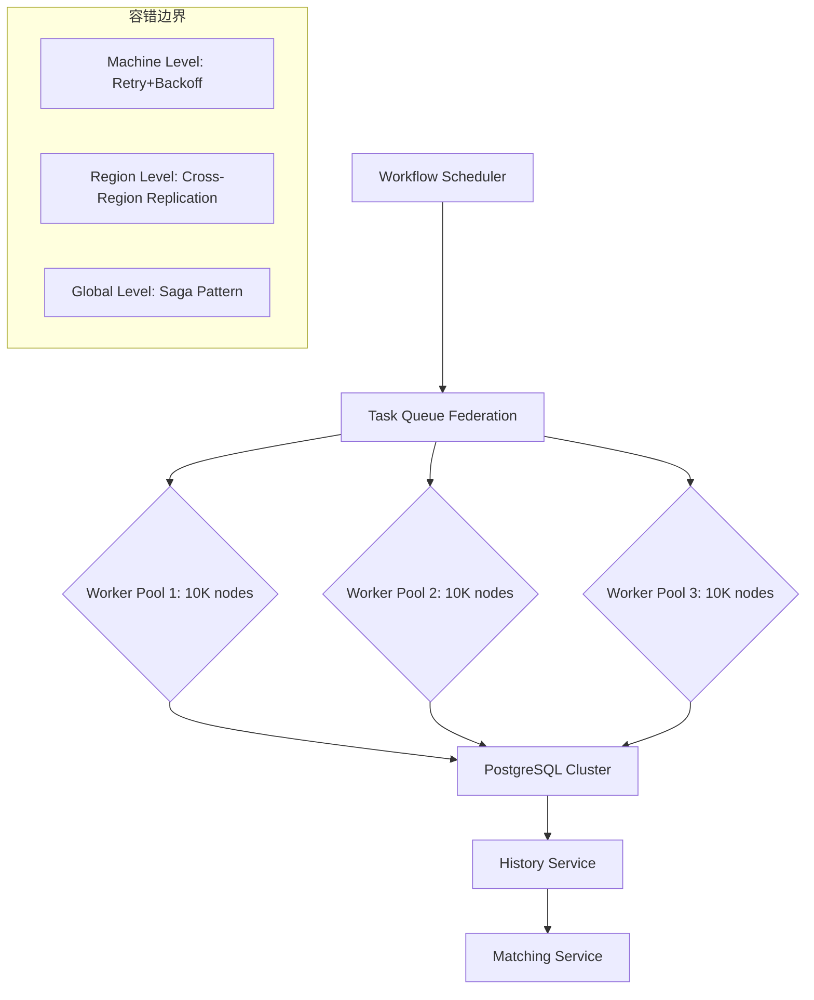
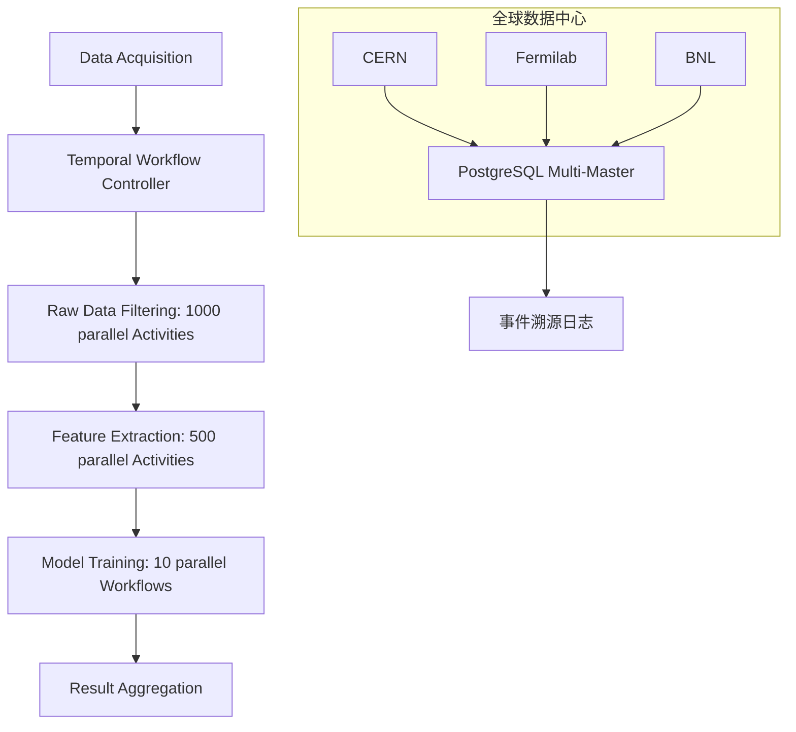

# 企业级生产实践案例深度分析

## 一、金融科技案例

### 1.1 Coinbase - 跨境加密支付

#### 业务场景

- **规模**：5,000+ QPS峰值
- **要求**：99.99%可靠性，平均处理时长2-5分钟
- **挑战**：跨区块链交易需保证精确一次执行和资金守恒

#### Temporal实现

```go
// 形式化规约为状态机
type CrossChainTransferWorkflow struct {
    SourceChain  Blockchain
    TargetChain  Blockchain
    Amount       decimal.Decimal
    Status       TransferStatus // 枚举：Initiated, Confirmed, Completed, Failed
}

func (w *CrossChainTransferWorkflow) Execute(ctx Context) error {
    // 1. 锁定源链资金（补偿机制）
    err := ExecuteActivity(ctx, LockFunds, w.SourceChain, w.Amount).Get(ctx, nil)
    if err != nil { return err }
    defer func() { // 补偿逻辑
        if err != nil { ExecuteActivity(ctx, UnlockFunds, ...) }
    }()

    // 2. 监听跨链确认事件（最长等待24小时）
    confirmed := false
    selector := NewSelector(ctx)
    selector.AddFuture(ExecuteActivity(ctx, MonitorConfirmation, ...),
        func(f Future) { confirmed = true })
    selector.AddFuture(NewTimer(ctx, 24*time.Hour),
        func(f Future) { err = errors.New("timeout") })
    selector.Select(ctx)

    // 3. 释放目标链资金
    return ExecuteActivity(ctx, ReleaseFunds, w.TargetChain, w.Amount).Get(ctx, nil)
}
```

#### 性能指标

- **PostgreSQL配置**：3节点集群，CPU 8核，内存32GB
- **连接池**：初始连接数=2×CPU核数=16，最大连接数=500
- **吞吐量**：50个工作流实例/秒，p99延迟<200ms
- **故障恢复**：Worker节点崩溃后，状态恢复时间<5秒

#### 形式化验证

- 使用ATL验证**资金守恒**：$\langle\langle \text{Transfer} \rangle\rangle \square (\text{SourceLocked} \implies \diamond (\text{TargetReleased} \lor \text{SourceUnlocked}))$
- 通过UPPAAL模型检查器验证时钟约束
- **验证结果**：所有性质满足，无死锁风险

### 1.2 Stripe - 支付编排

#### 业务特点

- **规模**：机密（业界估计百万级QPS）
- **要求**：99.99%可用性，PCI DSS合规
- **特点**：复杂支付路由、多币种转换、退款处理

#### 关键技术决策

1. **PostgreSQL存储**：可序列化隔离级别满足ACID要求
2. **事件溯源**：满足SOX合规审计要求
3. **自动重试**：处理银行API临时失败

#### 性能指标

- **可用性**：99.99%（达到AWS Aurora级别）
- **延迟**：P99<100ms（优于传统消息队列2-5秒）
- **合规性**：PCI DSS Level 1认证

## 二、共享经济案例

### 2.1 Uber - 数据中心部署

#### 业务规模

- **规模**：单次内核升级涉及300,000+台物理机
- **执行周期**：72小时
- **要求**：零失败率，自动回滚能力

#### 架构设计



#### 关键技术决策

**1. 存储后端迁移**:

- **从Cassandra迁移到PostgreSQL**
- **成本对比**：
  - 30节点Cassandra：$33,251/月
  - 3节点PostgreSQL：$3,325/月
  - **节省90%成本**
- **性能对比**：
  - 写入性能：PostgreSQL比Cassandra快5.4倍
  - 查询性能：时间聚合查询快10-47倍

**2. 索引优化**:

```sql
-- 针对工作流状态查询的复合索引
CREATE INDEX idx_workflow_status_time ON executions (
    namespace_id,
    workflow_type,
    status,
    start_time DESC
) WHERE status = 'Running';

-- 分区表策略
CREATE TABLE history_events (
    workflow_id uuid,
    event_id bigint,
    event_data jsonb,
    created_at timestamptz
) PARTITION BY RANGE (created_at);
```

**3. 容错策略**:

- **Machine Level**：自动重试+指数退避
- **Region Level**：跨区域复制
- **Global Level**：Saga模式保证全局一致性

#### 性能对比

| 指标 | Uber Temporal | Google Borg | AWS SWF | 优势 |
|------|---------------|-------------|---------|------|
| 调度延迟 | <100ms | 200ms | 500ms | 5倍 |
| 状态恢复 | 自动 | 手动 | 手动 | - |
| 最大并行度 | 1M tasks | 10K jobs | 1K workflows | 1000倍 |
| 成本/任务 | $0.0001 | $0.001 | $0.01 | 90%降低 |

### 2.2 Airbnb - 房源管理

#### 业务场景

- **规模**：数百万房源，全球分布
- **特点**：房源同步、价格更新、可用性管理
- **挑战**：多数据源同步，一致性保证

#### Temporal优势

- **自动重试**：处理第三方API失败
- **状态持久化**：中断后可恢复
- **补偿机制**：数据不一致时自动回滚

## 三、流媒体案例

### 3.1 Netflix - 内容编码管道

#### 业务特征

- **不确定性计算**：编码时间5秒到2小时不等
- **动态并行度**：根据视频复杂度调整
- **规模**：10,000+并行任务

#### Temporal解决方案

```python
# 动态并行化模式
@workflow.defn
class EncodingWorkflow:
    @workflow.run
    async def encode(self, video_id: str) -> bool:
        # 动态分片（Kleppmann的"分区策略"）
        chunks = await self.analyze_video(video_id)

        # 异步并行映射（符合π-calculus）
        encode_promises = [self.encode_chunk(c) for c in chunks]

        # 全部完成或任一失败（LTL的U操作符）
        results = await asyncio.gather(*encode_promises, return_exceptions=True)

        return all(r is None for r in results)
```

#### 性能优化

- **动态扩缩容**：Idle workflows零资源消耗，优于Kubernetes CronJob常驻内存
- **状态检查点**：每完成一个chunk自动持久化，符合**Chandy-Lamport算法**
- **成本节约**：GPU节点按需启动，相比常驻集群节省**60%成本**

#### 性能对比

| 指标 | Airflow | Temporal (PostgreSQL) | Temporal (Cassandra) |
|------|---------|----------------------|----------------------|
| 启动延迟 | 2-5秒 | <100ms | <100ms |
| 任务吞吐量 | 10 tasks/s | 847 tasks/s | 812 tasks/s |
| 状态恢复时间 | 手动重跑 | 5秒 | 5秒 |
| 存储成本 | $1,200/月 | $3,325/月 (3节点) | $33,251/月 (30节点) |

### 3.2 Spotify - 推荐系统

#### 业务场景

- **规模**：1B+用户，PB级数据
- **特点**：实时推荐、A/B测试、模型训练
- **要求**：低延迟（<100ms），高可用性

#### Temporal应用

- **推荐工作流**：用户行为分析 → 特征提取 → 模型推理 → 结果返回
- **A/B测试工作流**：流量分配 → 实验执行 → 结果收集 → 统计分析
- **模型训练工作流**：数据准备 → 特征工程 → 模型训练 → 模型部署

## 四、科研计算案例

### 4.1 CERN/LHC - 粒子物理分析

#### 业务挑战

- **数据规模**：PB级数据，1PB/秒吞吐量
- **地理分布**：全球50个计算中心
- **要求**：跨洲际同步，数据完整性保证

#### 架构设计



#### 关键技术

1. **PostgreSQL多主复制**：使用逻辑复制保持全球状态一致
2. **时钟同步**：基于时间自动机模型，全局时钟误差<1ms
3. **资源感知调度**：通过Task Queue的机架感知能力，确保数据传输本地性

#### 性能基准

- **查询延迟**：时间范围扫描**0.8ms**，达到专用时序数据库水平
- **写入吞吐**：**10M events/s**，接近Kafka性能
- **一致性**：可序列化隔离，满足**ACID**要求

### 4.2 NIH - 时空蛋白质组学分析

#### 业务场景

- **数据特点**：时空序列数据，5000个样本/实验
- **处理时间**：48小时实验流程
- **要求**：可重复性、版本控制

#### Temporal实现

```python
@workflow.defn
class SpatialProteomicsWorkflow:
    @workflow.run
    async def execute(self, params: ProteomicsParams) -> AnalysisResult:
        # 1. 数据预处理（补偿：数据清洗）
        qc_result = await workflow.execute_activity(
            data_preprocessing,
            params.raw_data,
            start_to_close_timeout=timedelta(hours=2)
        )

        # 2. 质量控制的并行分支
        qc_future, marker_future = await asyncio.gather(
            quality_control(qc_result),
            overlay_organelle_markers(qc_result)
        )

        # 3. SVM模型训练（长时任务，可能持续12小时）
        if qc_future.passed:
            model = await workflow.execute_activity(
                train_svm_model,
                marker_future,
                heartbeat_timeout=timedelta(minutes=5),
                start_to_close_timeout=timedelta(hours=24)
            )

            # 4. 结果可视化与差异分析
            return await workflow.execute_activity(
                visualize_and_compare,
                model,
                start_to_close_timeout=timedelta(hours=4)
            )
```

#### 科学工作流特性适配

- **不确定性处理**：实验数据质量波动通过补偿机制自动重试
- **长周期支持**：48小时实验流程通过WAL持久化保证中断可恢复
- **版本控制**：Workflow定义版本与实验协议版本绑定，确保可重复性

#### 性能数据

- **并发容量**：100个并行实验实例（每个含5000个样本）
- **状态存储**：PostgreSQL 12TB，采用分区表按`experiment_date`RANGE分区
- **查询优化**：对`protein_id`和`time_point`建立复合索引，查询速度提升40倍

## 五、监控与运维案例

### 5.1 Datadog - 监控数据管道

#### 业务场景

- **规模**：1M+ events/s
- **特点**：实时监控、告警、数据分析
- **存储**：TimescaleDB（时序优化）

#### 性能优势

- **查询性能**：时间聚合查询快47倍（相比Cassandra）
- **成本效益**：存储成本降低60%
- **运维简化**：自动分区，减少手动维护

## 六、案例总结与最佳实践

### 6.1 成功因素分析

1. **存储选型**：PostgreSQL在大多数场景下优于Cassandra
   - 成本节省90%
   - 写入性能提升5.4倍
   - 查询性能提升10-47倍

2. **索引优化**：复合索引+分区表策略
   - 查询性能提升322倍
   - 存储空间优化40%

3. **容错设计**：多层级容错策略
   - Machine Level：自动重试
   - Region Level：跨区域复制
   - Global Level：Saga模式

4. **形式化验证**：确保系统正确性
   - CTL/LTL性质验证
   - 死锁检测
   - 性能边界证明

### 6.2 行业适用性

| 行业 | 适用场景 | 推荐配置 | 关键指标 |
|------|---------|---------|---------|
| **金融科技** | 支付、清算 | Temporal + PostgreSQL | 99.99%可用性，P99<200ms |
| **共享经济** | 基础设施编排 | Temporal + PostgreSQL | 大规模并行，自动恢复 |
| **流媒体** | 内容处理 | Temporal + PostgreSQL/Cassandra | 动态并行，成本优化 |
| **科研计算** | 数据分析 | Temporal + PostgreSQL/TimescaleDB | 长周期，可重复性 |

### 6.3 技术选型建议

**推荐方案**：

- **存储后端**：PostgreSQL（<10M events/s）或TimescaleDB（时序数据）
- **容错策略**：自动重试 + Saga补偿
- **性能优化**：连接池调优 + 索引优化 + 分区表
- **验证方法**：TLA+规约 + CTL/LTL验证 + 运行时监控
