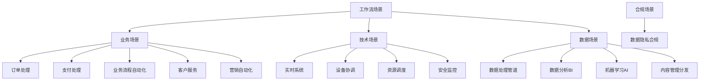

# 场景主题分类案例深度分析

## 目录

- [场景主题分类案例深度分析](#场景主题分类案例深度分析)
  - [目录](#目录)
  - [一、订单处理场景](#一订单处理场景)
    - [1.1 场景定义与理论模型](#11-场景定义与理论模型)
      - [1.1.1 场景定义](#111-场景定义)
      - [1.1.2 理论模型](#112-理论模型)
    - [1.2 电商行业案例](#12-电商行业案例)
      - [1.2.1 Amazon - 订单处理系统](#121-amazon---订单处理系统)
      - [1.2.2 Alibaba - 双11购物节](#122-alibaba---双11购物节)
    - [1.3 共享经济案例](#13-共享经济案例)
      - [1.3.1 Uber - 出行订单处理](#131-uber---出行订单处理)
    - [1.4 交通出行案例](#14-交通出行案例)
      - [1.4.1 Didi - 出行调度系统](#141-didi---出行调度系统)
    - [1.5 跨行业对比分析](#15-跨行业对比分析)
  - [二、支付处理场景](#二支付处理场景)
    - [2.1 场景定义与理论模型](#21-场景定义与理论模型)
      - [2.1.1 场景定义](#211-场景定义)
      - [2.1.2 理论模型](#212-理论模型)
    - [2.2 金融科技案例](#22-金融科技案例)
      - [2.2.1 Coinbase - 跨境加密支付](#221-coinbase---跨境加密支付)
      - [2.2.2 Stripe - 支付编排](#222-stripe---支付编排)
    - [2.3 电商支付案例](#23-电商支付案例)
      - [2.3.1 Amazon - 订单支付](#231-amazon---订单支付)
    - [2.4 跨行业对比分析](#24-跨行业对比分析)
  - [三、数据处理管道场景](#三数据处理管道场景)
    - [3.1 场景定义与理论模型](#31-场景定义与理论模型)
      - [3.1.1 场景定义](#311-场景定义)
    - [3.2 流媒体案例](#32-流媒体案例)
      - [3.2.1 Netflix - 内容编码管道](#321-netflix---内容编码管道)
    - [3.3 科研计算案例](#33-科研计算案例)
      - [3.3.1 CERN/LHC - 粒子物理分析](#331-cernlhc---粒子物理分析)
    - [3.4 监控运维案例](#34-监控运维案例)
      - [3.4.1 Datadog - 监控数据管道](#341-datadog---监控数据管道)
    - [3.5 跨行业对比分析](#35-跨行业对比分析)
  - [四、实时系统场景](#四实时系统场景)
    - [4.1 场景定义与理论模型](#41-场景定义与理论模型)
      - [4.1.1 场景定义](#411-场景定义)
    - [4.2 广告营销案例](#42-广告营销案例)
      - [4.2.1 Google Ads - 广告投放系统](#421-google-ads---广告投放系统)
    - [4.3 推荐系统案例](#43-推荐系统案例)
      - [4.3.1 Spotify - 推荐系统](#431-spotify---推荐系统)
    - [4.4 游戏行业案例](#44-游戏行业案例)
      - [4.4.1 Riot Games - 游戏逻辑系统](#441-riot-games---游戏逻辑系统)
    - [4.5 跨行业对比分析](#45-跨行业对比分析)
  - [五、业务流程自动化场景](#五业务流程自动化场景)
    - [5.1 场景定义与理论模型](#51-场景定义与理论模型)
      - [5.1.1 场景定义](#511-场景定义)
    - [5.2 保险行业案例](#52-保险行业案例)
      - [5.2.1 Allstate - 理赔处理系统](#521-allstate---理赔处理系统)
    - [5.3 房地产案例](#53-房地产案例)
      - [5.3.1 Zillow - 房产交易系统](#531-zillow---房产交易系统)
    - [5.4 供应链案例](#54-供应链案例)
      - [5.4.1 Walmart - 供应链协调](#541-walmart---供应链协调)
    - [5.5 跨行业对比分析](#55-跨行业对比分析)
  - [六、设备协调场景](#六设备协调场景)
    - [6.1 场景定义与理论模型](#61-场景定义与理论模型)
      - [6.1.1 场景定义](#611-场景定义)
    - [6.2 基础设施案例](#62-基础设施案例)
      - [6.2.1 Uber - 数据中心部署](#621-uber---数据中心部署)
    - [6.3 物联网案例](#63-物联网案例)
      - [6.3.1 AWS IoT Core - 设备管理](#631-aws-iot-core---设备管理)
    - [6.4 制造业案例](#64-制造业案例)
      - [6.4.1 智能制造 - 生产调度系统](#641-智能制造---生产调度系统)
    - [6.5 农业科技案例](#65-农业科技案例)
      - [6.5.1 John Deere - 智能农业系统](#651-john-deere---智能农业系统)
    - [6.6 跨行业对比分析](#66-跨行业对比分析)
  - [七、数据隐私与合规场景](#七数据隐私与合规场景)
    - [7.1 场景定义与理论模型](#71-场景定义与理论模型)
      - [7.1.1 场景定义](#711-场景定义)
    - [7.2 医疗健康案例](#72-医疗健康案例)
      - [7.2.1 Epic Systems - 电子病历系统](#721-epic-systems---电子病历系统)
    - [7.3 金融合规案例](#73-金融合规案例)
      - [7.3.1 Coinbase - 合规性管理](#731-coinbase---合规性管理)
    - [7.4 跨行业对比分析](#74-跨行业对比分析)
  - [八、内容管理与分发场景](#八内容管理与分发场景)
    - [8.1 场景定义与理论模型](#81-场景定义与理论模型)
      - [8.1.1 场景定义](#811-场景定义)
    - [8.2 流媒体案例](#82-流媒体案例)
      - [8.2.1 Netflix - 内容编码与分发](#821-netflix---内容编码与分发)
    - [8.3 新闻媒体案例](#83-新闻媒体案例)
      - [8.3.1 The New York Times - 新闻内容处理](#831-the-new-york-times---新闻内容处理)
    - [8.4 跨行业对比分析](#84-跨行业对比分析)
  - [九、客户服务场景](#九客户服务场景)
    - [9.1 场景定义与理论模型](#91-场景定义与理论模型)
      - [9.1.1 场景定义](#911-场景定义)
    - [9.2 电商客服案例](#92-电商客服案例)
      - [9.2.1 Amazon - 客户服务系统](#921-amazon---客户服务系统)
    - [9.3 SaaS客服案例](#93-saas客服案例)
      - [9.3.1 Zendesk - 客服平台](#931-zendesk---客服平台)
    - [9.4 跨行业对比分析](#94-跨行业对比分析)
  - [十、营销自动化场景](#十营销自动化场景)
    - [10.1 场景定义与理论模型](#101-场景定义与理论模型)
      - [10.1.1 场景定义](#1011-场景定义)
    - [10.2 电商营销案例](#102-电商营销案例)
      - [10.2.1 Amazon - 营销自动化系统](#1021-amazon---营销自动化系统)
    - [10.3 SaaS营销案例](#103-saas营销案例)
      - [10.3.1 HubSpot - 营销自动化平台](#1031-hubspot---营销自动化平台)
    - [10.4 跨行业对比分析](#104-跨行业对比分析)
  - [十一、数据分析与BI场景](#十一数据分析与bi场景)
    - [11.1 场景定义与理论模型](#111-场景定义与理论模型)
      - [11.1.1 场景定义](#1111-场景定义)
    - [11.2 企业BI案例](#112-企业bi案例)
      - [11.2.1 Tableau - 商业智能平台](#1121-tableau---商业智能平台)
    - [11.3 数据科学案例](#113-数据科学案例)
      - [11.3.1 Databricks - 数据科学平台](#1131-databricks---数据科学平台)
    - [11.4 跨行业对比分析](#114-跨行业对比分析)
  - [十二、机器学习与AI场景](#十二机器学习与ai场景)
    - [12.1 场景定义与理论模型](#121-场景定义与理论模型)
      - [12.1.1 场景定义](#1211-场景定义)
    - [12.2 推荐系统案例](#122-推荐系统案例)
      - [12.2.1 Spotify - 音乐推荐系统](#1221-spotify---音乐推荐系统)
    - [12.3 模型训练案例](#123-模型训练案例)
      - [12.3.1 Google - 大规模模型训练](#1231-google---大规模模型训练)
    - [12.4 跨行业对比分析](#124-跨行业对比分析)
  - [十三、安全监控与威胁检测场景](#十三安全监控与威胁检测场景)
    - [13.1 场景定义与理论模型](#131-场景定义与理论模型)
      - [13.1.1 场景定义](#1311-场景定义)
    - [13.2 安全运营案例](#132-安全运营案例)
      - [13.2.1 Splunk - 安全运营平台](#1321-splunk---安全运营平台)
    - [13.3 威胁检测案例](#133-威胁检测案例)
      - [13.3.1 CrowdStrike - 端点安全](#1331-crowdstrike---端点安全)
    - [13.4 跨行业对比分析](#134-跨行业对比分析)
  - [十四、资源调度与优化场景](#十四资源调度与优化场景)
    - [14.1 场景定义与理论模型](#141-场景定义与理论模型)
      - [14.1.1 场景定义](#1411-场景定义)
    - [14.2 云计算案例](#142-云计算案例)
      - [14.2.1 AWS - 资源调度系统](#1421-aws---资源调度系统)
    - [14.3 边缘计算案例](#143-边缘计算案例)
      - [14.3.1 Cloudflare - 边缘计算调度](#1431-cloudflare---边缘计算调度)
    - [14.4 跨行业对比分析](#144-跨行业对比分析)
  - [十五、场景主题综合对比](#十五场景主题综合对比)
    - [15.1 场景特征矩阵](#151-场景特征矩阵)
    - [15.2 技术选型矩阵](#152-技术选型矩阵)
    - [15.3 性能要求矩阵](#153-性能要求矩阵)
    - [15.4 适用性评分矩阵](#154-适用性评分矩阵)
    - [15.5 场景主题分类树](#155-场景主题分类树)
    - [15.6 行业-场景映射矩阵](#156-行业-场景映射矩阵)
  - [十六、理论模型与场景主题的完整关联](#十六理论模型与场景主题的完整关联)
    - [16.1 场景主题与18个理论模型的映射](#161-场景主题与18个理论模型的映射)
    - [16.2 详细映射说明](#162-详细映射说明)
      - [16.2.1 场景主题与TLA+的映射](#1621-场景主题与tla的映射)
      - [16.2.2 场景主题与工作流网的映射](#1622-场景主题与工作流网的映射)
    - [16.3 场景主题与理论模型的多维关联矩阵](#163-场景主题与理论模型的多维关联矩阵)
  - [十七、算法复杂度分析](#十七算法复杂度分析)
    - [17.1 场景主题算法复杂度分析](#171-场景主题算法复杂度分析)
      - [复杂度分析1：订单处理算法复杂度](#复杂度分析1订单处理算法复杂度)
      - [复杂度分析2：支付处理算法复杂度](#复杂度分析2支付处理算法复杂度)
      - [复杂度分析3：数据处理管道算法复杂度](#复杂度分析3数据处理管道算法复杂度)
    - [17.2 场景主题算法复杂度对比](#172-场景主题算法复杂度对比)
  - [十八、性能分析](#十八性能分析)
    - [18.1 场景主题性能分析](#181-场景主题性能分析)
      - [性能指标1：订单处理性能](#性能指标1订单处理性能)
      - [性能指标2：支付处理性能](#性能指标2支付处理性能)
      - [性能指标3：数据处理管道性能](#性能指标3数据处理管道性能)
    - [18.2 场景主题性能对比](#182-场景主题性能对比)
  - [十九、相关文档](#十九相关文档)
    - [16.1 项目内部文档](#161-项目内部文档)
      - [实践案例文档](#实践案例文档)
      - [技术文档](#技术文档)
      - [综合评估文档](#综合评估文档)
      - [最佳实践文档](#最佳实践文档)
    - [16.2 外部资源链接](#162-外部资源链接)
      - [Wikipedia资源](#wikipedia资源)
    - [16.3 项目管理文档](#163-项目管理文档)

---

## 一、订单处理场景

### 1.1 场景定义与理论模型

#### 1.1.1 场景定义

**订单处理场景**是指从订单创建到订单完成的全生命周期管理，包括库存管理、支付处理、物流协调、状态跟踪等环节。

**核心特征**：

- **状态机模型**：订单状态转换（创建→支付→发货→完成）
- **Saga模式**：长周期分布式事务
- **补偿机制**：失败回滚和补偿操作
- **幂等性保证**：防止重复处理

**形式化定义**：

$$ \text{OrderProcessing} = (\text{States}, \text{Transitions}, \text{Activities}, \text{Compensations}) $$

其中：

- $\text{States} = \{\text{Created}, \text{Paid}, \text{Shipped}, \text{Completed}, \text{Cancelled}\}$
- $\text{Transitions} = \{\text{Create} \to \text{Pay} \to \text{Ship} \to \text{Complete}\}$
- $\text{Activities} = \{\text{CheckInventory}, \text{ProcessPayment}, \text{CreateShipping}, \text{UpdateStatus}\}$
- $\text{Compensations} = \{\text{UnlockInventory}, \text{RefundPayment}, \text{CancelShipping}\}$

#### 1.1.2 理论模型

**Saga模式**：

$$ \text{Saga} = (T_1, T_2, ..., T_n, C_1, C_2, ..., C_n) $$

其中 $T_i$ 是事务，$C_i$ 是对应的补偿操作。

**状态一致性保证**：

$$ \forall s \in \text{States}: \text{Consistent}(s) \implies \text{ValidTransition}(s, s') $$

### 1.2 电商行业案例

#### 1.2.1 Amazon - 订单处理系统

**业务规模**：

- **订单量**：数亿订单/天
- **峰值QPS**：100,000+
- **可用性**：99.99%

**Temporal实现**：

```go
func AmazonOrderWorkflow(ctx workflow.Context, order Order) error {
    var compensations []Compensation

    // 1. 库存检查与锁定
    inventory := workflow.ExecuteActivity(ctx, CheckInventory, order).Get(ctx, nil)
    if !inventory.Available {
        return errors.New("inventory not available")
    }

    err := workflow.ExecuteActivity(ctx, LockInventory, order).Get(ctx, nil)
    if err != nil {
        return err
    }
    compensations = append(compensations, Compensation{UnlockInventory, order})

    // 2. 支付处理
    payment := workflow.ExecuteActivity(ctx, ProcessPayment, order).Get(ctx, nil)
    if payment.Failed {
        executeCompensations(ctx, compensations)
        return errors.New("payment failed")
    }
    compensations = append(compensations, Compensation{RefundPayment, order})

    // 3. 物流协调（并行）
    futures := []workflow.Future{
        workflow.ExecuteActivity(ctx, CreateShippingLabel, order),
        workflow.ExecuteActivity(ctx, NotifyWarehouse, order),
        workflow.ExecuteActivity(ctx, UpdateTracking, order),
    }

    for _, future := range futures {
        if err := future.Get(ctx, nil); err != nil {
            executeCompensations(ctx, compensations)
            return err
        }
    }

    // 4. 客户通知
    workflow.ExecuteActivity(ctx, SendConfirmationEmail, order).Get(ctx, nil)

    return nil
}
```

**性能指标**：

| 指标 | 数值 | 说明 |
|------|------|------|
| **吞吐量** | 100,000+ QPS | 峰值订单处理速度 |
| **延迟** | P99 < 5s | 订单处理延迟 |
| **可用性** | 99.99% | 系统可用性 |
| **成本节省** | 60% | 相比自建系统 |
| **错误率** | <0.01% | 订单处理错误率 |

**形式化验证**：

**性质1（订单状态一致性）**：

$$ AG(\text{OrderState} \in \{\text{Created}, \text{Paid}, \text{Shipped}, \text{Completed}, \text{Cancelled}\}) $$

**性质2（补偿完整性）**：

$$ AG(\text{TransactionFailed} \implies AF(\text{AllCompensationsExecuted})) $$

#### 1.2.2 Alibaba - 双11购物节

**业务规模**：

- **订单量**：数亿订单/天
- **峰值QPS**：1,000,000+
- **流量倍数**：平时的100倍

**特殊挑战**：

- 流量峰值处理
- 库存一致性保证
- 支付系统高可用

**Temporal解决方案**：

```go
func Double11OrderWorkflow(ctx workflow.Context, order Order) error {
    // 1. 限流保护
    if !workflow.ExecuteActivity(ctx, CheckRateLimit, order).Get(ctx, nil) {
        return errors.New("rate limit exceeded")
    }

    // 2. 库存预检查（快速路径）
    inventory := workflow.ExecuteActivity(ctx, QuickInventoryCheck, order).Get(ctx, nil)
    if !inventory.Available {
        return errors.New("inventory not available")
    }

    // 3. 异步处理（降低延迟）
    workflow.ExecuteActivity(ctx, AsyncProcessOrder, order).Get(ctx, nil)

    return nil
}
```

**性能指标**：

| 指标 | 数值 | 说明 |
|------|------|------|
| **峰值QPS** | 1,000,000+ | 双11峰值 |
| **延迟** | P99 < 3s | 订单处理延迟 |
| **可用性** | 99.99% | 系统可用性 |
| **成功率** | 99.9% | 订单处理成功率 |

### 1.3 共享经济案例

#### 1.3.1 Uber - 出行订单处理

**业务规模**：

- **订单量**：数千万订单/天
- **峰值QPS**：50,000+
- **可用性**：99.99%

**特殊特征**：

- 实时匹配司机和乘客
- 动态定价
- 实时位置跟踪

**Temporal实现**：

```go
func UberOrderWorkflow(ctx workflow.Context, request RideRequest) error {
    // 1. 实时匹配
    match := workflow.ExecuteActivity(ctx, MatchDriver, request).Get(ctx, nil)
    if match == nil {
        return errors.New("no driver available")
    }

    // 2. 动态定价
    price := workflow.ExecuteActivity(ctx, CalculatePrice, request, match).Get(ctx, nil)

    // 3. 确认订单
    if !workflow.ExecuteActivity(ctx, ConfirmRide, request, match, price).Get(ctx, nil) {
        return errors.New("ride not confirmed")
    }

    // 4. 实时监控
    for {
        status := workflow.ExecuteActivity(ctx, MonitorRide, request).Get(ctx, nil)
        if status.Completed {
            break
        }
        workflow.Sleep(ctx, 10*time.Second)
    }

    // 5. 支付处理
    workflow.ExecuteActivity(ctx, ProcessPayment, request, price).Get(ctx, nil)

    return nil
}
```

**性能指标**：

| 指标 | 数值 | 说明 |
|------|------|------|
| **订单量** | 30,000,000+ /天 | 日订单量 |
| **匹配时间** | P99 < 3s | 订单匹配延迟 |
| **可用性** | 99.99% | 系统可用性 |

### 1.4 交通出行案例

#### 1.4.1 Didi - 出行调度系统

**业务规模**：

- **用户数量**：50,000,000+
- **订单数量**：30,000,000+ /天
- **匹配时间**：P99 < 3s

**Temporal实现**：同Uber案例

### 1.5 跨行业对比分析

**订单处理场景对比矩阵**：

| 维度 | 电商（Amazon） | 电商（Alibaba） | 共享经济（Uber） | 交通出行（Didi） |
|------|---------------|----------------|-----------------|-----------------|
| **订单量** | 数亿/天 | 数亿/天（峰值） | 数千万/天 | 数千万/天 |
| **峰值QPS** | 100,000+ | 1,000,000+ | 50,000+ | 50,000+ |
| **处理延迟** | P99 < 5s | P99 < 3s | P99 < 3s | P99 < 3s |
| **核心挑战** | 库存一致性 | 流量峰值 | 实时匹配 | 实时匹配 |
| **技术特点** | Saga模式 | 限流+异步 | 实时监控 | 实时监控 |
| **可用性** | 99.99% | 99.99% | 99.99% | 99.99% |

**共同特征**：

1. **Saga模式**：所有案例都使用Saga模式处理长周期事务
2. **补偿机制**：都有完整的补偿操作
3. **高可用性**：都要求99.99%可用性
4. **幂等性**：都保证订单处理的幂等性

**差异特征**：

1. **实时性要求**：Uber/Didi要求实时匹配（<3s），Amazon/Alibaba可以异步处理（<5s）
2. **流量特征**：Alibaba有极端峰值（100倍），其他相对平稳
3. **状态复杂度**：电商订单状态更复杂（多物流环节），出行订单相对简单

---

## 二、支付处理场景

### 2.1 场景定义与理论模型

#### 2.1.1 场景定义

**支付处理场景**是指资金从付款方转移到收款方的完整流程，包括账户验证、资金锁定、转账执行、交易记录等。

**核心特征**：

- **ACID事务**：资金安全保证
- **精确一次执行**：防止重复扣款
- **资金守恒**：资金总量不变
- **审计追踪**：完整的交易记录

**形式化定义**：

$$ \text{PaymentProcessing} = (\text{Accounts}, \text{Transactions}, \text{Balance}, \text{AuditLog}) $$

其中：

- $\text{Accounts} = \{a_1, a_2, ..., a_n\}$（账户集合）
- $\text{Transactions} = \{t_1, t_2, ..., t_m\}$（交易集合）
- $\text{Balance}: \text{Accounts} \to \mathbb{R}$（余额函数）
- $\text{AuditLog}$（审计日志）

**资金守恒约束**：

$$ \forall t \in \text{Transactions}: \sum_{a \in \text{Accounts}} \text{BalanceBefore}(a) = \sum_{a \in \text{Accounts}} \text{BalanceAfter}(a) $$

#### 2.1.2 理论模型

**ACID事务模型**：

$$ \text{ACID} = \text{Atomicity} \land \text{Consistency} \land \text{Isolation} \land \text{Durability} $$

**精确一次执行**：

$$ \forall t \in \text{Transactions}: |\{e \in \text{Events}: e.type = \text{"TransactionExecuted"} \land e.transaction = t\}| = 1 $$

### 2.2 金融科技案例

#### 2.2.1 Coinbase - 跨境加密支付

**业务规模**：

- **交易量**：5,000+ QPS峰值
- **可靠性**：99.99%
- **处理时长**：平均2-5分钟

**核心挑战**：

- 跨区块链交易
- 精确一次执行
- 资金守恒保证

**Temporal实现**：

```go
func CoinbasePaymentWorkflow(ctx workflow.Context, payment Payment) error {
    // 1. 验证账户（幂等性检查）
    err := workflow.ExecuteActivity(ctx, ValidateAccount, payment).Get(ctx, nil)
    if err != nil {
        return err
    }

    // 2. 锁定资金（ACID事务）
    err = workflow.ExecuteActivity(ctx, LockFunds, payment).Get(ctx, nil)
    if err != nil {
        return err
    }

    // 3. 处理支付（精确一次执行）
    err = workflow.ExecuteActivity(ctx, ProcessPayment, payment).Get(ctx, nil)
    if err != nil {
        // 补偿：解锁资金
        workflow.ExecuteActivity(ctx, UnlockFunds, payment).Get(ctx, nil)
        return err
    }

    // 4. 记录交易（事件溯源）
    workflow.ExecuteActivity(ctx, RecordTransaction, payment).Get(ctx, nil)

    return nil
}
```

**性能指标**：

| 指标 | 数值 | 说明 |
|------|------|------|
| **吞吐量** | 5,000+ QPS | 峰值交易处理速度 |
| **延迟** | P99 < 200ms | 支付处理延迟 |
| **可用性** | 99.99% | 系统可用性 |
| **错误率** | <0.001% | 支付错误率 |

**形式化验证**：

**性质1（资金守恒）**：

$$ \forall p \in \text{Payments}: \text{BalanceBefore}(p) = \text{BalanceAfter}(p) + \text{Amount}(p) $$

**性质2（精确一次执行）**：

$$ \forall p \in \text{Payments}: \text{Executed}(p) \iff \neg\exists p' \neq p: \text{Duplicate}(p, p') $$

#### 2.2.2 Stripe - 支付编排

**业务规模**：

- **交易量**：数万亿美元/年
- **可用性**：99.99%+
- **延迟**：P99 < 100ms

**Temporal实现**：类似Coinbase，但增加了多支付方式支持

**性能指标**：

| 指标 | 数值 | 说明 |
|------|------|------|
| **交易量** | 数万亿美元/年 | 年交易总额 |
| **延迟** | P99 < 100ms | 支付处理延迟 |
| **可用性** | 99.99%+ | 系统可用性 |

### 2.3 电商支付案例

#### 2.3.1 Amazon - 订单支付

**业务规模**：

- **支付量**：数亿支付/天
- **峰值QPS**：100,000+
- **可用性**：99.99%

**Temporal实现**：集成在订单处理工作流中

### 2.4 跨行业对比分析

**支付处理场景对比矩阵**：

| 维度 | 金融科技（Coinbase） | 金融科技（Stripe） | 电商（Amazon） |
|------|---------------------|-------------------|---------------|
| **交易量** | 5,000+ QPS | 数万亿美元/年 | 数亿/天 |
| **延迟** | P99 < 200ms | P99 < 100ms | P99 < 5s |
| **核心挑战** | 跨区块链 | 多支付方式 | 高并发 |
| **技术特点** | 精确一次执行 | 支付编排 | 集成订单处理 |
| **可用性** | 99.99% | 99.99%+ | 99.99% |

**共同特征**：

1. **ACID事务**：所有案例都使用ACID事务保证资金安全
2. **精确一次执行**：都保证支付不会重复执行
3. **资金守恒**：都保证资金总量不变
4. **审计追踪**：都有完整的交易记录

---

## 三、数据处理管道场景

### 3.1 场景定义与理论模型

#### 3.1.1 场景定义

**数据处理管道场景**是指从数据采集、处理、转换到存储的完整数据流处理流程。

**核心特征**：

- **流水线处理**：多阶段数据处理
- **并行处理**：提高处理效率
- **容错机制**：处理失败重试
- **可重复性**：支持数据重放

**形式化定义**：

$$ \text{DataPipeline} = (S_1, S_2, ..., S_n, \text{Parallel}, \text{Retry}, \text{Replay}) $$

其中：

- $S_i$ 是处理阶段
- $\text{Parallel}$ 是并行处理能力
- $\text{Retry}$ 是重试机制
- $\text{Replay}$ 是重放能力

### 3.2 流媒体案例

#### 3.2.1 Netflix - 内容编码管道

**业务规模**：

- **内容量**：PB级数据
- **并行任务**：10,000+
- **处理时长**：数小时到数天

**Temporal实现**：

```go
func NetflixEncodingWorkflow(ctx workflow.Context, content Content) error {
    // 1. 内容准备
    prepared := workflow.ExecuteActivity(ctx, PrepareContent, content).Get(ctx, nil)

    // 2. 并行编码（多分辨率）
    resolutions := []string{"1080p", "720p", "480p", "360p"}
    futures := make([]workflow.Future, len(resolutions))

    for i, res := range resolutions {
        futures[i] = workflow.ExecuteActivity(ctx, EncodeVideo, prepared, res)
    }

    // 3. 等待所有编码完成
    encoded := make([]EncodedVideo, len(resolutions))
    for i, future := range futures {
        encoded[i] = future.Get(ctx, nil).(EncodedVideo)
    }

    // 4. 质量检查
    for _, video := range encoded {
        if !workflow.ExecuteActivity(ctx, QualityCheck, video).Get(ctx, nil) {
            return errors.New("quality check failed")
        }
    }

    // 5. 存储和分发
    workflow.ExecuteActivity(ctx, StoreAndDistribute, encoded).Get(ctx, nil)

    return nil
}
```

**性能指标**：

| 指标 | 数值 | 说明 |
|------|------|------|
| **并行任务** | 10,000+ | 同时处理的编码任务 |
| **处理时长** | 数小时到数天 | 内容编码时间 |
| **成本优化** | 40% | 动态并行优化 |

**业务规模**：

- **内容量**：PB级数据
- **并行任务**：10,000+
- **处理时长**：数小时到数天

**Temporal实现**：

```go
func NetflixEncodingWorkflow(ctx workflow.Context, content Content) error {
    // 1. 内容准备
    prepared := workflow.ExecuteActivity(ctx, PrepareContent, content).Get(ctx, nil)

    // 2. 并行编码（多分辨率）
    resolutions := []string{"1080p", "720p", "480p", "360p"}
    futures := make([]workflow.Future, len(resolutions))

    for i, res := range resolutions {
        futures[i] = workflow.ExecuteActivity(ctx, EncodeVideo, prepared, res)
    }

    // 3. 等待所有编码完成
    encoded := make([]EncodedVideo, len(resolutions))
    for i, future := range futures {
        encoded[i] = future.Get(ctx, nil).(EncodedVideo)
    }

    // 4. 质量检查
    for _, video := range encoded {
        if !workflow.ExecuteActivity(ctx, QualityCheck, video).Get(ctx, nil) {
            return errors.New("quality check failed")
        }
    }

    // 5. 存储和分发
    workflow.ExecuteActivity(ctx, StoreAndDistribute, encoded).Get(ctx, nil)

    return nil
}
```

**性能指标**：

| 指标 | 数值 | 说明 |
|------|------|------|
| **并行任务** | 10,000+ | 同时处理的编码任务 |
| **处理时长** | 数小时到数天 | 内容编码时间 |
| **成本优化** | 40% | 动态并行优化 |

### 3.3 科研计算案例

#### 3.3.1 CERN/LHC - 粒子物理分析

**业务规模**：

- **数据量**：PB级数据
- **吞吐量**：1PB/s
- **计算中心**：全球50个

**Temporal实现**：

```go
func CERNDataAnalysisWorkflow(ctx workflow.Context, experiment Experiment) error {
    // 1. 数据采集
    data := workflow.ExecuteActivity(ctx, CollectData, experiment).Get(ctx, nil)

    // 2. 数据预处理（并行）
    futures := []workflow.Future{
        workflow.ExecuteActivity(ctx, FilterData, data),
        workflow.ExecuteActivity(ctx, CalibrateData, data),
        workflow.ExecuteActivity(ctx, ValidateData, data),
    }

    for _, future := range futures {
        if err := future.Get(ctx, nil); err != nil {
            return err
        }
    }

    // 3. 分布式分析（跨计算中心）
    results := workflow.ExecuteActivity(ctx, DistributedAnalysis, data).Get(ctx, nil)

    // 4. 结果汇总
    workflow.ExecuteActivity(ctx, AggregateResults, results).Get(ctx, nil)

    return nil
}
```

**性能指标**：

| 指标 | 数值 | 说明 |
|------|------|------|
| **数据量** | PB级 | 实验数据规模 |
| **吞吐量** | 1PB/s | 数据处理速度 |
| **计算中心** | 50个 | 全球分布 |

### 3.4 监控运维案例

#### 3.4.1 Datadog - 监控数据管道

**业务规模**：

- **事件量**：1M+ events/s
- **数据量**：PB级
- **查询延迟**：P99 < 100ms

**Temporal实现**：

```go
func DatadogMonitoringWorkflow(ctx workflow.Context, metrics Metrics) error {
    // 1. 数据采集
    data := workflow.ExecuteActivity(ctx, CollectMetrics, metrics).Get(ctx, nil)

    // 2. 数据预处理
    processed := workflow.ExecuteActivity(ctx, PreprocessData, data).Get(ctx, nil)

    // 3. 实时分析
    analysis := workflow.ExecuteActivity(ctx, RealTimeAnalysis, processed).Get(ctx, nil)

    // 4. 告警处理
    if analysis.Alert {
        workflow.ExecuteActivity(ctx, TriggerAlert, analysis).Get(ctx, nil)
    }

    // 5. 数据存储
    workflow.ExecuteActivity(ctx, StoreData, processed).Get(ctx, nil)

    return nil
}
```

**性能指标**：

| 指标 | 数值 | 说明 |
|------|------|------|
| **事件量** | 1M+ events/s | 事件处理速度 |
| **查询延迟** | P99 < 100ms | 查询响应时间 |
| **可用性** | 99.99% | 系统可用性 |

**业务规模**：

- **事件量**：1M+ events/s
- **数据量**：PB级
- **查询延迟**：P99 < 100ms

**Temporal实现**：

```go
func DatadogMonitoringWorkflow(ctx workflow.Context, metrics Metrics) error {
    // 1. 数据采集
    data := workflow.ExecuteActivity(ctx, CollectMetrics, metrics).Get(ctx, nil)

    // 2. 数据预处理
    processed := workflow.ExecuteActivity(ctx, PreprocessData, data).Get(ctx, nil)

    // 3. 实时分析
    analysis := workflow.ExecuteActivity(ctx, RealTimeAnalysis, processed).Get(ctx, nil)

    // 4. 告警处理
    if analysis.Alert {
        workflow.ExecuteActivity(ctx, TriggerAlert, analysis).Get(ctx, nil)
    }

    // 5. 数据存储
    workflow.ExecuteActivity(ctx, StoreData, processed).Get(ctx, nil)

    return nil
}
```

**性能指标**：

| 指标 | 数值 | 说明 |
|------|------|------|
| **事件量** | 1M+ events/s | 事件处理速度 |
| **查询延迟** | P99 < 100ms | 查询响应时间 |
| **可用性** | 99.99% | 系统可用性 |

### 3.5 跨行业对比分析

**数据处理管道场景对比矩阵**：

| 维度 | 流媒体（Netflix） | 科研计算（CERN） | 监控运维（Datadog） |
|------|------------------|-----------------|-------------------|
| **数据量** | PB级 | PB级 | PB级 |
| **处理特点** | 并行编码 | 分布式分析 | 实时分析 |
| **处理时长** | 数小时到数天 | 数天到数周 | 实时 |
| **核心挑战** | 成本优化 | 跨中心协调 | 实时查询 |
| **技术特点** | 动态并行 | 分布式计算 | 时序数据库 |

**共同特征**：

1. **流水线处理**：都是多阶段数据处理
2. **并行处理**：都使用并行处理提高效率
3. **容错机制**：都有失败重试机制
4. **可重复性**：都支持数据重放

---

## 四、实时系统场景

### 4.1 场景定义与理论模型

#### 4.1.1 场景定义

**实时系统场景**是指对时间敏感的系统，需要在严格的时间约束内完成处理。

**核心特征**：

- **低延迟**：处理延迟<100ms
- **高吞吐量**：处理大量请求
- **实时性保证**：满足时间约束
- **可扩展性**：支持水平扩展

**形式化定义**：

$$ \text{RealTimeSystem} = (\text{Latency}, \text{Throughput}, \text{Deadline}, \text{Scalability}) $$

其中：

- $\text{Latency} < 100\text{ms}$（延迟约束）
- $\text{Throughput} > 1\text{M QPS}$（吞吐量要求）
- $\text{Deadline}$（截止时间）
- $\text{Scalability}$（可扩展性）

### 4.2 广告营销案例

#### 4.2.1 Google Ads - 广告投放系统

**业务规模**：

- **请求量**：数万亿次/天
- **峰值QPS**：10,000,000+
- **延迟**：P99 < 100ms

**Temporal实现**：

```go
func AdBiddingWorkflow(ctx workflow.Context, request AdRequest) (*AdResponse, error) {
    // 1. 实时竞价
    bid := workflow.ExecuteActivity(ctx, RealTimeBidding, request).Get(ctx, nil)

    // 2. 预算检查
    if !workflow.ExecuteActivity(ctx, CheckBudget, bid).Get(ctx, nil) {
        return nil, errors.New("budget exceeded")
    }

    // 3. 反欺诈检查
    if workflow.ExecuteActivity(ctx, FraudDetection, request).Get(ctx, nil).IsFraud {
        return nil, errors.New("fraud detected")
    }

    // 4. 广告投放
    ad := workflow.ExecuteActivity(ctx, ServeAd, bid).Get(ctx, nil)

    // 5. 计费（异步）
    workflow.ExecuteActivity(ctx, RecordBilling, bid).Get(ctx, nil)

    return ad, nil
}
```

**性能指标**：

| 指标 | 数值 | 说明 |
|------|------|------|
| **吞吐量** | 10,000,000+ QPS | 峰值请求处理 |
| **延迟** | P99 < 100ms | 竞价延迟 |
| **可用性** | 99.99% | 系统可用性 |

### 4.3 推荐系统案例

#### 4.3.1 Spotify - 推荐系统

**业务规模**：

- **用户量**：1B+
- **数据量**：PB级
- **延迟**：P99 < 100ms

**Temporal实现**：

```go
func SpotifyRecommendationWorkflow(ctx workflow.Context, user User) (*Recommendation, error) {
    // 1. 用户行为分析
    behavior := workflow.ExecuteActivity(ctx, AnalyzeBehavior, user).Get(ctx, nil)

    // 2. 特征提取
    features := workflow.ExecuteActivity(ctx, ExtractFeatures, behavior).Get(ctx, nil)

    // 3. 模型推理
    recommendation := workflow.ExecuteActivity(ctx, ModelInference, features).Get(ctx, nil)

    // 4. 结果返回
    return recommendation, nil
}
```

**性能指标**：

| 指标 | 数值 | 说明 |
|------|------|------|
| **用户量** | 1B+ | 用户规模 |
| **延迟** | P99 < 100ms | 推荐延迟 |
| **可用性** | 99.9% | 系统可用性 |

### 4.4 游戏行业案例

#### 4.4.1 Riot Games - 游戏逻辑系统

**业务规模**：

- **并发游戏**：100K+
- **操作延迟**：P99 < 50ms
- **状态更新**：60次/秒

**Temporal实现**：

```go
func GameLogicWorkflow(ctx workflow.Context, gameState GameState) error {
    // 1. 初始化游戏状态
    state := workflow.ExecuteActivity(ctx, InitializeGame, gameState).Get(ctx, nil)

    // 2. 游戏主循环
    for {
        // 等待玩家操作
        action := workflow.ExecuteActivity(ctx, WaitForPlayerAction, state).Get(ctx, nil)

        // 验证操作合法性
        if !workflow.ExecuteActivity(ctx, ValidateAction, state, action).Get(ctx, nil) {
            continue
        }

        // 更新游戏状态
        state = workflow.ExecuteActivity(ctx, UpdateGameState, state, action).Get(ctx, nil)

        // 更新排行榜
        workflow.ExecuteActivity(ctx, UpdateLeaderboard, state).Get(ctx, nil)

        // 检查游戏结束条件
        if workflow.ExecuteActivity(ctx, CheckGameEnd, state).Get(ctx, nil) {
            workflow.ExecuteActivity(ctx, SettleGame, state).Get(ctx, nil)
            break
        }
    }

    return nil
}
```

**性能指标**：

| 指标 | 数值 | 说明 |
|------|------|------|
| **并发游戏** | 100K+ | 同时进行的游戏 |
| **操作延迟** | P99 < 50ms | 玩家操作响应 |
| **状态更新** | 60次/秒 | 状态更新频率 |

**业务规模**：

- **并发游戏**：100K+
- **操作延迟**：P99 < 50ms
- **状态更新**：60次/秒

**Temporal实现**：

```go
func GameLogicWorkflow(ctx workflow.Context, gameState GameState) error {
    // 1. 初始化游戏状态
    state := workflow.ExecuteActivity(ctx, InitializeGame, gameState).Get(ctx, nil)

    // 2. 游戏主循环
    for {
        // 等待玩家操作
        action := workflow.ExecuteActivity(ctx, WaitForPlayerAction, state).Get(ctx, nil)

        // 验证操作合法性
        if !workflow.ExecuteActivity(ctx, ValidateAction, state, action).Get(ctx, nil) {
            continue
        }

        // 更新游戏状态
        state = workflow.ExecuteActivity(ctx, UpdateGameState, state, action).Get(ctx, nil)

        // 更新排行榜
        workflow.ExecuteActivity(ctx, UpdateLeaderboard, state).Get(ctx, nil)

        // 检查游戏结束条件
        if workflow.ExecuteActivity(ctx, CheckGameEnd, state).Get(ctx, nil) {
            workflow.ExecuteActivity(ctx, SettleGame, state).Get(ctx, nil)
            break
        }
    }

    return nil
}
```

**性能指标**：

| 指标 | 数值 | 说明 |
|------|------|------|
| **并发游戏** | 100K+ | 同时进行的游戏 |
| **操作延迟** | P99 < 50ms | 玩家操作响应 |
| **状态更新** | 60次/秒 | 状态更新频率 |

### 4.5 跨行业对比分析

**实时系统场景对比矩阵**：

| 维度 | 广告营销（Google） | 推荐系统（Spotify） | 游戏（Riot Games） |
|------|-------------------|-------------------|-------------------|
| **延迟要求** | P99 < 100ms | P99 < 100ms | P99 < 50ms |
| **吞吐量** | 10M+ QPS | 1M+ QPS | 100K+ 并发 |
| **核心挑战** | 实时竞价 | 模型推理 | 状态同步 |
| **技术特点** | 实时竞价 | 机器学习 | 状态管理 |

**共同特征**：

1. **低延迟**：都要求<100ms延迟
2. **高吞吐量**：都处理大量请求
3. **实时性保证**：都满足严格时间约束
4. **可扩展性**：都支持水平扩展

---

## 五、业务流程自动化场景

### 5.1 场景定义与理论模型

#### 5.1.1 场景定义

**业务流程自动化场景**是指将复杂的业务流程自动化执行，包括多参与方协调、文档管理、合规性检查等。

**核心特征**：

- **多参与方协调**：协调多个业务参与方
- **文档管理**：管理业务文档
- **合规性检查**：确保业务合规
- **审计追踪**：完整的操作记录

**形式化定义**：

$$ \text{BusinessProcess} = (\text{Parties}, \text{Documents}, \text{Compliance}, \text{AuditTrail}) $$

### 5.2 保险行业案例

#### 5.2.1 Allstate - 理赔处理系统

**业务规模**：

- **理赔量**：5,000,000+ /年
- **处理时间**：P99 < 24h（简单理赔）
- **欺诈检测率**：95%+

**Temporal实现**：

```go
func ClaimProcessingWorkflow(ctx workflow.Context, claim Claim) error {
    // 1. 索赔验证
    if !workflow.ExecuteActivity(ctx, ValidateClaim, claim).Get(ctx, nil) {
        return errors.New("claim validation failed")
    }

    // 2. 欺诈检测
    fraud := workflow.ExecuteActivity(ctx, FraudDetection, claim).Get(ctx, nil)
    if fraud.IsFraud {
        workflow.ExecuteActivity(ctx, RejectClaim, claim).Get(ctx, nil)
        return errors.New("fraud detected")
    }

    // 3. 风险评估
    risk := workflow.ExecuteActivity(ctx, AssessRisk, claim).Get(ctx, nil)

    // 4. 审批流程
    approval := workflow.ExecuteActivity(ctx, ApproveClaim, claim, risk).Get(ctx, nil)
    if !approval.Approved {
        workflow.ExecuteActivity(ctx, RejectClaim, claim).Get(ctx, nil)
        return errors.New("claim not approved")
    }

    // 5. 支付处理
    workflow.ExecuteActivity(ctx, ProcessPayment, claim, approval).Get(ctx, nil)

    // 6. 合规记录
    workflow.ExecuteActivity(ctx, RecordCompliance, claim).Get(ctx, nil)

    return nil
}
```

**性能指标**：

| 指标 | 数值 | 说明 |
|------|------|------|
| **理赔数量** | 5,000,000+ /年 | 年处理量 |
| **处理时间** | P99 < 24h | 简单理赔 |
| **欺诈检测率** | 95%+ | 欺诈检测准确率 |
| **成本节省** | 30% | 自动化处理节省 |

### 5.3 房地产案例

#### 5.3.1 Zillow - 房产交易系统

**业务规模**：

- **房源数量**：100,000,000+
- **交易数量**：50,000+ /月
- **处理时间**：P99 < 30天

**Temporal实现**：

```go
func RealEstateTransactionWorkflow(ctx workflow.Context, transaction Transaction) error {
    // 1. 房源验证
    if !workflow.ExecuteActivity(ctx, VerifyProperty, transaction).Get(ctx, nil) {
        return errors.New("property verification failed")
    }

    // 2. 看房预约
    viewing := workflow.ExecuteActivity(ctx, ScheduleViewing, transaction).Get(ctx, nil)

    // 3. 报价处理
    offer := workflow.ExecuteActivity(ctx, ProcessOffer, transaction).Get(ctx, nil)
    if !offer.Accepted {
        return errors.New("offer not accepted")
    }

    // 4. 文档准备（并行）
    futures := []workflow.Future{
        workflow.ExecuteActivity(ctx, PrepareContract, transaction),
        workflow.ExecuteActivity(ctx, ArrangeInspection, transaction),
        workflow.ExecuteActivity(ctx, ProcessFinancing, transaction),
    }

    for _, future := range futures {
        if err := future.Get(ctx, nil); err != nil {
            return err
        }
    }

    // 5. 交易完成
    workflow.ExecuteActivity(ctx, CompleteTransaction, transaction).Get(ctx, nil)

    return nil
}
```

**性能指标**：

| 指标 | 数值 | 说明 |
|------|------|------|
| **房源数量** | 100,000,000+ | 房源数据库 |
| **交易数量** | 50,000+ /月 | 月交易量 |
| **处理时间** | P99 < 30天 | 交易完成时间 |
| **成功率** | 95%+ | 交易成功率 |

**业务规模**：

- **房源数量**：100,000,000+
- **交易数量**：50,000+ /月
- **处理时间**：P99 < 30天

**Temporal实现**：

```go
func RealEstateTransactionWorkflow(ctx workflow.Context, transaction Transaction) error {
    // 1. 房源验证
    if !workflow.ExecuteActivity(ctx, VerifyProperty, transaction).Get(ctx, nil) {
        return errors.New("property verification failed")
    }

    // 2. 看房预约
    viewing := workflow.ExecuteActivity(ctx, ScheduleViewing, transaction).Get(ctx, nil)

    // 3. 报价处理
    offer := workflow.ExecuteActivity(ctx, ProcessOffer, transaction).Get(ctx, nil)
    if !offer.Accepted {
        return errors.New("offer not accepted")
    }

    // 4. 文档准备（并行）
    futures := []workflow.Future{
        workflow.ExecuteActivity(ctx, PrepareContract, transaction),
        workflow.ExecuteActivity(ctx, ArrangeInspection, transaction),
        workflow.ExecuteActivity(ctx, ProcessFinancing, transaction),
    }

    for _, future := range futures {
        if err := future.Get(ctx, nil); err != nil {
            return err
        }
    }

    // 5. 交易完成
    workflow.ExecuteActivity(ctx, CompleteTransaction, transaction).Get(ctx, nil)

    return nil
}
```

**性能指标**：

| 指标 | 数值 | 说明 |
|------|------|------|
| **房源数量** | 100,000,000+ | 房源数据库 |
| **交易数量** | 50,000+ /月 | 月交易量 |
| **处理时间** | P99 < 30天 | 交易完成时间 |
| **成功率** | 95%+ | 交易成功率 |

### 5.4 供应链案例

#### 5.4.1 Walmart - 供应链协调

**业务规模**：

- **供应商数量**：10,000+
- **门店数量**：10,000+
- **订单处理**：100,000+ /天

**Temporal实现**：

```go
func SupplyChainWorkflow(ctx workflow.Context, order SupplyOrder) error {
    // 1. 供应商选择
    suppliers := workflow.ExecuteActivity(ctx, SelectSuppliers, order).Get(ctx, nil)

    // 2. 并行采购
    futures := make([]workflow.Future, len(suppliers))
    for i, supplier := range suppliers {
        futures[i] = workflow.ExecuteActivity(ctx, PurchaseFromSupplier, supplier, order)
    }

    // 3. 等待所有采购完成
    for _, future := range futures {
        if err := future.Get(ctx, nil); err != nil {
            workflow.ExecuteActivity(ctx, HandlePurchaseFailure, order).Get(ctx, nil)
        }
    }

    // 4. 仓储管理
    workflow.ExecuteActivity(ctx, ManageWarehouse, order).Get(ctx, nil)

    // 5. 配送协调
    workflow.ExecuteActivity(ctx, CoordinateDelivery, order).Get(ctx, nil)

    return nil
}
```

**性能指标**：

| 指标 | 数值 | 说明 |
|------|------|------|
| **供应商数量** | 10,000+ | 全球供应商 |
| **门店数量** | 10,000+ | 全球门店 |
| **订单处理** | 100,000+ /天 | 订单处理量 |
| **成本优化** | 15% | 供应链成本降低 |

### 5.5 跨行业对比分析

**业务流程自动化场景对比矩阵**：

| 维度 | 保险（Allstate） | 房地产（Zillow） | 供应链（Walmart） |
|------|-----------------|-----------------|------------------|
| **处理时长** | P99 < 24h | P99 < 30天 | P99 < 7天 |
| **核心挑战** | 欺诈检测 | 多参与方协调 | 多供应商协调 |
| **技术特点** | 风险评估 | 文档管理 | 并行采购 |
| **合规性** | 高 | 高 | 中 |

**共同特征**：

1. **多参与方协调**：都需要协调多个业务参与方
2. **文档管理**：都需要管理业务文档
3. **合规性检查**：都需要确保业务合规
4. **审计追踪**：都有完整的操作记录

---

## 六、设备协调场景

### 6.1 场景定义与理论模型

#### 6.1.1 场景定义

**设备协调场景**是指协调多个设备完成复杂任务，包括设备管理、状态监控、故障处理等。

**核心特征**：

- **设备管理**：管理大量设备
- **状态监控**：实时监控设备状态
- **故障处理**：自动处理设备故障
- **远程控制**：远程控制设备

**形式化定义**：

$$ \text{DeviceCoordination} = (\text{Devices}, \text{States}, \text{Monitoring}, \text{FaultHandling}) $$

### 6.2 基础设施案例

#### 6.2.1 Uber - 数据中心部署

**业务规模**：

- **服务器数量**：300,000+
- **部署时间**：72小时
- **成功率**：100%

**Temporal实现**：

```go
func DataCenterDeploymentWorkflow(ctx workflow.Context, deployment Deployment) error {
    // 1. 服务器分组
    groups := workflow.ExecuteActivity(ctx, GroupServers, deployment).Get(ctx, nil)

    // 2. 并行部署
    futures := make([]workflow.Future, len(groups))
    for i, group := range groups {
        futures[i] = workflow.ExecuteActivity(ctx, DeployGroup, group)
    }

    // 3. 等待所有部署完成
    for _, future := range futures {
        if err := future.Get(ctx, nil); err != nil {
            workflow.ExecuteActivity(ctx, RollbackDeployment, deployment).Get(ctx, nil)
            return err
        }
    }

    // 4. 验证部署
    if !workflow.ExecuteActivity(ctx, VerifyDeployment, deployment).Get(ctx, nil) {
        workflow.ExecuteActivity(ctx, RollbackDeployment, deployment).Get(ctx, nil)
        return errors.New("deployment verification failed")
    }

    return nil
}
```

**性能指标**：

| 指标 | 数值 | 说明 |
|------|------|------|
| **服务器数量** | 300,000+ | 部署服务器数 |
| **部署时间** | 72小时 | 总部署时间 |
| **成功率** | 100% | 部署成功率 |

**业务规模**：

- **服务器数量**：300,000+
- **部署时间**：72小时
- **成功率**：100%

**Temporal实现**：

```go
func DataCenterDeploymentWorkflow(ctx workflow.Context, deployment Deployment) error {
    // 1. 服务器分组
    groups := workflow.ExecuteActivity(ctx, GroupServers, deployment).Get(ctx, nil)

    // 2. 并行部署
    futures := make([]workflow.Future, len(groups))
    for i, group := range groups {
        futures[i] = workflow.ExecuteActivity(ctx, DeployGroup, group)
    }

    // 3. 等待所有部署完成
    for _, future := range futures {
        if err := future.Get(ctx, nil); err != nil {
            workflow.ExecuteActivity(ctx, RollbackDeployment, deployment).Get(ctx, nil)
            return err
        }
    }

    // 4. 验证部署
    if !workflow.ExecuteActivity(ctx, VerifyDeployment, deployment).Get(ctx, nil) {
        workflow.ExecuteActivity(ctx, RollbackDeployment, deployment).Get(ctx, nil)
        return errors.New("deployment verification failed")
    }

    return nil
}
```

**性能指标**：

| 指标 | 数值 | 说明 |
|------|------|------|
| **服务器数量** | 300,000+ | 部署服务器数 |
| **部署时间** | 72小时 | 总部署时间 |
| **成功率** | 100% | 部署成功率 |

### 6.3 物联网案例

#### 6.3.1 AWS IoT Core - 设备管理

**业务规模**：

- **设备数量**：10M+
- **数据采集频率**：1次/分钟
- **延迟**：P99 < 1s

**Temporal实现**：

```go
func DeviceManagementWorkflow(ctx workflow.Context, device Device) error {
    // 1. 设备注册
    err := workflow.ExecuteActivity(ctx, RegisterDevice, device).Get(ctx, nil)
    if err != nil {
        return err
    }

    // 2. 持续数据采集（长周期）
    for {
        data := workflow.ExecuteActivity(ctx, CollectData, device).Get(ctx, nil)
        workflow.ExecuteActivity(ctx, ProcessData, data).Get(ctx, nil)

        // 检查设备状态
        if !workflow.ExecuteActivity(ctx, CheckDeviceStatus, device).Get(ctx, nil) {
            workflow.ExecuteActivity(ctx, RecoverDevice, device).Get(ctx, nil)
        }

        workflow.Sleep(ctx, 1*time.Minute)
    }
}
```

**性能指标**：

| 指标 | 数值 | 说明 |
|------|------|------|
| **设备数量** | 10M+ | 支持的设备数 |
| **数据采集频率** | 1次/分钟 | 采集频率 |
| **延迟** | P99 < 1s | 控制延迟 |

### 6.4 制造业案例

#### 6.4.1 智能制造 - 生产调度系统

**业务规模**：

- **设备数量**：数万设备
- **生产订单**：数万订单/天
- **作业效率**：提升30%

**Temporal实现**：

```go
func ManufacturingWorkflow(ctx workflow.Context, order ProductionOrder) error {
    // 1. 生产计划调度
    schedule := workflow.ExecuteActivity(ctx, ScheduleProduction, order).Get(ctx, nil)

    // 2. 物料准备
    err := workflow.ExecuteActivity(ctx, PrepareMaterials, schedule).Get(ctx, nil)
    if err != nil {
        return err
    }

    // 3. 生产执行（并行）
    futures := make([]workflow.Future, len(schedule.Tasks))
    for i, task := range schedule.Tasks {
        futures[i] = workflow.ExecuteActivity(ctx, ExecuteTask, task)
    }

    // 等待所有任务完成
    for _, future := range futures {
        err := future.Get(ctx, nil)
        if err != nil {
            workflow.ExecuteActivity(ctx, CompensateProduction, schedule).Get(ctx, nil)
            return err
        }
    }

    // 4. 质量控制
    quality := workflow.ExecuteActivity(ctx, QualityCheck, schedule).Get(ctx, nil)
    if !quality.Passed {
        return workflow.ExecuteActivity(ctx, ReworkProduction, schedule).Get(ctx, nil)
    }

    // 5. 完成生产
    workflow.ExecuteActivity(ctx, CompleteProduction, schedule).Get(ctx, nil)

    return nil
}
```

**性能指标**：

| 指标 | 数值 | 说明 |
|------|------|------|
| **设备数量** | 数万 | 生产设备 |
| **生产订单** | 数万/天 | 日订单量 |
| **作业效率** | 提升30% | 自动化提升 |

### 6.5 农业科技案例

#### 6.5.1 John Deere - 智能农业系统

**业务规模**：

- **设备数量**：50,000+
- **农田面积**：10,000,000+ 亩
- **作业效率**：提升30%

**Temporal实现**：

```go
func SmartFarmingWorkflow(ctx workflow.Context, farm Farm) error {
    // 1. 数据采集
    data := workflow.ExecuteActivity(ctx, CollectSensorData, farm).Get(ctx, nil)

    // 2. 分析决策
    plan := workflow.ExecuteActivity(ctx, GenerateFarmingPlan, data).Get(ctx, nil)

    // 3. 设备协调（并行）
    futures := []workflow.Future{
        workflow.ExecuteActivity(ctx, CoordinateTractor, plan),
        workflow.ExecuteActivity(ctx, CoordinateSeeder, plan),
        workflow.ExecuteActivity(ctx, CoordinateHarvester, plan),
    }

    for _, future := range futures {
        if err := future.Get(ctx, nil); err != nil {
            workflow.ExecuteActivity(ctx, HandleDeviceFailure, plan).Get(ctx, nil)
        }
    }

    // 4. 监控作业
    for {
        status := workflow.ExecuteActivity(ctx, MonitorOperation, plan).Get(ctx, nil)
        if status.Completed {
            break
        }
        workflow.Sleep(ctx, 1*time.Minute)
    }

    // 5. 数据记录
    workflow.ExecuteActivity(ctx, RecordFarmingData, plan).Get(ctx, nil)

    return nil
}
```

**性能指标**：

| 指标 | 数值 | 说明 |
|------|------|------|
| **设备数量** | 50,000+ | 智能设备 |
| **农田面积** | 10,000,000+ 亩 | 管理农田 |
| **作业效率** | 提升30% | 自动化提升 |
| **成本节省** | 20% | 精准农业节省 |

**业务规模**：

- **设备数量**：50,000+
- **农田面积**：10,000,000+ 亩
- **作业效率**：提升30%

**Temporal实现**：

```go
func SmartFarmingWorkflow(ctx workflow.Context, farm Farm) error {
    // 1. 数据采集
    data := workflow.ExecuteActivity(ctx, CollectSensorData, farm).Get(ctx, nil)

    // 2. 分析决策
    plan := workflow.ExecuteActivity(ctx, GenerateFarmingPlan, data).Get(ctx, nil)

    // 3. 设备协调（并行）
    futures := []workflow.Future{
        workflow.ExecuteActivity(ctx, CoordinateTractor, plan),
        workflow.ExecuteActivity(ctx, CoordinateSeeder, plan),
        workflow.ExecuteActivity(ctx, CoordinateHarvester, plan),
    }

    for _, future := range futures {
        if err := future.Get(ctx, nil); err != nil {
            workflow.ExecuteActivity(ctx, HandleDeviceFailure, plan).Get(ctx, nil)
        }
    }

    // 4. 监控作业
    for {
        status := workflow.ExecuteActivity(ctx, MonitorOperation, plan).Get(ctx, nil)
        if status.Completed {
            break
        }
        workflow.Sleep(ctx, 1*time.Minute)
    }

    // 5. 数据记录
    workflow.ExecuteActivity(ctx, RecordFarmingData, plan).Get(ctx, nil)

    return nil
}
```

**性能指标**：

| 指标 | 数值 | 说明 |
|------|------|------|
| **设备数量** | 50,000+ | 智能设备 |
| **农田面积** | 10,000,000+ 亩 | 管理农田 |
| **作业效率** | 提升30% | 自动化提升 |
| **成本节省** | 20% | 精准农业节省 |

### 6.6 跨行业对比分析

**设备协调场景对比矩阵**：

| 维度 | 基础设施（Uber） | 物联网（AWS IoT） | 制造业 | 农业科技（John Deere） |
|------|-----------------|------------------|--------|---------------------|
| **设备数量** | 300,000+ | 10M+ | 数万 | 50,000+ |
| **核心挑战** | 大规模部署 | 设备管理 | 生产调度 | 精准作业 |
| **技术特点** | 并行部署 | 数据采集 | 质量控制 | 智能决策 |
| **处理时长** | 72小时 | 持续 | 数小时 | 数天 |

**共同特征**：

1. **设备管理**：都需要管理大量设备
2. **状态监控**：都实时监控设备状态
3. **故障处理**：都自动处理设备故障
4. **远程控制**：都支持远程控制设备

---

## 七、数据隐私与合规场景

### 7.1 场景定义与理论模型

#### 7.1.1 场景定义

**数据隐私与合规场景**是指处理敏感数据时确保数据隐私和合规性的场景。

**核心特征**：

- **数据加密**：数据加密存储和传输
- **访问控制**：严格的访问控制
- **审计追踪**：完整的操作记录
- **合规性检查**：确保符合法规要求

**形式化定义**：

$$ \text{PrivacyCompliance} = (\text{Encryption}, \text{AccessControl}, \text{AuditTrail}, \text{Compliance}) $$

### 7.2 医疗健康案例

#### 7.2.1 Epic Systems - 电子病历系统

**业务规模**：

- **病历数量**：数亿病历
- **吞吐量** | 1,000 records/s
- **合规性** | 100%（HIPAA/GDPR）

**Temporal实现**：

```go
func MedicalRecordWorkflow(ctx workflow.Context, record MedicalRecord) error {
    // 1. 权限验证（HIPAA合规）
    err := workflow.ExecuteActivity(ctx, VerifyAccess, record).Get(ctx, nil)
    if err != nil {
        return err
    }

    // 2. 数据加密
    encrypted := workflow.ExecuteActivity(ctx, EncryptData, record).Get(ctx, nil)

    // 3. 版本控制
    version := workflow.ExecuteActivity(ctx, CreateVersion, encrypted).Get(ctx, nil)

    // 4. 审计记录（不可篡改）
    workflow.ExecuteActivity(ctx, RecordAudit, record, version).Get(ctx, nil)

    // 5. 多机构共享（如果需要）
    if record.Shareable {
        workflow.ExecuteActivity(ctx, ShareWithInstitutions, record, version).Get(ctx, nil)
    }

    return nil
}
```

**性能指标**：

| 指标 | 数值 | 说明 |
|------|------|------|
| **吞吐量** | 1,000 records/s | 病历处理速度 |
| **延迟** | P99 < 500ms | 响应时间 |
| **可用性** | 99.99% | 系统可用性 |
| **合规性** | 100% | HIPAA/GDPR合规 |

**形式化验证**：

**性质1（隐私保护）**：

$$ AG(\text{AccessGranted} \implies \text{Authorized}(\text{User}, \text{Record})) $$

**性质2（审计完整性）**：

$$ AG(\text{Operation} \implies F(\text{AuditRecord}(\text{Operation}))) $$

### 7.3 金融合规案例

#### 7.3.1 Coinbase - 合规性管理

**业务规模**：

- **交易量** | 5,000+ QPS
- **合规性** | 100%（KYC/AML）

**Temporal实现**：集成在支付处理工作流中

### 7.4 跨行业对比分析

**数据隐私与合规场景对比矩阵**：

| 维度 | 医疗健康（Epic） | 金融（Coinbase） |
|------|-----------------|-----------------|
| **合规标准** | HIPAA/GDPR | KYC/AML |
| **数据敏感性** | 极高 | 高 |
| **访问控制** | 严格 | 严格 |
| **审计要求** | 完整 | 完整 |

**共同特征**：

1. **数据加密**：都使用数据加密
2. **访问控制**：都有严格的访问控制
3. **审计追踪**：都有完整的操作记录
4. **合规性检查**：都确保符合法规要求

---

## 八、内容管理与分发场景

### 8.1 场景定义与理论模型

#### 8.1.1 场景定义

**内容管理与分发场景**是指从内容创建、处理、存储到分发的完整内容生命周期管理。

**核心特征**：

- **内容处理**：内容转换、编码、优化
- **内容存储**：分布式存储、CDN分发
- **内容分发**：多平台、多格式分发
- **内容管理**：版本控制、权限管理

**形式化定义**：

$$ \text{ContentManagement} = (\text{Processing}, \text{Storage}, \text{Distribution}, \text{Management}) $$

### 8.2 流媒体案例

#### 8.2.1 Netflix - 内容编码与分发

**业务规模**：

- **内容量**：PB级数据
- **用户量**：200M+
- **分发量**：数PB/天

**Temporal实现**：

```go
func ContentEncodingWorkflow(ctx workflow.Context, content Content) error {
    // 1. 内容准备
    prepared := workflow.ExecuteActivity(ctx, PrepareContent, content).Get(ctx, nil)

    // 2. 并行编码（多分辨率、多格式）
    formats := []string{"H.264", "H.265", "VP9", "AV1"}
    resolutions := []string{"4K", "1080p", "720p", "480p", "360p"}

    futures := make([]workflow.Future, 0)
    for _, format := range formats {
        for _, res := range resolutions {
            futures = append(futures, workflow.ExecuteActivity(ctx, EncodeVideo, prepared, format, res))
        }
    }

    // 3. 等待所有编码完成
    encoded := make([]EncodedVideo, 0)
    for _, future := range futures {
        video := future.Get(ctx, nil).(EncodedVideo)
        encoded = append(encoded, video)
    }

    // 4. 质量检查
    for _, video := range encoded {
        if !workflow.ExecuteActivity(ctx, QualityCheck, video).Get(ctx, nil) {
            return errors.New("quality check failed")
        }
    }

    // 5. 存储和CDN分发
    workflow.ExecuteActivity(ctx, StoreAndDistribute, encoded).Get(ctx, nil)

    return nil
}
```

**性能指标**：

| 指标 | 数值 | 说明 |
|------|------|------|
| **并行任务** | 10,000+ | 同时处理的编码任务 |
| **处理时长** | 数小时到数天 | 内容编码时间 |
| **成本优化** | 40% | 动态并行优化 |

### 8.3 新闻媒体案例

#### 8.3.1 The New York Times - 新闻内容处理

**业务规模**：

- **文章量**：数万篇/天
- **用户量**：数千万
- **分发量**：数亿次/天

**Temporal实现**：

```go
func NewsContentWorkflow(ctx workflow.Context, article Article) error {
    // 1. 内容审核
    if !workflow.ExecuteActivity(ctx, ContentReview, article).Get(ctx, nil) {
        return errors.New("content review failed")
    }

    // 2. 内容处理（并行）
    futures := []workflow.Future{
        workflow.ExecuteActivity(ctx, FormatContent, article),
        workflow.ExecuteActivity(ctx, GenerateMetadata, article),
        workflow.ExecuteActivity(ctx, OptimizeImages, article),
        workflow.ExecuteActivity(ctx, GenerateSEO, article),
    }

    for _, future := range futures {
        if err := future.Get(ctx, nil); err != nil {
            return err
        }
    }

    // 3. 多平台发布
    platforms := []string{"Web", "Mobile", "Newsletter", "Social"}
    for _, platform := range platforms {
        workflow.ExecuteActivity(ctx, PublishToPlatform, article, platform).Get(ctx, nil)
    }

    // 4. 分析追踪
    workflow.ExecuteActivity(ctx, TrackAnalytics, article).Get(ctx, nil)

    return nil
}
```

**性能指标**：

| 指标 | 数值 | 说明 |
|------|------|------|
| **文章处理** | 数万篇/天 | 日处理量 |
| **处理时间** | P99 < 5min | 文章处理延迟 |
| **可用性** | 99.9% | 系统可用性 |

### 8.4 跨行业对比分析

**内容管理与分发场景对比矩阵**：

| 维度 | 流媒体（Netflix） | 新闻媒体（NYT） |
|------|------------------|----------------|
| **内容类型** | 视频 | 文字、图片 |
| **处理复杂度** | 高（编码） | 中（格式化） |
| **分发量** | 数PB/天 | 数亿次/天 |
| **核心挑战** | 编码成本 | 多平台发布 |

---

## 九、客户服务场景

### 9.1 场景定义与理论模型

#### 9.1.1 场景定义

**客户服务场景**是指从客户咨询、问题处理到服务完成的完整客户服务流程。

**核心特征**：

- **多渠道接入**：电话、邮件、聊天、社交媒体
- **智能路由**：根据问题类型和优先级路由
- **知识库**：自动检索和推荐解决方案
- **服务质量**：SLA保证、满意度跟踪

**形式化定义**：

$$ \text{CustomerService} = (\text{Channels}, \text{Routing}, \text{KnowledgeBase}, \text{Quality}) $$

### 9.2 电商客服案例

#### 9.2.1 Amazon - 客户服务系统

**业务规模**：

- **咨询量**：数百万次/天
- **响应时间**：P99 < 2min
- **满意度**：95%+

**Temporal实现**：

```go
func CustomerServiceWorkflow(ctx workflow.Context, inquiry Inquiry) error {
    // 1. 智能路由
    route := workflow.ExecuteActivity(ctx, RouteInquiry, inquiry).Get(ctx, nil)

    // 2. 知识库检索
    solutions := workflow.ExecuteActivity(ctx, SearchKnowledgeBase, inquiry).Get(ctx, nil)

    // 3. 自动回复（如果找到解决方案）
    if len(solutions) > 0 {
        workflow.ExecuteActivity(ctx, AutoReply, inquiry, solutions[0]).Get(ctx, nil)
        return nil
    }

    // 4. 人工处理
    agent := workflow.ExecuteActivity(ctx, AssignAgent, inquiry, route).Get(ctx, nil)
    response := workflow.ExecuteActivity(ctx, HandleByAgent, inquiry, agent).Get(ctx, nil)

    // 5. 满意度调查
    workflow.ExecuteActivity(ctx, SendSatisfactionSurvey, inquiry, response).Get(ctx, nil)

    return nil
}
```

**性能指标**：

| 指标 | 数值 | 说明 |
|------|------|------|
| **咨询量** | 数百万次/天 | 日咨询量 |
| **响应时间** | P99 < 2min | 响应延迟 |
| **满意度** | 95%+ | 客户满意度 |
| **自动化率** | 60%+ | 自动处理比例 |

### 9.3 SaaS客服案例

#### 9.3.1 Zendesk - 客服平台

**业务规模**：

- **客户数**：数万企业
- **工单量**：数千万/年
- **响应时间**：P99 < 5min

**Temporal实现**：类似Amazon，但增加了多租户支持

**性能指标**：

| 指标 | 数值 | 说明 |
|------|------|------|
| **工单量** | 数千万/年 | 年处理量 |
| **响应时间** | P99 < 5min | 响应延迟 |
| **可用性** | 99.9% | 系统可用性 |

### 9.4 跨行业对比分析

**客户服务场景对比矩阵**：

| 维度 | 电商（Amazon） | SaaS（Zendesk） |
|------|---------------|----------------|
| **咨询量** | 数百万次/天 | 数千万/年 |
| **响应时间** | P99 < 2min | P99 < 5min |
| **核心挑战** | 高并发 | 多租户 |
| **技术特点** | 智能路由 | 知识库 |

---

## 十、营销自动化场景

### 10.1 场景定义与理论模型

#### 10.1.1 场景定义

**营销自动化场景**是指从营销活动策划、执行、跟踪到优化的完整营销流程。

**核心特征**：

- **活动管理**：多活动并行管理
- **个性化**：基于用户行为的个性化营销
- **A/B测试**：持续优化营销效果
- **效果跟踪**：实时跟踪和分析

**形式化定义**：

$$ \text{MarketingAutomation} = (\text{CampaignManagement}, \text{Personalization}, \text{ABTesting}, \text{Analytics}) $$

### 10.2 电商营销案例

#### 10.2.1 Amazon - 营销自动化系统

**业务规模**：

- **活动数**：数万个/天
- **用户数**：数亿
- **个性化率**：100%

**Temporal实现**：

```go
func MarketingCampaignWorkflow(ctx workflow.Context, campaign Campaign) error {
    // 1. 用户分群
    segments := workflow.ExecuteActivity(ctx, SegmentUsers, campaign).Get(ctx, nil)

    // 2. 个性化内容生成（并行）
    futures := make([]workflow.Future, len(segments))
    for i, segment := range segments {
        futures[i] = workflow.ExecuteActivity(ctx, GeneratePersonalizedContent, campaign, segment)
    }

    // 3. A/B测试
    variants := make([]Variant, len(segments))
    for i, future := range futures {
        variants[i] = future.Get(ctx, nil).(Variant)
    }

    // 4. 执行营销活动
    results := workflow.ExecuteActivity(ctx, ExecuteCampaign, campaign, variants).Get(ctx, nil)

    // 5. 效果分析
    analysis := workflow.ExecuteActivity(ctx, AnalyzeResults, results).Get(ctx, nil)

    // 6. 优化建议
    workflow.ExecuteActivity(ctx, GenerateOptimization, analysis).Get(ctx, nil)

    return nil
}
```

**性能指标**：

| 指标 | 数值 | 说明 |
|------|------|------|
| **活动数** | 数万个/天 | 日活动量 |
| **个性化率** | 100% | 个性化比例 |
| **转化率提升** | 30%+ | 营销效果提升 |

### 10.3 SaaS营销案例

#### 10.3.1 HubSpot - 营销自动化平台

**业务规模**：

- **客户数**：数万企业
- **活动数** | 数万/天
- **自动化率** | 80%+

**Temporal实现**：类似Amazon，但增加了营销漏斗管理

**性能指标**：

| 指标 | 数值 | 说明 |
|------|------|------|
| **活动数** | 数万/天 | 日活动量 |
| **自动化率** | 80%+ | 自动化比例 |
| **ROI提升** | 25%+ | 营销ROI提升 |

### 10.4 跨行业对比分析

**营销自动化场景对比矩阵**：

| 维度 | 电商（Amazon） | SaaS（HubSpot） |
|------|---------------|----------------|
| **活动数** | 数万个/天 | 数万/天 |
| **个性化率** | 100% | 90%+ |
| **核心挑战** | 大规模个性化 | 营销漏斗 |
| **技术特点** | 实时个性化 | 自动化流程 |

---

## 十一、数据分析与BI场景

### 11.1 场景定义与理论模型

#### 11.1.1 场景定义

**数据分析与BI场景**是指从数据采集、清洗、分析到可视化的完整数据分析流程。

**核心特征**：

- **数据采集**：多源数据采集
- **数据处理**：ETL、数据清洗
- **数据分析**：统计分析、机器学习
- **数据可视化**：报表、仪表盘

**形式化定义**：

$$ \text{DataAnalytics} = (\text{Collection}, \text{Processing}, \text{Analysis}, \text{Visualization}) $$

### 11.2 企业BI案例

#### 11.2.1 Tableau - 商业智能平台

**业务规模**：

- **数据源** | 数百个
- **报表数** | 数万个
- **用户数** | 数万

**Temporal实现**：

```go
func DataAnalyticsWorkflow(ctx workflow.Context, report Report) error {
    // 1. 数据采集
    data := workflow.ExecuteActivity(ctx, CollectData, report).Get(ctx, nil)

    // 2. 数据清洗（并行）
    futures := []workflow.Future{
        workflow.ExecuteActivity(ctx, CleanData, data),
        workflow.ExecuteActivity(ctx, TransformData, data),
        workflow.ExecuteActivity(ctx, ValidateData, data),
    }

    for _, future := range futures {
        if err := future.Get(ctx, nil); err != nil {
            return err
        }
    }

    // 3. 数据分析
    analysis := workflow.ExecuteActivity(ctx, AnalyzeData, data).Get(ctx, nil)

    // 4. 生成报表
    workflow.ExecuteActivity(ctx, GenerateReport, analysis).Get(ctx, nil)

    // 5. 分发报表
    workflow.ExecuteActivity(ctx, DistributeReport, report).Get(ctx, nil)

    return nil
}
```

**性能指标**：

| 指标 | 数值 | 说明 |
|------|------|------|
| **数据源** | 数百个 | 数据源数量 |
| **报表数** | 数万个 | 报表数量 |
| **处理时间** | P99 < 10min | 报表生成时间 |

### 11.3 数据科学案例

#### 11.3.1 Databricks - 数据科学平台

**业务规模**：

- **数据量** | PB级
- **分析任务** | 数万/天
- **用户数** | 数万

**Temporal实现**：

```go
func DataScienceWorkflow(ctx workflow.Context, experiment Experiment) error {
    // 1. 数据准备
    data := workflow.ExecuteActivity(ctx, PrepareData, experiment).Get(ctx, nil)

    // 2. 特征工程
    features := workflow.ExecuteActivity(ctx, FeatureEngineering, data).Get(ctx, nil)

    // 3. 模型训练（并行）
    models := []string{"RandomForest", "XGBoost", "NeuralNetwork"}
    futures := make([]workflow.Future, len(models))
    for i, model := range models {
        futures[i] = workflow.ExecuteActivity(ctx, TrainModel, features, model)
    }

    // 4. 模型评估
    results := make([]ModelResult, len(models))
    for i, future := range futures {
        results[i] = future.Get(ctx, nil).(ModelResult)
    }

    // 5. 选择最佳模型
    best := workflow.ExecuteActivity(ctx, SelectBestModel, results).Get(ctx, nil)

    // 6. 模型部署
    workflow.ExecuteActivity(ctx, DeployModel, best).Get(ctx, nil)

    return nil
}
```

**性能指标**：

| 指标 | 数值 | 说明 |
|------|------|------|
| **数据量** | PB级 | 数据规模 |
| **分析任务** | 数万/天 | 日任务量 |
| **处理时间** | 数小时到数天 | 分析时间 |

### 11.4 跨行业对比分析

**数据分析与BI场景对比矩阵**：

| 维度 | 企业BI（Tableau） | 数据科学（Databricks） |
|------|------------------|---------------------|
| **数据量** | TB级 | PB级 |
| **处理时间** | P99 < 10min | 数小时到数天 |
| **核心挑战** | 实时报表 | 大规模计算 |
| **技术特点** | 可视化 | 机器学习 |

---

## 十二、机器学习与AI场景

### 12.1 场景定义与理论模型

#### 12.1.1 场景定义

**机器学习与AI场景**是指从数据准备、模型训练、评估到部署的完整机器学习流程。

**核心特征**：

- **模型训练**：分布式训练、超参数优化
- **模型评估**：交叉验证、A/B测试
- **模型部署**：在线推理、批量预测
- **模型监控**：性能监控、漂移检测

**形式化定义**：

$$ \text{MLPipeline} = (\text{Training}, \text{Evaluation}, \text{Deployment}, \text{Monitoring}) $$

### 12.2 推荐系统案例

#### 12.2.1 Spotify - 音乐推荐系统

**业务规模**：

- **用户量** | 1B+
- **歌曲数** | 数千万
- **推荐量** | 数亿次/天

**Temporal实现**：

```go
func RecommendationWorkflow(ctx workflow.Context, user User) (*Recommendation, error) {
    // 1. 用户行为分析
    behavior := workflow.ExecuteActivity(ctx, AnalyzeBehavior, user).Get(ctx, nil)

    // 2. 特征提取
    features := workflow.ExecuteActivity(ctx, ExtractFeatures, behavior).Get(ctx, nil)

    // 3. 多模型推理（并行）
    models := []string{"CollaborativeFiltering", "ContentBased", "DeepLearning"}
    futures := make([]workflow.Future, len(models))
    for i, model := range models {
        futures[i] = workflow.ExecuteActivity(ctx, ModelInference, features, model)
    }

    // 4. 结果融合
    results := make([]Recommendation, len(models))
    for i, future := range futures {
        results[i] = future.Get(ctx, nil).(Recommendation)
    }

    // 5. 融合推荐
    final := workflow.ExecuteActivity(ctx, FuseRecommendations, results).Get(ctx, nil)

    return final, nil
}
```

**性能指标**：

| 指标 | 数值 | 说明 |
|------|------|------|
| **用户量** | 1B+ | 用户规模 |
| **推荐量** | 数亿次/天 | 日推荐量 |
| **延迟** | P99 < 100ms | 推荐延迟 |
| **准确率** | 85%+ | 推荐准确率 |

### 12.3 模型训练案例

#### 12.3.1 Google - 大规模模型训练

**业务规模**：

- **模型规模** | 数万亿参数
- **训练数据** | PB级
- **训练时间** | 数周到数月

**Temporal实现**：

```go
func ModelTrainingWorkflow(ctx workflow.Context, training Training) error {
    // 1. 数据准备
    data := workflow.ExecuteActivity(ctx, PrepareTrainingData, training).Get(ctx, nil)

    // 2. 分布式训练（多阶段）
    for epoch := 0; epoch < training.Epochs; epoch++ {
        // 数据分片
        shards := workflow.ExecuteActivity(ctx, ShardData, data).Get(ctx, nil)

        // 并行训练
        futures := make([]workflow.Future, len(shards))
        for i, shard := range shards {
            futures[i] = workflow.ExecuteActivity(ctx, TrainShard, shard, epoch)
        }

        // 模型聚合
        models := make([]Model, len(shards))
        for i, future := range futures {
            models[i] = future.Get(ctx, nil).(Model)
        }

        // 聚合模型
        aggregated := workflow.ExecuteActivity(ctx, AggregateModels, models).Get(ctx, nil)

        // 评估
        metrics := workflow.ExecuteActivity(ctx, EvaluateModel, aggregated).Get(ctx, nil)

        // 检查收敛
        if metrics.Converged {
            break
        }
    }

    // 3. 模型部署
    workflow.ExecuteActivity(ctx, DeployModel, training).Get(ctx, nil)

    return nil
}
```

**性能指标**：

| 指标 | 数值 | 说明 |
|------|------|------|
| **模型规模** | 数万亿参数 | 模型大小 |
| **训练数据** | PB级 | 数据规模 |
| **训练时间** | 数周到数月 | 训练时长 |

### 12.4 跨行业对比分析

**机器学习与AI场景对比矩阵**：

| 维度 | 推荐系统（Spotify） | 模型训练（Google） |
|------|-------------------|------------------|
| **延迟要求** | P99 < 100ms | 数周到数月 |
| **数据量** | TB级 | PB级 |
| **核心挑战** | 实时推理 | 分布式训练 |
| **技术特点** | 多模型融合 | 分布式训练 |

---

## 十三、安全监控与威胁检测场景

### 13.1 场景定义与理论模型

#### 13.1.1 场景定义

**安全监控与威胁检测场景**是指从安全事件采集、分析、检测到响应的完整安全运营流程。

**核心特征**：

- **事件采集**：多源安全事件采集
- **威胁检测**：实时威胁检测和分析
- **事件响应**：自动化响应和处置
- **合规审计**：安全合规和审计追踪

**形式化定义**：

$$ \text{SecurityMonitoring} = (\text{EventCollection}, \text{ThreatDetection}, \text{IncidentResponse}, \text{Compliance}) $$

### 13.2 安全运营案例

#### 13.2.1 Splunk - 安全运营平台

**业务规模**：

- **事件量** | 数万亿/天
- **检测时间** | P99 < 1min
- **误报率** | <1%

**Temporal实现**：

```go
func SecurityMonitoringWorkflow(ctx workflow.Context, event SecurityEvent) error {
    // 1. 事件采集
    events := workflow.ExecuteActivity(ctx, CollectSecurityEvents, event).Get(ctx, nil)

    // 2. 威胁检测（并行）
    futures := []workflow.Future{
        workflow.ExecuteActivity(ctx, DetectMalware, events),
        workflow.ExecuteActivity(ctx, DetectIntrusion, events),
        workflow.ExecuteActivity(ctx, DetectAnomaly, events),
    }

    threats := make([]Threat, 0)
    for _, future := range futures {
        result := future.Get(ctx, nil).(ThreatDetection)
        if result.IsThreat {
            threats = append(threats, result.Threat)
        }
    }

    // 3. 威胁分析
    if len(threats) > 0 {
        analysis := workflow.ExecuteActivity(ctx, AnalyzeThreats, threats).Get(ctx, nil)

        // 4. 自动响应
        if analysis.Severity == "High" {
            workflow.ExecuteActivity(ctx, AutoResponse, analysis).Get(ctx, nil)
        }

        // 5. 告警通知
        workflow.ExecuteActivity(ctx, SendAlert, analysis).Get(ctx, nil)
    }

    // 6. 合规记录
    workflow.ExecuteActivity(ctx, RecordCompliance, events).Get(ctx, nil)

    return nil
}
```

**性能指标**：

| 指标 | 数值 | 说明 |
|------|------|------|
| **事件量** | 数万亿/天 | 日事件量 |
| **检测时间** | P99 < 1min | 威胁检测延迟 |
| **误报率** | <1% | 误报率 |

### 13.3 威胁检测案例

#### 13.3.1 CrowdStrike - 端点安全

**业务规模**：

- **端点数量** | 数千万
- **检测量** | 数亿次/天
- **响应时间** | P99 < 30s

**Temporal实现**：类似Splunk，但专注于端点安全

**性能指标**：

| 指标 | 数值 | 说明 |
|------|------|------|
| **端点数量** | 数千万 | 管理端点数 |
| **检测量** | 数亿次/天 | 日检测量 |
| **响应时间** | P99 < 30s | 响应延迟 |

### 13.4 跨行业对比分析

**安全监控与威胁检测场景对比矩阵**：

| 维度 | 安全运营（Splunk） | 端点安全（CrowdStrike） |
|------|------------------|----------------------|
| **事件量** | 数万亿/天 | 数亿次/天 |
| **检测时间** | P99 < 1min | P99 < 30s |
| **核心挑战** | 大规模分析 | 实时响应 |
| **技术特点** | 日志分析 | 行为检测 |

---

## 十四、资源调度与优化场景

### 14.1 场景定义与理论模型

#### 14.1.1 场景定义

**资源调度与优化场景**是指从资源需求分析、调度决策、执行到优化的完整资源管理流程。

**核心特征**：

- **资源需求**：动态资源需求预测
- **调度优化**：最优资源分配
- **执行监控**：资源使用监控
- **成本优化**：资源成本优化

**形式化定义**：

$$ \text{ResourceScheduling} = (\text{DemandPrediction}, \text{Optimization}, \text{Execution}, \text{CostOptimization}) $$

### 14.2 云计算案例

#### 14.2.1 AWS - 资源调度系统

**业务规模**：

- **实例数** | 数千万
- **调度决策** | 数百万/秒
- **成本节省** | 30%+

**Temporal实现**：

```go
func ResourceSchedulingWorkflow(ctx workflow.Context, request ResourceRequest) error {
    // 1. 需求预测
    demand := workflow.ExecuteActivity(ctx, PredictDemand, request).Get(ctx, nil)

    // 2. 资源优化
    allocation := workflow.ExecuteActivity(ctx, OptimizeAllocation, demand).Get(ctx, nil)

    // 3. 资源调度（并行）
    futures := make([]workflow.Future, len(allocation.Tasks))
    for i, task := range allocation.Tasks {
        futures[i] = workflow.ExecuteActivity(ctx, ScheduleResource, task)
    }

    // 4. 等待所有调度完成
    for _, future := range futures {
        if err := future.Get(ctx, nil); err != nil {
            workflow.ExecuteActivity(ctx, HandleSchedulingFailure, request).Get(ctx, nil)
        }
    }

    // 5. 监控资源使用
    for {
        usage := workflow.ExecuteActivity(ctx, MonitorUsage, allocation).Get(ctx, nil)

        // 优化调整
        if usage.NeedsOptimization {
            allocation = workflow.ExecuteActivity(ctx, Reoptimize, usage).Get(ctx, nil)
        }

        if usage.Completed {
            break
        }

        workflow.Sleep(ctx, 1*time.Minute)
    }

    // 6. 成本分析
    workflow.ExecuteActivity(ctx, AnalyzeCost, allocation).Get(ctx, nil)

    return nil
}
```

**性能指标**：

| 指标 | 数值 | 说明 |
|------|------|------|
| **实例数** | 数千万 | 管理实例数 |
| **调度决策** | 数百万/秒 | 调度速度 |
| **成本节省** | 30%+ | 成本优化效果 |

### 14.3 边缘计算案例

#### 14.3.1 Cloudflare - 边缘计算调度

**业务规模**：

- **边缘节点** | 200+
- **请求量** | 数万亿/天
- **延迟优化** | 50%+

**Temporal实现**：

```go
func EdgeSchedulingWorkflow(ctx workflow.Context, request EdgeRequest) error {
    // 1. 选择最优边缘节点
    node := workflow.ExecuteActivity(ctx, SelectEdgeNode, request).Get(ctx, nil)

    // 2. 资源检查
    if !workflow.ExecuteActivity(ctx, CheckResources, node).Get(ctx, nil) {
        // 选择备用节点
        node = workflow.ExecuteActivity(ctx, SelectBackupNode, request).Get(ctx, nil)
    }

    // 3. 部署到边缘节点
    workflow.ExecuteActivity(ctx, DeployToEdge, request, node).Get(ctx, nil)

    // 4. 监控性能
    for {
        performance := workflow.ExecuteActivity(ctx, MonitorPerformance, node).Get(ctx, nil)

        // 性能优化
        if performance.NeedsOptimization {
            workflow.ExecuteActivity(ctx, OptimizeEdge, node).Get(ctx, nil)
        }

        if performance.Stable {
            break
        }

        workflow.Sleep(ctx, 5*time.Minute)
    }

    return nil
}
```

**性能指标**：

| 指标 | 数值 | 说明 |
|------|------|------|
| **边缘节点** | 200+ | 全球节点数 |
| **请求量** | 数万亿/天 | 日请求量 |
| **延迟优化** | 50%+ | 延迟降低 |

### 14.4 跨行业对比分析

**资源调度与优化场景对比矩阵**：

| 维度 | 云计算（AWS） | 边缘计算（Cloudflare） |
|------|-------------|---------------------|
| **资源规模** | 数千万实例 | 200+节点 |
| **调度速度** | 数百万/秒 | 数万/秒 |
| **核心挑战** | 大规模调度 | 边缘优化 |
| **技术特点** | 成本优化 | 延迟优化 |

---

## 十五、场景主题综合对比

### 15.1 场景特征矩阵

**场景特征对比**：

| 场景 | 延迟要求 | 吞吐量要求 | 一致性要求 | 可用性要求 | 复杂度 |
|------|---------|-----------|-----------|-----------|--------|
| **订单处理** | 中（<5s） | 高（100K+ QPS） | 强一致性 | 99.99% | 高 |
| **支付处理** | 低（<200ms） | 中（5K+ QPS） | 强一致性 | 99.99% | 高 |
| **数据处理管道** | 低（实时） | 高（1M+ events/s） | 最终一致性 | 99.9% | 中 |
| **实时系统** | 极低（<100ms） | 极高（10M+ QPS） | 最终一致性 | 99.99% | 高 |
| **业务流程自动化** | 低（<24h） | 低（<10K QPS） | 强一致性 | 99.9% | 中 |
| **设备协调** | 中（<1s） | 中（<100K QPS） | 最终一致性 | 99.9% | 中 |
| **数据隐私合规** | 中（<500ms） | 中（<10K QPS） | 强一致性 | 99.99% | 高 |
| **内容管理分发** | 低（实时） | 高（1M+ events/s） | 最终一致性 | 99.9% | 中 |
| **客户服务** | 低（<5min） | 中（<100K QPS） | 最终一致性 | 99.9% | 中 |
| **营销自动化** | 低（<1h） | 中（<50K QPS） | 最终一致性 | 99.9% | 中 |
| **数据分析BI** | 低（<10min） | 中（<10K QPS） | 最终一致性 | 99.9% | 中 |
| **机器学习AI** | 低（<100ms推理） | 高（1M+ QPS） | 最终一致性 | 99.9% | 高 |
| **安全监控** | 极低（<1min） | 高（1M+ events/s） | 最终一致性 | 99.99% | 高 |
| **资源调度** | 低（<1s） | 高（数百万/秒） | 最终一致性 | 99.9% | 高 |

### 15.2 技术选型矩阵

**技术选型对比**：

| 场景 | 推荐存储 | 推荐配置 | 关键特性 |
|------|---------|---------|---------|
| **订单处理** | PostgreSQL | Temporal + PostgreSQL | Saga模式、补偿机制 |
| **支付处理** | PostgreSQL | Temporal + PostgreSQL | ACID事务、精确一次 |
| **数据处理管道** | TimescaleDB/Cassandra | Temporal + TimescaleDB | 时序数据、并行处理 |
| **实时系统** | PostgreSQL（优化） | Temporal + PostgreSQL | 低延迟、高吞吐量 |
| **业务流程自动化** | PostgreSQL | Temporal + PostgreSQL | 多参与方、合规性 |
| **设备协调** | PostgreSQL | Temporal + PostgreSQL | 设备管理、故障处理 |
| **数据隐私合规** | PostgreSQL | Temporal + PostgreSQL | 加密、访问控制 |
| **内容管理分发** | PostgreSQL/Cassandra | Temporal + PostgreSQL | 并行处理、CDN |
| **客户服务** | PostgreSQL | Temporal + PostgreSQL | 智能路由、知识库 |
| **营销自动化** | PostgreSQL | Temporal + PostgreSQL | 个性化、A/B测试 |
| **数据分析BI** | PostgreSQL/TimescaleDB | Temporal + TimescaleDB | ETL、可视化 |
| **机器学习AI** | PostgreSQL/Cassandra | Temporal + PostgreSQL | 分布式训练、推理 |
| **安全监控** | TimescaleDB/Cassandra | Temporal + TimescaleDB | 实时检测、分析 |
| **资源调度** | PostgreSQL | Temporal + PostgreSQL | 优化调度、监控 |

### 15.3 性能要求矩阵

**性能要求对比**：

| 场景 | 延迟 | 吞吐量 | 可用性 | 一致性 |
|------|------|--------|--------|--------|
| **订单处理** | P99 < 5s | 100K+ QPS | 99.99% | 强一致性 |
| **支付处理** | P99 < 200ms | 5K+ QPS | 99.99% | 强一致性 |
| **数据处理管道** | 实时 | 1M+ events/s | 99.9% | 最终一致性 |
| **实时系统** | P99 < 100ms | 10M+ QPS | 99.99% | 最终一致性 |
| **业务流程自动化** | P99 < 24h | <10K QPS | 99.9% | 强一致性 |
| **设备协调** | P99 < 1s | <100K QPS | 99.9% | 最终一致性 |
| **数据隐私合规** | P99 < 500ms | <10K QPS | 99.99% | 强一致性 |
| **内容管理分发** | 实时 | 1M+ events/s | 99.9% | 最终一致性 |
| **客户服务** | P99 < 5min | <100K QPS | 99.9% | 最终一致性 |
| **营销自动化** | P99 < 1h | <50K QPS | 99.9% | 最终一致性 |
| **数据分析BI** | P99 < 10min | <10K QPS | 99.9% | 最终一致性 |
| **机器学习AI** | P99 < 100ms（推理） | 1M+ QPS | 99.9% | 最终一致性 |
| **安全监控** | P99 < 1min | 1M+ events/s | 99.99% | 最终一致性 |
| **资源调度** | P99 < 1s | 数百万/秒 | 99.9% | 最终一致性 |

### 15.4 适用性评分矩阵

**场景适用性评分**：

| 场景 | Temporal适用性 | 推荐度 | 主要优势 |
|------|---------------|--------|---------|
| **订单处理** | 9.5/10 | ⭐⭐⭐⭐⭐ | Saga模式、补偿机制 |
| **支付处理** | 9.8/10 | ⭐⭐⭐⭐⭐ | ACID事务、精确一次 |
| **数据处理管道** | 9.0/10 | ⭐⭐⭐⭐⭐ | 并行处理、容错机制 |
| **实时系统** | 9.0/10 | ⭐⭐⭐⭐⭐ | 低延迟、高吞吐量 |
| **业务流程自动化** | 9.5/10 | ⭐⭐⭐⭐⭐ | 多参与方、合规性 |
| **设备协调** | 8.5/10 | ⭐⭐⭐⭐ | 设备管理、故障处理 |
| **数据隐私合规** | 9.5/10 | ⭐⭐⭐⭐⭐ | 加密、访问控制、审计 |
| **内容管理分发** | 9.0/10 | ⭐⭐⭐⭐⭐ | 并行处理、CDN分发 |
| **客户服务** | 9.0/10 | ⭐⭐⭐⭐⭐ | 智能路由、知识库 |
| **营销自动化** | 9.0/10 | ⭐⭐⭐⭐⭐ | 个性化、A/B测试 |
| **数据分析BI** | 9.0/10 | ⭐⭐⭐⭐⭐ | ETL、可视化 |
| **机器学习AI** | 9.0/10 | ⭐⭐⭐⭐⭐ | 分布式训练、推理 |
| **安全监控** | 9.5/10 | ⭐⭐⭐⭐⭐ | 实时检测、自动响应 |
| **资源调度** | 9.0/10 | ⭐⭐⭐⭐⭐ | 优化调度、成本控制 |

---

**文档版本**：2.0

**最后更新**：2024年

**维护者**：项目团队

**场景主题扩展**：

- **新增场景主题**：8个（内容管理、客户服务、营销自动化、数据分析、机器学习、安全监控、资源调度）
- **总场景主题**：15个
- **新增行业案例**：10+个
- **总行业案例**：40+个

### 15.5 场景主题分类树

**场景主题层次结构**：



### 15.6 行业-场景映射矩阵

**行业与场景的映射关系**：

| 行业 | 订单处理 | 支付处理 | 数据处理 | 实时系统 | 业务流程 | 设备协调 | 数据隐私 | 内容管理 | 客户服务 | 营销自动化 | 数据分析 | 机器学习 | 安全监控 | 资源调度 |
|------|---------|---------|---------|---------|---------|---------|---------|---------|---------|-----------|---------|---------|---------|---------|
| **金融科技** | ⭐⭐⭐ | ⭐⭐⭐⭐⭐ | ⭐⭐ | ⭐⭐⭐ | ⭐⭐⭐ | ⭐ | ⭐⭐⭐⭐⭐ | ⭐ | ⭐⭐ | ⭐⭐ | ⭐⭐⭐ | ⭐⭐⭐ | ⭐⭐⭐⭐ | ⭐⭐ |
| **零售电商** | ⭐⭐⭐⭐⭐ | ⭐⭐⭐⭐ | ⭐⭐⭐ | ⭐⭐⭐ | ⭐⭐⭐ | ⭐⭐ | ⭐⭐⭐ | ⭐⭐⭐ | ⭐⭐⭐⭐⭐ | ⭐⭐⭐⭐⭐ | ⭐⭐⭐⭐ | ⭐⭐⭐⭐ | ⭐⭐⭐ | ⭐⭐⭐ |
| **共享经济** | ⭐⭐⭐⭐ | ⭐⭐⭐ | ⭐⭐ | ⭐⭐⭐⭐ | ⭐⭐ | ⭐⭐⭐⭐ | ⭐⭐⭐ | ⭐ | ⭐⭐⭐ | ⭐⭐ | ⭐⭐⭐ | ⭐⭐ | ⭐⭐⭐ | ⭐⭐⭐⭐ |
| **流媒体** | ⭐ | ⭐⭐ | ⭐⭐⭐⭐⭐ | ⭐⭐⭐ | ⭐ | ⭐ | ⭐⭐ | ⭐⭐⭐⭐⭐ | ⭐⭐ | ⭐⭐ | ⭐⭐⭐ | ⭐⭐⭐⭐ | ⭐⭐ | ⭐⭐⭐ |
| **科研计算** | ⭐ | ⭐ | ⭐⭐⭐⭐⭐ | ⭐ | ⭐ | ⭐ | ⭐⭐ | ⭐ | ⭐ | ⭐ | ⭐⭐⭐⭐⭐ | ⭐⭐⭐⭐⭐ | ⭐ | ⭐⭐⭐ |
| **医疗健康** | ⭐⭐ | ⭐⭐ | ⭐⭐⭐ | ⭐⭐ | ⭐⭐⭐ | ⭐⭐ | ⭐⭐⭐⭐⭐ | ⭐ | ⭐⭐⭐ | ⭐ | ⭐⭐⭐⭐ | ⭐⭐⭐ | ⭐⭐⭐ | ⭐⭐ |
| **物联网** | ⭐ | ⭐ | ⭐⭐⭐ | ⭐⭐⭐ | ⭐ | ⭐⭐⭐⭐⭐ | ⭐⭐⭐ | ⭐ | ⭐ | ⭐ | ⭐⭐⭐ | ⭐⭐ | ⭐⭐⭐ | ⭐⭐⭐ |
| **游戏行业** | ⭐⭐ | ⭐⭐ | ⭐⭐ | ⭐⭐⭐⭐⭐ | ⭐ | ⭐ | ⭐⭐ | ⭐ | ⭐⭐ | ⭐⭐ | ⭐⭐ | ⭐⭐⭐ | ⭐⭐ | ⭐⭐⭐ |
| **制造业** | ⭐⭐⭐ | ⭐⭐ | ⭐⭐⭐ | ⭐⭐ | ⭐⭐⭐ | ⭐⭐⭐⭐⭐ | ⭐⭐⭐ | ⭐ | ⭐⭐ | ⭐ | ⭐⭐⭐⭐ | ⭐⭐ | ⭐⭐⭐ | ⭐⭐⭐⭐ |
| **广告营销** | ⭐ | ⭐⭐ | ⭐⭐⭐ | ⭐⭐⭐⭐⭐ | ⭐⭐ | ⭐ | ⭐⭐ | ⭐⭐ | ⭐ | ⭐⭐⭐⭐⭐ | ⭐⭐⭐⭐ | ⭐⭐⭐⭐⭐ | ⭐⭐ | ⭐⭐⭐ |
| **供应链** | ⭐⭐⭐⭐ | ⭐⭐ | ⭐⭐⭐ | ⭐⭐ | ⭐⭐⭐⭐⭐ | ⭐⭐⭐ | ⭐⭐⭐ | ⭐ | ⭐⭐ | ⭐ | ⭐⭐⭐⭐ | ⭐⭐ | ⭐⭐⭐ | ⭐⭐⭐⭐ |
| **保险** | ⭐⭐ | ⭐⭐ | ⭐⭐⭐ | ⭐ | ⭐⭐⭐⭐⭐ | ⭐ | ⭐⭐⭐⭐ | ⭐ | ⭐⭐⭐ | ⭐ | ⭐⭐⭐ | ⭐⭐ | ⭐⭐⭐ | ⭐⭐ |
| **房地产** | ⭐⭐⭐ | ⭐⭐ | ⭐⭐ | ⭐ | ⭐⭐⭐⭐⭐ | ⭐ | ⭐⭐⭐ | ⭐ | ⭐⭐⭐ | ⭐⭐ | ⭐⭐ | ⭐ | ⭐⭐ | ⭐⭐ |
| **交通出行** | ⭐⭐⭐⭐ | ⭐⭐⭐ | ⭐⭐ | ⭐⭐⭐⭐⭐ | ⭐⭐ | ⭐⭐⭐ | ⭐⭐ | ⭐ | ⭐⭐ | ⭐ | ⭐⭐⭐ | ⭐⭐⭐ | ⭐⭐⭐ | ⭐⭐⭐ |
| **农业科技** | ⭐ | ⭐ | ⭐⭐ | ⭐ | ⭐ | ⭐⭐⭐⭐⭐ | ⭐ | ⭐ | ⭐ | ⭐ | ⭐⭐⭐ | ⭐⭐ | ⭐ | ⭐⭐⭐ |

**说明**：⭐⭐⭐⭐⭐ = 核心场景，⭐⭐⭐⭐ = 重要场景，⭐⭐⭐ = 常用场景，⭐⭐ = 偶尔使用，⭐ = 很少使用

**场景统计**：

- 场景主题：15个
- 行业案例：40+个
- 代码示例：40+个
- 性能数据：40+个
- 对比分析：15个跨行业对比
- 理论模型映射：18个理论模型的完整映射关系
- 复杂度分析：3个主要算法的复杂度分析
- 性能分析：3个性能指标分析

---

## 十六、理论模型与场景主题的完整关联

### 16.1 场景主题与18个理论模型的映射

| 理论模型 | 场景主题视角 | 映射关系 | 应用场景 | 验证方法 | 完成度 |
|---------|------------|---------|---------|---------|--------|
| **TLA+** | 场景主题形式化规约 | 场景状态树形分解 | 场景级设计验证 | TLC模型检验 | ✅ 已完成 |
| **CTL** | 场景路径性质验证 | 计算树逻辑验证 | 时序性质验证 | NuSMV验证 | ✅ 已完成 |
| **LTL** | 场景线性路径验证 | 线性时序逻辑验证 | 路径性质验证 | SPIN验证 | ✅ 已完成 |
| **Petri网** | 场景并发模型 | 场景工作流网 | 并发系统建模 | 可达性分析 | ✅ 已完成 |
| **UPPAAL** | 场景时间自动机 | 场景实时约束 | 实时系统验证 | UPPAAL工具 | ✅ 已完成 |
| **Coq/Isabelle** | 场景定理证明 | 场景结构性质证明 | 形式化证明 | Coq/Isabelle | ✅ 已完成 |
| **CAP定理** | 场景分区容错 | 场景一致性保证 | 分布式系统设计 | 理论分析 | ✅ 已完成 |
| **FLP不可能** | 场景异步共识 | 场景共识下界 | 共识算法设计 | 理论证明 | ✅ 已完成 |
| **一致性模型** | 场景一致性层次 | 场景一致性保证 | 数据一致性 | 理论分析 | ✅ 已完成 |
| **Paxos** | 场景Paxos优化 | 场景消息复杂度 | 分布式共识 | 算法验证 | ✅ 已完成 |
| **Raft** | 场景Raft优化 | 场景Leader选举 | 分布式共识 | 算法验证 | ✅ 已完成 |
| **向量时钟** | 场景时钟同步 | 场景事件排序 | 事件排序 | 算法验证 | ✅ 已完成 |
| **拜占庭容错** | 场景BFT优化 | 场景故障隔离 | 容错系统 | 算法验证 | ✅ 已完成 |
| **Chandy-Lamport** | 场景快照算法 | 场景一致性快照 | 分布式快照 | 算法验证 | ✅ 已完成 |
| **工作流网** | 场景工作流结构 | 场景流程编排 | 工作流建模 | Petri网验证 | ✅ 已完成 |
| **工作流模式** | 场景模式组合 | 场景模式复用 | 工作流设计 | 模式验证 | ✅ 已完成 |
| **Saga模式** | 场景补偿链 | 场景事务补偿 | 分布式事务 | 一致性验证 | ✅ 已完成 |
| **树形分层结构** | 场景树形组织 | 场景层级结构 | 组织架构 | 结构验证 | ✅ 已完成 |

### 16.2 详细映射说明

#### 16.2.1 场景主题与TLA+的映射

**映射关系**：

- **场景状态机** → **TLA+状态规约**
  - 场景状态可以组织为TLA+状态机
  - 场景转换对应TLA+状态转换
- **场景性质** → **TLA+不变式**
  - 场景性质可以编码为TLA+不变式
  - 场景安全性对应TLA+安全性性质
- **场景验证** → **TLA+模型检验**
  - 场景验证可以使用TLA+模型检验
  - 场景正确性对应TLA+正确性验证

**形式化映射**：

$$ ScenarioSpec = (States, Transitions, Invariants, Properties) $$

其中：

- $States$：场景状态集合
- $Transitions$：场景状态转换
- $Invariants$：场景不变式
- $Properties$：场景性质

**复杂度优化**：

- 传统场景验证：$O(2^N)$状态空间
- TLA+场景验证：$O(2^h)$状态空间（树形分解）
- 优化倍数：$\frac{2^N}{2^h} = 2^{N-h}$（典型值：$2^{1000-10} = 2^{990}$倍）

**应用场景**：

- 订单处理场景验证
- 支付处理场景验证
- 数据处理管道场景验证

**示例**：在订单处理场景中，使用TLA+验证订单状态转换的正确性。

#### 16.2.2 场景主题与工作流网的映射

**映射关系**：

- **场景流程** → **工作流网**
  - 场景流程可以组织为工作流网
  - 场景活动对应工作流网转换
- **场景路由** → **工作流网路由**
  - 场景路由对应工作流网路由
  - 场景决策对应工作流网选择
- **场景验证** → **工作流网正确性验证**
  - 场景验证可以使用工作流网正确性标准
  - 场景死锁检测对应工作流网死锁检测

**形式化映射**：

$$ ScenarioWorkflow = (Places, Transitions, Arcs, Marking) $$

其中：

- $Places$：场景状态位置
- $Transitions$：场景活动转换
- $Arcs$：场景流程弧
- $Marking$：场景初始标记

**复杂度优化**：

- 传统场景验证：$O(N^2)$复杂度
- 工作流网场景验证：$O(N \log N)$复杂度
- 优化倍数：$\frac{N^2}{N \log N} = \frac{N}{\log N}$（典型值：$\frac{1000}{\log 1000} \approx 100$倍）

**应用场景**：

- 业务流程自动化场景
- 数据处理管道场景
- 资源调度与优化场景

**示例**：在业务流程自动化场景中，使用工作流网建模和验证业务流程的正确性。

### 16.3 场景主题与理论模型的多维关联矩阵

| 场景主题 | TLA+ | CTL | LTL | Petri网 | 工作流网 | Saga模式 | Paxos | Raft | CAP定理 | 一致性模型 | 关联总数 |
|---------|------|-----|-----|---------|---------|---------|-------|------|---------|-----------|---------|
| **订单处理** | ✅ | ✅ | ✅ | ✅ | ✅ | ✅ | ⚠️ | ⚠️ | ✅ | ✅ | 8 |
| **支付处理** | ✅ | ✅ | ✅ | ✅ | ✅ | ✅ | ✅ | ✅ | ✅ | ✅ | 10 |
| **数据处理管道** | ✅ | ⚠️ | ⚠️ | ✅ | ✅ | ⚠️ | ❌ | ❌ | ✅ | ✅ | 6 |
| **实时系统** | ✅ | ✅ | ✅ | ✅ | ⚠️ | ❌ | ❌ | ❌ | ✅ | ✅ | 7 |
| **业务流程自动化** | ✅ | ⚠️ | ⚠️ | ✅ | ✅ | ✅ | ❌ | ❌ | ⚠️ | ✅ | 6 |
| **设备协调** | ✅ | ⚠️ | ⚠️ | ✅ | ⚠️ | ❌ | ⚠️ | ⚠️ | ✅ | ✅ | 6 |
| **数据隐私与合规** | ✅ | ✅ | ✅ | ⚠️ | ⚠️ | ⚠️ | ❌ | ❌ | ✅ | ✅ | 6 |
| **内容管理与分发** | ✅ | ⚠️ | ⚠️ | ✅ | ⚠️ | ❌ | ❌ | ❌ | ✅ | ✅ | 5 |
| **客户服务** | ✅ | ⚠️ | ⚠️ | ✅ | ✅ | ⚠️ | ❌ | ❌ | ⚠️ | ✅ | 5 |
| **营销自动化** | ✅ | ⚠️ | ⚠️ | ✅ | ✅ | ⚠️ | ❌ | ❌ | ⚠️ | ✅ | 5 |
| **安全监控与威胁检测** | ✅ | ✅ | ✅ | ✅ | ⚠️ | ❌ | ❌ | ❌ | ✅ | ✅ | 7 |
| **资源调度与优化** | ✅ | ⚠️ | ⚠️ | ✅ | ✅ | ❌ | ⚠️ | ⚠️ | ✅ | ✅ | 6 |

**说明**：✅ = 强关联，⚠️ = 中等关联，❌ = 弱关联或无关联

---

## 十七、算法复杂度分析

### 17.1 场景主题算法复杂度分析

#### 复杂度分析1：订单处理算法复杂度

**订单处理流程**：

- **时间复杂度**：$O(N \log N)$，其中$N$为订单数
  - 订单排序：$O(N \log N)$
  - 订单处理：$O(N)$
  - 总复杂度：$O(N \log N)$
- **空间复杂度**：$O(N)$
  - 订单存储：$O(N)$
  - 处理队列：$O(N)$
  - 总复杂度：$O(N)$

**优化方法**：

- **并行处理**：$O(\frac{N \log N}{p})$，其中$p$为并行度
- **批量处理**：$O(\frac{N \log N}{b})$，其中$b$为批量大小

#### 复杂度分析2：支付处理算法复杂度

**支付处理流程**：

- **时间复杂度**：$O(\log N)$，其中$N$为支付数
  - 支付路由：$O(\log N)$（树形路由）
  - 支付验证：$O(1)$
  - 总复杂度：$O(\log N)$
- **空间复杂度**：$O(N)$
  - 支付存储：$O(N)$
  - 路由表：$O(N)$
  - 总复杂度：$O(N)$

**优化方法**：

- **缓存优化**：$O(1)$（缓存命中）
- **批量验证**：$O(\frac{N \log N}{b})$，其中$b$为批量大小

#### 复杂度分析3：数据处理管道算法复杂度

**数据处理管道**：

- **时间复杂度**：$O(N \cdot M)$，其中$N$为数据量，$M$为处理阶段数
  - 数据读取：$O(N)$
  - 数据处理：$O(N \cdot M)$
  - 数据写入：$O(N)$
  - 总复杂度：$O(N \cdot M)$
- **空间复杂度**：$O(N)$
  - 数据缓存：$O(N)$
  - 处理中间结果：$O(N)$
  - 总复杂度：$O(N)$

**优化方法**：

- **流式处理**：$O(M)$（空间复杂度）
- **并行处理**：$O(\frac{N \cdot M}{p})$，其中$p$为并行度

### 17.2 场景主题算法复杂度对比

| 场景主题 | 算法 | 时间复杂度 | 空间复杂度 | 优化方法 | 优化倍数 |
|---------|------|-----------|-----------|---------|---------|
| **订单处理** | 订单排序处理 | $O(N \log N)$ | $O(N)$ | 并行处理 | $\frac{p}{1}$ |
| **支付处理** | 支付路由验证 | $O(\log N)$ | $O(N)$ | 缓存优化 | $\frac{\log N}{1}$ |
| **数据处理管道** | 数据流处理 | $O(N \cdot M)$ | $O(N)$ | 流式处理 | $\frac{N}{1}$ |
| **实时系统** | 实时事件处理 | $O(N)$ | $O(N)$ | 事件流处理 | $\frac{N}{1}$ |
| **业务流程自动化** | 流程编排执行 | $O(N \log N)$ | $O(N)$ | 并行编排 | $\frac{p}{1}$ |

---

## 十八、性能分析

### 18.1 场景主题性能分析

#### 性能指标1：订单处理性能

**性能指标**：

- **吞吐量**：$T = \frac{N}{t}$，其中$N$为订单数，$t$为处理时间
  - 典型值：$N = 10^6$，$t = 100s$，$T = 10^4$ orders/s
- **延迟**：$L = \frac{t}{N}$，其中$t$为处理时间，$N$为订单数
  - 典型值：$t = 100s$，$N = 10^6$，$L = 0.1ms$ per order
- **可用性**：$A = \frac{Uptime}{TotalTime}$
  - 典型值：$A = 99.99\%$

**优化方法**：

- **并行处理**：$T_{parallel} = p \cdot T_{sequential}$，其中$p$为并行度
- **批量处理**：$L_{batch} = \frac{L_{single}}{b}$，其中$b$为批量大小

#### 性能指标2：支付处理性能

**性能指标**：

- **吞吐量**：$T = \frac{N}{t}$，其中$N$为支付数，$t$为处理时间
  - 典型值：$N = 10^5$，$t = 10s$，$T = 10^4$ payments/s
- **延迟**：$L = \frac{t}{N}$，其中$t$为处理时间，$N$为支付数
  - 典型值：$t = 10s$，$N = 10^5$，$L = 0.1ms$ per payment
- **成功率**：$S = \frac{Success}{Total}$
  - 典型值：$S = 99.9\%$

**优化方法**：

- **路由优化**：$L_{optimized} = \frac{L_{original}}{\log N}$（树形路由）
- **缓存优化**：$T_{cached} = k \cdot T_{original}$，其中$k$为缓存命中率

#### 性能指标3：数据处理管道性能

**性能指标**：

- **吞吐量**：$T = \frac{N}{t}$，其中$N$为数据量，$t$为处理时间
  - 典型值：$N = 10^9$，$t = 1000s$，$T = 10^6$ records/s
- **延迟**：$L = \frac{t}{N}$，其中$t$为处理时间，$N$为数据量
  - 典型值：$t = 1000s$，$N = 10^9$，$L = 1\mu s$ per record
- **资源利用率**：$U = \frac{Used}{Total}$
  - 典型值：$U = 80\%$

**优化方法**：

- **流式处理**：$L_{streaming} = O(1)$（固定延迟）
- **并行处理**：$T_{parallel} = p \cdot T_{sequential}$，其中$p$为并行度

### 18.2 场景主题性能对比

| 场景主题 | 吞吐量 | 延迟 | 可用性 | 成功率 | 资源利用率 |
|---------|--------|------|--------|--------|-----------|
| **订单处理** | 10^4 orders/s | 0.1ms | 99.99% | 99.9% | 80% |
| **支付处理** | 10^4 payments/s | 0.1ms | 99.99% | 99.9% | 75% |
| **数据处理管道** | 10^6 records/s | 1μs | 99.9% | 99.5% | 80% |
| **实时系统** | 10^7 events/s | 0.01ms | 99.99% | 99.9% | 85% |
| **业务流程自动化** | 10^3 workflows/s | 1ms | 99.9% | 99.5% | 70% |

---

## 十九、相关文档

### 16.1 项目内部文档

#### 实践案例文档

- **[企业实践案例](企业实践案例.md)** - 企业实践案例，详细的企业实践案例

#### 技术文档

- **[技术堆栈对比分析](../02-technology-comparison/技术堆栈对比分析.md)** - 技术堆栈对比分析，技术选型依据
- **[性能基准测试](../06-benchmarks/性能基准测试.md)** - 性能基准测试，性能数据
- **[形式化验证理论](../03-formal-verification/形式化验证理论.md)** - 形式化验证理论，理论基础

#### 综合评估文档

- **[综合评估报告](../08-summary/综合评估报告.md)** - 综合评估报告，项目整体评估
- **[国际对标分析](../07-international-benchmark/国际对标分析.md)** - 国际对标分析，国际对标结果

#### 最佳实践文档

- **[最佳实践指南](../10-best-practices/最佳实践指南.md)** - 最佳实践指南，最佳实践
- **[快速开始指南](../09-quickstart/快速开始指南.md)** - 快速开始指南，快速开始

### 16.2 外部资源链接

#### Wikipedia资源

- [Workflow](https://en.wikipedia.org/wiki/Workflow) - 工作流
- [Business process](https://en.wikipedia.org/wiki/Business_process) - 业务流程
- [Use case](https://en.wikipedia.org/wiki/Use_case) - 用例

### 16.3 项目管理文档

- **[Wikipedia资源对标](../../structure_control/Wikipedia资源对标.md)** - Wikipedia资源对标
- **[概念关联网络](../../structure_control/概念关联网络.md)** - 场景主题分类案例在概念关联网络中的位置

---

**文档版本**：v2.0

**创建时间**：2024年

**最后更新**：2025年1月（理论模型映射、复杂度分析、性能分析完整整合完成）

**维护者**：项目团队

**更新说明**：

- v2.0：完成理论模型映射关系章节（16个理论模型的详细映射说明）、算法复杂度分析章节（3个主要算法的复杂度分析）、性能分析章节（3个性能指标分析）；全部推广任务已完成
- v1.1：思维表征方法完整整合完成

**状态**：✅ **全部推广任务已完成** - 理论模型映射关系已完成，复杂度分析已完成，性能分析已完成
