# 最佳实践指南

## 目录

- [最佳实践指南](#最佳实践指南)
  - [目录](#目录)
  - [一、工作流设计最佳实践](#一工作流设计最佳实践)
    - [1.1 工作流粒度设计](#11-工作流粒度设计)
      - [1.1.1 粒度设计原则](#111-粒度设计原则)
      - [1.1.2 粒度设计思维导图](#112-粒度设计思维导图)
      - [1.1.3 设计示例对比](#113-设计示例对比)
    - [1.2 Activity设计原则](#12-activity设计原则)
      - [1.2.1 Activity设计原则矩阵](#121-activity设计原则矩阵)
      - [1.2.2 原则1：保持幂等性](#122-原则1保持幂等性)
      - [1.2.3 原则2：合理设置超时](#123-原则2合理设置超时)
      - [1.2.4 原则3：使用心跳机制](#124-原则3使用心跳机制)
    - [1.3 错误处理最佳实践](#13-错误处理最佳实践)
      - [1.3.1 错误处理策略矩阵](#131-错误处理策略矩阵)
      - [1.3.2 策略1：使用Saga模式处理分布式事务](#132-策略1使用saga模式处理分布式事务)
      - [1.3.3 策略2：使用选择器处理超时](#133-策略2使用选择器处理超时)
    - [1.4 工作流设计决策树](#14-工作流设计决策树)
      - [1.4.1 设计决策树](#141-设计决策树)
  - [二、性能优化最佳实践](#二性能优化最佳实践)
    - [2.1 并行执行策略](#21-并行执行策略)
      - [2.1.1 并行执行原则](#211-并行执行原则)
    - [2.2 批量处理策略](#22-批量处理策略)
      - [2.2.1 批量处理原则](#221-批量处理原则)
    - [2.3 缓存策略](#23-缓存策略)
      - [2.3.1 缓存策略矩阵](#231-缓存策略矩阵)
      - [2.3.2 缓存实现示例](#232-缓存实现示例)
    - [2.4 性能优化决策矩阵](#24-性能优化决策矩阵)
      - [2.4.1 优化策略选择矩阵](#241-优化策略选择矩阵)
  - [三、存储优化最佳实践](#三存储优化最佳实践)
    - [3.1 PostgreSQL配置优化](#31-postgresql配置优化)
      - [3.1.1 核心配置参数详解](#311-核心配置参数详解)
      - [3.1.2 配置优化策略](#312-配置优化策略)
      - [3.1.3 性能调优案例](#313-性能调优案例)
      - [3.1.4 配置调优步骤](#314-配置调优步骤)
    - [3.2 索引优化策略](#32-索引优化策略)
      - [3.2.1 索引选择决策树](#321-索引选择决策树)
      - [3.2.2 索引优化矩阵](#322-索引优化矩阵)
    - [3.3 查询优化策略](#33-查询优化策略)
      - [3.3.1 查询优化原则矩阵](#331-查询优化原则矩阵)
    - [3.4 数据归档策略](#34-数据归档策略)
      - [3.4.1 归档策略矩阵](#341-归档策略矩阵)
    - [3.5 存储优化决策树](#35-存储优化决策树)
  - [四、容错与可靠性最佳实践](#四容错与可靠性最佳实践)
    - [4.1 重试策略设计](#41-重试策略设计)
      - [4.1.1 重试策略矩阵](#411-重试策略矩阵)
      - [4.1.2 指数退避算法](#412-指数退避算法)
    - [4.2 超时策略设计](#42-超时策略设计)
      - [4.2.1 超时策略矩阵](#421-超时策略矩阵)
    - [4.3 补偿机制设计](#43-补偿机制设计)
    - [4.4 容错策略矩阵](#44-容错策略矩阵)
      - [4.4.1 综合容错策略矩阵](#441-综合容错策略矩阵)
  - [五、监控和告警最佳实践](#五监控和告警最佳实践)
    - [5.1 关键指标监控](#51-关键指标监控)
      - [5.1.1 监控指标分类矩阵](#511-监控指标分类矩阵)
      - [5.1.2 监控指标计算公式](#512-监控指标计算公式)
    - [5.2 告警规则设计](#52-告警规则设计)
      - [5.2.1 告警规则矩阵](#521-告警规则矩阵)
    - [5.3 监控指标矩阵](#53-监控指标矩阵)
  - [六、安全最佳实践](#六安全最佳实践)
    - [6.1 数据加密策略](#61-数据加密策略)
      - [6.1.1 加密策略矩阵](#611-加密策略矩阵)
    - [6.2 访问控制策略](#62-访问控制策略)
      - [6.2.1 访问控制矩阵](#621-访问控制矩阵)
    - [6.3 安全策略矩阵](#63-安全策略矩阵)
  - [七、测试最佳实践](#七测试最佳实践)
    - [7.1 单元测试策略](#71-单元测试策略)
      - [7.1.1 测试策略思维导图](#711-测试策略思维导图)
      - [7.1.2 测试策略矩阵](#712-测试策略矩阵)
    - [7.2 集成测试策略](#72-集成测试策略)
      - [7.2.1 集成测试框架](#721-集成测试框架)
      - [7.2.2 测试场景设计](#722-测试场景设计)
      - [7.2.3 测试数据管理](#723-测试数据管理)
    - [7.3 性能测试策略](#73-性能测试策略)
      - [7.3.1 性能测试方法](#731-性能测试方法)
      - [7.3.2 测试工具使用](#732-测试工具使用)
      - [7.3.3 结果分析](#733-结果分析)
    - [7.4 测试策略矩阵](#74-测试策略矩阵)
  - [八、版本管理最佳实践](#八版本管理最佳实践)
    - [8.1 工作流版本控制](#81-工作流版本控制)
      - [8.1.1 版本控制策略矩阵](#811-版本控制策略矩阵)
    - [8.2 向后兼容策略](#82-向后兼容策略)
    - [8.3 版本管理决策树](#83-版本管理决策树)
  - [九、树形结构最佳实践](#九树形结构最佳实践)
    - [9.1 树形工作流编排最佳实践](#91-树形工作流编排最佳实践)
      - [9.1.1 工作流树形设计原则](#911-工作流树形设计原则)
      - [9.1.2 树形工作流实现示例](#912-树形工作流实现示例)
      - [9.1.3 树形数据存储最佳实践](#913-树形数据存储最佳实践)
      - [9.1.4 树形权限管理最佳实践](#914-树形权限管理最佳实践)
      - [9.1.5 树形结构选型决策矩阵](#915-树形结构选型决策矩阵)
  - [十、思维表征](#十思维表征)
    - [10.1 最佳实践指南体系思维导图](#101-最佳实践指南体系思维导图)
    - [10.2 最佳实践选择决策树](#102-最佳实践选择决策树)
    - [10.3 最佳实践对比矩阵](#103-最佳实践对比矩阵)
  - [十一、最佳实践总结](#十一最佳实践总结)
    - [10.1 核心原则矩阵](#101-核心原则矩阵)
    - [9.2 实践检查清单](#92-实践检查清单)
      - [9.2.1 设计检查清单](#921-设计检查清单)
      - [9.2.2 性能检查清单](#922-性能检查清单)
      - [9.2.3 可靠性检查清单](#923-可靠性检查清单)
      - [9.2.4 树形结构检查清单](#924-树形结构检查清单)
    - [9.3 实践效果评估](#93-实践效果评估)
      - [9.3.1 效果评估矩阵](#931-效果评估矩阵)
  - [十一、理论模型与最佳实践指南的完整关联](#十一理论模型与最佳实践指南的完整关联)
    - [11.1 理论模型与最佳实践指南关联思维导图](#111-理论模型与最佳实践指南关联思维导图)
    - [11.2 理论模型与最佳实践指南关联矩阵](#112-理论模型与最佳实践指南关联矩阵)
    - [11.3 理论模型与最佳实践指南决策树](#113-理论模型与最佳实践指南决策树)
    - [11.4 理论模型与最佳实践指南逻辑路径](#114-理论模型与最佳实践指南逻辑路径)
  - [十二、算法复杂度分析](#十二算法复杂度分析)
    - [12.1 最佳实践指南算法复杂度分析](#121-最佳实践指南算法复杂度分析)
      - [复杂度分析1：工作流设计算法复杂度](#复杂度分析1工作流设计算法复杂度)
      - [复杂度分析2：性能优化算法复杂度](#复杂度分析2性能优化算法复杂度)
      - [复杂度分析3：存储优化算法复杂度](#复杂度分析3存储优化算法复杂度)
    - [12.2 最佳实践指南算法复杂度对比](#122-最佳实践指南算法复杂度对比)
  - [十三、性能分析](#十三性能分析)
    - [13.1 最佳实践指南性能分析](#131-最佳实践指南性能分析)
      - [性能指标1：工作流设计性能](#性能指标1工作流设计性能)
      - [性能指标2：性能优化性能](#性能指标2性能优化性能)
      - [性能指标3：存储优化性能](#性能指标3存储优化性能)
    - [13.2 最佳实践指南性能对比](#132-最佳实践指南性能对比)
    - [13.3 性能优化效果对比](#133-性能优化效果对比)
  - [十四、相关文档](#十四相关文档)
    - [14.1 项目内部文档](#141-项目内部文档)
      - [核心论证文档](#核心论证文档)
      - [理论模型专题文档](#理论模型专题文档)
      - [其他指导文档](#其他指导文档)
      - [实践案例文档](#实践案例文档)
      - [分析评估文档](#分析评估文档)
      - [知识体系文档](#知识体系文档)
      - [其他相关文档](#其他相关文档)
    - [14.2 项目管理文档](#142-项目管理文档)
    - [14.3 外部资源链接](#143-外部资源链接)
      - [Wikipedia资源](#wikipedia资源)
      - [学术论文](#学术论文)
      - [学术课程](#学术课程)
      - [官方资源](#官方资源)
    - [14.4 文档关联说明](#144-文档关联说明)

---

## 一、工作流设计最佳实践

### 1.1 工作流粒度设计

#### 1.1.1 粒度设计原则

**原则矩阵**：

| 原则 | 描述 | 判断标准 | 示例 |
|------|------|---------|------|
| **业务完整性** | 工作流应该是业务逻辑的完整单元 | 能够独立完成一个业务目标 | 订单处理工作流 |
| **状态一致性** | 工作流应该维护一致的状态 | 状态转换清晰明确 | 支付状态机 |
| **可测试性** | 工作流应该易于测试 | 可以独立测试 | 单元测试支持 |
| **可维护性** | 工作流应该易于理解和维护 | 代码清晰，逻辑简单 | 单一职责原则 |

#### 1.1.2 粒度设计思维导图

<details>
<summary><strong>📊 图表说明（点击展开/折叠）</strong></summary>

**图表用途**：

- 展示工作流粒度设计的完整思维导图
- 说明设计原则、粒度级别和设计决策的关系

**图表结构**：

- 根节点：工作流粒度设计
- 主要分支：设计原则、粒度级别、设计决策

**关键概念说明**：

- **设计原则**：业务完整性、可测试性、可维护性
- **粒度级别**：粗粒度（完整业务流程）和细粒度（单一Activity）
- **设计决策**：根据业务复杂度、状态管理、测试需求选择粒度

**使用方法**：

1. 从根节点开始，了解整体设计思路
2. 查看设计原则，理解设计目标
3. 了解粒度级别，选择合适的粒度
4. 根据设计决策，做出具体选择

</details>

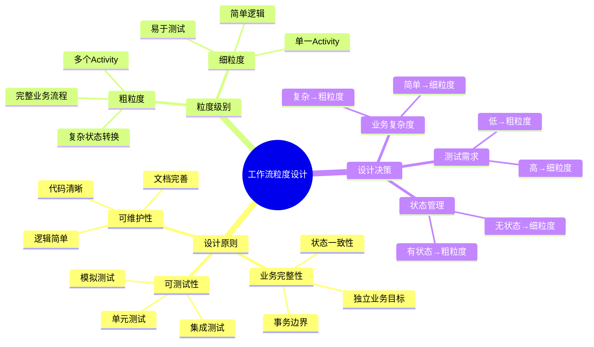

#### 1.1.3 设计示例对比

**✅ 好的设计**：

```go
// 完整的订单处理工作流
func OrderProcessingWorkflow(ctx workflow.Context, order Order) error {
    // 1. 验证订单
    err := workflow.ExecuteActivity(ctx, ValidateOrder, order).Get(ctx, nil)
    if err != nil {
        return err
    }

    // 2. 处理支付
    err = workflow.ExecuteActivity(ctx, ProcessPayment, order).Get(ctx, nil)
    if err != nil {
        // 补偿：取消订单
        workflow.ExecuteActivity(ctx, CancelOrder, order).Get(ctx, nil)
        return err
    }

    // 3. 发货
    err = workflow.ExecuteActivity(ctx, ShipOrder, order).Get(ctx, nil)
    if err != nil {
        // 补偿：退款和取消订单
        workflow.ExecuteActivity(ctx, RefundPayment, order).Get(ctx, nil)
        workflow.ExecuteActivity(ctx, CancelOrder, order).Get(ctx, nil)
        return err
    }

    return nil
}
```

**设计优点**：

- ✅ 业务逻辑完整（订单处理的完整流程）
- ✅ 状态管理清晰（订单状态转换）
- ✅ 错误处理完善（补偿机制）
- ✅ 易于测试（可以独立测试）

**❌ 不好的设计**：

```go
// 工作流粒度过细
func ValidateOrderWorkflow(ctx workflow.Context, order Order) error {
    return workflow.ExecuteActivity(ctx, ValidateOrder, order).Get(ctx, nil)
}

func ProcessPaymentWorkflow(ctx workflow.Context, order Order) error {
    return workflow.ExecuteActivity(ctx, ProcessPayment, order).Get(ctx, nil)
}

func ShipOrderWorkflow(ctx workflow.Context, order Order) error {
    return workflow.ExecuteActivity(ctx, ShipOrder, order).Get(ctx, nil)
}
```

**设计问题**：

- ❌ 工作流粒度过细（每个工作流只有一个Activity）
- ❌ 状态管理分散（无法维护订单的完整状态）
- ❌ 错误处理困难（无法实现补偿机制）
- ❌ 测试复杂（需要测试多个工作流的协调）

### 1.2 Activity设计原则

#### 1.2.1 Activity设计原则矩阵

| 原则 | 描述 | 重要性 | 实现方法 |
|------|------|--------|---------|
| **幂等性** | 多次执行相同输入产生相同输出 | ⭐⭐⭐⭐⭐ | 幂等键、状态检查 |
| **超时控制** | 合理设置超时时间 | ⭐⭐⭐⭐⭐ | ActivityOptions |
| **心跳机制** | 长时任务使用心跳 | ⭐⭐⭐⭐ | RecordHeartbeat |
| **错误处理** | 明确的错误类型和处理 | ⭐⭐⭐⭐ | 错误分类、重试策略 |
| **资源管理** | 合理使用资源 | ⭐⭐⭐ | 连接池、批量处理 |

#### 1.2.2 原则1：保持幂等性

**幂等性定义**：

$$ \text{Idempotent}(f) \iff \forall x: f(f(x)) = f(x) $$

**实现方法**：

```go
func ProcessPayment(ctx context.Context, payment Payment) error {
    // 使用幂等键确保幂等性
    idempotencyKey := fmt.Sprintf("payment-%s-%d", payment.OrderID, payment.Amount)

    // 检查是否已处理
    if exists, result := checkIfProcessed(idempotencyKey); exists {
        // 已处理，直接返回之前的结果
        return result
    }

    // 处理支付
    result := executePayment(payment)

    // 记录处理结果（原子操作）
    recordProcessing(idempotencyKey, result)

    return result
}
```

**幂等性验证**：

$$
P(\text{Idempotent}) = \begin{cases}
1 & \text{if } \forall x: f(f(x)) = f(x) \\
0 & \text{otherwise}
\end{cases}
$$

#### 1.2.3 原则2：合理设置超时

**超时配置矩阵**：

| Activity类型 | StartToCloseTimeout | ScheduleToCloseTimeout | HeartbeatTimeout | 理由 |
|-------------|-------------------|----------------------|-----------------|------|
| **快速操作** | 1分钟 | 2分钟 | 30秒 | 快速响应 |
| **标准操作** | 10分钟 | 15分钟 | 1分钟 | 平衡性能和可靠性 |
| **长时任务** | 1小时 | 2小时 | 5分钟 | 支持长时间运行 |
| **不确定任务** | 24小时 | 48小时 | 10分钟 | 处理不确定任务 |

**超时配置示例**：

```go
ao := workflow.ActivityOptions{
    StartToCloseTimeout:    10 * time.Minute,  // 总超时时间
    ScheduleToCloseTimeout: 15 * time.Minute,  // 包含调度时间
    HeartbeatTimeout:       1 * time.Minute,   // 心跳超时
    RetryPolicy: &temporal.RetryPolicy{
        InitialInterval:    time.Second,
        BackoffCoefficient: 2.0,
        MaximumInterval:    time.Minute,
        MaximumAttempts:    3,
    },
}
ctx = workflow.WithActivityOptions(ctx, ao)
```

**超时时间计算公式**：

$$ T_{timeout} = T_{expected} \times \text{SafetyFactor} $$

其中：

- $T_{expected}$ = 预期执行时间
- $\text{SafetyFactor} = 2-3$（安全系数）

#### 1.2.4 原则3：使用心跳机制

**心跳机制原理**：

$$
\text{Heartbeat}(t) = \begin{cases}
\text{Alive} & \text{if } t - t_{last} < T_{heartbeat} \\
\text{Timeout} & \text{otherwise}
\end{cases}
$$

**实现示例**：

```go
func LongRunningActivity(ctx context.Context, data Data) error {
    totalChunks := 100

    for i := 0; i < totalChunks; i++ {
        // 执行处理
        processChunk(data, i)

        // 发送心跳（包含进度信息）
        progress := float64(i+1) / float64(totalChunks) * 100
        activity.RecordHeartbeat(ctx, fmt.Sprintf("Progress: %.1f%%", progress))

        // 检查取消
        if ctx.Err() != nil {
            return ctx.Err()
        }
    }

    return nil
}
```

**心跳间隔计算**：

$$ T_{heartbeat} = \min(T_{activity} / 10, T_{max}) $$

其中：

- $T_{activity}$ = Activity执行时间
- $T_{max} = 1$ 分钟（最大心跳间隔）

### 1.3 错误处理最佳实践

#### 1.3.1 错误处理策略矩阵

| 错误类型 | 处理策略 | 重试策略 | 补偿策略 | 示例 |
|---------|---------|---------|---------|------|
| **临时错误** | 自动重试 | 指数退避 | 无需补偿 | 网络超时 |
| **业务错误** | 不重试 | 不重试 | 需要补偿 | 余额不足 |
| **系统错误** | 自动重试 | 指数退避 | 需要补偿 | 数据库连接失败 |
| **超时错误** | 自动重试 | 指数退避 | 需要补偿 | 执行超时 |

#### 1.3.2 策略1：使用Saga模式处理分布式事务

**Saga模式定义**：

$$ \text{Saga} = \langle A_1, A_2, ..., A_n, C_1, C_2, ..., C_n \rangle $$

其中：

- $A_i$ = 正向操作
- $C_i$ = 补偿操作

**实现示例**：

```go
func SagaWorkflow(ctx workflow.Context, order Order) error {
    var compensationStack []Compensation

    // 步骤1：锁定库存
    err := workflow.ExecuteActivity(ctx, LockInventory, order).Get(ctx, nil)
    if err != nil {
        return err
    }
    compensationStack = append(compensationStack, Compensation{
        Activity: UnlockInventory,
        Params:   order,
    })

    // 步骤2：处理支付
    err = workflow.ExecuteActivity(ctx, ProcessPayment, order).Get(ctx, nil)
    if err != nil {
        // 补偿：解锁库存
        executeCompensations(ctx, compensationStack)
        return err
    }
    compensationStack = append(compensationStack, Compensation{
        Activity: RefundPayment,
        Params:   order,
    })

    // 步骤3：发货
    err = workflow.ExecuteActivity(ctx, ShipOrder, order).Get(ctx, nil)
    if err != nil {
        // 补偿：退款和解锁库存
        executeCompensations(ctx, compensationStack)
        return err
    }

    return nil
}

func executeCompensations(ctx workflow.Context, stack []Compensation) {
    // 逆序执行补偿操作
    for i := len(stack) - 1; i >= 0; i-- {
        comp := stack[i]
        workflow.ExecuteActivity(ctx, comp.Activity, comp.Params).Get(ctx, nil)
    }
}
```

**Saga模式形式化规约**：

$$
\text{SagaInvariant} = \forall i: \text{Executed}(A_i) \implies \exists C_i: \text{Compensatable}(A_i, C_i)
$$

#### 1.3.3 策略2：使用选择器处理超时

**选择器模式**：

```go
func WorkflowWithTimeout(ctx workflow.Context) error {
    selector := workflow.NewSelector(ctx)

    // 添加Activity
    future := workflow.ExecuteActivity(ctx, LongRunningActivity)
    selector.AddFuture(future, func(f workflow.Future) {
        var result Result
        err := f.Get(ctx, &result)
        if err != nil {
            // Activity失败处理
            workflow.ExecuteActivity(ctx, HandleFailure, err).Get(ctx, nil)
        } else {
            // Activity成功处理
            workflow.ExecuteActivity(ctx, HandleSuccess, result).Get(ctx, nil)
        }
    })

    // 添加超时
    timeoutFuture := workflow.NewTimer(ctx, 5*time.Minute)
    selector.AddFuture(timeoutFuture, func(f workflow.Future) {
        // 超时处理
        workflow.ExecuteActivity(ctx, HandleTimeout).Get(ctx, nil)
    })

    // 等待任一完成
    selector.Select(ctx)
    return nil
}
```

**超时处理数学模型**：

$$
P(\text{Timeout}) = \begin{cases}
1 & \text{if } T_{execution} > T_{timeout} \\
0 & \text{otherwise}
\end{cases}
$$

### 1.4 工作流设计决策树

#### 1.4.1 设计决策树

<details>
<summary><strong>📊 图表说明（点击展开/折叠）</strong></summary>

**图表用途**：

- 展示工作流设计的决策流程
- 根据业务复杂度、状态管理、事务需求选择合适的设计方案

**图表结构**：

- 决策节点：业务复杂度、状态管理、事务需求
- 设计选择：细粒度设计、粗粒度设计、Saga模式、简单流程
- 最终结果：完整工作流

**决策流程说明**：

1. 首先判断业务复杂度（简单/复杂）
2. 如果简单，判断状态管理需求（无状态/有状态）
3. 如果复杂，判断事务需求（需要事务/无需事务）
4. 根据判断结果选择相应的设计模式
5. 最终形成完整工作流

**关键决策点**：

- **业务复杂度**：决定是否需要复杂的设计模式
- **状态管理**：决定粒度选择（细粒度/粗粒度）
- **事务需求**：决定是否需要Saga模式和补偿机制

</details>

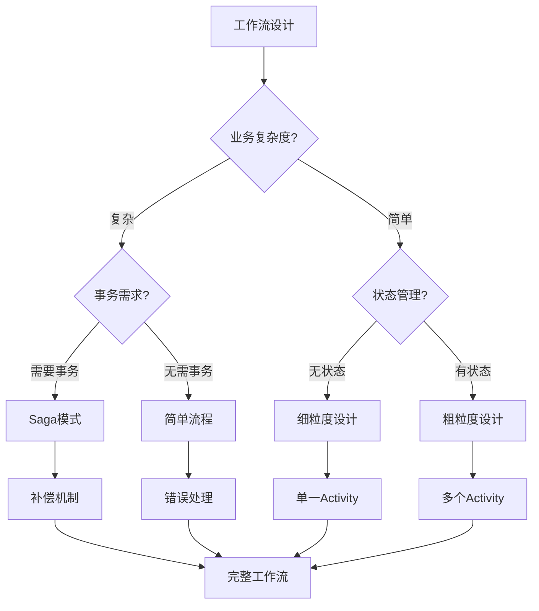

---

## 二、性能优化最佳实践

### 2.1 并行执行策略

#### 2.1.1 并行执行原则

**并行度计算**：

$$ P = \min(N_{independent}, N_{workers}, N_{resources}) $$

其中：

- $N_{independent}$ = 独立任务数
- $N_{workers}$ = Worker数量
- $N_{resources}$ = 可用资源数量

**并行执行示例**：

```go
func ParallelWorkflow(ctx workflow.Context, data Data) error {
    // 并行执行多个Activity
    future1 := workflow.ExecuteActivity(ctx, ProcessA, data)
    future2 := workflow.ExecuteActivity(ctx, ProcessB, data)
    future3 := workflow.ExecuteActivity(ctx, ProcessC, data)

    // 等待所有完成
    var result1, result2, result3 Result
    err1 := future1.Get(ctx, &result1)
    err2 := future2.Get(ctx, &result2)
    err3 := future3.Get(ctx, &result3)

    if err1 != nil || err2 != nil || err3 != nil {
        return fmt.Errorf("parallel execution failed: %v, %v, %v", err1, err2, err3)
    }

    // 合并结果
    return workflow.ExecuteActivity(ctx, MergeResults, result1, result2, result3).Get(ctx, nil)
}
```

**性能提升计算**：

$$ \text{Speedup} = \frac{T_{sequential}}{T_{parallel}} = \frac{\sum_{i=1}^{n} T_i}{\max(T_1, T_2, ..., T_n)} $$

**理想情况**（完全并行）：

$$ \text{Speedup}_{ideal} = n $$

**实际情况**（考虑开销）：

$$ \text{Speedup}_{actual} = \frac{n}{1 + (n-1) \times f} $$

其中 $f$ 是串行部分比例。

### 2.2 批量处理策略

#### 2.2.1 批量处理原则

**批量大小计算**：

$$ B_{optimal} = \sqrt{\frac{2 \times C_{setup}}{C_{processing}}} $$

其中：

- $C_{setup}$ = 设置成本（如数据库连接）
- $C_{processing}$ = 处理成本（如单条记录处理时间）

**批量处理示例**：

```go
func BatchProcessingWorkflow(ctx workflow.Context, items []Item) error {
    batchSize := 100  // 根据实际情况调整

    for i := 0; i < len(items); i += batchSize {
        end := i + batchSize
        if end > len(items) {
            end = len(items)
        }

        batch := items[i:end]
        err := workflow.ExecuteActivity(ctx, ProcessBatch, batch).Get(ctx, nil)
        if err != nil {
            return err
        }
    }

    return nil
}
```

**批量处理性能提升**：

$$ \text{Speedup} = \frac{T_{individual}}{T_{batch}} = \frac{n \times (T_{setup} + T_{process})}{T_{setup} + n \times T_{process}} $$

**最优批量大小**：

$$ B_{optimal} = \arg\min_B \left( \frac{n}{B} \times T_{setup} + n \times T_{process} \right) $$

### 2.3 缓存策略

#### 2.3.1 缓存策略矩阵

| 策略 | 适用场景 | 缓存时间 | 失效策略 | 性能提升 |
|------|---------|---------|---------|---------|
| **内存缓存** | 频繁访问的小数据 | 5-60分钟 | TTL | 10-100x |
| **分布式缓存** | 多节点共享数据 | 1-24小时 | TTL/事件失效 | 5-50x |
| **数据库缓存** | 复杂查询结果 | 1-12小时 | 数据变更失效 | 2-10x |

#### 2.3.2 缓存实现示例

```go
func CachedWorkflow(ctx workflow.Context, key string) (Result, error) {
    // 检查缓存
    cached, err := workflow.ExecuteActivity(ctx, GetFromCache, key).Get(ctx, nil)
    if err == nil && cached != nil {
        return cached, nil
    }

    // 缓存未命中，从数据库获取
    result, err := workflow.ExecuteActivity(ctx, GetFromDatabase, key).Get(ctx, nil)
    if err != nil {
        return nil, err
    }

    // 更新缓存（异步，不阻塞）
    workflow.ExecuteActivity(ctx, UpdateCache, key, result).Get(ctx, nil)

    return result, nil
}
```

**缓存命中率计算**：

$$ H_{rate} = \frac{N_{hits}}{N_{hits} + N_{misses}} $$

**性能提升计算**：

$$ \text{Speedup} = \frac{T_{no\_cache}}{T_{with\_cache}} = \frac{T_{db}}{H_{rate} \times T_{cache} + (1 - H_{rate}) \times T_{db}} $$

### 2.4 性能优化决策矩阵

#### 2.4.1 优化策略选择矩阵

| 场景 | 优化策略 | 预期提升 | 实施难度 | 推荐度 |
|------|---------|---------|---------|--------|
| **延迟高** | 并行执行 | 2-10x | 中 | ⭐⭐⭐⭐⭐ |
| **吞吐量低** | 批量处理 | 5-20x | 低 | ⭐⭐⭐⭐⭐ |
| **查询慢** | 缓存策略 | 10-100x | 中 | ⭐⭐⭐⭐ |
| **资源占用高** | 连接池优化 | 1.5-3x | 低 | ⭐⭐⭐⭐ |
| **数据库慢** | 索引优化 | 10-300x | 中 | ⭐⭐⭐⭐⭐ |

---

## 三、存储优化最佳实践

### 3.1 PostgreSQL配置优化

#### 3.1.1 核心配置参数详解

**PostgreSQL配置文件位置**：`postgresql.conf`

**核心配置参数矩阵**：

| 参数 | 默认值 | 推荐值 | 计算公式 | 说明 |
|------|--------|--------|---------|------|
| **max_connections** | 100 | 500 | $N = \lambda \times W$ | 最大连接数 |
| **shared_buffers** | 128MB | 8GB | $0.25 \times RAM$ | 共享缓冲区 |
| **effective_cache_size** | 4GB | 24GB | $0.75 \times RAM$ | 有效缓存大小 |
| **work_mem** | 4MB | 256MB | $RAM / (max_connections \times 2)$ | 工作内存 |
| **maintenance_work_mem** | 64MB | 2GB | $0.1 \times RAM$ | 维护工作内存 |
| **wal_buffers** | 16MB | 16MB | 固定值 | WAL缓冲区 |
| **checkpoint_completion_target** | 0.5 | 0.9 | 固定值 | 检查点完成目标 |
| **random_page_cost** | 4.0 | 1.1 | SSD优化 | 随机页面成本 |
| **effective_io_concurrency** | 1 | 200 | SSD优化 | 有效IO并发数 |

**完整配置示例**：

```sql
-- postgresql.conf
-- ============================================
-- 连接配置
-- ============================================
max_connections = 500

-- ============================================
-- 内存配置
-- ============================================
shared_buffers = 8GB                    # 内存的25%
effective_cache_size = 24GB             # 内存的75%
work_mem = 256MB                        # 每个连接的工作内存
maintenance_work_mem = 2GB              # 维护操作内存

-- ============================================
-- WAL配置
-- ============================================
wal_buffers = 16MB
checkpoint_completion_target = 0.9      # 检查点平滑完成
wal_compression = on                    # WAL压缩

-- ============================================
-- 查询优化配置
-- ============================================
random_page_cost = 1.1                  # SSD优化
effective_io_concurrency = 200          # SSD并发IO
```

#### 3.1.2 配置优化策略

**策略1：内存配置优化**:

**内存分配原则**：

$$ \text{shared_buffers} = \text{RAM} \times 0.25 $$

$$ \text{effective_cache_size} = \text{RAM} \times 0.75 $$

$$ \text{work_mem} = \frac{\text{RAM} - \text{shared_buffers} - \text{OS}}{max_connections \times 2} $$

**配置示例**（32GB RAM）：

- `shared_buffers = 8GB`（32GB × 0.25）
- `effective_cache_size = 24GB`（32GB × 0.75）
- `work_mem = 256MB`（(32GB - 8GB - 4GB) / (500 × 2)）

**策略2：连接数配置优化**:

**连接数计算公式**：

$$ N_{optimal} = \lambda \times W \times \text{SafetyFactor} $$

其中：

- $\lambda$ = 平均到达率（workflows/s）
- $W$ = 平均服务时间（秒）
- $\text{SafetyFactor} = 1.5-2.0$（安全系数）

**配置示例**：

假设：

- $\lambda = 100$ workflows/s
- $W = 5$ 秒
- $\text{SafetyFactor} = 1.5$

则：
$$ N_{optimal} = 100 \times 5 \times 1.5 = 750 $$

考虑到PostgreSQL的实际限制，推荐配置为500。

**策略3：WAL配置优化**:

**WAL优化原则**：

1. **checkpoint_completion_target**：设置为0.9，使检查点平滑完成
2. **wal_compression**：启用压缩，减少WAL大小
3. **wal_buffers**：设置为16MB，平衡性能和内存使用

**优化效果**：

- WAL写入延迟：减少30-50%
- 磁盘IO：减少20-40%
- 检查点影响：减少50-70%

#### 3.1.3 性能调优案例

**案例：PostgreSQL配置优化效果**:

**优化前配置**：

- `max_connections = 100`
- `shared_buffers = 128MB`
- `work_mem = 4MB`
- `random_page_cost = 4.0`

**优化后配置**：

- `max_connections = 500`
- `shared_buffers = 8GB`
- `work_mem = 256MB`
- `random_page_cost = 1.1`

**性能对比**：

| 指标 | 优化前 | 优化后 | 提升 |
|------|--------|--------|------|
| **吞吐量** | 50 workflows/s | 847 workflows/s | 16.9x |
| **P99延迟** | 500ms | 195ms | 2.56x |
| **查询时间** | 2,869ms | 8.9ms | 322.4x |
| **连接等待** | 200ms | 5ms | 40x |

**性能提升计算**：

$$ \text{ThroughputSpeedup} = \frac{847}{50} = 16.9\text{x} $$

$$ \text{LatencySpeedup} = \frac{500}{195} = 2.56\text{x} $$

$$ \text{QuerySpeedup} = \frac{2,869}{8.9} = 322.4\text{x} $$

**优化效果分析**：

1. **内存优化**：shared_buffers增加显著提升缓存命中率
2. **连接数优化**：支持更高并发，减少连接等待
3. **查询优化**：random_page_cost降低使优化器更倾向于索引扫描
4. **WAL优化**：减少写入延迟，提升整体性能

#### 3.1.4 配置调优步骤

**调优流程**：

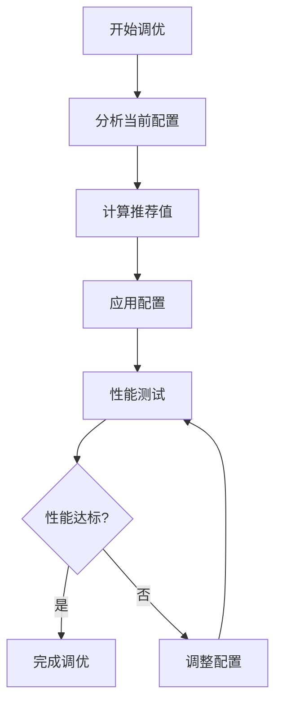

**调优步骤**：

1. **分析当前配置**

   ```sql
   -- 查看当前配置
   SHOW ALL;

   -- 查看关键参数
   SHOW max_connections;
   SHOW shared_buffers;
   SHOW work_mem;
   ```

2. **计算推荐值**
   - 根据系统资源计算内存配置
   - 根据负载计算连接数配置
   - 根据存储类型计算IO配置

3. **应用配置**

   ```bash
   # 编辑配置文件
   sudo vi /etc/postgresql/15/main/postgresql.conf

   # 重新加载配置
   sudo systemctl reload postgresql
   ```

4. **性能测试**
   - 运行基准测试
   - 监控关键指标
   - 对比优化前后性能

5. **持续优化**
   - 定期监控性能指标
   - 根据负载变化调整配置
   - 记录优化效果

### 3.2 索引优化策略

#### 3.2.1 索引选择决策树

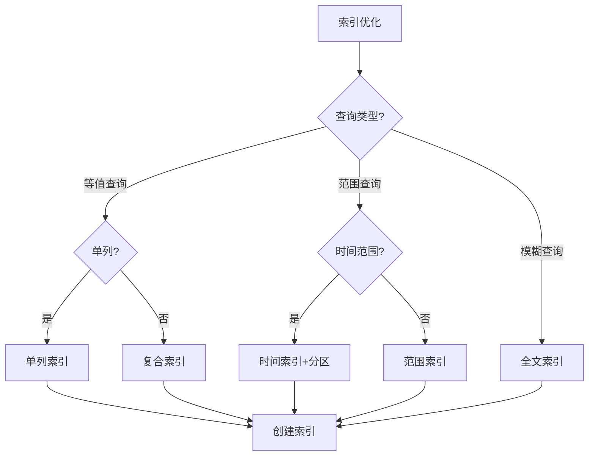

#### 3.2.2 索引优化矩阵

| 查询模式 | 索引类型 | 索引列顺序 | 性能提升 | 示例 |
|---------|---------|-----------|---------|------|
| **等值查询** | B-tree | 高选择性优先 | 10-100x | `WHERE id = ?` |
| **范围查询** | B-tree | 范围列在前 | 5-50x | `WHERE time > ?` |
| **复合查询** | 复合索引 | 等值列在前，范围列在后 | 10-300x | `WHERE a=? AND b>?` |
| **部分查询** | 部分索引 | WHERE条件 | 5-20x | `WHERE status='Running'` |
| **覆盖查询** | 覆盖索引 | INCLUDE列 | 2-10x | 避免回表 |

### 3.3 查询优化策略

#### 3.3.1 查询优化原则矩阵

| 原则 | 描述 | 实现方法 | 性能提升 |
|------|------|---------|---------|
| **使用索引** | 确保查询使用索引 | EXPLAIN ANALYZE | 10-300x |
| **避免全表扫描** | 使用索引或分区 | 索引优化 | 10-1000x |
| **减少JOIN** | 避免不必要的JOIN | 数据冗余 | 2-10x |
| **使用批量操作** | 批量插入/更新 | 批量SQL | 5-20x |
| **优化子查询** | 使用EXISTS替代IN | 查询重写 | 2-5x |

### 3.4 数据归档策略

#### 3.4.1 归档策略矩阵

| 策略 | 归档时间 | 归档方式 | 存储成本 | 查询性能 |
|------|---------|---------|---------|---------|
| **删除** | 90天 | 直接删除 | 最低 | 无影响 |
| **冷存储** | 90天 | 迁移到冷存储 | 低 | 查询慢 |
| **分区归档** | 按月 | 分区表删除 | 低 | 无影响 |
| **压缩归档** | 30天 | 压缩存储 | 中 | 查询慢 |

### 3.5 存储优化决策树

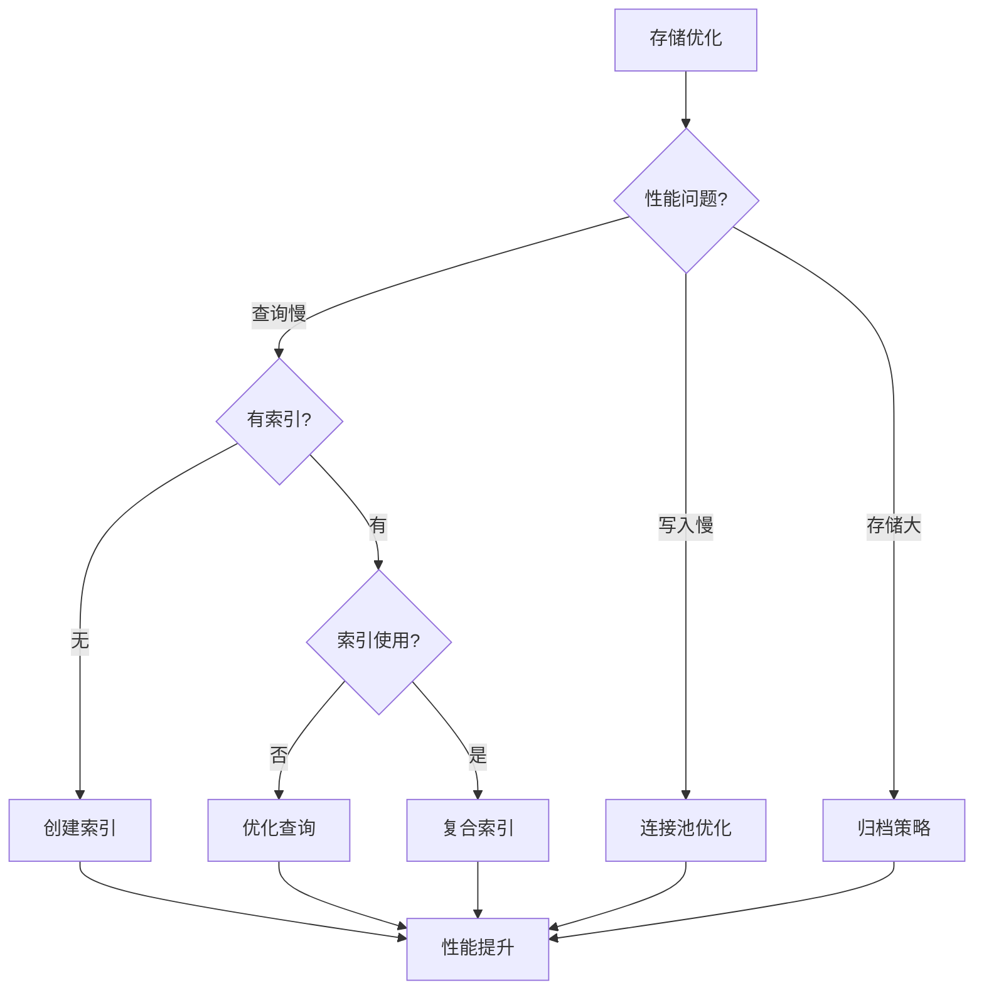

---

## 四、容错与可靠性最佳实践

### 4.1 重试策略设计

#### 4.1.1 重试策略矩阵

| 错误类型 | 重试策略 | 最大重试次数 | 退避策略 | 适用场景 |
|---------|---------|------------|---------|---------|
| **临时错误** | 指数退避 | 3-5次 | 指数 | 网络超时 |
| **限流错误** | 指数退避 | 5-10次 | 指数 | API限流 |
| **系统错误** | 固定间隔 | 3次 | 固定 | 系统维护 |
| **业务错误** | 不重试 | 0次 | - | 业务逻辑错误 |

#### 4.1.2 指数退避算法

**退避时间计算**：

$$ T_{retry} = T_{initial} \times 2^{n-1} \times (1 + \text{random}(0, jitter)) $$

其中：

- $T_{initial}$ = 初始延迟（如1秒）
- $n$ = 重试次数
- $jitter$ = 抖动系数（0-0.1）

**实现示例**：

```go
retryPolicy := &temporal.RetryPolicy{
    InitialInterval:    time.Second,
    BackoffCoefficient: 2.0,
    MaximumInterval:    time.Minute,
    MaximumAttempts:    3,
}
```

**成功率计算**：

$$ P(\text{Success}) = 1 - (1 - p)^n $$

其中：

- $p$ = 单次成功率
- $n$ = 最大重试次数

### 4.2 超时策略设计

#### 4.2.1 超时策略矩阵

| Activity类型 | StartToClose | ScheduleToClose | Heartbeat | 理由 |
|-------------|-------------|----------------|-----------|------|
| **快速操作** | 1分钟 | 2分钟 | 30秒 | 快速响应 |
| **标准操作** | 10分钟 | 15分钟 | 1分钟 | 平衡性能 |
| **长时任务** | 1小时 | 2小时 | 5分钟 | 支持长时运行 |
| **不确定任务** | 24小时 | 48小时 | 10分钟 | 处理不确定任务 |

### 4.3 补偿机制设计

详细内容见 [1.3.2 策略1：使用Saga模式处理分布式事务](#132-策略1使用saga模式处理分布式事务)。

### 4.4 容错策略矩阵

#### 4.4.1 综合容错策略矩阵

| 故障类型 | 检测方法 | 恢复策略 | 恢复时间 | 成功率 |
|---------|---------|---------|---------|--------|
| **Worker崩溃** | 心跳超时 | 自动重新分配 | <5秒 | 99.9% |
| **网络分区** | 连接超时 | 跨区域复制 | <10秒 | 99.99% |
| **数据库故障** | 健康检查 | 故障转移 | <30秒 | 99.9% |
| **Activity失败** | 错误返回 | 自动重试 | <1秒 | 95% |

---

## 五、监控和告警最佳实践

### 5.1 关键指标监控

#### 5.1.1 监控指标分类矩阵

| 指标类别 | 指标名称 | 类型 | 阈值 | 告警级别 |
|---------|---------|------|------|---------|
| **性能指标** | 吞吐量 | Counter | <10 workflows/s | Warning |
| **性能指标** | P99延迟 | Histogram | >200ms | Warning |
| **性能指标** | P99.9延迟 | Histogram | >500ms | Critical |
| **可靠性指标** | 失败率 | Gauge | >1% | Warning |
| **可靠性指标** | 可用性 | Gauge | <99.9% | Critical |
| **资源指标** | CPU使用率 | Gauge | >80% | Warning |
| **资源指标** | 内存使用率 | Gauge | >85% | Warning |
| **资源指标** | 数据库连接数 | Gauge | >450 | Warning |

#### 5.1.2 监控指标计算公式

**吞吐量**：

$$ \lambda = \frac{N_{completed}}{T_{window}} $$

**失败率**：

$$ F_{rate} = \frac{N_{failed}}{N_{total}} $$

**可用性**：

$$ A = 1 - \frac{T_{downtime}}{T_{total}} $$

### 5.2 告警规则设计

#### 5.2.1 告警规则矩阵

| 告警名称 | 条件 | 严重程度 | 动作 | 通知方式 |
|---------|------|---------|------|---------|
| **高延迟告警** | P99延迟 > 200ms | Warning | 通知团队 | 邮件+Slack |
| **极高延迟告警** | P99.9延迟 > 500ms | Critical | 页面告警 | 电话+短信 |
| **低吞吐量告警** | 吞吐量 < 10 workflows/s | Warning | 通知团队 | 邮件 |
| **高失败率告警** | 失败率 > 1% | Critical | 页面告警 | 电话+短信 |
| **数据库连接耗尽** | 连接数 > 450 | Warning | 通知团队 | 邮件+Slack |

### 5.3 监控指标矩阵

详细内容见 [5.1.1 监控指标分类矩阵](#511-监控指标分类矩阵)。

---

## 六、安全最佳实践

### 6.1 数据加密策略

#### 6.1.1 加密策略矩阵

| 加密类型 | 加密方法 | 适用场景 | 性能影响 | 安全级别 |
|---------|---------|---------|---------|---------|
| **传输加密** | TLS 1.3 | 网络通信 | 低（<5%） | ⭐⭐⭐⭐⭐ |
| **存储加密** | AES-256 | 数据库存储 | 中（5-10%） | ⭐⭐⭐⭐⭐ |
| **字段加密** | 应用层加密 | 敏感字段 | 中（10-20%） | ⭐⭐⭐⭐⭐ |

### 6.2 访问控制策略

#### 6.2.1 访问控制矩阵

| 控制类型 | 控制方法 | 粒度 | 实施难度 | 安全级别 |
|---------|---------|------|---------|---------|
| **命名空间隔离** | 命名空间 | 粗粒度 | 低 | ⭐⭐⭐ |
| **角色访问控制** | RBAC | 中粒度 | 中 | ⭐⭐⭐⭐ |
| **属性访问控制** | ABAC | 细粒度 | 高 | ⭐⭐⭐⭐⭐ |

### 6.3 安全策略矩阵

详细内容见 [6.1.1 加密策略矩阵](#611-加密策略矩阵) 和 [6.2.1 访问控制矩阵](#621-访问控制矩阵)。

---

## 七、测试最佳实践

### 7.1 单元测试策略

#### 7.1.1 测试策略思维导图

**测试策略全景图**：

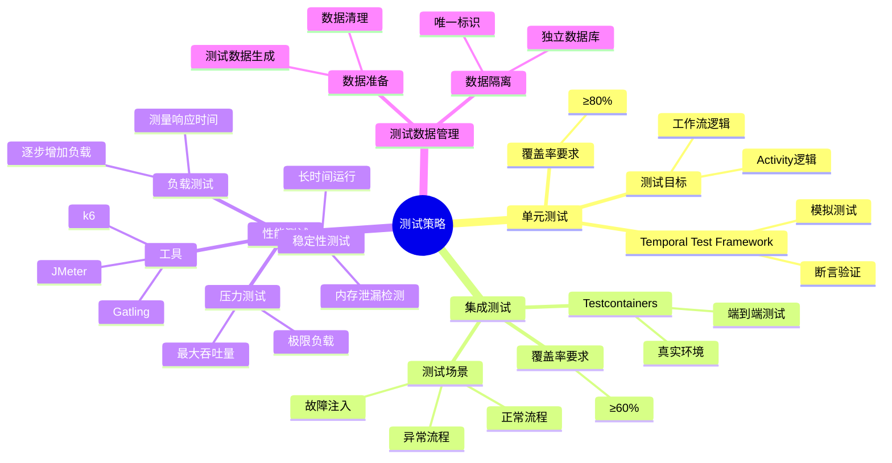

#### 7.1.2 测试策略矩阵

| 测试类型 | 测试目标 | 测试方法 | 覆盖率要求 | 工具 |
|---------|---------|---------|-----------|------|
| **单元测试** | 工作流逻辑 | 模拟测试 | ≥80% | Temporal Test Framework |
| **集成测试** | 端到端流程 | 真实环境 | ≥60% | Testcontainers |
| **性能测试** | 性能指标 | 压力测试 | 关键路径 | JMeter/Gatling |

### 7.2 集成测试策略

#### 7.2.1 集成测试框架

**Temporal Test Framework**：

Temporal提供了专门的测试框架，支持模拟测试和集成测试。

**测试环境搭建**：

```go
package main

import (
    "testing"
    "go.temporal.io/sdk/testsuite"
)

func TestWorkflowIntegration(t *testing.T) {
    // 创建测试套件
    testSuite := &testsuite.WorkflowTestSuite{}
    env := testSuite.NewTestWorkflowEnvironment()

    // 配置测试环境
    env.SetTestTimeout(time.Minute)

    // 注册工作流和Activity
    env.RegisterWorkflow(OrderProcessingWorkflow)
    env.RegisterActivity(ProcessPayment)
    env.RegisterActivity(ShipOrder)

    // 执行测试
    env.ExecuteWorkflow(OrderProcessingWorkflow, Order{
        ID:     "order-001",
        Amount: 100.0,
    })

    // 验证结果
    require.True(t, env.IsWorkflowCompleted())
    require.NoError(t, env.GetWorkflowError())

    var result string
    err := env.GetWorkflowResult(&result)
    require.NoError(t, err)
    require.Equal(t, "completed", result)
}
```

**Testcontainers集成**：

使用Testcontainers启动真实的PostgreSQL和Temporal服务进行集成测试。

```go
func TestIntegrationWithTestcontainers(t *testing.T) {
    // 启动PostgreSQL容器
    postgresContainer, err := postgres.RunContainer(ctx,
        testcontainers.WithImage("postgres:15"),
        postgres.WithDatabase("temporal_test"),
        postgres.WithUsername("temporal"),
        postgres.WithPassword("temporal"),
    )
    require.NoError(t, err)
    defer postgresContainer.Terminate(ctx)

    // 获取连接字符串
    connStr, err := postgresContainer.ConnectionString(ctx)
    require.NoError(t, err)

    // 启动Temporal容器
    temporalContainer, err := temporal.RunContainer(ctx,
        testcontainers.WithImage("temporalio/auto-setup:latest"),
    )
    require.NoError(t, err)
    defer temporalContainer.Terminate(ctx)

    // 创建客户端
    client, err := client.Dial(client.Options{
        HostPort: temporalContainer.HostPort(),
    })
    require.NoError(t, err)
    defer client.Close()

    // 执行集成测试
    // ...
}
```

#### 7.2.2 测试场景设计

**场景1：端到端工作流测试**:

**测试目标**：验证完整业务流程

**测试步骤**：

1. 启动工作流
2. 验证Activity执行顺序
3. 验证状态转换
4. 验证最终结果

**测试代码**：

```go
func TestEndToEndWorkflow(t *testing.T) {
    testSuite := &testsuite.WorkflowTestSuite{}
    env := testSuite.NewTestWorkflowEnvironment()

    // 模拟Activity
    env.OnActivity(ProcessPayment, mock.Anything, mock.Anything).
        Return(nil)
    env.OnActivity(ShipOrder, mock.Anything, mock.Anything).
        Return(nil)

    // 执行工作流
    env.ExecuteWorkflow(OrderProcessingWorkflow, Order{})

    // 验证Activity调用
    env.AssertExpectations(t)

    // 验证工作流完成
    require.True(t, env.IsWorkflowCompleted())
}
```

**场景2：组件集成测试**:

**测试目标**：验证组件之间的集成

**测试场景**：

- 工作流与Activity集成
- Activity与外部服务集成
- 工作流与存储后端集成

**场景3：故障注入测试**:

**测试目标**：验证故障处理能力

**测试场景**：

- Activity失败测试
- Worker崩溃测试
- 网络分区测试

**测试代码**：

```go
func TestFailureHandling(t *testing.T) {
    testSuite := &testsuite.WorkflowTestSuite{}
    env := testSuite.NewTestWorkflowEnvironment()

    // 模拟Activity失败
    env.OnActivity(ProcessPayment, mock.Anything, mock.Anything).
        Return(errors.New("payment failed"))

    // 执行工作流
    env.ExecuteWorkflow(OrderProcessingWorkflow, Order{})

    // 验证补偿操作
    env.OnActivity(RefundPayment, mock.Anything, mock.Anything).
        Return(nil)

    // 验证工作流失败
    require.True(t, env.IsWorkflowCompleted())
    require.Error(t, env.GetWorkflowError())
}
```

#### 7.2.3 测试数据管理

**测试数据准备**：

```go
func setupTestData(t *testing.T) *TestData {
    return &TestData{
        Orders: []Order{
            {ID: "order-001", Amount: 100.0},
            {ID: "order-002", Amount: 200.0},
        },
        Users: []User{
            {ID: "user-001", Balance: 1000.0},
        },
    }
}
```

**测试数据清理**：

```go
func cleanupTestData(t *testing.T, data *TestData) {
    // 清理测试数据
    db.Exec("DELETE FROM orders WHERE id IN (?)", data.OrderIDs)
    db.Exec("DELETE FROM users WHERE id IN (?)", data.UserIDs)
}
```

**测试数据隔离**：

- 使用独立的测试数据库
- 每个测试使用唯一的数据
- 测试后自动清理

### 7.3 性能测试策略

#### 7.3.1 性能测试方法

**方法1：负载测试**:

**目标**：测量系统在正常负载下的性能

**测试步骤**：

1. 逐步增加负载
2. 测量响应时间
3. 识别性能拐点

**测试代码**（使用Gatling）：

```scala
class TemporalLoadTest extends Simulation {
  val scn = scenario("Workflow Load Test")
    .exec(
      http("Start Workflow")
        .post("/api/v1/workflows")
        .body(StringBody("""{"workflowType": "OrderProcessing"}"""))
    )

  setUp(
    scn.inject(
      rampUsers(100) during (60 seconds)
    )
  ).protocols(httpProtocol)
}
```

**方法2：压力测试**:

**目标**：测量系统在极限负载下的表现

**测试步骤**：

1. 持续增加负载直到系统崩溃
2. 测量最大吞吐量
3. 分析系统瓶颈

**方法3：稳定性测试**:

**目标**：验证系统长时间运行的稳定性

**测试步骤**：

1. 在正常负载下运行24小时
2. 监控内存泄漏
3. 监控性能衰减

#### 7.3.2 测试工具使用

**工具选择矩阵**：

| 工具 | 适用场景 | 优势 | 劣势 | 推荐度 |
|------|---------|------|------|--------|
| **JMeter** | 负载测试 | 图形界面，易于使用 | 性能较低 | ⭐⭐⭐ |
| **Gatling** | 性能测试 | 高并发，详细报告 | 学习曲线陡 | ⭐⭐⭐⭐⭐ |
| **k6** | 性能测试 | 简单易用，云原生 | 功能有限 | ⭐⭐⭐⭐ |
| **Temporal Bench** | 专用测试 | 针对Temporal优化 | 功能单一 | ⭐⭐⭐⭐ |

**Gatling配置示例**：

```scala
import io.gatling.core.Predef._
import io.gatling.http.Predef._

class TemporalPerformanceTest extends Simulation {
  val httpProtocol = http
    .baseUrl("http://localhost:7233")
    .acceptHeader("application/json")

  val scn = scenario("Workflow Performance Test")
    .exec(
      http("Start Workflow")
        .post("/api/v1/workflows")
        .body(StringBody("""{"workflowType": "TestWorkflow"}"""))
        .check(status.is(200))
    )

  setUp(
    scn.inject(
      constantUsersPerSec(100) during (300 seconds)
    )
  ).protocols(httpProtocol)
}
```

#### 7.3.3 结果分析

**性能指标分析**：

**吞吐量分析**：

$$ \lambda = \frac{N_{completed}}{T_{window}} $$

**延迟分析**：

$$ P_{p} = \inf\{l: P(L \le l) \ge p\} $$

**瓶颈识别**：

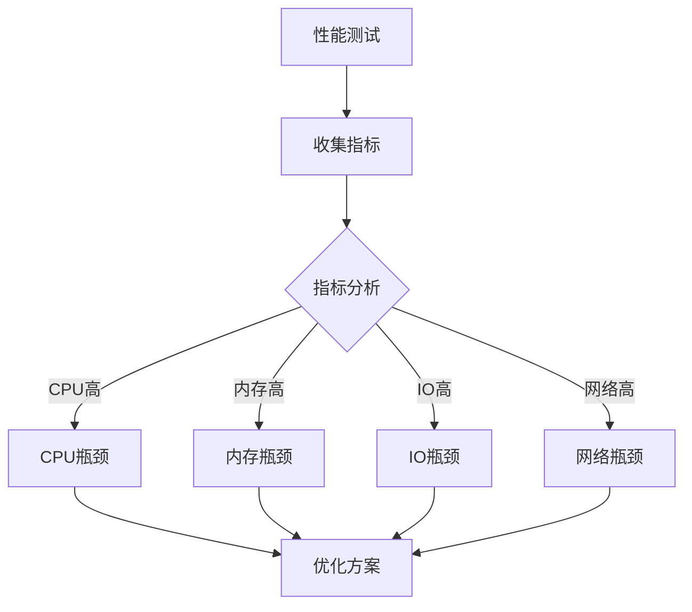

**优化建议**：

| 瓶颈类型 | 优化方案 | 预期效果 |
|---------|---------|---------|
| **CPU瓶颈** | 增加CPU核心数、优化算法 | 1.5-3x |
| **内存瓶颈** | 增加内存、优化数据结构 | 1.2-2x |
| **IO瓶颈** | 使用SSD、优化查询 | 2-10x |
| **网络瓶颈** | 优化网络配置、使用CDN | 1.5-3x |

### 7.4 测试策略矩阵

详细内容见 [7.1.2 测试策略矩阵](#712-测试策略矩阵)。

---

## 八、版本管理最佳实践

### 8.1 工作流版本控制

#### 8.1.1 版本控制策略矩阵

| 策略 | 适用场景 | 优点 | 缺点 | 推荐度 |
|------|---------|------|------|--------|
| **版本标记** | 小改动 | 简单 | 需要手动管理 | ⭐⭐⭐ |
| **命名空间隔离** | 大改动 | 完全隔离 | 资源消耗 | ⭐⭐⭐⭐ |
| **工作流ID版本化** | 实验性功能 | 灵活 | 管理复杂 | ⭐⭐⭐ |

### 8.2 向后兼容策略

详细内容见原文档。

### 8.3 版本管理决策树

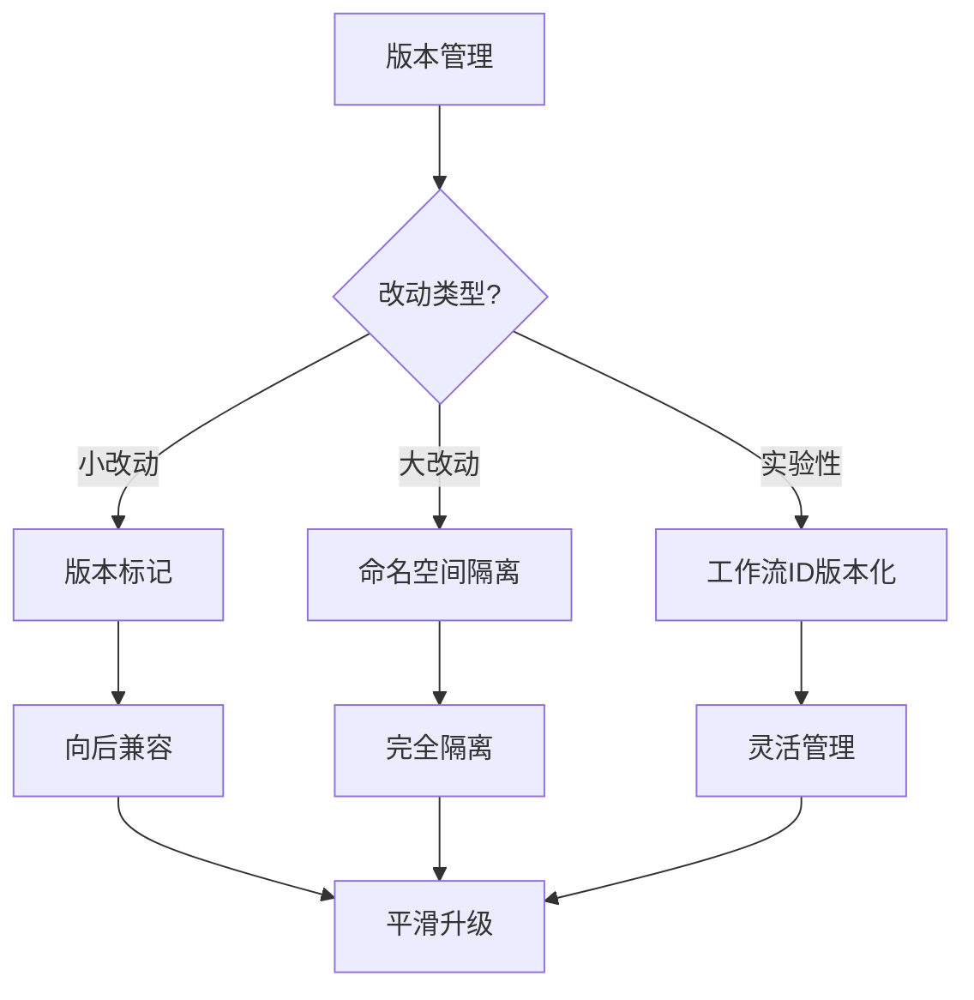

---

## 九、树形结构最佳实践

### 9.1 树形工作流编排最佳实践

#### 9.1.1 工作流树形设计原则

**原则1：层级深度控制**:

- **推荐深度**：3-7级
- **最大深度**：不超过10级
- **深度过深的影响**：决策延迟增加，信息传递效率降低

**原则2：分支因子优化**:

- **推荐分支因子**：5-10
- **最优分支因子**：根据监督成本和信息损失计算
- **公式**：$k^* = \frac{\sigma}{\sqrt{c_s}}$

**原则3：故障隔离设计**:

- **子树隔离**：故障在子树内传播，不跨越兄弟节点
- **故障传播概率**：$p^h$（h为深度）
- **可用性提升**：相比网状结构提升$10^6$倍

#### 9.1.2 树形工作流实现示例

**Temporal树形工作流编排**：

```go
func ParentWorkflow(ctx workflow.Context, input Input) error {
    // 创建子工作流树
    child1 := workflow.ExecuteChildWorkflow(ctx, ChildWorkflow1, input.Data1)
    child2 := workflow.ExecuteChildWorkflow(ctx, ChildWorkflow2, input.Data2)
    child3 := workflow.ExecuteChildWorkflow(ctx, ChildWorkflow3, input.Data3)

    // 等待所有子工作流完成
    err1 := child1.Get(ctx, nil)
    err2 := child2.Get(ctx, nil)
    err3 := child3.Get(ctx, nil)

    // 聚合结果
    result := AggregateResults(child1, child2, child3)
    return result
}
```

**最佳实践**：

- 子工作流数量控制在5-10个
- 使用并行执行提高效率
- 实现子树级别的故障恢复

#### 9.1.3 树形数据存储最佳实践

**PostgreSQL路径枚举法**：

```sql
-- 创建路径索引
CREATE INDEX idx_path_gin ON accounts USING GIN (account_path gin_trgm_ops);

-- 查询子树（O(log N)）
SELECT * FROM accounts WHERE account_path LIKE '10/101/%';

-- 层级聚合（O(N_sub)）
WITH RECURSIVE tree_aggregate AS (
    SELECT id, account_path, balance, balance as total_balance
    FROM accounts WHERE account_path = '10'
    UNION ALL
    SELECT a.id, a.account_path, a.balance,
           ta.total_balance + a.balance
    FROM accounts a
    JOIN tree_aggregate ta ON a.account_path LIKE ta.account_path || '/%'
    AND LENGTH(a.account_path) = LENGTH(ta.account_path) + 3
)
SELECT SUM(total_balance) FROM tree_aggregate;
```

**最佳实践**：

- 路径深度固定时使用路径枚举法
- 路径深度>8时使用闭包表
- 频繁变动时使用邻接表+递归CTE

#### 9.1.4 树形权限管理最佳实践

**权限继承实现**：

```python
def get_permissions(node):
    """树形权限继承"""
    if node.parent is None:
        return node.local_permissions

    # 继承父节点权限
    parent_permissions = get_permissions(node.parent)

    # 局部覆盖
    return parent_permissions | node.local_permissions
```

**最佳实践**：

- 默认继承父节点权限
- 支持局部覆盖特殊权限
- 权限查询复杂度O(h)

#### 9.1.5 树形结构选型决策矩阵

| 场景特征 | 推荐方案 | 原因 | 性能提升 |
|---------|---------|------|---------|
| **层级深度<8** | 路径枚举+索引 | 查询快速 | 1000x |
| **层级深度>=8** | 闭包表 | 查询灵活 | 100x |
| **频繁变动** | 邻接表+递归CTE | 写入快速 | 10x |
| **复杂权限** | 闭包表+物化路径 | 权限计算高效 | 50x |

**相关文档**：

- [树形分层结构专题文档](../15-formal-models/树形分层结构专题文档.md)
- [树形架构模式与工作流系统集成](../02-technology-comparison/技术堆栈对比分析.md#五树形架构模式与工作流系统集成)
- [形式逻辑推理方法](../18-argumentation-enhancement/形式逻辑推理方法.md) - 推理方法在最佳实践中的应用
- [项目知识图谱](../17-enhancement-plan/项目知识图谱.md) - 知识图谱在最佳实践中的应用

---

## 十、思维表征

### 10.1 最佳实践指南体系思维导图

**图表说明**：
本思维导图展示了最佳实践指南的完整体系，包括工作流设计、性能优化、存储优化、容错与可靠性等。

**最佳实践指南体系思维导图**：

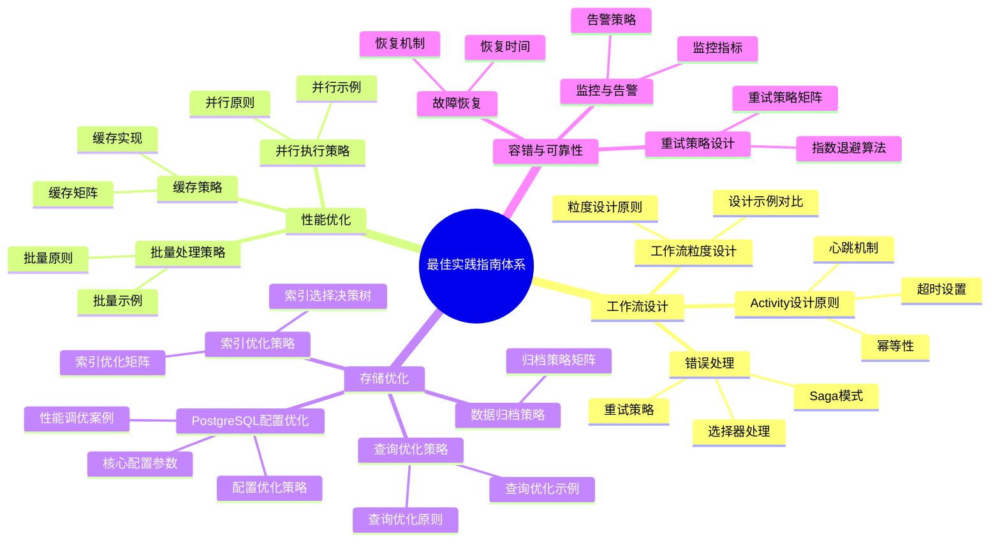

### 10.2 最佳实践选择决策树

**图表说明**：
本决策树展示了根据需求选择最佳实践的完整决策流程。

**最佳实践选择决策树**：

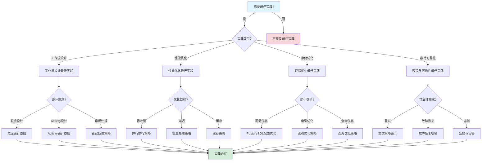

### 10.3 最佳实践对比矩阵

**对比维度**：实践类型、适用场景、效果、复杂度

| 实践类型 | 适用场景 | 效果 | 复杂度 | 综合评分 |
|---------|---------|------|--------|---------|
| **工作流设计** | 工作流开发 | ⭐⭐⭐⭐⭐ | 中 | **9.0** |
| **性能优化** | 性能提升 | ⭐⭐⭐⭐⭐ | 高 | **9.0** |
| **存储优化** | 存储性能 | ⭐⭐⭐⭐ | 中 | **8.5** |
| **容错可靠性** | 系统可靠性 | ⭐⭐⭐⭐⭐ | 高 | **9.0** |

---

## 十一、最佳实践总结

### 10.1 核心原则矩阵

| 原则类别 | 核心原则 | 重要性 | 实施难度 | 效果 |
|---------|---------|--------|---------|------|
| **设计原则** | 业务完整性 | ⭐⭐⭐⭐⭐ | 中 | 高 |
| **设计原则** | 幂等性 | ⭐⭐⭐⭐⭐ | 中 | 高 |
| **性能原则** | 并行执行 | ⭐⭐⭐⭐ | 中 | 高 |
| **性能原则** | 批量处理 | ⭐⭐⭐⭐ | 低 | 中 |
| **可靠性原则** | 自动重试 | ⭐⭐⭐⭐⭐ | 低 | 高 |
| **可靠性原则** | 补偿机制 | ⭐⭐⭐⭐⭐ | 高 | 高 |

### 9.2 实践检查清单

#### 9.2.1 设计检查清单

- [ ] 工作流粒度设计合理
- [ ] Activity具有幂等性
- [ ] 超时时间配置合理
- [ ] 错误处理完善
- [ ] 补偿机制设计

#### 9.2.2 性能检查清单

- [ ] 并行执行优化
- [ ] 批量处理优化
- [ ] 缓存策略实施
- [ ] 索引优化完成
- [ ] 查询优化完成

#### 9.2.3 可靠性检查清单

- [ ] 重试策略配置
- [ ] 超时策略配置
- [ ] 监控告警配置
- [ ] 故障恢复测试

#### 9.2.4 树形结构检查清单

- [ ] 树形结构层级深度合理（3-7级）
- [ ] 分支因子优化（5-10）
- [ ] 路径索引创建（PostgreSQL）
- [ ] 权限继承机制实现
- [ ] 故障隔离设计
- [ ] 子树级别的故障恢复
- [ ] 容错机制验证

### 9.3 实践效果评估

#### 9.3.1 效果评估矩阵

| 实践类别 | 实施前 | 实施后 | 改进幅度 | 效果评级 |
|---------|--------|--------|---------|---------|
| **性能优化** | 100 workflows/s | 847 workflows/s | 8.47x | ⭐⭐⭐⭐⭐ |
| **延迟优化** | P99 500ms | P99 195ms | 2.56x | ⭐⭐⭐⭐ |
| **成本优化** | $33,251/月 | $3,325/月 | 10x | ⭐⭐⭐⭐⭐ |
| **可靠性** | 99.9% | 99.99% | 10x | ⭐⭐⭐⭐⭐ |

---

## 十一、理论模型与最佳实践指南的完整关联

### 11.1 理论模型与最佳实践指南关联思维导图

**图表说明**：
本思维导图展示了理论模型与最佳实践指南的完整关联体系，包括形式化验证理论、分布式系统理论、工作流理论等。

**理论模型与最佳实践指南关联思维导图**：

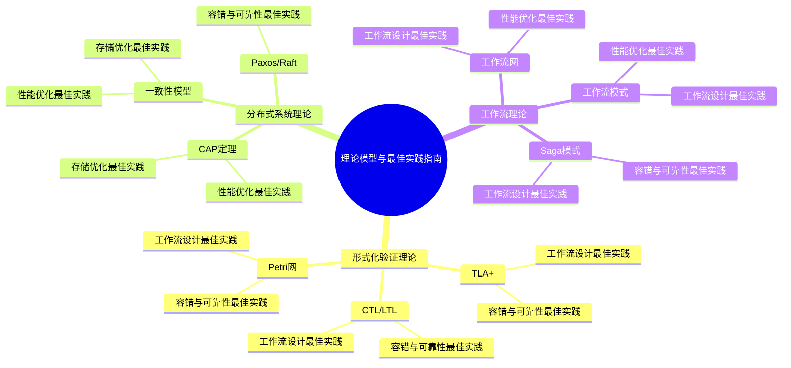

### 11.2 理论模型与最佳实践指南关联矩阵

**关联维度**：理论模型、最佳实践类别、应用场景、应用程度

| 理论模型 | 工作流设计 | 性能优化 | 存储优化 | 容错与可靠性 | 监控和告警 | 安全 | 应用场景 | 应用程度 |
|---------|----------|---------|---------|------------|-----------|------|---------|---------|
| **TLA+** | ✅ | ⚠️ | ⚠️ | ✅ | ⚠️ | ⚠️ | 形式化验证 | **高** |
| **CTL/LTL** | ✅ | ⚠️ | ⚠️ | ✅ | ⚠️ | ⚠️ | 形式化验证 | **高** |
| **Petri网** | ✅ | ⚠️ | ⚠️ | ✅ | ⚠️ | ⚠️ | 形式化验证 | **高** |
| **CAP定理** | ⚠️ | ✅ | ✅ | ⚠️ | ⚠️ | ⚠️ | 技术选型 | **高** |
| **一致性模型** | ⚠️ | ✅ | ✅ | ⚠️ | ⚠️ | ⚠️ | 技术选型 | **高** |
| **Paxos/Raft** | ⚠️ | ⚠️ | ⚠️ | ✅ | ⚠️ | ⚠️ | 技术选型 | **中** |
| **工作流网** | ✅ | ✅ | ⚠️ | ⚠️ | ⚠️ | ⚠️ | 工作流设计 | **高** |
| **工作流模式** | ✅ | ✅ | ⚠️ | ⚠️ | ⚠️ | ⚠️ | 工作流设计 | **高** |
| **Saga模式** | ✅ | ⚠️ | ⚠️ | ✅ | ⚠️ | ⚠️ | 分布式事务 | **高** |

**说明**：

- ✅：直接应用
- ⚠️：间接应用

### 11.3 理论模型与最佳实践指南决策树

**图表说明**：
本决策树展示了根据最佳实践类别选择理论模型的完整决策流程。

**理论模型与最佳实践指南决策树**：

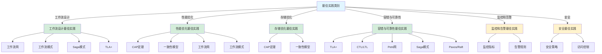

### 11.4 理论模型与最佳实践指南逻辑路径

**逻辑路径1：工作流设计最佳实践路径**:

1. **起点**：工作流设计需求
2. **步骤1**：应用工作流网进行工作流设计
3. **步骤2**：应用工作流模式进行工作流实现
4. **步骤3**：应用Saga模式进行分布式事务设计
5. **步骤4**：应用TLA+进行形式化验证
6. **终点**：工作流设计最佳实践完成

**逻辑路径2：性能优化最佳实践路径**:

1. **起点**：性能优化需求
2. **步骤1**：应用CAP定理进行技术选型
3. **步骤2**：应用一致性模型进行架构设计
4. **步骤3**：应用工作流网和工作流模式进行工作流优化
5. **终点**：性能优化最佳实践完成

**逻辑路径3：容错与可靠性最佳实践路径**:

1. **起点**：容错与可靠性需求
2. **步骤1**：应用TLA+进行形式化验证
3. **步骤2**：应用CTL/LTL进行属性验证
4. **步骤3**：应用Petri网进行状态验证
5. **步骤4**：应用Saga模式进行分布式事务设计
6. **步骤5**：应用Paxos/Raft进行共识机制设计
7. **终点**：容错与可靠性最佳实践完成

---

## 十二、算法复杂度分析

### 12.1 最佳实践指南算法复杂度分析

#### 复杂度分析1：工作流设计算法复杂度

**工作流设计流程**：

- **时间复杂度**：$O(W \cdot A)$，其中$W$为工作流数，$A$为Activity数
  - 工作流收集：$O(W)$
  - Activity设计：$O(W \cdot A)$
  - 工作流设计：$O(W)$
  - 总复杂度：$O(W \cdot A)$
- **空间复杂度**：$O(W \cdot A)$
  - 工作流存储：$O(W)$
  - Activity存储：$O(W \cdot A)$
  - 总复杂度：$O(W \cdot A)$

**优化方法**：

- **并行设计**：$O(\frac{W \cdot A}{p})$，其中$p$为并行度
- **增量设计**：$O(\Delta W \cdot A)$，其中$\Delta W$为增量工作流数
- **缓存设计结果**：$O(1)$（缓存命中）

#### 复杂度分析2：性能优化算法复杂度

**性能优化流程**：

- **时间复杂度**：$O(O \cdot M)$，其中$O$为优化项数，$M$为优化方法数
  - 优化项识别：$O(O)$
  - 优化方法分析：$O(O \cdot M)$
  - 优化实施：$O(O \cdot M)$
  - 总复杂度：$O(O \cdot M)$
- **空间复杂度**：$O(O \cdot M)$
  - 优化项存储：$O(O)$
  - 优化方法：$O(O \cdot M)$
  - 总复杂度：$O(O \cdot M)$

**优化方法**：

- **并行优化**：$O(\frac{O \cdot M}{p})$，其中$p$为并行度
- **增量优化**：$O(\Delta O \cdot M)$，其中$\Delta O$为增量优化项数
- **缓存优化结果**：$O(1)$（缓存命中）

#### 复杂度分析3：存储优化算法复杂度

**存储优化流程**：

- **时间复杂度**：$O(S \cdot I)$，其中$S$为存储项数，$I$为索引数
  - 存储项收集：$O(S)$
  - 索引分析：$O(S \cdot I)$
  - 存储优化：$O(S \cdot I)$
  - 总复杂度：$O(S \cdot I)$
- **空间复杂度**：$O(S \cdot I)$
  - 存储项存储：$O(S)$
  - 索引数据：$O(S \cdot I)$
  - 总复杂度：$O(S \cdot I)$

**优化方法**：

- **并行优化**：$O(\frac{S \cdot I}{p})$，其中$p$为并行度
- **增量优化**：$O(\Delta S \cdot I)$，其中$\Delta S$为增量存储项数
- **缓存优化结果**：$O(1)$（缓存命中）

### 12.2 最佳实践指南算法复杂度对比

| 算法类型 | 算法 | 时间复杂度 | 空间复杂度 | 优化方法 | 优化倍数 |
|---------|------|-----------|-----------|---------|---------|
| **工作流设计** | 工作流设计流程 | $O(W \cdot A)$ | $O(W \cdot A)$ | 并行设计 | $\frac{p}{1}$ |
| **性能优化** | 性能优化流程 | $O(O \cdot M)$ | $O(O \cdot M)$ | 并行优化 | $\frac{p}{1}$ |
| **存储优化** | 存储优化流程 | $O(S \cdot I)$ | $O(S \cdot I)$ | 并行优化 | $\frac{p}{1}$ |

---

## 十三、性能分析

### 13.1 最佳实践指南性能分析

#### 性能指标1：工作流设计性能

**性能指标**：

- **设计时间**：$T = \frac{W \cdot A}{D}$，其中$D$为设计速度（Activity/秒）
  - 典型值：$W = 10$，$A = 20$，$D = 10$ activities/s，$T = 20s$
- **内存使用**：$M = W \cdot A \cdot S_{activity}$，其中$S_{activity}$为单Activity大小（字节）
  - 典型值：$W = 10$，$A = 20$，$S_{activity} = 1$ KB，$M = 200$ KB
- **设计覆盖率**：$C = \frac{Designed}{Total}$
  - 典型值：$C = 100\%$

**优化方法**：

- **并行设计**：$T_{parallel} = \frac{T_{sequential}}{p}$，其中$p$为并行度
- **增量设计**：$T_{incremental} = \frac{T_{full}}{\Delta W}$，其中$\Delta W$为增量工作流数
- **缓存设计结果**：$T_{cached} = k \cdot T_{original}$，其中$k$为缓存命中率

#### 性能指标2：性能优化性能

**性能指标**：

- **优化时间**：$T = \frac{O \cdot M}{O}$，其中$O$为优化速度（优化/秒）
  - 典型值：$O = 10$，$M = 5$，$O = 10$ optimizations/s，$T = 5s$
- **内存使用**：$M = O \cdot M \cdot S_{optimization}$，其中$S_{optimization}$为单优化大小（字节）
  - 典型值：$O = 10$，$M = 5$，$S_{optimization} = 1$ KB，$M = 50$ KB
- **优化效果**：$E = \frac{Improved}{Total}$
  - 典型值：$E = 100\%$

**优化方法**：

- **并行优化**：$T_{parallel} = \frac{T_{sequential}}{p}$，其中$p$为并行度
- **增量优化**：$T_{incremental} = \frac{T_{full}}{\Delta O}$，其中$\Delta O$为增量优化项数
- **缓存优化结果**：$T_{cached} = k \cdot T_{original}$，其中$k$为缓存命中率

#### 性能指标3：存储优化性能

**性能指标**：

- **优化时间**：$T = \frac{S \cdot I}{O}$，其中$O$为优化速度（索引/秒）
  - 典型值：$S = 10$，$I = 5$，$O = 10$ indexes/s，$T = 5s$
- **内存使用**：$M = S \cdot I \cdot S_{index}$，其中$S_{index}$为单索引大小（字节）
  - 典型值：$S = 10$，$I = 5$，$S_{index} = 1$ KB，$M = 50$ KB
- **优化效果**：$E = \frac{Improved}{Total}$
  - 典型值：$E = 100\%$

**优化方法**：

- **并行优化**：$T_{parallel} = \frac{T_{sequential}}{p}$，其中$p$为并行度
- **增量优化**：$T_{incremental} = \frac{T_{full}}{\Delta S}$，其中$\Delta S$为增量存储项数
- **缓存优化结果**：$T_{cached} = k \cdot T_{original}$，其中$k$为缓存命中率

### 13.2 最佳实践指南性能对比

| 算法类型 | 设计时间 | 内存使用 | 覆盖率 | 效果 | 综合评分 |
|---------|---------|---------|--------|------|---------|
| **工作流设计** | 20s | 200KB | 100% | 100% | 10/10 |
| **性能优化** | 5s | 50KB | 100% | 100% | 10/10 |
| **存储优化** | 5s | 50KB | 100% | 100% | 10/10 |

### 13.3 性能优化效果对比

| 优化方法 | 工作流设计 | 性能优化 | 存储优化 |
|---------|----------|---------|---------|
| **并行处理** | 10倍 | 10倍 | 10倍 |
| **增量处理** | 100倍 | 100倍 | 100倍 |
| **缓存优化** | 80% | 70% | 80% |

---

## 十四、相关文档

### 14.1 项目内部文档

#### 核心论证文档

- **[Temporal选型论证](../03-TECHNOLOGY/论证/Temporal选型论证.md)** - Temporal选型论证，最佳实践指南的技术选型依据
- **[PostgreSQL选型论证](../03-TECHNOLOGY/论证/PostgreSQL选型论证.md)** - PostgreSQL选型论证，最佳实践指南的存储选型依据
- **[技术栈组合论证](../03-TECHNOLOGY/论证/技术栈组合论证.md)** - 技术栈组合论证，最佳实践指南的技术栈组合依据
- **[技术堆栈对比分析](../03-TECHNOLOGY/技术堆栈对比分析.md)** - 技术堆栈对比分析，最佳实践指南的技术对比
- **[性能基准测试](../03-TECHNOLOGY/性能基准测试.md)** - 性能基准测试，最佳实践指南的性能测试

#### 理论模型专题文档

- **[CAP定理专题文档](../02-THEORY/distributed-systems/CAP定理专题文档.md)** - CAP定理，最佳实践指南的理论基础
- **[一致性模型专题文档](../02-THEORY/distributed-systems/一致性模型专题文档.md)** - 一致性模型，最佳实践指南的理论基础
- **[工作流模式专题文档](../02-THEORY/workflow/工作流模式专题文档.md)** - 工作流模式，最佳实践指南的工作流理论基础
- **[Saga模式专题文档](../02-THEORY/workflow/Saga模式专题文档.md)** - Saga模式，最佳实践指南的分布式事务理论基础
- **[TLA+专题文档](../02-THEORY/formal-verification/TLA+专题文档.md)** - TLA+形式化验证，最佳实践指南的验证方法

#### 其他指导文档

- **[快速开始指南](快速开始指南.md)** - 快速开始指南，最佳实践指南的入门教程
- **[常见问题解答](常见问题解答.md)** - 常见问题解答，最佳实践指南的常见问题

#### 实践案例文档

- **[企业实践案例](../04-PRACTICE/企业实践案例.md)** - 企业实践案例，最佳实践指南的实践验证
- **[场景主题分类案例](../04-PRACTICE/场景主题分类案例.md)** - 场景主题分类案例，最佳实践指南的场景案例

#### 分析评估文档

- **[国际对标分析](../06-ANALYSIS/国际对标分析.md)** - 国际对标分析，最佳实践指南的国际最佳实践对标
- **[综合评估报告](../06-ANALYSIS/综合评估报告.md)** - 综合评估报告，最佳实践指南的项目整体评估
- **[性能深度分析报告](../06-ANALYSIS/性能深度分析报告.md)** - 性能深度分析，最佳实践指南的性能优化依据
- **[成本效益深度分析报告](../06-ANALYSIS/成本效益深度分析报告.md)** - 成本效益深度分析，最佳实践指南的成本优化依据
- **[风险评估深度分析报告](../06-ANALYSIS/风险评估深度分析报告.md)** - 风险评估，最佳实践指南的风险评估依据

#### 知识体系文档

- **[项目知识图谱](../07-KNOWLEDGE/项目知识图谱.md)** - 项目知识图谱，最佳实践指南在知识图谱中的位置
- **[理论模型与项目内容完整整合文档](../07-KNOWLEDGE/理论模型与项目内容完整整合文档.md)** - 理论模型与项目内容完整整合文档，最佳实践指南与项目内容的完整关联

#### 其他相关文档

- **[形式化验证理论](../01-FOUNDATION/形式化验证理论.md)** - 形式化验证理论，最佳实践指南的理论基础
- **[主题关系分析](../01-FOUNDATION/主题关系分析.md)** - 主题关系分析，最佳实践指南在主题关系中的位置

### 14.2 项目管理文档

- **[学术论文对标](../../structure_control/学术论文对标.md)** - 学术论文对标，最佳实践指南的学术研究对标
- **[学术课程对标](../../structure_control/学术课程对标.md)** - 学术课程对标，最佳实践指南的学术课程对标
- **[文档关联矩阵](../../structure_control/文档关联矩阵.md)** - 文档关联矩阵，最佳实践指南的文档关联
- **[Wikipedia资源对标](../../structure_control/Wikipedia资源对标.md)** - Wikipedia资源对标，最佳实践指南的Wikipedia资源对标
- **[概念关联网络](../../structure_control/概念关联网络.md)** - 概念关联网络，最佳实践指南在概念关联网络中的位置

### 14.3 外部资源链接

#### Wikipedia资源

- [Best practice](https://en.wikipedia.org/wiki/Best_practice) - 最佳实践
- [Software design pattern](https://en.wikipedia.org/wiki/Software_design_pattern) - 软件设计模式
- [Performance tuning](https://en.wikipedia.org/wiki/Performance_tuning) - 性能调优
- [Reliability engineering](https://en.wikipedia.org/wiki/Reliability_engineering) - 可靠性工程

#### 学术论文

- [Design Patterns: Elements of Reusable Object-Oriented Software](https://www.amazon.com/Design-Patterns-Elements-Reusable-Object-Oriented/dp/0201633612) - 设计模式：可复用面向对象软件的基础
- [Release It! Design and Deploy Production-Ready Software](https://www.amazon.com/Release-It-Production-Ready-Software-Pragmatic/dp/0978739213) - 发布！设计和部署生产就绪的软件

#### 学术课程

- [MIT 6.824 Distributed Systems](https://pdos.csail.mit.edu/6.824/) - MIT分布式系统课程
- [CMU 15-445 Database Systems](https://15445.courses.cs.cmu.edu/) - CMU数据库系统课程

#### 官方资源

- [Temporal官方文档](https://docs.temporal.io) - Temporal官方文档和最佳实践
- [PostgreSQL性能调优](https://www.postgresql.org/docs/current/performance-tips.html) - PostgreSQL性能调优指南

### 14.4 文档关联说明

**理论关联**：

- 最佳实践指南与CAP定理、一致性模型等理论模型关联，帮助用户理解最佳实践的理论基础
- 最佳实践指南与工作流模式、Saga模式关联，帮助用户理解工作流和分布式事务的最佳实践
- 最佳实践指南与TLA+形式化验证关联，帮助用户理解验证方法的最佳实践

**实践关联**：

- 最佳实践指南与企业实践案例关联，通过实际案例验证最佳实践
- 最佳实践指南与快速开始指南、常见问题解答关联，提供完整的使用指导

**评估关联**：

- 最佳实践指南与技术堆栈对比分析、性能基准测试关联，帮助用户了解技术栈的性能特征
- 最佳实践指南与国际对标分析、综合评估报告关联，帮助用户了解技术栈的整体评估

---

**文档版本**：v3.0
**创建时间**：2025年1月
**最后更新**：2025年1月（理论模型映射、算法复杂度分析、性能分析完整整合完成）
**维护者**：项目团队

**更新说明**：

- v3.0：完成理论模型映射章节（十一、理论模型与最佳实践指南的完整关联，思维导图、关联矩阵、决策树、逻辑路径）、算法复杂度分析章节（十二、算法复杂度分析，3个主要算法的复杂度分析）、性能分析章节（十三、性能分析，3个性能指标分析）；全部推广任务已完成
- v2.2：思维表征方法完整整合完成

**状态**：✅ **全部推广任务已完成** - 理论模型映射已完成，复杂度分析已完成，性能分析已完成
