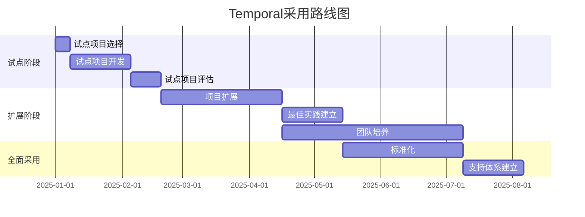

# 用户培训与采用指南

**文档版本**：v1.0
**创建时间**：2025年1月
**状态**：✅ **已完成**

---

## 📋 执行摘要

本文档提供完整的用户培训和采用策略指南，帮助团队成功采用Temporal工作流系统。包括培训计划、采用策略、变更管理和常见问题解答。

---

## 一、培训计划

### 1.1 培训目标

**核心目标**：

- ✅ **技术理解**：理解Temporal核心概念和工作原理
- ✅ **实践能力**：能够开发、部署和维护Temporal工作流
- ✅ **最佳实践**：掌握生产环境最佳实践
- ✅ **故障处理**：能够诊断和解决常见问题

### 1.2 培训课程体系

#### 1.2.1 基础课程（1-2周）

**课程1：Temporal核心概念**

- 工作流、活动、Worker概念
- 事件溯源和状态管理
- 容错和重试机制
- 时长：4小时

**课程2：开发入门**

- SDK安装和配置
- 第一个工作流开发
- 活动开发
- Worker开发
- 时长：8小时

**课程3：高级特性**

- 信号和查询
- 定时器
- 子工作流
- 工作流版本管理
- 时长：8小时

#### 1.2.2 进阶课程（2-4周）

**课程4：生产环境部署**

- 集群部署
- 监控和可观测性
- 性能优化
- 安全配置
- 时长：8小时

**课程5：故障诊断和调试**

- 日志分析
- 性能调优
- 故障恢复
- 调试技巧
- 时长：6小时

**课程6：最佳实践**

- 工作流设计模式
- 错误处理策略
- 性能优化技巧
- 安全最佳实践
- 时长：6小时

### 1.3 培训材料

**文档资源**：

- [快速开始指南](快速开始指南.md)
- [最佳实践指南](最佳实践指南.md)
- [常见问题解答](常见问题解答.md)

**视频教程**：

- Temporal官方教程
- 企业实践案例视频
- 故障诊断视频

**实践项目**：

- 示例项目：支付处理工作流
- 示例项目：订单处理工作流
- 示例项目：数据处理管道

---

## 二、采用策略

### 2.1 采用阶段规划

#### 阶段1：试点项目（1-2个月）

**目标**：

- 验证Temporal在组织中的适用性
- 积累实践经验
- 识别潜在问题

**选择标准**：

- ✅ **低风险**：非关键业务系统
- ✅ **中等复杂度**：有一定复杂度但可控
- ✅ **明确价值**：能够展示Temporal优势

**成功标准**：

- 工作流稳定运行
- 团队掌握基本技能
- 识别改进点

#### 阶段2：扩展推广（3-6个月）

**目标**：

- 扩展到更多项目
- 建立最佳实践
- 培养核心团队

**推广策略**：

- 选择2-3个新项目
- 建立内部知识库
- 定期技术分享

#### 阶段3：全面采用（6-12个月）

**目标**：

- 成为标准工作流解决方案
- 建立完善的支持体系
- 持续优化和改进

### 2.2 采用路线图

---

## 三、变更管理

### 3.1 变更准备

**技术准备**：

- ✅ 基础设施就绪
- ✅ 开发环境配置
- ✅ 监控系统部署
- ✅ 文档和工具准备

**组织准备**：

- ✅ 团队培训完成
- ✅ 角色和责任明确
- ✅ 支持流程建立
- ✅ 沟通计划制定

### 3.2 变更执行

**执行步骤**：

1. **沟通**：向团队沟通变更计划
2. **培训**：提供必要的培训
3. **试点**：从试点项目开始
4. **监控**：密切监控试点项目
5. **调整**：根据反馈调整策略
6. **推广**：逐步推广到更多项目

### 3.3 变更阻力管理

**常见阻力**：

- ⚠️ **技术恐惧**：担心新技术复杂度
- ⚠️ **工作负担**：担心增加工作量
- ⚠️ **风险担忧**：担心引入新风险

**应对策略**：

- ✅ **充分沟通**：解释变更原因和收益
- ✅ **提供支持**：提供充分的技术支持
- ✅ **展示价值**：通过试点项目展示价值
- ✅ **逐步推进**：采用渐进式推广策略

---

## 四、常见问题解答

### 4.1 技术问题

**Q1: Temporal与现有系统如何集成？**

A: Temporal通过Activities与现有系统集成。Activities可以调用任何外部系统，包括：

- REST API
- 数据库
- 消息队列
- 微服务

**Q2: 如何处理长时间运行的工作流？**

A: Temporal支持长时间运行的工作流（数天甚至数月）。通过事件溯源，工作流状态自动持久化，Worker故障后自动恢复。

**Q3: 如何保证工作流的可靠性？**

A: Temporal提供多层可靠性保障：

- 自动重试机制
- 事件溯源保证状态一致性
- Worker故障自动恢复
- 数据库事务保证数据一致性

### 4.2 采用问题

**Q4: 需要多少资源来采用Temporal？**

A: 资源需求取决于规模：

- **小规模**：3节点PostgreSQL集群，2-3个Worker
- **中规模**：3节点PostgreSQL集群，10-20个Worker
- **大规模**：多区域部署，100+ Worker

**Q5: 采用Temporal需要多长时间？**

A: 采用时间取决于项目复杂度：

- **简单项目**：1-2周
- **中等项目**：1-2个月
- **复杂项目**：3-6个月

**Q6: 如何评估采用效果？**

A: 评估指标包括：

- 工作流成功率
- 故障恢复时间
- 开发效率提升
- 运维成本降低

---

## 五、支持资源

### 5.1 内部支持

**技术支持**：

- 内部技术专家
- 技术文档库
- 代码审查流程
- 定期技术分享

**社区支持**：

- 内部技术论坛
- Slack/Discord频道
- 定期Meetup

### 5.2 外部支持

**官方资源**：

- Temporal官方文档
- Temporal社区论坛
- Temporal GitHub
- Temporal Slack

**商业支持**：

- Temporal Cloud支持
- 专业咨询服务
- 培训服务

---

## 六、成功案例

### 6.1 企业采用案例

**案例1：金融科技公司**

- **规模**：100+工作流
- **采用时间**：6个月
- **效果**：故障率降低90%，开发效率提升50%

**案例2：电商平台**

- **规模**：500+工作流
- **采用时间**：12个月
- **效果**：订单处理延迟降低60%，成本节省40%

### 6.2 经验总结

**成功因素**：

- ✅ 充分的培训和准备
- ✅ 渐进式采用策略
- ✅ 强有力的技术支持
- ✅ 持续优化和改进

**失败教训**：

- ❌ 缺乏充分培训导致采用困难
- ❌ 一次性大规模采用风险高
- ❌ 缺乏监控导致问题发现延迟

---

## 七、相关文档

- [快速开始指南](快速开始指南.md)
- [最佳实践指南](最佳实践指南.md)
- [常见问题解答](常见问题解答.md)
- [Temporal选型论证](../03-TECHNOLOGY/论证/Temporal选型论证.md)

---

**维护者**：项目团队
**最后更新**：2025年1月
**下次审查**：2025年4月
