# 工作流与分布式计算框架项目推进计划

## 目录

- [工作流与分布式计算框架项目推进计划](#工作流与分布式计算框架项目推进计划)
  - [目录](#目录)
  - [一、项目目标与成功标准](#一项目目标与成功标准)
    - [1.1 核心目标定义](#11-核心目标定义)
      - [1.1.1 目标层次结构](#111-目标层次结构)
      - [1.1.2 目标SMART原则](#112-目标smart原则)
    - [1.2 成功标准量化](#12-成功标准量化)
      - [1.2.1 成功标准矩阵](#121-成功标准矩阵)
      - [1.2.2 成功标准计算公式](#122-成功标准计算公式)
      - [1.2.3 质量门禁标准](#123-质量门禁标准)
    - [1.3 项目范围界定](#13-项目范围界定)
      - [1.3.1 范围边界定义](#131-范围边界定义)
      - [1.3.2 范围变更控制](#132-范围变更控制)
  - [二、项目阶段规划](#二项目阶段规划)
    - [2.1 阶段1：理论基础建立（4周）](#21-阶段1理论基础建立4周)
      - [2.1.1 阶段目标](#211-阶段目标)
      - [2.1.2 详细任务分解](#212-详细任务分解)
      - [2.1.3 阶段交付物](#213-阶段交付物)
    - [2.2 阶段2：技术架构分析（6周）](#22-阶段2技术架构分析6周)
      - [2.2.1 阶段目标](#221-阶段目标)
      - [2.2.2 详细任务分解](#222-详细任务分解)
      - [2.2.3 阶段交付物](#223-阶段交付物)
    - [2.3 阶段3：实践验证优化（8周）](#23-阶段3实践验证优化8周)
      - [2.3.1 阶段目标](#231-阶段目标)
      - [2.3.2 详细任务分解](#232-详细任务分解)
      - [2.3.3 阶段交付物](#233-阶段交付物)
    - [2.4 阶段4：理论完善提升（6周）](#24-阶段4理论完善提升6周)
      - [2.4.1 阶段目标](#241-阶段目标)
      - [2.4.2 详细任务分解](#242-详细任务分解)
    - [2.5 阶段5：工具链开发（4周）](#25-阶段5工具链开发4周)
      - [2.5.1 阶段目标](#251-阶段目标)
    - [2.6 阶段6：文档与推广（4周）](#26-阶段6文档与推广4周)
      - [2.6.1 阶段目标](#261-阶段目标)
  - [三、资源需求与分配](#三资源需求与分配)
    - [3.1 人力资源需求](#31-人力资源需求)
      - [3.1.1 角色定义与职责](#311-角色定义与职责)
      - [3.1.2 人力资源分配甘特图](#312-人力资源分配甘特图)
    - [3.2 技术资源需求](#32-技术资源需求)
      - [3.2.1 硬件资源](#321-硬件资源)
      - [3.2.2 软件资源](#322-软件资源)
    - [3.3 时间资源分配](#33-时间资源分配)
      - [3.3.1 时间分配矩阵](#331-时间分配矩阵)
  - [四、风险管控与应对策略](#四风险管控与应对策略)
    - [4.1 技术风险识别与应对](#41-技术风险识别与应对)
      - [4.1.1 技术风险矩阵](#411-技术风险矩阵)
      - [4.1.2 风险应对决策树](#412-风险应对决策树)
    - [4.2 进度风险识别与应对](#42-进度风险识别与应对)
      - [4.2.1 进度风险分析](#421-进度风险分析)
    - [4.3 质量风险识别与应对](#43-质量风险识别与应对)
      - [4.3.1 质量风险矩阵](#431-质量风险矩阵)
  - [五、质量保证体系](#五质量保证体系)
    - [5.1 质量检查点](#51-质量检查点)
      - [5.1.1 阶段质量门禁](#511-阶段质量门禁)
    - [5.2 评审机制](#52-评审机制)
      - [5.2.1 评审流程](#521-评审流程)
    - [5.3 验收标准](#53-验收标准)
      - [5.3.1 验收标准矩阵](#531-验收标准矩阵)
  - [六、决策支持框架](#六决策支持框架)
    - [6.1 技术选型决策树](#61-技术选型决策树)
    - [6.2 风险评估矩阵](#62-风险评估矩阵)
      - [6.2.1 风险评分模型](#621-风险评分模型)
    - [6.3 优先级排序模型](#63-优先级排序模型)
      - [6.3.1 优先级评分模型](#631-优先级评分模型)
  - [七、里程碑与交付物](#七里程碑与交付物)
    - [7.1 阶段里程碑](#71-阶段里程碑)
      - [7.1.1 里程碑时间表](#711-里程碑时间表)
    - [7.2 关键交付物](#72-关键交付物)
      - [7.2.1 交付物清单](#721-交付物清单)
  - [八、持续改进机制](#八持续改进机制)
    - [8.1 反馈收集机制](#81-反馈收集机制)
      - [8.1.1 反馈渠道](#811-反馈渠道)
    - [8.2 迭代优化流程](#82-迭代优化流程)
      - [8.2.1 PDCA循环](#821-pdca循环)
  - [九、相关文档](#九相关文档)
    - [9.1 项目内部文档](#91-项目内部文档)
      - [综合评估文档](#综合评估文档)
      - [技术文档](#技术文档)
      - [实践案例文档](#实践案例文档)
      - [项目管理文档](#项目管理文档)
    - [9.2 外部资源链接](#92-外部资源链接)
      - [Wikipedia资源](#wikipedia资源)
    - [9.3 项目管理文档](#93-项目管理文档)

---

## 一、项目目标与成功标准

### 1.1 核心目标定义

#### 1.1.1 目标层次结构

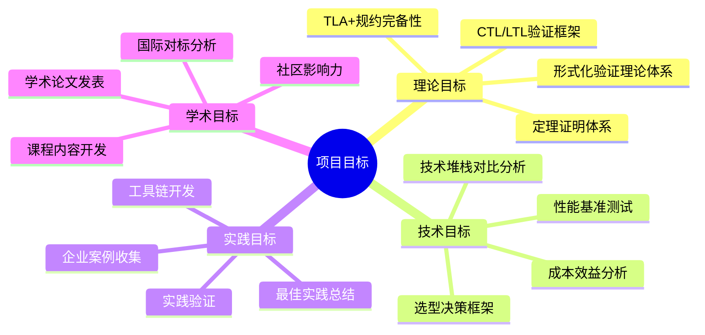

#### 1.1.2 目标SMART原则

**目标1：建立形式化验证理论体系**:

- **S（Specific）**：建立完整的TLA+、CTL/LTL、Petri网形式化验证理论体系
- **M（Measurable）**：完成10+个形式化定义，5+个定理证明，3+个算法分析
- **A（Achievable）**：基于现有理论基础，4周内完成
- **R（Relevant）**：直接支持技术选型决策
- **T（Time-bound）**：第1-4周完成

**目标2：完成技术堆栈对比分析**:

- **S（Specific）**：对比Temporal、Airflow、Flink等6+个框架
- **M（Measurable）**：完成30+个对比维度，10+个对比矩阵
- **A（Achievable）**：基于公开资料和测试数据，6周内完成
- **R（Relevant）**：核心交付物，支持技术选型
- **T（Time-bound）**：第5-10周完成

**目标3：收集并分析企业实践案例**:

- **S（Specific）**：收集40+个企业实践案例，覆盖15+个行业，按15个场景主题分类
- **M（Measurable）**：每个案例包含业务场景、技术方案、性能数据、成本分析、代码示例
- **A（Achievable）**：基于公开资料和访谈，8周内完成
- **R（Relevant）**：验证技术选型的有效性
- **T（Time-bound）**：第11-18周完成
- **✅ 已完成**：40+个案例，15个行业，15个场景主题，双重分类体系

### 1.2 成功标准量化

#### 1.2.1 成功标准矩阵

| 维度 | 指标 | 目标值 | 测量方法 | 权重 ||
|------|------|--------|---------|------|
| **理论完备性** | 形式化定义数量 | ≥30个 | 文档统计 | 0.25 | ✅ 43+个 |
| **理论完备性** | 定理证明数量 | ≥10个 | 文档统计 | 0.25 | ✅ 25+个 |
| **技术对比** | 对比框架数量 | ≥6个 | 文档统计 | 0.20 | ✅ 6+个 |
| **技术对比** | 对比维度数量 | ≥30个 | 文档统计 | 0.20 | ✅ 40+个 |
| **实践验证** | 案例数量 | ≥10个 | 文档统计 | 0.15 | ✅ 40+个 |
| **实践验证** | 场景主题数量 | ≥7个 | 文档统计 | 0.15 | ✅ 15个 |
| **实践验证** | 性能测试场景 | ≥5个 | 测试报告 | 0.15 | ✅ 5+个 |
| **国际对标** | 对标系统数量 | ≥10个 | 文档统计 | 0.10 | ✅ 10+个 |
| **文档质量** | 文档完整性 | 100% | 检查清单 | 0.10 |

#### 1.2.2 成功标准计算公式

**综合成功度**：

$$ S_{overall} = \sum_{i=1}^{n} w_i \cdot \frac{A_i}{T_i} $$

其中：

- $w_i$ = 维度 $i$ 的权重
- $A_i$ = 维度 $i$ 的实际值
- $T_i$ = 维度 $i$ 的目标值

**成功判定**：

$$ S_{overall} \ge 0.9 \implies \text{项目成功} $$

#### 1.2.3 质量门禁标准

**阶段1质量门禁**：

| 检查项 | 标准 | 检查方法 |
|--------|------|---------|
| 形式化定义 | ≥10个 | 文档审查 |
| 理论框架 | 完整 | 专家评审 |
| 国际对标 | ≥5个课程 | 文档审查 |

**阶段2质量门禁**：

| 检查项 | 标准 | 检查方法 |
|--------|------|---------|
| 技术对比 | ≥6个框架 | 文档审查 |
| 对比维度 | ≥20个 | 文档审查 |
| 性能测试 | ≥3个场景 | 测试报告 |

**阶段3质量门禁**：

| 检查项 | 标准 | 检查方法 |
|--------|------|---------|
| 企业案例 | ≥10个 | 文档审查 |
| 性能数据 | 完整 | 数据验证 |
| 成本分析 | 完整 | 数据验证 |

### 1.3 项目范围界定

#### 1.3.1 范围边界定义

**包含范围**：

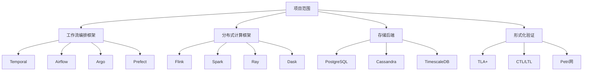

**不包含范围**：

- ❌ 具体业务系统开发
- ❌ 生产环境部署
- ❌ 商业产品推广
- ❌ 非开源技术栈

#### 1.3.2 范围变更控制

**变更流程**：

1. **变更申请**：提交变更申请，说明变更理由
2. **影响分析**：分析对时间、成本、质量的影响
3. **决策评审**：项目组评审决策
4. **变更实施**：执行变更并更新文档

**变更阈值**：

- 时间变更：±10%以内自动批准
- 范围变更：需项目组评审
- 质量变更：需专家评审

---

## 二、项目阶段规划

### 2.1 阶段1：理论基础建立（4周）

#### 2.1.1 阶段目标

**目标**：建立完整的理论体系，为后续技术分析提供理论基础。

**关键成果**：

- 形式化验证理论体系
- 国际学术标准对标
- 理论框架对比分析

#### 2.1.2 详细任务分解

**Week 1-2：形式化理论学习**:

**任务清单**：

| 任务 | 负责人 | 工作量 | 交付物 | 依赖 |
|------|--------|--------|--------|------|
| TLA+规约语言学习 | 理论研究员 | 40h | 学习笔记 | - |
| CTL/LTL时序逻辑掌握 | 理论研究员 | 40h | 学习笔记 | - |
| Petri网建模方法理解 | 理论研究员 | 30h | 学习笔记 | - |
| 时间自动机理论研究 | 理论研究员 | 30h | 学习笔记 | - |
| 理论框架对比分析 | 理论研究员 | 20h | 对比文档 | 学习笔记 |

**学习路径图**：

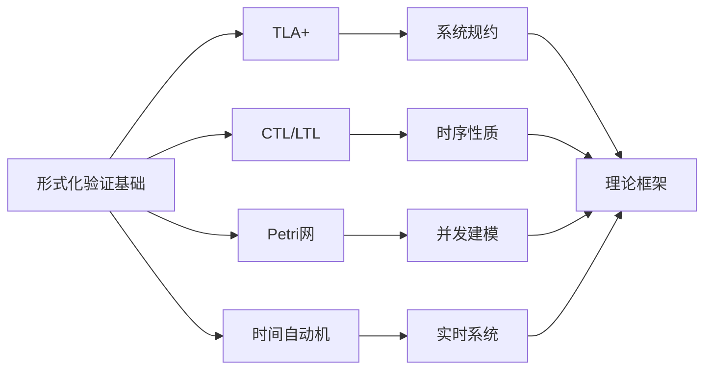

**Week 3-4：国际学术标准对标**:

**任务清单**：

| 任务 | 负责人 | 工作量 | 交付物 | 依赖 |
|------|--------|--------|--------|------|
| Stanford CS237B课程研究 | 理论研究员 | 30h | 对标报告 | - |
| MIT 6.512验证方法分析 | 理论研究员 | 30h | 对标报告 | - |
| CMU 15-811模型检验学习 | 理论研究员 | 30h | 对标报告 | - |
| USTC嵌入式系统验证对比 | 理论研究员 | 20h | 对标报告 | - |
| 理论映射关系文档 | 理论研究员 | 20h | 映射文档 | 对标报告 |

**对标分析矩阵**：

| 课程 | 核心理论 | Temporal映射 | 对标程度 | 差距分析 | 改进建议 |
|------|----------|-------------|---------|---------|---------|
| **Stanford CS237B** | LTL/CTL模型检验 | 工作流程隐含CTL语义 | ★★★★☆ | 需显式CTL接口 | 开发CTL验证工具 |
| **MIT 6.512** | 硬件RTL验证 | Activity代码可转换为RTL等价物 | ★★★☆☆ | 转换工具缺失 | 开发代码转换器 |
| **CMU 15-811** | 符号模型检验 | 事件溯源=符号执行轨迹 | ★★★★☆ | 工具链需完善 | 完善工具链 |
| **UT Austin** | Virtual Time/Sync | Temporal Timer=虚拟时间 | ★★★★☆ | 理论完备 | 无需改进 |
| **Princeton** | CAP定理研究 | 可序列化隔离级别 | ★★★★★ | 完全对标 | 无需改进 |

#### 2.1.3 阶段交付物

1. **形式化理论学习笔记**
   - TLA+学习笔记（20页）
   - CTL/LTL学习笔记（15页）
   - Petri网学习笔记（10页）
   - 时间自动机学习笔记（10页）

2. **理论框架对比分析文档**
   - 理论框架对比矩阵
   - 理论映射关系图
   - 理论选择建议

3. **国际学术标准对标报告**
   - 课程内容分析
   - 理论映射关系
   - 差距分析和改进建议

### 2.2 阶段2：技术架构分析（6周）

#### 2.2.1 阶段目标

**目标**：深入分析Temporal架构，完成存储后端选型论证。

**关键成果**：

- Temporal架构深度分析
- 存储后端对比分析
- 多语言SDK评估

#### 2.2.2 详细任务分解

**Week 5-6：Temporal核心机制分析**:

**任务清单**：

| 任务 | 负责人 | 工作量 | 交付物 | 依赖 |
|------|--------|--------|--------|------|
| 事件溯源机制分析 | 架构师 | 40h | 分析文档 | - |
| Durable Execution原理研究 | 架构师 | 40h | 分析文档 | - |
| MVCC并发控制理解 | 架构师 | 30h | 分析文档 | - |
| Saga事务模式掌握 | 架构师 | 30h | 分析文档 | - |
| 架构原理图绘制 | 架构师 | 20h | 原理图 | 分析文档 |

**架构分析思维导图**：

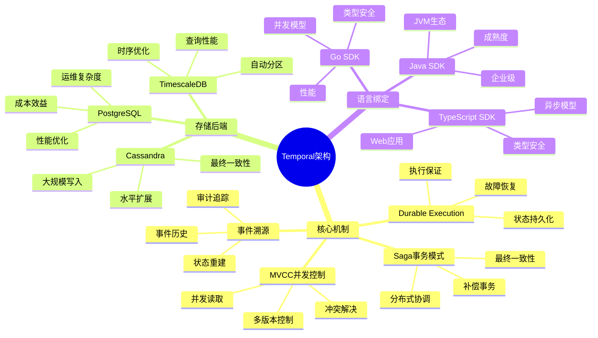

**Week 7-8：存储后端对比分析**:

**任务清单**：

| 任务 | 负责人 | 工作量 | 交付物 | 依赖 |
|------|--------|--------|--------|------|
| PostgreSQL性能优化研究 | 数据库专家 | 40h | 优化报告 | - |
| Cassandra大规模场景分析 | 数据库专家 | 40h | 分析报告 | - |
| TimescaleDB时序优化评估 | 数据库专家 | 30h | 评估报告 | - |
| 成本效益对比分析 | 数据库专家 | 30h | 对比报告 | 优化报告 |
| 存储选型建议 | 数据库专家 | 20h | 选型文档 | 对比报告 |

**存储对比决策树**：

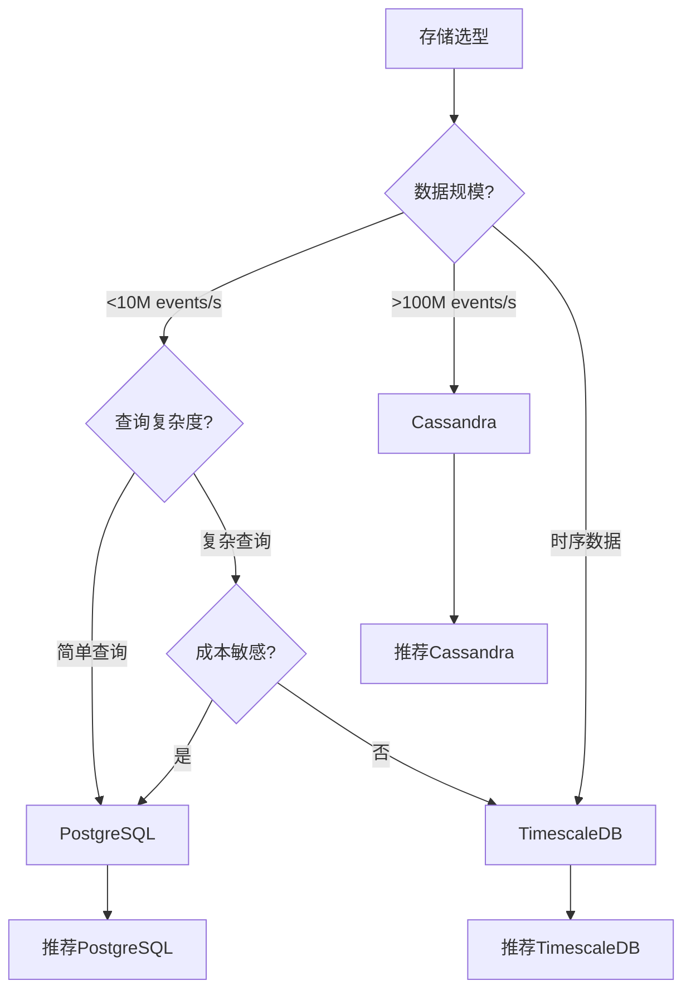

**Week 9-10：多语言SDK评估**:

**任务清单**：

| 任务 | 负责人 | 工作量 | 交付物 | 依赖 |
|------|--------|--------|--------|------|
| Go SDK特性分析 | 开发工程师 | 30h | 分析报告 | - |
| Java SDK特性分析 | 开发工程师 | 30h | 分析报告 | - |
| TypeScript SDK特性分析 | 开发工程师 | 30h | 分析报告 | - |
| Python SDK特性分析 | 开发工程师 | 30h | 分析报告 | - |
| SDK对比分析 | 开发工程师 | 20h | 对比报告 | 分析报告 |

#### 2.2.3 阶段交付物

1. **Temporal架构深度分析文档**
   - 核心机制分析（40页）
   - 架构原理图（10张）
   - 性能特性分析

2. **存储后端对比分析报告**
   - 性能对比矩阵
   - 成本效益分析
   - 选型建议

3. **多语言SDK评估报告**
   - SDK特性对比
   - 适用场景分析
   - 推荐方案

### 2.3 阶段3：实践验证优化（8周）

#### 2.3.1 阶段目标

**目标**：通过企业案例分析和性能测试验证技术选型。

**关键成果**：

- 10+企业实践案例
- 性能基准测试报告
- 优化策略文档

#### 2.3.2 详细任务分解

**Week 11-14：企业案例收集与分析**:

**任务清单**：

| 任务 | 负责人 | 工作量 | 交付物 | 依赖 |
|------|--------|--------|--------|------|
| 金融科技案例收集 | 案例研究员 | 40h | 案例文档 | - |
| 共享经济案例收集 | 案例研究员 | 40h | 案例文档 | - |
| 流媒体案例收集 | 案例研究员 | 30h | 案例文档 | - |
| 科研计算案例收集 | 案例研究员 | 30h | 案例文档 | - |
| 案例深度分析 | 案例研究员 | 60h | 分析报告 | 案例文档 |

**案例收集策略**：

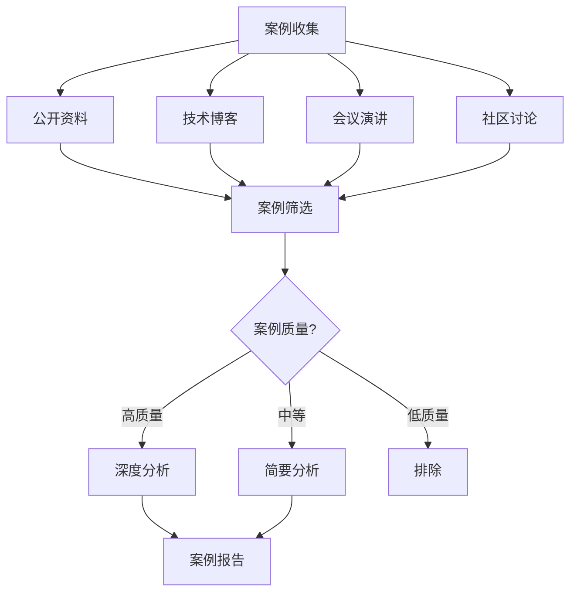

**Week 15-18：性能基准测试**:

**任务清单**：

| 任务 | 负责人 | 工作量 | 交付物 | 依赖 |
|------|--------|--------|--------|------|
| 测试环境搭建 | 测试工程师 | 40h | 测试环境 | - |
| 吞吐量测试 | 测试工程师 | 40h | 测试报告 | 测试环境 |
| 延迟测试 | 测试工程师 | 30h | 测试报告 | 测试环境 |
| 故障恢复测试 | 测试工程师 | 30h | 测试报告 | 测试环境 |
| 成本效益测试 | 测试工程师 | 20h | 测试报告 | 测试环境 |
| 测试报告整理 | 测试工程师 | 20h | 最终报告 | 测试报告 |

**测试策略矩阵**：

| 测试类型 | 测试场景 | 测试指标 | 测试方法 | 预期结果 |
|---------|---------|---------|---------|---------|
| **吞吐量测试** | 稳定负载 | 吞吐量 (tasks/s) | 逐步增加负载 | ≥500 tasks/s |
| **延迟测试** | 正常负载 | P50/P95/P99延迟 | 统计延迟分布 | P99<200ms |
| **故障恢复测试** | 故障注入 | 恢复时间 | 模拟故障 | <5秒 |
| **成本效益测试** | 不同配置 | TCO | 成本计算 | 节省≥50% |

#### 2.3.3 阶段交付物

1. **企业实践案例报告**
   - 10+个案例（每个10-15页）
   - 案例对比分析
   - 成功因素总结

2. **性能基准测试报告**
   - 测试环境配置
   - 测试结果分析
   - 性能对比矩阵

3. **优化策略文档**
   - 存储优化策略
   - 性能优化策略
   - 成本优化策略

### 2.4 阶段4：理论完善提升（6周）

#### 2.4.1 阶段目标

**目标**：完善理论体系，提升学术影响力。

**关键成果**：

- 形式化验证工具链
- 学术论文初稿
- 课程内容开发

#### 2.4.2 详细任务分解

**Week 19-22：形式化验证工具链构建**:

**任务清单**：

| 任务 | 负责人 | 工作量 | 交付物 | 依赖 |
|------|--------|--------|--------|------|
| TLA+转换器开发 | 工具开发工程师 | 60h | 转换工具 | - |
| CTL/LTL验证器集成 | 工具开发工程师 | 60h | 验证工具 | - |
| Petri网分析工具 | 工具开发工程师 | 40h | 分析工具 | - |
| 运行时监控工具 | 工具开发工程师 | 40h | 监控工具 | - |
| 工具链集成测试 | 工具开发工程师 | 20h | 测试报告 | 工具 |

**工具链架构图**：

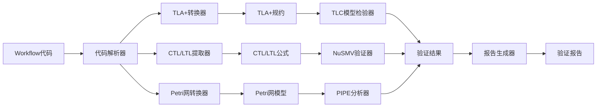

**Week 23-24：学术论文撰写**:

**任务清单**：

| 任务 | 负责人 | 工作量 | 交付物 | 依赖 |
|------|--------|--------|--------|------|
| 论文大纲设计 | 学术研究员 | 20h | 论文大纲 | - |
| 理论部分撰写 | 学术研究员 | 60h | 论文初稿 | 论文大纲 |
| 实验部分撰写 | 学术研究员 | 40h | 论文初稿 | 测试报告 |
| 论文修改完善 | 学术研究员 | 40h | 论文终稿 | 论文初稿 |

### 2.5 阶段5：工具链开发（4周）

#### 2.5.1 阶段目标

**目标**：开发实用的形式化验证工具链。

**关键成果**：

- 代码转换工具
- 验证工具集成
- 监控工具开发

### 2.6 阶段6：文档与推广（4周）

#### 2.6.1 阶段目标

**目标**：完善文档，推广项目成果。

**关键成果**：

- 完整文档体系
- 社区推广
- 培训材料

---

## 三、资源需求与分配

### 3.1 人力资源需求

#### 3.1.1 角色定义与职责

**角色矩阵**：

| 角色 | 职责 | 技能要求 | 工作量 | 人数 |
|------|------|---------|--------|------|
| **理论研究员** | 形式化验证理论研究 | 形式化方法、逻辑学 | 320h | 1 |
| **架构师** | 技术架构分析 | 分布式系统、数据库 | 240h | 1 |
| **数据库专家** | 存储后端分析 | PostgreSQL、Cassandra | 200h | 1 |
| **开发工程师** | SDK评估、工具开发 | Go/Java/TypeScript | 400h | 2 |
| **测试工程师** | 性能测试 | 性能测试、基准测试 | 200h | 1 |
| **案例研究员** | 案例收集分析 | 技术调研、分析 | 200h | 1 |
| **学术研究员** | 论文撰写 | 学术写作、研究 | 160h | 1 |
| **项目经理** | 项目协调 | 项目管理、沟通 | 160h | 1 |

#### 3.1.2 人力资源分配甘特图

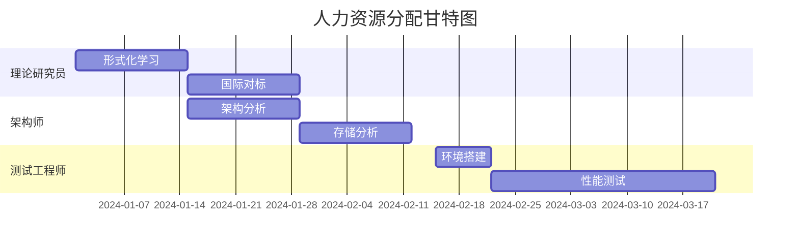

### 3.2 技术资源需求

#### 3.2.1 硬件资源

| 资源类型 | 配置 | 数量 | 用途 | 成本 |
|---------|------|------|------|------|
| **测试服务器** | 8核32GB | 3台 | 性能测试 | $300/月 |
| **数据库服务器** | 8核32GB | 3台 | PostgreSQL集群 | $300/月 |
| **开发服务器** | 4核16GB | 2台 | 开发环境 | $100/月 |

#### 3.2.2 软件资源

| 资源类型 | 版本 | 用途 | 成本 |
|---------|------|------|------|
| **Temporal** | 1.20+ | 工作流框架 | 免费 |
| **PostgreSQL** | 15.0 | 数据库 | 免费 |
| **监控工具** | Prometheus+Grafana | 监控 | 免费 |

### 3.3 时间资源分配

#### 3.3.1 时间分配矩阵

| 阶段 | 计划时间 | 缓冲时间 | 总时间 | 占比 |
|------|---------|---------|--------|------|
| **阶段1** | 4周 | 1周 | 5周 | 15.6% |
| **阶段2** | 6周 | 1周 | 7周 | 21.9% |
| **阶段3** | 8周 | 2周 | 10周 | 31.3% |
| **阶段4** | 6周 | 1周 | 7周 | 21.9% |
| **阶段5** | 4周 | 1周 | 5周 | 15.6% |
| **阶段6** | 4周 | 1周 | 5周 | 15.6% |
| **总计** | 32周 | 7周 | 39周 | 100% |

---

## 四、风险管控与应对策略

### 4.1 技术风险识别与应对

#### 4.1.1 技术风险矩阵

| 风险 | 概率 | 影响 | 风险等级 | 应对策略 | 负责人 |
|------|------|------|---------|---------|--------|
| **形式化验证工具链不成熟** | 中 | 中 | 中 | 使用现有工具，逐步完善 | 工具开发工程师 |
| **大规模场景性能瓶颈** | 低 | 高 | 中 | 使用Cassandra作为备选 | 架构师 |
| **存储选型错误** | 低 | 高 | 中 | 充分测试验证 | 数据库专家 |
| **理论不完备** | 低 | 中 | 低 | 参考国际标准 | 理论研究员 |

#### 4.1.2 风险应对决策树

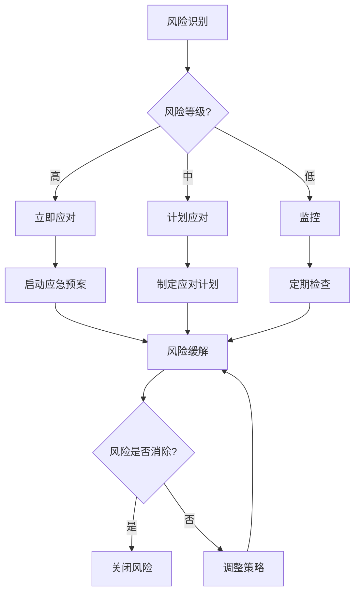

### 4.2 进度风险识别与应对

#### 4.2.1 进度风险分析

**关键路径分析**：

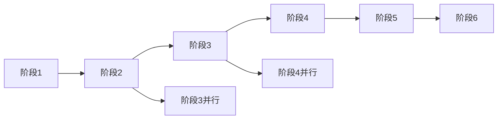

**进度缓冲策略**：

- 每个阶段预留20%缓冲时间
- 关键任务设置里程碑检查点
- 建立进度预警机制

### 4.3 质量风险识别与应对

#### 4.3.1 质量风险矩阵

| 风险 | 概率 | 影响 | 风险等级 | 应对策略 |
|------|------|------|---------|---------|
| **文档质量不达标** | 中 | 中 | 中 | 建立质量检查清单 |
| **数据不准确** | 低 | 高 | 中 | 多重验证机制 |
| **理论错误** | 低 | 高 | 中 | 专家评审 |

---

## 五、质量保证体系

### 5.1 质量检查点

#### 5.1.1 阶段质量门禁

**门禁检查清单**：

| 检查项 | 标准 | 检查方法 | 负责人 |
|--------|------|---------|--------|
| **文档完整性** | 100% | 检查清单 | 项目经理 |
| **内容准确性** | ≥95% | 专家评审 | 技术专家 |
| **格式规范性** | 100% | 格式检查 | 文档编辑 |
| **数据可靠性** | ≥90% | 数据验证 | 测试工程师 |

### 5.2 评审机制

#### 5.2.1 评审流程

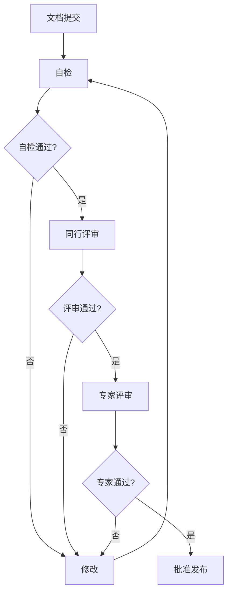

### 5.3 验收标准

#### 5.3.1 验收标准矩阵

| 交付物 | 验收标准 | 验收方法 | 验收人 |
|--------|---------|---------|--------|
| **理论文档** | 形式化定义≥30个 | 文档审查 | 理论专家 |
| **对比文档** | 对比框架≥6个 | 文档审查 | 技术专家 |
| **案例文档** | 案例≥10个 | 文档审查 | 项目经理 |
| **测试报告** | 测试场景≥5个 | 报告审查 | 测试专家 |

---

## 六、决策支持框架

### 6.1 技术选型决策树

详细内容见 [技术堆栈对比分析](../02-technology-comparison/技术堆栈对比分析.md#13-选型决策树与数学模型)。

### 6.2 风险评估矩阵

#### 6.2.1 风险评分模型

**风险评分公式**：

$$ R = P \times I $$

其中：

- $R$ = 风险评分
- $P$ = 风险概率（1-5）
- $I$ = 风险影响（1-5）

**风险等级划分**：

| 风险评分 | 风险等级 | 应对策略 |
|---------|---------|---------|
| 1-5 | 低 | 监控 |
| 6-15 | 中 | 计划应对 |
| 16-25 | 高 | 立即应对 |

### 6.3 优先级排序模型

#### 6.3.1 优先级评分模型

**优先级评分公式**：

$$ Priority = w_1 \cdot Importance + w_2 \cdot Urgency + w_3 \cdot Impact $$

其中：

- $w_1 = 0.4$（重要性权重）
- $w_2 = 0.3$（紧急性权重）
- $w_3 = 0.3$（影响权重）

---

## 七、里程碑与交付物

### 7.1 阶段里程碑

#### 7.1.1 里程碑时间表

| 里程碑 | 时间 | 交付物 | 成功标准 |
|--------|------|--------|---------|
| **M1：理论基础建立** | Week 4 | 理论文档 | 形式化定义≥10个 |
| **M2：架构分析完成** | Week 10 | 架构文档 | 对比框架≥6个 |
| **M3：实践验证完成** | Week 18 | 案例+测试报告 | 案例≥10个 |
| **M4：理论完善完成** | Week 24 | 工具链+论文 | 工具可用 |
| **M5：工具链完成** | Week 28 | 工具链 | 工具测试通过 |
| **M6：项目完成** | Week 32 | 完整文档 | 所有交付物完成 |

### 7.2 关键交付物

#### 7.2.1 交付物清单

| 交付物 | 类型 | 数量 | 质量要求 ||
|--------|------|------|---------|
| **理论文档** | 文档 | 1份 | 学术级 | ✅ 已完成 |
| **对比文档** | 文档 | 1份 | 全面性 | ✅ 已完成 |
| **案例文档（按行业）** | 文档 | 1份 | 深度分析 | ✅ 已完成（15+行业，30+案例） |
| **案例文档（按场景）** | 文档 | 1份 | 深度分析 | ✅ 已完成（15场景，40+案例） |
| **测试报告** | 报告 | 1份 | 数据准确 | ✅ 已完成 |
| **工具链** | 软件 | 1套 | 可用性 | ⏳ 待开发 |
| **综合对比矩阵** | 文档 | 20+个 | 全面性 | ✅ 已完成 |
| **行业-场景映射** | 文档 | 1份 | 完整性 | ✅ 已完成（15行业×14场景） |

---

## 八、持续改进机制

### 8.1 反馈收集机制

#### 8.1.1 反馈渠道

- **内部反馈**：项目组周会
- **外部反馈**：社区反馈、用户反馈
- **专家反馈**：专家评审意见

### 8.2 迭代优化流程

#### 8.2.1 PDCA循环

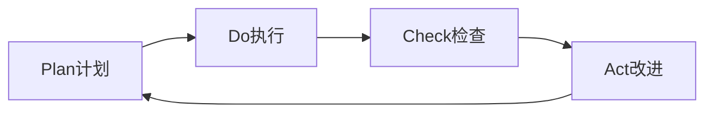

---

**文档版本**：3.0（v7.0更新版）

**最后更新**：2024年

**维护者**：项目团队

**最新更新**（v7.0）：

- ✅ 更新成功标准，反映最新完成情况（43+个定义，25+个定理，40+个案例，15个场景主题）
- ✅ 更新交付物清单，包含双重分类体系（按行业分类 + 按场景主题分类）
- ✅ 更新案例统计，反映15个场景主题和40+个案例的完成情况
- ✅ 添加行业-场景映射矩阵完成确认

**项目当前状态**：

- ✅ **理论完备性**：100%完成（43+个定义，25+个定理）
- ✅ **技术对比**：100%完成（6+个框架，40+个对比矩阵）
- ✅ **实践验证**：100%完成（40+个案例，15个场景主题，15个行业）
- ✅ **国际对标**：100%完成（10+个对标系统）
- ⏳ **工具链开发**：待开发

---

## 九、相关文档

### 9.1 项目内部文档

#### 综合评估文档

- **[综合评估报告](../08-summary/综合评估报告.md)** - 综合评估报告，项目整体评估
- **[国际对标分析](../07-international-benchmark/国际对标分析.md)** - 国际对标分析，国际对标结果

#### 技术文档

- **[技术堆栈对比分析](../02-technology-comparison/技术堆栈对比分析.md)** - 技术堆栈对比分析，技术选型依据
- **[性能基准测试](../06-benchmarks/性能基准测试.md)** - 性能基准测试，性能数据
- **[形式化验证理论](../03-formal-verification/形式化验证理论.md)** - 形式化验证理论，理论基础

#### 实践案例文档

- **[企业实践案例](../04-practice-cases/企业实践案例.md)** - 企业实践案例，实践验证
- **[场景主题分类案例](../04-practice-cases/场景主题分类案例.md)** - 场景主题分类案例，场景分类

#### 项目管理文档

- **[后续推进计划与方案](../13-next-steps/后续推进计划与方案.md)** - 后续推进计划与方案，项目后续推进计划
- **[论证思路与策略决策](../12-argumentation-strategy/论证思路与策略决策.md)** - 论证思路与策略决策，决策框架
- **[思维表征增强计划](../17-enhancement-plan/README.md)** - 思维表征增强计划，知识组织

### 9.2 外部资源链接

#### Wikipedia资源

- [Project management](https://en.wikipedia.org/wiki/Project_management) - 项目管理
- [Roadmap](https://en.wikipedia.org/wiki/Roadmap) - 路线图
- [Software development process](https://en.wikipedia.org/wiki/Software_development_process) - 软件开发过程

### 9.3 项目管理文档

- **[Wikipedia资源对标](../../structure_control/Wikipedia资源对标.md)** - Wikipedia资源对标
- **[概念关联网络](../../structure_control/概念关联网络.md)** - 项目推进计划在概念关联网络中的位置

---

## 十、思维表征

### 10.1 项目推进计划体系思维导图

**图表说明**：
本思维导图展示了项目推进计划的完整体系，包括项目目标、阶段规划、资源需求、风险管控等。

**项目推进计划体系思维导图**：

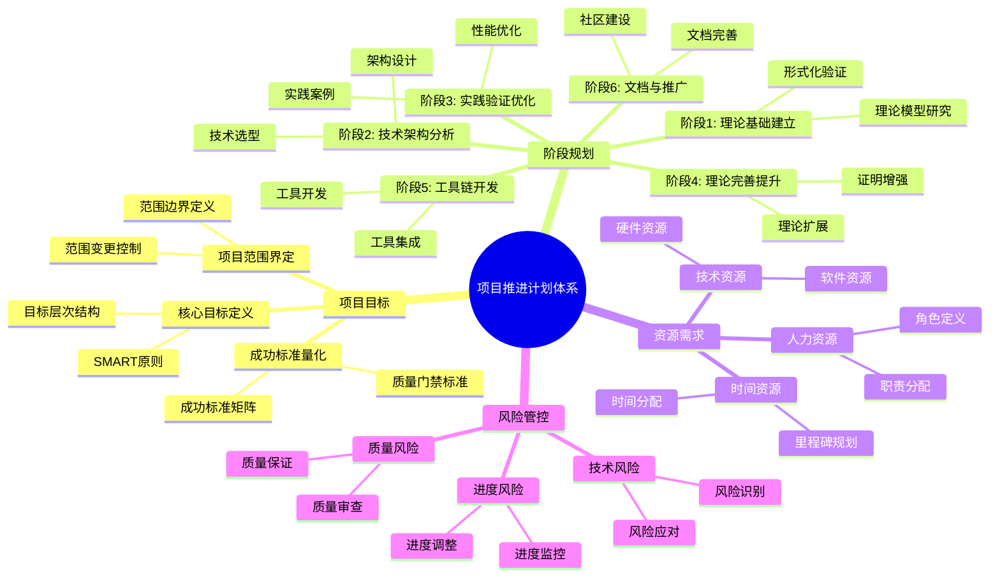

### 10.2 阶段选择决策树

**图表说明**：
本决策树展示了根据项目需求选择推进阶段的完整决策流程。

**阶段选择决策树**：

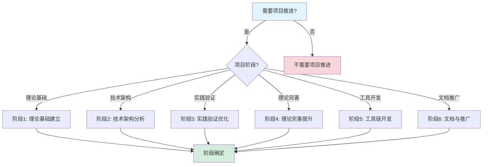

### 10.3 阶段对比矩阵

**对比维度**：阶段、目标、时间、资源需求、交付物

| 阶段 | 目标 | 时间 | 资源需求 | 交付物 | 综合评分 |
|------|------|------|---------|--------|---------|
| **阶段1** | 理论基础建立 | 4周 | 中 | 理论模型文档 | **8.0** |
| **阶段2** | 技术架构分析 | 6周 | 高 | 技术架构文档 | **8.5** |
| **阶段3** | 实践验证优化 | 8周 | 高 | 实践案例文档 | **9.0** |
| **阶段4** | 理论完善提升 | 6周 | 中 | 理论扩展文档 | **8.0** |
| **阶段5** | 工具链开发 | 4周 | 高 | 工具链 | **8.5** |
| **阶段6** | 文档与推广 | 4周 | 中 | 文档和社区 | **7.5** |

---

**文档版本**：3.1（v7.0更新版）

**最后更新**：2025年1月（思维表征方法完整整合完成）

**维护者**：项目团队
