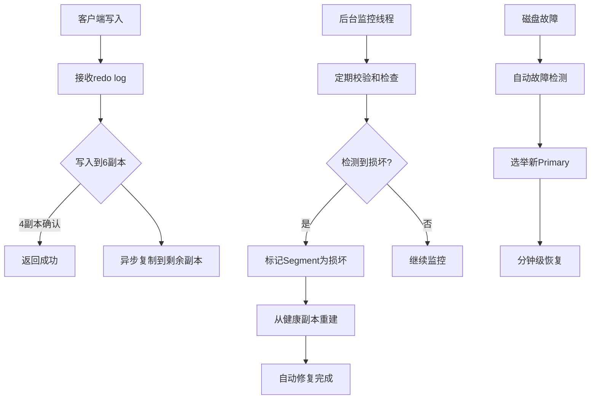

# Amazon Aurora 云原生数据库架构深度解析

**文档版本**：v1.0
**创建时间**：2026年4月
**最后更新**：2026年4月
**状态**：✅ 已完成

---

## 📋 执行摘要

Amazon Aurora是AWS推出的云原生关系型数据库服务，与MySQL和PostgreSQL兼容，通过创新的"日志即数据库"架构实现了商用数据库的性能和可用性，同时仅为开源数据库1/10的成本。
Aurora采用计算存储分离架构，单实例可支持高达128TB存储，读副本延迟低于10ms，是云原生OLTP数据库的标杆实现。

---

## 一、核心架构设计

### 1.1 计算存储分离架构

Aurora最大的创新在于将计算层和存储层完全解耦，这是传统数据库向云原生演进的关键突破。

```
┌─────────────────────────────────────────────────────────────────────────────┐
│                       Amazon Aurora 整体架构                                  │
├─────────────────────────────────────────────────────────────────────────────┤
│                                                                             │
│  ┌─────────────────────────────────────────────────────────────────────┐   │
│  │                      计算层 (Compute Tier)                           │   │
│  │  ┌─────────────┐  ┌─────────────┐  ┌─────────────┐  ┌─────────────┐ │   │
│  │  │   Writer    │  │  Reader 1   │  │  Reader 2   │  │  Reader N   │ │   │
│  │  │   实例      │  │   只读副本   │  │   只读副本   │  │   只读副本   │ │   │
│  │  │  (1写)      │  │  (15读)     │  │             │  │             │ │   │
│  │  └──────┬──────┘  └──────┬──────┘  └──────┬──────┘  └──────┬──────┘ │   │
│  │         │                │                │                │        │   │
│  │         └────────────────┴────────────────┴────────────────┘        │   │
│  │                          ↓                                          │   │
│  │              共享存储卷 (最多15个副本)                                │   │
│  └─────────────────────────────────────────────────────────────────────┘   │
│                                    │                                        │
│                                    ▼                                        │
│  ┌─────────────────────────────────────────────────────────────────────┐   │
│  │                      存储层 (Storage Tier)                          │   │
│  │                                                                     │   │
│  │   ┌──────────┐  ┌──────────┐  ┌──────────┐  ┌──────────┐           │   │
│  │   │ 可用区 A  │  │ 可用区 B  │  │ 可用区 C  │  │ 可用区 N  │   6副本跨AZ │   │
│  │   │ ┌──────┐ │  │ ┌──────┐ │  │ ┌──────┐ │  │ ┌──────┐ │           │   │
│  │   │ │Segment│ │  │ │Segment│ │  │ │Segment│ │  │ │Segment│ │   10GB/段  │   │
│  │   │ └──────┘ │  │ └──────┘ │  │ └──────┘ │  │ └──────┘ │           │   │
│  │   │ ┌──────┐ │  │ ┌──────┐ │  │ ┌──────┐ │  │ ┌──────┐ │           │   │
│  │   │ │Segment│ │  │ │Segment│ │  │ │Segment│ │  │ │Segment│ │           │   │
│  │   │ └──────┘ │  │ └──────┘ │  │ └──────┘ │  │ └──────┘ │           │   │
│  │   └──────────┘  └──────────┘  └──────────┘  └──────────┘           │   │
│  │                                                                     │   │
│  │   特性：自动扩展至128TB、自愈、并行恢复、按使用付费                        │   │
│  └─────────────────────────────────────────────────────────────────────┘   │
│                                                                             │
└─────────────────────────────────────────────────────────────────────────────┘
```

### 1.2 日志即数据库 (The Log is the Database)

Aurora最核心的创新是"日志即数据库"理念。传统数据库需要写入多种数据文件（数据页、redo log、undo log等），而Aurora只将redo日志写入存储层，由存储层异步组装数据页。

```
┌─────────────────────────────────────────────────────────────────────────────┐
│                    传统MySQL vs Aurora写入路径对比                            │
├─────────────────────────────────────────────────────────────────────────────┤
│                                                                             │
│   传统MySQL写入流程 (4次网络I/O, 2次磁盘同步)                                  │
│   ┌─────────┐    ┌──────────────┐    ┌─────────────────────────────────────┐│
│   │ 事务提交 │───→│ 写入Redo Log │───→│ 写入Binlog                          ││
│   └─────────┘    └──────────────┘    └─────────────────────────────────────┘│
│         │              │                           │                        │
│         ▼              ▼                           ▼                        │
│   ┌──────────────────────────────────────────────────────────────────────┐ │
│   │ 修改数据页 → 写入Double Write Buffer → 刷脏页 → 更新Undo页            │ │
│   └──────────────────────────────────────────────────────────────────────┘ │
│                                                                             │
│   Aurora写入流程 (1次网络I/O, 1次日志确认)                                    │
│   ┌─────────┐    ┌─────────────────────────────────────────────────────┐   │
│   │ 事务提交 │───→│ 写入 redo log 到存储层 (4/6副本确认即可返回)          │   │
│   └─────────┘    └─────────────────────────────────────────────────────┘   │
│                          │                                                  │
│                          ▼                                                  │
│   ┌──────────────────────────────────────────────────────────────────────┐ │
│   │              存储层异步组装数据页 (Page Compaction)                    │ │
│   │   ┌─────────┐    ┌─────────┐    ┌─────────┐    ┌─────────┐          │ │
│   │   │ Log Slot│───→│ Log Slot│───→│ Log Slot│───→│ 数据页   │          │ │
│   │   └─────────┘    └─────────┘    └─────────┘    └─────────┘          │ │
│   └──────────────────────────────────────────────────────────────────────┘ │
│                                                                             │
│   写入I/O对比:                                                              │
│   • 传统MySQL: 每次事务提交需要5-10次同步I/O                                 │
│   • Aurora: 仅1次日志写入，数据页异步构建                                     │
│   • 性能提升: 吞吐量提升5倍，写入延迟降低10倍                                  │
│                                                                             │
└─────────────────────────────────────────────────────────────────────────────┘
```

### 1.3 多租户存储架构

Aurora存储层采用多租户设计，将存储资源划分为固定大小的Segment（默认10GB），实现精细化管理。

```
┌─────────────────────────────────────────────────────────────────────────────┐
│                    Aurora 存储Segment架构                                    │
├─────────────────────────────────────────────────────────────────────────────┤
│                                                                             │
│   存储卷 (Volume) - 最大128TB = 12800个Segment                              │
│   ┌───────────────────────────────────────────────────────────────────────┐ │
│   │  Vol 0  │  Vol 1  │  Vol 2  │  ...  │  Vol N  │  (每卷1个Segment)      │ │
│   │(10GB×6) │(10GB×6) │(10GB×6) │       │(10GB×6) │                       │ │
│   └────┬────┴────┬────┴────┬────┴───────┴────┬────┘                       │ │
│        │         │         │                 │                            │ │
│        ▼         ▼         ▼                 ▼                            │ │
│   ┌─────────────────────────────────────────────────────────────────────┐ │ │
│   │                    Segment复制组 (6副本)                             │ │ │
│   │                                                                     │ │ │
│   │    AZ-A          AZ-B          AZ-C           AZ-N                 │ │ │
│   │   ┌────┐        ┌────┐        ┌────┐        ┌────┐                │ │ │
│   │   │ P  │◄──────►│ S1 │◄──────►│ S2 │◄──────►│ S3 │   4副本跨AZ    │ │ │
│   │   │Primary│      │Secondary│   │Secondary│   │Witness│              │ │ │
│   │   └──┬─┘        └────┘        └────┘        └────┘                │ │ │
│   │      │                                                            │ │ │
│   │      ├── 本地2副本 (同一AZ内，用于快速故障恢复)                      │ │ │
│   │      │                                                            │ │ │
│   │   ┌─────────────────────────────────────────────────────────────┐  │ │ │
│   │   │                   Protection Group                          │  │ │ │
│   │   │   6副本 = 2个本地副本 + 3个跨AZ副本 + 1个Witness副本          │  │ │ │
│   │   │   写入确认: 4/6副本确认即可认为持久化                          │  │ │ │
│   │   └─────────────────────────────────────────────────────────────┘  │ │ │
│   │                                                                     │ │ │
│   └─────────────────────────────────────────────────────────────────────┘ │ │
│                                                                             │ │
└─────────────────────────────────────────────────────────────────────────────┘
```

---

## 二、关键技术细节

### 2.1 存储层自愈与故障恢复

Aurora存储层内置自愈机制，通过持续的数据校验和自动修复保证数据可靠性。



### 2.2 读副本复制机制

Aurora的读副本与写入节点共享同一个存储卷，复制延迟极低。

| 指标 | 传统MySQL主从 | Aurora读副本 |
|------|--------------|-------------|
| 复制方式 | Binlog逻辑复制 | 共享存储 |
| 典型延迟 | 100ms - 数秒 | < 10ms |
| 最大副本数 | 通常5个 | 15个 |
| 添加副本时间 | 数小时（全量复制）| 分钟级 |
| 副本故障影响 | 可能影响主库 | 完全隔离 |
| 跨区域复制 | 逻辑复制 | Aurora Global Database |

---

## 三、Aurora vs MySQL/PostgreSQL 对比

### 3.1 架构对比

```
┌─────────────────────────────────────────────────────────────────────────────┐
│                        架构差异对比                                          │
├─────────────────────────────────────────────────────────────────────────────┤
│                                                                             │
│  ┌──────────────────────┐        ┌───────────────────────────────────────┐ │
│  │   传统MySQL/PostgreSQL│        │         Amazon Aurora                  │ │
│  ├──────────────────────┤        ├───────────────────────────────────────┤ │
│  │                      │        │                                       │ │
│  │  ┌────────────────┐  │        │  ┌─────────────────────────────────┐  │ │
│  │  │ 计算+存储耦合   │  │        │  │ 计算层: 无状态, 可快速故障转移     │  │ │
│  │  │ 单机架构        │  │        │  │      内存缓存redo日志              │  │ │
│  │  │                  │  │        │  └─────────────────────────────────┘  │ │
│  │  │ 主库 ──────► 从库│  │        │  ┌─────────────────────────────────┐  │ │
│  │  │ 逻辑复制        │  │        │  │ 存储层: 有状态, 跨AZ 6副本         │  │ │
│  │  │ 延迟高          │  │        │  │      共享存储, 读写分离透明         │  │ │
│  │  └────────────────┘  │        │  └─────────────────────────────────┘  │ │
│  │                      │        │                                       │ │
│  │  故障恢复: 分钟-小时  │        │  故障恢复: 秒级(计算) / 自动(存储)      │ │
│  │  扩展性: 垂直为主     │        │  扩展性: 水平自动扩展                   │ │
│  │  成本: 预配置峰值     │        │  成本: 按实际使用付费                    │ │
│  │                      │        │                                       │ │
│  └──────────────────────┘        └───────────────────────────────────────┘ │
│                                                                             │
└─────────────────────────────────────────────────────────────────────────────┘
```

### 3.2 性能基准对比

| 场景 | Aurora MySQL | 自建MySQL | Aurora PostgreSQL | 自建PostgreSQL |
|------|-------------|----------|------------------|---------------|
| 写入吞吐量(r5.2xlarge) | 100,000+ TPS | 20,000 TPS | 80,000+ TPS | 15,000 TPS |
| 读取吞吐量(15个副本) | 600,000+ QPS | 100,000 QPS | 500,000+ QPS | 80,000 QPS |
| 副本延迟 | < 10ms | 100ms+ | < 10ms | 100ms+ |
| 故障恢复时间 | < 30秒 | 5-30分钟 | < 30秒 | 5-30分钟 |
| 备份影响 | 无 | 高 | 无 | 高 |

### 3.3 功能兼容性

```
┌──────────────────────────────────────────────────────────────┐
│              Aurora MySQL vs MySQL 8.0 功能对比               │
├──────────────────────────────────────────────────────────────┤
│  功能特性              │ MySQL 8.0 │ Aurora MySQL │ 说明     │
├──────────────────────────────────────────────────────────────┤
│  SQL语法兼容           │    ✅    │     ✅      │ 完全兼容  │
│  存储过程              │    ✅    │     ✅      │ 完全兼容  │
│  触发器                │    ✅    │     ✅      │ 完全兼容  │
│  视图                  │    ✅    │     ✅      │ 完全兼容  │
│  JSON函数              │    ✅    │     ✅      │ 完全兼容  │
│  GIS空间数据           │    ✅    │     ✅      │ 完全兼容  │
│  全文索引              │    ✅    │     ✅      │ 完全兼容  │
│  InnoDB引擎            │    ✅    │     ✅      │ 唯一支持  │
│  MyISAM引擎            │    ✅    │     ❌      │ 不支持    │
│  多源复制              │    ✅    │     ❌      │ 不支持    │
│  组复制(Group Repl)    │    ✅    │     ❌      │ 使用Aurora自带HA│
│  超级权限              │    ✅    │     ❌      │ 托管服务限制│
│  文件系统访问          │    ✅    │     ❌      │ 安全限制   │
└──────────────────────────────────────────────────────────────┘
```

---

## 四、配置与最佳实践

### 4.1 Aurora集群参数配置

```ini
# Aurora MySQL 推荐参数配置
[mysqld]

# 连接配置
max_connections = 5000
max_connect_errors = 100
wait_timeout = 600
interactive_timeout = 600

# InnoDB配置 (Aurora优化)
innodb_buffer_pool_size = {DBInstanceClassMemory*3/4}  # 自动计算
innodb_buffer_pool_instances = 8
innodb_log_file_size = 536870912  # 512MB (Aurora使用大日志文件)
innodb_flush_log_at_trx_commit = 1  # Aurora保证持久性
innodb_flush_method = O_DIRECT

# 查询缓存 (Aurora Serverless v1支持)
query_cache_type = 1
query_cache_size = 67108864  # 64MB

# 并行查询 (Aurora特色功能)
aurora_parallel_query = ON
aurora_pq_max_parallel_workers = 16

# 快速DDL
aurora_fast_ddl = ON

# 监控与日志
slow_query_log = 1
long_query_time = 1
performance_schema = ON
```

### 4.2 高可用配置

```json
{
  "DBCluster": {
    "DBClusterIdentifier": "production-cluster",
    "Engine": "aurora-mysql",
    "EngineVersion": "8.0.mysql_aurora.3.04.0",
    "MasterUsername": "admin",
    "MasterUserPassword": "{{secretsmanager:prod-db-password}}",

    "AvailabilityZones": [
      "us-east-1a",
      "us-east-1b",
      "us-east-1c"
    ],

    "BackupRetentionPeriod": 35,
    "PreferredBackupWindow": "03:00-04:00",
    "PreferredMaintenanceWindow": "Mon:04:00-Mon:05:00",

    "EnableHttpEndpoint": true,
    "DeletionProtection": true,
    "StorageEncrypted": true,

    "ServerlessV2ScalingConfiguration": {
      "MinCapacity": 2,
      "MaxCapacity": 128,
      "AutoPause": false
    },

    "Tags": [
      {
        "Key": "Environment",
        "Value": "Production"
      },
      {
        "Key": "CostCenter",
        "Value": "Platform"
      }
    ]
  }
}
```

### 4.3 Terraform配置示例

```hcl
# Aurora MySQL 集群配置
resource "aws_rds_cluster" "main" {
  cluster_identifier     = "aurora-cluster-demo"
  engine                 = "aurora-mysql"
  engine_version         = "8.0.mysql_aurora.3.04.0"
  engine_mode            = "provisioned"  # 或 serverless

  database_name          = "myapp"
  master_username        = "admin"
  master_password        = random_password.db_password.result

  backup_retention_period = 35
  preferred_backup_window = "03:00-04:00"

  skip_final_snapshot    = false
  final_snapshot_identifier = "aurora-final-snapshot"

  db_subnet_group_name   = aws_db_subnet_group.main.name
  vpc_security_group_ids = [aws_security_group.rds.id]

  storage_encrypted      = true
  kms_key_id            = aws_kms_key.rds.arn

  deletion_protection    = true

  enabled_cloudwatch_logs_exports = ["audit", "error", "general", "slowquery"]

  # Serverless v2 自动扩缩容
  serverlessv2_scaling_configuration {
    min_capacity = 2
    max_capacity = 64
  }

  tags = {
    Name = "aurora-mysql-cluster"
  }
}

# 写入实例 (Writer)
resource "aws_rds_cluster_instance" "writer" {
  identifier           = "aurora-writer"
  cluster_identifier   = aws_rds_cluster.main.id
  instance_class       = "db.r6g.2xlarge"
  engine               = aws_rds_cluster.main.engine

  performance_insights_enabled = true
  monitoring_interval = 60
  monitoring_role_arn = aws_iam_role.rds_monitoring.arn

  auto_minor_version_upgrade = false

  tags = {
    Role = "writer"
  }
}

# 读取实例 (Reader) - 3个副本
resource "aws_rds_cluster_instance" "reader" {
  count              = 3
  identifier         = "aurora-reader-${count.index + 1}"
  cluster_identifier = aws_rds_cluster.main.id
  instance_class     = "db.r6g.xlarge"
  engine             = aws_rds_cluster.main.engine

  performance_insights_enabled = true

  tags = {
    Role = "reader"
  }
}

# Global Database (跨区域灾备)
resource "aws_rds_global_cluster" "global" {
  global_cluster_identifier = "aurora-global-cluster"
  engine                    = "aurora-mysql"
  engine_version            = "8.0.mysql_aurora.3.04.0"
  database_name             = "myapp"
  storage_encrypted         = true
}
```

---

## 五、性能优化与监控

### 5.1 性能基准测试

```bash
# 使用 sysbench 进行 Aurora 性能测试
# 准备数据
sysbench oltp_read_write \
  --mysql-host=aurora-cluster.cluster-xxx.us-east-1.rds.amazonaws.com \
  --mysql-user=admin \
  --mysql-password=password \
  --mysql-db=sbtest \
  --tables=100 \
  --table-size=1000000 \
  prepare

# 写入压力测试 (64线程, 300秒)
sysbench oltp_write_only \
  --mysql-host=aurora-cluster.cluster-xxx.us-east-1.rds.amazonaws.com \
  --mysql-user=admin \
  --mysql-password=password \
  --mysql-db=sbtest \
  --tables=100 \
  --table-size=1000000 \
  --threads=64 \
  --time=300 \
  --report-interval=10 \
  run

# 典型性能指标 (r6g.2xlarge):
# - 写入 TPS: 100,000+
# - 平均延迟: 0.8ms
# - 95%延迟: 2.5ms
```

### 5.2 关键监控指标

```yaml
# CloudWatch 监控告警配置
AuroraMonitoring:
  # 计算层指标
  ComputeMetrics:
    - metric: CPUUtilization
      threshold: 80
      period: 300
      evaluation_periods: 2

    - metric: FreeableMemory
      threshold: 1000000000  # 1GB
      period: 60
      evaluation_periods: 1

    - metric: DatabaseConnections
      threshold: 4000
      period: 60
      evaluation_periods: 1

  # 存储层指标
  StorageMetrics:
    - metric: VolumeReadIOPs
      threshold: 100000
      period: 300

    - metric: VolumeWriteIOPs
      threshold: 50000
      period: 300

    - metric: AuroraReplicaLag
      threshold: 100  # 100ms
      period: 60

  # 复制延迟
  ReplicationMetrics:
    - metric: AuroraBinlogReplicaLag
      threshold: 300  # 5分钟
      period: 60

    - metric: OldestReplicationSlotLag
      threshold: 1000000000  # 1GB
      period: 300
```

---

## 六、总结

Amazon Aurora通过创新的"日志即数据库"架构，成功解决了传统数据库在云环境中的扩展性和可靠性挑战。其核心价值在于：

1. **计算存储分离**：实现秒级故障恢复和独立扩缩容
2. **共享存储**：读副本零延迟复制，支持15个只读副本
3. **自动自愈**：存储层内置数据校验和自动修复
4. **成本优化**：仅为商用数据库1/10的成本

Aurora是云原生OLTP数据库的首选方案，特别适合高可用、高扩展的在线业务系统。

---

**参考资源**：

- [Amazon Aurora 官方文档](https://docs.aws.amazon.com/aurora/)
- [AWS Database Blog - Aurora Architecture](https://aws.amazon.com/blogs/database/)
- [Aurora论文: Amazon Aurora: Design Considerations](https://www.allthingsdistributed.com/files/p1041-verbitski.pdf)
