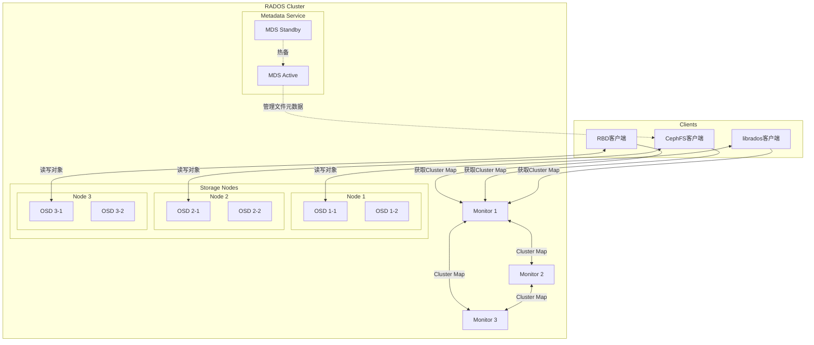
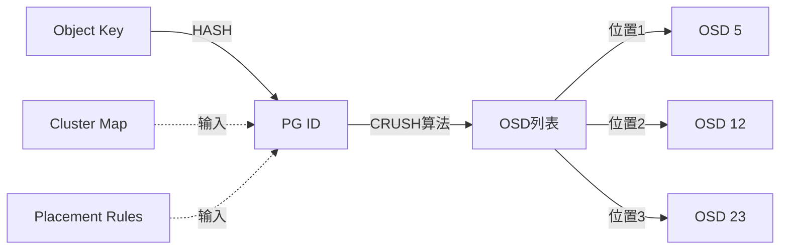
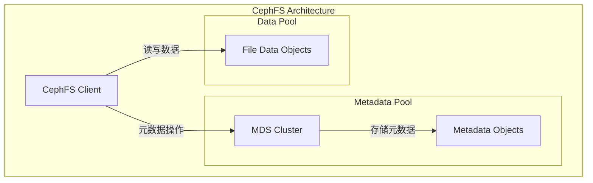
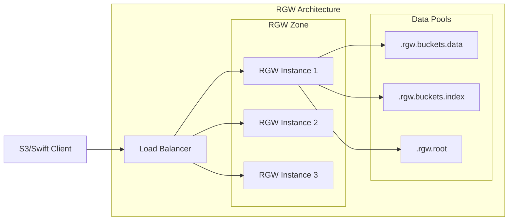

# Ceph架构 专题文档

**文档版本**：v1.0
**创建时间**：2026年4月
**最后更新**：2026年4月
**状态**：✅ 已完成

---

## 📋 执行摘要

Ceph是一个统一的分布式存储系统，提供对象存储、块存储和文件系统存储三种接口。其核心设计理念是**无单点故障**和**完全去中心化**，通过CRUSH算法实现数据的自动分布和故障恢复，能够支持从TB级到EB级的线性扩展。

---

## 一、核心概念

### 1.1 定义与原理

**Ceph**（cephalopod，章鱼）是一个开源的、可扩展的分布式存储系统，由Sage Weil在2003年作为博士论文项目发起。其核心设计理念包括：

- **无中心架构**：没有单点故障的元数据服务器（通过CRUSH算法）
- **统一存储**：同时支持对象存储（RGW）、块存储（RBD）和文件存储（CephFS）
- **自愈能力**：自动检测节点故障并重新平衡数据
- **强一致性**：默认提供强一致性保证（可配置为最终一致性）

**核心组件关系**：
```
┌─────────────────────────────────────────────────────────────┐
│                     Ceph Storage System                      │
├─────────────────────────────────────────────────────────────┤
│  ┌──────────┐  ┌──────────┐  ┌──────────┐                   │
│  │  CephFS  │  │   RBD    │  │   RGW    │   ← 访问接口层    │
│  │ (文件)   │  │  (块)    │  │ (对象)   │                   │
│  └────┬─────┘  └────┬─────┘  └────┬─────┘                   │
│       └─────────────┼─────────────┘                          │
│                     ▼                                        │
│  ┌──────────────────────────────────────────────────┐       │
│  │              librados (客户端库)                  │       │
│  └──────────────────────┬───────────────────────────┘       │
│                         ▼                                    │
│  ┌──────────────────────────────────────────────────┐       │
│  │              RADOS (可靠分布式对象存储)            │       │ ← 核心层
│  └──────────────────────┬───────────────────────────┘       │
│                         ▼                                    │
│  ┌──────────────────────────────────────────────────┐       │
│  │          CRUSH (受控复制散列算法)                 │       │
│  └──────────────────────────────────────────────────┘       │
└─────────────────────────────────────────────────────────────┘
```

### 1.2 关键特性

| 特性 | 描述 |
|------|------|
| **统一存储** | 单一存储集群提供对象、块、文件三种接口 |
| **无单点故障** | 去中心化设计，无集中式元数据服务 |
| **线性扩展** | 从几个节点扩展到数千节点，性能随节点线性增长 |
| **自愈能力** | 自动检测OSD故障，自动复制和重新平衡数据 |
| **CRUSH算法** | 计算而非查表的数据放置，支持复杂拓扑规则 |
| **分层存储** | 支持SSD缓存层（Cache Tiering）和冷热分层 |
| **多副本/纠删码** | 支持多副本（2x-3x）和纠删码（1.2x-1.5x）冗余 |

### 1.3 适用场景

| 场景 | 适用性 | 说明 |
|------|--------|------|
| OpenStack私有云 | ⭐⭐⭐⭐⭐ | RBD是OpenStack Cinder的首选后端 |
| Kubernetes持久化存储 | ⭐⭐⭐⭐⭐ | RBD/RGW通过CSI插件支持 |
| 对象存储服务 | ⭐⭐⭐⭐⭐ | RGW提供S3/Swift兼容API |
| 高性能计算(HPC) | ⭐⭐⭐⭐ | CephFS支持POSIX，适合并行IO |
| 备份归档存储 | ⭐⭐⭐⭐ | 纠删码降低成本 |
| 视频监控存储 | ⭐⭐⭐⭐ | 流式写入场景表现良好 |
| 事务型数据库 | ⭐⭐ | 延迟较高，非最佳选择 |
| 边缘计算 | ⭐⭐⭐ | 轻量级部署（如MicroCeph）|

---

## 二、技术细节

### 2.1 RADOS架构

**RADOS**（Reliable Autonomic Distributed Object Store）是Ceph的底层核心，提供可靠的、自动管理的分布式对象存储。



#### 2.1.1 Monitor（MON）

**职责**：
- 维护Cluster Map（集群状态图）
- 管理认证和授权（与CephX集成）
- 协调集群状态变更

**Cluster Map组成**：
```yaml
# Monitor Map: Monitor节点信息
monmap:
  epoch: 1
  fsid: a7f64266-0894-4f1e-a635-d0aeaca0e43d
  modified: 2026-04-01 10:00:00
  created: 2026-04-01 10:00:00
  min_mon_release: 18
  election_strategy: 1
  0: [v2:10.0.0.1:3300/0,v1:10.0.0.1:6789/0] mon.node1
  1: [v2:10.0.0.2:3300/0,v1:10.0.0.2:6789/0] mon.node2
  2: [v2:10.0.0.3:3300/0,v1:10.0.0.3:6789/0] mon.node3

# OSD Map: OSD节点状态
osdmap:
  epoch: 1234
  flags: sortbitwise,require_jewel_osds
  fsid: a7f64266-0894-4f1e-a635-d0aeaca0e43d
  max_osd: 128
  osds:
    - osd.0: up, weight 1.0, in
    - osd.1: up, weight 1.0, in
    - osd.2: down, weight 1.0, out  # 故障OSD

# PG Map: Placement Group状态
pgmap:
  version: 567890
  stamp: 2026-04-01 10:05:00
  last_osdmap_epoch: 1234
  last_pg_scan: 1234
  pgs: 3200
  pools: 8
  objects: 1567890
  bytes: 5497558138880
  pg_stats:
    - pgid: 1.0
      state: active+clean
      objects: 490
      bytes: 1717986918
```

#### 2.1.2 OSD（Object Storage Daemon）

**职责**：
- 存储实际的数据对象
- 处理数据复制、恢复和再平衡
- 向Monitor报告自身状态
- 执行数据清理（Scrubbing）检测位翻转

**存储结构**（BlueStore）：
```
/var/lib/ceph/osd/ceph-0/
├── block          # 数据分区（原始设备）
├── block.db       # RocksDB分区（SSD推荐）
├── block.wal      # WAL分区（SSD可选）
├── ceph_fsid      # 集群FSID
├── fsid           # OSD FSID
├── keyring        # 认证密钥
├── ready          # 就绪标志
├── require_osd_release
└── type           # 存储类型（bluestore）
```

**BlueStore内部结构**：
```
┌─────────────────────────────────────────────┐
│               BlueStore                      │
├─────────────────────────────────────────────┤
│  ┌─────────────────────────────────────┐   │
│  │        RocksDB (元数据)              │   │
│  │  ┌──────────┐  ┌─────────────────┐  │   │
│  │  │  WAL日志  │  │  对象元数据索引  │  │   │
│  │  └──────────┘  │  (omap/扩展属性) │  │   │
│  │                └─────────────────┘  │   │
│  └─────────────────────────────────────┘   │
├─────────────────────────────────────────────┤
│  ┌─────────────────────────────────────┐   │
│  │         原始磁盘分区                │   │
│  │  ┌─────────────────────────────┐   │   │
│  │  │      FreelistManager        │   │   │
│  │  │    （空间分配追踪）            │   │   │
│  │  └─────────────────────────────┘   │   │
│  │  ┌─────────────────────────────┐   │   │
│  │  │        数据对象              │   │   │
│  │  │  ┌─────┐ ┌─────┐ ┌─────┐   │   │   │
│  │  │  │obj-1│ │obj-2│ │obj-3│...│   │   │
│  │  │  └─────┘ └─────┘ └─────┘   │   │   │
│  │  └─────────────────────────────┘   │   │
│  └─────────────────────────────────────┘   │
└─────────────────────────────────────────────┘
```

#### 2.1.3 MDS（Metadata Server）

**职责**（仅CephFS需要）：
- 管理文件系统的目录层次结构和文件元数据
- 缓存热点目录提高性能
- 协调客户端对元数据的访问

**动态子树分区**：
- MDS可以将目录树的不同部分动态分配给不同MDS
- 实现元数据访问的负载均衡

### 2.2 CRUSH算法

**CRUSH**（Controlled Replication Under Scalable Hashing）是Ceph的核心创新，通过计算而非查表的方式确定数据存储位置。

#### 2.2.1 算法原理



**核心公式**：
```
CRUSH(x) → (osd₁, osd₂, ..., osdᵣ)

其中：
- x: Placement Group ID
- r: 副本数（replication count）
- osdᵢ: 第i个副本所在的OSD
```

#### 2.2.2 算法步骤

**输入**：
- PG ID (x)
- Cluster Map（集群拓扑和OSD权重）
- Placement Rules（故障域、副本分布规则）

**步骤**：

```python
def crush_select(pg_id, rule, cluster_map, replica_count):
    """
    简化版CRUSH伪代码
    """
    replicas = []
    failure_domain = rule.failure_domain  # 如: host, rack, row
    
    for replica_num in range(replica_count):
        # 1. 计算PG的哈希值
        hash_input = f"{pg_id}_{replica_num}"
        hash_val = hash(hash_input)
        
        # 2. 根据权重选择bucket
        selected_bucket = weighted_random_select(
            buckets=cluster_map.get_buckets(failure_domain),
            hash=hash_val
        )
        
        # 3. 在bucket内选择OSD
        selected_osd = select_osd_in_bucket(
            bucket=selected_bucket,
            hash=hash_val
        )
        
        replicas.append(selected_osd)
    
    return replicas
```

**复杂度分析**：
- **时间复杂度**：O(log n)，n为OSD数量
- **空间复杂度**：O(1)，无需存储路由表
- **消息复杂度**：O(1)，纯客户端计算

#### 2.2.3 故障域与Placement Rules

**典型故障域层次**：
```
Root (数据中心)
└── Room (机房)
    └── Row (机柜行)
        └── Rack (机柜)
            └── Host (主机)
                └── OSD (存储守护进程)
```

**CRUSH规则示例**：
```yaml
# 三副本跨机架分布规则
rule replicated_rule {
    id 0
    type replicated
    min_size 1
    max_size 10
    step take default          # 从root开始
    step chooseleaf firstn 0 type rack  # 选择3个不同rack
    step emit
}

# 纠删码规则（4+2）
rule erasure-code {
    id 1
    type erasure
    min_size 3
    max_size 6
    step set_chooseleaf_tries 5
    step set_choose_tries 100
    step take default
    step chooseleaf indep 0 type host
    step emit
}
```

### 2.3 CephFS, RBD, RGW详解

#### 2.3.1 CephFS - 分布式文件系统

**架构**：


**特性**：
- **POSIX兼容**：完全兼容标准文件系统语义
- **动态子树分区**：元数据负载均衡
- **快照**：目录和文件级别快照
- **多活MDS**：多个MDS同时服务不同子树

**挂载方式**：
```bash
# Kernel客户端（高性能）
mount -t ceph mon1:6789:/ /mnt/cephfs -o name=admin,secretfile=/etc/ceph/admin.secret

# FUSE客户端（兼容性）
ceph-fuse /mnt/cephfs -m mon1:6789
```

#### 2.3.2 RBD - 块存储设备

**架构**：
```
┌─────────────────────────────────────────┐
│         RBD Volume (Image)               │
│  ┌─────┐ ┌─────┐ ┌─────┐      ┌─────┐   │
│  │ 4MB │ │ 4MB │ │ 4MB │ ...  │ 4MB │   │ ← 对象（默认4MB）
│  │obj-0│ │obj-1│ │obj-2│      │obj-N│   │
│  └──┬──┘ └──┬──┘ └──┬──┘      └──┬──┘   │
│     └───────┴───────┴────────────┘      │
│              RADOS Objects              │
└─────────────────────────────────────────┘
```

**特性**：
- **精简配置（Thin Provisioning）**：按需分配空间
- **快照和克隆**：写时复制（COW）实现
- **镜像复制**：跨集群异步复制
- **加密**：LUKS集成支持

**使用示例**：
```bash
# 创建镜像
rbd create mypool/myimage --size 10240

# 映射为本地块设备
rbd map mypool/myimage

# 格式化使用
mkfs.ext4 /dev/rbd/mypool/myimage
mount /dev/rbd/mypool/myimage /mnt/rbd
```

#### 2.3.3 RGW - 对象存储网关

**架构**：


**支持的API**：
- **S3 API**：兼容Amazon S3
- **Swift API**：兼容OpenStack Swift
- **Admin API**：管理操作

**多站点复制**：
```yaml
# 多区域复制配置
realm: my-realm
zonegroup: my-zonegroup
zones:
  - name: zone-a
    endpoints: [http://rgw-a1:80, http://rgw-a2:80]
  - name: zone-b
    endpoints: [http://rgw-b1:80, http://rgw-b2:80]
sync_policy:
  mode: synchronous  # 或 asynchronous
```

---

## 三、系统对比

### 3.1 主流分布式存储系统对比

| 维度 | Ceph | HDFS | GlusterFS | MinIO | AWS S3 |
|------|------|------|-----------|-------|--------|
| **架构** | 无中心（CRUSH） | Master/Slave | 无中心（弹性哈希） | 无中心（Erasure） | 中心化服务 |
| **接口** | 对象/块/文件 | 专有API | 文件/NFS | S3 API | S3 API |
| **一致性** | 强一致（默认） | 最终一致 | 最终一致 | 强一致 | 最终一致 |
| **副本策略** | 副本/纠删码 | 副本（EC可选） | 副本/纠删码 | 纠删码 | 副本/纠删码 |
| **扩展性** | 10K+ 节点 | 数千节点 | 数千节点 | 数千节点 | 无限制（托管）|
| **小文件性能** | 中等 | 差 | 好 | 好 | 中等 |
| **跨地域复制** | RGW多站点 | 原生不支持 | Geo-rep | 站点复制 | 原生支持 |
| **运维复杂度** | 高 | 中 | 低 | 低 | 无（托管）|
| **适用场景** | 统一存储 | 大数据分析 | 通用文件 | 对象存储 | 云原生应用 |

### 3.2 Ceph vs HDFS 深度对比

| 维度 | Ceph | HDFS |
|------|------|------|
| **设计目标** | 通用统一存储 | 大数据分析优化 |
| **元数据管理** | 分布式（MDS集群可扩展） | 集中式（单NameNode） |
| **数据放置** | CRUSH计算定位 | NameNode查表定位 |
| **POSIX兼容** | 完全兼容 | 部分兼容 |
| **写入模式** | 随机读写优化 | 追加写优化 |
| **与计算框架集成** | 通过连接器 | 原生支持（数据本地性） |
| **纠删码** | 生产就绪 | 3.x+版本支持 |
| **多租户** | 完整的QoS和隔离 | 基础支持 |
| **硬件要求** | 需要SSD用于BlueStore WAL/DB | 普通HDD即可 |

**选型建议**：
- **大数据分析为主** → HDFS（更好的MapReduce/Spark集成）
- **OpenStack/容器平台** → Ceph（RBD + RGW统一支持）
- **需要POSIX文件系统** → CephFS（完全兼容）
- **低成本冷存储** → Ceph（纠删码更高效）

---

## 四、实践指南

### 4.1 部署配置

#### 4.1.1 硬件规划建议

| 组件 | CPU | 内存 | 磁盘 | 网络 |
|------|-----|------|------|------|
| **Monitor** | 4核 | 16GB | 100GB SSD | 1GbE |
| **Manager** | 4核 | 16GB | 100GB SSD | 1GbE |
| **OSD** | 8核+ | 64GB+ | 1 HDD + 100GB NVMe SSD | 25GbE+ |
| **MDS** | 8核+ | 64GB+ | 100GB SSD | 10GbE |
| **RGW** | 8核+ | 32GB+ | 100GB SSD | 10GbE |

**OSD硬件配比**：
- **全闪存（All-Flash）**：1 SSD用于数据 + 1 NVMe用于WAL/DB
- **混合存储**：4-8 HDD + 1 NVMe SSD用于WAL/DB
- **容量优化**：12+ HDD，使用HDD分区用于WAL/DB

#### 4.1.2 ceph.conf 配置示例

```ini
[global]
    fsid = a7f64266-0894-4f1e-a635-d0aeaca0e43d
    mon_host = 10.0.0.1,10.0.0.2,10.0.0.3
    
    # 认证
    auth_cluster_required = cephx
    auth_service_required = cephx
    auth_client_required = cephx
    
    # 网络
    public_network = 10.0.0.0/24
    cluster_network = 10.0.1.0/24
    
    # OSD调优
    osd_memory_target = 4294967296  # 4GB
    osd_max_backfills = 1
    osd_recovery_max_active = 1
    
    # BlueStore优化
    bluestore_min_alloc_size_hdd = 65536
    bluestore_min_alloc_size_ssd = 4096

[osd]
    osd_journal_size = 10240
    osd_pool_default_size = 3
    osd_pool_default_min_size = 2
    osd_pool_default_pg_num = 128
    osd_pool_default_pgp_num = 128

[mds]
    mds_cache_memory_limit = 4294967296  # 4GB
    mds_max_file_size = 1099511627776    # 1TB

[client.rgw.my-rgw]
    rgw_frontends = "beast port=8080"
    rgw_dns_name = s3.example.com
    rgw_resolve_cname = true
```

### 4.2 最佳实践

#### 4.2.1 PG数量规划

**计算公式**：
```
Total PGs = (OSD总数 × 每个OSD目标PG数) / 副本数

其中：
- 每个OSD目标PG数：通常100-200
- 副本数：3（默认）

示例：
- 10个OSD
- 目标每个OSD 100个PG
- 副本数3

Total PGs = (10 × 100) / 3 ≈ 256（取2的幂次）
```

**PG计算器**：
```bash
# 使用ceph官方工具
ceph osd pool create mypool 256 256 replicated

# 查看PG分布
ceph pg stat
ceph pg dump pgs_brief
```

#### 4.2.2 数据分布调优

```bash
# 1. 创建自定义CRUSH规则（跨机架3副本）
ceph osd crush rule create-replicated rule-rack replicated default rack

# 2. 应用到存储池
ceph osd pool set mypool crush_rule rule-rack

# 3. 调整OSD权重（根据磁盘容量）
ceph osd crush reweight osd.0 1.5

# 4. 启用纠删码池
ceph osd erasure-code-profile set myprofile \
    k=4 m=2 \
    crush-failure-domain=host
ceph osd pool create ecpool erasure myprofile
```

#### 4.2.3 性能监控指标

| 指标 | 健康值 | 说明 |
|------|--------|------|
| **PG状态** | active+clean | 正常状态 |
| **OSD使用率** | <85% | 超过85%触发告警 |
| **延迟（Latency）** | <10ms（SSD） | 读写延迟 |
| **IOPS** | 根据硬件 | 每OSD目标值 |
| **网络流量** | <80%带宽 | 公网和集群网 |
| **Scrub状态** | 无错误 | 数据一致性检查 |

```bash
# 查看集群健康状态
ceph -s

# 查看详细PG状态
ceph pg stat

# 查看OSD性能
ceph osd perf

# 查看慢请求
ceph health detail
```

### 4.3 常见问题

**Q1: PG状态 stuck inactive 如何处理？**

A: 
```bash
# 查看详细原因
ceph health detail

# 常见原因和解决：
# 1. OSD数量不足 - 增加OSD或调整pg_num
# 2. CRUSH规则错误 - 检查故障域配置
# 3. 网络分区 - 检查集群网络连通性

# 强制重新平衡（谨慎使用）
ceph osd unset norebalance
```

**Q2: OSD使用率不均衡？**

A:
```bash
# 运行重新平衡
ceph balancer mode upmap
ceph balancer on

# 手动调整权重
ceph osd reweight-by-utilization

# 深度再平衡（数据迁移量大）
ceph osd crush reweight-subtree default 1.0
```

**Q3: CephFS MDS负载高？**

A:
```bash
# 查看MDS状态
ceph fs status

# 增加MDS实例
ceph orch apply mds myfs --placement="3 node1 node2 node3"

# 启用多活MDS
ceph fs set myfs max_mds 2

# 检查热点目录
ces dump_mempools
```

**Q4: RGW性能调优？**

A:
```ini
# ceph.conf 优化
[client.rgw.my-rgw]
    rgw_thread_pool_size = 512
    rgw_num_rados_handles = 8
    rgw_cache_enabled = true
    rgw_cache_lru_size = 10000
    
    # Beast前端优化
    rgw_beast_max_connections = 10000
```

---

## 五、形式化分析

### 5.1 CRUSH算法的数学特性

**定义**：CRUSH是一个伪随机映射函数

```
CRUSH: (x, cluster_map, rules) → {osd₁, osd₂, ..., osdᵣ}
```

**性质**：
1. **确定性**：相同输入总是产生相同输出
2. **均匀分布**：数据在OSD间均匀分布
3. **故障域隔离**：副本分布在不同故障域
4. **最小迁移**：集群变化时，最小化数据重定位

**稳定性证明**：
```
当OSD集合从 O 变为 O' 时，
数据迁移比例 ≈ (|O' - O|) / |O ∪ O'|

即：只有涉及变化OSD的数据需要迁移
```

### 5.2 强一致性保证

**写操作流程**：
1. 客户端向Primary OSD发送写请求
2. Primary OSD同步复制到所有Replica OSD
3. 等待所有副本确认（或quorum）
4. 返回客户端成功

**一致性级别**：
```
size = 3, min_size = 2

写入成功条件：至少2个OSD确认（包括Primary）
读取策略：从Primary读取，失败时转向Replica
```

---

## 六、与其他主题的关联

### 6.1 上游依赖

- [分布式一致性协议](../../02-coordination/consensus.md) - Paxos用于Monitor一致性
- [对象存储原理](../object-storage.md) - RGW的S3实现基础
- [纠删码技术](../erasure-coding.md) - Ceph EC池的底层技术

### 6.2 下游应用

- [OpenStack架构](../../cloud/openstack.md) - Ceph作为默认存储后端
- [Kubernetes存储](../../container/k8s-storage.md) - RBD/RGW CSI驱动
- [云原生应用架构](../../architecture/cloud-native.md) - S3兼容对象存储

### 6.3 相关概念

| 概念 | 关系 | 说明 |
|------|------|------|
| CRUSH | 核心创新 | Ceph特有的数据分布算法 |
| BlueStore | 存储后端 | 替代FileStore的高性能后端 |
| Rook | 部署工具 | Kubernetes上的Ceph部署方案 |
| S3 API | 接口兼容 | RGW提供的对象存储接口 |
| POSIX | 兼容性 | CephFS完全支持POSIX语义 |

---

## 七、参考资源

### 7.1 学术论文

1. [Ceph: A Scalable, High-Performance Distributed File System](https://www.usenix.org/legacy/event/osdi06/tech/full_papers/weil/weil.pdf) - Weil et al., OSDI 2006
2. [CRUSH: Controlled, Scalable, Decentralized Placement of Replicated Data](https://www.ssrc.ucsc.edu/Papers/weil-sc06.pdf) - Weil et al., SC 2006
3. [BlueStore: A Storage Backend for Ceph](https://ceph.io/assets/pdfs/bluestore-ceph-day-santa-clara-2017.pdf) - Ceph Day 2017
4. [CephFS: A Distributed Filesystem with POSIX Semantics](https://ceph.com/assets/pdfs/cephfs-socal-ceph-day-2019.pdf) - SoCal Ceph Day 2019

### 7.2 开源项目

1. [Ceph Main Repository](https://github.com/ceph/ceph) - 官方代码仓库
2. [Rook](https://rook.io/) - Kubernetes上的Ceph部署
3. [Ceph CSI](https://github.com/ceph/ceph-csi) - Kubernetes CSI驱动
4. [Cephadm](https://docs.ceph.com/en/latest/cephadm/) - Ceph集群管理工具

### 7.3 学习资料

1. [Ceph官方文档](https://docs.ceph.com/en/latest/) - 最权威的技术文档
2. [Ceph架构指南](https://docs.ceph.com/en/latest/architecture/) - 架构详解
3. [Learning Ceph](https://www.packtpub.com/product/learning-ceph-second-edition) - Packt出版，系统学习书籍
4. [Ceph中国社区](http://ceph.org.cn/) - 中文资源

### 7.4 相关文档

- [分布式存储对比](../storage-systems/comparison.md)
- [对象存储设计](../object-storage/design.md)
- [Kubernetes持久化存储](../../container/k8s-storage.md)
- [OpenStack Cinder集成](../../cloud/openstack-storage.md)

---

**维护者**：项目团队  
**最后更新**：2026年4月
