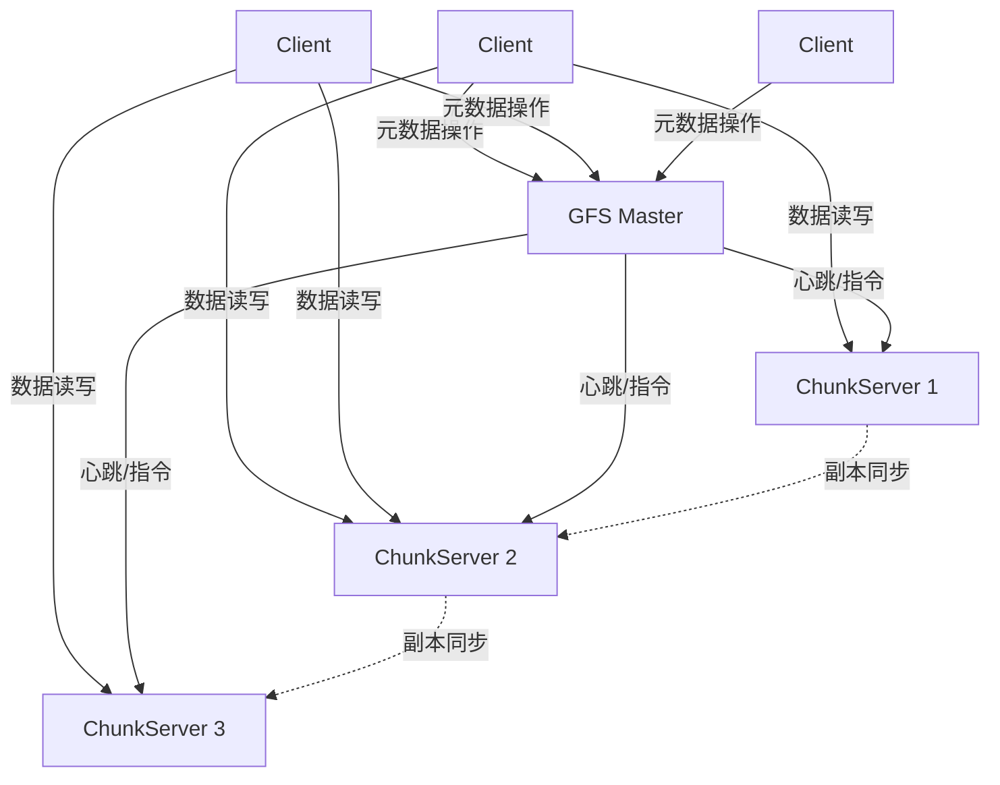

# Google File System (GFS) 深度分析

**文档版本**：v1.0
**创建时间**：2026年4月
**状态**：✅ 初稿完成

---

## 📋 执行摘要

Google File System (GFS) 是Google设计的可扩展分布式文件系统，专为大规模数据密集型应用而设计。GFS在廉价商用硬件上运行，提供容错能力，并为大量并发客户端提供高吞吐量的数据访问。

**核心设计哲学**：

- 组件故障是常态而非异常
- 文件巨大（通常GB到TB级别）
- 大部分文件修改是追加而非覆盖
- 与应用程序协同设计，提高灵活性

---

## 一、核心概念

### 1.1 定义与原理

GFS是一种**主从架构（Master-Worker）**的分布式文件系统，将文件分割成固定大小的块（Chunk），分布在多个ChunkServer上存储，由单个Master管理元数据。

### 1.2 关键特性

| 特性 | 说明 |
|------|------|
| **容错性** | 自动检测故障，多副本冗余 |
| **高吞吐量** | 并行读写，优化大数据流 |
| **可扩展性** | 水平扩展，支持PB级数据 |
| **一致性模型** | 宽松一致性，优先可用性 |
| **原子追加** | 支持多客户端并发追加 |

### 1.3 适用场景

| 场景 | 适用性 | 说明 |
|------|--------|------|
| 大规模数据分析 | ⭐⭐⭐⭐⭐ | MapReduce等批处理作业 |
| 日志收集与存储 | ⭐⭐⭐⭐⭐ | 高吞吐追加写 |
| 内容分发 | ⭐⭐⭐⭐ | 大文件读取 |
| 小文件存储 | ⭐⭐ | 不适合，元数据开销大 |
| 低延迟读写 | ⭐⭐ | 不适合，优化吞吐而非延迟 |

---

## 二、技术细节

### 2.1 架构设计



#### 核心组件

**GFS Master**

- 管理所有文件系统元数据
- 维护命名空间、访问控制信息
- 管理Chunk到ChunkServer的映射
- 协调系统范围的活动（负载均衡、垃圾回收）
- **不持久化存储Chunk位置信息**，仅在内存中维护

**ChunkServer**

- 存储实际的Chunk数据（默认64MB）
- 响应Client的数据读写请求
- 维护本地块的校验和（checksum）
- 定期向Master报告状态

**Client**

- 通过GFS客户端库与系统交互
- 缓存元数据，直接与ChunkServer通信
- 实现文件系统API

### 2.2 数据组织

#### Chunk设计

```
文件 → 划分为固定大小的Chunk（64MB）
     → 每个Chunk有全局唯一的64位Chunk Handle
     → 每个Chunk在多个ChunkServer上存储副本（默认3份）
```

**为什么选择64MB？**

1. 减少Client与Master的交互次数
2. 减少网络开销（TCP连接复用）
3. 减少元数据大小（Master内存中存储）

#### 元数据结构

Master内存中存储：

| 元数据类型 | 存储方式 | 大小估算 |
|-----------|---------|---------|
| 命名空间（文件/目录树） | 内存（B树） | 每文件约100字节 |
| 文件到Chunk映射 | 内存（查找表） | 每Chunk约64字节 |
| Chunk位置信息 | 内存（动态获取） | 不持久化 |
| 操作日志 | 磁盘（持久化） | 追加写入 |
| 检查点 | 磁盘（定期） | 全量快照 |

**容量估算**：

- 假设Master有64GB内存
- 每64MB Chunk需要约64字节元数据
- 可管理约10亿个Chunk = 64PB数据

### 2.3 读写流程

#### 读取流程

```
1. Client发送文件名和字节偏移给Master
2. Master返回包含该位置的Chunk Handle和副本位置
3. Client缓存元数据（文件名→Chunk Handle映射）
4. Client选择最近的ChunkServer发起读请求
5. ChunkServer返回Chunk数据和校验和
6. Client验证校验和，返回数据给应用程序
```

#### 写入流程（覆盖写）

```
1. Client询问Master哪个ChunkServer持有该Chunk的主副本
2. Master返回主副本（Primary）和次副本（Secondary）位置
3. Client向所有副本推送数据（流水线方式）
4. 所有副本确认收到数据后，Client向Primary发送写请求
5. Primary分配序列号，按序应用到本地副本
6. Primary转发写请求到所有Secondary
7. Secondary按相同序列号顺序应用写操作
8. Secondary向Primary确认
9. Primary向Client确认成功或失败
```

**关键设计**：

- **数据流与控制流分离**：数据先推送到所有副本，再发送写命令
- **流水线传输**：数据像流水线一样在ChunkServer间传递，提高吞吐
- **主副本协调**：Primary决定写操作顺序，保证一致性

### 2.4 一致性模型

#### GFS一致性保证

| 操作类型 | 成功结果 | 失败结果 |
|---------|---------|---------|
| 串行覆盖写 | 确定性（defined） | 不一致（inconsistent） |
| 并发覆盖写 | 一致但不确定（consistent but undefined） | 不一致 |
| 串行追加 | 确定性（defined interspersed with undefined） | 不一致 |
| 并发追加 | 至少追加一次（at least once） | 不一致 |

**关键点**：

- GFS提供**宽松一致性**，不保证所有副本完全相同
- 并发追加可能导致数据交错（interspersed）
- 应用程序需处理重复记录（使用唯一ID去重）

#### 记录追加（Record Append）

```
1. Client请求追加数据到文件末尾
2. 如果最后一个Chunk空间不足，Master创建新Chunk
3. Client向所有副本推送数据
4. Primary检查Chunk是否有足够空间
5. 如果有空间，追加到所有副本；如果没有，返回错误
6. 如果任何副本失败，Client重试
```

**原子性保证**：

- 记录追加是原子的，要么成功追加到所有副本，要么失败
- 但并发追加时，记录可能交错
- 记录可能部分重复（如果Primary成功但Secondary失败）

---

## 三、系统对比

### 3.1 主流分布式文件系统对比

| 维度 | GFS | HDFS | Ceph | GlusterFS |
|------|-----|------|------|-----------|
| **架构** | 主从（单Master） | 主从（NameNode HA） | 去中心化（CRUSH） | 去中心化 |
| **元数据管理** | 集中式（内存） | 集中式（内存+磁盘） | 分布式（RADOS） | 分布式 |
| **一致性** | 宽松 | 宽松 | 强一致性（可选） | 最终一致 |
| **适用场景** | 大文件批处理 | 大文件批处理 | 统一存储 | 通用文件存储 |
| **单点故障** | Master（Shadow支持） | NameNode（HA解决） | 无 | 无 |
| **POSIX兼容** | 部分 | 部分 | 完整 | 完整 |

### 3.2 选型决策树

```
需要分布式文件系统？
├── 主要存储大文件（>100MB）？
│   ├── 是 → 批处理分析为主？
│   │   ├── 是 → 已有Hadoop生态？
│   │   │   ├── 是 → HDFS
│   │   │   └── 否 → GFS模型（Colossus等）
│   │   └── 否 → Ceph（统一存储）
│   └── 否（小文件为主） → 考虑对象存储（S3）或Ceph
└── 需要POSIX完整兼容？
    ├── 是 → Ceph / GlusterFS
    └── 否 → 继续上面的选择
```

### 3.3 性能基准

| 指标 | GFS典型值 | HDFS典型值 | Ceph典型值 |
|------|-----------|------------|------------|
| 顺序读吞吐 | 数百MB/s | 数百MB/s | 数百MB/s |
| 顺序写吞吐 | 数百MB/s | 数百MB/s | 数百MB/s |
| 随机读IOPS | 低（优化大文件） | 低 | 中 |
| 元数据操作 | ~1000 ops/s | ~1000 ops/s | 更高（分布式） |
| 延迟 | 高（优化吞吐） | 高 | 中 |

---

## 四、实践指南

### 4.1 最佳实践

**1. 文件大小设计**

- 避免大量小文件（<1MB），会耗尽Master内存
- 合并小文件或使用顺序写入大文件

**2. 写入模式**

- 优先使用记录追加而非覆盖写
- 追加模式提供更好的容错性和性能

**3. 容错处理**

- 应用程序应使用校验和验证数据完整性
- 使用唯一ID处理可能的重复记录

**4. 元数据缓存**

- 合理设置Client元数据缓存时间
- 减少与Master的交互

### 4.2 故障处理

| 故障类型 | 检测机制 | 处理策略 |
|---------|---------|---------|
| ChunkServer故障 | Master心跳超时 | 标记为不可用，复制缺失副本 |
| 磁盘损坏 | 校验和验证 | 从其他副本恢复 |
| Master故障 | Shadow Master接管 | 切换Primary，恢复元数据 |
| 网络分区 | 心跳丢失 | 依赖超时机制，可能产生脑裂 |

### 4.3 监控指标

- Master内存使用率
- ChunkServer磁盘使用率
- Chunk副本不足数量
- 读写吞吐量
- 元数据操作延迟

---

## 五、形式化分析

### 5.1 正确性分析

**定理**：GFS保证写入成功的数据至少存在于一个副本中。

**证明概要**：

1. 写操作只有在Primary和所有成功响应的Secondary应用后才返回成功
2. 如果Primary故障，新的Primary会在旧Primary恢复前拒绝服务
3. 如果Secondary故障，Master会在检测到后复制Chunk到其他服务器
4. 因此，成功的写操作至少存在于一个副本

### 5.2 复杂度分析

| 操作 | 时间复杂度 | 消息复杂度 |
|------|-----------|-----------|
| 读取（缓存命中） | O(1) | 1（直接访问ChunkServer） |
| 读取（缓存未命中） | O(1) | 2（访问Master + ChunkServer） |
| 覆盖写 | O(1) | 2N（N=副本数，数据推送+写确认） |
| 记录追加 | O(1) | 2N（同覆盖写） |
| 创建文件 | O(log M) | 2（M=文件数量，B树操作） |

---

## 六、与其他主题的关联

### 6.1 上游依赖

- [CAP定理](../../02-THEORY/distributed-systems/CAP定理专题文档.md)
- [一致性模型](../../02-THEORY/distributed-systems/一致性模型专题文档.md)
- [主从复制](../../05-storage/replication/主从复制.md)

### 6.2 下游应用

- [MapReduce](../batch/MapReduce模型.md)
- [HDFS](HDFS实现.md)
- [Bigtable](../../05-storage/nosql/Bigtable.md)

### 6.3 演进路线

```
GFS (2003) → GFS2 → Colossus (Google内部)
          ↓
         HDFS (Apache开源实现)
          ↓
         Ceph/GlusterFS (去中心化演进)
```

---

## 七、参考资源

### 7.1 学术论文

1. [The Google File System](https://research.google/pubs/pub51/) - Sanjay Ghemawat, Howard Gobioff, Shun-Tak Leung, SOSP 2003
2. [GFS: Evolution on Fast-forward](https://queue.acm.org/detail.cfm?id=1594206) - ACM Queue, 2009

### 7.2 开源项目

1. [HDFS](https://hadoop.apache.org/docs/stable/hadoop-project-dist/hadoop-hdfs/HdfsDesign.html) - Apache Hadoop分布式文件系统
2. [Ceph](https://ceph.io/) - 统一分布式存储系统
3. [GlusterFS](https://www.gluster.org/) - 开源分布式文件系统

### 7.3 相关文档

- [分布式文件系统概述](../dfs/README.md)
- [HDFS实现](HDFS实现.md)
- [存储系统对比](../storage-comparison.md)

---

**维护者**：项目团队
**最后更新**：2026年4月


---

## 相关主题

- [HDFS实现](./HDFS实现.md)
- [Ceph架构](./Ceph架构.md)
- [MapReduce论文精读](../../01-foundation/mapreduce论文精读.md)

## 参考资源

- [GFS论文](https://research.google/pubs/the-google-file-system/)
