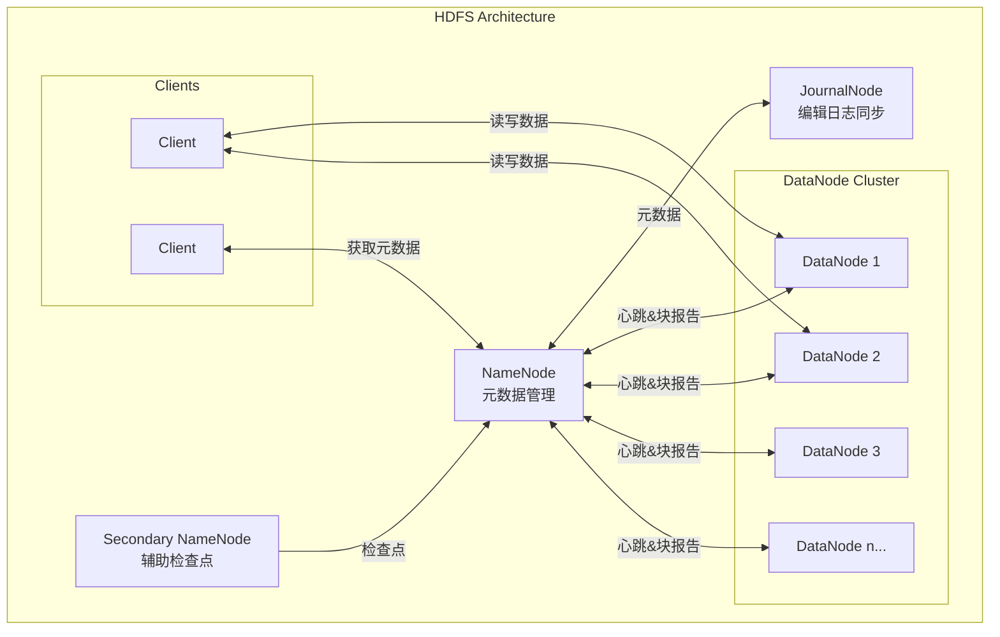
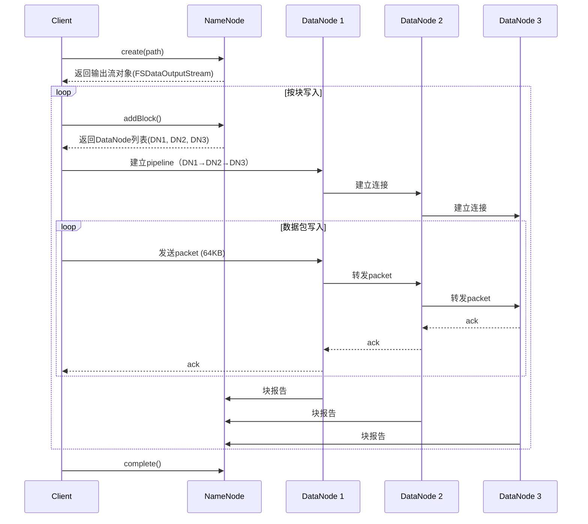
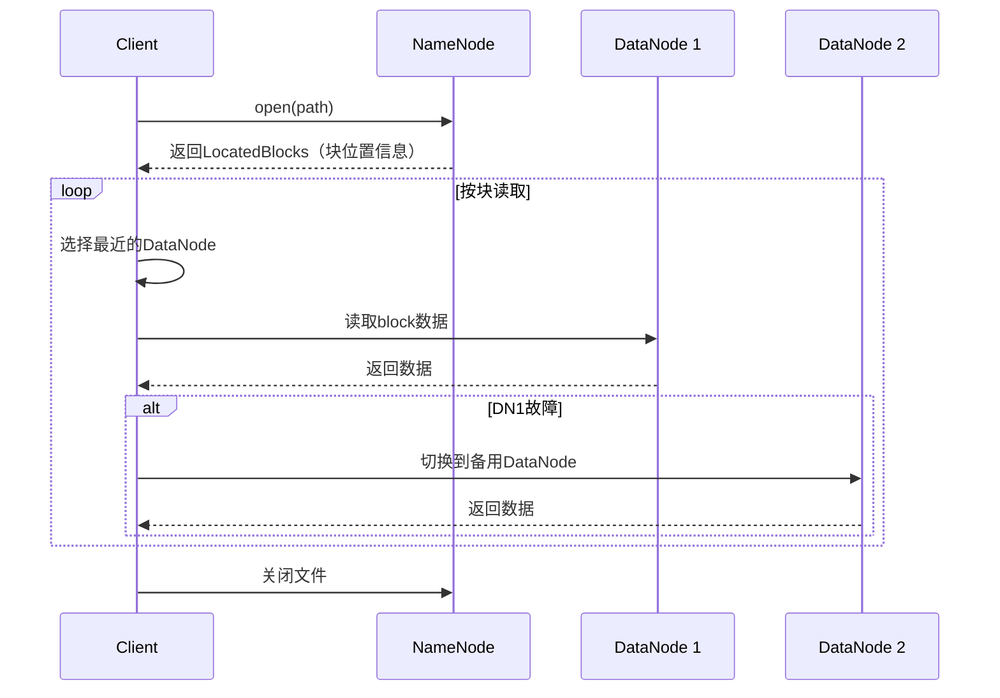
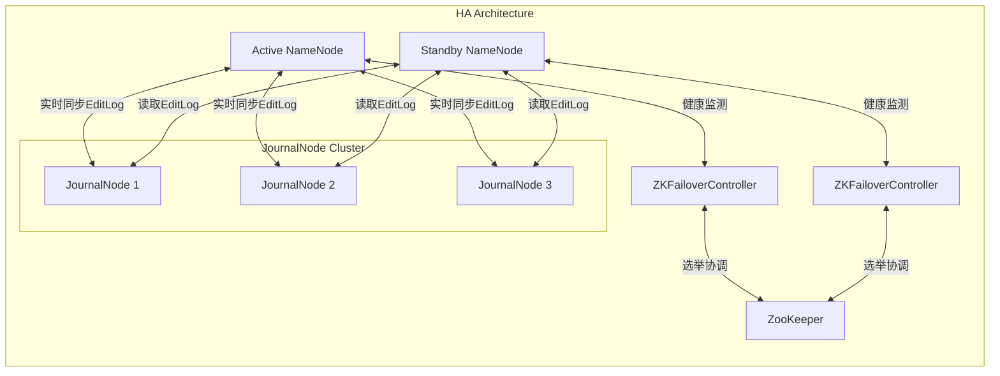

# HDFS实现 专题文档

**文档版本**：v1.0
**创建时间**：2026年4月
**最后更新**：2026年4月
**状态**：✅ 已完成

---

## 📋 执行摘要

HDFS（Hadoop Distributed File System）是Apache Hadoop项目的核心组件，是一个高度容错的分布式文件系统，专为在廉价硬件上运行而设计，能够提供高吞吐量的数据访问，特别适合大规模数据集的应用程序。

---

## 一、核心概念

### 1.1 定义与原理

**HDFS** 是一个主从（Master/Slave）架构的分布式文件系统，遵循GFS（Google File System）的设计思想。它将大文件分割成固定大小的数据块（默认128MB或256MB），并将这些块复制到多个DataNode上以实现容错。

**核心设计原则**：
- **故障常态化**：假设硬件故障是常态而非例外
- **流式数据访问**：优化批处理而非交互式低延迟访问
- **大规模数据集**：支持GB到TB级别的文件
- **简单一致性模型**：一次写入、多次读取（WORM）
- **计算向数据移动**：将计算程序移动到数据所在节点

### 1.2 关键特性

| 特性 | 描述 |
|------|------|
| **分块存储** | 文件被分割成固定大小的块（默认128MB），独立存储和复制 |
| **副本机制** | 每个数据块默认保存3个副本，分布在不同机架 |
| **容错性** | 自动检测故障并重新复制数据块，无需人工干预 |
| **高吞吐** | 优化大规模数据流的顺序读写，支持高并发访问 |
| **可扩展性** | 支持从几台到数千台服务器的水平扩展 |
| **数据本地性** | 优先在存储数据的节点上执行计算任务 |

### 1.3 适用场景

| 场景 | 适用性 | 说明 |
|------|--------|------|
| 大数据批处理（MapReduce/Spark） | ⭐⭐⭐⭐⭐ | 原生支持，数据本地性优化 |
| 数据仓库（Hive） | ⭐⭐⭐⭐⭐ | 大规模结构化数据存储 |
| 日志存储与分析 | ⭐⭐⭐⭐⭐ | 顺序写入、批量读取场景 |
| 流式数据写入 | ⭐⭐⭐⭐ | Flume/Kafka Connect集成 |
| 低延迟随机读取 | ⭐⭐ | 不适合小文件和随机访问 |
| 大量小文件存储 | ⭐ | NameNode内存限制，需要合并优化 |

---

## 二、技术细节

### 2.1 架构设计



#### 2.1.1 NameNode（主节点）

**职责**：
- 管理文件系统命名空间（目录树结构）
- 维护文件到数据块的映射关系
- 管理数据块到DataNode的映射
- 处理客户端的元数据操作请求

**元数据存储**：
- **FsImage**：文件系统命名空间的持久化快照
- **EditLog**：所有元数据变更的事务日志
- **内存结构**：加载整个命名空间到内存，加速访问

**关键数据结构**：
```java
// 简化示意
class INodeDirectory extends INode {
    List<INode> children;  // 子目录/文件
    PermissionStatus permission;
    long modificationTime;
}

class INodeFile extends INode {
    BlockInfo[] blocks;    // 数据块列表
    short replication;     // 副本数
    long preferredBlockSize;
}
```

#### 2.1.2 DataNode（数据节点）

**职责**：
- 存储实际的数据块（Block）
- 定期向NameNode发送心跳和块报告
- 执行数据块的创建、删除和复制
- 处理客户端的读写请求

**存储结构**：
```
${dfs.data.dir}/
├── current/
│   ├── BP-xxx-yyy-n/          # Block Pool目录
│   │   ├── current/
│   │   │   ├── finalized/     # 完成写入的数据块
│   │   │   │   ├── subdir0/
│   │   │   │   │   ├── blk_1073741825
│   │   │   │   │   ├── blk_1073741825_1001.meta
│   │   │   ├── rbw/           # 正在写入的数据块
│   │   │   └── VERSION
│   └── VERSION
└── in_use.lock
```

#### 2.1.3 Secondary NameNode（辅助NameNode）

**注意**：不是NameNode的热备份，仅辅助合并FsImage和EditLog

**工作流程**：
1. 定期从NameNode下载FsImage和EditLog
2. 在内存中合并生成新的FsImage
3. 将新的FsImage传回NameNode
4. 截断旧的EditLog

### 2.2 读写流程

#### 2.2.1 文件写入流程



**关键细节**：
- **Pipeline机制**：数据以packet（默认64KB）为单位流水线传输
- **packet确认**：每个packet需要收到下游ack才确认写入成功
- **副本放置策略**：
  - 第1个副本：写入节点（本地优先）
  - 第2个副本：不同机架的节点
  - 第3个副本：与第2个副本同机架的不同节点

#### 2.2.2 文件读取流程



**读取优化**：
- **就近读取**：优先选择本地DataNode，其次是同机架、不同机架
- **故障切换**：自动尝试其他副本，对客户端透明
- **预读机制**：顺序读取时预加载后续数据块

### 2.3 高可用性（HA方案）

#### 2.3.1 QJM（Quorum Journal Manager）架构



#### 2.3.2 状态切换机制

| 组件 | 功能 |
|------|------|
| **Active NameNode** | 处理所有客户端请求，写入EditLog到JournalNode集群 |
| **Standby NameNode** | 实时读取JournalNode的EditLog，保持与Active状态同步 |
| **JournalNode** | 奇数个（通常3个），存储EditLog，保证写操作的多数派确认 |
| **ZKFailoverController** | 监控NameNode健康状态，协调故障转移 |
| **ZooKeeper** | 维护选举锁，防止脑裂 |

**故障转移流程**：
1. ZKFC检测到Active NN无响应
2. 在ZK中删除Active NN的临时锁节点
3. Standby NN的ZKFC获得锁
4. Standby NN执行晋升：
   - 读取JournalNode上的剩余EditLog
   - 将自身状态改为Active
   - 开始处理客户端请求

#### 2.3.3 脑裂防护（Fencing）

**问题**：网络分区时可能出现双Active

**解决方案**：
```bash
# SSH Fencing
ssh fencer@old-active-nn "pkill -9 -f NameNode"

# 或shell fencing
shell(/bin/true)  # 执行自定义脚本
```

**QJM内建防护**：
- Standby晋升时必须获得JournalNode的写权限
- 原Active失去JournalNode写权限后无法继续写入

### 2.4 与GFS的对比

| 维度 | HDFS | GFS |
|------|------|-----|
| **设计来源** | Apache开源实现 | Google内部系统 |
| **块大小** | 128MB / 256MB | 64MB |
| **元数据管理** | 单NameNode（HA需额外配置） | 单Master |
| **副本数** | 3（可配置） | 3 |
| **一致性模型** | 宽松一致性，追加写 | 记录追加，原子性记录追加 |
| **快照** | 支持 | 支持 |
| **访问接口** | Java API, CLI, REST | 私有协议 |
| **数据本地性** | 强支持（MapReduce集成） | 支持 |
| **小文件处理** | 较弱（NameNode内存限制） | 较弱 |
| **跨数据中心** | 原生不支持 | 支持 |

**关键差异详解**：

1. **块大小演进**：HDFS从64MB（GFS）提升到128MB/256MB，适应更大规模数据
2. **HA实现**：HDFS通过QJM实现，GFS通过Shadow Master实现
3. **生态系统**：HDFS与Hadoop生态深度集成，GFS与Bigtable等内部系统集成

---

## 三、系统对比

### 3.1 主流分布式文件系统对比

| 维度 | HDFS | Ceph | GlusterFS | MooseFS |
|------|------|------|-----------|---------|
| **架构** | Master/Slave | 无中心（CRUSH） | 无中心（弹性哈希） | Master/Slave |
| **元数据服务** | 单点（HA可选） | 分布式（MDS集群） | 无专用元数据服务 | 单点（HA可选） |
| **一致性** | 最终一致性 | 强一致性（可选） | 最终一致性 | 强一致性 |
| **POSIX兼容** | 部分兼容 | 完全兼容 | 完全兼容 | 部分兼容 |
| **接口类型** | 专有API | 块/文件/对象 | 文件/NFS | 专有API |
| **小文件性能** | 差 | 中等 | 好 | 中等 |
| **扩展性** | 数千节点 | 数万节点 | 数千节点 | 数百节点 |
| **适用场景** | 大数据分析 | 统一存储 | 通用文件服务 | 中小规模存储 |

### 3.2 选型决策树

```
需求分析
├── 主要场景是大数据分析（Hadoop/Spark）？
│   ├── 是 → HDFS
│   └── 否 → 继续判断
├── 需要统一存储（块+文件+对象）？
│   ├── 是 → Ceph
│   └── 否 → 继续判断
├── 需要完全POSIX兼容？
│   ├── 是 → GlusterFS / CephFS
│   └── 否 → 继续判断
├── 云原生容器存储？
│   ├── 是 → Ceph RBD / Longhorn
│   └── 否 → 继续判断
└── 预算有限，追求简单？
    ├── 是 → GlusterFS / MinIO
    └── 否 → 企业存储方案（NetApp/EMC）
```

---

## 四、实践指南

### 4.1 部署配置

#### 4.1.1 core-site.xml 核心配置

```xml
<configuration>
    <!-- 指定NameNode地址 -->
    <property>
        <name>fs.defaultFS</name>
        <value>hdfs://nameservice1</value>
    </property>
    
    <!-- 指定Hadoop临时目录 -->
    <property>
        <name>hadoop.tmp.dir</name>
        <value>/data/hadoop/tmp</value>
    </property>
    
    <!-- 启用垃圾回收（删除文件保留天数） -->
    <property>
        <name>fs.trash.interval</name>
        <value>1440</value> <!-- 24小时 -->
    </property>
    
    <!-- HA配置：指定NameNode服务 -->
    <property>
        <name>ha.zookeeper.quorum</name>
        <value>zk1:2181,zk2:2181,zk3:2181</value>
    </property>
</configuration>
```

#### 4.1.2 hdfs-site.xml HDFS专用配置

```xml
<configuration>
    <!-- 块大小配置 -->
    <property>
        <name>dfs.blocksize</name>
        <value>268435456</value> <!-- 256MB -->
    </property>
    
    <!-- 副本数配置 -->
    <property>
        <name>dfs.replication</name>
        <value>3</value>
    </property>
    
    <!-- NameNode RPC地址 -->
    <property>
        <name>dfs.namenode.rpc-address.nameservice1.nn1</name>
        <value>nn1:8020</value>
    </property>
    <property>
        <name>dfs.namenode.rpc-address.nameservice1.nn2</name>
        <value>nn2:8020</value>
    </property>
    
    <!-- JournalNode配置 -->
    <property>
        <name>dfs.namenode.shared.edits.dir</name>
        <value>qjournal://jn1:8485;jn2:8485;jn3:8485/nameservice1</value>
    </property>
    
    <!-- 自动故障转移 -->
    <property>
        <name>dfs.ha.automatic-failover.enabled</name>
        <value>true</value>
    </property>
    
    <!-- DataNode数据目录 -->
    <property>
        <name>dfs.datanode.data.dir</name>
        <value>/data/dfs/data1,/data/dfs/data2</value>
    </property>
    
    <!-- NameNode元数据目录 -->
    <property>
        <name>dfs.namenode.name.dir</name>
        <value>/data/dfs/name</value>
    </property>
</configuration>
```

### 4.2 最佳实践

#### 4.2.1 NameNode内存规划

| 文件数 | 目录数 | 块数 | 推荐内存 |
|--------|--------|------|----------|
| 100万 | 10万 | 1000万 | 16GB |
| 500万 | 50万 | 5000万 | 64GB |
| 1000万 | 100万 | 1亿 | 128GB |
| 5000万 | 500万 | 5亿 | 512GB+（需联邦架构）|

**计算公式**：
```
NameNode内存 ≈ (文件数 + 目录数) × 200字节 + 块数 × 200字节
```

#### 4.2.2 小文件合并策略

**问题**：大量小文件导致NameNode内存压力和任务启动开销

**解决方案**：

1. **SequenceFile**：将小文件合并为二进制键值对文件
```java
// 写入SequenceFile示例
Configuration conf = new Configuration();
FileSystem fs = FileSystem.get(conf);
Path outputPath = new Path("/output/merged.seq");
SequenceFile.Writer writer = SequenceFile.createWriter(
    conf, 
    SequenceFile.Writer.file(outputPath),
    SequenceFile.Writer.keyClass(Text.class),
    SequenceFile.Writer.valueClass(BytesWritable.class)
);
// 写入多个小文件...
writer.close();
```

2. **HAR（Hadoop Archive）**：HDFS原生归档格式
```bash
# 创建HAR归档
hadoop archive -archiveName files.har -p /input /output

# 访问HAR文件
hadoop fs -ls har:///output/files.har/
```

3. **Compaction策略**：定期合并小文件

#### 4.2.3 数据均衡

```bash
# 查看数据分布
hdfs dfsadmin -report

# 运行数据均衡器（阈值10%）
start-balancer.sh -threshold 10

# 停止均衡
stop-balancer.sh
```

### 4.3 常见问题

**Q1: NameNode启动缓慢或失败？**

A: 排查步骤：
1. 检查FsImage和EditLog文件完整性：`hdfs oiv -i fsimage -o output`
2. 检查磁盘空间：`df -h`
3. 检查内存配置是否足够
4. 查看日志：`$HADOOP_LOG_DIR/hadoop-*-namenode-*.log`

**Q2: DataNode无法连接到NameNode？**

A: 排查步骤：
1. 检查网络连通性：`ping namenode-host`
2. 检查NameNode RPC端口：`netstat -anp | grep 8020`
3. 检查防火墙设置
4. 检查hdfs-site.xml配置是否正确

**Q3: 副本不足或块损坏？**

A: 处理命令：
```bash
# 查看损坏的块
hdfs fsck / -list-corruptfileblocks

# 修复（尝试从其他副本恢复）
hdfs fsck / -files -blocks -racks -locations

# 手动删除无法修复的文件（谨慎）
hdfs fsck /path/to/file -delete
```

**Q4: 安全模式（Safe Mode）无法退出？**

A: 
```bash
# 查看安全模式状态
hdfs dfsadmin -safemode get

# 手动离开安全模式（紧急情况）
hdfs dfsadmin -safemode leave

# 等待满足最小副本要求或强制格式化（数据会丢失）
```

---

## 五、形式化分析

### 5.1 副本放置的形式化描述

**目标**：在满足容错要求的同时，最小化跨机架带宽消耗

**约束条件**：
- 副本数 R = 3
- 机架数 Rack ≥ 2
- 同一机架内节点数 ≥ 2

**优化目标**：
```
minimize: 跨机架写入带宽
subject to:
  ∀block: replicas(block) = 3
  ∀block: rack_count(replicas(block)) ≥ 2  // 机架感知
```

### 5.2 数据局部性分析

**定理**：HDFS的数据本地性调度可减少约50%的网络流量

**证明概要**：
- 假设：计算集群与存储集群节点重合
- 理想情况：数据本地率 100%，网络流量 = 0
- 实际情况（机架本地）：网络流量 ≤ 数据量 × (非本地比例)
- 通过rack-local优化，典型场景网络流量减少 40-60%

---

## 六、与其他主题的关联

### 6.1 上游依赖

- [MapReduce计算框架](../../03-compute/mapreduce.md) - HDFS原生存算引擎
- [YARN资源调度](../../03-compute/yarn.md) - 容器化资源管理
- [ZooKeeper协调服务](../../02-coordination/zookeeper.md) - HA故障转移依赖

### 6.2 下游应用

- [Hive数据仓库](../hive.md) - 基于HDFS的SQL分析
- [HBase列存储](../../04-database/hbase.md) - 底层依赖HDFS
- [Spark计算引擎](../../03-compute/spark.md) - 兼容HDFS数据源

### 6.3 相关概念

| 概念 | 关系 | 说明 |
|------|------|------|
| GFS | 设计基础 | HDFS基于GFS论文实现 |
| 纠删码 | 替代方案 | HDFS 3.0+支持Erasure Coding替代副本 |
| 对象存储 | 对比 | S3/OSS适用于冷数据，HDFS适用于热数据 |
| 本地文件系统 | 底层依赖 | DataNode使用ext4/XFS存储块文件 |

---

## 七、参考资源

### 7.1 学术论文

1. [The Hadoop Distributed File System](https://ieeexplore.ieee.org/document/5496972) - Shvachko et al., IEEE MSST 2010
2. [The Google File System](https://research.google/pubs/pub51/) - Ghemawat et al., SOSP 2003
3. [HDFS Erasure Coding](https://www.usenix.org/conference/fast17/technical-sessions/presentation/xia) - Xia et al., FAST 2017

### 7.2 开源项目

1. [Apache Hadoop](https://hadoop.apache.org/) - HDFS官方实现
2. [HDFS-EC](https://hadoop.apache.org/docs/stable/hadoop-project-dist/hadoop-hdfs/HDFSErasureCoding.html) - 纠删码实现
3. [Ozone](https://ozone.apache.org/) - HDFS的下一代对象存储

### 7.3 学习资料

1. [Hadoop权威指南](https://www.oreilly.com/library/view/hadoop-the-definitive/) - O'Reilly出版，第3章深入HDFS
2. [HDFS架构指南](https://hadoop.apache.org/docs/stable/hadoop-project-dist/hadoop-hdfs/HdfsDesign.html) - 官方文档
3. [Cloudera HDFS调优指南](https://docs.cloudera.com/) - 企业级调优实践

### 7.4 相关文档

- [GFS设计原理](../storage-systems/gfs.md)
- [分布式存储选型](../storage-systems/selection.md)
- [大数据架构设计](../../architecture/big-data.md)

---

**维护者**：项目团队  
**最后更新**：2026年4月
