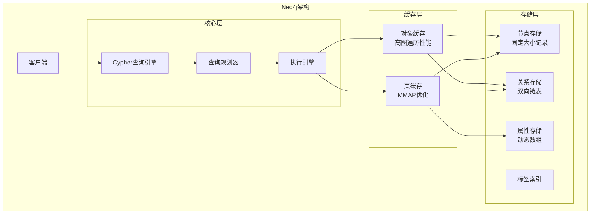
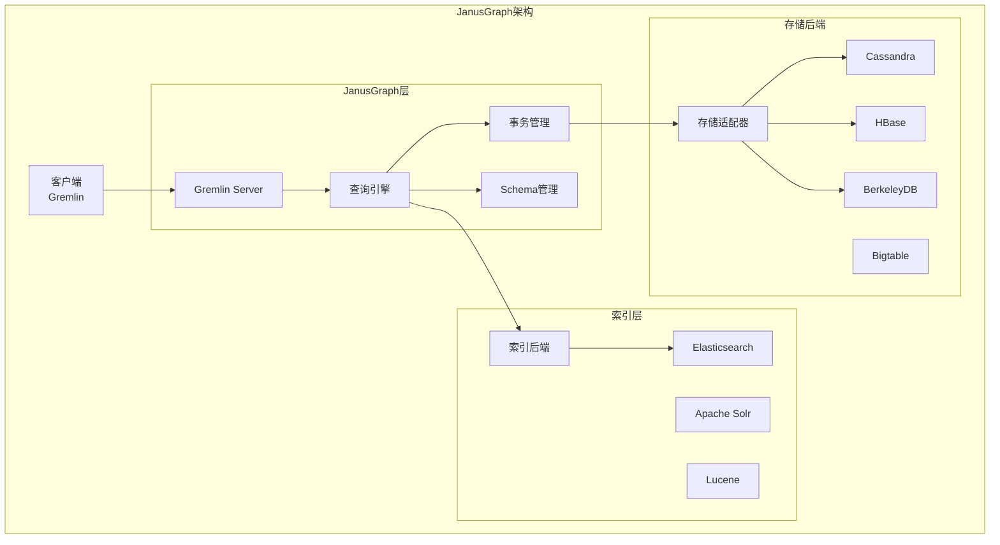
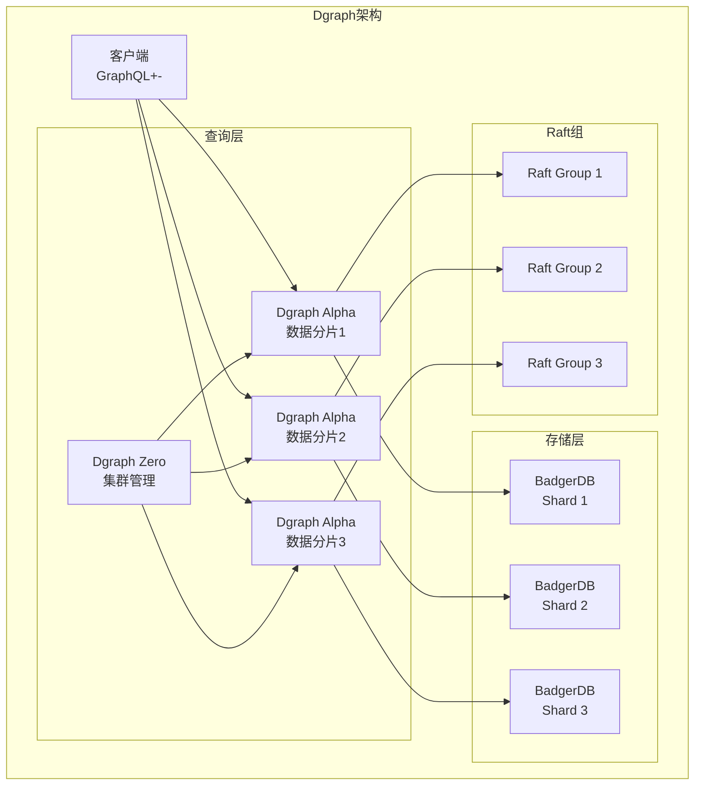
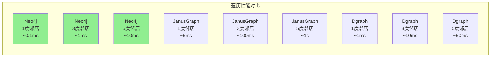

# 图数据库对比 专题文档

**文档版本**：v1.0
**创建时间**：2026年
**最后更新**：2026年
**状态**：✅ 已完成

---

## 📋 执行摘要

图数据库专为存储和查询图结构数据而设计，在处理复杂关系查询时性能远超关系型数据库。本文深入对比Neo4j、JanusGraph和Dgraph三种主流图数据库的架构、特性和适用场景。

---

## 一、核心概念

### 1.1 定义与原理

图数据库是一种**以图结构存储数据**的NoSQL数据库，核心概念包括：
- **节点（Node/Vertex）**：表示实体，可带属性
- **边（Edge/Relationship）**：表示关系，有向/无向，可带属性
- **属性（Property）**：键值对存储附加信息

**图模型类型**：
- **属性图（Property Graph）**：Neo4j、JanusGraph
- **RDF三元组**：语义网标准
- **原生图存储**：直接存储图结构，非邻接表转换

### 1.2 关键特性

- **关系优先**：边是一等公民，高效遍历
- **免索引邻接**：无需JOIN即可访问关联节点
- **灵活模式**：动态添加节点/边类型
- **图算法**：内置最短路径、PageRank等
- **可视化**：图形化数据探索

### 1.3 适用场景

| 场景 | 适用性 | 说明 |
|------|--------|------|
| 社交网络 | ⭐⭐⭐⭐⭐ | 好友关系、推荐系统 |
| 知识图谱 | ⭐⭐⭐⭐⭐ | 实体关系、语义搜索 |
| 欺诈检测 | ⭐⭐⭐⭐⭐ | 关联交易、环检测 |
| 网络/IT运维 | ⭐⭐⭐⭐⭐ | 依赖分析、根因分析 |
| 推荐引擎 | ⭐⭐⭐⭐ | 基于图的路径推荐 |
| 路径规划 | ⭐⭐⭐⭐ | 物流、导航优化 |

---

## 二、技术细节

### 2.1 Neo4j架构



**Neo4j存储格式**：

| 存储文件 | 内容 | 特点 |
|----------|------|------|
| `neostore.nodestore.db` | 节点记录 | 固定15字节/节点 |
| `neostore.relationshipstore.db` | 关系记录 | 固定34字节/关系 |
| `neostore.propertystore.db` | 属性记录 | 动态大小 |
| `neostore.labeltokenstore.db` | 标签定义 | 标签元数据 |

**免索引邻接实现**：
```
节点记录结构（15字节）：
├─ 第一个关系ID（4字节）
├─ 第一个属性ID（4字节）
├─ 标签组合或标签ID（5字节）
└─ 使用标记（2字节）

关系记录结构（34字节）：
├─ 起始节点ID（4字节）
├─ 结束节点ID（4字节）
├─ 关系类型ID（2字节）
├─ 第一个属性ID（4字节）
├─ 前一个关系ID（8字节）← 双向链表
├─ 后一个关系ID（8字节）← 双向链表
└─ 额外标记（4字节）
```

### 2.2 JanusGraph架构



**存储模型**：

| 元素 | 存储格式 | 说明 |
|------|----------|------|
| Vertex | `v[id] -> {label, properties}` | 行存储 |
| Edge | `e[id] -> {outV, inV, label, properties}` | 行存储 |
| Index | 倒排索引 | 支持复合索引 |
| Adjacency List | 邻接表 | 存储在宽列中 |

**Cassandra后端示例**：
```
Vertex表:
├─ row_key: vertex_id
├─ column: property_key
└─ value: property_value

Edge表:
├─ row_key: source_vertex_id + edge_label + direction
├─ column: target_vertex_id + edge_id
└─ value: edge_properties
```

### 2.3 Dgraph架构



**Dgraph核心组件**：

| 组件 | 功能 | 特点 |
|------|------|------|
| Zero | 集群管理、数据分片、事务协调 | 类似PD |
| Alpha | 数据存储、查询执行 | 原生图存储 |
| BadgerDB | 本地KV存储 | LSM-Tree，Go实现 |
| Raft | 数据复制 | 每组3个Alpha组成Raft组 |

**谓词切分（Predicate Sharding）**：
```
数据分片策略：按谓词（边/属性）分片

示例图数据：
Alice --friend--> Bob
Alice --name--> "Alice"
Bob --name--> "Bob"

分片结果：
├─ Group 1: predicate "friend"（所有friend边）
├─ Group 2: predicate "name"（所有name属性）
└─ Group 3: 其他谓词

优势：
- 查询局部性好
- 易于扩展
- 减少跨节点查询
```

### 2.4 查询语言对比

#### Cypher (Neo4j)

```cypher
// 创建节点和关系
CREATE (a:Person {name: 'Alice', age: 30})
CREATE (b:Person {name: 'Bob', age: 25})
CREATE (a)-[:FRIEND {since: '2020-01-01'}]->(b)

// 查询朋友的朋友（2度关系）
MATCH (a:Person {name: 'Alice'})-[:FRIEND*2]->(fof)
RETURN fof.name

// 最短路径
MATCH p=shortestPath(
  (a:Person {name: 'Alice'})-[:FRIEND*]-(b:Person {name: 'Charlie'})
)
RETURN p
```

#### Gremlin (JanusGraph)

```groovy
// 创建顶点
g.addV('person').property('name', 'Alice').property('age', 30)
 g.addV('person').property('name', 'Bob').property('age', 25)

// 创建边
g.V().has('name', 'Alice')
 .addE('friend')
 .to(g.V().has('name', 'Bob'))
 .property('since', '2020-01-01')

// 查询朋友的朋友
g.V().has('name', 'Alice')
 .out('friend')
 .out('friend')
 .values('name')

// 最短路径
g.V().has('name', 'Alice')
 .repeat(out('friend').simplePath())
 .until(has('name', 'Charlie'))
 .path()
 .limit(1)
```

#### GraphQL+- (Dgraph)

```graphql
// 创建数据
{
  set {
    _:alice <name> "Alice" .
    _:alice <age> "30" .
    _:bob <name> "Bob" .
    _:bob <age> "25" .
    _:alice <friend> _:bob (since="2020-01-01") .
  }
}

// 查询朋友的朋友
{
  q(func: eq(name, "Alice")) {
    name
    friend {
      name
      friend {
        name
      }
    }
  }
}

// 最短路径（递归查询）
{
  path as shortest(from: uid(alice), to: uid(charlie)) {
    friend
  }
  
  path(func: uid(path)) {
    name
  }
}
```

---

## 三、系统对比

### 3.1 主流图数据库对比矩阵

| 维度 | Neo4j | JanusGraph | Dgraph |
|------|-------|------------|--------|
| **架构** | 单机/集群（企业版） | 分布式 | 原生分布式 |
| **存储** | 原生图存储 | 后端适配（Cassandra/HBase） | 原生BadgerDB |
| **查询语言** | Cypher | Gremlin | GraphQL+- |
| **扩展性** | 垂直为主（社区版） | 水平扩展 | 水平扩展 |
| **事务** | ACID | 最终一致（依赖后端） | ACID |
| **性能** | 极高（单机） | 中等（依赖后端） | 高（分布式） |
| **部署复杂度** | 低 | 高 | 中 |
| **开源协议** | GPLv3/商业 | Apache 2.0 | Apache 2.0 |

### 3.2 性能基准对比



**典型性能数据**：

| 指标 | Neo4j | JanusGraph | Dgraph |
|------|-------|------------|--------|
| 单节点遍历（1跳） | <1ms | 5-10ms | 1-2ms |
| 多跳查询（3跳） | 1-5ms | 100-500ms | 10-50ms |
| 写入吞吐 | 100K/s | 50K/s | 200K/s |
| 最大数据规模 | TB级 | PB级 | 100TB+ |
| 水平扩展 | 有限 | 良好 | 原生支持 |

### 3.3 选型决策树

```
图数据库选型
├── 数据规模 < 10亿节点？
│   ├── 是 → 继续评估
│   └── 否 → 需要分布式图数据库
│       ├── 需要复杂查询和事务？
│       │   ├── 是 → Dgraph
│       │   └── 否 → JanusGraph
│
├── 需要成熟的可视化工具？
│   ├── 是 → Neo4j（Bloom）
│   └── 否 → 继续评估
│
├── 需要图算法库？
│   ├── 是 → Neo4j（Graph Data Science）
│   └── 否 → 继续评估
│
├── 需要与大数据生态集成？
│   ├── 是 → JanusGraph（Spark/Gremlin）
│   └── 否 → 继续评估
│
├── 团队熟悉GraphQL？
│   ├── 是 → Dgraph
│   └── 否 → 继续评估
│
└── 最终选择
    ├── 追求极致性能和易用性 → Neo4j
    ├── 已有Cassandra/HBase基础设施 → JanusGraph
    └── 追求分布式原生和性能 → Dgraph
```

---

## 四、实践指南

### 4.1 Neo4j部署配置

#### 社区版配置

```properties
# neo4j.conf
# 内存配置
dbms.memory.heap.initial_size=8G
dbms.memory.heap.max_size=8G
dbms.memory.pagecache.size=16G

# 存储优化
dbms.memory.transaction.global_max_size=4G
dbms.memory.transaction.max_size=2G

# 查询超时
dbms.transaction.timeout=5m

# 并发控制
dbms.threads.worker_count=16

# 安全配置
dbms.security.auth_enabled=true
dbms.ssl.policy.bolt.enabled=true
```

#### 数据建模最佳实践

```cypher
// 1. 使用标签区分实体类型
CREATE (a:Person:Developer {name: 'Alice'})
CREATE (b:Company:Startup {name: 'TechCorp'})

// 2. 关系命名使用动词
CREATE (a)-[:WORKS_AT {since: '2020-01-01'}]->(b)

// 3. 避免过度使用属性
// 推荐：将频繁查询的属性提升为关系
// 不推荐：在关系上存储过多属性

// 4. 使用索引加速查询
CREATE INDEX person_name FOR (p:Person) ON (p.name)
CREATE CONSTRAINT person_id FOR (p:Person) REQUIRE p.id IS UNIQUE

// 5. 批量导入使用APOC或LOAD CSV
CALL apoc.periodic.iterate(
  'LOAD CSV WITH HEADERS FROM "file:///users.csv" AS row RETURN row',
  'CREATE (p:Person) SET p = row',
  {batchSize: 10000, parallel: true}
)
```

### 4.2 JanusGraph部署配置

#### Cassandra + ES后端配置

```properties
# janusgraph.properties
# 存储后端
gremlin.graph=org.janusgraph.core.JanusGraphFactory
storage.backend=cql
storage.hostname=10.0.1.1,10.0.1.2,10.0.1.3
storage.cql.keyspace=janusgraph

# 索引后端
index.search.backend=elasticsearch
index.search.hostname=10.0.1.10:9200
index.search.index-name=janusgraph

# 缓存配置
cache.db-cache=true
cache.db-cache-clean-wait=20
cache.db-cache-time=180000
cache.db-cache-size=0.3

# 批量加载优化
storage.batch-loading=true
storage.buffer-size=10240
```

#### Gremlin查询优化

```groovy
// 1. 使用索引查询
graph.traversal().V().has('name', 'Alice')  // 使用索引

// 2. 避免全表扫描
// 不推荐：g.V().hasLabel('Person').filter(...)
// 推荐：g.V().has('name', textContains('Ali'))

// 3. 使用profile分析查询
g.V().has('name', 'Alice').out('friend').profile()

// 4. 批量操作
// 使用JanusGraph事务批量提交
graph.tx().open()
// ... 批量操作
graph.tx().commit()

// 5. 调整查询深度限制
// 避免无限深度遍历
g.V().has('name', 'Alice')
 .repeat(out('friend'))
 .times(3)  // 限制深度
 .emit()
```

### 4.3 Dgraph部署配置

#### 集群部署

```bash
# 启动Zero（协调节点）
dgraph zero --my=zero:5080 --peer=zero:5080

# 启动Alpha（数据节点）
dgraph alpha --my=alpha1:7080 --zero=zero:5080 --whitelist 10.0.0.0/8

# 启动Ratel（UI界面）
dgraph-ratel
```

#### Schema设计

```graphql
# 定义Schema
type Person {
  name: string! @index(exact, trigram)
  age: int
  email: string @index(exact) @upsert
  friend: [Person]
  works_at: Company
}

type Company {
  name: string! @index(exact)
  industry: string @index(hash)
  employees: [Person] @reverse
}

# 反向索引
# @reverse自动创建反向边，支持双向查询
```

### 4.4 常见问题

**Q1: 图数据库vs关系型数据库的关系查询？**
A:
```
关系型（SQL）              图数据库
━━━━━━━━━━━━━━━━━━━━━━━━━━━━━━━━━━━━━━━━
多层JOIN（性能差）    vs    免索引邻接（性能优）
固定模式              vs    灵活模式
适合表格数据          vs    适合连接数据
预定义关系            vs    动态关系发现

选择建议：
- 关系深度>2层 → 图数据库
- 需要路径分析 → 图数据库
- 简单外键关联 → 关系型足够
```

**Q2: 如何处理超大规模图（百亿级节点）？**
A:
- Neo4j：企业版集群或分片策略
- JanusGraph：水平扩展，优化存储后端
- Dgraph：原生支持，增加Alpha节点
- 通用策略：
  - 图分区（按领域/时间）
  - 只加载活跃子图到内存
  - 使用近似算法（采样、 sketches）

**Q3: 图数据库数据导入优化？**
A:

| 数据库 | 导入工具 | 优化建议 |
|--------|----------|----------|
| Neo4j | `neo4j-admin import` | 离线批量导入，停用索引 |
| JanusGraph | BulkLoaderVertexProgram | 使用Spark并行导入 |
| Dgraph | Live Loader / Bulk Loader | 先定义Schema，批量提交 |

---

## 五、形式化分析

### 5.1 图遍历复杂度

**复杂度分析**：

| 操作 | 时间复杂度 | 说明 |
|------|-----------|------|
| 点查 | O(1) | 直接访问 |
| 1度邻居 | O(k) | k为节点度数 |
| n度邻居 | O(k^n) | 指数增长 |
| 最短路径 | O(V + E) | BFS算法 |
| 全图遍历 | O(V + E) | DFS/BFS |

**免索引邻接优势**：
```
传统数据库（关系型）：
查询朋友的朋友需要：
1. 查用户表（索引查找）
2. 查关系表（JOIN）
3. 再查关系表（JOIN）
复杂度：O(log V + k1 × log V + k1 × k2 × log V)

图数据库（免索引邻接）：
1. 从节点直接访问关系链表
2. 遍历关系到相邻节点
3. 继续遍历
复杂度：O(k1 + k1 × k2) = O(k1 × k2)
```

### 5.2 一致性模型

| 数据库 | 默认一致性 | 事务支持 |
|--------|------------|----------|
| Neo4j | ACID | 完全支持 |
| JanusGraph | 最终一致 | 依赖后端（Cassandra支持轻量事务） |
| Dgraph | 线性一致 | ACID（基于Raft） |

---

## 六、与其他主题的关联

### 6.1 上游依赖

- [B-Tree索引](../btree索引.md)
- [LSM-Tree存储](../lsm-tree架构.md)
- [Raft共识](../../03-consensus/raft算法.md)
- [分布式事务](../../04-transaction/分布式事务.md)

### 6.2 下游应用

- [知识图谱构建](../../06-distributed-systems/knowledge-graph.md)
- [推荐系统](../../06-distributed-systems/recommendation-system.md)
- [欺诈检测](../../06-distributed-systems/fraud-detection.md)

### 6.3 相关概念

| 概念 | 关系 | 说明 |
|------|------|------|
| RDF | 标准 | 语义网标准，部分图数据库支持 |
| SPARQL | 查询语言 | RDF图的标准查询语言 |
| TinkerPop | 框架 | JanusGraph基于Apache TinkerPop |
| GNN | 应用 | 图神经网络，基于图数据的机器学习 |

---

## 七、参考资源

### 7.1 学术论文

1. [The Neo4j Graph Data Platform](https://neo4j.com/whitepapers/) - Neo4j白皮书
2. [JanusGraph: An Open-Source Distributed Graph Database](https://doi.org/10.1145/3183713.3196952) - JanusGraph论文
3. [Dgraph: A Distributed, Low Latency Graph Database](https://dgraph.io/paper) - Dgraph论文
4. [Graph Databases: New Opportunities for Connected Data](https://neo4j.com/graph-databases-book/) - 图数据库经典书籍

### 7.2 开源项目

1. [Neo4j](https://github.com/neo4j/neo4j) - Neo4j社区版
2. [JanusGraph](https://github.com/JanusGraph/janusgraph) - 分布式图数据库
3. [Dgraph](https://github.com/dgraph-io/dgraph) - 原生分布式图数据库
4. [Apache TinkerPop](https://tinkerpop.apache.org/) - 图计算框架

### 7.3 学习资料

1. [Neo4j Graph Academy](https://neo4j.com/graphacademy/) - 免费图数据库课程
2. [JanusGraph Documentation](https://docs.janusgraph.org/) - 官方文档
3. [Dgraph Tour](https://dgraph.io/tour/) - 交互式教程
4. [Graph Data Science](https://neo4j.com/product/graph-data-science/) - 图算法库

### 7.4 相关文档

- [NoSQL数据库对比](../nosql/nosql对比分析.md)
- [分布式数据库选型](./newsql对比分析.md)
- [RDF与知识图谱](../rdf知识图谱.md)

---

**维护者**：项目团队
**最后更新**：2026年
