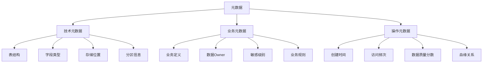
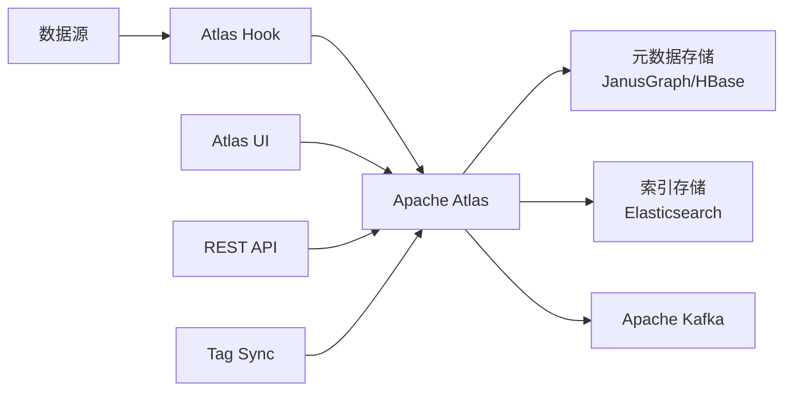
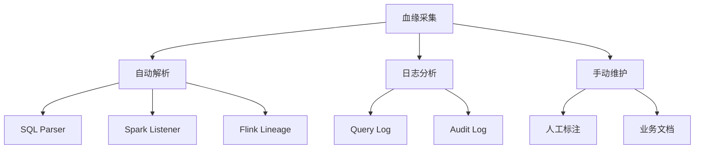
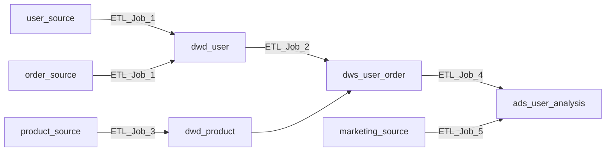
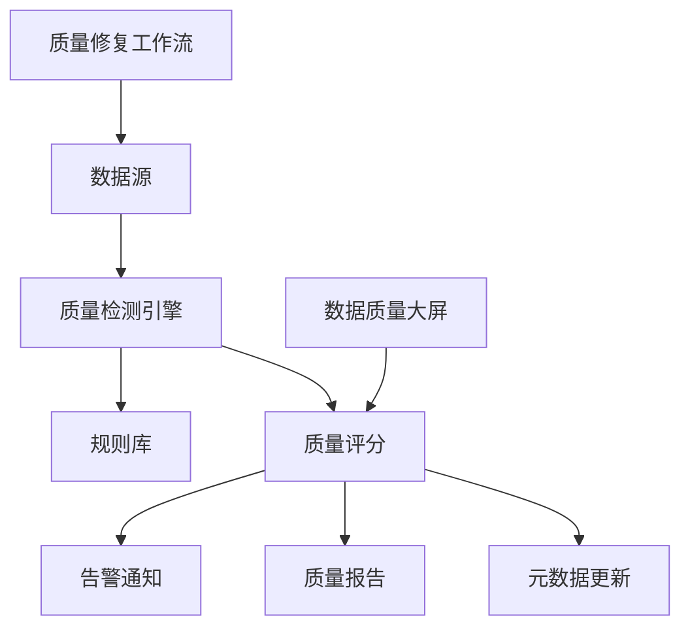
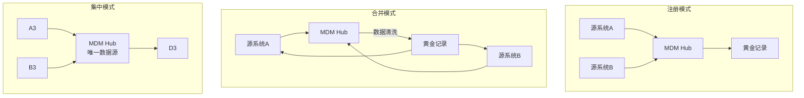
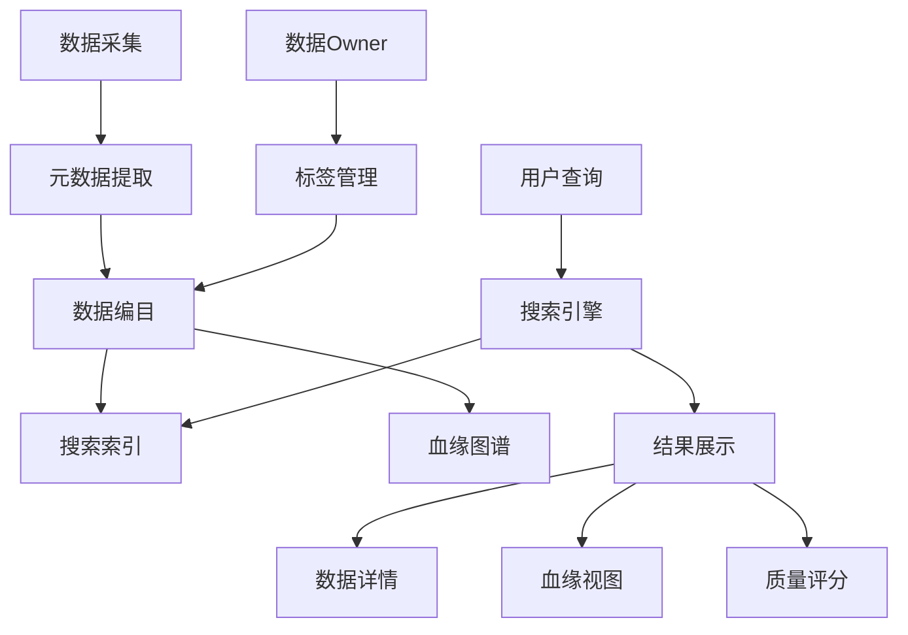

# 数据治理 专题文档

**文档版本**：v1.0
**创建时间**：2026年
**最后更新**：2026年
**状态**：✅ 已完成

---

## 📋 执行摘要

数据治理是确保数据质量、安全性和可用性的系统性方法，涵盖元数据管理、数据血缘、数据质量、主数据管理和数据目录等核心领域。在大数据和AI时代，有效的数据治理是实现数据驱动决策和合规要求的基础。

---

## 一、核心概念

### 1.1 定义与原理

**数据治理定义**

数据治理（Data Governance）是对数据资产的管理活动，包括：

- **数据质量**：确保数据准确、完整、一致、及时
- **数据安全**：保护数据免受未授权访问和泄露
- **数据合规**：遵守法律法规（GDPR、CCPA、等保）
- **数据生命周期**：从创建到销毁的全流程管理

**数据治理框架**

```
数据治理
├── 组织架构
│   ├── 数据治理委员会
│   ├── 数据所有者（Data Owner）
│   └── 数据管家（Data Steward）
├── 管理制度
│   ├── 数据标准
│   ├── 数据政策
│   └── 操作流程
└── 技术平台
    ├── 元数据管理
    ├── 数据质量
    └── 数据安全
```

### 1.2 关键特性

- **元数据管理**：描述数据的数据，包括技术元数据、业务元数据、操作元数据
- **数据血缘**：追踪数据从源头到目标的完整流转路径
- **数据质量**：量化评估数据的准确性、完整性、一致性、时效性
- **主数据管理**：统一管理核心业务实体（客户、产品、供应商）
- **数据目录**：提供统一的数据发现和检索能力

### 1.3 适用场景

| 场景 | 适用性 | 说明 |
|------|--------|------|
| 合规审计 | ⭐⭐⭐⭐⭐ | GDPR、SOX、等保2.0要求 |
| 数据资产盘点 | ⭐⭐⭐⭐⭐ | 企业级数据目录建设 |
| 数据质量提升 | ⭐⭐⭐⭐⭐ | 建立数据质量监控体系 |
| 数据安全管控 | ⭐⭐⭐⭐ | 敏感数据发现与保护 |
| 影响分析 | ⭐⭐⭐⭐ | 变更影响范围评估 |

---

## 二、元数据管理

### 2.1 元数据分类



### 2.2 Apache Atlas架构

**核心组件**



**关键特性**

| 特性 | 说明 |
|------|------|
| **类型系统** | 灵活的元模型定义，支持自定义类型 |
| **分类标签** | 基于标签的安全策略和治理 |
| **血缘追踪** | 自动捕获数据流转关系 |
| **搜索发现** | 全文检索和高级过滤 |
| **安全集成** | 与Ranger集成实现列级授权 |

### 2.3 Atlas类型系统

```java
// 定义实体类型示例
{
  "typeName": "hive_table",
  "attributeDefs": [
    {"name": "name", "typeName": "string"},
    {"name": "db", "typeName": "hive_db"},
    {"name": "columns", "typeName": "array<hive_column>"},
    {"name": "owner", "typeName": "string"}
  ]
}

// 分类标签示例
{
  "typeName": "PII",
  "superTypes": ["Security"],
  "attributeDefs": [
    {"name": "level", "typeName": "string"}
  ]
}
```

---

## 三、数据血缘

### 3.1 血缘类型

| 血缘类型 | 描述 | 示例 |
|---------|------|------|
| **表级血缘** | 表与表之间的关系 | table_a → table_b |
| **列级血缘** | 字段级别的映射 | table_a.col1 → table_b.col2 |
| **任务血缘** | ETL/作业依赖关系 | job_a → job_b |
| **报表血缘** | 报表与数据源关系 | table_a → dashboard_1 |

### 3.2 血缘采集方式



### 3.3 血缘分析算法

**SQL解析流程**

```
输入：SQL语句
步骤：
1. 词法分析（Lexer）→ Token序列
2. 语法分析（Parser）→ AST抽象语法树
3. 语义分析 → 识别表、列、操作类型
4. 血缘提取 → 构建依赖图
5. 存储 → 图数据库（Neo4j/JanusGraph）

输出：血缘关系图
```

**示例血缘图**



---

## 四、数据质量

### 4.1 数据质量维度

| 维度 | 定义 | 度量指标 |
|------|------|---------|
| **准确性** | 数据与真实值的符合程度 | 准确率、错误率 |
| **完整性** | 数据字段的填充程度 | 填充率、缺失率 |
| **一致性** | 跨系统数据的一致性 | 一致率、冲突数 |
| **及时性** | 数据的更新频率 | 延迟时间、新鲜度 |
| **唯一性** | 主键或业务键的唯一性 | 重复率 |
| **有效性** | 数据格式和范围的有效性 | 合规率 |

### 4.2 数据质量规则

```yaml
# 数据质量规则配置示例
rules:
  - name: user_id_not_null
    type: completeness
    table: users
    column: user_id
    condition: NOT NULL
    threshold: 99.99%

  - name: email_format_valid
    type: validity
    table: users
    column: email
    pattern: '^[\w\.-]+@[\w\.-]+\.\w+$'
    threshold: 98%

  - name: age_range_check
    type: validity
    table: users
    column: age
    min: 0
    max: 150
    threshold: 99%

  - name: order_amount_positive
    type: consistency
    table: orders
    column: amount
    condition: amount > 0
    threshold: 100%
```

### 4.3 数据质量监控架构



### 4.4 Great Expectations框架

```python
# Great Expectations示例
import great_expectations as gx

context = gx.get_context()

# 创建Expectation Suite
suite = context.add_expectation_suite("users_suite")

# 添加期望规则
suite.add_expectation(
    gx.expectations.ExpectColumnValuesToNotBeNull(
        column="user_id"
    )
)

suite.add_expectation(
    gx.expectations.ExpectColumnValuesToMatchRegex(
        column="email",
        regex=r"^[\w\.-]+@[\w\.-]+\.\w+$"
    )
)

suite.add_expectation(
    gx.expectations.ExpectColumnValuesToBeBetween(
        column="age",
        min_value=0,
        max_value=150
    )
)

# 验证数据
checkpoint = context.add_checkpoint(
    name="users_checkpoint",
    expectation_suite_name="users_suite",
    batch_request=batch_request
)
result = checkpoint.run()
```

---

## 五、主数据管理（MDM）

### 5.1 主数据类型

| 主数据域 | 描述 | 关键属性 |
|---------|------|---------|
| **客户主数据** | 客户信息统一管理 | 客户ID、名称、联系方式 |
| **产品主数据** | 产品目录管理 | SKU、品类、规格、价格 |
| **供应商主数据** | 供应商信息管理 | 供应商编码、资质、评级 |
| **组织主数据** | 组织架构管理 | 部门、岗位、人员 |
| **地点主数据** | 地理位置信息 | 地址、区域、仓库 |

### 5.2 MDM架构模式



### 5.3 数据匹配与合并

```python
# 实体解析示例
from recordlinkage import Index, Compare

# 创建索引
indexer = Index()
indexer.block('postal_code')
candidate_links = indexer.index(df_a, df_b)

# 比较记录
compare = Compare()
compare.string('name', 'name', method='jarowinkler', threshold=0.85)
compare.exact('birth_date', 'birth_date')
compare.string('address', 'address', method='levenshtein', threshold=0.7)

features = compare.compute(candidate_links, df_a, df_b)

# 机器学习分类
matches = classifier.predict(features)
```

---

## 六、数据目录

### 6.1 数据目录架构



### 6.2 数据目录核心功能

| 功能 | 描述 |
|------|------|
| **自动发现** | 扫描数据源自动注册元数据 |
| **智能推荐** | 基于使用模式推荐相关数据 |
| **业务词汇表** | 统一业务术语和定义 |
| **数据预览** | 样例数据展示（脱敏） |
| **访问申请** | 数据访问权限申请流程 |

### 6.3 开源数据目录对比

| 工具 | 开发方 | 主要特性 | 适用场景 |
|------|--------|---------|---------|
| **Apache Atlas** | Apache | 与Hadoop生态集成好 | 大数据平台 |
| **DataHub** | LinkedIn | 现代架构、实时血缘 | 企业级目录 |
| **Amundsen** | Lyft | 搜索体验优秀 | 数据发现 |
| **OpenMetadata** | OpenMetadata | 一体化平台 | 全栈治理 |
| **Marquez** | WeWork | 专注血缘追踪 | 数据工程 |

---

## 七、实践指南

### 7.1 Apache Atlas部署

```properties
# atlas-application.properties
atlas.graph.storage.backend=hbase
atlas.graph.storage.hbase.table=atlas
atlas.graph.index.search.backend=elasticsearch
atlas.graph.index.search.hostname=localhost:9200

# Kafka通知
atlas.notification.topics=ATLAS_HOOK,ATLAS_ENTITIES
atlas.kafka.zookeeper.connect=localhost:2181
atlas.kafka.bootstrap.servers=localhost:9092

# Hook配置
atlas.hook.hive.synchronous=true
atlas.hook.hive.minThreads=5
atlas.hook.hive.maxThreads=10
```

### 7.2 DataHub快速开始

```yaml
# docker-compose.yml 关键服务
datahub-gms:
  image: linkedin/datahub-gms:latest
  environment:
    - DATAHUB_GMS_HOST=datahub-gms
    - DATAHUB_GMS_PORT=8080
    - ELASTICSEARCH_HOST=elasticsearch
    - NEO4J_HOST=neo4j

datahub-frontend:
  image: linkedin/datahub-frontend-react:latest
  ports:
    - "9002:9002"
  environment:
    - DATAHUB_GMS_HOST=datahub-gms
```

### 7.3 数据质量监控配置

```yaml
# data-quality-monitor.yaml
monitors:
  - name: daily_data_quality_check
    schedule: "0 2 * * *"
    checks:
      - database: analytics
        tables:
          - name: fact_orders
            rules:
              - column: order_id
                check: not_null
                threshold: 100%
              - column: order_amount
                check: positive
                threshold: 100%
              - column: created_at
                check: freshness
                max_delay: 1h
    alerts:
      - type: slack
        webhook: https://hooks.slack.com/...
      - type: email
        recipients: [data-team@company.com]
```

### 7.4 最佳实践

1. **元数据管理**
   - 建立统一的元数据标准
   - 自动化元数据采集，减少人工维护
   - 定期审核和更新元数据

2. **数据血缘**
   - 从ETL工具自动采集血缘
   - 建立血缘变更通知机制
   - 结合影响分析进行变更管理

3. **数据质量**
   - 从关键业务表开始实施
   - 设置合理的质量阈值
   - 建立质量问题的闭环处理流程

4. **数据目录**
   - 鼓励业务用户参与数据标注
   - 建立数据Owner责任制
   - 集成数据质量评分提升信任度

### 7.5 常见问题

**Q1: 如何平衡数据治理的严格性和灵活性？**

A:

- 对核心数据实施严格治理
- 对探索性分析提供沙箱环境
- 建立数据治理的分级管理制度

**Q2: 数据血缘精度与性能如何权衡？**

A:

- 表级血缘：自动化、全覆盖
- 列级血缘：关键表精细采集
- 使用采样减少全量解析开销

**Q3: 数据质量规则如何持续优化？**

A:

- 基于历史数据设置动态阈值
- 收集误报反馈调整规则
- 定期评审规则有效性

---

## 八、与其他主题的关联

### 8.1 上游依赖

- [数据湖架构](./数据湖架构.md)
- [数据仓库对比](../../06-computing/batch/数据仓库对比.md)

### 8.2 下游应用

- [CDC变更数据捕获](../../06-computing/stream/CDC变更数据捕获.md)
- [数据安全与合规](../security/data-security.md)

### 8.3 相关概念

| 概念 | 关系 | 说明 |
|------|------|------|
| 数据编织 | 演进 | 主动元数据驱动的自动化治理 |
| DataOps | 协同 | 数据治理与数据工程的融合 |
| 数据网格 | 架构 | 去中心化的数据治理模式 |

---

## 九、参考资源

### 9.1 官方文档

1. [Apache Atlas官方文档](https://atlas.apache.org/) - Hadoop生态元数据治理
2. [DataHub文档](https://datahubproject.io/docs/) - 现代数据目录平台
3. [OpenMetadata文档](https://docs.open-metadata.org/) - 统一数据治理平台

### 9.2 开源项目

1. [Apache Atlas](https://github.com/apache/atlas) - 元数据管理和治理
2. [LinkedIn DataHub](https://github.com/datahub-project/datahub) - 元数据平台
3. [Lyft Amundsen](https://github.com/amundsen-io/amundsen) - 数据发现和目录
4. [OpenMetadata](https://github.com/open-metadata/OpenMetadata) - 统一数据治理
5. [Great Expectations](https://github.com/great-expectations/great_expectations) - 数据质量框架

### 9.3 学习资料

1. [数据治理：理论与实践](https://www.databricks.com/glossary/data-governance) - Databricks数据治理指南
2. [Data Governance: The Definitive Guide](https://www.oreilly.com/library/view/data-governance-the/9781492063483/) - O'Reilly出版

---

**维护者**：项目团队
**最后更新**：2026年
