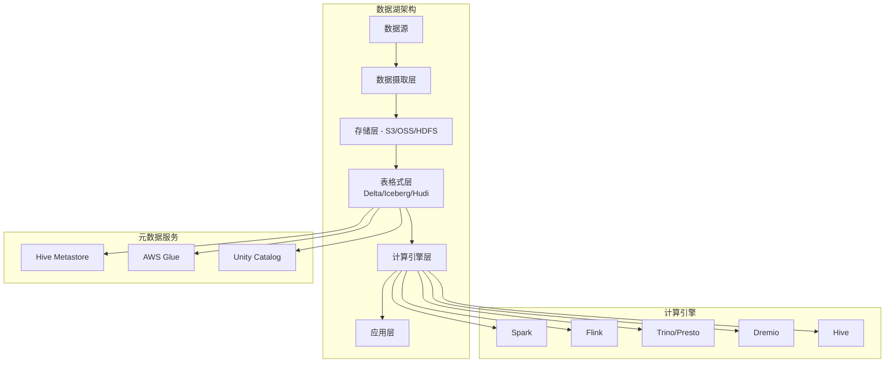
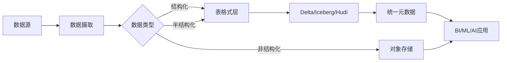
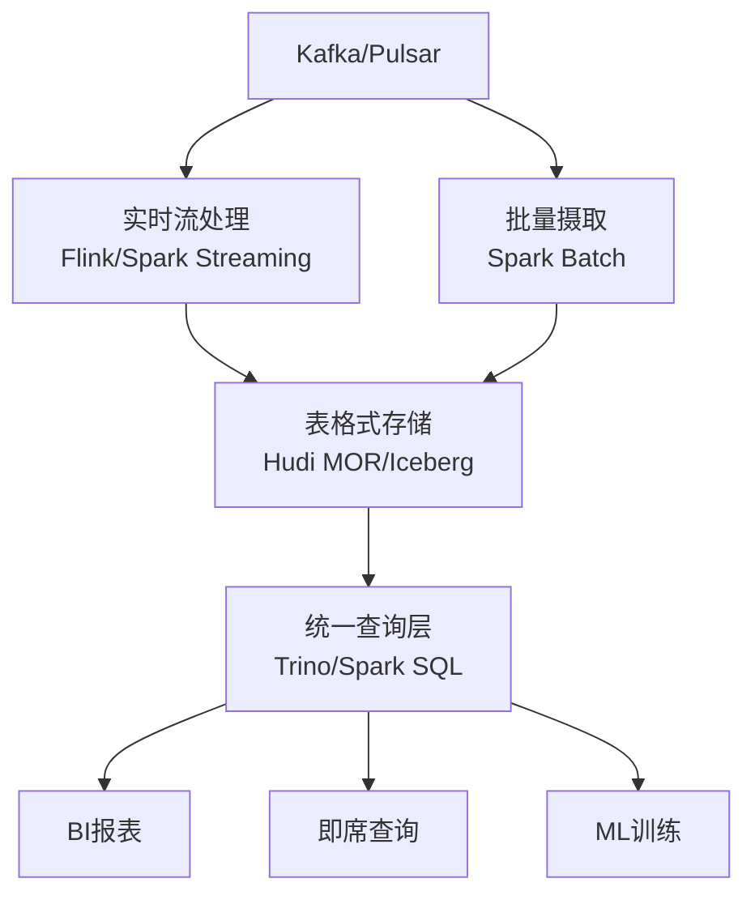

# 数据湖架构 专题文档

**文档版本**：v1.0
**创建时间**：2026年
**最后更新**：2026年
**状态**：✅ 已完成

---

## 📋 执行摘要

数据湖（Data Lake）是一种以原始格式存储海量异构数据的存储架构，支持结构化、半结构化和非结构化数据的统一存储与分析。湖仓一体（Lakehouse）结合了数据湖的灵活性和数据仓库的可靠性，通过表格式（Table Format）技术实现事务性、版本控制和高效查询。

---

## 一、核心概念

### 1.1 定义与原理

**数据湖定义**

数据湖是一种存储架构，允许以原始格式存储海量数据，无需预先定义模式（Schema-on-Read）。核心原则包括：

- **原始数据存储**：保留数据的原始形态，支持回溯和重新处理
- **Schema-on-Read**：读取时解析模式，而非写入时强制定义
- **多格式支持**：同时容纳结构化、半结构化、非结构化数据
- **低成本存储**：利用对象存储（S3、OSS、HDFS）的经济性

**湖仓一体（Lakehouse）**

湖仓一体是在数据湖之上构建数据仓库功能的新型架构，通过表格式技术实现：

- ACID事务支持
- 数据版本控制（Time Travel）
- 模式演进（Schema Evolution）
- 高效查询性能

### 1.2 关键特性

| 特性 | 传统数据湖 | 湖仓一体 |
|------|-----------|---------|
| **事务支持** | ❌ 无 | ✅ ACID |
| **数据质量** | ❌ 弱 | ✅ 强约束 |
| **查询性能** | ⚠️ 一般 | ✅ 优化索引 |
| **模式管理** | ❌ Schema-on-Read | ✅ Schema Evolution |
| **成本** | ✅ 低 | ✅ 低 |
| **灵活性** | ✅ 高 | ✅ 高 |

### 1.3 适用场景

| 场景 | 适用性 | 说明 |
|------|--------|------|
| 机器学习数据湖 | ⭐⭐⭐⭐⭐ | 存储原始训练数据、特征工程、模型版本 |
| 实时数据分析 | ⭐⭐⭐⭐⭐ | 流批一体，统一存储实时和离线数据 |
| 数据探索与科学 | ⭐⭐⭐⭐⭐ | 原始数据保留，支持灵活分析 |
| 企业级数仓现代化 | ⭐⭐⭐⭐ | 替代传统数仓，降低成本 |
| 合规与审计 | ⭐⭐⭐⭐ | 数据血缘、版本追溯 |

---

## 二、技术细节

### 2.1 架构设计



### 2.2 表格式（Table Format）对比

#### Apache Hudi

**核心概念**

- **Copy-on-Write (COW)**：更新时复制整个文件，读优化
- **Merge-on-Read (MOR)**：更新时追加日志文件，写优化
- **Timeline**：记录所有表操作的时间线

**架构组件**

```
Hudi Table
├── .hoodie/                    # 元数据目录
│   ├── 20240101120000.commit   # 提交元数据
│   ├── 20240101130000.commit
│   └── hoodie.properties       # 表属性
├── <partition_path>/
│   ├── <file_id>_1.parquet     # 基础文件
│   └── .<file_id>_1.log.1      # 日志文件（MOR）
```

**关键特性**

- 增量处理（Incremental Processing）
- 流式摄取（Delta Streamer）
- 数据跳过（Data Skipping）
- 布隆过滤器索引

#### Apache Iceberg

**核心概念**

- **快照（Snapshot）**：表的不可变版本
- **清单文件（Manifest）**：数据文件列表及其统计信息
- **元数据文件**：记录表结构和所有快照

**架构层次**

```
Iceberg Table
├── metadata/
│   ├── 00001-abc.metadata.json    # 根元数据
│   ├── 00002-def.metadata.json    # 新快照
│   ├── snap-abc.avro              # 快照清单列表
│   └── m-1.avro                   # 清单文件
└── data/
    └── date=2024-01-01/
        └── 00001.parquet
```

**关键特性**

- 隐藏分区（Hidden Partitioning）
- 时间旅行（Time Travel）
- 分区演进（Partition Evolution）
- 矢量化读取

#### Delta Lake

**核心概念**

- **Delta Log**：JSON格式的操作日志
- **检查点（Checkpoint）**：Parquet格式的日志快照
- **协议（Protocol）**：版本化的读写协议

**架构结构**

```
Delta Table
├── _delta_log/
│   ├── 00000000000000000000.json    # 提交日志
│   ├── 00000000000000000001.json
│   ├── 00000000000000000010.json
│   └── 00000000000000000010.checkpoint.parquet
└── part-00001.parquet
```

**关键特性**

- 自动优化（Auto Optimize）
- 预测性IO（Predictive I/O）
- Liquid Clustering（动态聚类）
- Predictive Caching

### 2.3 系统对比矩阵

| 维度 | Apache Hudi | Apache Iceberg | Delta Lake |
|------|-------------|----------------|------------|
| **开发公司** | Uber | Netflix/Apple | Databricks |
| **主要计算引擎** | Spark、Flink | Spark、Flink、Trino | Spark（最佳） |
| **写入模式** | COW/MOR | COW | COW（主要） |
| **增量读取** | ⭐⭐⭐⭐⭐ | ⭐⭐⭐⭐ | ⭐⭐⭐ |
| **时间旅行** | ⭐⭐⭐⭐ | ⭐⭐⭐⭐⭐ | ⭐⭐⭐⭐⭐ |
| **并发控制** | OCC/MVCC | OCC | OCC |
| **索引支持** | 布隆过滤器、HBase | 有限 | Liquid Clustering |
| **CDC支持** | ⭐⭐⭐⭐⭐ | ⭐⭐⭐ | ⭐⭐⭐⭐ |
| **社区活跃度** | 高 | 极高 | 高 |

### 2.4 选型决策树

```
业务需求分析
├── 主要使用Spark？
│   ├── 是 → 考虑Delta Lake（原生集成）
│   └── 否 → 继续判断
├── 需要流式CDC？
│   ├── 是 → Apache Hudi（增量处理最强）
│   └── 否 → 继续判断
├── 多引擎查询（Trino/Presto）？
│   ├── 是 → Apache Iceberg（查询优化最好）
│   └── 否 → 继续判断
├── 云厂商锁定？
│   ├── AWS → 三者皆可，Iceberg有Glue集成
│   ├── Azure → Delta Lake（原生支持）
│   └── GCP → BigLake支持Iceberg
└── 默认推荐 → Apache Iceberg（生态最开放）
```

---

## 三、湖仓一体实现

### 3.1 统一存储架构



### 3.2 流批一体设计



---

## 四、实践指南

### 4.1 Hudi部署配置

```properties
# hudi.properties
hoodie.table.name=user_events
hoodie.table.type=MERGE_ON_READ
hoodie.datasource.write.recordkey.field=user_id
hoodie.datasource.write.partitionpath.field=dt
hoodie.datasource.write.precombine.field=ts

# 索引配置
hoodie.index.type=BLOOM
hoodie.bloom.index.filter.type=DYNAMIC_V0

# 压缩配置
hoodie.compaction.strategy=org.apache.hudi.table.action.compact.strategy.UnBoundedCompactionStrategy
hoodie.compact.inline=true
hoodie.compact.inline.max.delta.commits=5
```

### 4.2 Iceberg配置示例

```sql
-- 创建Iceberg表
CREATE TABLE iceberg_catalog.db.events (
    user_id BIGINT,
    event_type STRING,
    event_time TIMESTAMP,
    properties MAP<STRING, STRING>
) USING iceberg
PARTITIONED BY (days(event_time))
TBLPROPERTIES (
    'write_compression'='ZSTD',
    'commit.manifest.min-count-to-merge'='5'
);

-- 时间旅行查询
SELECT * FROM iceberg_catalog.db.events
TIMESTAMP AS OF '2024-01-01 00:00:00';
```

### 4.3 Delta Lake配置

```python
# Delta Lake优化配置
spark.conf.set("spark.sql.extensions", "io.delta.sql.DeltaSparkSessionExtension")
spark.conf.set("spark.sql.catalog.spark_catalog", "org.apache.spark.sql.delta.catalog.DeltaCatalog")

# 启用自动优化
spark.conf.set("spark.databricks.delta.optimizeWrite.enabled", "true")
spark.conf.set("spark.databricks.delta.autoCompact.enabled", "true")

# Liquid Clustering（Delta 3.0+）
spark.conf.set("spark.databricks.delta.clusteredTable.enabled", "true")
```

### 4.4 最佳实践

1. **分区策略**
   - 选择高基数但不过高的分区键（建议 < 10,000 个分区）
   - 避免数据倾斜，监控分区大小分布
   - 考虑使用 Iceberg 的隐藏分区

2. **文件大小优化**
   - 目标文件大小：128MB-1GB
   - 定期运行压缩（Compaction）
   - 使用排序和 Z-Ordering 优化查询

3. **元数据管理**
   - 定期清理旧快照（Retention Policy）
   - 监控元数据文件增长
   - 使用检查点减少日志读取

4. **并发写入控制**
   - 理解 OCC 冲突场景
   - 合理设置重试策略
   - 考虑使用 WAP（Write-Audit-Publish）模式

### 4.5 常见问题

**Q1: 如何解决小文件问题？**

A:

- Hudi: 配置内联压缩（inline compaction）和集群（clustering）
- Iceberg: 使用 `OPTIMIZE` 命令重写数据文件
- Delta: 启用 `autoCompact` 和 `optimizeWrite`

**Q2: 时间旅行保留策略如何设置？**

A:

```sql
-- Delta Lake
ALTER TABLE events SET TBLPROPERTIES ('delta.logRetentionDuration'='interval 30 days');

-- Iceberg
ALTER TABLE events SET TBLPROPERTIES ('history.expire.max-snapshot-age-ms'='604800000');
```

**Q3: 如何选择 COW 和 MOR？**

A:

- **COW（Copy-on-Write）**：读多写少场景，查询性能优先
- **MOR（Merge-on-Read）**：写多读少场景，摄取延迟优先

---

## 五、与其他主题的关联

### 5.1 上游依赖

- [HDFS分布式文件系统](../dfs/hdfs-architecture.md)
- [对象存储](../object-storage/s3-oss.md)
- [Kafka消息队列](../../07-messaging/kafka-architecture.md)

### 5.2 下游应用

- [Spark计算引擎](../../06-computing/batch/spark-core.md)
- [Flink流处理](../../06-computing/stream/flink-architecture.md)
- [数据仓库对比](../../06-computing/batch/数据仓库对比.md)

### 5.3 相关概念

| 概念 | 关系 | 说明 |
|------|------|------|
| 数据仓库 | 对比 | 湖仓一体融合了两者的优势 |
| 数据治理 | 依赖 | 需要元数据管理和数据血缘 |
| 流处理 | 集成 | 通过表格式实现流批统一 |

---

## 六、参考资源

### 6.1 官方文档

1. [Apache Hudi官方文档](https://hudi.apache.org/docs/overview) - 增量数据处理
2. [Apache Iceberg官方文档](https://iceberg.apache.org/docs/latest/) - 开放表格式
3. [Delta Lake官方文档](https://docs.delta.io/latest/index.html) - 可靠的存储层

### 6.2 技术论文

1. [Delta Lake: High-Performance ACID Table Storage over Cloud Object Stores](https://VLDB.org/pvldb/vol13/p3411-armbrust.pdf) - VLDB 2020
2. [Apache Iceberg: An Open Table Format for Massive Analytics Datasets](https://www.vldb.org/pvldb/vol13/p3418-armbrust.pdf) - VLDB 2020

### 6.3 开源项目

1. [Apache Hudi](https://github.com/apache/hudi) - 支持增量处理的存储框架
2. [Apache Iceberg](https://github.com/apache/iceberg) - 开放的大数据表格式
3. [Delta Lake](https://github.com/delta-io/delta) - 可靠的存储层

### 6.4 云厂商集成

1. [AWS Glue Data Catalog with Iceberg](https://docs.aws.amazon.com/glue/latest/dg/aws-glue-programming-etl-format-iceberg.html)
2. [Azure Synapse Analytics Delta Lake](https://docs.microsoft.com/azure/synapse-analytics/spark/apache-spark-delta-lake-overview)
3. [Google BigLake for Iceberg](https://cloud.google.com/bigquery/docs/iceberg-tables)

---

**维护者**：项目团队
**最后更新**：2026年
