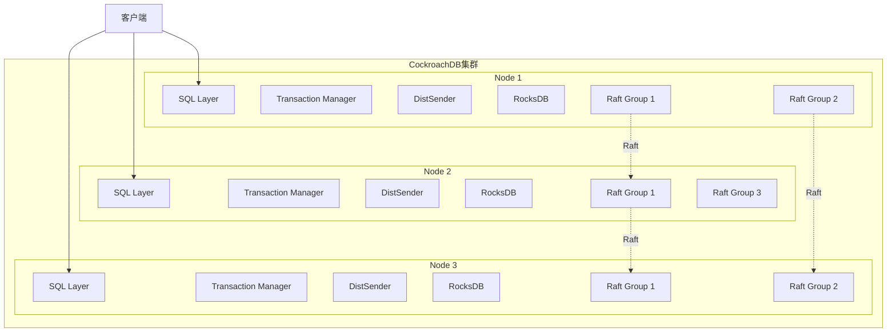
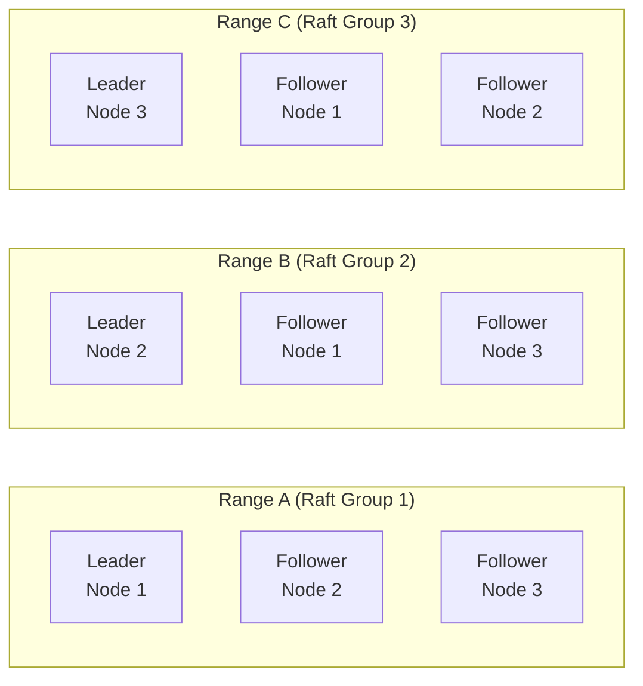

# CockroachDB架构 专题文档

**文档版本**：v1.0
**创建时间**：2026年
**最后更新**：2026年
**状态**：✅ 已完成

---

## 📋 执行摘要

CockroachDB（简称CRDB）是一个开源的分布式SQL数据库，提供与Google Spanner类似的水平扩展能力和强一致性保证，默认提供Serializable隔离级别，是NewSQL领域的代表性开源实现。

---

## 一、核心概念

### 1.1 定义与原理

CockroachDB是由Cockroach Labs开发的分布式关系型数据库，其设计目标是在全球分布式环境中提供：

- **水平扩展**：通过添加节点线性扩展吞吐量和存储
- **强一致性**：使用Raft共识算法保证数据一致性
- **高可用性**：容忍节点、机架甚至区域级故障
- **SQL兼容**：支持标准SQL和ACID事务

**核心设计哲学**：

- 自动分片（Range-based）
- 多版本并发控制（MVCC）
- 无单点故障的完全分布式架构

### 1.2 关键特性

- **分布式SQL引擎**：查询解析、优化和执行分布在所有节点
- **多Raft组架构**：每个Range独立使用Raft进行复制
- **Serializable默认隔离**：最高级别的事务隔离，防止所有异常
- **地理分区**：支持数据按地理位置分布和复制
- **在线Schema变更**：零停机时间的数据库结构修改
- **代价优化器**：基于成本的查询优化器

### 1.3 适用场景

| 场景 | 适用性 | 说明 |
|------|--------|------|
| 金融交易系统 | ⭐⭐⭐⭐⭐ | 强一致性保证，Serializable隔离 |
| 全球分布式应用 | ⭐⭐⭐⭐⭐ | 地理复制，就近读取 |
| 高可用关键业务 | ⭐⭐⭐⭐⭐ | 自动故障转移，无单点故障 |
| 海量数据OLTP | ⭐⭐⭐⭐ | 水平扩展，支持PB级数据 |
| 复杂分析查询 | ⭐⭐⭐ | 更适合OLTP，分析需配合其他工具 |

---

## 二、技术细节

### 2.1 架构设计



**核心组件**：

| 组件 | 功能 | 实现 |
|------|------|------|
| SQL Layer | 解析、优化SQL查询 | PostgreSQL协议兼容 |
| Transaction Manager | 事务协调，并发控制 | 混合逻辑时钟（HLC） |
| DistSender | 路由请求到正确Range | 基于Range元数据 |
| Raft | 分布式共识 | 每个Range独立Raft组 |
| RocksDB | 本地存储引擎 | LSM-Tree结构 |

### 2.2 分布式SQL引擎

#### 查询处理流程

```
客户端SQL
    ↓
协议解析 (PostgreSQL wire protocol)
    ↓
语法解析 → 抽象语法树 (AST)
    ↓
语义分析 → 解析后的AST
    ↓
查询优化器 (Cost-based Optimizer)
    ↓
分布式执行计划
    ↓
DistSQL执行
    ↓
结果聚合 → 返回客户端
```

**关键优化技术**：

- **代价优化器**：使用统计信息选择最优执行计划
- **分布式执行**：将计算推送到数据所在节点
- **向量化执行**：批量处理数据，提高CPU效率

### 2.3 Raft一致性（多Raft组）

#### 多Raft架构



**Range（分片）机制**：

- 数据按主键范围划分为多个Range（默认64MB）
- 每个Range是一个独立的Raft组
- 通常3-5个副本，默认3副本
- 副本分布在不同节点和可用区

**Raft配置参数**：

| 参数 | 默认值 | 说明 |
|------|--------|------|
| `num_replicas` | 3 | 每个Range的副本数 |
| `range_min_bytes` | 128MB | Range分裂阈值下限 |
| `range_max_bytes` | 512MB | Range分裂阈值上限 |
| `raft_tick_interval` | 200ms | Raft心跳间隔 |

#### 一致性级别

- **Leader租赁（Lease）**：保证Leader在租赁期内不会被选举改变
- **线性一致性（Linearizable）**：默认读保证，可能从Follower读取
- **严格串行化（Serializable）**：通过事务时间戳排序实现

### 2.4 事务模型

#### Serializable隔离实现

CockroachDB使用**混合逻辑时钟（Hybrid Logical Clock, HLC）** 实现分布式事务：

```
┌─────────────────────────────────────────────────────────┐
│                    事务执行流程                          │
├─────────────────────────────────────────────────────────┤
│  1. 开始事务 → 获取HLC时间戳 (Start Timestamp)          │
│  2. 读取数据 → 使用Start Timestamp读快照                 │
│  3. 写入数据 → 缓冲在事务记录中                          │
│  4. 提交事务 →                                           │
│     a. 获取Commit Timestamp                              │
│     b. 两阶段提交（2PC）                                 │
│     c. 写入Intent记录                                    │
│     d. 等待锁释放                                        │
│  5. 清理Intent                                           │
└─────────────────────────────────────────────────────────┘
```

**写冲突处理（Write-Write Conflict）**：

- 使用**写意图（Write Intent）**机制
- 检测到冲突时，后来者等待或根据策略处理
- 支持优先级和事务重试

**读优化**：

- **Follower Read**：从Follower读取过期数据（可配置过期时间）
- **Leaseholder Read**：从Leaseholder读取最新数据

#### 事务性能优化

| 特性 | 机制 | 收益 |
|------|------|------|
| 1PC优化 | 单Range事务避免2PC | 降低延迟50%+ |
| 并行提交 | 同时准备和提交 | 减少等待时间 |
| 读刷新（Refresh） | 验证读集未改变 | 减少事务重启 |
| 流水线执行 | 批量发送Raft命令 | 提高吞吐量 |

---

## 三、系统对比

### 3.1 CockroachDB vs Google Spanner

| 维度 | CockroachDB | Google Spanner |
|------|-------------|----------------|
| 开源性 | 开源（BSL/Apache） | 闭源云服务 |
| 时间同步 | HLC（无需原子钟） | TrueTime（原子钟+GPS） |
| 部署方式 | 自建/托管 | 仅Google Cloud |
| 外部一致性 | 基于HLC的可序列化 | 外部一致性（更强） |
| 全球部署 | 支持，需配置 | 原生支持全球分布 |
| 成本 | 灵活 | 较高 |
| SQL兼容性 | PostgreSQL协议 | 类似PostgreSQL |

**关键差异**：

- Spanner使用原子钟实现**外部一致性**（External Consistency），而CockroachDB使用HLC实现**可序列化**（Serializable）
- 在大多数场景下，两者提供的隔离级别效果相当

### 3.2 CockroachDB vs 其他NewSQL

| 维度 | CockroachDB | TiDB | YugabyteDB |
|------|-------------|------|------------|
| 存储引擎 | RocksDB | TiKV+RocksDB | DocDB+RocksDB |
| 复制协议 | Multi-Raft | Multi-Raft | Raft |
| 默认隔离级别 | Serializable | Snapshot | Snapshot |
| 架构 | 共享存储 | 计算存储分离 | 共享存储 |
| 协议兼容 | PostgreSQL | MySQL | PostgreSQL/CQL |
| 地理复制 | 原生支持 | 需配置 | 原生支持 |

### 3.3 性能基准

| 指标 | CockroachDB | 说明 |
|------|-------------|------|
| 单节点写入 | ~10K TPS | 取决于硬件 |
| 线性扩展比 | ~0.8 | 添加N节点获得0.8N性能 |
| P99延迟（本地） | 2-5ms | 单Region |
| P99延迟（跨Region） | 50-200ms | 取决于距离 |
| 最大支持规模 | 100+节点 | 生产验证 |

---

## 四、实践指南

### 4.1 部署配置

#### 最小生产配置

```yaml
# 3节点集群推荐配置
# cockroach start 参数
--listen-addr=0.0.0.0:26257
--http-addr=0.0.0.0:8080
--join=node1:26257,node2:26257,node3:26257
--cache=25%          # 内存的25%用于缓存
--max-sql-memory=25% # 内存的25%用于SQL处理
--background
```

#### 区域配置（Zone Configuration）

```sql
-- 配置副本数量和位置
ALTER RANGE default CONFIGURE ZONE USING
    num_replicas = 5,
    constraints = '[+region=us-east, +region=us-west, +region=eu-west]',
    lease_preferences = '[[+region=us-east]]';

-- 地理分区表
CREATE TABLE orders (
    id UUID PRIMARY KEY,
    region STRING,
    data STRING
) PARTITION BY LIST (region) (
    PARTITION us_east VALUES IN ('us-east'),
    PARTITION eu_west VALUES IN ('eu-west')
);
```

### 4.2 最佳实践

#### 1. Schema设计

```sql
-- 使用INTERLEAVED表减少分布式事务
CREATE TABLE customers (
    id UUID PRIMARY KEY,
    name STRING
);

CREATE TABLE orders (
    id UUID,
    customer_id UUID,
    total DECIMAL,
    PRIMARY KEY (customer_id, id)
) INTERLEAVE IN PARENT customers (customer_id);
```

#### 2. 索引优化

```sql
-- 使用STORING减少索引查找
CREATE INDEX idx_orders_date ON orders (created_at)
STORING (total, status);

-- 避免过多索引，影响写入性能
-- 每个索引增加一次Raft写入
```

#### 3. 事务优化

```sql
-- 使用SAVEPOINT实现重试逻辑
BEGIN;
SAVEPOINT cockroach_restart;
-- 事务操作
RELEASE SAVEPOINT cockroach_restart;
COMMIT;
```

#### 4. 查询优化

```sql
-- 使用EXPLAIN分析查询计划
EXPLAIN (VERBOSE) SELECT * FROM orders WHERE customer_id = 'xxx';

-- 批量插入使用UPSERT
UPSERT INTO table VALUES (...), (...), (...);
```

### 4.3 常见问题

**Q1: 事务重试频繁怎么办？**
A:

- 减少事务执行时间
- 按主键顺序访问数据
- 考虑使用`SELECT FOR UPDATE`预锁定
- 增加`serial_normalization`级别

**Q2: 写入性能不达标？**
A:

- 检查Range热点，使用`SHOW RANGES`查看分布
- 减少二级索引数量
- 考虑批量写入
- 调整`kv.bulk_io_write.max_rate`

**Q3: 跨Region延迟高？**
A:

- 使用Follower Reads：`AS OF SYSTEM TIME '-10s'`
- 配置租约偏好（Lease Preferences）
- 实施地理分区策略
- 考虑Regional表复制

**Q4: 如何选择分区键？**
A:

- 选择访问模式中的高频查询条件
- 避免数据倾斜（热点）
- 考虑时间序列数据的时间分区
- 使用UUID或哈希前缀分散写入

---

## 五、形式化分析

### 5.1 一致性模型

**定理**：CockroachDB提供Serializable隔离级别

**证明要点**：

1. 所有事务按HLC时间戳排序
2. 写操作使用写意图（Write Intent）检测冲突
3. 读操作验证快照一致性
4. 两阶段提交确保原子性

### 5.2 可用性分析

基于Raft的Quorum机制：

- 写操作需要多数派（⌈N/2⌉+1）确认
- 可容忍⌊(N-1)/2⌋个节点故障
- 3节点集群可容忍1个节点故障

### 5.3 复杂度分析

| 操作 | 时间复杂度 | 说明 |
|------|-----------|------|
| 单点读取 | O(1) | 本地或远程Range查找 |
| 单点写入 | O(log N) | Raft共识，N为副本数 |
| 范围扫描 | O(log M + K) | M为Range数，K为结果数 |
| 事务提交 | O(R) | R为涉及Range数 |

---

## 六、与其他主题的关联

### 6.1 上游依赖

- [Raft共识算法](../../03-consensus/raft算法.md)
- [MVCC与多版本并发控制](../mvcc机制.md)
- [LSM-Tree存储引擎](../lsm-tree架构.md)

### 6.2 下游应用

- [分布式事务](../../04-transaction/分布式事务.md)
- [全球分布式系统](../../06-distributed-systems/全球部署.md)

### 6.3 相关概念

| 概念 | 关系 | 说明 |
|------|------|------|
| Spanner | 参考实现 | CockroachDB的设计灵感来源 |
| PostgreSQL | 协议兼容 | 使用PostgreSQL协议和语法 |
| RocksDB | 依赖 | 本地存储引擎 |
| etcd | Raft实现参考 | 使用类似Raft库 |

---

## 七、参考资源

### 7.1 学术论文

1. [Spanner: Google's Globally-Distributed Database](https://research.google/pubs/pub39966/) - Corbett et al., 2012
2. [CockroachDB: The Resilient Geo-Distributed SQL Database](https://dl.acm.org/doi/10.1145/3318464.3386134) - Taft et al., 2020
3. [Online, Asynchronous Schema Change in F1](https://research.google/pubs/pub41376/) - F1论文

### 7.2 开源项目

1. [CockroachDB](https://github.com/cockroachdb/cockroach) - 官方仓库
2. [CockroachDB Documentation](https://www.cockroachlabs.com/docs/stable/) - 官方文档

### 7.3 学习资料

1. [CockroachDB Architecture Overview](https://www.cockroachlabs.com/docs/stable/architecture/overview.html) - 官方架构文档
2. [The CockroachDB Blog](https://www.cockroachlabs.com/blog/) - 技术博客

### 7.4 相关文档

- [TiDB架构深度分析](./TiDB架构深度分析.md)
- [NewSQL数据库对比](./newsql对比分析.md)

---

**维护者**：项目团队
**最后更新**：2026年
