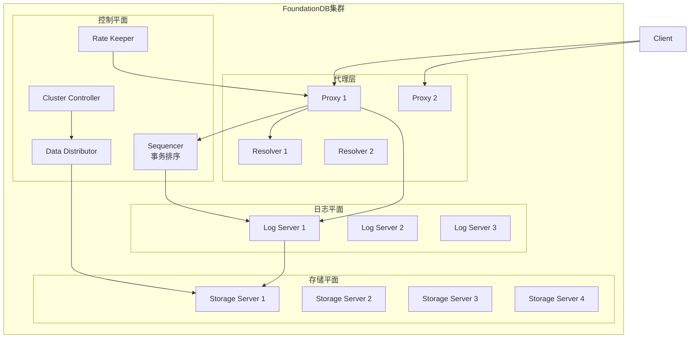
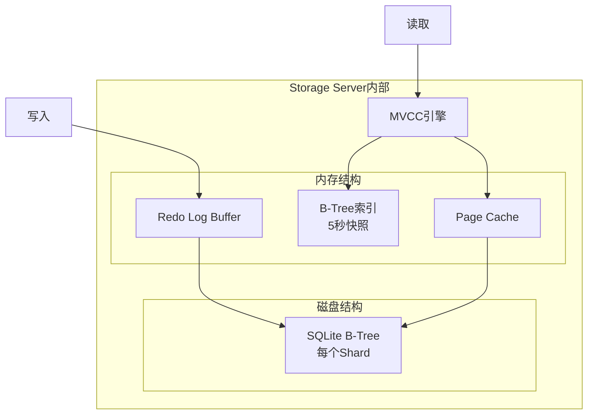
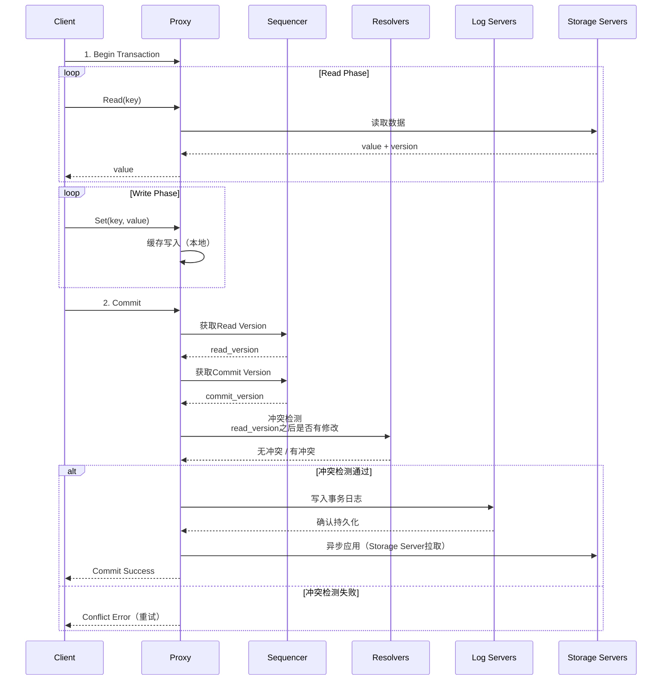
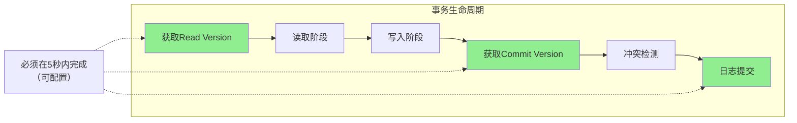
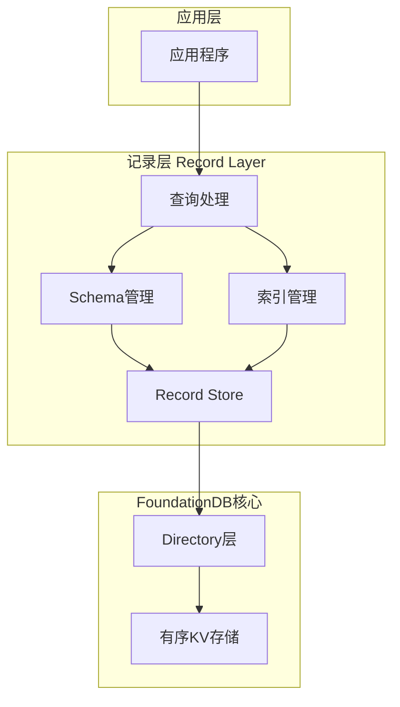
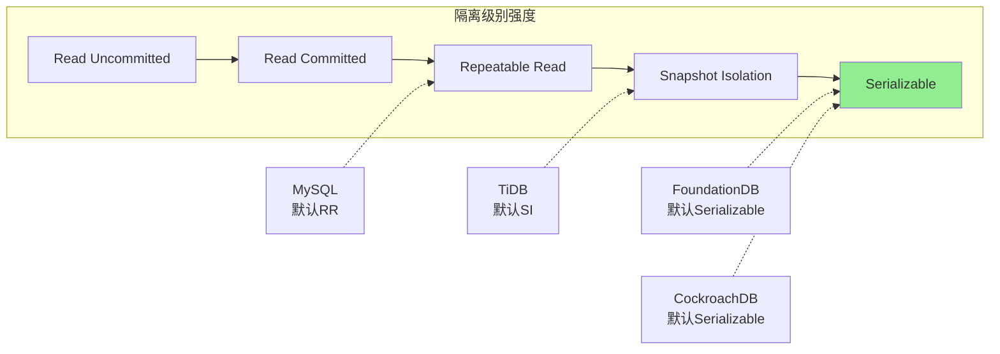
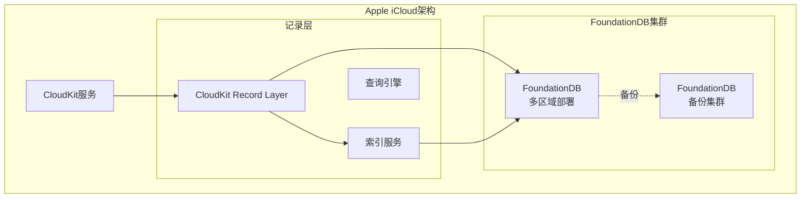

# FoundationDB 专题文档

**文档版本**：v1.0
**创建时间**：2026年
**最后更新**：2026年
**状态**：✅ 已完成

---

## 📋 执行摘要

FoundationDB是由Apple维护的开源分布式键值存储系统，以其严格的Serializable隔离级别、高性能分布式事务和出色的容错能力著称，是少数真正提供ACID保证的大规模分布式数据库。

---

## 一、核心概念

### 1.1 定义与原理

FoundationDB是一个**分布式有序键值存储**，其设计哲学强调：
- **严格ACID保证**：真正的Serializable隔离级别
- **性能优先**：在保证一致性的前提下最大化吞吐
- **简单核心**：核心仅处理有序KV，上层构建丰富功能
- **故障恢复**：快速故障检测和自动恢复

**核心设计理念**：
- 无共享架构（Shared-Nothing）
- 使用修改版OCC（乐观并发控制）+ MVCC
- 基于分布式事务日志的恢复机制
- 分层架构：核心KV + 记录层

### 1.2 关键特性

- **严格Serializable隔离**：防止所有事务异常
- **高性能分布式事务**：支持跨键事务，延迟<5ms（本地）
- **多版本并发控制**：支持时间旅行查询
- **分布式架构**：自动分片、负载均衡、故障恢复
- **记录层（Record Layer）**：提供关系型语义

### 1.3 适用场景

| 场景 | 适用性 | 说明 |
|------|--------|------|
| 金融核心系统 | ⭐⭐⭐⭐⭐ | 严格一致性要求 |
| 大规模元数据存储 | ⭐⭐⭐⭐⭐ | 高可靠、强一致 |
| 分布式事务协调 | ⭐⭐⭐⭐⭐ | 事务边界清晰 |
| 云基础设施 | ⭐⭐⭐⭐ | Apple iCloud底层 |
| 复杂查询分析 | ⭐⭐ | 需配合记录层 |
| 全文搜索 | ⭐⭐ | 需额外索引层 |

---

## 二、技术细节

### 2.1 架构设计



**核心组件详解**：

| 组件 | 功能 | 特点 |
|------|------|------|
| Sequencer | 分配事务版本号（5字节整数） | 单点但快速故障转移 |
| Proxies | 事务协调、请求路由 | 无状态，可扩展 |
| Resolvers | 冲突检测、事务验证 | 基于Key范围分片 |
| Log Servers | 分布式事务日志（WAL） | 多副本，顺序追加 |
| Storage Servers | 实际数据存储 | 每个Shard有副本 |
| Cluster Controller | 故障检测、集群管理 | 负责恢复流程 |

### 2.2 存储引擎

#### 存储架构



**存储特性**：

| 特性 | 实现 | 说明 |
|------|------|------|
| 本地存储 | SQLite B-Tree | 每个Storage Server管理多个Shard |
| 内存B-Tree | 5秒快照 | 加速读取，异步刷盘 |
| Redo Log | 顺序追加 | 保证持久性，快速恢复 |
| 数据分片 | Shard | 每个Shard约100MB |

### 2.3 严格Serializable隔离

#### 事务流程



**Serializable保证机制**：

1. **版本号分配**：Sequencer分配单调递增的版本号
2. **快照读**：事务读取基于`read_version`的一致性快照
3. **冲突检测**：Resolver检查`read_version`到`commit_version`之间读取的Key是否被修改
4. **原子提交**：日志复制确保所有写入原子性

### 2.4 分布式事务实现

#### 5秒事务限制



**事务限制设计**：

| 限制 | 值 | 原因 |
|------|-----|------|
| 事务超时 | 5秒 | 防止长事务持有锁 |
| 写集大小 | 10MB | 限制Resolver内存 |
| 读集大小 | 5MB | 限制冲突检测开销 |
| Key大小 | 10KB | 索引效率 |
| Value大小 | 100KB | 存储效率 |

**事务性能优化**：

```python
# 批处理事务示例
@fdb.transactional
def batch_insert(tr, items):
    # 批处理减少网络往返
    for key, value in items:
        tr[key] = value

# 使用事务重试装饰器
@fdb.transactional
def safe_update(tr, key, new_value):
    # 自动处理conflict错误并重试
    current = tr[key]
    tr[key] = new_value
```

### 2.5 记录层（Record Layer）

#### 分层架构



**记录层特性**：

| 特性 | 说明 |
|------|------|
| 结构化记录 | protobuf定义记录格式 |
| 二级索引 | 自动维护索引一致性 |
| 复杂查询 | 支持范围查询、索引扫描 |
| 多租户 | 支持Subspace隔离 |
| 模式演进 | 支持字段增删改 |

---

## 三、系统对比

### 3.1 FoundationDB vs 其他NewSQL

| 维度 | FoundationDB | TiKV/TiDB | CockroachDB |
|------|-------------|-----------|-------------|
| **隔离级别** | Serializable | Snapshot/SI | Serializable |
| **事务实现** | OCC + 5秒限制 | Percolator 2PC | Write Intent |
| **架构** | 分离式 | 计算存储分离 | 集成式 |
| **读性能** | 极高（内存B-Tree） | 高 | 高 |
| **写延迟** | 低（本地Log） | 中（Raft复制） | 中（Raft复制） |
| **扩展性** | 强 | 强 | 强 |
| **SQL支持** | 需记录层 | 原生 | 原生 |

### 3.2 事务隔离对比



### 3.3 苹果使用案例

#### iCloud CloudKit底层



**Apple生产规模**：

| 指标 | 规模 |
|------|------|
| 数据中心 | 多个地理区域 |
| 集群规模 | 数千台机器 |
| 数据量 | 数十PB |
| 事务吞吐 | 数百万TPS |
| 可用性 | 99.999% |

---

## 四、实践指南

### 4.1 部署配置

#### 基础集群配置

```bash
# foundationdb.conf
[fdbserver]
# 进程配置
command = /usr/lib/foundationdb/fdbserver
public_address = auto:$ID
listen_address = public
data_dir = /var/lib/foundationdb/data/$ID
log_dir = /var/lib/foundationdb/logs

# 协调者（奇数个）
[fdbserver.4500]
class = coordinator

# 存储服务器
[fdbserver.4501]
class = storage
[fdbserver.4502]
class = storage
[fdbserver.4503]
class = storage

# 日志服务器
[fdbserver.4510]
class = log
[fdbserver.4511]
class = log

# 状态监控
[backup_agent]
command = /usr/lib/foundationdb/backup_agent/backup_agent
log_dir = /var/lib/foundationdb/logs
```

#### 性能调优

```bash
# 配置存储引擎（ssd/redwood/memory）
fdb> configure ssd

# 设置区域冗余（双区域三副本）
fdb> configure double

# 调整事务超时（默认5秒）
fdb> option set_transaction_timeout 10000  # 10秒

# 配置速率限制
fdb> setknob rate_limiter_enabled 1
fdb> setknob rate_limiter_max_tokens 100000
```

### 4.2 最佳实践

#### 1. 键设计

```python
import fdb
fdb.api_version(630)

db = fdb.open()

# 使用元组层组织层级键
@fdb.transactional
def create_user(tr, user_id, user_data):
    # 良好的键设计：层级 + 前缀
    user_key = fdb.tuple.pack(('users', user_id))
    tr[user_key] = user_data
    
    # 创建二级索引
    email_key = fdb.tuple.pack(('email_index', user_data['email'], user_id))
    tr[email_key] = b''

# 范围查询示例
@fdb.transactional  
def get_users_in_range(tr, start_id, end_id):
    start_key = fdb.tuple.pack(('users', start_id))
    end_key = fdb.tuple.pack(('users', end_id))
    return tr.get_range(start_key, end_key)
```

#### 2. 事务优化

```python
# 批量读取减少网络往返
@fdb.transactional
def batch_read(tr, keys):
    futures = [tr.get(key) for key in keys]
    return [f.wait() for f in futures]

# 使用原子操作（无需事务）
def atomic_increment(db, key, value):
    db.atomic_add(key, struct.pack('<q', value))

# 乐观锁模式
@fdb.transactional
def optimistic_update(tr, key, update_fn):
    while True:
        old_value = tr.get(key)
        new_value = update_fn(old_value)
        tr.set(key, new_value)
        # 冲突时自动重试
```

#### 3. 监控指标

| 指标 | 命令 | 说明 |
|------|------|------|
| 集群健康 | `status` | 整体状态 |
| 事务统计 | `status json` | 吞吐、冲突率 |
| 存储使用 | `storage` | 每个SS的使用 |
| 性能指标 | `profile` | 延迟分布 |

### 4.3 常见问题

**Q1: 事务频繁冲突怎么办？**
A:
- 缩短事务执行时间（<100ms）
- 减少事务读取的数据量
- 使用`set_read_version`预取版本
- 考虑批处理减少事务数量
- 重新设计键空间减少热点

**Q2: 如何处理超过5秒的事务？**
A:
- 拆分大事务为多个小事务
- 使用游标模式分批处理
- 考虑使用FoundationDB的`Database.create_transaction()`手动控制
- 对于长运行任务，考虑外部状态机

**Q3: 数据备份和恢复？**
A:
```bash
# 创建备份
fdbbackup start -d file:///backup/path -t backup_tag

# 恢复
fdbrestore start -r file:///backup/path -t backup_tag --destination_cluster_file new_cluster.cluster

# 增量备份
fdbbackup modify -t backup_tag --incremental
```

**Q4: 如何扩容？**
A:
- 添加新机器，配置fdbserver进程
- 使用`fdbcli`的`exclude`命令逐步迁移数据
- FoundationDB自动重新平衡数据
- 扩容期间服务不中断

---

## 五、形式化分析

### 5.1 Serializable正确性证明

**定理**：FoundationDB实现严格Serializable隔离

**证明要点**：

1. **版本号全局有序**：Sequencer分配单调递增的`commit_version`
2. **快照一致性**：读取使用固定的`read_version`，看到一致性快照
3. **冲突检测完备**：Resolver验证所有读取的Key在`(read_version, commit_version]`期间未被修改
4. **原子可见性**：通过Log Server的多副本复制保证所有写入同时可见或不可见

**形式化保证**：
```
对于任意两个事务T1、T2：
- 如果T1在T2提交前完成，则T2的read_version ≥ T1的commit_version
- 如果存在冲突（T2读取了T1写入的Key），T2的冲突检测会失败
- 最终执行顺序等价于某个串行执行顺序
```

### 5.2 复杂度分析

| 操作 | 时间复杂度 | 说明 |
|------|-----------|------|
| 单点读取 | O(log N) | B-Tree查找，N为Shard数据量 |
| 范围扫描 | O(log N + K) | K为结果数 |
| 单点写入 | O(log N) | 本地写入 + 日志复制 |
| 事务提交 | O(W × R) | W为写集大小，R为Resolver数 |
| 冲突检测 | O(R) | R为读取Key数，Resolver并行 |

### 5.3 可用性分析

**故障恢复能力**：

| 组件故障 | 影响 | 恢复时间 |
|----------|------|----------|
| Sequencer | 短暂不可用 | <1秒（新选举） |
| Proxy | 无 | 自动切换 |
| Resolver | 部分冲突检测不可用 | 秒级 |
| Log Server | 写操作延迟增加 | 自动切换 |
| Storage Server | 读服务延迟增加 | 数秒（数据恢复） |

**Quorum机制**：
- Log Server：需要多数派确认写入
- Storage Server：多副本保证读可用性

---

## 六、与其他主题的关联

### 6.1 上游依赖

- [MVCC与多版本并发控制](../mvcc机制.md)
- [乐观并发控制](../../04-transaction/并发控制.md)
- [分布式事务](../../04-transaction/分布式事务.md)
- [分布式一致性](../../02-distributed-theory/一致性模型.md)

### 6.2 下游应用

- [分布式数据库选型](./newsql对比分析.md)
- [云原生存储](../../06-distributed-systems/cloud-native-storage.md)

### 6.3 相关概念

| 概念 | 关系 | 说明 |
|------|------|------|
| SQLite | 依赖 | Storage Server使用SQLite引擎 |
| Spanner | 对比 | 类似的Serializable保证 |
| Calvin | 对比 | 不同的事务调度方式 |
| CloudKit | 应用 | Apple iCloud的核心存储 |

---

## 七、参考资源

### 7.1 学术论文

1. [FoundationDB: A Distributed Unbundled Transactional Key Value Store](https://www.foundationdb.org/files/fdb-paper.pdf) - FoundationDB官方论文, SIGMOD 2021
2. [Lightweight Lock-Free Synchronization](https://www.foundationdb.org/files/flow.pdf) - Flow编程模型
3. [Serializable Isolation for Snapshot Databases](https://courses.cs.washington.edu/courses/cse444/08au/544M/READING-LIST/fekete-sigmod2005.pdf) - Serializable理论

### 7.2 开源项目

1. [FoundationDB](https://github.com/apple/foundationdb) - 官方源码
2. [fdb-record-layer](https://github.com/FoundationDB/fdb-record-layer) - 记录层实现
3. [fdb-kubernetes-operator](https://github.com/FoundationDB/fdb-kubernetes-operator) - K8s Operator

### 7.3 学习资料

1. [FoundationDB官方文档](https://apple.github.io/foundationdb/) - 完整技术文档
2. [FoundationDB架构概述](https://www.foundationdb.org/architecture.html) - 官方架构介绍
3. [Designing Data-Intensive Applications](https://dataintensive.net/) - 第7章相关讨论

### 7.4 相关文档

- [TiKV详解](./TiKV详解.md)
- [CockroachDB架构](./CockroachDB架构.md)
- [分布式事务](../../04-transaction/分布式事务.md)

---

**维护者**：项目团队
**最后更新**：2026年
