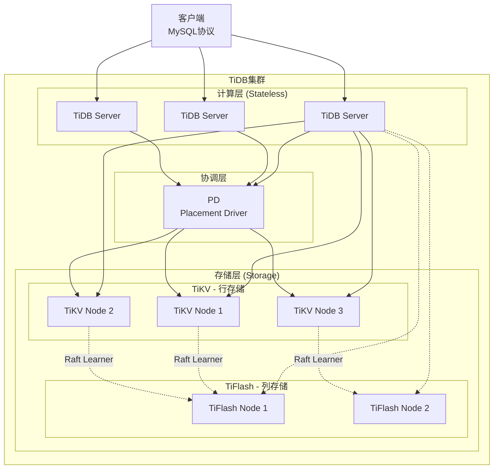
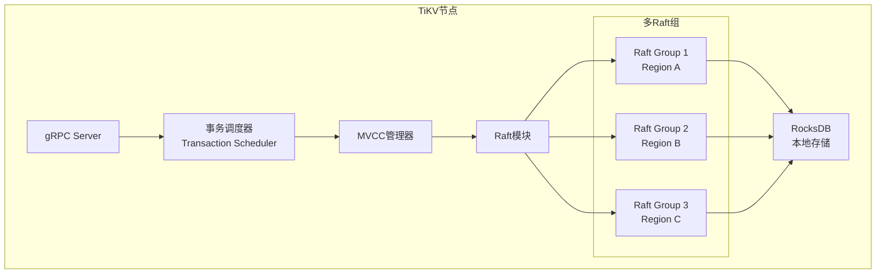
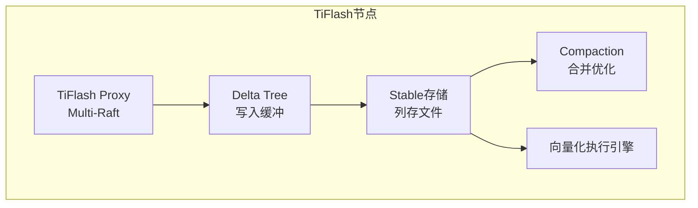
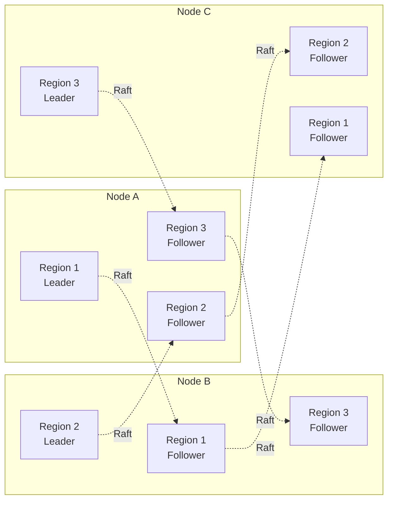
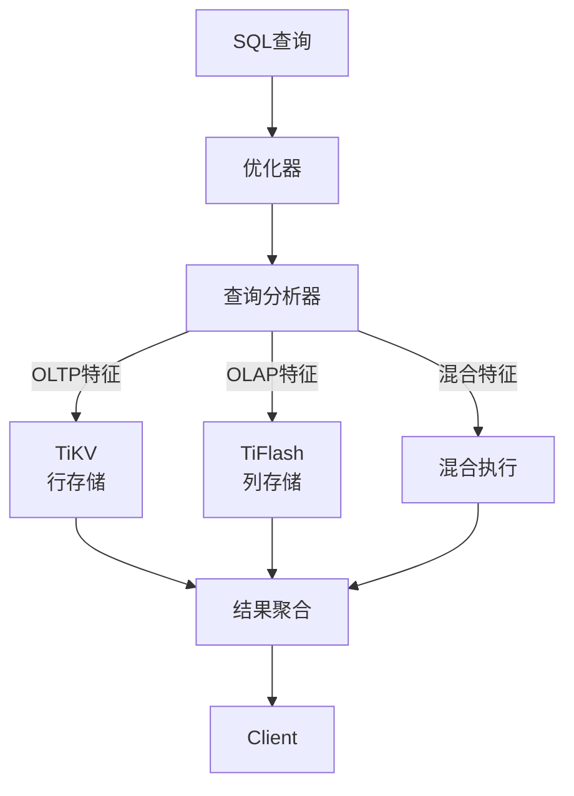
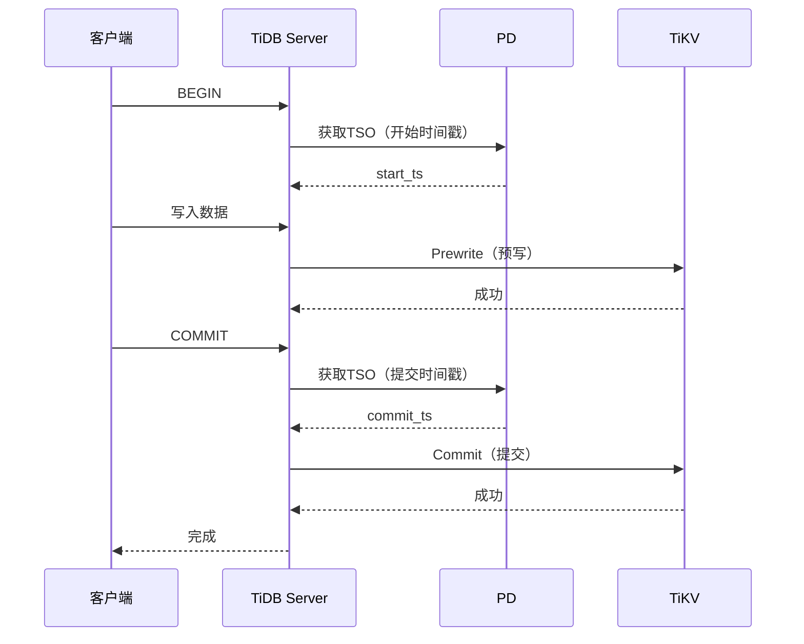
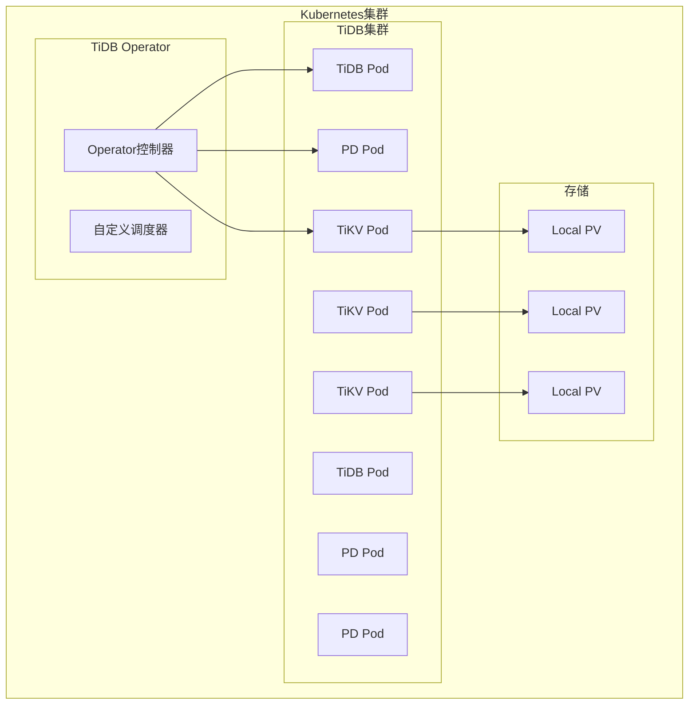

# TiDB架构深度分析 专题文档

**文档版本**：v1.0
**创建时间**：2026年
**最后更新**：2026年
**状态**：✅ 已完成

---

## 📋 执行摘要

TiDB是由PingCAP开发的开源分布式SQL数据库，采用计算与存储分离的架构设计，支持HTAP（混合事务分析处理），提供与MySQL的高度兼容性，是云原生NewSQL数据库的代表性实现。

---

## 一、核心概念

### 1.1 定义与原理

TiDB是一个开源的分布式NewSQL数据库，其设计目标包括：

- **水平弹性扩展**：计算和存储可独立扩展
- **金融级高可用**：多副本Raft协议保证数据安全
- **实时HTAP**：同时支持高吞吐OLTP和实时OLAP
- **云原生架构**：支持Kubernetes部署和弹性调度
- **MySQL兼容**：协议和语法高度兼容，降低迁移成本

**核心架构理念**：

- 计算层（TiDB Server）无状态，可水平扩展
- 存储层（TiKV/TiFlash）分离，各司其职
- 使用Raft协议保证强一致性
- 智能优化器实现高效查询执行

### 1.2 关键特性

- **TiKV/TiFlash分离架构**：行存储用于OLTP，列存储用于OLAP
- **Raft共识协议**：多副本强一致性保证
- **智能优化器**：基于代价的查询优化和分布式执行计划
- **实时数据同步**：TiKV到TiFlash的实时数据复制
- **云原生设计**：支持Kubernetes Operator管理
- **MySQL 5.7/8.0兼容**：支持大部分MySQL语法和生态工具

### 1.3 适用场景

| 场景 | 适用性 | 说明 |
|------|--------|------|
| 海量数据OLTP | ⭐⭐⭐⭐⭐ | 水平扩展，支持PB级数据 |
| 实时HTAP | ⭐⭐⭐⭐⭐ | 一份数据，事务分析双引擎 |
| MySQL替代升级 | ⭐⭐⭐⭐⭐ | 高度兼容，平滑迁移 |
| 金融行业核心系统 | ⭐⭐⭐⭐⭐ | 强一致性，高可用 |
| 实时数据仓库 | ⭐⭐⭐⭐ | TiFlash列存分析 |
| 物联网数据存储 | ⭐⭐⭐⭐ | 高写入吞吐，时间序列支持 |

---

## 二、技术细节

### 2.1 架构设计



**核心组件详解**：

| 组件 | 角色 | 功能 | 特点 |
|------|------|------|------|
| TiDB Server | 计算节点 | SQL解析、优化、执行 | 无状态，可水平扩展 |
| PD | 调度中心 | 元数据管理、负载均衡、全局时间戳 | 集群大脑，通常3节点部署 |
| TiKV | 行存储 | 分布式事务KV存储 | 基于RocksDB，Raft复制 |
| TiFlash | 列存储 | 分析型查询加速 | 实时同步，向量化执行 |

### 2.2 TiKV/TiFlash分离架构

#### 数据组织

```mermaid
graph LR
    subgraph "逻辑视图 - 表"
        Table[Table: users]
    end

    subgraph "TiKV - 行存储"
        R1[Key: t_r1<br/>Value: {id:1,name:Alice,age:30}]
        R2[Key: t_r2<br/>Value: {id:2,name:Bob,age:25}]
        R3[Key: t_r3<br/>Value: {id:3,name:Carol,age:35}]
    end

    subgraph "TiFlash - 列存储"
        C1[id列: [1,2,3]]
        C2[name列: [Alice,Bob,Carol]]
        C3[age列: [30,25,35]]
    end

    Table --> R1
    Table --> R2
    Table --> R3
    Table -.->|实时同步| C1
    Table -.->|实时同步| C2
    Table -.->|实时同步| C3
```

**Region（分区）机制**：

- 数据按Key Range划分为Region（默认96MB）
- 每个Region是独立的Raft组
- Region可自动分裂和合并
- PD负责Region调度和负载均衡

#### TiKV详细架构



**TiKV存储结构**：

- **RaftDB**：存储Raft日志
- **KvDB**：存储实际数据（MVCC版本）
- **CF（Column Family）**：
  - `default`：存储大值
  - `write`：存储MVCC版本信息
  - `lock`：存储锁信息

#### TiFlash架构



**TiFlash特点**：

- 作为Raft Learner接收变更
- 实时数据同步，毫秒级延迟
- 列式存储，高压缩比
- 向量化执行，批量数据处理

### 2.3 Raft协议实现

#### Multi-Raft架构



**Raft优化**：

| 优化项 | 机制 | 效果 |
|--------|------|------|
| Batch | 批量提交Raft日志 | 提高吞吐 |
| Pipeline | 流水线处理请求 | 降低延迟 |
| Append Log | 异步追加日志 | 减少阻塞 |
| Leader Lease | Leader租约优化 | 减少心跳开销 |

**一致性保证**：

- **强一致性（Strong Consistency）**：从Leader读取
- **线性一致性（Linearizability）**：默认保证
- **Follower Read**：可从Follower读取历史版本

### 2.4 HTAP（混合事务分析）

#### HTAP查询路由



**智能路由策略**：

| 场景 | 目标存储 | 判断依据 |
|------|----------|----------|
| 点查/小范围扫描 | TiKV | 小数据量，索引命中 |
| 全表扫描/聚合 | TiFlash | 大数据量，列访问 |
| 混合查询 | 智能选择 | 代价模型评估 |

**TiFlash加速能力**：

- **列裁剪**：只读取需要的列
- **谓词下推**：过滤条件下推到存储层
- **向量化执行**：SIMD指令加速
- **MPP（大规模并行处理）**：分布式执行复杂查询

```sql
-- 智能选择示例
-- 默认自动选择
SELECT * FROM orders WHERE id = 1; -- -> TiKV

SELECT SUM(amount) FROM orders; -- -> TiFlash

-- 强制指定存储引擎
SELECT /*+ read_from_storage(tikv[orders]) */ * FROM orders;
SELECT /*+ read_from_storage(tiflash[orders]) */ * FROM orders;
```

### 2.5 分布式事务实现

#### 两阶段提交（2PC）优化



**Percolator模型**：

- 使用TSO（Timestamp Oracle）分配全局单调递增时间戳
- Prewrite阶段锁定数据并写入临时记录
- Commit阶段更新提交状态
- 异步清理锁

**事务优化**：

| 优化项 | 机制 | 收益 |
|--------|------|------|
| 1PC | 单Region事务优化为一阶段提交 | 延迟降低50% |
| Async Commit | 异步提交优化 | 降低提交延迟 |
| Pipeline | 流水线预写 | 提高吞吐 |
| 内存锁 | 热点优化 | 减少锁冲突 |

### 2.6 云原生设计

#### Kubernetes部署架构



**云原生特性**：

- **Operator模式**：自动化部署、扩容、升级、故障恢复
- **存储分离**：支持Local PV、云盘等多种存储
- **弹性伸缩**：计算和存储独立扩缩容
- **多租户支持**：命名空间隔离

---

## 三、系统对比

### 3.1 TiDB vs 传统MySQL

| 维度 | TiDB | MySQL |
|------|------|-------|
| 架构 | 分布式 | 单机/主从 |
| 扩展性 | 水平扩展 | 垂直扩展 |
| 数据容量 | PB级 | TB级 |
| 高可用 | 自动故障转移 | 需额外配置 |
| 一致性 | 强一致性 | 最终一致性（主从） |
| 复杂查询 | TiFlash加速 | 单线程执行 |
| 运维复杂度 | 较高 | 较低 |

### 3.2 TiDB vs CockroachDB

| 维度 | TiDB | CockroachDB |
|------|------|-------------|
| 架构 | 计算存储分离 | 集成架构 |
| 存储引擎 | TiKV+RocksDB | RocksDB |
| 分析能力 | TiFlash列存 | 较弱 |
| 协议兼容 | MySQL | PostgreSQL |
| 默认隔离级别 | Snapshot | Serializable |
| 地理复制 | 支持 | 原生支持更强 |
| 时间同步 | TSO中心式 | HLC分布式 |

### 3.3 HTAP方案对比

| 方案 | 数据新鲜度 | 架构复杂度 | 维护成本 |
|------|-----------|-----------|----------|
| TiDB HTAP | 实时 | 低 | 低 |
| MySQL + ClickHouse | 分钟级 | 高 | 高 |
| Oracle HeatWave | 实时 | 中 | 中 |
| SQL Server Columnstore | 准实时 | 中 | 中 |

### 3.4 性能基准

| 指标 | TiDB | 说明 |
|------|------|------|
| 单节点写入 | ~15K TPS | sysbench oltp_write_only |
| 线性扩展比 | ~0.85 | 添加N节点获得0.85N性能 |
| TSO分配 | 100万+ /秒 | 全局时间戳 |
| TiFlash扫描 | GB/秒 | 列存分析性能 |
| 跨Region事务 | 50-100ms | P99延迟 |

---

## 四、实践指南

### 4.1 部署配置

#### 最小生产配置

```yaml
# TiDB集群最小配置（3 TiKV + 3 PD + 2 TiDB）
global:
  user: "tidb"
  ssh_port: 22
  deploy_dir: "/tidb-deploy"
  data_dir: "/tidb-data"

server_configs:
  tidb:
    log.slow-threshold: 300
  tikv:
    readpool.storage.use-unified-pool: true
    raftstore.apply-pool-size: 2
    raftstore.store-pool-size: 2
  pd:
    schedule.leader-schedule-limit: 4
    schedule.region-schedule-limit: 2048

pd_servers:
  - host: 10.0.1.1
  - host: 10.0.1.2
  - host: 10.0.1.3

tidb_servers:
  - host: 10.0.1.4
  - host: 10.0.1.5

tikv_servers:
  - host: 10.0.1.6
  - host: 10.0.1.7
  - host: 10.0.1.8
```

#### TiFlash部署

```yaml
# 添加TiFlash节点
tiflash_servers:
  - host: 10.0.1.9
    data_dir: /data/tiflash
  - host: 10.0.1.10
    data_dir: /data/tiflash

# SQL启用TiFlash
ALTER TABLE orders SET TIFLASH REPLICA 2;
```

### 4.2 最佳实践

#### 1. Schema设计

```sql
-- 选择合适的主键类型
-- 推荐：自增整数或随机ID
CREATE TABLE users (
    id BIGINT PRIMARY KEY AUTO_RANDOM, -- 避免热点
    username VARCHAR(50) NOT NULL,
    created_at TIMESTAMP DEFAULT CURRENT_TIMESTAMP
);

-- 避免热点：不要单调递增主键
-- 不推荐：id BIGINT AUTO_INCREMENT （造成写热点）

-- 使用分区表处理时间序列数据
CREATE TABLE logs (
    id BIGINT,
    log_time TIMESTAMP,
    message TEXT,
    PRIMARY KEY (id, log_time)
) PARTITION BY RANGE (YEAR(log_time)) (
    PARTITION p2023 VALUES LESS THAN (2024),
    PARTITION p2024 VALUES LESS THAN (2025)
);
```

#### 2. 索引优化

```sql
-- 使用覆盖索引
CREATE INDEX idx_user_name ON users(username)
COVERING (email, phone);

-- 复合索引设计
CREATE INDEX idx_order_time_status ON orders
(created_at, status, user_id);

-- 使用EXPLAIN分析
EXPLAIN ANALYZE SELECT * FROM users WHERE username = 'test';
```

#### 3. 事务优化

```sql
-- 控制事务大小
-- 推荐：单事务不超过5000行修改
BEGIN;
-- 批量操作
INSERT INTO logs VALUES (...), (...), ...; -- 一批500-1000条
COMMIT;

-- 使用悲观事务避免冲突（默认乐观）
SET SESSION tidb_txn_mode = 'pessimistic';
BEGIN PESSIMISTIC;
SELECT * FROM inventory WHERE id = 1 FOR UPDATE;
UPDATE inventory SET count = count - 1 WHERE id = 1;
COMMIT;
```

#### 4. HTAP使用最佳实践

```sql
-- 小数据量点查 → TiKV
SELECT * FROM orders WHERE id = 100;

-- 大数据量分析 → TiFlash
SELECT region, SUM(amount), AVG(amount)
FROM orders
GROUP BY region;

-- 混合查询优化器自动选择
EXPLAIN SELECT o.*, c.name
FROM orders o
JOIN customers c ON o.customer_id = c.id
WHERE o.amount > 1000;

-- 查看TiFlash同步状态
SELECT * FROM information_schema.tiflash_replica
WHERE TABLE_SCHEMA = 'test';
```

### 4.3 常见问题

**Q1: 如何解决写热点问题？**
A:

- 使用`AUTO_RANDOM`替代`AUTO_INCREMENT`
- 对单调索引使用`SHARD_ROW_ID_BITS`
- 使用分区表分散写入
- 预分割Region：`SPLIT TABLE table_name BETWEEN ...`

**Q2: 事务频繁冲突怎么办？**
A:

- 切换到悲观事务模式
- 减少事务执行时间
- 按主键顺序访问数据
- 使用小事务替代大事务

**Q3: OOM（内存溢出）如何处理？**
A:

- 限制单条SQL内存使用：`tidb_mem_quota_query`
- 启用磁盘溢出：`tidb_enable_tmp_storage_on_oom`
- 优化大查询，添加合适索引
- 调整`tidb_server_memory_limit`

**Q4: TiFlash同步延迟高？**
A:

- 检查TiFlash节点负载
- 增加TiFlash副本数
- 监控`tiflash_sync_status`
- 优化大批量写入

**Q5: 从MySQL迁移需要注意什么？**
A:

- 使用DM（Data Migration）工具
- 检查不兼容的SQL语法
- 评估事务模型差异（乐观vs悲观）
- 测试性能，调整连接池配置

---

## 五、形式化分析

### 5.1 一致性模型

**定理**：TiDB提供Snapshot Isolation（SI）隔离级别，可配置为Serializable

**证明要点**：

1. TSO保证全局单调递增时间戳
2. MVCC实现多版本并发控制
3. 两阶段提交保证原子性
4. 锁机制防止写冲突

### 5.2 可用性分析

**理论可用性**：

- PD：需要多数派存活（3节点容忍1故障）
- TiKV：每个Region需要多数派（3副本容忍1故障）
- TiDB：完全无状态，任意实例可服务

**故障恢复时间**：

- TiKV节点故障：秒级Leader重新选举
- PD节点故障：自动选举新Leader
- TiDB节点故障：客户端重连其他节点

### 5.3 复杂度分析

| 操作 | 时间复杂度 | 说明 |
|------|-----------|------|
| 点查 | O(1) | 直接KV查找 |
| 范围扫描 | O(log N + K) | N为数据量，K为结果 |
| 事务提交 | O(M) | M为涉及Region数 |
| TSO分配 | O(1) | 批量分配优化 |
| TiFlash扫描 | O(N/col) | 列裁剪后扫描 |

---

## 六、与其他主题的关联

### 6.1 上游依赖

- [Raft共识算法](../../03-consensus/raft算法.md)
- [MVCC与多版本并发控制](../mvcc机制.md)
- [LSM-Tree存储引擎](../lsm-tree架构.md)
- [列式存储](../column-store架构.md)

### 6.2 下游应用

- [分布式事务](../../04-transaction/分布式事务.md)
- [HTAP架构设计](../../06-distributed-systems/htap设计.md)
- [云原生数据库](../../06-distributed-systems/cloud-native-db.md)

### 6.3 相关概念

| 概念 | 关系 | 说明 |
|------|------|------|
| MySQL | 协议兼容 | 高度兼容MySQL协议 |
| Spanner | 架构参考 | 参考了部分分布式设计 |
| Flink | 生态集成 | 实时计算集成 |
| Kubernetes | 部署平台 | 云原生部署基础 |

---

## 七、参考资源

### 7.1 学术论文

1. [TiDB: A Raft-based HTAP Database](https://dl.acm.org/doi/10.14778/3415478.3415535) - Huang et al., VLDB 2020
2. [Apache Spark and TiDB for Real-time Analytics](https://pingcap.com/blog/) - PingCAP技术博客
3. [Raft Consensus Algorithm](https://raft.github.io/raft.pdf) - Ongaro & Ousterhout, 2014

### 7.2 开源项目

1. [TiDB](https://github.com/pingcap/tidb) - TiDB主仓库
2. [TiKV](https://github.com/tikv/tikv) - 分布式KV存储
3. [TiFlash](https://github.com/pingcap/tiflash) - 列存储引擎
4. [TiDB Operator](https://github.com/pingcap/tidb-operator) - K8s Operator

### 7.3 学习资料

1. [TiDB官方文档](https://docs.pingcap.com/tidb/stable) - 完整技术文档
2. [TiDB技术内幕](https://book.tidb.io/) - 开源技术书籍
3. [PingCAP博客](https://pingcap.com/blog/) - 技术文章

### 7.4 相关文档

- [CockroachDB架构](./CockroachDB架构.md)
- [NewSQL数据库对比](./newsql对比分析.md)
- [MySQL兼容层设计](../mysql兼容层.md)

## 八、相关主题

### 共识算法

- [Raft算法](../../02-THEORY/distributed-systems/Raft算法专题文档.md) - TiKV底层共识算法
- [Paxos算法](../../02-THEORY/distributed-systems/Paxos算法专题文档.md) - 经典共识算法对比
- [Consensus协议对比](../../03-communication/protocol/Consensus协议对比.md) - 共识协议综合对比

### NewSQL数据库

- [CockroachDB架构](./CockroachDB架构.md) - 另一款NewSQL实现
- [Spanner深度分析](./Spanner深度分析.md) - Google全球分布式数据库
- [分布式事务](../../08-transactions/2PC与3PC.md) - 分布式事务协议

### 存储与一致性

- [一致性模型](../../02-THEORY/distributed-systems/一致性模型专题文档.md) - TiDB的强一致性保证
- [MVCC多版本并发控制](../../08-transactions/MVCC多版本并发控制.md) - TiDB并发控制机制
- [TiKV详解](./TiKV详解.md) - TiKV存储引擎详解

### 消息与计算

- [Kafka架构深度分析](../../03-communication/message-queue/Kafka架构深度分析.md) - 分布式消息系统
- [Flink流处理框架](../../06-computing/stream/流处理框架对比.md) - 与TiDB的实时计算集成
- [Kubernetes架构深度分析](../../07-architecture/cloud-computing/Kubernetes架构深度分析.md) - TiDB云原生部署平台

### 架构设计

- [微服务架构](../../07-architecture/microservices/微服务架构.md) - 微服务数据存储
- [分布式系统架构设计指南](../../13-practice/分布式系统架构设计指南.md) - 系统架构设计

### 知识体系

- [全局知识概念关系图](../../07-KNOWLEDGE/全局知识概念关系图.md) - 完整知识网络

---

**维护者**：项目团队
**最后更新**：2026-04-03
**更新说明**：添加相关主题交叉引用
