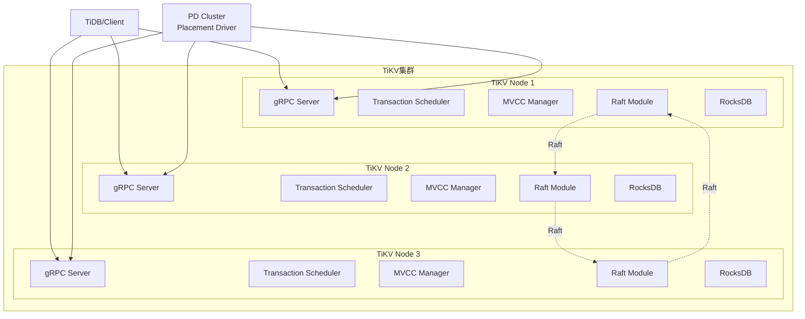
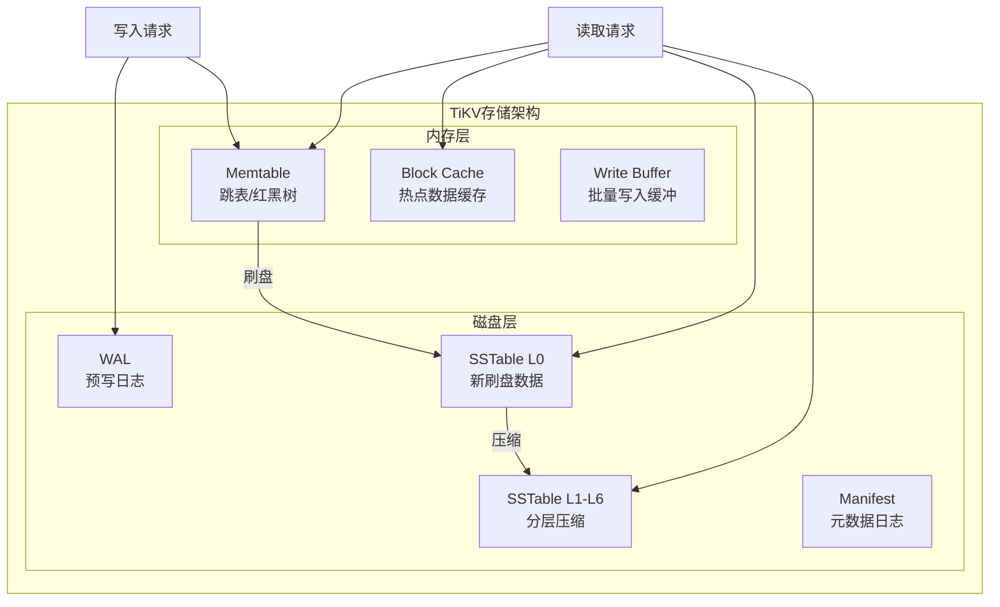
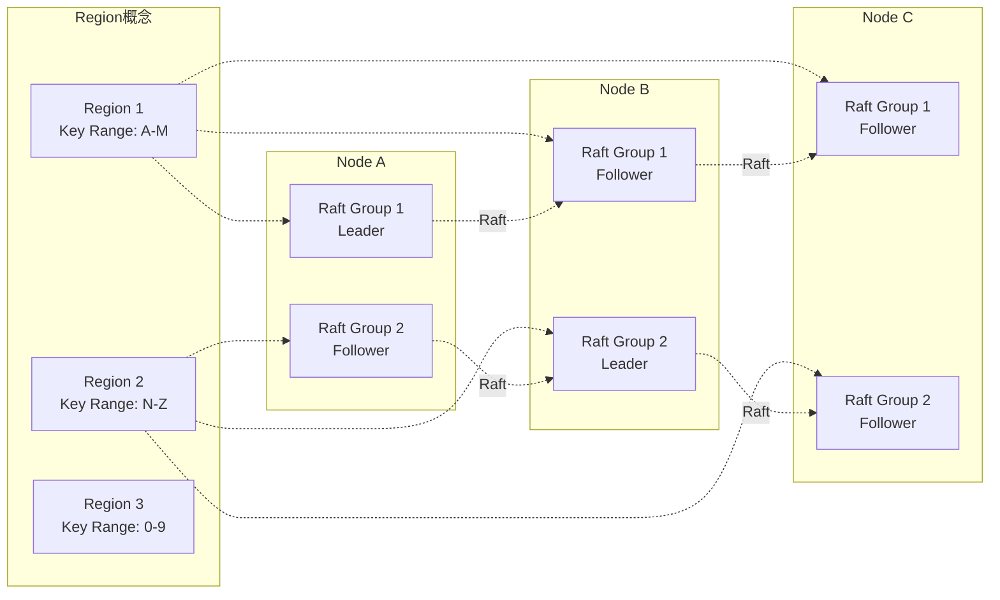
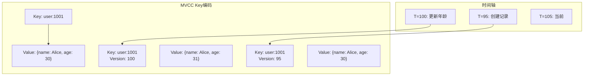
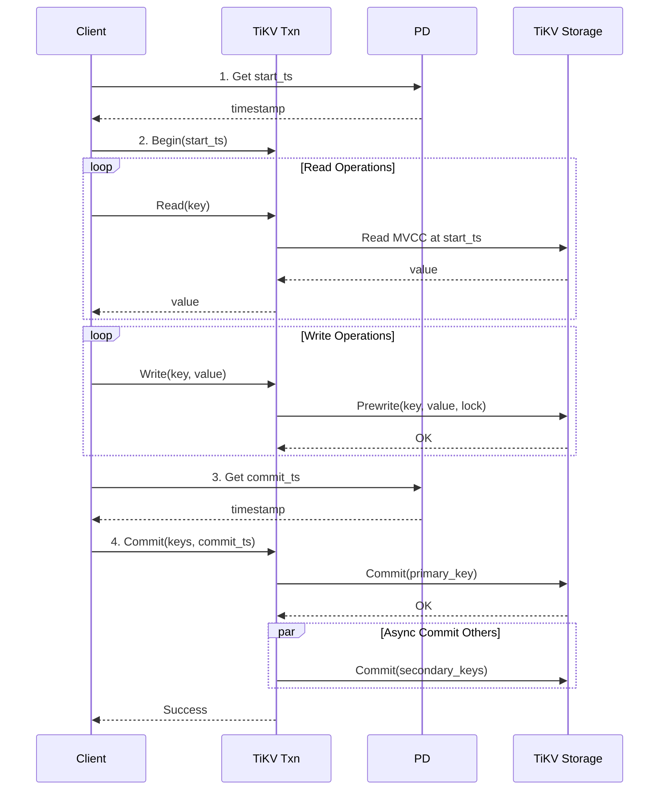
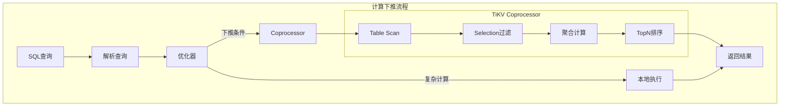
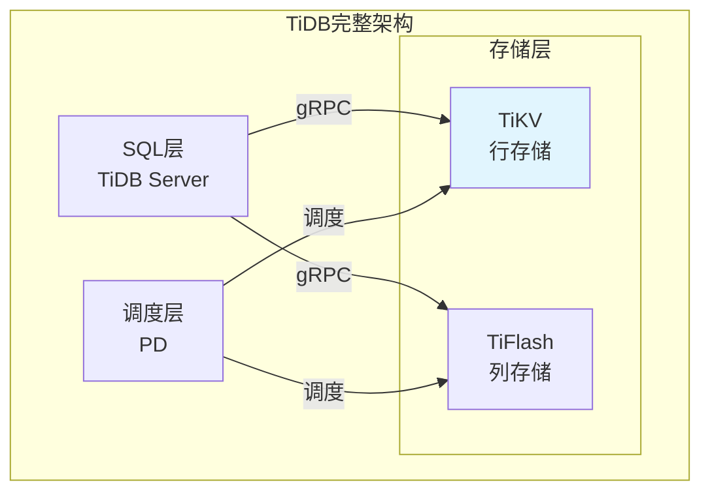

# TiKV详解 专题文档

**文档版本**：v1.0
**创建时间**：2026年
**最后更新**：2026年
**状态**：✅ 已完成

---

## 📋 执行摘要

TiKV是由PingCAP开发的开源分布式事务型键值存储系统，采用Rust语言编写，基于RocksDB存储引擎和Multi-Raft共识协议，为TiDB提供分布式存储能力，也可作为独立的KV存储使用。

---

## 一、核心概念

### 1.1 定义与原理

TiKV是一个**分布式事务键值存储系统**，其设计目标包括：
- **水平扩展**：通过添加节点线性扩展存储和吞吐
- **强一致性**：基于Raft协议实现多副本强一致
- **分布式事务**：支持ACID事务的跨键操作
- **高可用性**：自动故障检测和Leader切换

**核心架构理念**：
- 数据按Range分区，每个Range构成独立Raft组
- 基于RocksDB的本地存储
- MVCC实现多版本并发控制
- 与PD协同实现全局调度和负载均衡

### 1.2 关键特性

- **Multi-Raft架构**：数据分区后每个区独立Raft复制
- **MVCC支持**：多版本数据支持时间旅行查询
- **分布式事务**：Percolator模型实现跨区事务
- **Coprocessor**：计算下推减少网络传输
- **与TiDB无缝集成**：作为TiDB的存储层

### 1.3 适用场景

| 场景 | 适用性 | 说明 |
|------|--------|------|
| 分布式SQL数据库底层 | ⭐⭐⭐⭐⭐ | TiDB默认存储引擎 |
| 大规模KV存储 | ⭐⭐⭐⭐⭐ | 水平扩展，高可用 |
| 元数据存储 | ⭐⭐⭐⭐ | 强一致，适合配置/元数据 |
| 时序数据存储 | ⭐⭐⭐ | 配合TiFlash更优 |
| 纯缓存场景 | ⭐⭐ | 不如Redis轻量 |

---

## 二、技术细节

### 2.1 架构设计



**核心组件详解**：

| 组件 | 功能 | 说明 |
|------|------|------|
| gRPC Server | 协议层 | 处理客户端请求，支持Unary和Stream |
| Transaction Scheduler | 事务调度 | 协调本地事务，处理冲突 |
| MVCC Manager | 版本管理 | 管理多版本数据，垃圾回收 |
| Raft Module | 共识引擎 | Multi-Raft实现数据复制 |
| RocksDB | 本地存储 | 基于LSM-Tree的KV引擎 |
| Coprocessor | 计算引擎 | 支持下推计算（聚合、扫描） |

### 2.2 RocksDB存储层

#### 存储结构



**Column Families设计**：

| CF名称 | 用途 | 数据类型 |
|--------|------|----------|
| `default` | 存储大值 | 用户数据（>255字节） |
| `write` | 存储版本信息 | MVCC版本、提交标记 |
| `lock` | 存储锁信息 | 事务锁、冲突检测 |
| `raft` | 存储Raft日志 | Raft日志条目 |

**RocksDB调优参数**：

```toml
[rocksdb]
# 写缓冲大小
write-buffer-size = "128MB"
max-write-buffer-number = 5

# 压缩设置
compression-per-level = ["no", "no", "lz4", "lz4", "lz4", "zstd", "zstd"]

# 块缓存
block-cache-size = "4GB"

# 后台线程
max-background-jobs = 8
```

### 2.3 Raft实现细节

#### Multi-Raft架构



**Raft关键实现**：

| 特性 | 实现 | 说明 |
|------|------|------|
| Leader Election | 超时+随机退避 | 避免活锁 |
| Log Replication | 批量+Pipeline | 提高吞吐 |
| Snapshot | 分段传输 | 大Region恢复 |
| PreVote | 预投票 | 减少分区干扰 |
| CheckQuorum |  Leader自检查 | 防止网络分区脑裂 |

**Raft优化技术**：

```rust
// 批量提交优化
pub struct RaftBatchSystem {
    // 批量处理Raft消息
    batch_size: usize,
    // 合并心跳
    heartbeat_interval: Duration,
    // 流水线提案
    max_inflight_msgs: usize,
}

// Leader Transfer优化
impl Raft {
    fn transfer_leader(&mut self, peer: Peer) {
        // 1. 暂停新提案
        // 2. 同步所有日志
        // 3. 发送TimeoutNow触发选举
    }
}
```

### 2.4 MVCC与事务

#### MVCC实现机制



**MVCC Key编码格式**：

```
Key + Timestamp (8 bytes, 降序排列)

示例：
- user:1001 + 0xFFFFFFFFFFFFFFFF -> 最新版本
- user:1001 + 0x0000000000000064 -> T=100的版本
- user:1001 + 0x000000000000005F -> T=95的版本
```

#### Percolator事务模型



**事务优化技术**：

| 优化 | 机制 | 效果 |
|------|------|------|
| 1PC | 单Region事务免两阶段 | 延迟降低50% |
| Async Commit | 异步提交 | 降低提交延迟 |
| Parallel Prewrite | 并行预写 | 提高吞吐 |
| Memory Lock | 热点锁内存化 | 减少锁冲突 |

### 2.5 Coprocessor计算下推



**支持的计算下推**：

| 操作 | 说明 | 收益 |
|------|------|------|
| Table Scan | 表扫描 | 减少数据传输 |
| Index Scan | 索引扫描 | 快速定位 |
| Selection | 过滤条件 | 提前过滤 |
| Aggregation | COUNT/SUM/AVG | 分布式聚合 |
| TopN | 排序取Top | 减少传输量 |
| Limit | 限制结果数 | 提前截断 |

---

## 三、系统对比

### 3.1 TiKV vs etcd

| 维度 | TiKV | etcd |
|------|------|------|
| **定位** | 分布式事务KV存储 | 配置/元数据存储 |
| **数据模型** | 有序KV，支持范围查询 | 有序KV，扁平命名空间 |
| **事务** | 跨键分布式事务 | 多键事务（有限） |
| **一致性** | Raft强一致 | Raft强一致 |
| **规模** | 支持100+TB数据 | 通常<8GB |
| **性能** | 高吞吐，中等延迟 | 低延迟，中等吞吐 |
| **适用场景** | 海量数据、事务处理 | 服务发现、配置中心 |

**选择建议**：
- 需要大规模数据存储 → TiKV
- 需要复杂事务支持 → TiKV
- 配置/元数据存储 → etcd
- Kubernetes生态集成 → etcd

### 3.2 TiKV vs TiDB关系



**TiKV在TiDB中的角色**：

| 组件 | 职责 | 与TiKV关系 |
|------|------|-----------|
| TiDB Server | SQL解析、优化、执行 | TiKV客户端 |
| PD | 元数据、调度、TSO | TiKV协调者 |
| TiKV | 数据存储、事务、复制 | 核心存储层 |
| TiFlash | 列存储分析 | TiKV的Learner |

### 3.3 与CockroachDB存储层对比

| 维度 | TiKV | CockroachDB存储层 |
|------|------|------------------|
| **存储引擎** | RocksDB | Pebble（RocksDB分支） |
| **复制协议** | Multi-Raft | Multi-Raft |
| **事务模型** | Percolator (2PC) | Write Intent + HLC |
| **默认隔离级别** | Snapshot Isolation | Serializable |
| **时间服务** | TSO（PD提供） | HLC（本地生成） |
| **架构** | 独立存储层 | 集成架构 |

---

## 四、实践指南

### 4.1 部署配置

#### TiKV单节点配置

```toml
# tikv.toml 基础配置
[server]
addr = "127.0.0.1:20160"
advertise-addr = "127.0.0.1:20160"

[storage]
# 数据目录
data-dir = "/data/tikv"

[rocksdb]
# 写缓冲
write-buffer-size = "128MB"
max-write-buffer-number = 5

# 压缩
compression-per-level = ["no", "no", "lz4", "lz4", "lz4", "zstd", "zstd"]

[raftdb]
# Raft日志存储优化
write-buffer-size = "64MB"

[raftstore]
# Raft心跳间隔
raft-base-tick-interval = "1s"
raft-heartbeat-ticks = 2
raft-election-timeout-ticks = 10

# 并发限制
apply-pool-size = 2
store-pool-size = 2

[readpool]
# 读线程池
[readpool.storage]
high-concurrency = 4
normal-concurrency = 4
low-concurrency = 4
```

#### 性能调优参数

```toml
# 高性能配置
[rocksdb]
# 增大写缓冲提升写入性能
write-buffer-size = "256MB"
max-write-buffer-number = 6

# 启用并行压缩
max-background-jobs = 10
max-sub-compactions = 3

# 增大块缓存
[rocksdb.block-cache]
capacity = "8GB"

[readpool.coprocessor]
# 增大Coprocessor线程池
high-concurrency = 8
normal-concurrency = 8
low-concurrency = 8
```

### 4.2 最佳实践

#### 1. Region管理

```bash
# 查看Region分布
tiup ctl pd -u http://pd-host:2379 region

# 手动分裂Region（热点场景）
tiup ctl pd -u http://pd-host:2379 operator add split-region <region-id>

# 调整Region大小
# 在PD配置中
[scheduler]
max-merge-region-size = 20
max-merge-region-keys = 200000
```

#### 2. 事务优化

```rust
// 客户端事务最佳实践
let txn = client.begin_optimistic().await?;

// 1. 控制事务大小（建议<5000行）
const MAX_BATCH_SIZE: usize = 500;

// 2. 使用小批量写入
for chunk in data.chunks(MAX_BATCH_SIZE) {
    for row in chunk {
        txn.put(row.key, row.value).await?;
    }
}

// 3. 及时提交
let commit_ts = txn.commit().await?;
```

#### 3. 监控关键指标

| 指标 | 说明 | 告警阈值 |
|------|------|----------|
| `tikv_raftstore_append_log_duration` | Raft追加日志延迟 | P99 > 100ms |
| `tikv_raftstore_apply_log_duration` | 应用日志延迟 | P99 > 500ms |
| `tikv_storage_async_write_duration` | 异步写入延迟 | P99 > 100ms |
| `tikv_thread_cpu_seconds_total` | 线程CPU使用率 | > 80% |
| `tikv_raftstore_region_count` | Region数量 | 按容量规划 |

### 4.3 常见问题

**Q1: 如何处理写热点？**
A:
- 使用`AUTO_RANDOM`主键或加盐前缀
- 预分裂Region：`SPLIT TABLE ... BETWEEN ...`
- 启用`shuffle-leader-scheduler`打散Leader
- 调整`region-split-size`提前分裂

**Q2: TiKV内存使用过高？**
A:
- 调整`block-cache-size`（通常占总内存30-45%）
- 限制`write-buffer-size`和`max-write-buffer-number`
- 检查Coprocessor大查询，启用磁盘溢出
- 调整`storage.block-cache.capacity`

**Q3: Region分布不均？**
A:
- 检查是否有热点Key
- 启用`balance-region-scheduler`和`balance-leader-scheduler`
- 手动执行`operator add transfer-leader`
- 检查磁盘空间是否不均衡

**Q4: 如何独立使用TiKV（不依赖TiDB）？**
A:
- 使用TiKV的RawKV API（无事务，简单KV）
- 使用TxnKV API（完整事务支持）
- 使用Rust/Go/Java客户端直接访问
- 参考[client-go](https://github.com/tikv/client-go)示例

---

## 五、形式化分析

### 5.1 一致性模型

**定理**：TiKV提供Snapshot Isolation（SI）隔离级别

**证明要点**：
1. **TSO保证全局单调性**：PD分配的start_ts和commit_ts全局单调递增
2. **MVCC实现快照读**：每个读取使用start_ts获取一致性快照
3. **两阶段提交保证原子性**：Prewrite + Commit确保事务要么全成功要么全失败
4. **锁机制防止写冲突**：Prewrite阶段写入锁，检测并发修改

### 5.2 复杂度分析

| 操作 | 时间复杂度 | 说明 |
|------|-----------|------|
| 点查 | O(1) | RocksDB直接查找 |
| 范围扫描 | O(log N + K) | N为Region内数据量，K为结果 |
| 单Region写入 | O(log N) | Raft复制到多数派 |
| 跨Region事务 | O(R × log N) | R为涉及Region数 |
| 事务提交 | O(R) | 与Region数线性相关 |

### 5.3 可用性分析

**基于Raft的可用性**：
- 写操作需要⌈N/2⌉+1个副本确认（N为副本数）
- 3副本集群可容忍1个节点故障
- 5副本集群可容忍2个节点故障
- Leader故障时，Raft在秒级内完成重新选举

---

## 六、与其他主题的关联

### 6.1 上游依赖

- [Raft共识算法](../../03-consensus/raft算法.md)
- [RocksDB存储引擎](../lsm-tree架构.md)
- [MVCC与多版本并发控制](../mvcc机制.md)
- [Percolator事务模型](../../04-transaction/分布式事务.md)

### 6.2 下游应用

- [TiDB架构深度分析](./TiDB架构深度分析.md)
- [分布式事务](../../04-transaction/分布式事务.md)
- [HTAP架构设计](../../06-distributed-systems/htap设计.md)

### 6.3 相关概念

| 概念 | 关系 | 说明 |
|------|------|------|
| TiDB | 上层SQL引擎 | TiKV是TiDB的存储层 |
| etcd | 对比 | 同为Raft实现，定位不同 |
| CockroachDB | 竞争 | 类似的NewSQL架构 |
| PD | 依赖 | 集群调度和TSO服务 |

---

## 七、参考资源

### 7.1 学术论文

1. [TiDB: A Raft-based HTAP Database](https://dl.acm.org/doi/10.14778/3415478.3415535) - Huang et al., VLDB 2020
2. [Large-scale Incremental Processing Using Distributed Transactions and Notifications](https://research.google/pubs/pub36726/) - Percolator论文
3. [Raft Consensus Algorithm](https://raft.github.io/raft.pdf) - Ongaro & Ousterhout, 2014

### 7.2 开源项目

1. [TiKV](https://github.com/tikv/tikv) - TiKV官方仓库
2. [client-go](https://github.com/tikv/client-go) - Go语言客户端
3. [client-java](https://github.com/tikv/client-java) - Java语言客户端
4. [PD](https://github.com/tikv/pd) - Placement Driver

### 7.3 学习资料

1. [TiKV官方文档](https://tikv.org/docs/) - 完整技术文档
2. [TiKV源码解析](https://pingcap.com/blog/) - 技术博客系列
3. [TiKV Deep Dive](https://tikv.org/deep-dive/) - 深入理解TiKV

### 7.4 相关文档

- [TiDB架构深度分析](./TiDB架构深度分析.md)
- [CockroachDB架构](./CockroachDB架构.md)
- [etcd详解](../../03-consensus/etcd详解.md)

---

**维护者**：项目团队
**最后更新**：2026年
