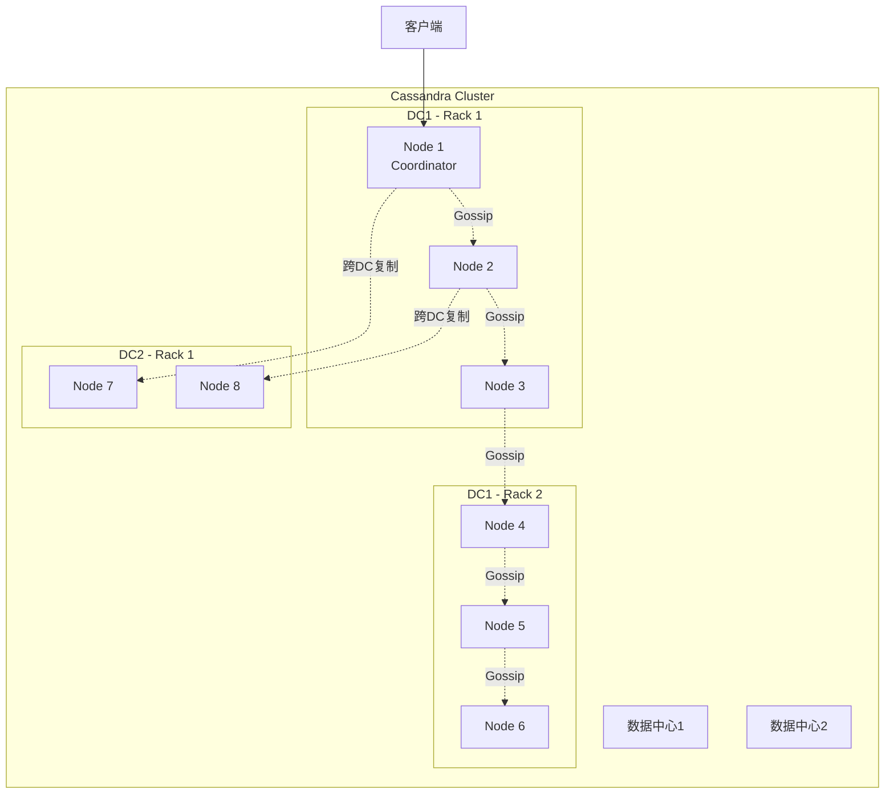

# Cassandra 深度分析

**文档版本**：v1.0
**创建时间**：2026年
**最后更新**：2026年
**状态**：✅ 已完成

---

## 📋 执行摘要

Apache Cassandra 是一个开源的分布式NoSQL数据库，基于Amazon Dynamo的分布式架构和Google Bigtable的数据模型设计，提供高可用性、线性可扩展性和最终一致性，专为处理大规模分布式数据而设计。

---

## 一、核心概念

### 1.1 定义与原理

Cassandra 采用**去中心化（Decentralized）**架构，所有节点地位对等，没有单点故障。其核心设计原则包括：

- **分布式哈希表（DHT）**：使用一致性哈希分配数据
- **最终一致性**：通过可调节的一致性级别平衡CAP
- **无主架构**：所有节点既可读又可写
- **顺序写优化**：基于LSM树的存储引擎

### 1.2 关键特性

- **线性可扩展性**：添加节点即可线性提升吞吐量
- **高可用性**：多数据中心复制，无单点故障
- **灵活一致性**：从ONE到ALL的可调一致性级别
- **CQL查询语言**：类SQL语法，降低学习成本
- **多数据中心支持**：原生跨地域部署能力

### 1.3 适用场景

| 场景 | 适用性 | 说明 |
|------|--------|------|
| 时序数据存储 | ⭐⭐⭐⭐⭐ | 写入密集型场景，如日志、监控 |
| 大规模用户画像 | ⭐⭐⭐⭐⭐ | 高并发读写，弹性扩展 |
| 消息/Feed流 | ⭐⭐⭐⭐⭐ | 时间线数据，高效范围查询 |
| 物联网数据 | ⭐⭐⭐⭐ | 高频写入，海量设备数据 |
| 事务处理 | ⭐⭐ | 仅支持轻量级事务（LWT） |
| 复杂关联查询 | ⭐ | 不支持JOIN，需反规范化设计 |

---

## 二、技术细节

### 2.1 架构设计



### 2.2 LSM树存储引擎

#### LSM树原理

**Log-Structured Merge Tree** 是一种写优化的数据结构：

```
写入流程：
┌─────────┐    ┌─────────────┐    ┌─────────────┐    ┌───────────┐
│  Memtable │ -> │ Commit Log │ -> │ Immutable  │ -> │ SSTable   │
│  (内存)   │    │  (磁盘WAL) │    │ Memtable   │    │ (磁盘)    │
└─────────┘    └─────────────┘    └─────────────┘    └───────────┘
   ↑                                                    ↓
   └──────────────── 读取时合并 Bloom Filter ────────────┘
```

**写入路径**：

1. 先写Commit Log（WAL，顺序写）
2. 再写Memtable（内存中的排序结构）
3. Memtable满后刷盘为SSTable（不可变）
4. 后台Compaction合并SSTable

**读取路径**：

1. 查Memtable（最新数据）
2. 查Row Cache（如启用）
3. 查Bloom Filter（快速排除）
4. 查SSTable（可能多个版本）
5. 合并结果返回

**复杂度分析**：

- 写入延迟：O(log N) - 内存操作+顺序磁盘写
- 读取延迟：O(log N) - 取决于SSTable数量
- 空间放大：1.1x-3x（需Compaction）
- 写放大：取决于Compaction策略

### 2.3 Gossip协议

#### 协议原理

Gossip是Cassandra节点间状态同步的 epidemic 协议：

**算法名称**：Scuttlebutt Gossip

**输入**：节点本地状态向量
**输出**：集群状态一致视图

**步骤**：

1. **选择目标**：每秒钟随机选1-3个节点
2. **交换摘要**：发送本地状态摘要（版本号）
3. **请求更新**：接收方对比版本，请求新状态
4. **传播状态**：发送完整状态给需要更新的节点
5. **处理冲突**：使用版本向量解决冲突

**消息格式**：

```
Gossip Message {
    EndpointState {
        endpoint: IP:Port
        generation: 时间戳
        version: 单调递增版本
        application_states: {
            STATUS: 节点状态 (NORMAL/LEAVING/JOINING)
            LOAD: 负载信息
            SCHEMA: 模式版本
            RELEASE_VERSION: 软件版本
            DC/RACK: 拓扑信息
        }
    }
}
```

**复杂度分析**：

- 收敛时间：O(log N) 轮 gossip
- 消息复杂度：每个节点每轮 O(1)
- 带宽消耗：与集群大小无关（固定开销）

### 2.4 一致性级别

#### 一致性级别定义

| 级别 | 读操作 | 写操作 | 说明 |
|------|--------|--------|------|
| **ONE** | 1个副本 | 1个副本 | 最低延迟，可能读到旧数据 |
| **TWO** | 2个副本 | 2个副本 | 中等一致性 |
| **THREE** | 3个副本 | 3个副本 | 较高一致性 |
| **QUORUM** | 多数副本 | 多数副本 | 强一致性（R + W > N） |
| **LOCAL_QUORUM** | 本地DC多数 | 本地DC多数 | 跨DC场景的平衡选择 |
| **EACH_QUORUM** | 每个DC多数 | 每个DC多数 | 最高一致性，高延迟 |
| **ALL** | 所有副本 | 所有副本 | 最高一致性，可用性风险 |
| **ANY** | - | 任意节点 | 写操作最低要求 |

#### 一致性数学保证

```
假设：
- N = 副本数（Replication Factor）
- R = 读一致性级别要求的副本数
- W = 写一致性级别要求的副本数

定理：当 R + W > N 时，读取一定能看到最新的写入

证明：
1. 写操作写入 W 个副本
2. 读操作从 R 个副本读取
3. 若 R + W > N，则 R 和 W 的集合必有交集
4. 交集中的副本必然包含最新写入
5. 因此读取一定能获得最新版本
```

**CAP权衡选择**：

- **ONE/ANY**：优先AP，最高可用性
- **QUORUM**：平衡CP，业界推荐
- **ALL**：优先CP，强一致性但牺牲可用性

### 2.5 CQL与数据模型

#### CQL语法示例

```sql
-- 创建Keyspace（类似数据库）
CREATE KEYSPACE IF NOT EXISTS user_data
WITH replication = {
    'class': 'NetworkTopologyStrategy',
    'dc1': 3,
    'dc2': 2
};

-- 创建表（Column Family）
CREATE TABLE IF NOT EXISTS user_data.events (
    user_id uuid,
    event_time timestamp,
    event_type text,
    payload blob,
    PRIMARY KEY (user_id, event_time)
) WITH CLUSTERING ORDER BY (event_time DESC)
  AND compaction = {'class': 'TimeWindowCompactionStrategy'};

-- 插入数据
INSERT INTO user_data.events (user_id, event_time, event_type, payload)
VALUES (uuid(), toTimestamp(now()), 'click', 0x...);

-- 范围查询（基于聚簇列）
SELECT * FROM user_data.events
WHERE user_id = ?
  AND event_time > '2026-01-01'
  AND event_time < '2026-02-01';
```

#### 数据建模最佳实践

**核心原则**：查询驱动设计（Query-First Design）

```
正确模型设计流程：
1. 列出所有查询需求
2. 根据查询设计表结构
3. 反规范化数据（避免JOIN）
4. 选择合适的主键和聚簇列
5. 评估分区大小（<100MB）

主键组成：
PRIMARY KEY ((partition_key), clustering_column1, clustering_column2)
         └──────────────┘  └─────────────────────────────────────────┘
              哈希分区                    排序列（范围查询）
```

---

## 三、系统对比

### 3.1 Cassandra vs Redis vs MongoDB

| 维度 | Cassandra | Redis | MongoDB |
|------|-----------|-------|---------|
| **数据模型** | 宽列存储 | 键值 + 数据结构 | 文档存储 |
| **架构** | 去中心化P2P | 主从复制 | 主从+分片 |
| **一致性** | 可调一致性 | 最终一致性 | 可调一致性 |
| **写入性能** | 极高（顺序写） | 极高（内存） | 高 |
| **读取性能** | 高（需调优） | 极高（内存） | 高 |
| **查询能力** | 有限（需预设计） | 简单 | 丰富（索引、聚合） |
| **事务支持** | LWT（轻量级） | Lua脚本+事务 | 多文档ACID |
| **数据规模** | PB级 | 内存限制 | TB级 |
| **适用场景** | 时序、物联网 | 缓存、实时计算 | 内容管理、应用数据库 |

### 3.2 选型决策树

```
数据存储需求分析
├── 需要复杂查询（JOIN/聚合/全文搜索）？
│   ├── 是 → MongoDB
│   └── 否 → 继续
├── 数据完全可放入内存？
│   ├── 是 → Redis（缓存/实时）
│   └── 否 → 继续
├── 写入量远大于读取？
│   ├── 是 → Cassandra（时序/日志）
│   └── 否 → 继续
├── 需要跨地域多活？
│   ├── 是 → Cassandra（无主架构优势）
│   └── 否 → MongoDB（功能更丰富）
└── 最终选择
    ├── 高可用性优先 → Cassandra
    └── 功能丰富优先 → MongoDB
```

### 3.3 性能基准对比

| 指标 | Cassandra | Redis | MongoDB |
|------|-----------|-------|---------|
| **单节点写入** | ~80K ops/s | ~100K ops/s | ~50K ops/s |
| **单节点读取** | ~60K ops/s | ~100K ops/s | ~40K ops/s |
| **线性扩展** | 是 | 否（受内存限制） | 部分 |
| **跨机房复制** | 原生支持 | 较复杂 | 较复杂 |
| **一致性延迟** | <10ms (LOCAL_QUORUM) | <1ms | <5ms |

---

## 四、实践指南

### 4.1 部署配置

```yaml
# cassandra.yaml 核心配置
cassandra:
  # 集群配置
  cluster_name: 'ProductionCluster'
  seeds: "10.0.1.1,10.0.1.2,10.0.1.3"

  # 性能调优
  concurrent_reads: 32
  concurrent_writes: 64
  concurrent_counter_writes: 32

  # 内存配置
  file_cache_size_in_mb: 512
  buffer_pool_use_heap_if_exhausted: true

  # Compaction策略
  compaction_throughput_mb_per_sec: 64

  # GC配置
  gc_warn_threshold_in_ms: 1000
  gc_log_threshold_in_ms: 200

  # 安全
  authenticator: PasswordAuthenticator
  authorizer: CassandraAuthorizer
```

### 4.2 最佳实践

1. **数据建模原则**
   - 每个表只服务一种查询模式
   - 分区键设计避免热点（使用复合键或加盐）
   - 分区大小控制在100MB以内
   - 使用TimeWindowCompactionStrategy处理时序数据

2. **运维建议**
   - 定期运行repair修复不一致
   - 监控sstable数量（过多影响读性能）
   - 设置合适的compaction策略
   - JVM堆内存不超过32GB（压缩指针）

3. **性能优化**
   - 使用PreparedStatement减少解析开销
   - 批量写入（BATCH限制在5KB以内）
   - 使用Token Aware驱动路由到协调节点
   - 开启Row Cache用于热点数据

### 4.3 常见问题

**Q1: 如何监控Cassandra集群健康？**
A: 关键指标包括：

- `nodetool status` - 节点状态
- `nodetool tpstats` - 线程池统计
- `nodetool compactionstats` - Compaction进度
- 延迟分布（p50/p99/p999）
- SSTable数量/大小

**Q2: 分区过大（Partition Skew）如何解决？**
A:

- 添加分区键前缀（如user_id + bucket）
- 使用时间作为分区键的一部分
- 定期归档或删除旧数据
- 使用SizeTieredCompactionStrategy的增量压缩

**Q3: 读写性能下降如何排查？**
A: 检查：

- SSTable数量是否过多（超过10个）
- 磁盘I/O是否饱和
- GC频率和暂停时间
- 是否触发读修复（read repair）
- 网络延迟（跨DC场景）

---

## 五、形式化分析

### 5.1 一致性模型

Cassandra 实现的是**可调一致性**（Tunable Consistency），介于最终一致性和强一致性之间。

**定理**：在 N 个副本的集群中，使用 QUORUM 读写可实现线性一致性。

**证明**：

```
设 Q = ⌊N/2⌋ + 1（多数派）
写操作等待 W = Q 个副本确认
读操作等待 R = Q 个副本响应

由于 Q + Q > N，任意两个QUORUM必有交集
因此读操作必然包含最新写入的副本
可得：Linearizability
```

### 5.2 Gossip收敛性

**定理**：在 N 个节点的集群中，Gossip协议以高概率在 O(log N) 轮内收敛。

**证明概要**：

```
每轮每个节点随机联系 log N 个其他节点
采用推送-拉取（push-pull）模式
信息传播符合流行病模型（SI模型）

感染概率分析：
P(节点i在第t轮获知消息) ≥ 1 - (1 - 1/N)^(log N)
                              ≈ 1 - 1/N

经过 O(log N) 轮，所有节点获知概率趋近1
```

---

## 六、与其他主题的关联

### 6.1 上游依赖

- [一致性哈希](../02-distributed-theory/consistent-hashing.md)
- [CAP定理](../02-distributed-theory/cap-theorem.md)
- [LSM树存储](../03-storage/lsm-tree.md)

### 6.2 下游应用

- [时序数据库](../05-storage/timeseries.md)
- [物联网平台](../06-applications/iot-platform.md)
- [分布式日志](../04-messaging/distributed-log.md)

### 6.3 相关概念

| 概念 | 关系 | 说明 |
|------|------|------|
| Dynamo | 架构来源 | Cassandra基于Amazon Dynamo设计 |
| Bigtable | 数据模型来源 | 采用列族存储模型 |
| Voldemort | 对比 | LinkedIn的Dynamo实现 |

---

## 七、参考资源

### 7.1 学术论文

1. [Cassandra - A Decentralized Structured Storage System](https://www.cs.cornell.edu/projects/ladis2009/papers/lakshman-ladis2009.pdf) - Lakshman & Malik, 2009
2. [Dynamo: Amazon's Highly Available Key-value Store](https://www.allthingsdistributed.com/files/amazon-dynamo-sosp2007.pdf) - DeCandia et al., 2007
3. [Bigtable: A Distributed Storage System for Structured Data](https://research.google/pubs/pub27898/) - Chang et al., 2006

### 7.2 开源项目

1. [Apache Cassandra](https://github.com/apache/cassandra) - 官方源码
2. [ScyllaDB](https://github.com/scylladb/scylla) - C++实现的Cassandra兼容数据库
3. [DataStax Java Driver](https://github.com/datastax/java-driver) - 官方Java驱动

### 7.3 学习资料

1. [Cassandra: The Definitive Guide](https://www.oreilly.com/library/view/cassandra-the-definitive/9781098115164/) - O'Reilly, 2022
2. [DataStax Academy](https://www.datastax.com/dev) - 官方学习资源
3. [Cassandra Documentation](https://cassandra.apache.org/doc/latest/) - 官方文档

### 7.4 相关文档

- [HBase深度分析](./HBase深度分析.md)
- [MongoDB架构](./MongoDB架构.md)
- [分布式存储对比](../05-storage/nosql-comparison.md)

---

**维护者**：项目团队
**最后更新**：2026年
