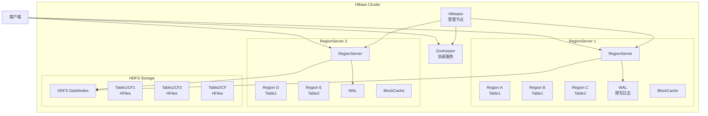
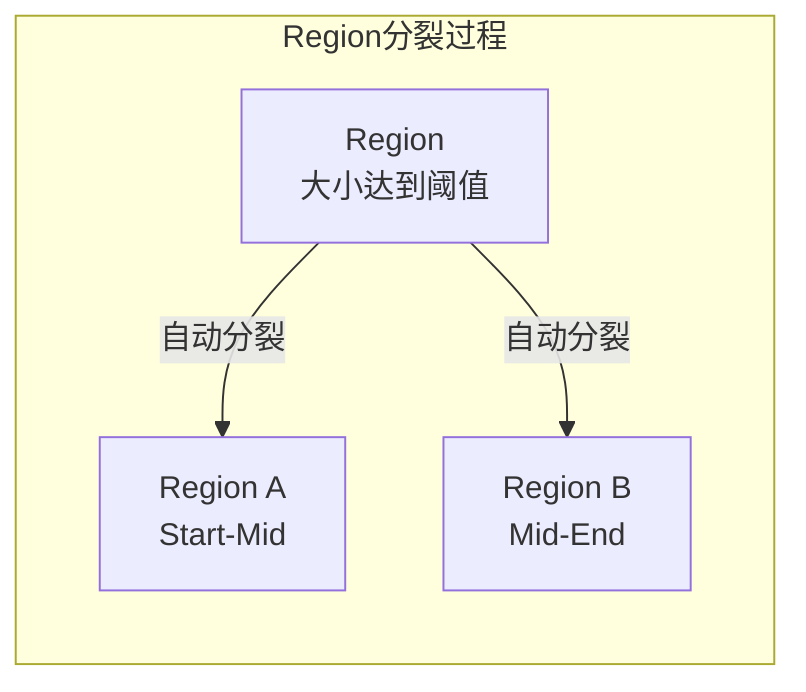
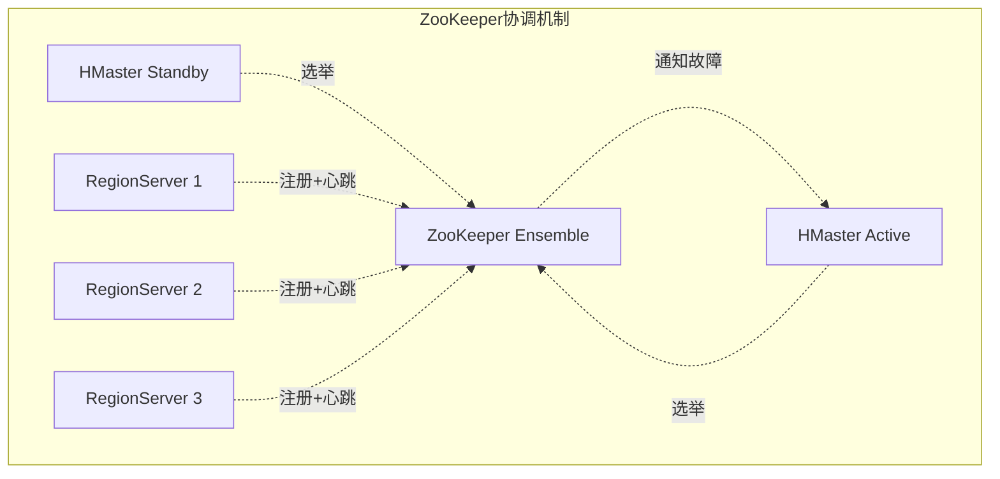

# HBase 深度分析

**文档版本**：v1.0
**创建时间**：2026年
**最后更新**：2026年
**状态**：✅ 已完成

---

## 📋 执行摘要

Apache HBase 是一个开源的分布式列式NoSQL数据库，构建在Hadoop HDFS之上，提供海量结构化数据的随机实时读写访问，是Google Bigtable的开源实现，适用于需要低延迟访问大规模数据集的批处理和实时应用。

---

## 一、核心概念

### 1.1 定义与原理

HBase 是基于**列族存储**的分布式数据库，核心设计原则：

- **强一致性**：单行读写保证ACID
- **列式存储**：按列族组织，适合稀疏数据
- **HDFS集成**：利用HDFS的可靠性和扩展性
- **自动分片**：Region自动分裂和负载均衡
- **ZooKeeper协调**：分布式协调服务

### 1.2 关键特性

- **海量存储**：支持PB级数据
- **高吞吐**：面向批量扫描优化
- **低延迟**：单点查询可达毫秒级
- **稀疏矩阵**：空列不占用存储
- **多版本**：保留数据的多个时间版本
- **Coprocessor**：服务器端计算能力

### 1.3 适用场景

| 场景 | 适用性 | 说明 |
|------|--------|------|
| 海量日志存储 | ⭐⭐⭐⭐⭐ | 高吞吐写入，高效扫描 |
| 时序数据库 | ⭐⭐⭐⭐⭐ | OpenTSDB、KairosDB基础 |
| 用户画像存储 | ⭐⭐⭐⭐ | 列族存储用户多维度属性 |
| 消息/Feeds | ⭐⭐⭐⭐ | 时间线数据存储 |
| 实时分析 | ⭐⭐⭐ | 结合Spark/Flink分析 |
| 复杂事务 | ⭐ | 仅支持单行事务 |

---

## 二、技术细节

### 2.1 架构设计



### 2.2 HDFS之上的列族存储

#### 存储模型

```
HBase数据模型层次：

Namespace（命名空间）
└── Table（表）
    └── Column Family 1（列族）
    │   └── Column Qualifier（列限定符）
    │       ├── Cell（单元格）
    │       │   ├── Value（值）
    │       │   ├── Timestamp（时间戳）
    │       │   └── Type（Put/Delete）
    │       └── ...
    └── Column Family 2
        └── ...

逻辑视图（稀疏矩阵）：

Row Key     │ CF1:col1  │ CF1:col2  │ CF2:col1  │ CF2:col2
────────────┼───────────┼───────────┼───────────┼───────────
row1        │ v1(t1)    │ v2(t2)    │ -         │ v3(t1)
row2        │ v4(t1)    │ -         │ v5(t2)    │ v6(t1)
row3        │ -         │ -         │ v7(t1)    │ -

物理存储（按列族分开）：

CF1存储文件：                CF2存储文件：
row1, col1, t2, v2          row1, col2, t1, v3
row1, col1, t1, v1          row2, col2, t1, v6
row2, col1, t1, v4          row2, col1, t2, v5
                            row3, col1, t1, v7
```

#### HFile格式

HFile是HBase在HDFS上存储数据的文件格式（基于Hadoop TFile）：

```
HFile v2 结构：

┌─────────────────────────────────────────────────────┐
│ Data Block（64KB）                                  │
│ ┌──────────────┬──────────────┬──────────────┐     │
│ │ KV 1         │ KV 2         │ KV 3         │ ... │
│ │ (有序存储)    │              │              │     │
│ └──────────────┴──────────────┴──────────────┘     │
├─────────────────────────────────────────────────────┤
│ Index Block（记录Data Block索引）                    │
│ - firstKey: 每个Data Block的首个Key                 │
│ - offset: Data Block在文件中的偏移                   │
│ - size: Data Block大小                              │
├─────────────────────────────────────────────────────┤
│ Bloom Filter Block                                  │
│ - 快速判断Key是否可能存在                            │
│ - 减少不必要的磁盘IO                                │
├─────────────────────────────────────────────────────┤
│ Meta Block（可选）                                   │
│ - 压缩信息、加密信息等                               │
├─────────────────────────────────────────────────────┤
│ Trailer（固定位置，从文件末尾读取）                    │
│ - 各Block的偏移和大小                                │
│ - 版本信息                                          │
└─────────────────────────────────────────────────────┘
```

### 2.3 Region管理

#### Region分裂与合并



**Region生命周期**：

```
1. 创建（Creation）
   - 建表时创建初始Region
   - 可预分区（pre-splitting）避免热点

2. 分裂（Split）
   触发条件：
   - Region大小 > hbase.hregion.max.filesize（默认10GB）
   - 或手动触发：split 'tableName','rowKey'

   分裂过程：
   a. 获取分裂点（midKey）
   b. 创建子Region目录
   c. 关闭父Region
   d. 复制HFile引用到子Region
   e. 在.META.中更新状态
   f. 打开子Region

3. 合并（Merge）
   触发条件：
   - 手动触发（merge_region）
   - 相邻Region都较小

   限制：
   - 不能跨Table合并
   - 不能合并正在分裂的Region

4. 下线（Offline）
   - RegionServer故障
   - 负载均衡迁移
   - 手动下线
```

#### Region定位流程

```
客户端查找Region的三层索引：

┌─────────────────────────────────────────────────────────────┐
│ 第0层：ZooKeeper                                            │
│   /hbase/meta-region-server → 存储hbase:meta的RegionServer │
├─────────────────────────────────────────────────────────────┤
│ 第1层：hbase:meta 表                                        │
│   Key: [TableName, StartRow, Time]                          │
│   Value: RegionInfo + Server信息                            │
├─────────────────────────────────────────────────────────────┤
│ 第2层：目标Region                                           │
│   直接访问RegionServer读写数据                              │
└─────────────────────────────────────────────────────────────┘

客户端缓存：
- 缓存meta信息和Region位置
- 缓存失效时重新查询
- 减少ZooKeeper和meta表压力
```

### 2.4 ZooKeeper协调

#### ZK在HBase中的作用



**ZooKeeper存储结构**：

```
/hbase
├── master                 # 当前Active Master
├── backup-masters         # 备份Master列表
├── rs                     # 注册RegionServer
│   ├── rs1-host,port,ts1
│   ├── rs2-host,port,ts2
│   └── rs3-host,port,ts3
├── draining               # 正在下线的RegionServer
├── table                  # 表状态（enabled/disabled）
├── region-in-transition   # 状态转换中的Region
├── namespace              # 命名空间信息
├── online-snapshot        # 正在进行的快照
├── replication            # 复制状态
└── meta-region-server     # hbase:meta位置
```

**关键协调机制**：

| 机制 | 用途 | 实现方式 |
|------|------|----------|
| **Master选举** | 避免脑裂 | 创建临时顺序节点，序号最小者为Active |
| **RegionServer注册** | 服务发现 | 在/rs下创建临时节点 |
| **故障检测** | 自动恢复 | 监听临时节点删除事件 |
| **分布式锁** | Region状态转换 | 创建临时节点作为锁 |
| **配置管理** | 集群配置同步 | 持久节点存储配置 |

### 2.5 读写路径

#### 写入路径（Write Path）

```
写入流程：

1. 客户端发送Put请求
   Put put = new Put(Bytes.toBytes("row1"));
   put.addColumn(Bytes.toBytes("cf"), Bytes.toBytes("col"), Bytes.toBytes("value"));

2. RegionServer处理
   a. 写入WAL（Write Ahead Log）
      - HDFS追加写
      - 保证数据持久性
      - 默认同步刷盘（可配置）

   b. 写入MemStore（内存）
      - 按RowKey排序
      - 每个Column Family一个MemStore

   c. 返回客户端成功

3. MemStore刷盘（Flush）
   触发条件：
   - MemStore大小 > hbase.hregion.memstore.flush.size（默认128MB）
   - 总MemStore比例过高
   - 手动触发
   - RegionServer关闭

   过程：
   - 创建新的HFile
   - 将MemStore数据按KeyValue格式写入
   - 更新hbase:meta
   - 清空MemStore
   - 删除旧WAL（当所有数据持久化后）

4. Compaction
   Minor: 合并小文件（默认3个）
   Major: 合并所有文件，清理过期数据
```

#### 读取路径（Read Path）

```
读取流程：

1. BlockCache检查
   - 最近读取的Block缓存
   - LRU淘汰策略
   - 读放大优化

2. MemStore检查
   - 读取未刷盘的最新数据
   - 与HFile数据合并版本

3. HFile读取
   - 使用Bloom Filter快速排除
   - 读取Data Block
   - 解压、反序列化

4. 版本合并
   - 合并MemStore + HFile结果
   - 按Timestamp排序
   - 应用版本限制（maxVersions）
   - 应用TTL过滤

5. 返回结果
```

---

## 三、系统对比

### 3.1 HBase vs Cassandra

| 维度 | HBase | Cassandra |
|------|-------|-----------|
| **存储层** | HDFS | 本地文件系统 |
| **架构** | 主从（Master-Slave） | 无主（P2P） |
| **协调服务** | ZooKeeper | Gossip协议 |
| **一致性** | 强一致性 | 可调一致性 |
| **依赖** | Hadoop生态 | 独立运行 |
| **部署复杂度** | 较高（需HDFS+ZK） | 较低 |
| **多数据中心** | 较复杂（Replication） | 原生支持 |
| **查询能力** | 有限（需配合Phoenix） | CQL较丰富 |
| **性能特点** | 批处理优秀 | 均衡，写入优秀 |

### 3.2 架构差异详解

```
HBase架构特点：
┌─────────────────────────────────────────────────────┐
│ • 中心化协调（Master + ZooKeeper）                   │
│ • 强依赖HDFS提供可靠性                              │
│ • 分层存储（MemStore + BlockCache + HFile）         │
│ • 面向扫描优化（Block、顺序读）                      │
│ • 更适合批处理与实时查询结合的场景                   │
└─────────────────────────────────────────────────────┘

Cassandra架构特点：
┌─────────────────────────────────────────────────────┐
│ • 去中心化（无Master）                               │
│ • 独立运行，自我管理                                 │
│ • LSM树存储（MemTable + SSTable）                   │
│ • 可调节一致性级别                                  │
│ • 更适合跨地域多活部署                              │
└─────────────────────────────────────────────────────┘
```

### 3.3 选型决策树

```
列式存储选型分析
├── 已有Hadoop生态？
│   ├── 是 → HBase（生态集成优势）
│   └── 否 → 继续
├── 需要跨地域多活？
│   ├── 是 → Cassandra（原生支持）
│   └── 否 → 继续
├── 需要丰富查询语言？
│   ├── 是 → Cassandra（CQL）
│   └── 否 → 继续
├── 需要强一致性？
│   ├── 是 → HBase（默认强一致）
│   └── 否 → Cassandra（可调）
├── 部署运维资源有限？
│   ├── 是 → Cassandra（更简单）
│   └── 否 → HBase（企业级功能更全）
└── 数据规模
    ├── PB级+Hadoop → HBase
    └── TB级+独立部署 → Cassandra
```

### 3.4 性能基准对比

| 指标 | HBase | Cassandra | 说明 |
|------|-------|-----------|------|
| **单节点写入** | ~50K rows/s | ~80K rows/s | 取决于配置 |
| **单节点读取** | ~100K rows/s | ~60K rows/s | HBase读缓存优势 |
| **扫描性能** | 优秀 | 良好 | HBase BlockCache优化 |
| **扩展延迟** | 需依赖HDFS | 秒级 | Cassandra P2P更快 |
| **故障恢复** | 依赖Master选举 | 自动 | Cassandra无单点 |
| **跨机房复制** | 较复杂 | 原生 | Cassandra多DC优势 |

---

## 四、实践指南

### 4.1 部署配置

```xml
<!-- hbase-site.xml 核心配置 -->
<configuration>
    <!-- 集群配置 -->
    <property>
        <name>hbase.cluster.distributed</name>
        <value>true</value>
    </property>
    <property>
        <name>hbase.zookeeper.quorum</name>
        <value>zk1,zk2,zk3</value>
    </property>
    <property>
        <name>hbase.rootdir</name>
        <value>hdfs://namenode:8020/hbase</value>
    </property>

    <!-- RegionServer配置 -->
    <property>
        <name>hbase.hregion.max.filesize</name>
        <value>10737418240</value> <!-- 10GB -->
    </property>
    <property>
        <name>hbase.hregion.memstore.flush.size</name>
        <value>134217728</value> <!-- 128MB -->
    </property>
    <property>
        <name>hbase.regionserver.handler.count</name>
        <value>100</value>
    </property>

    <!-- BlockCache配置 -->
    <property>
        <name>hfile.block.cache.size</name>
        <value>0.4</value> <!-- 堆内存40% -->
    </property>
    <property>
        <name>hbase.bucketcache.ioengine</name>
        <value>offheap</value>
    </property>
    <property>
        <name>hbase.bucketcache.size</name>
        <value>8192</value> <!-- 8GB堆外内存 -->
    </property>

    <!-- Compaction配置 -->
    <property>
        <name>hbase.hstore.compactionThreshold</name>
        <value>3</value>
    </property>
    <property>
        <name>hbase.hstore.compaction.max</name>
        <value>10</value>
    </property>
</configuration>
```

### 4.2 最佳实践

1. **RowKey设计原则**

   ```java
   // 避免热点：使用Salt前缀或哈希
   // 盐值前缀（分散写入）
   String saltedKey = (hash(userId) % 16) + "_" + userId;

   // 组合键（支持扫描）
   // [userId_reverse][timestamp_reverse]
   // 便于按用户查询最新数据

   // 避免的问题：
   // - 单调递增RowKey（时间戳序列）
   // - 过长的RowKey（增加索引开销）
   // - 过小基数（导致Region过大）
   ```

2. **表设计建议**

   ```java
   // 预分区避免热点
   byte[][] splitKeys = new byte[][] {
       Bytes.toBytes("10000"),
       Bytes.toBytes("20000"),
       Bytes.toBytes("30000"),
       // ...
   };
   admin.createTable(tableDescriptor, splitKeys);

   // 列族数量控制（推荐<3）
   // 不同列族独立存储，过多影响性能

   // 设置合理TTL
   columnDescriptor.setTimeToLive(2592000); // 30天

   // 版本控制
   columnDescriptor.setMaxVersions(3); // 保留3个版本
   ```

3. **性能优化**
   - 使用批量操作（Batch Put/Get）
   - 开启Bloom Filter（减少IO）
   - 调整Block大小（扫描用64KB，随机读用8KB）
   - 使用Snappy/LZO压缩
   - 监控并调整MemStore大小

4. **运维监控**

   ```bash
   # 关键检查命令
   hbase shell
   > status 'detailed'           # 集群状态
   > list_regions 'tableName'    # Region分布
   > balancer_enabled            # 均衡器状态
   > compaction_queue            # Compaction队列

   # 关键指标
   - Region数量/大小
   - MemStore Flush频率
   - Compaction压力
   - BlockCache命中率
   - 读写延迟分布
   ```

### 4.3 常见问题

**Q1: Region热点问题如何解决？**
A:

- 预分区（Pre-splitting）避免单个Region过大
- 使用Salt前缀或哈希分散RowKey
- 避免时间戳作为RowKey前缀
- 监控Region大小，及时调整

**Q2: MemStore Flush频繁怎么办？**
A:

- 增加hbase.hregion.memstore.flush.size
- 增加RegionServer内存
- 检查是否存在写入热点
- 调整hbase.regionserver.global.memstore.size

**Q3: Compaction压力过大如何优化？**
A:

- 调整compactionThreshold（默认3）
- 使用分层Compaction（Date Tiered）
- 在低峰期执行Major Compaction
- 监控Compaction队列长度

**Q4: Full GC频繁如何处理？**
A:

- 增加堆内存（但避免超过32GB）
- 使用BucketCache（堆外内存）
- 调整BlockCache比例
- 优化Region数量（减少开销）
- 使用G1GC替代CMS

---

## 五、形式化分析

### 5.1 一致性保证

HBase 提供**强一致性**保证：

```
单行操作原子性：

定理：HBase单行读写是原子的

证明：
1. 单行数据由单一Region管理
2. Region内使用行锁（RowLock）
3. 写入顺序：
   a. 获取行锁
   b. 写入WAL（持久化）
   c. 写入MemStore
   d. 释放行锁
4. 读取时使用MVCC（多版本并发控制）
5. 因此单行操作满足ACID

限制：
- 不支持跨行事务（需配合Phoenix或Tephra）
- 不支持跨表事务
```

### 5.2 可用性分析

```
CAP权衡：

HBase选择：
- Consistency（强一致性）
- Partition Tolerance（分区容错）
- 牺牲部分Availability

故障场景：

1. RegionServer故障
   - 影响：该Server上的Region暂时不可用
   - 恢复时间：通常30秒内（ZK超时+重新分配）
   - ZK检测到故障 → Master重新分配Region → 新Server加载Region

2. HMaster故障
   - 影响：DDL操作不可用，但读写正常
   - 恢复时间：Backup Master选举（通常秒级）

3. HDFS故障
   - 影响：依赖HDFS的容错能力
   - HBase本身无单点，依赖底层HDFS
```

---

## 六、与其他主题的关联

### 6.1 上游依赖

- [Hadoop HDFS](../05-storage/hdfs.md)
- [ZooKeeper](../02-distributed-theory/zookeeper.md)
- [LSM树存储](../03-storage/lsm-tree.md)

### 6.2 下游应用

- [OpenTSDB](../06-applications/timeseries-database.md)
- [实时计算](../06-applications/stream-processing.md)
- [大数据平台](../06-applications/bigdata-platform.md)

### 6.3 相关概念

| 概念 | 关系 | 说明 |
|------|------|------|
| Bigtable | 参考实现 | HBase基于Google Bigtable论文 |
| Phoenix | SQL层 | HBase的SQL查询引擎 |
| Hive | 集成 | 通过Hive访问HBase数据 |
| Spark | 集成 | Spark读写HBase数据 |

---

## 七、参考资源

### 7.1 学术论文

1. [Bigtable: A Distributed Storage System for Structured Data](https://research.google/pubs/pub27898/) - Chang et al., 2006
2. [Apache HBase Reference Guide](https://hbase.apache.org/book.html) - Apache HBase Team

### 7.2 开源项目

1. [Apache HBase](https://github.com/apache/hbase) - 官方源码
2. [Apache Phoenix](https://github.com/apache/phoenix) - HBase SQL层
3. [OpenTSDB](https://github.com/OpenTSDB/opentsdb) - 基于HBase的时序数据库

### 7.3 学习资料

1. [HBase: The Definitive Guide](https://www.oreilly.com/library/view/hbase-the-definitive/9781449314682/) - O'Reilly, 2011
2. [HBaseCon](https://hbase.apache.org/acid-semantics.html) - 社区会议资料
3. [HBase Documentation](https://hbase.apache.org/book.html) - 官方文档

### 7.4 相关文档

- [Cassandra深度分析](./Cassandra深度分析.md)
- [MongoDB架构](./MongoDB架构.md)
- [HDFS存储](../05-storage/hdfs.md)

---

**维护者**：项目团队
**最后更新**：2026年


---

## 相关主题

- [Cassandra深度分析](./Cassandra深度分析.md)
- [HDFS实现](../dfs/HDFS实现.md)
- [LSM-Tree存储引擎](../LSM-Tree存储引擎.md)

## 参考资源

- [HBase官方文档](https://hbase.apache.org/book.html)
