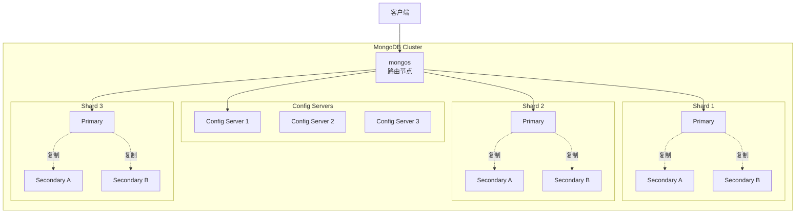
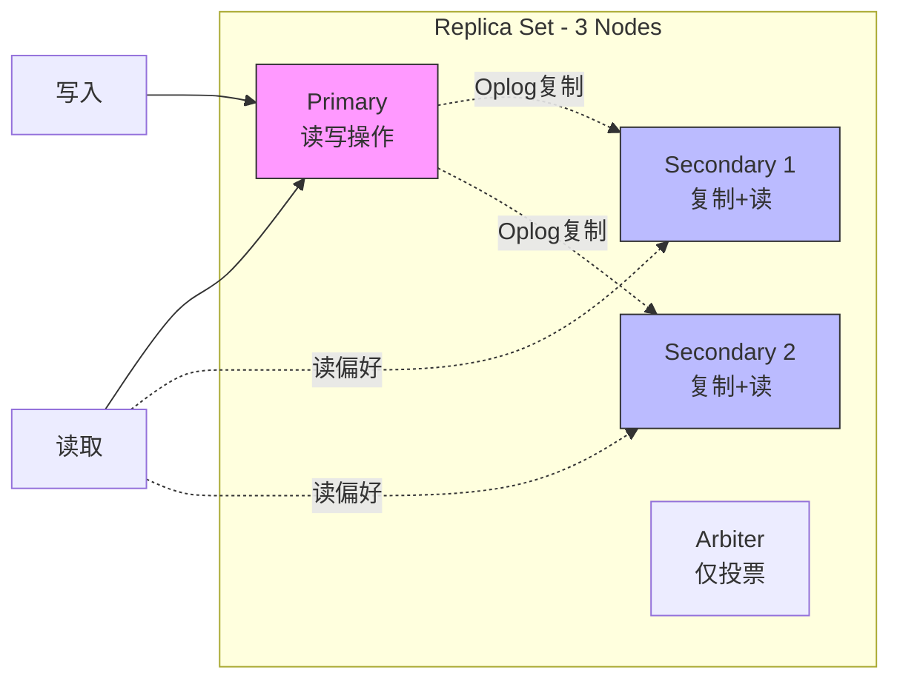
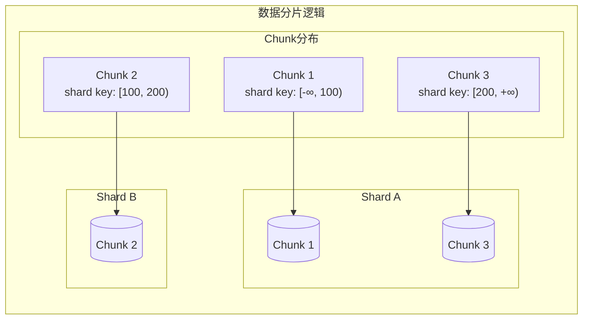

# MongoDB 架构深度分析

**文档版本**：v1.0
**创建时间**：2026年
**最后更新**：2026年
**状态**：✅ 已完成

---

## 📋 执行摘要

MongoDB 是最流行的文档型NoSQL数据库，采用BSON格式存储半结构化数据，提供灵活的查询语言、强大的索引能力和完整的ACID事务支持，适用于现代应用程序的敏捷开发。

---

## 一、核心概念

### 1.1 定义与原理

MongoDB 是基于**文档模型**的分布式数据库，核心设计理念：

- **文档存储**：数据以BSON文档形式组织，天然映射对象模型
- **灵活模式**：无需预定义Schema，支持动态字段
- **丰富的查询**：支持索引、聚合、全文搜索
- **水平扩展**：原生分片支持海量数据
- **多文档事务**：4.0+版本支持完整ACID事务

### 1.2 关键特性

- **BSON格式**：二进制JSON，支持更多数据类型
- **灵活的聚合管道**：类SQL的复杂数据处理能力
- **多样化索引**：单字段、复合、多键、文本、地理空间索引
- **Change Streams**：实时数据变更监听
- **GridFS**：大文件存储解决方案

### 1.3 适用场景

| 场景 | 适用性 | 说明 |
|------|--------|------|
| 内容管理系统 | ⭐⭐⭐⭐⭐ | 灵活Schema适配多变内容结构 |
| 移动应用后端 | ⭐⭐⭐⭐⭐ | 快速迭代，对象映射自然 |
| 实时分析 | ⭐⭐⭐⭐ | 聚合管道强大，物化视图 |
| 物联网数据 | ⭐⭐⭐⭐ | 时序数据存储，TTL索引 |
| 电商产品目录 | ⭐⭐⭐⭐⭐ | 多变属性，快速搜索 |
| 金融交易系统 | ⭐⭐⭐ | 支持事务但性能不如专用系统 |

---

## 二、技术细节

### 2.1 架构设计



### 2.2 文档模型与BSON

#### BSON格式详解

BSON（Binary JSON）是MongoDB的二进制序列化格式：

```
BSON Document Structure:
┌─────────────────────────────────────────────────────┐
│ 总长度 (4 bytes)                                    │
├─────────────────────────────────────────────────────┤
│ 元素1: │ 类型 (1 byte) │ 字段名 (C string) │ 值   │
├─────────────────────────────────────────────────────┤
│ 元素2: │ 类型 (1 byte) │ 字段名 (C string) │ 值   │
├─────────────────────────────────────────────────────┤
│ ...                                                 │
├─────────────────────────────────────────────────────┤
│ 结束标记 (0x00)                                     │
└─────────────────────────────────────────────────────┘

BSON类型扩展（vs JSON）:
- Date: 64位Unix时间戳
- ObjectId: 12字节唯一标识符
- Binary: 二进制数据
- Decimal128: 高精度小数
- Regular Expression: 正则表达式
- Timestamp: 内部使用的时间戳
```

**文档示例**：
```javascript
{
    "_id": ObjectId("65a1b2c3d4e5f6a7b8c9d0e1"),
    "user": {
        "name": "张三",
        "email": "zhangsan@example.com",
        "age": 28,
        "tags": ["developer", "mongodb"],
        "address": {
            "city": "北京",
            "zip": "100000"
        }
    },
    "createdAt": ISODate("2026-01-15T08:30:00Z"),
    "score": NumberDecimal("99.99"),
    "metadata": BinData(0, "base64encoded...")
}
```

#### 文档模型设计原则

```
数据建模决策：

1. 嵌入式 vs 引用式
   ┌─────────────────────────────────────────┐
   │ 嵌入式（子文档）                         │
   │ - 一对一关系                             │
   │ - 一对少（<100个）                       │
   │ - 需要一起查询的数据                     │
   │ - 原子更新需求                           │
   └─────────────────────────────────────────┘
   
   ┌─────────────────────────────────────────┐
   │ 引用式（DBRef/手动引用）                  │
   │ - 一对多（>100个）                       │
   │ - 多对多关系                             │
   │ - 数据频繁变更                           │
   │ - 需要独立查询子数据                     │
   └─────────────────────────────────────────┘

2. 数组使用注意事项
   - 数组元素数量上限：推荐<1000
   - 使用$slice控制返回数量
   - 考虑使用引用式替代大数组
```

### 2.3 副本集（Replica Set）

#### 副本集架构



#### Oplog复制机制

**Oplog（Operations Log）** 是副本集复制的核心：

```
Oplog Entry Structure:
{
    "ts": Timestamp(1705312800, 1),  // 时间戳
    "h": Long("-1234567890"),        // 哈希值
    "v": 2,                           // 版本
    "op": "i",                       // 操作类型：i=insert, u=update, d=delete
    "ns": "db.collection",           // 命名空间
    "ui": UUID("..."),               // 集合UUID
    "o": { ... },                    // 操作文档（insert/update内容）
    "o2": { "_id": ... }             // 查询条件（update/delete）
}
```

**复制流程**：
1. Primary接收写操作，写入本地Oplog
2. Secondary轮询Primary的Oplog
3. Secondary在本地重放（apply）操作
4. Secondary更新自己的Oplog

#### 选举机制

**Raft算法变体**：

```
选举触发条件：
- Primary心跳超时（默认10秒）
- 手动执行rs.stepDown()
- 优先级更高的节点加入

选举规则：
1. 获得多数派（N/2+1）投票才能成为Primary
2. 节点优先级（priority）影响选举
3. 最新数据节点优先（optime最新）
4. Arbiter只参与投票，不存储数据

故障转移时间：
- 检测超时：10秒（可配置）
- 选举完成：通常2-5秒
- 总RTO：<30秒
```

### 2.4 分片集群（Sharding）

#### 分片原理



**分片键（Shard Key）选择**：

```
分片键类型：

1. 范围分片（Ranged Sharding）
   - 按shard key范围划分Chunk
   - 适合范围查询、排序
   - 风险：热点（顺序写入）
   
   示例：{ createdAt: 1 }
   Chunk1: {createdAt: {$minKey: 1}} -> {createdAt: ISODate("2026-01-01")}
   Chunk2: {createdAt: ISODate("2026-01-01")} -> {createdAt: ISODate("2026-02-01")}

2. 哈希分片（Hashed Sharding）
   - 对shard key计算哈希值
   - 均匀分布，避免热点
   - 不支持范围查询
   
   示例：{ _id: "hashed" }

3. 组合分片（Compound）
   - 多个字段组合作为shard key
   - 前缀匹配原则
   
   示例：{ userId: 1, _id: 1 }
```

#### Chunk管理与均衡

```
Chunk生命周期：

1. 分裂（Split）
   当Chunk大小超过阈值（默认64MB）:
   Chunk A [min, max) -> Chunk A1 [min, mid) + Chunk A2 [mid, max)

2. 迁移（Migration）
   当Shard间Chunk数量差异>阈值（默认2）:
   mongos协调从源Shard迁移Chunk到目标Shard
   
3. 均衡器（Balancer）
   - 后台进程监控Chunk分布
   - 自动触发迁移
   - 可配置时间窗口（避免高峰期）

均衡配置：
use config
sh.setBalancerState(true)
db.settings.update(
    { _id: "balancer" },
    { $set: { activeWindow: { start: "02:00", stop: "06:00" } } },
    { upsert: true }
)
```

### 2.5 事务支持

#### 多文档ACID事务

MongoDB 4.0+ 支持副本集事务，4.2+ 支持分片集群事务：

```javascript
// 事务示例
const session = db.getMongo().startSession();
session.startTransaction({
    readConcern: { level: "snapshot" },
    writeConcern: { w: "majority" }
});

try {
    const accounts = session.getDatabase("bank").accounts;
    
    // 扣款
    accounts.updateOne(
        { _id: "accountA" },
        { $inc: { balance: -100 } }
    );
    
    // 入账
    accounts.updateOne(
        { _id: "accountB" },
        { $inc: { balance: 100 } }
    );
    
    session.commitTransaction();
} catch (error) {
    session.abortTransaction();
    throw error;
} finally {
    session.endSession();
}
```

**事务限制**：

| 限制项 | 值 | 说明 |
|--------|-----|------|
| 事务运行时间 | 默认60秒 | 可调，但过长影响性能 |
| 文档修改数量 | 无硬性限制 | 但受16MB文档限制 |
| 涉及的Chunk | 无限制 | 分片事务会锁多个分片 |
| 事务中DDL | 不允许 | 不能创建索引等 |

#### 隔离级别

```
Read Concern Levels:

1. local (默认)
   - 读取本地副本的最新数据
   - 可能读取到未复制到多数派的数据
   - 最高性能，最低一致性

2. majority
   - 读取已复制到多数派的数据
   - 保证不会回滚
   - 读自己写的保证

3. snapshot
   - 事务中使用
   - 读取事务开始时的快照
   -  repeatable read

Write Concern Levels:

1. w: 1 (默认)
   - Primary确认即返回
   
2. w: "majority"
   - 复制到多数派后返回
   - 数据持久性保证
   
3. w: <number>
   - 指定副本数确认
   
4. j: true
   - 写入journal后返回
```

---

## 三、系统对比

### 3.1 与关系型数据库对比

| 维度 | MongoDB | MySQL/PostgreSQL |
|------|---------|------------------|
| **数据模型** | 灵活的文档 | 严格的表结构 |
| **Schema** | 动态/灵活 | 预定义/固定 |
| **扩展性** | 原生水平扩展 | 垂直扩展为主 |
| **事务** | 4.0+支持多文档 | 原生完整支持 |
| **JOIN** | 有限（$lookup） | 强大优化 |
| **查询优化** | 基于成本的优化器 | 成熟复杂的优化器 |
| **适用场景** | 敏捷开发、大数据 | 复杂事务、报表 |

### 3.2 与Cassandra对比

| 维度 | MongoDB | Cassandra |
|------|---------|-----------|
| **架构** | 主从复制 | 无主P2P |
| **一致性** | 强一致性（默认） | 可调一致性 |
| **查询能力** | 非常丰富 | 有限 |
| **数据模型** | 文档 | 宽列 |
| **事务** | 完整ACID | LWT（轻量） |
| **扩展复杂度** | 中等（需分片配置） | 简单（自动） |
| **多数据中心** | 较复杂 | 原生支持 |

### 3.3 选型决策树

```
应用数据库选型
├── 需要复杂JOIN和事务？
│   ├── 是 → PostgreSQL/MySQL
│   └── 否 → 继续
├── 数据结构多变，快速迭代？
│   ├── 是 → MongoDB
│   └── 否 → 继续
├── 超高写入吞吐量（>100K/s）？
│   ├── 是 → Cassandra
│   └── 否 → 继续
├── 需要地理空间查询？
│   ├── 是 → MongoDB/PostgreSQL+PostGIS
│   └── 否 → 继续
└── 最终推荐
    ├── 通用场景 → MongoDB（灵活性+功能丰富）
    └── 特定场景 → 专用数据库
```

---

## 四、实践指南

### 4.1 部署配置

```yaml
# mongod.conf 生产配置
storage:
  dbPath: /data/mongodb
  journal:
    enabled: true
  wiredTiger:
    engineConfig:
      cacheSizeGB: 16  # 约(RAM - 1GB) / 2
      journalCompressor: zlib
    collectionConfig:
      blockCompressor: snappy

systemLog:
  destination: file
  path: /var/log/mongodb/mongod.log
  logAppend: true
  logRotate: reopen

net:
  port: 27017
  bindIp: 127.0.0.1,10.0.0.1
  maxIncomingConnections: 20000

replication:
  replSetName: rs0
  oplogSizeMB: 51200  # 根据数据量调整

sharding:
  clusterRole: shardsvr  # 或 configsvr

security:
  authorization: enabled
  keyFile: /etc/mongodb/keyfile
```

### 4.2 最佳实践

1. **索引策略**
   ```javascript
   // ESR原则：Equality, Sort, Range
   // 好的索引
   db.orders.createIndex({ status: 1, createdAt: -1, amount: 1 })
   // status用于等值查询，createdAt用于排序，amount用于范围
   
   // 复合索引前缀匹配
   // 索引 {a: 1, b: 1, c: 1} 支持：
   // - {a: 1}
   // - {a: 1, b: 1}
   // - {a: 1, b: 1, c: 1}
   // 不支持单独 {b: 1} 或 {c: 1}
   ```

2. **分片键设计**
   - 避免单调递增键（如时间戳）
   - 高基数字段（避免大Chunk）
   - 查询中最常用的过滤条件
   - 考虑使用组合键分散热点

3. **性能优化**
   - 使用投影（projection）减少返回字段
   - 限制返回数量（limit）
   - 使用覆盖索引（Covered Query）
   - 避免skip大量文档（使用范围查询）
   - 批量操作（bulkWrite）

4. **运维监控**
   ```javascript
   // 关键监控指标
   db.serverStatus().connections    // 连接数
   db.serverStatus().opcounters     // 操作计数
   db.serverStatus().wiredTiger.cache  // 缓存状态
   db.currentOp()                   // 当前操作
   rs.status()                      // 副本集状态
   sh.status()                      // 分片状态
   ```

### 4.3 常见问题

**Q1: 如何选择分片键避免热点？**
A: 
- 避免单调递增字段（如ObjectId、时间戳）
- 使用哈希分片均匀分布
- 或使用组合键：{business_id: 1, _id: 1}
- 预分片（pre-split）减少初始迁移

**Q2: Oplog大小如何设置？**
A:
- 计算公式：oplogSize = 每小时写入量 × 维护窗口小时数
- 默认5%磁盘空间（最小990MB）
- 存储密集型应用需要更大Oplog
- 使用`rs.printReplicationInfo()`检查

**Q3: 事务性能差如何优化？**
A:
- 事务尽量短，减少锁持有时间
- 调整transactionLifetimeLimitSeconds
- 避免事务中大量文档修改
- 考虑使用存储过程（4.4+）
- 非必要不使用事务，单文档原子操作更高效

**Q4: 内存告警" Resident memory low" 如何处理？**
A:
- 增加物理内存
- 调整WiredTiger缓存：cacheSizeGB
- 检查索引大小：`db.collection.stats().indexSizes`
- 考虑使用分片分散内存压力

---

## 五、形式化分析

### 5.1 一致性模型

MongoDB 副本集提供**线性一致性**（Linearizability）选项：

```
配置：
readConcern: "majority"
writeConcern: { w: "majority", j: true }

证明：
- majority读：从已复制到多数派的节点读取
- majority写：等待复制到多数派后返回
- 由于读写都使用同一多数派集合
- 任意读取必然看到最新majority写入
- 因此满足Linearizability
```

### 5.2 复制协议

MongoDB 使用**主从异步复制** + **自动故障转移**：

```
复制正确性分析：

假设：
- N个节点，f个故障节点
- 需要N > 2f才能选出Primary

安全性（Safety）：
- 任意时刻最多一个Primary
- 数据不会分叉（基于Oplog顺序）

活性（Liveness）：
- 当多数派存活时，可在有限时间内选出Primary
- 基于超时机制的故障检测
```

---

## 六、与其他主题的关联

### 6.1 上游依赖

- [CAP定理](../02-distributed-theory/cap-theorem.md)
- [Raft共识算法](../02-distributed-theory/raft.md)
- [数据库索引](../03-storage/indexing.md)

### 6.2 下游应用

- [实时数据处理](../06-applications/stream-processing.md)
- [内容管理系统](../06-applications/cms.md)
- [物联网平台](../06-applications/iot-platform.md)

### 6.3 相关概念

| 概念 | 关系 | 说明 |
|------|------|------|
| BSON | 数据格式 | MongoDB的二进制JSON扩展 |
| WiredTiger | 存储引擎 | 默认的LSM+B-tree存储引擎 |
| MMAPv1 | 存储引擎 | 旧版存储引擎（已弃用） |

---

## 七、参考资源

### 7.1 学术论文

1. [MongoDB: A Flexible and Scalable Document Database](https://www.mongodb.com/collateral/mongodb-architecture-guide) - MongoDB Inc., 2023
2. [The Raft Consensus Algorithm](https://raft.github.io/raft.pdf) - Ongaro & Ousterhout, 2014

### 7.2 开源项目

1. [MongoDB](https://github.com/mongodb/mongo) - 官方源码
2. [MongoDB Go Driver](https://github.com/mongodb/mongo-go-driver) - 官方Go驱动
3. [Mongoose](https://github.com/Automattic/mongoose) - Node.js ODM

### 7.3 学习资料

1. [MongoDB University](https://university.mongodb.com/) - 官方免费课程
2. [MongoDB: The Definitive Guide](https://www.oreilly.com/library/view/mongodb-the-definitive/9781491954454/) - O'Reilly, 2019
3. [MongoDB Documentation](https://docs.mongodb.com/) - 官方文档

### 7.4 相关文档

- [Cassandra深度分析](./Cassandra深度分析.md)
- [HBase深度分析](./HBase深度分析.md)
- [NoSQL数据库选型](../05-storage/nosql-comparison.md)

---

**维护者**：项目团队
**最后更新**：2026年
