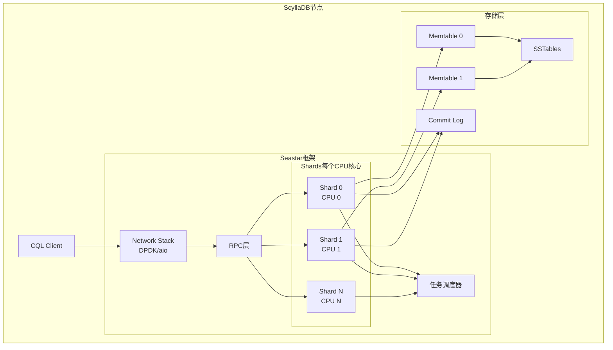
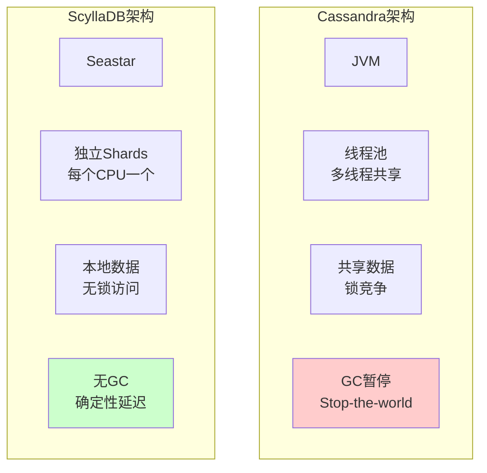
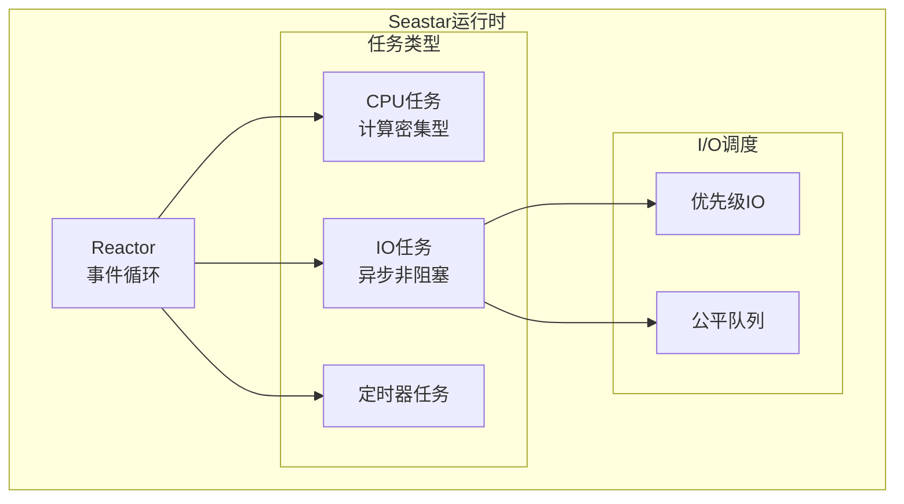
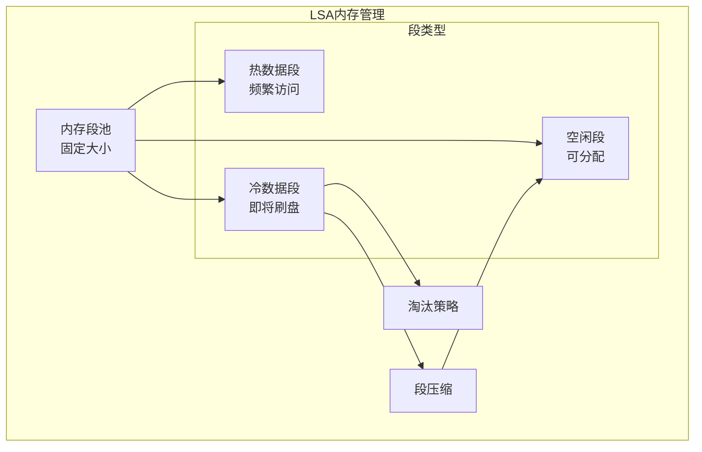
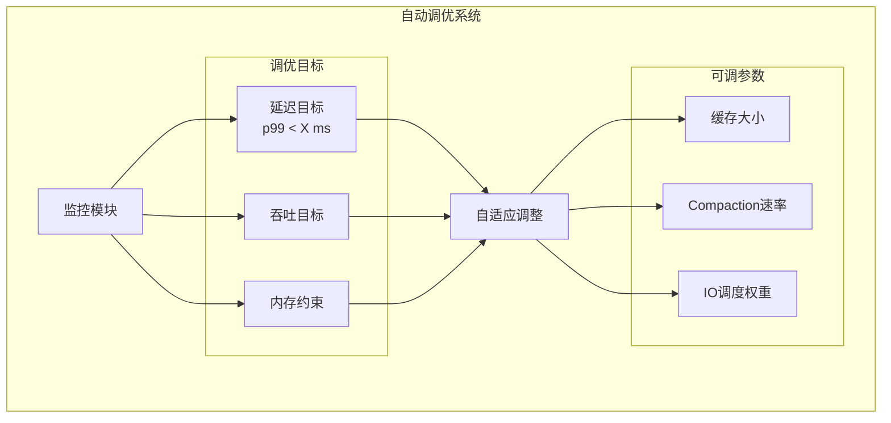
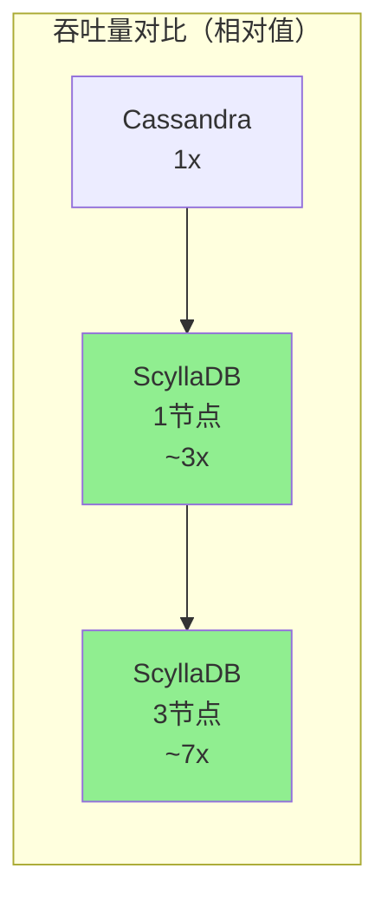

# ScyllaDB 专题文档

**文档版本**：v1.0
**创建时间**：2026年
**最后更新**：2026年
**状态**：✅ 已完成

---

## 📋 执行摘要

ScyllaDB是一个用C++重写的Cassandra兼容数据库，采用无共享线程架构（Shard-per-Core），实现亚毫秒级延迟和10倍于Cassandra的吞吐量，同时保持Cassandra的分布式特性。

---

## 一、核心概念

### 1.1 定义与原理

ScyllaDB是一个**高性能分布式NoSQL数据库**，其设计目标包括：
- **极致性能**：利用现代多核硬件的全部能力
- **Cassandra兼容**：完全兼容CQL和Cassandra协议
- **自动优化**：自适应配置和自动调优
- **更低成本**：使用更少节点处理相同负载

**核心架构创新**：
- 无共享线程架构（每个CPU核心独立运行）
- 用户空间任务调度（Seastar框架）
- 自调优的缓存和I/O调度
- C++实现消除GC暂停

### 1.2 关键特性

- **Shard-per-Core架构**：每个CPU核心独立处理数据分区
- **C++实现**：无JVM，无GC暂停
- **Seastar框架**：异步编程模型，零共享状态
- **自动调优**：根据硬件自动优化配置
- **Cassandra兼容**：无缝迁移，共享生态

### 1.3 适用场景

| 场景 | 适用性 | 说明 |
|------|--------|------|
| 高频交易 | ⭐⭐⭐⭐⭐ | 亚毫秒延迟 |
| 实时分析 | ⭐⭐⭐⭐⭐ | 高吞吐扫描 |
| 时序数据 | ⭐⭐⭐⭐⭐ | 高效写入和压缩 |
| IoT数据处理 | ⭐⭐⭐⭐⭐ | 海量设备写入 |
| Cassandra替换 | ⭐⭐⭐⭐⭐ | 直接替换，性能提升 |
| 复杂查询 | ⭐⭐⭐ | 仍需反规范化设计 |

---

## 二、技术细节

### 2.1 架构设计



**核心组件详解**：

| 组件 | 功能 | 特点 |
|------|------|------|
| Seastar | 异步C++框架 | 共享无状态，NUMA感知 |
| Shards | 数据分区单元 | 每个核心独立运行 |
| LSA | 日志结构化分配器 | 替代JVM GC的内存管理 |
| CommitLog | 预写日志 | 每个Shard独立 |
| Memtable | 内存写入缓冲 | 每个Shard独立 |

### 2.2 Shard-per-Core架构

#### 架构对比



**Shard设计细节**：

```cpp
// 伪代码示意
class shard {
private:
    // 每个Shard独立的数据结构
    memtable local_memtable;
    cache local_cache;
    commitlog local_commitlog;
    
    // 本地任务队列
    queue<task> task_queue;
    
public:
    // 处理属于本Shard的Token范围
    future<> query(token_range range) {
        // 无锁访问本地数据
        auto data = local_cache.get(range);
        if (!data) {
            data = co_await read_from_disk(range);
            local_cache.put(range, data);
        }
        co_return data;
    }
};
```

**Token到Shard映射**：

```
Token Ring (0 ~ 2^64-1)
├─ Shard 0: [0, T1)
├─ Shard 1: [T1, T2)
├─ Shard 2: [T2, T3)
...
└─ Shard N: [TN-1, 2^64)

跨Shard通信通过消息传递，避免共享内存
```

### 2.3 Seastar框架

#### 异步编程模型



**Seastar核心特性**：

| 特性 | 实现 | 效果 |
|------|------|------|
| Future/Promise | 异步编程 | 无回调地狱 |
| 共享无状态 | 每核独立 | 零锁竞争 |
| NUMA感知 | 内存本地化 | 减少跨NUMA访问 |
| DPDK支持 | 用户态网络 | 极低网络延迟 |
| 协作调度 | 无抢占 | 缓存友好 |

### 2.4 LSA内存管理

#### 日志结构化分配器



**LSA vs JVM GC**：

| 特性 | LSA (ScyllaDB) | JVM GC (Cassandra) |
|------|----------------|-------------------|
| 暂停时间 | <1ms（可预测） | 100ms-数秒 |
| 内存管理 | 分段分配 | 标记-清除/压缩 |
| 碎片化 | 段压缩处理 | GC压缩处理 |
| 调优复杂度 | 自动 | 需要专业调优 |
| 内存效率 | 高（无GC开销） | 中（需要GC预留） |

### 2.5 自调优机制



**自动调优参数**：

| 参数 | 调优策略 | 效果 |
|------|----------|------|
| 行缓存大小 | 基于命中率 | 优化读性能 |
| Compaction带宽 | 基于写入压力 | 平衡读写 |
| 内存配额 | 基于工作集 | 避免OOM |
| I/O调度 | 基于队列深度 | 优化磁盘使用 |

---

## 三、系统对比

### 3.1 ScyllaDB vs Cassandra

| 维度 | ScyllaDB | Cassandra |
|------|----------|-----------|
| **实现语言** | C++ | Java |
| **线程模型** | Shard-per-Core | 线程池共享 |
| **内存管理** | LSA（无GC） | JVM GC |
| **P99延迟** | <10ms | 50-200ms |
| **吞吐量** | 10x Cassandra | 基准 |
| **CPU利用率** | 100%（满核） | 通常30-50% |
| **延迟一致性** | 可预测 | 有GC暂停 |
| **自动调优** | 是 | 需手动 |
| **CQL兼容** | 100% | 原生 |
| **运维复杂度** | 低 | 中 |

### 3.2 性能基准对比



**典型性能数据**：

| 工作负载 | Cassandra | ScyllaDB | 提升 |
|----------|-----------|----------|------|
| 纯写入 | 100K/s | 1M+/s | 10x+ |
| 纯读取 | 150K/s | 1.5M+/s | 10x+ |
| 混合读写 | 80K/s | 800K+/s | 10x+ |
| P99写入延迟 | 50ms | 5ms | 10x |
| P99读取延迟 | 30ms | 3ms | 10x |

**硬件利用率对比**：

| 指标 | Cassandra | ScyllaDB |
|------|-----------|----------|
| CPU使用 | 30-50% | 90-100% |
| 内存效率 | 60-70% | 85-95% |
| I/O带宽 | 部分利用 | 完全利用 |
| 网络带宽 | 部分利用 | 完全利用 |

### 3.3 选型决策树

```
当前使用Cassandra？
├── 是
│   ├── 遇到GC暂停问题？
│   │   ├── 是 → 考虑迁移到ScyllaDB
│   │   └── 否 → 继续评估
│   ├── 需要更高吞吐量？
│   │   ├── 是 → ScyllaDB（更少节点）
│   │   └── 否 → 继续评估
│   └── 延迟敏感？
│       ├── 是 → ScyllaDB（亚毫秒）
│       └── 否 → Cassandra足够
└── 否
    ├── 极高性能要求？
    │   ├── 是 → ScyllaDB
    │   └── 否 → 评估其他选项
    └── 团队熟悉CQL？
        ├── 是 → ScyllaDB学习成本低
        └── 否 → 考虑其他NoSQL
```

---

## 四、实践指南

### 4.1 部署配置

#### scylla.yaml核心配置

```yaml
# /etc/scylla/scylla.yaml

# 集群配置
cluster_name: 'Production Cluster'
seeds: "10.0.1.1,10.0.1.2,10.0.1.3"
listen_address: 10.0.1.10
rpc_address: 10.0.1.10

# 自动调优（推荐启用）
auto_adjust_flame_graphs: true

# 开发模式（测试环境）
# developer_mode: true

# 数据目录
data_file_directories:
    - /var/lib/scylla/data

# CommitLog目录
commitlog_directory: /var/lib/scylla/commitlog

# 缓存配置（自动调优会覆盖）
row_cache_size_in_mb: 512
counter_cache_size_in_mb: 50

# Compaction配置
compaction_throughput_mb_per_sec: 256
concurrent_compactors: 2

# 网络
native_transport_port: 9042
rpc_port: 9160

# 安全
authenticator: PasswordAuthenticator
authorizer: CassandraAuthorizer
```

#### 系统优化脚本

```bash
#!/bin/bash
# ScyllaDB系统优化

# 1. 运行Scylla_setup
scylla_setup \
    --nic eth0 \
    --disks /dev/nvme0n1 \
    --setup-nic \
    --ntp-domain pool.ntp.org \
    --io-setup  # I/O调度优化

# 2. 启用性能模式
cpupower frequency-set -g performance

# 3. 调整内核参数
cat >> /etc/sysctl.conf << EOF
# ScyllaDB优化
fs.aio-max-nr = 1048576
net.ipv4.tcp_tw_reuse = 1
vm.dirty_ratio = 40
vm.dirty_background_ratio = 5
EOF
sysctl -p

# 4. 磁盘调度器（NVMe推荐none）
echo 'none' > /sys/block/nvme0n1/queue/scheduler

# 5. 透明大页（建议禁用）
echo 'never' > /sys/kernel/mm/transparent_hugepage/enabled
```

### 4.2 最佳实践

#### 1. 数据建模

```sql
-- 与Cassandra相同的最佳实践
-- 1. 查询驱动设计
CREATE KEYSPACE IF NOT EXISTS events
WITH replication = {
    'class': 'NetworkTopologyStrategy',
    'dc1': 3
};

-- 2. 避免大分区
CREATE TABLE IF NOT EXISTS events.sensor_data (
    sensor_id uuid,
    bucket text,  -- 分区键前缀避免热点
    timestamp timestamp,
    value double,
    PRIMARY KEY ((sensor_id, bucket), timestamp)
) WITH CLUSTERING ORDER BY (timestamp DESC)
  AND compaction = {'class': 'TimeWindowCompactionStrategy',
                    'compaction_window_unit': 'HOURS',
                    'compaction_window_size': 1};

-- 3. 使用物化视图（ScyllaDB 5.0+）
CREATE MATERIALIZED VIEW events.sensor_data_by_hour AS
    SELECT sensor_id, bucket, timestamp, value
    FROM events.sensor_data
    WHERE sensor_id IS NOT NULL 
      AND bucket IS NOT NULL 
      AND timestamp IS NOT NULL
    PRIMARY KEY ((bucket), timestamp, sensor_id)
    WITH CLUSTERING ORDER BY (timestamp DESC);
```

#### 2. 连接池配置

```python
# Python驱动配置示例
from cassandra.cluster import Cluster
from cassandra.policies import TokenAwarePolicy, DCAwareRoundRobinPolicy

cluster = Cluster(
    ['10.0.1.1', '10.0.1.2', '10.0.1.3'],
    load_balancing_policy=TokenAwarePolicy(
        DCAwareRoundRobinPolicy(local_dc='dc1')
    ),
    protocol_version=4,
    # ScyllaDB可以处理更多并发连接
    connections_per_host=8,  # 每个主机8个连接
    # 使用本地序列一致性
    consistency_level=ConsistencyLevel.LOCAL_QUORUM
)

session = cluster.connect()

# 使用PreparedStatement
prepared = session.prepare(
    "INSERT INTO events.sensor_data (sensor_id, bucket, timestamp, value) VALUES (?, ?, ?, ?)"
)

# 异步批量写入
from cassandra.concurrent import execute_concurrent
statements = [(prepared, (sensor_id, bucket, ts, val)) for ...]
results = execute_concurrent(session, statements, concurrency=100)
```

#### 3. 监控指标

| 指标 | 说明 | 告警阈值 |
|------|------|----------|
| `scylla_reactor_utilization` | CPU利用率 | > 90% |
| `scylla_storage_proxy_coordinator_read_latency` | 读延迟 | P99 > 10ms |
| `scylla_storage_proxy_coordinator_write_latency` | 写延迟 | P99 > 10ms |
| `scylla_memory_available_memory` | 可用内存 | < 10% |
| `scylla_compaction_manager_compactions` | Compaction积压 | > 50 |

### 4.3 常见问题

**Q1: 从Cassandra迁移到ScyllaDB的步骤？**
A:
```
1. 评估兼容性（CQL和驱动）
2. 使用sstableloader导入数据
3. 或者双写模式逐步迁移
4. 使用ScyllaDB Migrator工具
5. 验证数据一致性
6. 切换读取流量
```

**Q2: ScyllaDB节点CPU使用率低？**
A:
- 检查客户端连接是否足够
- 确认Token Awareness启用
- 检查是否跨Shard访问
- 查看是否有热点分区
- 调整`--smp`参数匹配CPU核心数

**Q3: 如何处理热点分区？**
A:
- 添加分区键前缀（如时间桶）
- 使用`cdc`（变更数据捕获）分散写入
- 启用`partition-key-index`（实验性）
- 增加Shard数量

**Q4: ScyllaDB集群扩容？**
A:
```bash
# 1. 启动新节点，加入集群
scylla --seeds existing_node_ip

# 2. 自动开始数据流式传输
# 使用nodetool监控进度
nodetool netstats

# 3. 运行cleanup（可选）
nodetool cleanup

# ScyllaDB扩容更快，占用更少资源
```

---

## 五、形式化分析

### 5.1 性能模型

**吞吐量分析**：
```
设：
- N = CPU核心数
- B = 内存带宽
- D = 磁盘IOPS
- L = 网络带宽

ScyllaDB吞吐量 = min(
    N × 单核处理能力,
    B / 每条记录内存访问,
    D × 批处理因子,
    L / 每条记录网络开销
) × 效率因子(0.9+)
```

**延迟分析**：
```
P99延迟 = P50延迟 + 尾延迟

ScyllaDB尾延迟来源：
- Compaction（可控，优先级可调）
- 磁盘刷新（异步，影响小）
- 网络抖动（DPDK可缓解）

Cassandra额外延迟来源：
- GC暂停（主要因素）
- 锁竞争
- 线程上下文切换
```

### 5.2 复杂度分析

| 操作 | 时间复杂度 | 说明 |
|------|-----------|------|
| 点查 | O(log M) | M为Memtable+SSTable数量 |
| 范围扫描 | O(log M + K) | K为结果数 |
| 写入 | O(log M) | 内存操作+顺序日志 |
| 跨Shard查询 | O(log M) + 网络 | 消息传递开销 |
| Compaction | O(N log N) | N为合并数据量 |

### 5.3 可用性分析

**故障恢复能力**：

| 故障类型 | 恢复机制 | RTO |
|----------|----------|-----|
| 单节点故障 | Hinted Handoff + Repair | 数秒 |
| 磁盘故障 | 数据复制到其他节点 | 自动 |
| 网络分区 | Gossip恢复 | 数秒 |

**Quorum机制**（与Cassandra相同）：
- 读/写需要QUORUM（R + W > N）保证一致性
- 支持可调一致性级别

---

## 六、与其他主题的关联

### 6.1 上游依赖

- [Seastar框架](https://seastar.io/) - 异步C++框架
- [一致性哈希](../replication/一致性哈希.md)
- [LSM-Tree存储引擎](../lsm-tree架构.md)
- [Cassandra架构](./Cassandra深度分析.md)

### 6.2 下游应用

- [时序数据库](../time-series/时序数据库.md)
- [实时分析系统](../../06-distributed-systems/realtime-analytics.md)
- [IoT平台](../../06-distributed-systems/iot-platform.md)

### 6.3 相关概念

| 概念 | 关系 | 说明 |
|------|------|------|
| Cassandra | 兼容/替代 | 完全CQL兼容 |
| Seastar | 依赖 | 底层异步框架 |
| DPDK | 可选依赖 | 用户态网络加速 |
| C++ | 实现 | 无GC高性能 |

---

## 七、参考资源

### 7.1 学术论文

1. [Speeding Up Your Storage: A Comprehensive Guide to ScyllaDB](https://www.scylladb.com/resources/whitepapers/) - ScyllaDB白皮书
2. [Seastar: A High-Performance Async IO Library](https://seastar.io/) - Seastar框架文档
3. [The Impact of Java Garbage Collection on Cassandra](https://www.scylladb.com/resources/cassandra-vs-scylla/) - GC影响分析

### 7.2 开源项目

1. [ScyllaDB](https://github.com/scylladb/scylla) - ScyllaDB核心源码
2. [Seastar](https://github.com/scylladb/seastar) - 异步C++框架
3. [ScyllaDB Operator](https://github.com/scylladb/scylla-operator) - K8s Operator

### 7.3 学习资料

1. [ScyllaDB官方文档](https://docs.scylladb.com/) - 完整技术文档
2. [ScyllaDB University](https://university.scylladb.com/) - 免费课程
3. [ScyllaDB vs Cassandra Benchmarks](https://www.scylladb.com/product/benchmarks/) - 性能对比

### 7.4 相关文档

- [Cassandra深度分析](./Cassandra深度分析.md)
- [NoSQL数据库对比](./nosql对比分析.md)
- [分布式存储选型](../分布式存储选型.md)

---

**维护者**：项目团队
**最后更新**：2026年
