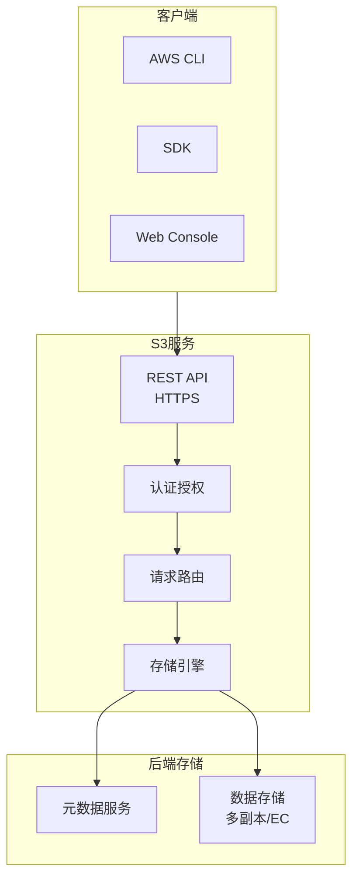
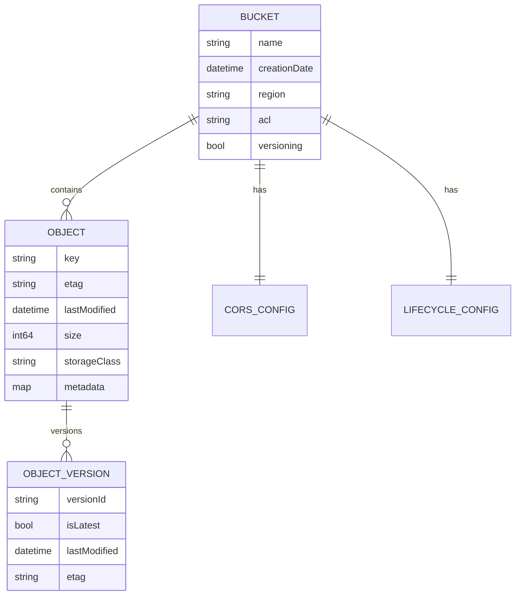
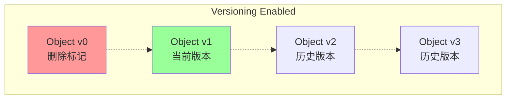
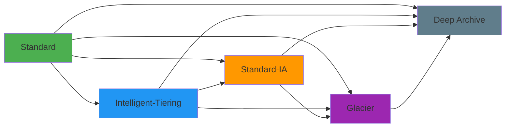
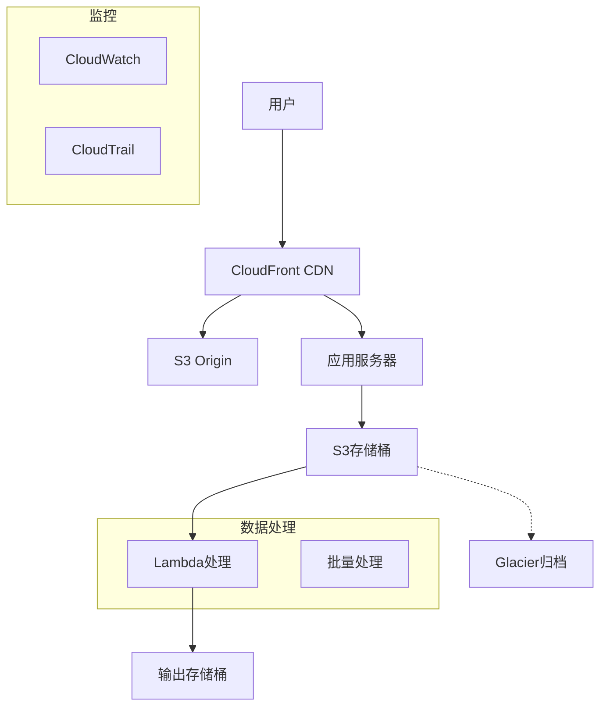
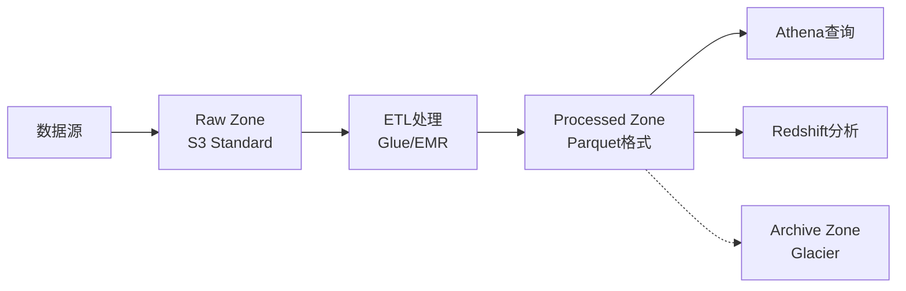

# OSS开放存储服务规范 专题文档

**文档版本**：v1.0
**创建时间**：2026年4月
**最后更新**：2026年4月
**状态**：🔄 编写中

---

## 📋 执行摘要

对象存储服务（Object Storage Service, OSS）是一种海量、安全、低成本、高可靠的云存储服务。本文档详细阐述S3 API标准、对象存储接口规范以及主流对象存储服务的兼容性实现，为开发跨平台兼容的对象存储应用提供参考。

---

## 一、核心概念

### 1.1 定义与原理

**对象存储（Object Storage）**是一种以对象为基本单元的数据存储架构，与传统文件系统和块存储相比具有以下特点：

- **对象（Object）**：数据的基本单元，包含数据本身、元数据和全局唯一标识符（Object Key）
- **存储桶（Bucket）**：对象的容器，用于组织和隔离数据
- **扁平命名空间**：无传统文件系统的目录层级，通过Key模拟层次结构
- **RESTful API**：通过HTTP/HTTPS协议访问

### 1.2 关键特性

| 特性 | 说明 |
|------|------|
| **海量存储** | 无容量上限，支持EB级数据 |
| **高可用** | 多副本/纠删码，99.999999999%（11个9）持久性 |
| **低成本** | 按量计费，冷热分层存储 |
| **安全性** | 支持加密、访问控制、版本控制 |
| **CDN集成** | 与内容分发网络无缝集成 |

### 1.3 适用场景

| 场景 | 适用性 | 说明 |
|------|--------|------|
| 图片/视频存储 | ⭐⭐⭐⭐⭐ | 静态资源托管，CDN加速 |
| 数据备份归档 | ⭐⭐⭐⭐⭐ | 冷数据长期保存 |
| 大数据分析 | ⭐⭐⭐⭐⭐ | 数据湖存储底座 |
| 日志存储 | ⭐⭐⭐⭐ | 低成本海量日志 |
| 应用数据存储 | ⭐⭐⭐ | 需配合数据库使用 |

---

## 二、S3 API标准

### 2.1 S3架构设计



### 2.2 核心API操作

#### 存储桶操作（Bucket Operations）

| 操作 | HTTP方法 | 描述 |
|------|----------|------|
| CreateBucket | PUT /{bucket} | 创建存储桶 |
| DeleteBucket | DELETE /{bucket} | 删除空存储桶 |
| ListBuckets | GET / | 列出所有存储桶 |
| GetBucketLocation | GET /{bucket}?location | 获取存储桶区域 |
| GetBucketVersioning | GET /{bucket}?versioning | 获取版本控制状态 |
| PutBucketVersioning | PUT /{bucket}?versioning | 设置版本控制 |
| GetBucketLifecycle | GET /{bucket}?lifecycle | 获取生命周期规则 |
| PutBucketLifecycle | PUT /{bucket}?lifecycle | 设置生命周期规则 |
| GetBucketCors | GET /{bucket}?cors | 获取CORS配置 |
| PutBucketCors | PUT /{bucket}?cors | 设置CORS配置 |

#### 对象操作（Object Operations）

| 操作 | HTTP方法 | 描述 |
|------|----------|------|
| PutObject | PUT /{bucket}/{key} | 上传对象 |
| GetObject | GET /{bucket}/{key} | 下载对象 |
| DeleteObject | DELETE /{bucket}/{key} | 删除对象 |
| DeleteObjects | POST /{bucket}?delete | 批量删除 |
| ListObjects | GET /{bucket} | 列出对象 |
| ListObjectsV2 | GET /{bucket}?list-type=2 | 列出对象（V2） |
| HeadObject | HEAD /{bucket}/{key} | 获取元数据 |
| CopyObject | PUT /{bucket}/{key} + x-amz-copy-source | 复制对象 |
| InitiateMultipartUpload | POST /{bucket}/{key}?uploads | 初始化分片上传 |
| UploadPart | PUT /{bucket}/{key}?partNumber | 上传分片 |
| CompleteMultipartUpload | POST /{bucket}/{key}?uploadId | 完成分片上传 |
| AbortMultipartUpload | DELETE /{bucket}/{key}?uploadId | 中止分片上传 |

### 2.3 请求签名机制

#### AWS Signature Version 4

```
Authorization: AWS4-HMAC-SHA256
    Credential={access-key}/{date}/{region}/s3/aws4_request,
    SignedHeaders={signed-headers},
    Signature={signature}

签名计算步骤：
1. 创建规范请求（Canonical Request）
2. 创建待签名字符串（String to Sign）
3. 计算签名密钥（Signing Key）
4. 计算最终签名（Signature）
```

#### 预签名URL

```python
import boto3
from botocore.exceptions import ClientError

def generate_presigned_url(bucket_name, object_name, expiration=3600):
    s3_client = boto3.client('s3')
    try:
        url = s3_client.generate_presigned_url(
            'get_object',
            Params={'Bucket': bucket_name, 'Key': object_name},
            ExpiresIn=expiration
        )
    except ClientError as e:
        return None
    return url
```

### 2.4 S3数据模型



---

## 三、对象存储接口

### 3.1 REST API规范

#### 标准请求头

| 请求头 | 说明 | 示例 |
|--------|------|------|
| Authorization | 认证信息 | AWS4-HMAC-SHA256 ... |
| Content-Type | 内容类型 | application/json |
| Content-Length | 内容长度 | 1024 |
| Content-MD5 | 内容MD5校验 | 1B2M2Y8AsgTpgAmY7PhCfg== |
| x-amz-content-sha256 | 内容SHA256 | STREAMING-AWS4-HMAC-SHA256-PAYLOAD |
| x-amz-storage-class | 存储类型 | STANDARD, GLACIER |
| x-amz-server-side-encryption | 加密方式 | AES256, aws:kms |
| x-amz-meta-* | 用户自定义元数据 | x-amz-meta-author: John |

#### 标准响应头

| 响应头 | 说明 | 示例 |
|--------|------|------|
| x-amz-request-id | 请求ID | 0A49CE4060975EAC |
| x-amz-id-2 | 扩展请求ID | sgVb5... |
| x-amz-version-id | 版本ID | 3HL4kqtJ... |
| ETag | 实体标签 | "d41d8cd98f00b204e9800998ecf8427e" |
| Last-Modified | 最后修改时间 | Wed, 12 Oct 2026 09:00:00 GMT |
| Content-Length | 内容长度 | 1024 |

### 3.2 多版本控制



**版本控制状态**：

- **Disabled（默认）**：新对象覆盖旧对象
- **Enabled**：保留所有版本，删除创建删除标记
- **Suspended**：暂停版本控制，但保留已有版本

### 3.3 生命周期管理

```xml
<?xml version="1.0" encoding="UTF-8"?>
<LifecycleConfiguration xmlns="http://s3.amazonaws.com/doc/2006-03-01/">
    <Rule>
        <ID>logs-rule</ID>
        <Status>Enabled</Status>
        <Filter>
            <Prefix>logs/</Prefix>
        </Filter>
        <Transition>
            <Days>30</Days>
            <StorageClass>STANDARD_IA</StorageClass>
        </Transition>
        <Transition>
            <Days>90</Days>
            <StorageClass>GLACIER</StorageClass>
        </Transition>
        <Expiration>
            <Days>365</Days>
        </Expiration>
    </Rule>
</LifecycleConfiguration>
```

### 3.4 事件通知

```json
{
  "Records": [{
    "eventVersion": "2.1",
    "eventSource": "aws:s3",
    "awsRegion": "us-east-1",
    "eventTime": "2026-04-03T19:00:00.000Z",
    "eventName": "ObjectCreated:Put",
    "s3": {
      "bucket": {
        "name": "my-bucket",
        "arn": "arn:aws:s3:::my-bucket"
      },
      "object": {
        "key": "uploads/image.jpg",
        "size": 1024,
        "eTag": "d41d8cd98f00b204e9800998ecf8427e"
      }
    }
  }]
}
```

---

## 四、存储类型与分层

### 4.1 AWS S3存储类型

| 存储类型 | 适用场景 | 可用性 | 最小存储时间 | 检索费用 |
|----------|----------|--------|--------------|----------|
| **S3 Standard** | 频繁访问数据 | 99.99% | 无 | 无 |
| **S3 Intelligent-Tiering** | 访问模式未知 | 99.9% | 无 | 无 |
| **S3 Standard-IA** | 不频繁访问 | 99.9% | 30天 | 有 |
| **S3 One Zone-IA** | 非关键数据 | 99.5% | 30天 | 有 |
| **S3 Glacier** | 归档存储 | 99.99% | 90天 | 有 |
| **S3 Glacier Deep Archive** | 长期归档 | 99.99% | 180天 | 有 |

### 4.2 存储类型转换



---

## 五、兼容性实现

### 5.1 主流对象存储对比

| 特性 | AWS S3 | 阿里云OSS | 腾讯云COS | MinIO | Ceph |
|------|--------|-----------|-----------|-------|------|
| **S3兼容度** | 100% | 高 | 高 | 高 | 中 |
| **自有API** | - | 有 | 有 | 无 | 有 |
| **多AZ** | ✅ | ✅ | ✅ | 需配置 | 需配置 |
| **WORM** | ✅ | ✅ | ✅ | ✅ | ✅ |
| **对象锁定** | ✅ | ✅ | ✅ | ✅ | ❌ |
| **分批上传** | ✅ | ✅ | ✅ | ✅ | ✅ |
| **服务端加密** | ✅ | ✅ | ✅ | ✅ | ✅ |

### 5.2 阿里云OSS兼容说明

#### 兼容的S3 API

| 操作 | 兼容状态 | 说明 |
|------|----------|------|
| 基础对象操作 | ✅ 完全兼容 | PutObject, GetObject, DeleteObject |
| 分片上传 | ✅ 完全兼容 | Multipart Upload |
| 存储桶操作 | ⚠️ 部分兼容 | 部分Header不支持 |
| ACL操作 | ⚠️ 部分兼容 | 权限模型有差异 |
| 版本控制 | ✅ 兼容 | 完全支持 |
| 生命周期 | ⚠️ 部分兼容 | 规则格式略有不同 |

#### OSS特有功能

```java
// OSS Java SDK示例
import com.aliyun.oss.OSS;
import com.aliyun.oss.OSSClientBuilder;

public class OssExample {
    public static void main(String[] args) {
        String endpoint = "https://oss-cn-hangzhou.aliyuncs.com";
        String accessKeyId = "yourAccessKeyId";
        String accessKeySecret = "yourAccessKeySecret";

        OSS ossClient = new OSSClientBuilder()
            .build(endpoint, accessKeyId, accessKeySecret);

        // 上传文件
        ossClient.putObject("my-bucket", "my-object",
            new FileInputStream("local-file.txt"));

        // 图片处理
        String style = "image/resize,m_fixed,w_100,h_100";
        GetObjectRequest request = new GetObjectRequest("my-bucket", "image.jpg");
        request.setProcess(style);
        OSSObject processed = ossClient.getObject(request);

        ossClient.shutdown();
    }
}
```

### 5.3 MinIO部署与配置

#### Docker部署

```yaml
# docker-compose.yml
version: '3'
services:
  minio:
    image: minio/minio:latest
    ports:
      - "9000:9000"
      - "9001:9001"
    environment:
      MINIO_ROOT_USER: minioadmin
      MINIO_ROOT_PASSWORD: minioadmin
    volumes:
      - ./data:/data
    command: server /data --console-address ":9001"
```

#### 客户端配置

```bash
# 配置mc客户端
mc alias set local http://localhost:9000 minioadmin minioadmin

# 创建存储桶
mc mb local/my-bucket

# 设置公开访问
mc anonymous set public local/my-bucket

# 同步本地目录
mc mirror /local/data local/my-bucket
```

### 5.4 跨平台SDK适配

#### Python (boto3)

```python
import boto3
from botocore.config import Config

# AWS S3
s3 = boto3.client('s3')

# 阿里云OSS（S3兼容模式）
oss = boto3.client(
    's3',
    endpoint_url='https://oss-cn-hangzhou.aliyuncs.com',
    aws_access_key_id='your-access-key',
    aws_secret_access_key='your-secret-key',
    config=Config(s3={'addressing_style': 'virtual'})
)

# MinIO
minio = boto3.client(
    's3',
    endpoint_url='http://localhost:9000',
    aws_access_key_id='minioadmin',
    aws_secret_access_key='minioadmin',
    config=Config(signature_version='s3v4')
)

# 统一接口操作
for client in [s3, oss, minio]:
    response = client.list_buckets()
    print([b['Name'] for b in response['Buckets']])
```

#### Go

```go
package main

import (
    "context"
    "fmt"
    "github.com/minio/minio-go/v7"
    "github.com/minio/minio-go/v7/pkg/credentials"
)

func main() {
    // 支持S3兼容服务
    minioClient, err := minio.New("localhost:9000", &minio.Options{
        Creds:  credentials.NewStaticV4("minioadmin", "minioadmin", ""),
        Secure: false,
    })
    if err != nil {
        panic(err)
    }

    // 创建存储桶
    ctx := context.Background()
    err = minioClient.MakeBucket(ctx, "mybucket", minio.MakeBucketOptions{})

    // 上传文件
    _, err = minioClient.FPutObject(ctx, "mybucket", "object",
        "/path/to/file", minio.PutObjectOptions{})

    fmt.Println("Success")
}
```

---

## 六、性能优化与最佳实践

### 6.1 上传优化

| 场景 | 推荐方式 | 说明 |
|------|----------|------|
| 小文件(<5MB) | 单文件上传 | 简单直接 |
| 大文件(>5MB) | 分片上传 | 支持断点续传，并行上传 |
| 海量小文件 | 打包上传 | 减少请求次数 |
| 流式数据 | 流式上传 | 边生成边上传 |

#### 分片上传示例

```python
import boto3
from boto3.s3.transfer import TransferConfig

s3 = boto3.client('s3')

# 配置分片上传参数
config = TransferConfig(
    multipart_threshold=1024 * 25,  # 25MB启用分片
    max_concurrency=10,              # 最大并发数
    multipart_chunksize=1024 * 25,   # 分片大小25MB
    use_threads=True
)

# 上传大文件
s3.upload_file(
    'large-file.zip',
    'my-bucket',
    'large-file.zip',
    Config=config
)
```

### 6.2 下载优化

| 技术 | 适用场景 | 效果 |
|------|----------|------|
| **Range下载** | 部分下载、断点续传 | 减少流量 |
| **预签名URL** | 临时访问授权 | 安全分发 |
| **CDN加速** | 热点内容分发 | 降低延迟 |
| **Transfer Acceleration** | 跨国传输 | 提升速度 |

### 6.3 访问模式优化

```
访问频率
├── 高频访问 (>1次/天)
│   └── S3 Standard + CloudFront CDN
├── 中频访问 (1次/周-1次/天)
│   └── S3 Intelligent-Tiering
├── 低频访问 (1次/月-1次/周)
│   └── S3 Standard-IA
├── 归档访问 (<1次/月)
│   └── S3 Glacier Instant Retrieval
└── 深度归档 (极少访问)
    └── S3 Glacier Deep Archive
```

### 6.4 安全最佳实践

1. **最小权限原则**

   ```json
   {
     "Version": "2012-10-17",
     "Statement": [{
       "Effect": "Allow",
       "Action": ["s3:GetObject"],
       "Resource": "arn:aws:s3:::my-bucket/uploads/*",
       "Condition": {
         "IpAddress": {"aws:SourceIp": "10.0.0.0/8"}
       }
     }]
   }
   ```

2. **加密传输与存储**
   - 强制HTTPS：Bucket Policy拒绝HTTP请求
   - 服务端加密：SSE-S3、SSE-KMS、SSE-C
   - 客户端加密：敏感数据客户端先加密

3. **版本控制与MFA删除**
   - 启用版本控制防止误删
   - MFA Delete保护关键操作

4. **访问日志与监控**
   - 启用Server Access Logging
   - CloudTrail记录API调用
   - CloudWatch监控指标

---

## 七、实践指南

### 7.1 典型架构



### 7.2 静态网站托管

```yaml
# S3静态网站配置
Resources:
  WebsiteBucket:
    Type: AWS::S3::Bucket
    Properties:
      BucketName: my-static-website
      WebsiteConfiguration:
        IndexDocument: index.html
        ErrorDocument: error.html
      PublicAccessBlockConfiguration:
        BlockPublicAcls: false
        BlockPublicPolicy: false
      VersioningConfiguration:
        Status: Enabled
```

### 7.3 数据湖架构



### 7.4 常见问题

**Q1: 如何处理同名文件覆盖？**
A: 启用版本控制，或使用唯一命名（UUID/时间戳+随机数）。

**Q2: 如何限制文件上传大小？**
A: 使用Bucket Policy配合Content-Length条件，或在应用层控制。

**Q3: 如何监控存储成本？**
A: 启用S3 Storage Lens，设置预算告警，定期清理过期数据。

**Q4: 跨Region复制如何配置？**
A: 使用S3 Cross-Region Replication（CRR），需启用版本控制。

---

## 八、与其他主题的关联

### 8.1 上游依赖

- [云原生标准](./云原生标准.md) - 容器存储接口

### 8.2 下游应用

- 大数据处理
- 内容分发系统
- 备份归档系统

### 8.3 相关概念

| 概念 | 关系 | 说明 |
|------|------|------|
| CDN | 配合 | 加速对象访问 |
| 数据湖 | 基础 | 对象存储是数据湖底座 |
| 无服务器 | 触发源 | S3事件触发Lambda |

---

## 九、参考资源

### 9.1 官方文档

1. [Amazon S3 API Reference](https://docs.aws.amazon.com/AmazonS3/latest/API/Welcome.html) - AWS官方API文档
2. [阿里云OSS API文档](https://help.aliyun.com/product/31815.html) - 阿里云OSS
3. [腾讯云COS API文档](https://cloud.tencent.com/document/product/436) - 腾讯云COS
4. [MinIO Documentation](https://min.io/docs/minio/linux/index.html) - MinIO官方文档

### 9.2 开源项目

1. [MinIO](https://github.com/minio/minio) - 高性能对象存储
2. [Ceph](https://github.com/ceph/ceph) - 分布式存储系统
3. [SeaweedFS](https://github.com/seaweedfs/seaweedfs) - 简单分布式存储
4. [Garage](https://github.com/deuxfleurs-org/garage) - 轻量级对象存储

### 9.3 学习资料

1. [S3 Best Practices](https://docs.aws.amazon.com/AmazonS3/latest/userguide/best-practices.html) - AWS最佳实践
2. [Object Storage for Cloud-Native Applications](https://www.cncf.io/reports/object-storage-for-cloud-native-applications/) - CNCF报告

---

**维护者**：项目团队
**最后更新**：2026年4月
