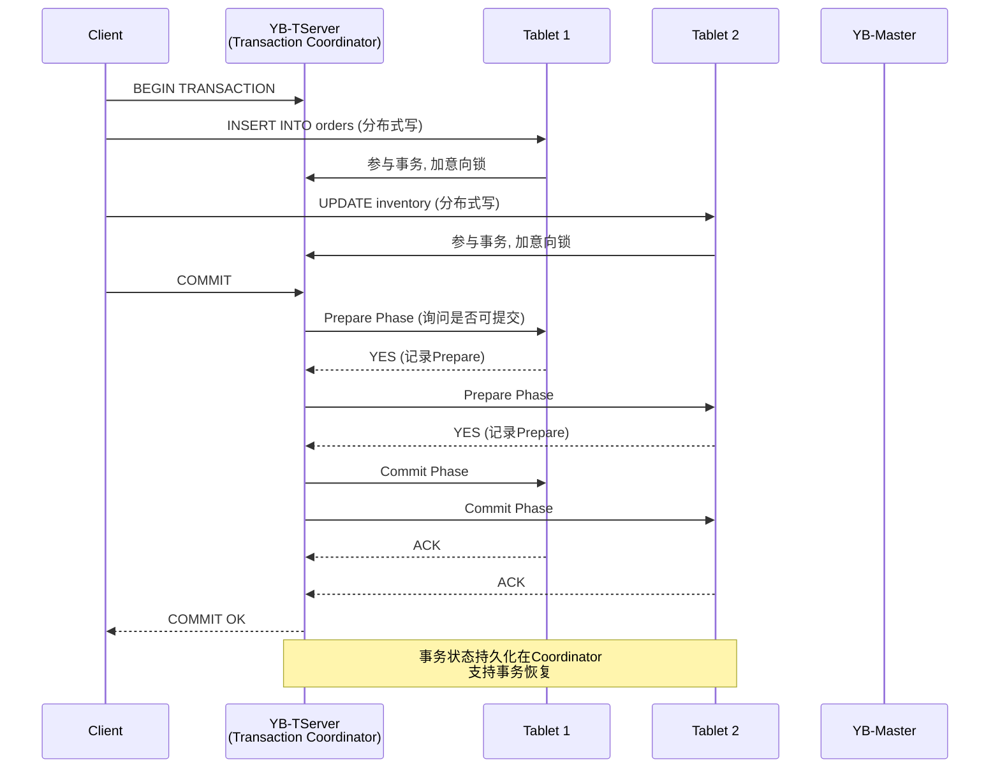

# YugabyteDB 分布式SQL数据库架构深度解析

**文档版本**：v1.0
**创建时间**：2026年4月
**最后更新**：2026年4月
**状态**：✅ 已完成

---

## 📋 执行摘要

YugabyteDB是一个开源的分布式SQL数据库，基于Google Spanner架构设计，提供PostgreSQL兼容的SQL层和基于Raft共识协议的分布式事务引擎。它实现了全球分布式部署、强一致性复制和水平扩展能力，是NewSQL数据库阵营的重要成员，适用于需要关系型语义和云原生扩展性的企业级应用。

---

## 一、整体架构设计

### 1.1 分层架构

YugabyteDB采用经典的分层架构设计，将查询层、事务层和存储层分离，每层都可独立扩展。

```
┌─────────────────────────────────────────────────────────────────────────────┐
│                    YugabyteDB 分层架构                                       │
├─────────────────────────────────────────────────────────────────────────────┤
│                                                                             │
│  ┌─────────────────────────────────────────────────────────────────────┐   │
│  │  Layer 1: YSQL / YCQL (查询层)                                       │   │
│  │  ┌─────────────────┐  ┌─────────────────┐  ┌─────────────────────┐  │   │
│  │  │   YSQL API      │  │   YCQL API      │  │   Redis-Compatible  │  │   │
│  │  │   (PostgreSQL)  │  │   (Cassandra)   │  │   YEDIS API         │  │   │
│  │  │                 │  │                 │  │                     │  │   │
│  │  │ • ACID事务       │  │ • 灵活Schema    │  │ • 键值操作          │  │   │
│  │  │ • JOIN/子查询    │  │ • 集合类型      │  │ • 过期时间          │  │   │
│  │  │ • 存储过程       │  │ • 时间序列      │  │ • 发布订阅          │  │   │
│  │  └────────┬────────┘  └────────┬────────┘  └──────────┬──────────┘  │   │
│  │           │                    │                     │             │   │
│  │           └────────────────────┴─────────────────────┘             │   │
│  │                          ↓                                         │   │
│  └─────────────────────────────────────────────────────────────────────┘   │
│                                    │                                        │
│  ┌─────────────────────────────────────────────────────────────────────┐   │
│  │  Layer 2: DocDB (分布式文档存储层)                                   │   │
│  │                                                                     │   │
│  │  ┌─────────────────┐  ┌─────────────────┐  ┌─────────────────────┐  │   │
│  │  │   分布式事务     │  │   Raft复制       │  │   存储引擎          │  │   │
│  │  │   管理器         │  │   管理器         │  │   (RocksDB)         │  │   │
│  │  │                 │  │                 │  │                     │  │   │
│  │  │ • 2PC分布式事务 │  │ • Leader选举    │  │ • LSM-Tree          │  │   │
│  │  │ • 乐观/悲观锁   │  │ • 日志复制      │  │ • 列族存储          │  │   │
│  │  │ • MVCC版本控制  │  │ • 副本管理      │  │ • SST文件           │  │   │
│  │  └─────────────────┘  └─────────────────┘  └─────────────────────┘  │   │
│  │                                                                     │   │
│  └─────────────────────────────────────────────────────────────────────┘   │
│                                    │                                        │
│  ┌─────────────────────────────────────────────────────────────────────┐   │
│  │  Layer 3: YB-Master (元数据管理层)                                   │   │
│  │                                                                     │   │
│  │  ┌─────────────────┐  ┌─────────────────┐  ┌─────────────────────┐  │   │
│  │  │   元数据存储     │  │   负载均衡       │  │   集群协调          │  │   │
│  │  │                 │  │                 │  │                     │  │   │
│  │  │ • Table/Tablet  │  │ • Tablet分布    │  │ • 集群成员管理       │  │   │
│  │  │   元数据         │  │ • Leader均衡    │  │ • DDL操作           │  │   │
│  │  │ • 分区方案       │  │ • 副本重新分配   │  │ • 系统表管理        │  │   │
│  │  └─────────────────┘  └─────────────────┘  └─────────────────────┘  │   │
│  │                                                                     │   │
│  └─────────────────────────────────────────────────────────────────────┘   │
│                                                                             │
└─────────────────────────────────────────────────────────────────────────────┘
```

### 1.2 数据分布与Tablet架构

YugabyteDB通过Tablet实现数据的水平分区，每个Tablet是一个Raft复制组。

```
┌─────────────────────────────────────────────────────────────────────────────┐
│                    Tablet 数据分布架构                                       │
├─────────────────────────────────────────────────────────────────────────────┤
│                                                                             │
│   表 (Table): users                                                          │
│   分区键: user_id (Hash分区)                                                 │
│   Tablet数量: 16 (默认)                                                      │
│                                                                             │
│   ┌───────────────────────────────────────────────────────────────────────┐ │
│   │  Tablet 0 (Hash: 0-1023)                                             │ │
│   │  ┌─────────┐  ┌─────────┐  ┌─────────┐                               │ │
│   │  │ Leader  │  │ Follower│  │ Follower│   ← Raft复制组 (RF=3)          │ │
│   │  │ Node A  │  │ Node B  │  │ Node C  │                               │ │
│   │  │(Primary)│  │(Secondary)│ │(Secondary)│                              │ │
│   │  └─────────┘  └─────────┘  └─────────┘                               │ │
│   └───────────────────────────────────────────────────────────────────────┘ │
│                                                                             │
│   ┌───────────────────────────────────────────────────────────────────────┐ │
│   │  Tablet 1 (Hash: 1024-2047)                                          │ │
│   │  ┌─────────┐  ┌─────────┐  ┌─────────┐                               │ │
│   │  │ Leader  │  │ Follower│  │ Follower│                               │ │
│   │  │ Node B  │  │ Node C  │  │ Node D  │                               │ │
│   │  └─────────┘  └─────────┘  └─────────┘                               │ │
│   └───────────────────────────────────────────────────────────────────────┘ │
│                                                                             │
│   ┌───────────────────────────────────────────────────────────────────────┐ │
│   │  Tablet 2-15 ... (类似分布)                                           │ │
│   └───────────────────────────────────────────────────────────────────────┘ │
│                                                                             │
│   特性:                                                                      │
│   • 每个Tablet是独立Raft复制组                                               │
│   • Leader分布在不同节点实现负载均衡                                          │
│   • 数据自动重新均衡 (Rebalancing)                                           │
│   • 在线添加/删除节点自动迁移Tablet                                          │
│                                                                             │
└─────────────────────────────────────────────────────────────────────────────┘
```

---

## 二、Raft分布式事务实现

### 2.1 Raft共识协议应用

YugabyteDB使用Raft协议实现数据副本间的强一致性复制。

```
┌─────────────────────────────────────────────────────────────────────────────┐
│                    Raft 复制协议详解                                         │
├─────────────────────────────────────────────────────────────────────────────┤
│                                                                             │
│   Raft 状态机:                                                               │
│                                                                             │
│   ┌─────────────┐     ┌─────────────┐     ┌─────────────┐                  │
│   │  Leader     │────►│  Follower   │     │  Follower   │                  │
│   │  (主副本)   │     │  (从副本1)   │     │  (从副本2)   │                  │
│   └──────┬──────┘     └──────┬──────┘     └──────┬──────┘                  │
│          │                   │                   │                          │
│          │  AppendEntries    │                   │                          │
│          ├──────────────────►│                   │                          │
│          │ (包含日志条目)      │                   │                          │
│          │                   │                   │                          │
│          │   Heartbeat       │                   │                          │
│          │◄──────────────────┤                   │                          │
│          │                   │                   │                          │
│          │  AppendEntries    │                   │                          │
│          ├───────────────────┼──────────────────►│                          │
│          │                   │                   │                          │
│          │   Heartbeat       │                   │                          │
│          │◄──────────────────┼───────────────────┤                          │
│          │                   │                   │                          │
│                                                                             │
│   写入流程 (RF=3, 需要2个Follower确认):                                      │
│   ┌─────────┐    ┌─────────┐    ┌─────────┐    ┌─────────┐                 │
│   │ Client  │───►│ Leader  │───►│ Follower│    │ Follower│                 │
│   │ 写入请求 │    │ 接收请求 │    │ 1确认    │    │ 2确认    │                 │
│   └─────────┘    └────┬────┘    └─────────┘    └─────────┘                 │
│                       │                                                     │
│                       ▼                                                     │
│                  ┌─────────┐                                               │
│                  │ 返回成功 │ (多数派确认后)                                   │
│                  └────┬────┘                                               │
│                       │                                                     │
│                  ┌─────────┐                                               │
│                  │ 异步应用到 │                                               │
│                  │ 状态机    │                                               │
│                  └─────────┘                                               │
│                                                                             │
│   配置参数:                                                                  │
│   • replication_factor: 3 (默认)                                            │
│   • leader_lease_duration_ms: 2000                                          │
│   • raft_heartbeat_interval_ms: 500                                         │
│                                                                             │
└─────────────────────────────────────────────────────────────────────────────┘
```

### 2.2 分布式事务实现

YugabyteDB支持跨Tablet的ACID分布式事务，采用两阶段提交(2PC)协议。



### 2.3 MVCC并发控制

YugabyteDB使用多版本并发控制(MVCC)实现高并发读写。

```
┌─────────────────────────────────────────────────────────────────────────────┐
│                    MVCC 多版本并发控制                                       │
├─────────────────────────────────────────────────────────────────────────────┤
│                                                                             │
│   时间线 →                                                                  │
│                                                                             │
│   T1: [BEGIN TRANSACTION @ HybridTime=100]                                  │
│       UPDATE users SET balance = 100 WHERE id = 1                           │
│       │                                                                     │
│       ▼                                                                     │
│   ┌───────────────────────────────────────────────────────────────────────┐ │
│   │  存储记录 (Key-Value + 版本时间戳)                                     │ │
│   │                                                                       │ │
│   │  Key: (user_id=1, column=balance)                                     │ │
│   │                                                                       │ │
│   │  Value @ HT=200: [100]  ← T1写入 (未提交, 意向记录)                    │ │
│   │  Value @ HT=100: [50]   ← 历史版本                                    │ │
│   │  Value @ HT=50:  [100]  ← 更旧版本                                    │ │
│   │                                                                       │ │
│   └───────────────────────────────────────────────────────────────────────┘ │
│                                                                             │
│   T2: [BEGIN TRANSACTION @ HybridTime=150] (快照读)                          │
│       SELECT balance FROM users WHERE id = 1                                │
│       │                                                                     │
│       ▼                                                                     │
│       读取到 HT=100 的版本: balance = 50 (看不到T1的未提交数据)               │
│                                                                             │
│   T3: [BEGIN TRANSACTION @ HybridTime=250] (提交后读)                        │
│       SELECT balance FROM users WHERE id = 1                                │
│       │                                                                     │
│       ▼                                                                     │
│       T1已提交, 读取到 HT=200 的版本: balance = 100                          │
│                                                                             │
│   HybridTime = 物理时间(48位) + 逻辑时间(16位)                               │
│   提供全局有序的时间戳, 支持因果一致性                                        │
│                                                                             │
└─────────────────────────────────────────────────────────────────────────────┘
```

---

## 三、PostgreSQL兼容性

### 3.1 查询层实现

YugabyteDB的YSQL层基于PostgreSQL 11/13的查询引擎，实现了高度兼容。

```
┌─────────────────────────────────────────────────────────────────────────────┐
│                    YSQL PostgreSQL兼容架构                                   │
├─────────────────────────────────────────────────────────────────────────────┤
│                                                                             │
│   ┌───────────────────────────────────────────────────────────────────────┐ │
│   │  PostgreSQL Frontend                                                  │ │
│   │  ┌─────────────┐  ┌─────────────┐  ┌─────────────┐  ┌─────────────┐  │ │
│   │  │   Parser    │──►│  Analyzer   │──►│  Rewriter   │──►│  Planner    │  │ │
│   │  │  (语法解析)  │   │  (语义分析)  │   │  (查询重写)  │   │  (执行计划)  │  │ │
│   │  └─────────────┘  └─────────────┘  └─────────────┘  └──────┬──────┘  │ │
│   │                                                              │        │ │
│   │  ┌──────────────────────────────────────────────────────────┘        │ │
│   │  │  ┌───────────────────────────────────────────────────────────────┐│ │
│   │  └──►│                   YB Query Layer                            ││ │
│   │     │  ┌─────────────┐  ┌─────────────┐  ┌─────────────────────────┐│ │
│   │     │  │ DocDB PgGate│  │ 分布式执行  │  │  跨Tablet数据聚合        ││ │
│   │     │  │  (API网关)   │──►│ 计划生成   │──►│  (Distributed Aggr)     ││ │
│   │     │  └─────────────┘  └─────────────┘  └─────────────────────────┘│ │
│   │     └───────────────────────────────────────────────────────────────┘│ │
│   │                              │                                        │ │
│   │                              ▼                                        │ │
│   │  ┌────────────────────────────────────────────────────────────────┐  │ │
│   │  │                      DocDB Storage Layer                        │  │ │
│   │  │  ┌─────────────┐  ┌─────────────┐  ┌─────────────────────────┐ │  │ │
│   │  │  │  Tablet 0   │  │  Tablet 1   │  │  Tablet N ...           │ │  │ │
│   │  │  │ (Raft Group)│  │ (Raft Group)│  │ (Raft Group)            │ │  │ │
│   │  │  └─────────────┘  └─────────────┘  └─────────────────────────┘ │  │ │
│   │  └────────────────────────────────────────────────────────────────┘  │ │
│   └───────────────────────────────────────────────────────────────────────┘ │
│                                                                             │
│   兼容性:                                                                    │
│   • SQL语法: 95%+ 兼容 PostgreSQL                                           │
│   • 数据类型: 完全支持 (包括JSONB, ARRAY, UUID等)                            │
│   • 索引类型: B-tree, Hash, Gin, Partial, Expression indexes              │
│   • 扩展: 支持 pg_stat_statements, uuid-ossp, pgcrypto等                   │
│                                                                             │
└─────────────────────────────────────────────────────────────────────────────┘
```

### 3.2 兼容性与限制

```
┌─────────────────────────────────────────────────────────────────────────────┐
│                    YSQL 兼容性矩阵                                          │
├─────────────────────────────────────────────────────────────────────────────┤
│  功能类别           │ 兼容状态 │ 说明                                        │
├─────────────────────────────────────────────────────────────────────────────┤
│  DDL                │          │                                             │
│  - CREATE TABLE     │    ✅    │ 完全支持, 含分区表                           │
│  - CREATE INDEX     │    ✅    │ 支持, 在线创建                               │
│  - ALTER TABLE      │    ✅    │ 大多数操作支持                               │
│  - DROP/TRUNCATE    │    ✅    │ 完全支持                                     │
├─────────────────────────────────────────────────────────────────────────────┤
│  DML                │          │                                             │
│  - INSERT/UPDATE    │    ✅    │ 完全支持                                     │
│  - DELETE           │    ✅    │ 完全支持                                     │
│  - UPSERT/ON CONFLICT│   ✅    │ 完全支持                                     │
├─────────────────────────────────────────────────────────────────────────────┤
│  查询功能            │          │                                             │
│  - JOIN             │    ✅    │ 所有JOIN类型                                │
│  - 子查询           │    ✅    │ 完全支持                                     │
│  - CTE (WITH)       │    ✅    │ 递归CTE支持                                  │
│  - 窗口函数         │    ✅    │ 完全支持                                     │
│  - 聚合函数         │    ✅    │ 完全支持                                     │
├─────────────────────────────────────────────────────────────────────────────┤
│  事务                │          │                                             │
│  - ACID事务         │    ✅    │ 完全支持                                     │
│  - 隔离级别         │    ✅    │ Snapshot, Serializable                      │
│  - 保存点           │    ✅    │ 完全支持                                     │
├─────────────────────────────────────────────────────────────────────────────┤
│  高级功能            │          │                                             │
│  - 存储过程         │    ⚠️    │ 基础支持, PL/pgSQL有限                      │
│  - 触发器           │    ⚠️    │ 部分支持                                     │
│  - 视图             │    ✅    │ 完全支持                                     │
│  - 物化视图         │    ❌    │ 计划中                                       │
├─────────────────────────────────────────────────────────────────────────────┤
│  扩展                │          │                                             │
│  - 自定义扩展       │    ⚠️    │ 白名单扩展                                   │
│  - FDW              │    ❌    │ 不支持                                       │
└─────────────────────────────────────────────────────────────────────────────┘
```

---

## 四、全球分布式部署

### 4.1 多区域部署架构

YugabyteDB支持真正的全球分布式部署，数据可跨数据中心复制。

```
┌─────────────────────────────────────────────────────────────────────────────┐
│                    全球分布式部署架构                                        │
├─────────────────────────────────────────────────────────────────────────────┤
│                                                                             │
│   3数据中心部署 (RF=5, 跨3个区域)                                             │
│                                                                             │
│   ┌─────────────────┐  ┌─────────────────┐  ┌─────────────────┐            │
│   │   区域: us-west  │  │   区域: us-east  │  │   区域: eu-west  │            │
│   │   延迟: <1ms    │  │   延迟: 60ms    │  │   延迟: 120ms   │            │
│   ├─────────────────┤  ├─────────────────┤  ├─────────────────┤            │
│   │                 │  │                 │  │                 │            │
│   │  ┌───────────┐  │  │  ┌───────────┐  │  │  ┌───────────┐  │            │
│   │  │ Node 1    │  │  │  │ Node 3    │  │  │  │ Node 5    │  │            │
│   │  │ Leader    │  │  │  │ Follower  │  │  │  │ Follower  │  │            │
│   │  │ (读写)    │  │  │  │ (读)      │  │  │  │ (读)      │  │            │
│   │  └───────────┘  │  │  └───────────┘  │  │  └───────────┘  │            │
│   │  ┌───────────┐  │  │  ┌───────────┐  │  │                 │            │
│   │  │ Node 2    │  │  │  │ Node 4    │  │  │                 │            │
│   │  │ Follower  │  │  │  │ Follower  │  │  │                 │            │
│   │  │ (读+灾备) │  │  │  │ (读+灾备) │  │  │                 │            │
│   │  └───────────┘  │  │  └───────────┘  │  │                 │            │
│   │                 │  │                 │  │                 │            │
│   │  本地应用        │  │  只读副本        │  │  只读副本        │            │
│   │  强一致读        │  │  追随者读        │  │  追随者读        │            │
│   │                 │  │                 │  │                 │            │
│   └─────────────────┘  └─────────────────┘  └─────────────────┘            │
│                                                                             │
│   读取策略:                                                                  │
│   • STRONG: 从Leader读取, 强一致性, 延迟高 (跨区域)                          │
│   • BOUNDED_STALENESS: 追随者读, 最大延迟保证                                 │
│   • SESSION: 会话一致性, 保证读己之写                                         │
│   • EVENTUAL: 最终一致性, 延迟最低                                            │
│                                                                             │
└─────────────────────────────────────────────────────────────────────────────┘
```

### 4.2 表级别地理分区

YugabyteDB支持按地理区域对表进行分区，实现数据本地性。

```sql
-- 创建地理分区表
CREATE TABLE orders (
    order_id BIGINT,
    user_id BIGINT,
    region TEXT,
    order_date TIMESTAMP,
    amount DECIMAL(10,2),
    PRIMARY KEY (region, order_id)
) PARTITION BY LIST (region);

-- 为每个区域创建分区
CREATE TABLE orders_uswest PARTITION OF orders
    FOR VALUES IN ('US-WEST')
    WITH (tablespaces = 'uswest_tablespace');

CREATE TABLE orders_useast PARTITION OF orders
    FOR VALUES IN ('US-EAST')
    WITH (tablespaces = 'useast_tablespace');

CREATE TABLE orders_euwest PARTITION OF orders
    FOR VALUES IN ('EU-WEST')
    WITH (tablespaces = 'euwest_tablespace');

-- 设置分区放置策略
-- 确保US-WEST数据主要存储在美国西部节点
-- 但在其他区域保留副本用于灾备
```

---

## 五、配置与部署

### 5.1 集群部署配置

```yaml
# docker-compose.yml - 3节点YugabyteDB集群
version: '3.9'

services:
  yb-master-0:
    image: yugabytedb/yugabyte:2.20.0.0-b76
    container_name: yb-master-0
    command: [ "/home/yugabyte/bin/yb-master",
               "--fs_data_dirs=/mnt/disk0",
               "--master_addresses=yb-master-0:7100,yb-master-1:7100,yb-master-2:7100",
               "--rpc_bind_addresses=yb-master-0:7100",
               "--replication_factor=3"
    ]
    volumes:
      - yb-master-0:/mnt/disk0
    networks:
      - yb-network
    ports:
      - "7100:7100"
      - "7000:7000"  # Web UI

  yb-master-1:
    image: yugabytedb/yugabyte:2.20.0.0-b76
    container_name: yb-master-1
    command: [ "/home/yugabyte/bin/yb-master",
               "--fs_data_dirs=/mnt/disk0",
               "--master_addresses=yb-master-0:7100,yb-master-1:7100,yb-master-2:7100",
               "--rpc_bind_addresses=yb-master-1:7100",
               "--replication_factor=3"
    ]
    volumes:
      - yb-master-1:/mnt/disk0
    networks:
      - yb-network

  yb-master-2:
    image: yugabytedb/yugabyte:2.20.0.0-b76
    container_name: yb-master-2
    command: [ "/home/yugabyte/bin/yb-master",
               "--fs_data_dirs=/mnt/disk0",
               "--master_addresses=yb-master-0:7100,yb-master-1:7100,yb-master-2:7100",
               "--rpc_bind_addresses=yb-master-2:7100",
               "--replication_factor=3"
    ]
    volumes:
      - yb-master-2:/mnt/disk0
    networks:
      - yb-network

  yb-tserver-0:
    image: yugabytedb/yugabyte:2.20.0.0-b76
    container_name: yb-tserver-0
    command: [ "/home/yugabyte/bin/yb-tserver",
               "--fs_data_dirs=/mnt/disk0",
               "--start_pgsql_proxy",
               "--rpc_bind_addresses=yb-tserver-0:9100",
               "--tserver_master_addrs=yb-master-0:7100,yb-master-1:7100,yb-master-2:7100",
               "--ysql_listen_addresses=0.0.0.0",
               "--ysql_port=5433"
    ]
    volumes:
      - yb-tserver-0:/mnt/disk0
    networks:
      - yb-network
    ports:
      - "5433:5433"  # YSQL
      - "9042:9042"  # YCQL
      - "9000:9000"  # Web UI
    depends_on:
      - yb-master-0
      - yb-master-1
      - yb-master-2

  yb-tserver-1:
    image: yugabytedb/yugabyte:2.20.0.0-b76
    container_name: yb-tserver-1
    command: [ "/home/yugabyte/bin/yb-tserver",
               "--fs_data_dirs=/mnt/disk0",
               "--start_pgsql_proxy",
               "--rpc_bind_addresses=yb-tserver-1:9100",
               "--tserver_master_addrs=yb-master-0:7100,yb-master-1:7100,yb-master-2:7100"
    ]
    volumes:
      - yb-tserver-1:/mnt/disk0
    networks:
      - yb-network

  yb-tserver-2:
    image: yugabytedb/yugabyte:2.20.0.0-b76
    container_name: yb-tserver-2
    command: [ "/home/yugabyte/bin/yb-tserver",
               "--fs_data_dirs=/mnt/disk0",
               "--start_pgsql_proxy",
               "--rpc_bind_addresses=yb-tserver-2:9100",
               "--tserver_master_addrs=yb-master-0:7100,yb-master-1:7100,yb-master-2:7100"
    ]
    volumes:
      - yb-tserver-2:/mnt/disk0
    networks:
      - yb-network

volumes:
  yb-master-0:
  yb-master-1:
  yb-master-2:
  yb-tserver-0:
  yb-tserver-1:
  yb-tserver-2:

networks:
  yb-network:
    driver: bridge
```

### 5.2 性能调优参数

```ini
# yb-tserver.conf - 性能优化配置

# 内存配置
default_memory_limit_to_ram_ratio = 0.85
memstore_size_mb = 2048
memstore_global_limit_mb = 4096

# RocksDB配置
rocksdb_max_background_flushes = 4
rocksdb_max_background_compactions = 4
rocksdb_base_background_compactions = 2

# 事务配置
transaction_table_num_tablets = 24
max_clock_skew_usec = 50000

# 连接配置
ysql_max_connections = 500
ysql_default_transaction_isolation = 'repeatable read'

# 压缩配置
enable_ondisk_compression = true
compression_type = Snappy

# CDC配置
cdc_wal_retention_time_secs = 86400
cdc_intent_retention_ms = 86400000
```

---

## 六、性能基准

### 6.1 Sysbench 测试结果

```bash
# 测试环境: 3节点 RF=3, AWS c5.2xlarge
# 数据量: 100张表, 每表100万行

# 写入测试
sysbench oltp_write_only \
  --db-driver=pgsql \
  --pgsql-host=127.0.0.1 \
  --pgsql-port=5433 \
  --pgsql-user=yugabyte \
  --pgsql-db=yugabyte \
  --tables=100 \
  --table-size=1000000 \
  --threads=64 \
  --time=300 \
  run

# 典型性能指标:
# - 写入TPS: 45,000 - 60,000
# - 平均延迟: 1.2ms
# - P99延迟: 5ms
# - 线性扩展比: 0.85 (添加节点后)
```

### 6.2 性能对比

| 场景 | YugabyteDB | CockroachDB | TiDB | Cassandra |
|------|-----------|-------------|------|-----------|
| 写入吞吐量 (3节点) | 55K TPS | 40K TPS | 50K TPS | 80K TPS |
| 读取吞吐量 (3节点) | 120K QPS | 100K QPS | 110K QPS | 150K QPS |
| 跨行事务 | 原生支持 | 原生支持 | 原生支持 | 需应用层处理 |
| SQL兼容性 | PostgreSQL | PostgreSQL | MySQL | CQL (受限) |
| 全球部署 | 完全支持 | 完全支持 | 支持 | 完全支持 |
| 延迟 (本地读) | < 2ms | < 3ms | < 3ms | < 1ms |

---

## 七、总结

YugabyteDB作为开源的分布式SQL数据库，通过以下核心优势在云原生数据库领域占据重要地位：

1. **PostgreSQL兼容**：降低迁移成本，复用PostgreSQL生态
2. **Raft强一致性**：保证数据安全和事务正确性
3. **水平扩展**：自动分片和负载均衡
4. **全球分布**：支持跨区域部署和地理分区

YugabyteDB特别适合需要SQL语义、强一致性和云原生扩展性的现代企业应用。

---

**参考资源**：

- [YugabyteDB官方文档](https://docs.yugabyte.com/)
- [YugabyteDB GitHub](https://github.com/yugabyte/yugabyte-db)
- [Google Spanner论文](https://research.google/pubs/pub39966/)
