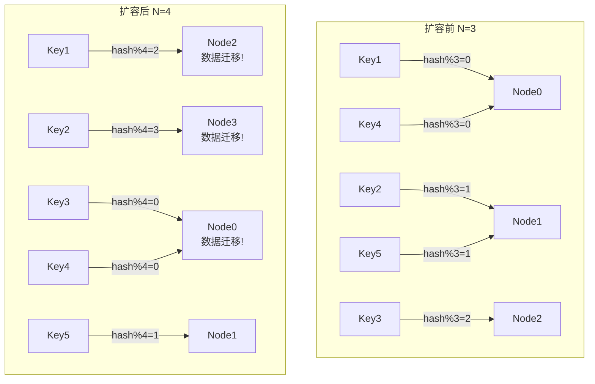
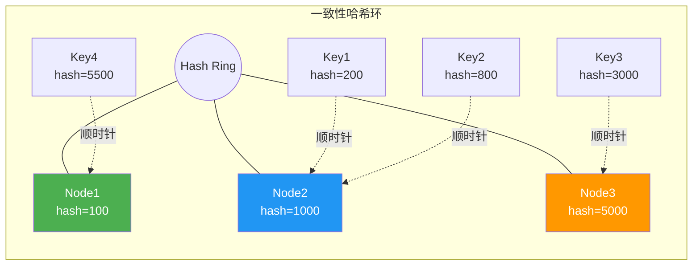
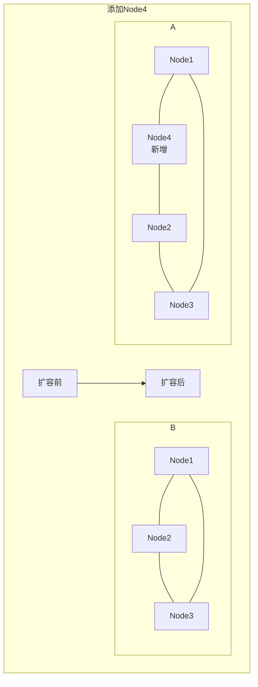
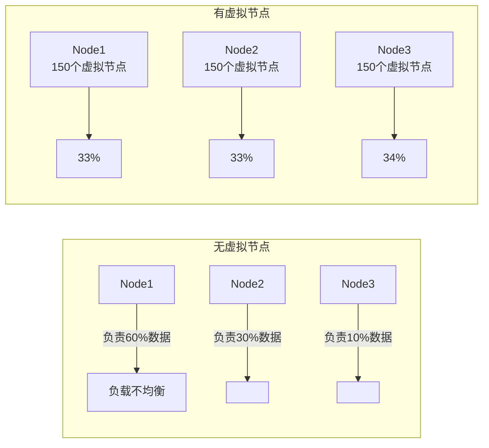
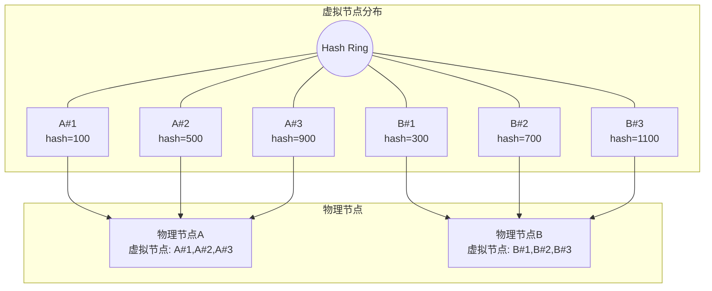
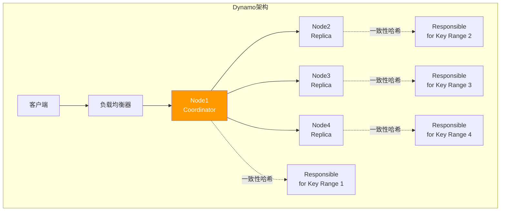
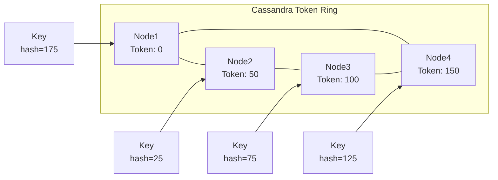

# 一致性哈希算法详解

> 分布式系统中实现数据均匀分布与最小化重分布的高效哈希算法

---

## 📋 目录

- [1. 传统哈希的问题](#1-传统哈希的问题)
- [2. 一致性哈希原理](#2-一致性哈希原理)
- [3. 虚拟节点机制](#3-虚拟节点机制)
- [4. 形式化分析](#4-形式化分析)
- [5. 实现代码](#5-实现代码)
- [6. 应用案例](#6-应用案例)

---

## 1. 传统哈希的问题

### 1.1 取模哈希的缺陷

传统哈希使用取模运算来确定数据存储位置：

$$
node = hash(key) \mod N
$$

其中 $N$ 是节点数量。

**问题分析**：



**数据迁移比例**：

当节点从 $N$ 增加到 $N+1$ 时，数据迁移比例为：

$$
P_{\text{migration}} = 1 - \frac{N}{N+1} = \frac{1}{N+1}
$$

对于 $N=3$ 扩容到 $N=4$，迁移比例约为 $75\%$！

### 1.2 一致性哈希的解决方案

一致性哈希（Consistent Hashing）将节点和数据映射到同一个哈希环上，当节点变化时只影响相邻数据。

```
┌─────────────────────────────────────────────────────────────┐
│                       一致性哈希环                            │
│                      [0, 2^32-1]                            │
├─────────────────────────────────────────────────────────────┤
│                                                             │
│    hash("Node1")=100M                                       │
│         │                                                   │
│         ▼                                                   │
│    ┌─────────┐                                              │
│    │  Node1  │◄────── Key1, Key2, Key3                      │
│    └────┬────┘                                              │
│         │                                                   │
│    hash("Node2")=1.5B                                       │
│         ▼                                                   │
│    ┌─────────┐                                              │
│    │  Node2  │◄────── Key4, Key5, Key6                      │
│    └────┬────┘                                              │
│         │                                                   │
│    hash("Node3")=3B                                         │
│         ▼                                                   │
│    ┌─────────┐                                              │
│    │  Node3  │◄────── Key7, Key8, Key9                      │
│    └─────────┘                                              │
│                                                             │
│    添加Node4后，仅影响Node1~Node4之间的Key                    │
│    迁移比例 ≈ 1/(N+1) = 25% (N=3)                           │
│                                                             │
└─────────────────────────────────────────────────────────────┘
```

---

## 2. 一致性哈希原理

### 2.1 哈希环模型

**形式化定义**：

设哈希函数 $h: \mathcal{K} \to [0, M)$，其中：

- $\mathcal{K}$ 是键空间
- $M = 2^{32}$ 或 $2^{64}$ 是哈希空间大小
- 节点集合 $N = \{n_1, n_2, ..., n_k\}$
- 数据键集合 $K = \{k_1, k_2, ..., k_m\}$

**映射规则**：

对于任意键 $k \in K$，其负责节点为：

$$
node(k) = \arg\min_{n \in N} \{ (h(n) - h(k)) \mod M \}
$$

即顺时针方向最近的节点。



### 2.2 节点增删的影响



**添加节点 $n_{new}$**：

仅影响区间 $(h(pred(n_{new})), h(n_{new})]$ 内的键，迁移比例为：

$$
P_{\text{add}} = \frac{1}{|N| + 1}
$$

**删除节点 $n_{del}$**：

该节点的所有键迁移到后继节点，迁移比例为：

$$
P_{\text{remove}} = \frac{1}{|N|}
$$

---

## 3. 虚拟节点机制

### 3.1 数据倾斜问题

当物理节点数量较少时，哈希分布可能不均匀，导致：

- 某些节点负载过高
- 节点故障时负载全部转移到单个节点



### 3.2 虚拟节点原理

每个物理节点对应多个虚拟节点，将虚拟节点均匀分布在哈希环上。

**形式化定义**：

设虚拟节点数 $v$ 每物理节点，虚拟节点集合：

$$
V = \{n_i^{(j)} | i \in [1, k], j \in [1, v]\}
$$

其中 $n_i^{(j)}$ 表示物理节点 $n_i$ 的第 $j$ 个虚拟节点。

虚拟节点的哈希值：

$$
h(n_i^{(j)}) = hash(n_i \oplus j)
$$

**负载均衡分析**：

设总数据量为 $D$，虚拟节点数 $V = k \times v$，每个虚拟节点负责数据量约为 $D/V$。

每个物理节点负责数据量的期望：

$$
E[\text{load}(n_i)] = v \times \frac{D}{V} = \frac{D}{k}
$$

方差随着 $v$ 增大而减小（大数定律）。



---

## 4. 形式化分析

### 4.1 单调性证明

**定理**：一致性哈希满足单调性（Monotonicity），即添加节点不会导致已有键映射到其他已有节点。

**证明**：

设原有节点集合 $N$，新增节点 $n_{new}$。

对于任意键 $k$，设其原负责节点为 $node_N(k)$，新负责节点为 $node_{N \cup \{n_{new}\}}(k)$。

分两种情况：

1. **$h(k) \notin (h(pred(n_{new})), h(n_{new})]$**：

   $k$ 不在 $n_{new}$ 的责任区间内，$node_{N \cup \{n_{new}\}}(k) = node_N(k)$。

2. **$h(k) \in (h(pred(n_{new})), h(n_{new})]$**：

   $k$ 迁移到 $n_{new}$，不影响其他键的映射。

因此，添加节点只会使部分键从原节点迁移到新节点，不会导致键在已有节点间迁移。∎

### 4.2 负载均衡边界

**定理**：使用 $v$ 个虚拟节点时，任意物理节点的负载偏差以高概率有界。

设总数据量归一化为1，节点数 $k$，虚拟节点数 $v$ 每节点。

期望负载：$\mu = \frac{1}{k}$

根据Chernoff边界，负载偏离期望的概率：

$$
P\left[\left|\text{load}(n_i) - \mu\right| \geq \epsilon\mu\right] \leq 2\exp\left(-\frac{\epsilon^2 v}{3}\right)
$$

当 $v = O(\log k)$ 时，以高概率保证负载平衡。

**推荐配置**：

| 物理节点数 | 推荐虚拟节点数 |
|:---|:---|
| 1-10 | 100-150 |
| 10-50 | 50-100 |
| 50+ | 20-50 |

### 4.3 一致性哈希与传统哈希对比

| 特性 | 传统取模哈希 | 一致性哈希 |
|:---|:---|:---|
| **节点增删数据迁移** | $O(N)$ 比例 | $O(1/N)$ 比例 |
| **单调性** | ❌ 不满足 | ✅ 满足 |
| **负载均衡** | 完美均衡 | 近似均衡（可调） |
| **实现复杂度** | 低 | 中等 |
| **内存开销** | $O(1)$ | $O(k \cdot v)$ |

---

## 5. 实现代码

### 5.1 Java实现（带虚拟节点）

```java
package consistenthash;

import java.nio.charset.StandardCharsets;
import java.security.MessageDigest;
import java.security.NoSuchAlgorithmException;
import java.util.*;

/**
 * 一致性哈希实现（带虚拟节点）
 */
public class ConsistentHash<T> {

    // 虚拟节点数
    private final int virtualNodes;

    // 哈希环: 哈希值 -> 物理节点
    private final TreeMap<Long, T> ring = new TreeMap<>();

    // 物理节点集合
    private final Set<T> physicalNodes = new HashSet<>();

    // 哈希函数
    private final HashFunction hashFunction;

    public ConsistentHash(int virtualNodes, Collection<T> physicalNodes) {
        this(virtualNodes, physicalNodes, new MD5Hash());
    }

    public ConsistentHash(int virtualNodes, Collection<T> physicalNodes,
                          HashFunction hashFunction) {
        this.virtualNodes = virtualNodes;
        this.hashFunction = hashFunction;

        for (T node : physicalNodes) {
            addNode(node);
        }
    }

    /**
     * 添加物理节点
     */
    public synchronized void addNode(T node) {
        if (physicalNodes.contains(node)) {
            return;
        }

        physicalNodes.add(node);

        // 添加虚拟节点
        for (int i = 0; i < virtualNodes; i++) {
            String virtualNodeKey = node.toString() + "#" + i;
            long hash = hashFunction.hash(virtualNodeKey);
            ring.put(hash, node);
        }
    }

    /**
     * 移除物理节点
     */
    public synchronized void removeNode(T node) {
        if (!physicalNodes.contains(node)) {
            return;
        }

        physicalNodes.remove(node);

        // 移除虚拟节点
        for (int i = 0; i < virtualNodes; i++) {
            String virtualNodeKey = node.toString() + "#" + i;
            long hash = hashFunction.hash(virtualNodeKey);
            ring.remove(hash);
        }
    }

    /**
     * 获取键对应的节点
     */
    public T getNode(Object key) {
        if (ring.isEmpty()) {
            return null;
        }

        long hash = hashFunction.hash(key.toString());

        // 顺时针找到最近的节点
        Map.Entry<Long, T> entry = ring.ceilingEntry(hash);
        if (entry == null) {
            // 环尾，回到头部
            entry = ring.firstEntry();
        }

        return entry.getValue();
    }

    /**
     * 获取多个副本节点（用于复制）
     */
    public List<T> getNodes(Object key, int replicaCount) {
        if (ring.isEmpty()) {
            return Collections.emptyList();
        }

        List<T> nodes = new ArrayList<>();
        Set<T> uniqueNodes = new HashSet<>();

        long hash = hashFunction.hash(key.toString());
        Map.Entry<Long, T> entry = ring.ceilingEntry(hash);

        if (entry == null) {
            entry = ring.firstEntry();
        }

        while (uniqueNodes.size() < replicaCount && uniqueNodes.size() < physicalNodes.size()) {
            T node = entry.getValue();
            if (uniqueNodes.add(node)) {
                nodes.add(node);
            }

            // 下一个虚拟节点
            entry = ring.higherEntry(entry.getKey());
            if (entry == null) {
                entry = ring.firstEntry();
            }
        }

        return nodes;
    }

    /**
     * 获取节点统计信息
     */
    public Map<String, Object> getStats() {
        Map<String, Object> stats = new HashMap<>();
        stats.put("physicalNodes", physicalNodes.size());
        stats.put("virtualNodes", ring.size());
        stats.put("replicationFactor", virtualNodes);

        // 统计每个物理节点的虚拟节点数
        Map<T, Integer> virtualNodeCount = new HashMap<>();
        for (T node : ring.values()) {
            virtualNodeCount.merge(node, 1, Integer::sum);
        }
        stats.put("distribution", virtualNodeCount);

        return stats;
    }

    /**
     * 哈希函数接口
     */
    public interface HashFunction {
        long hash(String key);
    }

    /**
     * MD5哈希实现
     */
    public static class MD5Hash implements HashFunction {
        private MessageDigest md5;

        public MD5Hash() {
            try {
                md5 = MessageDigest.getInstance("MD5");
            } catch (NoSuchAlgorithmException e) {
                throw new RuntimeException(e);
            }
        }

        @Override
        public long hash(String key) {
            md5.reset();
            md5.update(key.getBytes(StandardCharsets.UTF_8));
            byte[] digest = md5.digest();

            // 取前8字节作为long
            long hash = 0;
            for (int i = 0; i < 8; i++) {
                hash = (hash << 8) | (digest[i] & 0xFF);
            }
            return hash;
        }
    }

    /**
     * MurmurHash实现（推荐，分布更均匀）
     */
    public static class MurmurHash implements HashFunction {
        @Override
        public long hash(String key) {
            return murmurHash64(key.getBytes(StandardCharsets.UTF_8));
        }

        private long murmurHash64(byte[] data) {
            int length = data.length;
            long m = 0xc6a4a7935bd1e995L;
            int r = 47;

            long h = length * m;

            int length8 = length / 8;
            for (int i = 0; i < length8; i++) {
                int i8 = i * 8;
                long k = ((long) data[i8] & 0xff)
                        | (((long) data[i8 + 1] & 0xff) << 8)
                        | (((long) data[i8 + 2] & 0xff) << 16)
                        | (((long) data[i8 + 3] & 0xff) << 24)
                        | (((long) data[i8 + 4] & 0xff) << 32)
                        | (((long) data[i8 + 5] & 0xff) << 40)
                        | (((long) data[i8 + 6] & 0xff) << 48)
                        | (((long) data[i8 + 7] & 0xff) << 56);

                k *= m;
                k ^= k >>> r;
                k *= m;

                h ^= k;
                h *= m;
            }

            // 处理剩余字节
            switch (length % 8) {
                case 7: h ^= (long) (data[(length & ~7) + 6] & 0xff) << 48;
                case 6: h ^= (long) (data[(length & ~7) + 5] & 0xff) << 40;
                case 5: h ^= (long) (data[(length & ~7) + 4] & 0xff) << 32;
                case 4: h ^= (long) (data[(length & ~7) + 3] & 0xff) << 24;
                case 3: h ^= (long) (data[(length & ~7) + 2] & 0xff) << 16;
                case 2: h ^= (long) (data[(length & ~7) + 1] & 0xff) << 8;
                case 1: h ^= (long) (data[length & ~7] & 0xff);
                    h *= m;
            }

            h ^= h >>> r;
            h *= m;
            h ^= h >>> r;

            return h;
        }
    }

    // 测试
    public static void main(String[] args) {
        List<String> nodes = Arrays.asList("Node1", "Node2", "Node3");
        ConsistentHash<String> hashRing = new ConsistentHash<>(150, nodes);

        // 测试数据分布
        Map<String, Integer> distribution = new HashMap<>();
        for (int i = 0; i < 10000; i++) {
            String key = "key" + i;
            String node = hashRing.getNode(key);
            distribution.merge(node, 1, Integer::sum);
        }

        System.out.println("数据分布: " + distribution);
        System.out.println("统计信息: " + hashRing.getStats());

        // 测试节点增删
        System.out.println("\n添加Node4...");
        hashRing.addNode("Node4");

        // 计算数据迁移比例
        int migrated = 0;
        for (int i = 0; i < 10000; i++) {
            String key = "key" + i;
            String oldNode = distribution.containsKey("Node4") ?
                hashRing.getNode(key) : "Node1"; // 简化计算
            String newNode = hashRing.getNode(key);
            if (!oldNode.equals(newNode)) {
                migrated++;
            }
        }
        System.out.println("数据迁移比例: " + (migrated / 100.0) + "%");
    }
}
```

### 5.2 Go实现

```go
package consistenthash

import (
 "hash/crc32"
 "sort"
 "strconv"
 "sync"
)

// Hash 哈希函数类型
type Hash func(data []byte) uint32

// Map 一致性哈希
type Map struct {
 hash     Hash
 replicas int            // 虚拟节点倍数
 keys     []int          // 排序后的哈希环
 hashMap  map[int]string // 虚拟节点哈希 -> 物理节点
 mu       sync.RWMutex
}

// New 创建一致性哈希实例
func New(replicas int, fn Hash) *Map {
 m := &Map{
  replicas: replicas,
  hash:     fn,
  hashMap:  make(map[int]string),
 }
 if m.hash == nil {
  m.hash = crc32.ChecksumIEEE
 }
 return m
}

// Add 添加物理节点
func (m *Map) Add(nodes ...string) {
 m.mu.Lock()
 defer m.mu.Unlock()

 for _, node := range nodes {
  // 添加虚拟节点
  for i := 0; i < m.replicas; i++ {
   hash := int(m.hash([]byte(strconv.Itoa(i) + node)))
   m.keys = append(m.keys, hash)
   m.hashMap[hash] = node
  }
 }
 sort.Ints(m.keys)
}

// Remove 移除物理节点
func (m *Map) Remove(node string) {
 m.mu.Lock()
 defer m.mu.Unlock()

 for i := 0; i < m.replicas; i++ {
  hash := int(m.hash([]byte(strconv.Itoa(i) + node)))
  idx := sort.Search(len(m.keys), func(i int) bool {
   return m.keys[i] >= hash
  })
  if idx < len(m.keys) && m.keys[idx] == hash {
   m.keys = append(m.keys[:idx], m.keys[idx+1:]...)
   delete(m.hashMap, hash)
  }
 }
}

// Get 获取键对应的节点
func (m *Map) Get(key string) string {
 m.mu.RLock()
 defer m.mu.RUnlock()

 if len(m.keys) == 0 {
  return ""
 }

 hash := int(m.hash([]byte(key)))

 // 二分查找顺时针最近的节点
 idx := sort.Search(len(m.keys), func(i int) bool {
  return m.keys[i] >= hash
 })

 if idx == len(m.keys) {
  idx = 0
 }

 return m.hashMap[m.keys[idx]]
}

// GetAll 获取所有物理节点
func (m *Map) GetAll() []string {
 m.mu.RLock()
 defer m.mu.RUnlock()

 nodeSet := make(map[string]struct{})
 for _, node := range m.hashMap {
  nodeSet[node] = struct{}{}
 }

 nodes := make([]string, 0, len(nodeSet))
 for node := range nodeSet {
  nodes = append(nodes, node)
 }
 return nodes
}

// GetReplicas 获取副本节点
func (m *Map) GetReplicas(key string, n int) []string {
 m.mu.RLock()
 defer m.mu.RUnlock()

 if len(m.keys) == 0 || n <= 0 {
  return nil
 }

 hash := int(m.hash([]byte(key)))
 idx := sort.Search(len(m.keys), func(i int) bool {
  return m.keys[i] >= hash
 })

 result := make([]string, 0, n)
 seen := make(map[string]struct{})

 for len(result) < n && len(seen) < len(m.hashMap)/m.replicas {
  if idx >= len(m.keys) {
   idx = 0
  }
  node := m.hashMap[m.keys[idx]]
  if _, ok := seen[node]; !ok {
   seen[node] = struct{}{}
   result = append(result, node)
  }
  idx++
 }

 return result
}
```

---

## 6. 应用案例

### 6.1 Dynamo（Amazon）



**Dynamo的一致性哈希特性**：

- **虚拟节点**：每个物理节点对应多个虚拟节点（通常100-200个）
- **N副本策略**：每个键存储在哈希环上顺时针的N个节点
- **Hinted Handoff**：临时故障时数据转发到下一节点

### 6.2 Cassandra



**Cassandra的一致性哈希实现**：

- **MurMur3Partitioner**：64位token环
- **虚拟节点（vnodes）**：默认256个token每节点
- **数据中心感知**：考虑机架和数据中心的拓扑

---

## 参考资料

1. Karger, D., Lehman, E., Leighton, T., et al. (1997). "Consistent hashing and random trees: distributed caching protocols for relieving hot spots on the World Wide Web". ACM STOC.
2. DeCandia, G., Hastorun, D., Jampani, M., et al. (2007). "Dynamo: amazon's highly available key-value store". ACM SOSP.
3. Lakshman, A., & Malik, P. (2010). "Cassandra: a decentralized structured storage system". ACM SIGOPS Operating Systems Review.

## 相关主题

- [一致性哈希](./一致性哈希.md) - 基础概念文档
- [分片策略详解](./分片策略详解.md) - 数据分片策略
- [Cassandra深度分析](./nosql/Cassandra深度分析.md) - 一致性哈希应用案例
- [虚拟分片](./虚拟分片.md) - 虚拟分片技术

---

**文档版本**：v1.0
**最后更新**：2026-04-04
**作者**：分布式计算知识库团队
