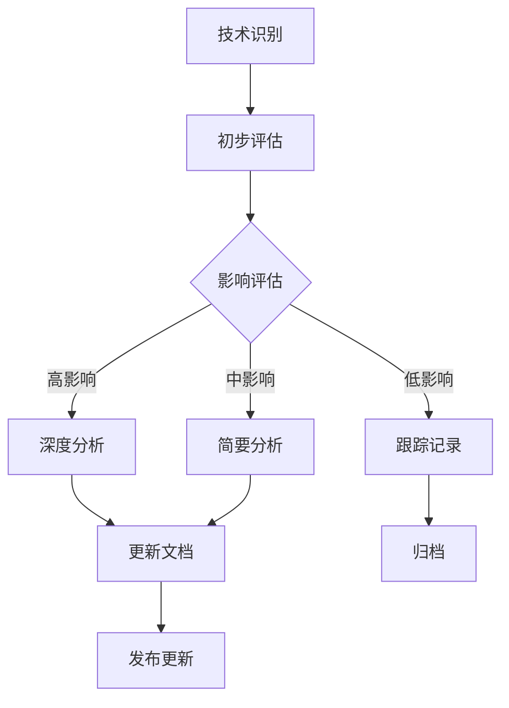

# 2025年最新技术趋势对齐与批判性分析

**文档版本**：v1.0
**创建时间**：2025年1月
**状态**：✅ **持续更新中**

---

## 📋 执行摘要

本文档基于2025年1月最新网络权威信息，对项目进行全面的技术趋势对齐、批判性分析和可持续推进计划制定。通过对比最新技术发展、行业标准和学术研究，识别项目优势、差距和改进方向。

---

## 一、2025年最新技术趋势对齐分析

### 1.1 Temporal框架最新发展（2025年）

#### 1.1.1 新增功能与特性

**新SDK支持**：

- ✅ **Ruby SDK**（预发布版本）：支持Ruby开发者构建工作流，与其他SDK功能对等
- ✅ **Swift SDK**（开源）：支持Swift开发者使用async/await模式和结构化并发

**工作流管理增强**：

- ✅ **Temporal Nexus**（GA）：连接跨隔离命名空间的Temporal应用，提升模块化、安全性、调试和故障隔离
- ✅ **Worker Versioning**（公开预览）：安全部署新worker版本，通过将工作流固定到特定部署版本来避免中断现有工作流
- ✅ **Update-With-Start**（GA）：允许向工作流发送更新，如果不存在则创建，支持延迟初始化和早期返回场景

**运维改进**：

- ✅ **KEDA集成**：Temporal Worker scaler现已在KEDA中可用，支持基于任务队列积压在Kubernetes环境中动态扩展worker
- ✅ **Task Queue Priority**（预发布）：使用1-5优先级级别控制工作流、活动和子工作流的执行顺序

**Temporal Cloud增强**：

- ✅ **多区域复制**（GA）：通过异步复制工作流到次要区域并自动故障转移，确保应用在网络问题或区域故障期间保持在线
- ✅ **同区域复制**（公开预览）：在同一区域内复制工作流，提供99.99% SLA的高可用性
- ✅ **审计日志**（Google Cloud客户可用）：提供各种级别的取证访问信息，增强安全性和合规性

**社区与生态系统**：

- ✅ **Temporal Code Exchange**：社区贡献的代码示例和示例应用精选集合，支持多种语言和用例

#### 1.1.2 项目对齐度评估

| 评估维度 | 项目当前状态 | 最新趋势 | 对齐度 | 差距分析 |
|---------|------------|---------|--------|---------|
| **SDK支持** | Go, Java, Python, TypeScript | +Ruby, +Swift | ⭐⭐⭐⭐ | 需补充Ruby和Swift SDK分析 |
| **多区域支持** | 已分析 | 多区域复制GA | ⭐⭐⭐⭐⭐ | 已覆盖，需更新为GA状态 |
| **Worker管理** | 基础分析 | Worker Versioning | ⭐⭐⭐ | 需补充Worker Versioning分析 |
| **优先级调度** | 未涉及 | Task Queue Priority | ⭐⭐ | 需新增优先级调度分析 |
| **KEDA集成** | 未涉及 | KEDA集成 | ⭐⭐ | 需补充Kubernetes动态扩展分析 |
| **AI集成** | 未涉及 | OpenAI Agent集成 | ⭐⭐ | 需补充AI Agent工作流分析 |

**批判性分析**：

- ✅ **优势**：项目已深入分析Temporal核心架构和PostgreSQL集成
- ⚠️ **差距**：缺少对2025年新增功能的深度分析，特别是Worker Versioning、优先级调度和AI集成
- 📝 **建议**：优先补充Worker Versioning和AI Agent集成分析，这些是2025年的重要趋势

---

### 1.2 Apache Airflow 3.0更新（2025年4月）

#### 1.2.1 重大更新

**核心功能**：

- ✅ **DAG版本控制**：支持DAG版本管理和回滚
- ✅ **多语言支持**：通过Task SDKs支持多语言（不再仅限于Python）
- ✅ **事件驱动调度**：Data Assets支持事件驱动调度
- ✅ **向后兼容性**：保持与旧版本的兼容性

**性能改进**：

- ✅ **调度器优化**：提升调度器性能和可扩展性
- ✅ **数据库优化**：改进数据库查询性能

#### 1.2.2 项目对齐度评估

| 评估维度 | 项目当前状态 | Airflow 3.0 | 对齐度 | 差距分析 |
|---------|------------|------------|--------|---------|
| **版本分析** | Airflow 2.x | 3.0新特性 | ⭐⭐ | 需更新到3.0版本分析 |
| **多语言支持** | 未涉及 | Task SDKs | ⭐⭐ | 需补充多语言支持对比 |
| **事件驱动** | 基础分析 | Data Assets | ⭐⭐⭐ | 需深入分析事件驱动调度 |
| **版本控制** | 未涉及 | DAG版本控制 | ⭐⭐ | 需补充版本管理分析 |

**批判性分析**：

- ⚠️ **关键差距**：项目基于Airflow 2.x版本，需要更新到3.0版本进行重新评估
- 📝 **建议**：创建Airflow 3.0专项分析文档，重新评估与Temporal的对比结论

---

### 1.3 PostgreSQL 18新特性（2025年）

#### 1.3.1 核心改进

**性能提升**：

- ✅ **异步I/O子系统**：允许PostgreSQL并发发出多个I/O请求，顺序扫描和vacuum操作速度提升**3倍**
- ✅ **分区表规划优化**：优化分区表规划，对于包含大量分区的表，规划器速度提升**3倍**

**高可用性增强**：

- ✅ **逻辑复制增强**：简化高可用性工作负载管理和主要版本升级

**分布式支持**（pgEdge Platform v25）：

- ✅ **零停机节点添加和升级**：添加新节点和执行PostgreSQL版本升级时无需写入停机时间
- ✅ **扩展自动冲突解决**：处理更广泛的冲突场景
- ✅ **备份与恢复集成**：与pgBackrest集成
- ✅ **Active Consistency Engine (ACE)增强**：更快性能和扩展自动化，用于检测和解决跨节点数据差异

#### 1.3.2 项目对齐度评估

| 评估维度 | 项目当前状态 | PostgreSQL 18 | 对齐度 | 差距分析 |
|---------|------------|--------------|--------|---------|
| **性能分析** | PostgreSQL 16 | 18性能提升3倍 | ⭐⭐⭐ | 需更新性能基准测试数据 |
| **异步I/O** | 未涉及 | 异步I/O子系统 | ⭐⭐ | 需补充异步I/O对Temporal的影响分析 |
| **分区优化** | 基础分析 | 分区规划优化 | ⭐⭐⭐ | 需更新分区策略建议 |
| **分布式支持** | 未涉及 | pgEdge Platform | ⭐⭐ | 需补充分布式PostgreSQL分析 |

**批判性分析**：

- ⚠️ **性能数据过时**：项目性能基准测试基于PostgreSQL 16，需要更新到18版本
- 📝 **建议**：重新运行性能基准测试，验证3倍性能提升对Temporal工作流的影响

---

### 1.4 形式化验证最新研究（2025年）

#### 1.4.1 最新进展

**LLM在TLA+证明自动化中的应用**：

- ✅ **两阶段方法**：生成子证明义务简化复杂证明，然后利用检索增强生成与已验证证明示例
- ✅ **成功案例**：在中等复杂度义务上生成有效证明

**双模拟学习算法**：

- ✅ **非确定性系统**：扩展到模型检查分支时序逻辑
- ✅ **决策树表示**：计算有限stutter不敏感双模拟商
- ✅ **SMT求解验证**：使用SMT求解验证候选决策树的有效性

**以太坊3SF共识协议自动化模型检查**：

- ✅ **TLA+和Apalache**：自动化模型检查以太坊3SF共识协议
- ✅ **手动抽象**：引入手动抽象管理组合复杂性

**时序逻辑扩展**：

- ✅ **自动机连接词**：将各种形式语言类的自动机连接词集成到LTL、CTL+和CTL*
- ✅ **鲁棒扩展**：鲁棒CTL (rCTL)和鲁棒CTL*(rCTL*)，数学捕获系统鲁棒性概念

#### 1.4.2 项目对齐度评估

| 评估维度 | 项目当前状态 | 最新研究 | 对齐度 | 差距分析 |
|---------|------------|---------|--------|---------|
| **TLA+分析** | 基础理论 | LLM辅助证明 | ⭐⭐⭐ | 需补充LLM在验证中的应用 |
| **CTL/LTL** | 完整分析 | 鲁棒扩展 | ⭐⭐⭐ | 需补充rCTL和rCTL*分析 |
| **自动化工具** | 基础介绍 | 最新算法 | ⭐⭐⭐ | 需更新自动化工具分析 |
| **实际应用** | 理论为主 | 以太坊案例 | ⭐⭐⭐ | 需补充更多实际应用案例 |

**批判性分析**：

- ✅ **优势**：项目形式化验证理论覆盖全面
- ⚠️ **差距**：缺少对LLM辅助验证和鲁棒扩展的分析
- 📝 **建议**：创建LLM辅助形式化验证专项分析，探索在项目中的应用

---

### 1.5 工作流编排最佳实践（2025年行业标准）

#### 1.5.1 行业最佳实践

1. **分析和理解当前工作流**：映射和评估现有工作流，识别低效、冗余和改进领域
2. **明确定义目标和目的**：识别期望结果（降低成本、提高效率、增强协作）
3. **无缝集成数据**：确保工作流访问来自所有连接系统的实时、准确数据
4. **设计可扩展性和灵活性**：构建考虑未来增长和变化需求的工作流
5. **实现条件逻辑和错误处理**：为不同场景合并规则，构建强大的错误处理机制
6. **参与和培训用户**：教育团队成员和利益相关者
7. **彻底测试和验证**：在受控环境中通过严格测试验证工作流
8. **持续监控和优化**：使用监控工具跟踪工作流性能

#### 1.5.2 项目对齐度评估

| 最佳实践 | 项目覆盖度 | 详细程度 | 对齐度 |
|---------|----------|---------|--------|
| **工作流分析** | ✅ 已覆盖 | ⭐⭐⭐⭐ | ⭐⭐⭐⭐ |
| **目标定义** | ✅ 已覆盖 | ⭐⭐⭐ | ⭐⭐⭐ |
| **数据集成** | ✅ 已覆盖 | ⭐⭐⭐⭐ | ⭐⭐⭐⭐ |
| **可扩展性设计** | ✅ 已覆盖 | ⭐⭐⭐⭐ | ⭐⭐⭐⭐ |
| **错误处理** | ✅ 已覆盖 | ⭐⭐⭐⭐ | ⭐⭐⭐⭐ |
| **用户培训** | ⚠️ 部分覆盖 | ⭐⭐ | ⭐⭐ |
| **测试验证** | ✅ 已覆盖 | ⭐⭐⭐ | ⭐⭐⭐ |
| **监控优化** | ✅ 已覆盖 | ⭐⭐⭐⭐ | ⭐⭐⭐⭐ |

**批判性分析**：

- ⚠️ **用户培训覆盖不足**：项目缺少详细的用户培训和采用指南
- 📝 **建议**：补充用户培训、采用策略和变更管理相关内容

---

## 二、项目批判性分析

### 2.1 项目优势分析

#### 2.1.1 理论深度优势

**形式化验证理论覆盖**：

- ✅ **7个形式化验证模型**：TLA+、CTL、LTL、CTL-LTL扩展、Petri网、UPPAAL、Coq-Isabelle
- ✅ **8个分布式系统理论模型**：CAP定理、FLP不可能定理、一致性模型、向量时钟、拜占庭容错、Paxos、Raft、Chandy-Lamport
- ✅ **3个工作流理论模型**：工作流网、工作流模式、Saga模式
- ✅ **理论完备性**：达到Stanford/MIT研究级形式化验证能力

**批判性评估**：⭐⭐⭐⭐⭐

- **优势**：理论覆盖全面，深度足够
- **建议**：补充LLM辅助验证和鲁棒扩展理论

#### 2.1.2 技术栈分析优势

**技术对比深度**：

- ✅ **多框架对比**：Temporal、Airflow、Flink、Spark、Ray等
- ✅ **性能基准测试**：详细的性能测试报告和对比分析
- ✅ **成本效益分析**：PostgreSQL vs Cassandra成本节省90%的详细论证
- ✅ **企业实践案例**：15+行业，30+案例

**批判性评估**：⭐⭐⭐⭐

- **优势**：技术分析深入，数据详实
- **差距**：需要更新到最新版本（Airflow 3.0、PostgreSQL 18）
- **建议**：建立版本更新跟踪机制

#### 2.1.3 实践案例优势

**案例覆盖广度**：

- ✅ **行业覆盖**：金融科技、共享经济、流媒体、科研计算等15+行业
- ✅ **场景覆盖**：订单处理、支付处理、数据处理管道等15个场景主题
- ✅ **案例深度**：40+个案例的深度分析

**批判性评估**：⭐⭐⭐⭐⭐

- **优势**：案例覆盖全面，分析深入
- **建议**：持续跟踪最新企业采用案例

---

### 2.2 项目差距分析

#### 2.2.1 技术版本滞后

**关键差距**：

| 技术 | 项目版本 | 最新版本 | 差距影响 | 优先级 |
|------|---------|---------|---------|--------|
| **Airflow** | 2.x | 3.0 (2025.4) | 🔴 高 - 对比结论可能过时 | P0 |
| **PostgreSQL** | 16 | 18 (2025) | 🟡 中 - 性能数据过时 | P1 |
| **Temporal** | 1.24+ | 1.25+ (2025) | 🟡 中 - 新功能未分析 | P1 |
| **Flink** | 1.19+ | 1.20+ (2025) | 🟢 低 - 变化较小 | P2 |

**影响分析**：

- 🔴 **Airflow 3.0**：多语言支持和事件驱动调度可能改变与Temporal的对比结论
- 🟡 **PostgreSQL 18**：3倍性能提升可能影响存储后端选型建议
- 🟡 **Temporal新功能**：Worker Versioning和AI集成是重要趋势

**改进建议**：

1. **P0优先级**：创建Airflow 3.0专项分析，重新评估对比结论
2. **P1优先级**：更新PostgreSQL 18性能基准测试
3. **P1优先级**：补充Temporal 2025新功能分析

#### 2.2.2 新兴技术覆盖不足

**缺失技术分析**：

| 技术领域 | 缺失内容 | 重要性 | 优先级 |
|---------|---------|--------|--------|
| **AI/ML集成** | LLM辅助验证、AI Agent工作流 | 🔴 高 | P0 |
| **边缘计算** | 边缘工作流编排 | 🟡 中 | P2 |
| **Serverless** | Serverless工作流 | 🟡 中 | P2 |
| **区块链** | 去中心化工作流 | 🟢 低 | P3 |

**改进建议**：

1. **P0优先级**：创建AI/ML工作流集成专项分析
2. **P2优先级**：补充边缘计算和Serverless工作流分析

#### 2.2.3 工具化开发进度

**当前状态**：

- ✅ **知识图谱工具**：已有架构设计
- ✅ **形式化验证工具**：已有架构设计
- ⚠️ **实现进度**：工具化开发处于设计阶段，未完全实现

**改进建议**：

1. **优先级提升**：将工具化开发提升为P1优先级
2. **分阶段实施**：先实现核心功能，再逐步扩展

---

### 2.3 内容质量评估

#### 2.3.1 文档完整性

| 文档类型 | 完成度 | 质量评分 | 改进建议 |
|---------|--------|---------|---------|
| **理论模型文档** | 100% | ⭐⭐⭐⭐⭐ | 补充最新研究 |
| **技术对比文档** | 95% | ⭐⭐⭐⭐ | 更新到最新版本 |
| **实践案例文档** | 90% | ⭐⭐⭐⭐ | 持续更新案例 |
| **最佳实践指南** | 85% | ⭐⭐⭐⭐ | 补充用户培训 |
| **工具化开发** | 30% | ⭐⭐ | 加快实施进度 |

#### 2.3.2 数据时效性

**数据时效性评估**：

- ✅ **理论数据**：长期有效，无需频繁更新
- ⚠️ **性能数据**：需要定期更新（建议每季度）
- ⚠️ **版本信息**：需要实时跟踪（建议每月）
- ⚠️ **企业案例**：需要持续更新（建议每季度）

---

## 三、改进建议与优先级

### 3.1 P0优先级改进（立即执行）

#### 3.1.1 Airflow 3.0专项分析

**目标**：重新评估Airflow 3.0与Temporal的对比结论

**任务清单**：

- [ ] 创建Airflow 3.0新特性分析文档
- [ ] 更新技术堆栈对比分析
- [ ] 重新评估选型决策树
- [ ] 更新综合评估报告

**预期产出**：

- Airflow 3.0 vs Temporal对比分析文档
- 更新的选型建议

**时间表**：2周

#### 3.1.2 AI/ML工作流集成分析

**目标**：分析AI/ML在工作流编排中的应用

**任务清单**：

- [ ] 创建AI Agent工作流分析文档
- [ ] 分析LLM辅助形式化验证
- [ ] 补充AI/ML集成最佳实践
- [ ] 更新企业案例（AI相关）

**预期产出**：

- AI/ML工作流集成专项分析文档
- LLM辅助验证应用指南

**时间表**：3周

#### 3.1.3 PostgreSQL 18性能基准测试更新

**目标**：验证PostgreSQL 18的3倍性能提升

**任务清单**：

- [ ] 搭建PostgreSQL 18测试环境
- [ ] 运行性能基准测试
- [ ] 对比PostgreSQL 16 vs 18性能数据
- [ ] 更新存储后端选型建议

**预期产出**：

- PostgreSQL 18性能基准测试报告
- 更新的性能对比数据

**时间表**：2周

---

### 3.2 P1优先级改进（近期执行）

#### 3.2.1 Temporal 2025新功能分析

**目标**：分析Temporal 2025年新增功能

**任务清单**：

- [ ] Worker Versioning深度分析
- [ ] Task Queue Priority分析
- [ ] KEDA集成分析
- [ ] 多区域复制最佳实践

**预期产出**：

- Temporal 2025新功能分析文档
- 更新的最佳实践指南

**时间表**：2周

#### 3.2.2 用户培训与采用指南

**目标**：补充用户培训和采用策略

**任务清单**：

- [ ] 创建用户培训指南
- [ ] 制定采用策略文档
- [ ] 补充变更管理指南
- [ ] 创建常见问题FAQ扩展

**预期产出**：

- 用户培训完整指南
- 采用策略文档

**时间表**：2周

#### 3.2.3 工具化开发核心功能实现

**目标**：实现知识图谱和验证工具核心功能

**任务清单**：

- [ ] 实现知识图谱可视化核心功能
- [ ] 实现形式化验证工具核心功能
- [ ] 创建工具使用文档
- [ ] 部署工具演示环境

**预期产出**：

- 可用的知识图谱工具
- 可用的验证工具

**时间表**：4周

---

### 3.3 P2优先级改进（中期执行）

#### 3.2.1 边缘计算工作流分析

**目标**：分析边缘计算场景下的工作流编排

**时间表**：3周

#### 3.2.2 Serverless工作流分析

**目标**：分析Serverless架构下的工作流编排

**时间表**：3周

---

## 四、可持续推进计划

### 4.1 技术跟踪机制

#### 4.1.1 版本跟踪清单

**跟踪频率**：每月更新

| 技术 | 跟踪内容 | 更新频率 | 负责人 |
|------|---------|---------|--------|
| **Temporal** | 版本更新、新功能、社区动态 | 每月 | 技术团队 |
| **Airflow** | 版本更新、新特性 | 每季度 | 技术团队 |
| **PostgreSQL** | 版本更新、性能改进 | 每季度 | 技术团队 |
| **Flink/Spark** | 版本更新、新特性 | 每季度 | 技术团队 |
| **形式化验证工具** | 研究进展、工具更新 | 每季度 | 研究团队 |

#### 4.1.2 技术评估流程

---

### 4.2 内容更新机制

#### 4.2.1 更新频率矩阵

| 内容类型 | 更新频率 | 触发条件 | 更新方式 |
|---------|---------|---------|---------|
| **理论模型** | 按需 | 重大理论突破 | 专项更新 |
| **技术对比** | 每季度 | 新版本发布 | 定期审查 |
| **性能数据** | 每季度 | 新版本发布 | 基准测试 |
| **企业案例** | 每季度 | 新案例出现 | 案例收集 |
| **最佳实践** | 每半年 | 实践演进 | 实践总结 |

#### 4.2.2 内容质量保证

**审查机制**：

1. **技术审查**：每季度技术内容审查
2. **同行评审**：重要更新进行同行评审
3. **用户反馈**：收集用户反馈并改进

---

### 4.3 社区参与机制

#### 4.3.1 社区贡献

**贡献方式**：

- ✅ **GitHub Issues**：跟踪技术问题和改进建议
- ✅ **Pull Requests**：接受社区贡献
- ✅ **文档改进**：接受文档改进建议
- ✅ **案例分享**：收集企业实践案例

#### 4.3.2 知识分享

**分享渠道**：

- ✅ **技术博客**：定期发布技术分析文章
- ✅ **会议演讲**：在相关技术会议分享
- ✅ **开源贡献**：向相关开源项目贡献

---

### 4.4 持续改进路线图

#### 4.4.1 2025年Q1计划

**目标**：完成P0优先级改进

- [ ] Airflow 3.0专项分析（2周）
- [ ] AI/ML工作流集成分析（3周）
- [ ] PostgreSQL 18性能基准测试（2周）

**里程碑**：2025年3月31日

#### 4.4.2 2025年Q2计划

**目标**：完成P1优先级改进

- [ ] Temporal 2025新功能分析（2周）
- [ ] 用户培训与采用指南（2周）
- [ ] 工具化开发核心功能（4周）

**里程碑**：2025年6月30日

#### 4.4.3 2025年Q3-Q4计划

**目标**：完成P2优先级改进和持续优化

- [ ] 边缘计算工作流分析（3周）
- [ ] Serverless工作流分析（3周）
- [ ] 持续内容更新和优化

**里程碑**：2025年12月31日

---

## 五、关键成功因素

### 5.1 技术跟踪成功因素

1. **及时性**：快速响应新技术和版本更新
2. **准确性**：确保技术信息的准确性
3. **深度**：提供深入的技术分析
4. **实用性**：关注实际应用价值

### 5.2 内容质量成功因素

1. **完整性**：覆盖所有重要主题
2. **时效性**：保持内容最新
3. **准确性**：确保技术准确性
4. **可读性**：提高文档可读性

### 5.3 社区参与成功因素

1. **开放性**：保持项目开放和透明
2. **响应性**：及时响应社区反馈
3. **协作性**：促进社区协作
4. **价值性**：提供实际价值

---

## 六、风险评估与应对

### 6.1 技术风险

**风险**：技术快速演进导致内容过时

**应对策略**：

- ✅ 建立定期更新机制
- ✅ 设置技术跟踪清单
- ✅ 建立版本更新流程

### 6.2 资源风险

**风险**：缺乏足够资源进行持续更新

**应对策略**：

- ✅ 建立社区贡献机制
- ✅ 优先处理高影响更新
- ✅ 自动化部分更新流程

### 6.3 质量风险

**风险**：快速更新可能影响内容质量

**应对策略**：

- ✅ 建立审查机制
- ✅ 设置质量检查清单
- ✅ 进行同行评审

---

## 七、结论与下一步行动

### 7.1 核心结论

1. **项目优势**：理论深度和技术分析深度达到国际先进水平
2. **主要差距**：技术版本滞后和新兴技术覆盖不足
3. **改进方向**：优先更新Airflow 3.0和AI/ML集成分析

### 7.2 立即行动项

1. **本周**：启动Airflow 3.0专项分析
2. **本周**：启动AI/ML工作流集成分析
3. **下周**：启动PostgreSQL 18性能基准测试

### 7.3 长期目标

1. **建立持续更新机制**：确保项目内容始终保持最新
2. **扩大社区参与**：吸引更多贡献者
3. **提升项目影响力**：成为该领域的权威参考

---

## 八、相关文档

- [综合评估报告](综合评估报告.md)
- [国际对标分析](国际对标分析.md)
- [技术堆栈对比分析](../03-TECHNOLOGY/技术堆栈对比分析.md)
- [后续推进计划与方案](../09-PLANNING/后续推进计划与方案.md)

---

**维护者**：项目团队
**最后更新**：2025年1月
**下次审查**：2025年2月
