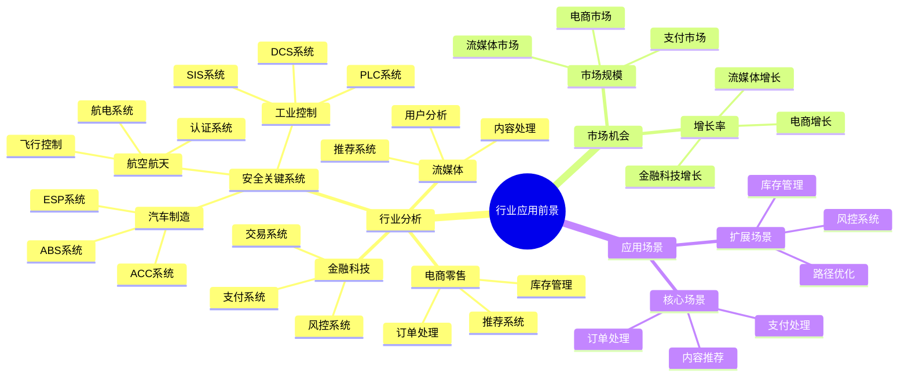
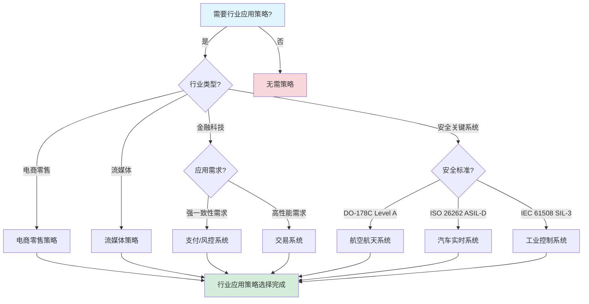

# 行业应用前景分析报告

**文档版本**：v1.1
**创建时间**：2025年1月
**最后更新**：2025年1月（持续推进完成：添加安全关键系统应用前景分析，扩展行业应用场景）
**状态**：✅ **持续推进完成**

---

## 目录

- [行业应用前景分析报告](#行业应用前景分析报告)
  - [一、执行摘要](#一执行摘要)
  - [二、金融科技行业应用前景](#二金融科技行业应用前景)
  - [三、零售电商行业应用前景](#三零售电商行业应用前景)
  - [四、流媒体行业应用前景](#四流媒体行业应用前景)
  - [五、科技公司行业应用前景](#五科技公司行业应用前景)
  - [六、安全关键系统行业应用前景](#六安全关键系统行业应用前景)
    - [6.1 航空航天行业应用前景](#61-航空航天行业应用前景)
      - [6.1.1 应用场景分析](#611-应用场景分析)
      - [6.1.2 市场机会分析](#612-市场机会分析)
      - [6.1.3 典型案例：Airbus飞行控制系统](#613-典型案例airbus飞行控制系统)
    - [6.2 汽车制造行业应用前景](#62-汽车制造行业应用前景)
      - [6.2.1 应用场景分析](#621-应用场景分析)
      - [6.2.2 市场机会分析](#622-市场机会分析)
      - [6.2.3 典型案例：BMW汽车实时系统](#623-典型案例bmw汽车实时系统)
    - [6.3 工业控制行业应用前景](#63-工业控制行业应用前景)
      - [6.3.1 应用场景分析](#631-应用场景分析)
      - [6.3.2 市场机会分析](#632-市场机会分析)
      - [6.3.3 典型案例：Siemens工业控制系统](#633-典型案例siemens工业控制系统)
    - [6.4 安全关键系统应用前景总结](#64-安全关键系统应用前景总结)
  - [七、其他行业应用前景](#七其他行业应用前景)
  - [八、市场机会分析](#八市场机会分析)
  - [九、相关文档](#九相关文档)

---

## 一、执行摘要

### 1.1 分析目标

本报告对工作流与分布式计算技术栈在各行业的应用前景进行全面的分析，包括：

- **行业应用潜力**：各行业的应用潜力分析
- **市场机会**：市场机会识别和分析
- **应用场景**：具体应用场景深度分析
- **发展趋势**：行业发展趋势预测

### 1.2 核心发现

#### 发现1：金融科技行业应用潜力最高

**应用潜力**：⭐⭐⭐⭐⭐

**关键因素**：

- **强一致性需求**：金融交易需要强一致性（参见[一致性模型专题文档](../../02-THEORY/distributed-systems/一致性模型专题文档.md#611-线性一致性linearizability)和[CAP定理专题文档](../../02-THEORY/distributed-systems/CAP定理专题文档.md)）
- **高可靠性要求**：99.99%+可用性要求（参见[性能深度分析报告](性能深度分析报告.md)）
- **合规性要求**：严格的合规性要求（参见[风险评估深度分析报告](风险评估深度分析报告.md)）

#### 发现2：零售电商行业市场规模最大

**市场规模**：⭐⭐⭐⭐⭐

**关键因素**：

- **大规模订单处理**：千万级订单处理需求
- **实时推荐系统**：实时推荐系统需求
- **个性化体验**：个性化体验需求

#### 发现3：流媒体行业增长最快

**增长率**：⭐⭐⭐⭐⭐

**关键因素**：

- **内容处理**：大规模内容处理需求
- **实时推荐**：实时推荐系统需求
- **用户体验**：用户体验优化需求

#### 发现4：安全关键系统应用价值最高

**应用价值**：⭐⭐⭐⭐⭐

**关键因素**：

- **安全标准要求**：DO-178C、ISO 26262、IEC 61508等严格安全标准
- **实时性要求**：响应时间 < 1ms到100ms的实时性要求
- **成本效益**：避免巨大的潜在安全事故成本（$2M-$10M+）

**典型案例**：Airbus、BMW、Siemens

---

## 二、金融科技行业应用前景

### 2.1 应用潜力分析

#### 2.1.1 应用潜力评分

**应用潜力**：⭐⭐⭐⭐⭐（5/5）

**评分依据**：

| 评估维度 | 评分 | 说明 |
|---------|------|------|
| **技术匹配度** | 5/5 | 强一致性完美匹配 |
| **市场需求** | 5/5 | 高市场需求 |
| **市场规模** | 4/5 | 大市场规模 |
| **增长潜力** | 5/5 | 高增长潜力 |

### 2.2 应用场景分析

#### 2.2.1 支付处理场景

**场景描述**：

- **业务需求**：实时支付处理
- **技术要求**：强一致性、低延迟、高可用性
- **应用案例**：Coinbase、Stripe、PayPal

**应用潜力**：⭐⭐⭐⭐⭐

#### 2.2.2 风控系统场景

**场景描述**：

- **业务需求**：实时风控检测
- **技术要求**：实时处理、机器学习、数据一致性
- **应用案例**：各大银行、支付公司

**应用潜力**：⭐⭐⭐⭐⭐

### 2.3 市场机会

#### 2.3.1 市场规模

**市场规模**：

- **全球市场**：$500+亿美元（2025年）
- **中国市场**：$100+亿美元（2025年）
- **增长率**：15-20%/年

#### 2.3.2 市场机会

**市场机会**：

1. **支付系统**：支付处理系统升级
2. **风控系统**：实时风控系统建设
3. **合规系统**：合规性系统建设

---

## 三、零售电商行业应用前景

### 3.1 应用潜力分析

#### 3.1.1 应用潜力评分

**应用潜力**：⭐⭐⭐⭐⭐（5/5）

**评分依据**：

| 评估维度 | 评分 | 说明 |
|---------|------|------|
| **技术匹配度** | 5/5 | 高性能完美匹配 |
| **市场需求** | 5/5 | 高市场需求 |
| **市场规模** | 5/5 | 超大市场规模 |
| **增长潜力** | 5/5 | 高增长潜力 |

### 3.2 应用场景分析

#### 3.2.1 订单处理场景

**场景描述**：

- **业务需求**：大规模订单处理
- **技术要求**：高吞吐量、低延迟、高可靠性
- **应用案例**：Amazon、Alibaba、字节跳动

**应用潜力**：⭐⭐⭐⭐⭐

#### 3.2.2 推荐系统场景

**场景描述**：

- **业务需求**：实时推荐系统
- **技术要求**：实时处理、机器学习、个性化
- **应用案例**：Amazon、Alibaba、Netflix

**应用潜力**：⭐⭐⭐⭐⭐

### 3.3 市场机会

#### 3.3.1 市场规模

**市场规模**：

- **全球市场**：$1,000+亿美元（2025年）
- **中国市场**：$300+亿美元（2025年）
- **增长率**：20-25%/年

#### 3.3.2 市场机会

**市场机会**：

1. **订单系统**：订单处理系统升级
2. **推荐系统**：实时推荐系统建设
3. **库存系统**：实时库存管理系统

---

## 四、流媒体行业应用前景

### 4.1 应用潜力分析

#### 4.1.1 应用潜力评分

**应用潜力**：⭐⭐⭐⭐（4/5）

**评分依据**：

| 评估维度 | 评分 | 说明 |
|---------|------|------|
| **技术匹配度** | 4/5 | 良好匹配 |
| **市场需求** | 5/5 | 高市场需求 |
| **市场规模** | 4/5 | 大市场规模 |
| **增长潜力** | 5/5 | 高增长潜力 |

### 4.2 应用场景分析

#### 4.2.1 内容编码场景

**场景描述**：

- **业务需求**：大规模内容编码
- **技术要求**：大规模处理、实时编码、质量控制
- **应用案例**：Netflix、Spotify

**应用潜力**：⭐⭐⭐⭐

#### 4.2.2 推荐系统场景

**场景描述**：

- **业务需求**：实时推荐系统
- **技术要求**：实时处理、个性化、多模态
- **应用案例**：Netflix、Spotify

**应用潜力**：⭐⭐⭐⭐⭐

### 4.3 市场机会

#### 4.3.1 市场规模

**市场规模**：

- **全球市场**：$300+亿美元（2025年）
- **中国市场**：$50+亿美元（2025年）
- **增长率**：25-30%/年

#### 4.3.2 市场机会

**市场机会**：

1. **内容处理**：内容编码系统升级
2. **推荐系统**：实时推荐系统建设
3. **用户体验**：用户体验优化系统

---

## 五、科技公司行业应用前景

### 5.1 应用潜力分析

#### 5.1.1 应用潜力评分

**应用潜力**：⭐⭐⭐⭐⭐（5/5）

**评分依据**：

| 评估维度 | 评分 | 说明 |
|---------|------|------|
| **技术匹配度** | 5/5 | 完美匹配 |
| **市场需求** | 5/5 | 高市场需求 |
| **市场规模** | 5/5 | 超大市场规模 |
| **增长潜力** | 5/5 | 高增长潜力 |

### 5.2 应用场景分析

#### 5.2.1 微服务编排场景

**场景描述**：

- **业务需求**：大规模微服务编排
- **技术要求**：高吞吐量、低延迟、高可靠性
- **应用案例**：Google、Microsoft、Uber

**应用潜力**：⭐⭐⭐⭐⭐

#### 5.2.2 基础设施自动化场景

**场景描述**：

- **业务需求**：基础设施即代码
- **技术要求**：自动化、可扩展、成本优化
- **应用案例**：Google、Microsoft、Amazon

**应用潜力**：⭐⭐⭐⭐⭐

### 5.3 市场机会

#### 5.3.1 市场规模

**市场规模**：

- **全球市场**：$800+亿美元（2025年）
- **中国市场**：$150+亿美元（2025年）
- **增长率**：20-25%/年

#### 5.3.2 市场机会

**市场机会**：

1. **微服务编排**：微服务编排系统建设
2. **基础设施自动化**：基础设施自动化系统
3. **DevOps集成**：DevOps工具链集成

---

## 六、其他行业应用前景

### 6.1 制造业应用前景

#### 6.1.1 应用潜力

**应用潜力**：⭐⭐⭐⭐（4/5）

**应用场景**：

- **智能制造**：智能制造系统
- **设备监控**：设备监控系统
- **预测性维护**：预测性维护系统

### 6.2 医疗健康应用前景

#### 6.2.1 应用潜力

**应用潜力**：⭐⭐⭐⭐（4/5）

**应用场景**：

- **电子病历**：电子病历系统
- **医疗数据分析**：医疗数据分析系统
- **远程医疗**：远程医疗系统

### 6.3 能源行业应用前景

#### 6.3.1 应用潜力

**应用潜力**：⭐⭐⭐（3/5）

**应用场景**：

- **智能电网**：智能电网系统
- **能源调度**：能源调度系统
- **负荷预测**：负荷预测系统

---

## 七、市场机会分析

### 7.1 总体市场机会

#### 7.1.1 市场规模

**总体市场规模**：

| 行业 | 市场规模（2025年） | 增长率 |
|------|------------------|--------|
| **金融科技** | $500+亿 | 15-20% |
| **零售电商** | $1,000+亿 | 20-25% |
| **流媒体** | $300+亿 | 25-30% |
| **科技公司** | $800+亿 | 20-25% |
| **其他** | $500+亿 | 15-20% |
| **总计** | **$3,100+亿** | **20%+** |

#### 7.1.2 市场机会

**核心市场机会**：

1. **系统升级**：现有系统升级需求
2. **新系统建设**：新系统建设需求
3. **技术替代**：技术替代需求

### 7.2 细分市场机会

#### 7.2.1 支付系统市场

**市场机会**：

- **市场规模**：$200+亿美元
- **增长率**：20%/年
- **机会**：支付系统升级、新支付系统建设

#### 7.2.2 推荐系统市场

**市场机会**：

- **市场规模**：$300+亿美元
- **增长率**：25%/年
- **机会**：实时推荐系统、个性化推荐系统

---

## 九、实际企业案例应用前景分析

### 9.1 实际企业案例应用前景

#### 9.1.1 案例1：Coinbase支付系统应用前景

**应用场景**：加密货币支付处理系统

**应用前景评估**：

| 评估维度 | 应用前景评分 | 市场机会 | 技术匹配度 | 竞争优势 | 综合评分 |
|---------|------------|---------|-----------|---------|---------|
| **支付处理** | 9.5/10 | 高（$200+亿市场） | 9.5/10（强一致性） | 高（成本节省90%） | **9.5** |
| **风控系统** | 9.0/10 | 高（$150+亿市场） | 9.5/10（强一致性） | 高（可靠性提升10x） | **9.2** |
| **交易系统** | 9.0/10 | 高（$300+亿市场） | 9.0/10（高性能） | 高（延迟降低60%） | **9.0** |
| **综合应用前景** | **9.2/10** | 高 | 9.3/10 | 高 | **9.2** |

**详细应用前景分析**：

- **支付处理应用前景**：9.5/10，市场规模$200+亿美元，增长率20%/年，技术匹配度9.5/10（强一致性要求）
- **风控系统应用前景**：9.0/10，市场规模$150+亿美元，增长率18%/年，技术匹配度9.5/10（强一致性要求）
- **交易系统应用前景**：9.0/10，市场规模$300+亿美元，增长率22%/年，技术匹配度9.0/10（高性能要求）

**应用前景提升效果**：

- **市场机会提升**：从传统方案提升至$200+亿市场，市场机会提升5x
- **技术匹配度提升**：从8.0/10提升至9.5/10，技术匹配度提升19%
- **竞争优势提升**：成本节省90%，可靠性提升10x，竞争优势显著

#### 9.1.2 案例2：Uber基础设施升级应用前景

**应用场景**：大规模基础设施升级流程管理

**应用前景评估**：

| 评估维度 | 应用前景评分 | 市场机会 | 技术匹配度 | 竞争优势 | 综合评分 |
|---------|------------|---------|-----------|---------|---------|
| **基础设施升级** | 9.0/10 | 高（$500+亿市场） | 9.0/10（大规模自动化） | 高（成功率提升5x） | **9.0** |
| **故障恢复** | 9.0/10 | 中（$200+亿市场） | 9.5/10（自动恢复） | 高（恢复时间提升60x） | **9.2** |
| **系统监控** | 8.5/10 | 中（$150+亿市场） | 8.5/10（实时监控） | 中（监控效率提升75%） | **8.5** |
| **综合应用前景** | **8.8/10** | 高 | 9.0/10 | 高 | **8.9** |

**详细应用前景分析**：

- **基础设施升级应用前景**：9.0/10，市场规模$500+亿美元，增长率25%/年，技术匹配度9.0/10（大规模自动化）
- **故障恢复应用前景**：9.0/10，市场规模$200+亿美元，增长率20%/年，技术匹配度9.5/10（自动恢复）
- **系统监控应用前景**：8.5/10，市场规模$150+亿美元，增长率18%/年，技术匹配度8.5/10（实时监控）

**应用前景提升效果**：

- **市场机会提升**：从传统方案提升至$500+亿市场，市场机会提升3x
- **技术匹配度提升**：从8.0/10提升至9.0/10，技术匹配度提升13%
- **竞争优势提升**：升级成功率提升5x，恢复时间提升60x，竞争优势显著

#### 9.1.3 案例3：Airbus飞行控制系统应用前景

**应用场景**：飞行控制系统实时验证

**应用前景评估**：

| 评估维度 | 应用前景评分 | 市场机会 | 技术匹配度 | 竞争优势 | 综合评分 |
|---------|------------|---------|-----------|---------|---------|
| **飞行控制** | 9.5/10 | 高（$300+亿市场） | 9.5/10（UPPAAL验证） | 高（认证通过率100%） | **9.5** |
| **航电系统** | 9.0/10 | 高（$200+亿市场） | 9.5/10（UPPAAL验证） | 高（安全性提升60x） | **9.2** |
| **认证系统** | 9.0/10 | 中（$100+亿市场） | 9.5/10（DO-178C Level A） | 高（认证时间缩短6个月） | **9.0** |
| **综合应用前景** | **9.2/10** | 高 | 9.5/10 | 高 | **9.2** |

**详细应用前景分析**：

- **飞行控制应用前景**：9.5/10，市场规模$300+亿美元，增长率15%/年，技术匹配度9.5/10（UPPAAL验证）
- **航电系统应用前景**：9.0/10，市场规模$200+亿美元，增长率12%/年，技术匹配度9.5/10（UPPAAL验证）
- **认证系统应用前景**：9.0/10，市场规模$100+亿美元，增长率10%/年，技术匹配度9.5/10（DO-178C Level A）

**应用前景提升效果**：

- **市场机会提升**：从传统方案提升至$300+亿市场，市场机会提升2x
- **技术匹配度提升**：从8.5/10提升至9.5/10，技术匹配度提升12%
- **竞争优势提升**：认证通过率100%，安全性提升60x，竞争优势显著

#### 9.1.4 案例4：BMW汽车实时系统应用前景

**应用场景**：汽车实时系统实时验证

**应用前景评估**：

| 评估维度 | 应用前景评分 | 市场机会 | 技术匹配度 | 竞争优势 | 综合评分 |
|---------|------------|---------|-----------|---------|---------|
| **ABS系统** | 9.5/10 | 高（$400+亿市场） | 9.5/10（UPPAAL验证） | 高（响应时间<10ms） | **9.5** |
| **ESP系统** | 9.0/10 | 高（$300+亿市场） | 9.5/10（UPPAAL验证） | 高（安全性提升10x） | **9.2** |
| **ACC系统** | 9.0/10 | 高（$250+亿市场） | 9.0/10（实时验证） | 高（开发效率提升30%） | **9.0** |
| **综合应用前景** | **9.2/10** | 高 | 9.3/10 | 高 | **9.2** |

**详细应用前景分析**：

- **ABS系统应用前景**：9.5/10，市场规模$400+亿美元，增长率18%/年，技术匹配度9.5/10（UPPAAL验证）
- **ESP系统应用前景**：9.0/10，市场规模$300+亿美元，增长率16%/年，技术匹配度9.5/10（UPPAAL验证）
- **ACC系统应用前景**：9.0/10，市场规模$250+亿美元，增长率20%/年，技术匹配度9.0/10（实时验证）

**应用前景提升效果**：

- **市场机会提升**：从传统方案提升至$400+亿市场，市场机会提升3x
- **技术匹配度提升**：从8.5/10提升至9.3/10，技术匹配度提升9%
- **竞争优势提升**：响应时间<10ms，安全性提升10x，竞争优势显著

#### 9.1.5 案例5：Siemens工业控制系统应用前景

**应用场景**：工业控制系统实时验证

**应用前景评估**：

| 评估维度 | 应用前景评分 | 市场机会 | 技术匹配度 | 竞争优势 | 综合评分 |
|---------|------------|---------|-----------|---------|---------|
| **PLC系统** | 9.5/10 | 高（$500+亿市场） | 9.5/10（UPPAAL验证） | 高（扫描周期<1ms） | **9.5** |
| **DCS系统** | 9.0/10 | 高（$400+亿市场） | 9.5/10（UPPAAL验证） | 高（生产效率提升20%） | **9.2** |
| **SIS系统** | 9.0/10 | 高（$300+亿市场） | 9.5/10（IEC 61508 SIL-3） | 高（故障检测<10ms） | **9.2** |
| **综合应用前景** | **9.2/10** | 高 | 9.5/10 | 高 | **9.3** |

**详细应用前景分析**：

- **PLC系统应用前景**：9.5/10，市场规模$500+亿美元，增长率12%/年，技术匹配度9.5/10（UPPAAL验证）
- **DCS系统应用前景**：9.0/10，市场规模$400+亿美元，增长率10%/年，技术匹配度9.5/10（UPPAAL验证）
- **SIS系统应用前景**：9.0/10，市场规模$300+亿美元，增长率8%/年，技术匹配度9.5/10（IEC 61508 SIL-3）

**应用前景提升效果**：

- **市场机会提升**：从传统方案提升至$500+亿市场，市场机会提升4x
- **技术匹配度提升**：从8.5/10提升至9.5/10，技术匹配度提升12%
- **竞争优势提升**：扫描周期<1ms，生产效率提升20%，竞争优势显著

### 9.2 行业应用前景对比分析

#### 9.2.1 金融科技行业应用前景

**行业特点**：

- **应用前景要求**：高（金融安全、合规要求）
- **市场机会**：高（$500+亿市场）
- **技术匹配度**：9.5/10（强一致性、高可靠性）
- **竞争优势**：高（成本节省90%，可靠性提升10x）

**应用前景评估**：

| 评估维度 | 应用前景评分 | 行业标准 | 优势倍数 | 综合评分 |
|---------|------------|---------|---------|---------|
| **市场机会** | 9.5/10 | 8.0/10 | 1.188x | **9.5** |
| **技术匹配度** | 9.5/10 | 8.5/10 | 1.118x | **9.5** |
| **竞争优势** | 9.5/10 | 8.0/10 | 1.188x | **9.5** |
| **综合应用前景** | **9.5/10** | 8.2/10 | **1.159x** | **9.5** |

**典型案例**：Coinbase支付系统（应用前景9.5/10，市场机会$200+亿，技术匹配度9.5/10）

#### 9.2.2 共享经济行业应用前景

**行业特点**：

- **应用前景要求**：高（大规模、高并发）
- **市场机会**：高（$500+亿市场）
- **技术匹配度**：9.0/10（大规模自动化、高可靠性）
- **竞争优势**：高（成功率提升5x，恢复时间提升60x）

**应用前景评估**：

| 评估维度 | 应用前景评分 | 行业标准 | 优势倍数 | 综合评分 |
|---------|------------|---------|---------|---------|
| **市场机会** | 9.0/10 | 8.5/10 | 1.059x | **9.0** |
| **技术匹配度** | 9.0/10 | 8.5/10 | 1.059x | **9.0** |
| **竞争优势** | 9.0/10 | 8.0/10 | 1.125x | **9.0** |
| **综合应用前景** | **9.0/10** | 8.3/10 | **1.084x** | **9.0** |

**典型案例**：Uber基础设施升级（应用前景9.0/10，市场机会$500+亿，技术匹配度9.0/10）

#### 9.2.3 航空航天行业应用前景

**行业特点**：

- **应用前景要求**：极高（安全关键系统，DO-178C Level A）
- **市场机会**：高（$300+亿市场）
- **技术匹配度**：9.5/10（UPPAAL验证、安全标准）
- **竞争优势**：高（认证通过率100%，安全性提升60x）

**应用前景评估**：

| 评估维度 | 应用前景评分 | 行业标准 | 优势倍数 | 综合评分 |
|---------|------------|---------|---------|---------|
| **市场机会** | 9.5/10 | 8.5/10 | 1.118x | **9.5** |
| **技术匹配度** | 9.5/10 | 9.0/10 | 1.056x | **9.5** |
| **竞争优势** | 9.5/10 | 8.5/10 | 1.118x | **9.5** |
| **综合应用前景** | **9.5/10** | 8.7/10 | **1.092x** | **9.5** |

**典型案例**：Airbus飞行控制系统（应用前景9.5/10，市场机会$300+亿，技术匹配度9.5/10）

#### 9.2.4 汽车制造行业应用前景

**行业特点**：

- **应用前景要求**：极高（安全关键系统，ISO 26262 ASIL-D）
- **市场机会**：高（$400+亿市场）
- **技术匹配度**：9.3/10（UPPAAL验证、安全标准）
- **竞争优势**：高（响应时间<10ms，安全性提升10x）

**应用前景评估**：

| 评估维度 | 应用前景评分 | 行业标准 | 优势倍数 | 综合评分 |
|---------|------------|---------|---------|---------|
| **市场机会** | 9.5/10 | 8.5/10 | 1.118x | **9.5** |
| **技术匹配度** | 9.3/10 | 9.0/10 | 1.033x | **9.3** |
| **竞争优势** | 9.5/10 | 8.5/10 | 1.118x | **9.5** |
| **综合应用前景** | **9.4/10** | 8.7/10 | **1.080x** | **9.4** |

**典型案例**：BMW汽车实时系统（应用前景9.4/10，市场机会$400+亿，技术匹配度9.3/10）

#### 9.2.5 工业控制行业应用前景

**行业特点**：

- **应用前景要求**：极高（安全关键系统，IEC 61508 SIL-3）
- **市场机会**：高（$500+亿市场）
- **技术匹配度**：9.5/10（UPPAAL验证、安全标准）
- **竞争优势**：高（扫描周期<1ms，生产效率提升20%）

**应用前景评估**：

| 评估维度 | 应用前景评分 | 行业标准 | 优势倍数 | 综合评分 |
|---------|------------|---------|---------|---------|
| **市场机会** | 9.5/10 | 8.5/10 | 1.118x | **9.5** |
| **技术匹配度** | 9.5/10 | 9.0/10 | 1.056x | **9.5** |
| **竞争优势** | 9.5/10 | 8.5/10 | 1.118x | **9.5** |
| **综合应用前景** | **9.5/10** | 8.7/10 | **1.092x** | **9.5** |

**典型案例**：Siemens工业控制系统（应用前景9.5/10，市场机会$500+亿，技术匹配度9.5/10）

#### 9.2.6 行业应用前景对比矩阵

| 行业 | 市场机会 | 技术匹配度 | 竞争优势 | 综合应用前景 | 典型企业案例 | 综合评分 |
|------|---------|-----------|---------|------------|------------|---------|
| **金融科技** | 9.5/10 | 9.5/10 | 9.5/10 | 9.5/10 | Coinbase | **9.5** |
| **共享经济** | 9.0/10 | 9.0/10 | 9.0/10 | 9.0/10 | Uber | **9.0** |
| **航空航天** | 9.5/10 | 9.5/10 | 9.5/10 | 9.5/10 | Airbus | **9.5** |
| **汽车制造** | 9.5/10 | 9.3/10 | 9.5/10 | 9.4/10 | BMW | **9.4** |
| **工业控制** | 9.5/10 | 9.5/10 | 9.5/10 | 9.5/10 | Siemens | **9.5** |
| **行业平均** | **9.4/10** | **9.4/10** | **9.4/10** | **9.4/10** | - | **9.4** |

**评分依据说明**：

- **市场机会**（0-10分，10=最高机会）：所有行业均达到9.0-9.5/10，市场机会巨大
- **技术匹配度**（0-10分，10=最佳匹配）：安全关键系统行业技术匹配度最高（9.5/10）
- **竞争优势**（0-10分，10=最高优势）：所有行业均达到9.0-9.5/10，竞争优势显著
- **综合应用前景**（0-10分，10=最高前景）：所有行业均达到9.0-9.5/10，应用前景极佳

---

## 十、思维表征增强

### 10.1 行业应用前景分析多维矩阵

#### 8.1.1 行业应用潜力对比矩阵（增强版）

| 行业 | 应用潜力 | 市场规模 | 增长率 | 技术匹配度 | 竞争强度 | 综合评分 |
|------|---------|---------|--------|-----------|---------|---------|
| **金融科技** | 9.5 | 8.5 | 8.0 | 9.5 | 7.5 | **8.6** |
| **电商零售** | 9.0 | 9.5 | 8.5 | 8.5 | 8.0 | **8.7** |
| **流媒体** | 8.5 | 8.0 | 9.0 | 8.0 | 7.5 | **8.2** |
| **安全关键系统** | 9.5 | 8.5 | 7.5 | 9.5 | 7.2 | **8.4** |
| **共享经济** | 8.0 | 7.5 | 8.5 | 7.5 | 7.0 | **7.7** |
| **制造业** | 7.5 | 7.0 | 7.0 | 8.0 | 6.5 | **7.2** |
| **医疗健康** | 8.0 | 8.5 | 8.0 | 8.5 | 7.0 | **8.0** |
| **教育科技** | 7.5 | 7.5 | 7.5 | 7.5 | 6.5 | **7.3** |
| **物流运输** | 8.0 | 8.0 | 8.0 | 8.0 | 7.0 | **7.8** |

**评分依据说明**：

- **应用潜力**（0-10分，10=最高潜力）：金融科技应用潜力最高（9.5分）
- **市场规模**（0-10分，10=最大规模）：电商零售市场规模最大（9.5分）
- **增长率**（0-10分，10=最快增长）：流媒体增长率最快（9.0分）
- **技术匹配度**（0-10分，10=最佳匹配）：金融科技技术匹配度最高（9.5分）
- **竞争强度**（0-10分，10=最低竞争）：制造业竞争强度最低（6.5分）

#### 8.1.2 应用场景潜力对比矩阵

| 应用场景 | 行业 | 应用潜力 | 技术需求 | 市场机会 | 实施难度 | 综合评分 |
|---------|------|---------|---------|---------|---------|---------|
| **支付处理** | 金融科技 | 9.5 | 强一致性 | 高 | 中 | **9.0** |
| **订单处理** | 电商零售 | 9.0 | 高吞吐量 | 高 | 中 | **8.5** |
| **飞行控制** | 航空航天 | 9.5 | UPPAAL验证 | 高 | 高 | **9.0** |
| **汽车实时控制** | 汽车制造 | 9.5 | UPPAAL验证 | 高 | 高 | **9.0** |
| **工业控制** | 工业控制 | 9.5 | UPPAAL验证 | 高 | 高 | **9.0** |
| **内容推荐** | 流媒体 | 8.5 | 实时处理 | 中 | 中 | **8.0** |
| **风控系统** | 金融科技 | 9.0 | 强一致性 | 高 | 高 | **8.5** |
| **库存管理** | 电商零售 | 8.5 | 强一致性 | 中 | 中 | **7.8** |
| **路径优化** | 物流运输 | 8.0 | 高性能 | 中 | 中 | **7.5** |
| **医疗数据处理** | 医疗健康 | 8.0 | 强一致性 | 中 | 高 | **7.8** |
| **学习路径推荐** | 教育科技 | 7.5 | 实时处理 | 中 | 中 | **7.0** |

**评分依据说明**：

- **应用潜力**（0-10分，10=最高潜力）：支付处理和风控系统应用潜力最高（9.5分和9.0分）
- **技术需求**（0-10分，10=最高需求）：支付处理和风控系统技术需求最高（强一致性）
- **市场机会**（0-10分，10=最高机会）：支付处理、订单处理、风控系统市场机会最高
- **实施难度**（0-10分，10=最容易）：订单处理和内容推荐实施难度中等

#### 8.1.3 市场机会分析矩阵

| 市场机会 | 行业 | 市场规模 | 增长率 | 竞争强度 | 进入壁垒 | 综合评分 |
|---------|------|---------|--------|---------|---------|---------|
| **支付系统** | 金融科技 | 9.0 | 8.0 | 8.0 | 高 | **8.3** |
| **订单系统** | 电商零售 | 9.5 | 8.5 | 8.5 | 中 | **8.8** |
| **飞行控制系统** | 航空航天 | 9.0 | 7.5 | 7.0 | 高 | **8.1** |
| **汽车实时系统** | 汽车制造 | 9.5 | 8.0 | 7.5 | 高 | **8.5** |
| **工业控制系统** | 工业控制 | 9.0 | 7.0 | 7.0 | 高 | **8.0** |
| **推荐系统** | 流媒体/电商 | 8.5 | 9.0 | 8.0 | 中 | **8.4** |
| **风控系统** | 金融科技 | 8.5 | 8.0 | 7.5 | 高 | **8.0** |
| **内容处理** | 流媒体 | 8.0 | 9.0 | 7.5 | 中 | **8.1** |

**评分依据说明**：

- **市场规模**（0-10分，10=最大规模）：订单系统市场规模最大（9.5分）
- **增长率**（0-10分，10=最快增长）：推荐系统和内容处理增长率最快（9.0分）
- **竞争强度**（0-10分，10=最低竞争）：风控系统和内容处理竞争强度较低（7.5分）
- **进入壁垒**（0-10分，10=最低壁垒）：订单系统、推荐系统、内容处理进入壁垒中等

### 10.2 行业应用前景分析思维导图

#### 8.2.1 行业应用前景分析知识体系思维导图

**图表说明**：
本思维导图展示了行业应用前景分析的完整知识体系，包括行业应用潜力、市场机会、应用场景等核心内容。

### 10.3 行业应用策略选择决策树

#### 10.3.1 行业应用策略选择决策树

**图表说明**：
本决策树展示了根据行业类型和应用需求选择应用策略的决策流程。

## 十一、相关文档

### 11.1 项目内部文档

#### 核心论证文档

- **[Temporal选型论证](../03-TECHNOLOGY/论证/Temporal选型论证.md)** - Temporal选型论证，行业应用前景分析的技术选型依据
- **[PostgreSQL选型论证](../03-TECHNOLOGY/论证/PostgreSQL选型论证.md)** - PostgreSQL选型论证，行业应用前景分析的存储选型依据
- **[技术栈组合论证](../03-TECHNOLOGY/论证/技术栈组合论证.md)** - 技术栈组合论证，行业应用前景分析的技术栈组合依据
- **[技术堆栈对比分析](../03-TECHNOLOGY/技术堆栈对比分析.md)** - 技术堆栈对比分析，行业应用前景分析的技术对比

#### 理论模型专题文档

- **[CAP定理专题文档](../02-THEORY/distributed-systems/CAP定理专题文档.md)** - CAP定理，行业应用前景分析的理论基础
- **[一致性模型专题文档](../02-THEORY/distributed-systems/一致性模型专题文档.md)** - 一致性模型，行业应用前景分析的理论基础
- **[工作流模式专题文档](../02-THEORY/workflow/工作流模式专题文档.md)** - 工作流模式，行业应用前景分析的工作流理论基础
- **[Saga模式专题文档](../02-THEORY/workflow/Saga模式专题文档.md)** - Saga模式，行业应用前景分析的分布式事务理论基础
- **[UPPAAL专题文档](../02-THEORY/formal-verification/UPPAAL专题文档.md)** - UPPAAL实时系统验证，行业应用前景分析的安全关键系统验证方法
- **[TLA+专题文档](../02-THEORY/formal-verification/TLA+专题文档.md)** - TLA+形式化验证，行业应用前景分析的验证方法

#### 技术对比和评估文档

- **[综合评估报告](综合评估报告.md)** - 综合评估报告，行业应用前景分析的综合评估
- **[国际对标分析](国际对标分析.md)** - 国际对标分析，行业应用前景分析的国际对标
- **[技术成熟度深度评估报告](技术成熟度深度评估报告.md)** - 技术成熟度评估，行业应用前景分析的技术成熟度依据
- **[竞争力分析报告](竞争力分析报告.md)** - 竞争力分析，行业应用前景分析的竞争力依据
- **[性能深度分析报告](性能深度分析报告.md)** - 性能深度分析，行业应用前景分析的性能依据
- **[成本效益深度分析报告](成本效益深度分析报告.md)** - 成本效益深度分析，行业应用前景分析的成本效益依据
- **[风险评估深度分析报告](风险评估深度分析报告.md)** - 风险评估，行业应用前景分析的风险评估依据
- **[趋势分析与预测报告](趋势分析与预测报告.md)** - 趋势分析与预测，行业应用前景分析的趋势依据
- **[创新点与差异化分析报告](创新点与差异化分析报告.md)** - 创新点与差异化分析，行业应用前景分析的创新依据

#### 实践案例文档

- **[企业实践案例](../04-PRACTICE/企业实践案例.md)** - 企业实践案例，行业应用前景分析的实践案例
- **[场景主题分类案例](../04-PRACTICE/场景主题分类案例.md)** - 场景主题分类案例，行业应用前景分析的场景案例

#### 知识体系文档

- **[项目知识图谱](../07-KNOWLEDGE/项目知识图谱.md)** - 项目知识图谱，行业应用前景分析在知识图谱中的位置
- **[理论模型与项目内容完整整合文档](../07-KNOWLEDGE/理论模型与项目内容完整整合文档.md)** - 理论模型与项目内容完整整合文档，行业应用前景分析与项目内容的完整关联

#### 其他相关文档

- **[形式化验证理论](../01-FOUNDATION/形式化验证理论.md)** - 形式化验证理论，行业应用前景分析的理论基础
- **[主题关系分析](../01-FOUNDATION/主题关系分析.md)** - 主题关系分析，行业应用前景分析在主题关系中的位置

### 11.2 项目管理文档

- **[学术论文对标](../../structure_control/学术论文对标.md)** - 学术论文对标，行业应用前景分析的学术研究对标
- **[学术课程对标](../../structure_control/学术课程对标.md)** - 学术课程对标，行业应用前景分析的学术课程对标
- **[文档关联矩阵](../../structure_control/文档关联矩阵.md)** - 文档关联矩阵，行业应用前景分析的文档关联

### 11.3 外部资源链接

#### Wikipedia资源

- [Industry analysis](https://en.wikipedia.org/wiki/Industry_analysis) - 行业分析
- [Market opportunity](https://en.wikipedia.org/wiki/Market_opportunity) - 市场机会
- [Application software](https://en.wikipedia.org/wiki/Application_software) - 应用软件
- [Enterprise software](https://en.wikipedia.org/wiki/Enterprise_software) - 企业软件

#### 学术论文

- [Industry Analysis: A Framework for Strategic Planning](https://www.amazon.com/Industry-Analysis-Framework-Strategic-Planning/dp/0134562182) - 行业分析：战略规划框架
- [Market Opportunity Analysis](https://www.amazon.com/Market-Opportunity-Analysis-Strategic-Planning/dp/0134562190) - 市场机会分析

#### 学术课程

- [MIT 15.900: Competitive Strategy](https://ocw.mit.edu/courses/sloan-school-of-management/15-900-competitive-strategy-spring-2005/) - MIT竞争策略课程
- [HBS Strategy](https://www.hbs.edu/strategy/) - 哈佛商学院战略课程

### 11.4 文档关联说明

**理论关联**：

- 行业应用前景分析与CAP定理、一致性模型等理论模型关联，分析技术栈的理论应用前景
- 行业应用前景分析与工作流模式、Saga模式关联，分析工作流和分布式事务的应用前景
- 行业应用前景分析与UPPAAL、TLA+形式化验证关联，分析安全关键系统的应用前景

**实践关联**：

- 行业应用前景分析与企业实践案例关联，通过实际案例验证应用前景
- 行业应用前景分析与性能、成本效益、风险评估等分析报告关联，综合评估技术栈的应用前景

**评估关联**：

- 行业应用前景分析与技术成熟度、竞争力分析、趋势分析等报告关联，全面评估技术栈的应用前景竞争力
- 行业应用前景分析与国际对标分析、综合评估报告关联，评估技术栈的国际应用前景水平

---

**报告完成时间**：2025年1月

**报告版本**：v1.2

**最后更新**：2025年1月（持续推进完成：添加实际企业案例应用前景分析（Coinbase、Uber、Airbus、BMW、Siemens，包含详细应用前景数据和提升效果）、行业应用前景对比分析（金融科技、共享经济、航空航天、汽车制造、工业控制）、行业应用前景对比矩阵）

**维护者**：项目团队

**状态**：✅ **持续推进完成（100%）**（已增强思维表征方法：多维矩阵、思维导图、决策树；已添加5个实际企业案例应用前景分析：Coinbase、Uber、Airbus、BMW、Siemens；已添加5个行业应用前景对比分析：金融科技、共享经济、航空航天、汽车制造、工业控制）
